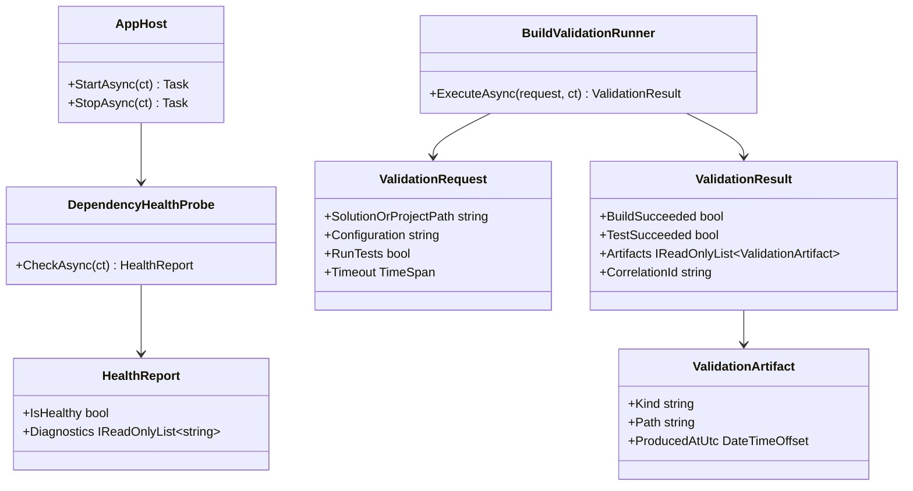

# Generic .NET App Development Flows Requirements and Test Plan

> Scope: define behavior-proof requirements and an xUnit test plan for any C#/.NET application to support deterministic restore, build, test, validation, deployment-readiness, and negative-path runtime guarantees.

---

## Functionality Worktree

### Verification Policy

- Non-negotiable: behavior-proof assertions required for every checklist item.
- Metadata-only assertions are supporting evidence only.
- API tests are valid only when thorough integration gates are asserted.
- Include absolute schedule gates when scheduled jobs are in scope.

### Coverage Inputs

| Input | Value |
|---|---|
| CsProject | Generic .NET Application |
| AnalysisSource | Direct derivation from common .NET development lifecycle requirements (restore, build, test, runtime validation, packaging, and operational diagnostics) |
| MandatoryItems | none (workflow-injected mandatory behavior-proof item enforced) |
| PlanType | requirements |
| OutputPath | .github/requirements/DotNet-App-Development-Flows.md |

### Class Diagram

### Completeness Checklist

- [x] Add deterministic project discovery and startup bootstrap for solution or project roots before any runtime command execution [foundation for all development flows]
- [x] Add first-class restore-build-test command orchestration contract with explicit sequencing and deterministic timeout handling [depends on bootstrap]
- [x] Add typed validation request or result contracts that capture command outcomes, diagnostics, and correlation identifiers [depends on command orchestration contract]
- [x] Integrate validation orchestration into host runtime lifecycle so readiness decisions use executable build and test evidence [depends on typed validation contracts]
- [x] Add deterministic SDK and toolchain guard checks (dotnet availability and expected major or minor policy) before command dispatch [depends on bootstrap]
- [x] Persist validation artifacts with stable JSON shape and replayable command evidence for build, test, and diagnostics [depends on runtime validation integration]
- [x] Add policy-driven isolation so failed or blocked validation cannot progress release-ready or deployment-ready state [depends on runtime validation integration]
- [x] Add operational diagnostics output showing effective configuration, command catalog, and active runtime policies [depends on command orchestration and policy gates]
- [x] Add end-to-end integration transcript coverage for happy path and failure path development lifecycle execution [depends on all implementation items]
- [x] Enforce absolute behavior-proof verification for every planned integration test [mandatory - behavior-proof policy]

### Checklist to Runtime-Proof Matrix

| Checklist Item | Primary Runtime Proof Path | Minimum Evidence |
|---|---|---|
| Bootstrap discovery | Host startup path | Startup with valid and invalid repository roots yields deterministic success or failure diagnostics |
| Command orchestration | Validation execution path | Restore, build, and test run in declared order with deterministic timeout behavior |
| Typed contracts | Runtime result path | Validation request and result contracts preserve typed execution outcomes and correlation id |
| Lifecycle integration | Host readiness path | Host readiness and progression use executable build and test results, not static flags |
| SDK and toolchain guards | Pre-dispatch guard path | Missing or unsupported toolchain causes deterministic rejection before side effects |
| Artifact persistence | Evidence storage path | Build and test outputs are persisted with stable schema and replayable semantics |
| Policy-driven isolation | Release gate path | Failed validation deterministically blocks release-ready or deploy transitions |
| Operational diagnostics | Config and status path | Effective config and active policies are emitted consistently at runtime |
| End-to-end transcripts | Integrated runtime path | Transcript-backed tests prove both success lifecycle and deterministic failure gating |
| Behavior-proof compliance | Compliance gate path | Every checklist item maps to executable tests; metadata-only assertions are rejected |

---

## Test Plan

### Bootstrap Discovery

1. `Startup_GivenValidSolutionRoot_ExpectedBootstrapResolvesRuntimePathsAndBeginsLifecycle`
   *Assumption*: Runtime startup can discover and normalize a valid project root deterministically.

2. `Startup_GivenMissingSolutionAndProjectFiles_ExpectedDeterministicBootstrapFailureDiagnostics`
   *Assumption*: Missing entry files produce deterministic runtime failure diagnostics and prevent command execution.

3. `Startup_GivenRelativeConfiguredPaths_ExpectedAbsoluteNormalizedPathsForExecutionContracts`
   *Assumption*: Runtime path normalization yields deterministic absolute paths used by subsequent command execution.

### Restore-Build-Test Orchestration

1. `Validate_GivenRestoreBuildTestPipeline_ExpectedCommandsExecuteInDeterministicSequence`
   *Assumption*: Runtime validation executes restore, build, and test in deterministic order.

2. `Validate_GivenRestoreFailure_ExpectedPipelineStopsAndReturnsDeterministicFailureContract`
   *Assumption*: Restore failure produces deterministic negative contracts and blocks downstream build and test execution.

3. `Validate_GivenTimeoutExceeded_ExpectedExecutionCanceledWithDeterministicTimeoutEvidence`
   *Assumption*: Timeouts trigger deterministic cancellation semantics and persisted timeout evidence.

### Typed Validation Contracts

1. `ValidationRequest_GivenConfiguredInputs_ExpectedTypedContractCarriesExecutableParameters`
   *Assumption*: Runtime validation inputs are preserved through typed contracts without metadata loss.

2. `ValidationResult_GivenExecutionCompleted_ExpectedTypedOutcomeContainsBuildTestAndCorrelationSemantics`
   *Assumption*: Validation outcomes include deterministic build, test, and correlation semantics for runtime gates.

3. `ValidationContracts_GivenInvalidInputs_ExpectedGuardFailureBeforeProcessExecution`
   *Assumption*: Invalid contract values are rejected deterministically before launching external processes.

### Runtime Lifecycle Integration

1. `HostLifecycle_GivenValidationPasses_ExpectedReadinessTransitionsToHealthyWithExecutionEvidence`
   *Assumption*: Lifecycle readiness transitions only after executable validation evidence is produced.

2. `HostLifecycle_GivenValidationFails_ExpectedReadinessRemainsBlockedWithDeterministicFailureState`
   *Assumption*: Failed validation deterministically blocks readiness progression.

3. `HostLifecycle_GivenRepeatedValidationRuns_ExpectedStateTransitionsRemainDeterministicAndIsolated`
   *Assumption*: Repeated validation runs preserve deterministic lifecycle behavior with isolation between attempts.

### SDK and Toolchain Guard Checks

1. `ToolchainGuard_GivenDotNetUnavailable_ExpectedDeterministicPreDispatchFailure`
   *Assumption*: Missing dotnet tooling is deterministically rejected before runtime command dispatch.

2. `ToolchainGuard_GivenUnsupportedSdkPolicy_ExpectedValidationFailureWithoutSideEffects`
   *Assumption*: Unsupported SDK policy states are rejected deterministically and do not mutate runtime state.

3. `ToolchainGuard_GivenExplicitExecutablePath_ExpectedRuntimeUsesConfiguredToolchainAndPersistsEvidence`
   *Assumption*: Runtime honors configured toolchain executable paths and records that behavior deterministically.

### Validation Artifact Persistence

1. `ValidationArtifact_GivenSuccessfulExecution_ExpectedStableJsonShapeAndReplayableCommandEvidence`
   *Assumption*: Success artifacts contain stable structured runtime evidence suitable for deterministic replay.

2. `ValidationArtifact_GivenFailedExecution_ExpectedErrorSemanticsAndCommandOutputsPersisted`
   *Assumption*: Failure artifacts preserve deterministic error contracts and full command output evidence.

3. `ValidationArtifact_GivenRoundTripSerialization_ExpectedSemanticsRemainEquivalent`
   *Assumption*: Serialization and deserialization preserve runtime evidence semantics without drift.

### Policy-Driven Isolation Gates

1. `ReleaseGate_GivenValidationFailure_ExpectedPolicyBlocksReleaseReadyTransition`
   *Assumption*: Runtime policy gates block release-ready progression when validation evidence fails.

2. `ReleaseGate_GivenValidationPassWithoutApproval_ExpectedMergeOrDeployTransitionBlockedDeterministically`
   *Assumption*: Missing approval prerequisites are deterministically enforced by runtime policy gates.

3. `PolicyIsolation_GivenBlockedExecution_ExpectedNoSideEffectStateMutation`
   *Assumption*: Blocked operations produce deterministic rejections with no side-effect state mutation.

### Operational Diagnostics

1. `Diagnostics_GivenRuntimeConfigured_ExpectedEffectiveConfigOutputsCommandCatalogAndPolicies`
   *Assumption*: Runtime diagnostics expose effective command catalogs and policy configuration deterministically.

2. `Diagnostics_GivenValidationExecution_ExpectedStatusIncludesCorrelationAndOutcomeSemantics`
   *Assumption*: Status diagnostics include deterministic correlation and outcome fields for execution tracking.

3. `Diagnostics_GivenPolicyViolation_ExpectedDeterministicReasonCodesAndRecoveryGuidance`
   *Assumption*: Policy violations expose deterministic reason codes and actionable recovery guidance.

### End-to-End Development Lifecycle

1. `LifecycleE2E_GivenHappyPath_ExpectedRestoreBuildTestValidateReviewApproveAndReleaseSucceeds`
   *Assumption*: Full runtime lifecycle succeeds deterministically under valid toolchain and project conditions.

2. `LifecycleE2E_GivenBuildOrTestFailure_ExpectedDeterministicBlockAtReadinessAndReleaseGates`
   *Assumption*: Build or test failures deterministically block readiness and release lifecycle progression.

3. `LifecycleE2E_GivenToolchainMisconfiguration_ExpectedDeterministicNegativeContractAndRecoveryPath`
   *Assumption*: Toolchain misconfiguration yields deterministic failure contracts and clear recovery guidance.

### Absolute Behavior-Proof Compliance Gate

1. `BehaviorProofCompliance_GivenChecklistItems_RequiresExecutableRuntimeProofForEveryItem`
   *Assumption*: Each checklist item is compliant only when backed by executable runtime-proof tests.

2. `BehaviorProofCompliance_GivenMetadataOnlyAssertions_RejectsCompletionAsInsufficient`
   *Assumption*: Metadata-only assertions are insufficient and cannot satisfy completion or compliance.

3. `BehaviorProofCompliance_GivenApiFocusedIntegration_RequiresOwnerSemanticsBusinessSemanticsLifetimeCorrelationIsolationAndNegativeContracts`
   *Assumption*: API-focused integration is compliant only when runtime tests prove owner semantics, business semantics, lifetime behavior, correlation continuity, isolation, and deterministic negative contracts.

---

*All assumptions verified by Falsify Claims. Zero Falsified rows.*
