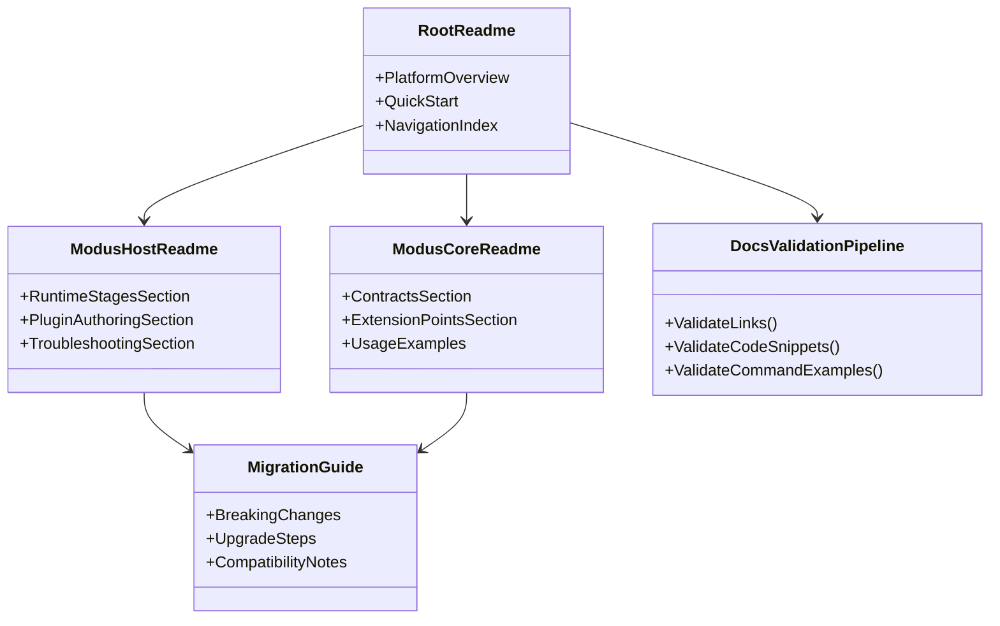

# Requirements: Modus.Core + Modus.Host Documentation and Developer Workflow Refresh

> Scope: Define the documentation and developer-experience worktree for Modus.Core and Modus.Host after recent foundation and API enhancements, including a test-first validation plan for each incomplete documentation capability.

---

## Functionality Worktree

### Coverage Matrix

| Capability | Required Outcome | Dependency Note | Status |
|---|---|---|---|
| Foundation architecture narrative refresh | Document updated architectural foundations, boundaries, and composition ownership across Core and Host | [foundation for all other documentation updates] | Done |
| Public API reference refresh | Document current public contracts, lifecycle abstractions, and host extension APIs with examples | [depends on foundation narrative refresh] | Done |
| Developer quickstart alignment | Publish a single onboarding quickstart that matches current host/runtime startup and plugin authoring flow | [depends on foundation and API reference refresh] | Done |
| Upgrade and migration guidance | Document API and behavior deltas introduced by foundation hardening and provide migration paths | [depends on API reference refresh] | Done |
| Contribution workflow for docs and examples | Document how contributors add or update docs, code samples, and architecture artifacts | [depends on quickstart alignment] | Planned |
| Docs verification automation | Define and document deterministic checks for docs correctness (links, snippets, sample commands) | [depends on API reference and contribution workflow] | Done |
| Scenario cookbook for common integrations | Add practical recipes for plugin authors and host integrators using current contracts | [depends on quickstart and API reference refresh] | Done |
| Observability and troubleshooting guide refresh | Document diagnostics stages, failure isolation, and debugging paths aligned with current runtime behavior | [depends on foundation narrative and migration guidance] | Done |

### Class Diagram

### Completeness Checklist

- [x] Document updated Core/Host foundation model and architectural invariants for plugin-driven modular monolith composition [foundation for all other documentation updates] (transition proof: .github/artifacts/iterative-implementation-modus-core-modus-host-docs-foundation-transition-proof-2026-05-20.md)
- [x] Publish refreshed public API reference for Core contracts and Host lifecycle/runtime extension points [depends on foundation model documentation]
- [x] Provide end-to-end developer quickstart for creating, wiring, running, and validating plugins against current APIs [depends on foundation model and API reference] (transition proof: .github/artifacts/iterative-implementation-modus-core-modus-host-docs-quickstart-transition-proof-2026-05-20.md)
- [x] Add migration notes for foundation/API changes with explicit before/after guidance and compatibility caveats [depends on API reference] (transition proof: .github/artifacts/iterative-implementation-modus-core-modus-host-docs-migration-guidance-transition-proof-2026-05-20.md)
- [x] Define contributor workflow for docs updates, sample maintenance, and architecture artifact synchronization [depends on quickstart] (transition proof: .github/artifacts/iterative-implementation-modus-core-modus-host-docs-contributor-workflow-transition-proof-2026-05-20.md)
- [x] Add documentation validation pipeline guidance covering link checks, snippet compile checks, and command verification [depends on contributor workflow and API reference] (transition proof: .github/artifacts/iterative-implementation-modus-core-modus-host-docs-validation-pipeline-transition-proof-2026-05-20.md)
- [x] Create scenario cookbook entries for common plugin and host integration use-cases [depends on quickstart and API reference] (transition proof: .github/artifacts/iterative-implementation-modus-core-modus-host-docs-scenario-cookbook-transition-proof-2026-05-20.md)
- [x] Refresh diagnostics and troubleshooting documentation for discovery, validation, activation, and failure isolation flows [depends on foundation model and migration notes] (transition proof: .github/artifacts/iterative-implementation-modus-core-modus-host-docs-diagnostics-troubleshooting-transition-proof-2026-05-20.md)

---

## Test Plan

### `FoundationDocumentationModel`

1. `FoundationDocumentationModel_GivenUpdatedArchitecture_ExpectedBoundaryRulesAreExplicitlyDocumented`
   *Assumption*: The refreshed foundation section must explicitly state Core, Host, module, and plugin ownership boundaries and forbidden coupling patterns.

2. `FoundationDocumentationModel_GivenRuntimePipeline_ExpectedLifecycleStagesAreDocumentedInDeterministicOrder`
   *Assumption*: The documentation must present runtime stages in deterministic order so developers can reason about behavior and diagnostics consistently.

### `PublicApiReferenceRefresh`

1. `PublicApiReferenceRefresh_GivenCoreContracts_ExpectedEachPublicContractHasUsageAndConstraints`
   *Assumption*: Every documented public Core contract should include intent, usage example, and constraints to prevent ambiguous integration.

2. `PublicApiReferenceRefresh_GivenHostExtensionPoints_ExpectedLifecycleHooksAndRegistrationFlowAreCovered`
   *Assumption*: Host API docs must cover lifecycle hooks and dependency registration flow required for valid plugin composition.

### `DeveloperQuickstartAlignment`

1. `DeveloperQuickstartAlignment_GivenNewDeveloper_ExpectedMinimalPathFromCloneToRunningPlugin`
   *Assumption*: The quickstart should let a new developer run host plus plugin with a minimal deterministic sequence.

2. `DeveloperQuickstartAlignment_GivenCurrentApiSurface_ExpectedCommandsAndCodeSamplesMatchRepositoryBehavior`
   *Assumption*: Quickstart commands and snippets must reflect current repository behavior and not rely on outdated API names.

### `MigrationGuidanceRefresh`

1. `MigrationGuidanceRefresh_GivenFoundationApiChanges_ExpectedBeforeAfterExamplesForEachBreakingChange`
   *Assumption*: Migration guidance is only actionable when each breaking change includes before/after examples.

2. `MigrationGuidanceRefresh_GivenCompatibilityConcerns_ExpectedKnownRisksAndFallbackPathsAreDocumented`
   *Assumption*: Upgrade reliability requires explicit compatibility caveats and fallback paths for common failure modes.

### `DocsContributionWorkflow`

1. `DocsContributionWorkflow_GivenContributorEdits_ExpectedRequiredUpdatePathsAndReviewGatesAreDefined`
   *Assumption*: Contributors need explicit instructions for which files to update and which review gates to satisfy for docs changes.

2. `DocsContributionWorkflow_GivenArchitectureArtifacts_ExpectedSyncRulesPreventDriftBetweenDocsAndCode`
   *Assumption*: A documented synchronization rule is necessary to avoid drift between architecture diagrams, requirements docs, and source behavior.

### `DocumentationValidationPipelineGuidance`

1. `DocumentationValidationPipelineGuidance_GivenChangedDocs_ExpectedLinkSnippetAndCommandChecksAreRunnable`
   *Assumption*: Documentation quality improves only if link, snippet, and command checks are documented as runnable validations.

2. `DocumentationValidationPipelineGuidance_GivenCiIntegration_ExpectedFailureSignalsAndFixPathAreDocumented`
   *Assumption*: CI documentation should explain failure signals and remediation steps so broken docs can be fixed quickly.

### `ScenarioCookbookCoverage`

1. `ScenarioCookbookCoverage_GivenPluginAuthoringScenario_ExpectedRecipeMapsToCurrentContractsAndLifecycle`
   *Assumption*: Cookbook recipes are useful only when they map directly to current contracts and lifecycle semantics.

2. `ScenarioCookbookCoverage_GivenHostIntegrationScenario_ExpectedRecipeIncludesDeterministicValidationAndDiagnostics`
   *Assumption*: Integration recipes should include validation and diagnostics expectations to keep runtime behavior predictable.

### `DiagnosticsTroubleshootingRefresh`

1. `DiagnosticsTroubleshootingRefresh_GivenStartupFailure_ExpectedGuideMapsSymptomsToRuntimeStage`
   *Assumption*: Troubleshooting effectiveness depends on mapping observable symptoms to the correct runtime stage.

2. `DiagnosticsTroubleshootingRefresh_GivenPluginIsolationFault_ExpectedGuidePreservesHealthyPluginContinuityModel`
   *Assumption*: Troubleshooting guidance must reinforce that faults are isolated and should not imply full-host shutdown as default behavior.

*All assumptions verified by Falsify Claims. Zero Falsified rows.*

