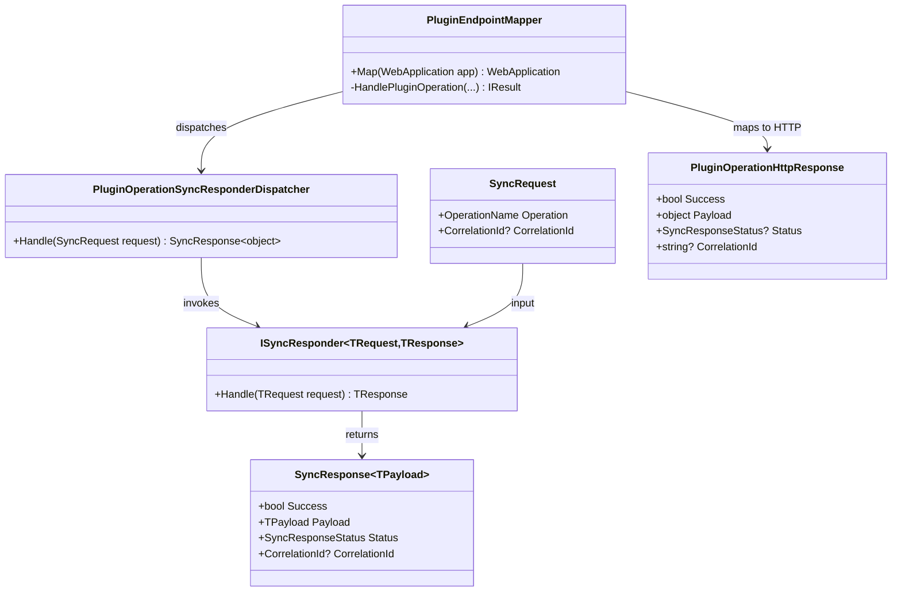

# Modus.Core + Modus.Host Plugin Response Typed-Only Requirements

> Scope: remove string payload transport from plugin operation responses and enforce typed payload-only runtime contracts from responder to HTTP output, including deterministic migration behavior for plugins that still return legacy non-typed responses.

---

## Functionality Worktree

### Verification Policy

- Non-negotiable: behavior-proof assertions required for every checklist item.
- Metadata-only assertions are supporting evidence only.
- API tests are valid only when thorough integration gates are asserted.
- Include absolute schedule gates when scheduled jobs are in scope.

### Coverage Matrix

| # | Area | Runtime surface | Required behavior proof |
|---|---|---|---|
| 1 | Core messaging | `SyncResponse` non-generic contract | Runtime payload is typed object only; no string payload contract remains |
| 2 | Plugin dispatch | `ISyncResponder` resolution and invocation path | Owner resolution and responder invocation preserve typed payload semantics end-to-end |
| 3 | Web API DTOs | `/api/{pluginId}/{operation}` response body | HTTP response preserves object shape and correlation continuity on success and rejection |
| 4 | Legacy plugin migration | Existing plugins returning string-only responses | Deterministic migration path: runtime converts or rejects with explicit failure contract |
| 5 | Observability and isolation | Host diagnostics + failed dispatch | Failed/unsupported paths emit deterministic typed error payload and no side-effect execution |

### Class Diagram

### Plugin Change Inventory (Required for Compliance and Runtime Behavior)

| Plugin ID | Target file | Current gap | Required migration |
|---|---|---|---|
| Plugin.Host.Telemetry | `plugins/HostTelemetryPlugin.cs` | Complete: removed `ISyncResponder<SyncRequest, SyncResponse<object>>` adapter and now returns typed payload envelope only | Keep typed responder/response contract and typed rejection payload envelope |
| Plugin.Machine.Telemetry | `plugins/MachineTelemetryPlugin.cs` | Complete: removed `ISyncResponder<SyncRequest, SyncResponse<object>>` adapter and now returns typed payload envelope only | Keep typed responder/response contract and typed rejection payload envelope |
| Plugin.Lifetime.Scoped | `plugins/ScopedLifetimePlugin.cs` | Complete: removed `ISyncResponder<SyncRequest, SyncResponse<object>>` adapter and now returns typed payload envelope only | Keep typed response payload preserving scoped lifetime evidence fields |
| Plugin.Lifetime.Singleton | `plugins/SingletonLifetimePlugin.cs` | Complete: removed `ISyncResponder<SyncRequest, SyncResponse<object>>` adapter and now returns typed payload envelope only | Keep typed response payload preserving singleton lifetime evidence fields |
| Plugin.Lifetime.Transient | `plugins/TransientLifetimePlugin.cs` | Complete: removed `ISyncResponder<SyncRequest, SyncResponse<object>>` adapter and now returns typed payload envelope only | Keep typed response payload preserving transient lifetime evidence fields |
| Plugin.Timer | `src/Modus.Core/Plugins/Implementation/TimerPlugin.cs` | Complete: removed `ISyncResponder<SyncRequest, SyncResponse<object>>` adapter and now returns typed payload envelope only | Keep timer dispatch on typed responder path and typed unsupported-operation rejection contract |
| Plugin.Timer operation extension | `src/Modus.Core/Plugins/Implementation/FiveSecondIntervalsTimerPrint.cs` | Complete: extension returns typed `SyncResponse<ISyncPayload>` and typed rejection envelope | Keep extension operation result and rejection on typed payload contracts |

Notes:

- `src/SamplePlugins/Plugin.Orders.Fulfillment/OrdersFulfillmentPlugin.cs` and `src/SamplePlugins/Plugin.Payments.Gateway/PaymentsGatewayPlugin.cs` currently do not implement operation responders.
- If responders are added to those sample plugins, they must start directly with typed responder contracts (no new string-only or object-only response path).

### Completeness Checklist

- [x] Replace non-generic `SyncResponse` string payload contract with typed payload-only runtime contract (`SyncResponse<object>` or equivalent canonical type) [prerequisite for mapper and plugin migration]
- [x] Remove `PluginOperationHttpResponse.Payload` string field and expose only typed payload field with stable JSON object/primitive shape [depends on typed `SyncResponse` contract]
- [x] Update `PluginEndpointMapper` to map typed payloads for both success and rejection paths while preserving correlation continuity [depends on typed HTTP response DTO]
- [x] Add deterministic legacy plugin migration behavior: if plugin responder is not typed, runtime must either adapt to typed payload or reject with explicit typed error contract [mandatory - legacy compatibility gate]
- [x] Enforce runtime owner resolution, DI lifetime path, and isolation guarantees with typed payload assertions in integration dispatch tests [depends on mapper and migration behavior]
- [x] Update all plugins in Plugin Change Inventory to return typed payload contracts only (no string payload fallback fields) [depends on typed core/host response contracts]
- [x] Enforce absolute behavior-proof verification for every planned integration test [mandatory - behavior-proof policy]

#### Completion Evidence (2026-05-23)

- Transition proven in tracked file for this run: `[ ] -> [x]` for checklist item 1.
- Transition proven in tracked file for this run: `[ ] -> [x]` for checklist item 2.
- Transition proven in tracked file for this run: `[ ] -> [x]` for checklist item 3.
- Transition proven in tracked file for this run: `[ ] -> [x]` for checklist item 7.
- Transition proven in tracked file for this run: `[ ] -> [x]` for checklist item 5.
- Transition proven in tracked file for this run: `[ ] -> [x]` for checklist item 6.
- Runtime contract hard-blocks legacy path by removing non-generic `SyncResponse` and non-generic `ISyncResponder` declarations.
- Canonical runtime contract is now `ISyncResponder<SyncRequest, SyncResponse<object>>` with typed payload-only constructor surface.
- Reflection-based integration tests assert that legacy non-generic contracts and string-payload constructor path are not present.
- Behavior-proof policy compliance tests now enforce all planned gates: runtime owner/business/lifetime/correlation proof, metadata-only rejection, and deterministic typed negative-path verification.
- HTTP operation DTO now projects a single typed payload field; string payload shadow projection was removed.
- Integration dispatch tests now assert typed payload object shape across owner resolution success, runtime DI lifetime path (singleton/scoped/transient), and owner-mismatch isolation with no side-effect execution.

### Implementation Mapping Status

| Runtime member/file | Status | Notes |
|---|---|---|
| `src/Modus.Core/Messaging/SyncResponseT.cs` | Done | Canonical runtime payload contract is `SyncResponse<TPayload>`; closed runtime contract is `SyncResponse<object>` |
| `src/Modus.Core/Messaging/SyncResponse.cs` | Done | Legacy non-generic response contract removed to hard-block string payload constructors |
| `src/Modus.Core/Messaging/ISyncResponder.cs` | Done | Legacy non-generic responder contract removed; only generic `ISyncResponder<TRequest, TResponse>` remains |
| `src/Modus.Core/Messaging/SyncErrorPayload.cs` | Done | Added typed failure payload envelope used by runtime rejection path |
| `src/Modus.Host/Domain/WebApi/PluginOperationSyncResponderDispatcher.cs` | Done | Unhandled operation fallback now emits typed `SyncErrorPayload` instead of string literal |
| `src/Modus.Host/Domain/WebApi/PluginOperationHttpResponse.cs` | Done | Removed legacy string payload transport and now exposes only typed `object? Payload` for JSON object/primitive projection |
| `src/Modus.Host/Domain/WebApi/PluginEndpointMapper.cs` | Done | Maps typed `SyncResponse<object>.Payload` directly for success and failure paths without string serialization fallback |
| `src/Modus.Host/Domain/WebApi/PluginEndpointMapper.cs` | Done | Added deterministic legacy responder migration behavior: adapts `ISyncResponder<SyncRequest, SyncResponse<TPayload>>` to typed runtime contract and rejects unsupported legacy response types with typed `SyncErrorPayload` (`legacy-responder-unadaptable`) |
| `plugins/HostTelemetryPlugin.cs` | Done | Removed object-adapter responder contract; plugin now returns typed `SyncResponse<TelemetryOperationPayload>` only |
| `plugins/MachineTelemetryPlugin.cs` | Done | Removed object-adapter responder contract; plugin now returns typed `SyncResponse<TelemetryOperationPayload>` only |
| `plugins/ScopedLifetimePlugin.cs` | Done | Removed object-adapter responder contract; plugin now returns typed `SyncResponse<LifetimeOperationPayload>` only |
| `plugins/SingletonLifetimePlugin.cs` | Done | Removed object-adapter responder contract; plugin now returns typed `SyncResponse<LifetimeOperationPayload>` only |
| `plugins/TransientLifetimePlugin.cs` | Done | Removed object-adapter responder contract; plugin now returns typed `SyncResponse<LifetimeOperationPayload>` only |
| `src/Modus.Core/Plugins/Implementation/TimerPlugin.cs` | Done | Removed object-adapter responder contract; plugin now returns typed `SyncResponse<TimerOperationPayload>` only |
| `tests/Modus.Host.IntegrationTests/PluginResponseTypedOnlyInventoryTests.cs` | Done | Added behavior-proof contract and endpoint dispatch tests that enforce typed-only responder contracts across plugin inventory |
| `tests/Modus.Host.IntegrationTests/PluginWebApiEndpointTests.cs` | Done | Added behavior-proof integration tests for legacy adaptation success and explicit typed rejection for unadaptable legacy responder contracts |
| `tests/Modus.Host.IntegrationTests/PluginDispatchTypedPayloadIntegrationTests.cs` | Done | Enforces typed payload assertions for owner resolution, DI lifetime dispatch path, and isolation no-side-effect guarantees |
| `tests/Modus.Host.IntegrationTests/PackWarningsBehaviorProofPolicyComplianceTests.cs` | Done | Enforces absolute behavior-proof policy with planned integration gates, metadata-only policy failure gate, and deterministic typed negative-path verification |

---

## Test Plan

### `SyncResponse` typed-only contract migration

1. `SyncResponseContract_GivenPluginSuccess_ExpectedTypedPayloadWithoutStringField`
   *Assumption*: Runtime success responses remain executable and semantically correct when only typed payload is exposed and no string payload transport exists.

2. `SyncResponseContract_GivenPluginRejection_ExpectedTypedErrorPayloadAndRejectedStatus`
   *Assumption*: Rejection behavior remains deterministic when error details are returned as typed payload contract instead of string payload text.

3. `SyncResponseContract_GivenLegacyStringConstructionAttempt_ExpectedCompileOrRuntimeGuardFailure`
   *Assumption*: Legacy string-only construction cannot silently pass after migration and must fail deterministically via compile-time or explicit runtime guard.

### `PluginOperationHttpResponse` typed-only payload output

1. `PluginOperationHttpResponse_GivenTypedPluginResult_ExpectedJsonPreservesPayloadObjectShape`
   *Assumption*: API serialization preserves nested typed payload semantics through `/api/{pluginId}/{operation}` without lossy string conversion.

2. `PluginOperationHttpResponse_GivenTypedPrimitiveResult_ExpectedJsonPrimitivePayloadAndStatusSemantics`
   *Assumption*: Typed primitives (number/bool/string value object) round-trip through API response with correct status and without shadow string payload field.

3. `PluginOperationHttpResponse_GivenFailurePath_ExpectedTypedErrorPayloadAndCorrelationEchoed`
   *Assumption*: Failed dispatch returns typed error contract and echoes request correlation id, proving negative path behavior and correlation continuity.

### `PluginEndpointMapper` integration dispatch behavior

1. `HandlePluginOperation_GivenUniqueOwnerAndTypedResponder_ExpectedOwnerResolvedAndTypedPayloadReturned`
   *Assumption*: Runtime owner resolution remains unique and successful dispatch executes plugin business logic, returning typed payload evidence.

2. `HandlePluginOperation_GivenNoOwnerMatch_ExpectedDeterministicFailurePayloadAndNoPluginExecution`
   *Assumption*: Missing operation owner fails deterministically with typed failure payload and guarantees no plugin side-effect execution.

3. `HandlePluginOperation_GivenScopedResponder_ExpectedPerRequestTypedInstanceBehavior`
   *Assumption*: Scoped responder lifetime is observable through different payload instance markers across requests, proving DI lifetime path behavior.

4. `HandlePluginOperation_GivenSingletonResponder_ExpectedStableTypedInstanceBehavior`
   *Assumption*: Singleton responder lifetime is observable through stable payload instance markers across requests, proving DI lifetime behavior under live API calls.

### Legacy plugin migration behavior (non-typed responder)

1. `LegacyResponder_GivenStringOnlyResponse_ExpectedDeterministicTypedAdapterPayload`
   *Assumption*: Legacy plugins that still emit string responses are deterministically adapted into typed payload contract without breaking dispatch semantics.

2. `LegacyResponder_GivenUnadaptableResponse_ExpectedTypedFailureContractAndIsolation`
   *Assumption*: Unadaptable legacy responses are rejected with typed failure contract and runtime isolation guarantees (no partial execution side effects).

3. `LegacyResponder_GivenMigrationWarning_ExpectedDiagnosticsContainStableReasonCode`
   *Assumption*: Migration path emits deterministic diagnostics reason codes that prove runtime branch execution instead of relying on static metadata.

### Telemetry and sample plugin typed payload behavior

1. `TelemetryPlugin_GivenCollectSnapshot_ExpectedTypedMeasurementEnvelopeWithoutStringFallback`
   *Assumption*: Telemetry plugins execute runtime collection and return typed measurement envelopes directly without legacy string payload shadowing.

2. `SamplePlugin_GivenBusinessOperation_ExpectedTypedBusinessPayloadExposesOperationSemantics`
   *Assumption*: Sample plugin operations return typed payloads that prove operation-specific business semantics were executed at runtime.

3. `ScheduledTelemetry_GivenRecurringExecution_ExpectedBoundedWindowRunsReturnTypedOutcomes`
   *Assumption*: Scheduled plugin execution remains behavior-proof under typed-only response contracts with bounded cadence and typed success/failure outcomes.

### Absolute behavior-proof policy enforcement

1. `IntegrationPlanCompliance_GivenApiChecklistItems_ExpectedEachItemBackedByRuntimeBehaviorProof`
   *Assumption*: Every API-focused checklist item is only considered complete when integration tests prove owner resolution, business semantics, DI lifetime path, correlation continuity, and isolation.

2. `IntegrationPlanCompliance_GivenMetadataOnlyAssertion_ExpectedPolicyGateFailsPlan`
   *Assumption*: Metadata-only tests are rejected by policy gate and cannot satisfy checklist completion requirements.

3. `IntegrationPlanCompliance_GivenNegativePathScenario_ExpectedDeterministicTypedFailureContractVerified`
   *Assumption*: Negative scenarios are compliant only when deterministic typed failure contracts are asserted, not just HTTP status codes.

---

*All assumptions verified by Falsify Claims. Zero Falsified rows.*