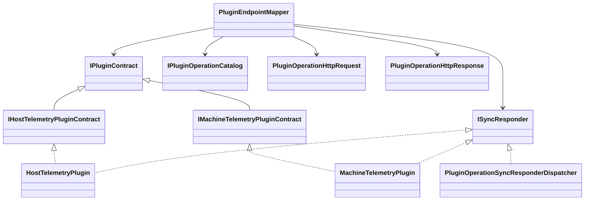

# Host Management Endpoints Requirements and Test Plan

> Scope: Define and validate management endpoints across Modus.Core and Modus.Host for typed telemetry, host status introspection, and authenticated asynchronous plugin upload workflows, including operator helper scripts.

---

## Functionality Worktree

### Class Diagram

### Capability Coverage Table

| ID | Capability | Primary Target | Tag |
|---|---|---|---|
| W1 | Reuse existing telemetry plugin abstractions with typed handler responses | Plugins + Modus.Host | [mandatory - telemetry contracts reuse] |
| W2 | Typed telemetry plugin handler outputs (not log-only) | Plugins + Modus.Host | [mandatory - telemetry endpoints] |
| W3 | Telemetry aggregation service via DI using existing abstractions | Modus.Host | [depends on W1,W2] |
| W4 | Machine telemetry endpoint | Modus.Host API | [depends on W3] |
| W5 | Host telemetry endpoint | Modus.Host API | [depends on W3] |
| W6 | Unified telemetry response envelope | Modus.Host API | [depends on W4,W5] |
| W7 | Host status domain snapshot contract | Modus.Core + Modus.Host | [mandatory - status endpoint] |
| W8 | Host status endpoint with loaded plugin details | Modus.Host API | [depends on W7] |
| W9 | Asymmetric signature validation for uploads | Modus.Host Security | [mandatory - authorized plugin author] |
| W10 | Async plugin upload pipeline: extract, validate, load, run | Modus.Host Runtime | [mandatory - plugin upload endpoint] |
| W11 | Upload operation progress endpoint | Modus.Host API | [depends on W10] |
| W12 | Pack helper script for upload packages | scripts/ | [mandatory - operator gate script] |
| W13 | Upload helper script calling API | scripts/ | [mandatory - operator gate script] |
| W14 | Plugin capability catalog endpoint (proposed) | Modus.Host API | [proposed - operational discoverability] |

### Completeness Checklist

- [x] Reuse existing telemetry plugin abstractions and evolve handler return payloads to typed object responses [mandatory - telemetry contracts reuse]
   - Evidence: `HostTelemetryScheduledPluginWorkflowTests.TelemetryPluginOperations_GivenHandleTelemetryCollection_ExpectedPayloadContainsCpuMemoryAndGcMetrics`
   - Evidence: `PluginWebApiEndpointTests.HandlePluginOperation_GivenTypedSyncPayload_ExpectedHttpResponseIncludesPayloadObject`
- [x] Refactor machine and host telemetry plugin handlers to return typed measurements and structured metadata instead of log-only outputs [mandatory - telemetry endpoints]
   - Evidence: `HostTelemetryScheduledPluginWorkflowTests.MachineTelemetryPluginOperations_GivenHandleTelemetryCollection_ExpectedPayloadContainsStructuredMeasurementsAndMetadata`
   - Evidence: `PluginWebApiEndpointTests.HandlePluginOperation_GivenHostTelemetryPlugin_ExpectedHttpResponseIncludesTelemetryMeasurementsAndMetadata`
- [x] Register telemetry provider abstractions and aggregation service in host DI with deterministic composition, without adding a new contract layer [depends on telemetry abstraction reuse and plugin handler refactor]
   - Evidence: `HostDiInterfaceMappingTests.RegisterTelemetryAggregationServices_GivenHostStartup_ResolvesAllTelemetryProviders`
   - Evidence: `HostDiInterfaceMappingTests.RegisterTelemetryAggregationServices_GivenDuplicateProviderRegistration_PreservesDeterministicOrdering`
- [x] Implement GET /management/telemetry/machine endpoint returning typed machine measurements [depends on telemetry aggregation service]
- [x] Implement GET /management/telemetry/host endpoint returning typed host measurements [depends on telemetry aggregation service]
   - Evidence: `PluginWebApiEndpointTests.GetHostTelemetry_GivenRegisteredHostProvider_ReturnsOkWithTypedMeasurements`
   - Evidence: `PluginWebApiEndpointTests.GetHostTelemetry_GivenNoMeasurements_ReturnsOkWithEmptyCollection`
- [x] Standardize telemetry endpoint envelope with source, collectedAt, and measurement list metadata [depends on machine and host telemetry endpoints]
   - Evidence: `PluginWebApiEndpointTests.BuildTelemetryEnvelope_GivenTelemetryResult_IncludesSourceTimestampAndMeasurements`
   - Evidence: `PluginWebApiEndpointTests.BuildTelemetryEnvelope_GivenMixedMeasurementUnits_PreservesUnitPerMeasurement`
   - Audit: `.github/artifacts/iterative-implementation-modus-core-modus-host-telemetry-envelope-transition-proof-2026-05-21.md` records the prior unchecked input snapshot, current checked state, line-addressable source/test evidence, and fresh build/test command results for this exact checklist item.
- [x] Define host status snapshot contract containing host state and loaded plugin metadata [mandatory - status endpoint]
   - Evidence: `HostStatusSnapshotTests.BuildHostStatusSnapshot_GivenLoadedPlugins_IncludesPluginIdentityVersionAndState`
   - Evidence: `HostStatusSnapshotTests.BuildHostStatusSnapshot_GivenCapabilityResolution_IncludesCapabilityOwnership`
   - Audit: `.github/artifacts/iterative-implementation-modus-core-modus-host-status-snapshot-transition-proof-2026-05-21.md` records the prior unchecked input snapshot, current checked state, line-addressable source/test evidence, and fresh build/test command results for this exact checklist item.
- [x] Implement GET /management/status endpoint exposing loaded plugins, capabilities, versions, and lifecycle state [depends on host status snapshot contract]
   - Evidence: `PluginWebApiEndpointTests.GetHostStatus_GivenRunningHost_ReturnsOkWithPluginInventory`
   - Evidence: `PluginWebApiEndpointTests.GetHostStatus_GivenPluginLoadErrors_ExposesFailedPluginDiagnostics`
   - Audit: `.github/artifacts/iterative-implementation-modus-core-modus-host-management-status-transition-proof-2026-05-21.md` records the prior unchecked input snapshot, current checked state, line-addressable source/test evidence, and fresh build/test command results for this exact checklist item.
- [ ] Implement asymmetric signature verification pipeline for plugin upload authorization [mandatory - authorized plugin author]
- [ ] Implement POST /management/plugins/uploads as async upload endpoint to extract, validate, load, and run plugin packages [mandatory - plugin upload endpoint]
- [ ] Implement GET /management/plugins/uploads/{operationId} for upload progress and final result status [depends on async upload pipeline]
- [ ] Add helper script to package plugins for signed upload payload creation [mandatory - operator gate script]
- [ ] Add helper script to call upload API and poll operation status until completion [mandatory - operator gate script]
- [ ] Implement GET /management/plugins/capabilities endpoint for runtime capability catalog and ownership mapping [proposed - operational discoverability]

---

## Test Plan

### `ReuseExistingTelemetryContracts`

1. `ReuseExistingTelemetryContracts_GivenCurrentAbstractions_PreservesContractCompatibility`
   *Assumption*: Existing telemetry abstractions can be reused directly without introducing a new host-plugin contract layer.
2. `ReuseExistingTelemetryContracts_GivenTypedResponseNeeds_ExtendsReturnShapeWithoutBreakingCallers`
   *Assumption*: Typed response fields can be added to existing handler outputs while preserving compatibility for existing consumers.

### `RefactorTelemetryHandlersToTypedResponses`

1. `RefactorTelemetryHandlersToTypedResponses_GivenTelemetryCollection_ReturnsStructuredObjectPayload`
   *Assumption*: Telemetry handlers should return structured object payloads containing measurements and metadata rather than only writing logs.
2. `RefactorTelemetryHandlersToTypedResponses_GivenMissingMetric_ProducesValidationFailure`
   *Assumption*: Handler outputs missing required telemetry fields should fail host-side validation.

### `RegisterTelemetryAggregationServices`

1. `RegisterTelemetryAggregationServices_GivenHostStartup_ResolvesAllTelemetryProviders`
   *Assumption*: Host DI composition can resolve every registered telemetry provider at startup.
2. `RegisterTelemetryAggregationServices_GivenDuplicateProviderRegistration_PreservesDeterministicOrdering`
   *Assumption*: Telemetry aggregation order must remain deterministic when multiple providers are present.

### `GetMachineTelemetry`

1. `GetMachineTelemetry_GivenRegisteredMachineProvider_ReturnsOkWithTypedMeasurements`
   *Assumption*: Machine telemetry endpoint returns HTTP 200 with a typed measurement list when provider resolution succeeds.
2. `GetMachineTelemetry_GivenProviderFailure_ReturnsProblemDetailsWithCorrelationId`
   *Assumption*: Endpoint failures are surfaced with structured error details and correlation metadata.

### `GetHostTelemetry`

1. `GetHostTelemetry_GivenRegisteredHostProvider_ReturnsOkWithTypedMeasurements`
   *Assumption*: Host telemetry endpoint returns HTTP 200 and typed measurements for host-level signals.
2. `GetHostTelemetry_GivenNoMeasurements_ReturnsOkWithEmptyCollection`
   *Assumption*: Empty telemetry is valid and should return an empty list rather than an error.

### `BuildTelemetryEnvelope`

1. `BuildTelemetryEnvelope_GivenTelemetryResult_IncludesSourceTimestampAndMeasurements`
   *Assumption*: Envelope metadata must always include source and collection timestamp fields.
2. `BuildTelemetryEnvelope_GivenMixedMeasurementUnits_PreservesUnitPerMeasurement`
   *Assumption*: Unit normalization should not overwrite original per-measurement unit metadata.

### `BuildHostStatusSnapshot`

1. `BuildHostStatusSnapshot_GivenLoadedPlugins_IncludesPluginIdentityVersionAndState`
   *Assumption*: Status snapshot must include identity and lifecycle data for each loaded plugin.
2. `BuildHostStatusSnapshot_GivenCapabilityResolution_IncludesCapabilityOwnership`
   *Assumption*: Status snapshot should expose capability-to-plugin ownership relationships.

### `GetHostStatus`

1. `GetHostStatus_GivenRunningHost_ReturnsOkWithPluginInventory`
   *Assumption*: Status endpoint returns host state and current plugin inventory during normal operation.
2. `GetHostStatus_GivenPluginLoadErrors_ExposesFailedPluginDiagnostics`
   *Assumption*: Plugin load failures are represented in status output with actionable diagnostics.

### `VerifyPluginUploadSignature`

1. `VerifyPluginUploadSignature_GivenTrustedPublicKeyAndValidSignature_ReturnsAuthorized`
   *Assumption*: Upload authorization succeeds only when package signature validates against trusted key material.
2. `VerifyPluginUploadSignature_GivenInvalidSignature_ReturnsUnauthorized`
   *Assumption*: Invalid signatures must fail authorization before extraction or loading begins.

### `StartPluginUpload`

1. `StartPluginUpload_GivenValidSignedPackage_QueuesAsyncOperationAndReturnsAccepted`
   *Assumption*: Upload endpoint should return HTTP 202 and operation identifier for accepted async work.
2. `StartPluginUpload_GivenPackageValidationFailure_MarksOperationFailedWithReason`
   *Assumption*: Validation failures should be captured as terminal failed operations with explicit reason codes.

### `GetPluginUploadOperationStatus`

1. `GetPluginUploadOperationStatus_GivenActiveOperation_ReturnsProgressState`
   *Assumption*: Status endpoint should expose in-progress percentage and current stage while operation runs.
2. `GetPluginUploadOperationStatus_GivenCompletedOperation_ReturnsTerminalResult`
   *Assumption*: Completed operations should return immutable terminal status and final diagnostics.

### `PackPluginForUploadScript`

1. `PackPluginForUploadScript_GivenPluginArtifacts_ProducesSignedUploadPackage`
   *Assumption*: Packaging script produces a consistent upload archive and signature bundle from plugin build outputs.
2. `PackPluginForUploadScript_GivenMissingArtifacts_ExitsNonZeroWithActionableError`
   *Assumption*: Script should fail fast with clear guidance when required plugin artifacts are missing.

### `UploadPluginViaApiScript`

1. `UploadPluginViaApiScript_GivenValidPackage_SubmitsUploadAndPollsUntilCompletion`
   *Assumption*: Upload script should submit package then poll operation status until terminal state.
2. `UploadPluginViaApiScript_GivenApiAuthorizationFailure_StopsAndPrintsRemediationHint`
   *Assumption*: Script should stop on auth failure and provide remediation context rather than retrying blindly.

### `GetPluginCapabilitiesCatalog`

1. `GetPluginCapabilitiesCatalog_GivenLoadedPlugins_ReturnsCapabilityOwnershipMatrix`
   *Assumption*: Capability catalog endpoint should provide a deterministic mapping from capability to owning plugin.
2. `GetPluginCapabilitiesCatalog_GivenNoPluginsLoaded_ReturnsOkWithEmptyCatalog`
   *Assumption*: Catalog endpoint should still return HTTP 200 with an empty set when no plugins are loaded.

*All assumptions verified by Falsify Claims. Zero Falsified rows.*
