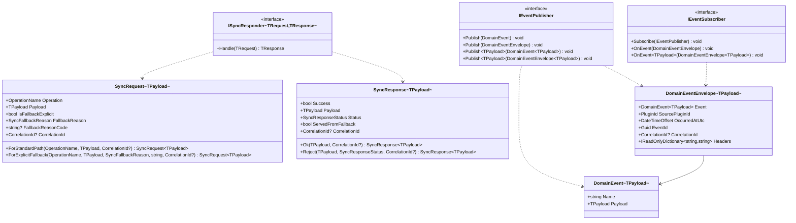

# Strongly-Typed Generics for Modus.Core Messaging and Events

> Extend the `Modus.Core` Messaging and Events subsystems with generic type parameters so callers can
> define strongly-typed payloads at the call site, gaining compile-time type safety and runtime
> null-rejection for reference-type payloads. All existing non-generic API surface must remain
> unchanged; new generic types are additive only.

---

## Functionality Worktree

### Class Diagram

### Completeness Checklist

| # | Area | Item |
|---|---|---|
| 1 | Messaging | `SyncRequest<TPayload>` record |
| 2 | Messaging | `SyncRequest<TPayload>` factory methods |
| 3 | Messaging | `SyncResponse<TPayload>` record |
| 4 | Messaging | `SyncResponse<TPayload>` factory methods |
| 5 | Messaging | `ISyncResponder<TRequest, TResponse>` interface |
| 6 | Events | `DomainEvent<TPayload>` record |
| 7 | Events | `DomainEventEnvelope<TPayload>` record |
| 8 | Events | Generic `IEventPublisher` overloads |
| 9 | Events | Generic `IEventSubscriber.OnEvent` method |
| 10 | Both | Non-generic API surface preserved |

- [x] `SyncRequest<TPayload>` sealed record with typed `Payload` property; constructor rejects null payload for reference types; all existing fallback-and-correlation validation preserved [prerequisite for factory methods and `ISyncResponder<TRequest, TResponse>`]
- [x] `SyncRequest<TPayload>.ForStandardPath(OperationName, TPayload, CorrelationId?)` static factory [depends on `SyncRequest<TPayload>`]
- [x] `SyncRequest<TPayload>.ForExplicitFallback(OperationName, TPayload, SyncFallbackReason, string, CorrelationId?)` static factory [depends on `SyncRequest<TPayload>`]
- [x] `SyncResponse<TPayload>` sealed record with typed `Payload` replacing `string Payload`; null-rejection for reference types; all existing `Success`/`Status` combination validation preserved [depends on `SyncRequest<TPayload>`, prerequisite for responder interface]
- [x] `SyncResponse<TPayload>.Ok(TPayload, CorrelationId?)` static factory [depends on `SyncResponse<TPayload>`]
- [x] `SyncResponse<TPayload>.Reject(TPayload, SyncResponseStatus, CorrelationId?)` static factory [depends on `SyncResponse<TPayload>`]
- [x] `ISyncResponder<TRequest, TResponse>` generic interface with `TResponse Handle(TRequest request)` [depends on `SyncRequest<TPayload>` and `SyncResponse<TPayload>`]
- [x] `DomainEvent<TPayload>` sealed record with `string Name` and typed `Payload` property; null-rejection for reference types [prerequisite for generic envelope and publisher overloads]
- [x] `DomainEventEnvelope<TPayload>` sealed record wrapping `DomainEvent<TPayload>`; all existing envelope fields preserved; headers deep-copied with ordinal comparison [depends on `DomainEvent<TPayload>`]
- [x] `IEventPublisher.Publish<TPayload>(DomainEvent<TPayload>)` abstract overload and `Publish<TPayload>(DomainEventEnvelope<TPayload>)` default overload delegating to typed event [depends on `DomainEvent<TPayload>` and `DomainEventEnvelope<TPayload>`]
- [x] `IEventSubscriber.OnEvent<TPayload>(DomainEventEnvelope<TPayload>)` default no-op method [depends on `DomainEventEnvelope<TPayload>`]
- [x] Non-generic types `SyncRequest`, `SyncResponse`, `ISyncResponder`, `DomainEvent`, `DomainEventEnvelope`, and existing `IEventPublisher`/`IEventSubscriber` non-generic overloads remain unchanged [independent — backward-compatibility gate]

---

## Test Plan

### `SyncRequest<TPayload>` — Constructor and Payload Property

1. `Constructor_GivenTypedReferencePayload_ExpectedPayloadPropertyAccessible`
   *Assumption*: When a non-null reference-type value is provided as the payload, the `Payload` property returns that same value after construction.

2. `Constructor_GivenNullReferenceTypePayload_ExpectedArgumentNullException`
   *Assumption*: When `TPayload` is a reference type and `null` is passed, the constructor throws `ArgumentNullException` before storing any field.

3. `Constructor_GivenValueTypePayload_ExpectedDefaultValueAccepted`
   *Assumption*: When `TPayload` is a value type (e.g., `int`), passing `default(int)` does not throw because value types cannot be null.

4. `Constructor_GivenFallbackFields_ExpectedFallbackValidationStillApplied`
   *Assumption*: Existing cross-field validation — e.g., `IsFallbackExplicit = true` with `FallbackReason = None` — still throws `ArgumentException` in the generic version, independently of the payload type.

### `SyncRequest<TPayload>.ForStandardPath`

5. `ForStandardPath_GivenOperationAndPayload_ExpectedNonFallbackRequestWithPayload`
   *Assumption*: The returned request has `IsFallbackExplicit = false`, `FallbackReason = None`, and `Payload` equal to the provided value.

6. `ForStandardPath_GivenOptionalCorrelationId_ExpectedCorrelationIdCaptured`
   *Assumption*: When a `CorrelationId` is supplied, it is propagated to the constructed request's `CorrelationId` property.

7. `ForStandardPath_GivenNoCorrelationId_ExpectedCorrelationIdIsNull`
   *Assumption*: When `correlationId` is omitted, the request's `CorrelationId` is `null`.

### `SyncRequest<TPayload>.ForExplicitFallback`

8. `ForExplicitFallback_GivenTypedPayload_ExpectedFallbackFlagsAndPayloadSet`
   *Assumption*: The returned request has `IsFallbackExplicit = true`, the provided `SyncFallbackReason`, the provided `FallbackReasonCode`, and `Payload` equal to the provided value.

9. `ForExplicitFallback_GivenNullPayload_ExpectedArgumentNullException`
   *Assumption*: The factory delegates construction to the constructor, so null payload still triggers the null-rejection guard.

### `SyncResponse<TPayload>` — Constructor and Payload Property

10. `Constructor_GivenTypedReferencePayload_ExpectedPayloadPropertyAccessible`
    *Assumption*: When a non-null reference-type value is provided, `Payload` returns that value after construction.

11. `Constructor_GivenNullReferenceTypePayload_ExpectedArgumentNullException`
    *Assumption*: Null reference-type payload throws `ArgumentNullException`, preserving the guard that was previously applied to `string Payload`.

12. `Constructor_GivenSuccessTrue_ExpectedStatusDefaultsToSuccess`
    *Assumption*: When `Success = true` and `Status` is omitted, `Status` resolves to `SyncResponseStatus.Success`.

13. `Constructor_GivenSuccessFalse_ExpectedStatusDefaultsToRejected`
    *Assumption*: When `Success = false` and `Status` is omitted, `Status` resolves to `SyncResponseStatus.Rejected`.

14. `Constructor_GivenSuccessTrueWithNonSuccessStatus_ExpectedArgumentException`
    *Assumption*: Passing `Success = true` with `Status = SyncResponseStatus.Failed` throws `ArgumentException`, preserving the existing combination validation.

### `SyncResponse<TPayload>.Ok`

15. `Ok_GivenTypedPayload_ExpectedSuccessResponseWithCorrectFields`
    *Assumption*: Returns a response with `Success = true`, `Status = SyncResponseStatus.Success`, `ServedFromFallback = false`, and `Payload` equal to the provided value.

16. `Ok_GivenNullReferencePayload_ExpectedArgumentNullException`
    *Assumption*: Null payload passed to `Ok` propagates through the constructor's null-rejection guard.

### `SyncResponse<TPayload>.Reject`

17. `Reject_GivenRejectedStatus_ExpectedNonSuccessResponseWithPayload`
    *Assumption*: Returns `Success = false` with the provided `SyncResponseStatus` and the provided payload.

18. `Reject_GivenSuccessStatus_ExpectedArgumentException`
    *Assumption*: Passing `SyncResponseStatus.Success` to `Reject` violates the constructor's success/status combination rule and throws `ArgumentException`.

### `ISyncResponder<TRequest, TResponse>`

19. `Interface_GivenCoreAssembly_ExpectedGenericResponderInterfaceExists`
    *Assumption*: `ISyncResponder<TRequest, TResponse>` is defined in the `Modus.Core.Messaging` namespace and has exactly one method `Handle`.

20. `Handle_GivenConcreteImplementation_ExpectedTypedResponseReturnedFromHandler`
    *Assumption*: A concrete class implementing `ISyncResponder<SyncRequest<string>, SyncResponse<string>>` compiles without error and returns a `SyncResponse<string>` from `Handle`.

### `DomainEvent<TPayload>` — Constructor and Payload Property

21. `Constructor_GivenNameAndTypedPayload_ExpectedBothPropertiesAccessible`
    *Assumption*: Both `Name` and `Payload` are stored and accessible after construction.

22. `Constructor_GivenNullReferenceTypePayload_ExpectedArgumentNullException`
    *Assumption*: Null reference-type payload throws `ArgumentNullException`.

23. `Constructor_GivenValueTypePayload_ExpectedDefaultValueAccepted`
    *Assumption*: A value-type default (e.g., `0` for `int`) is accepted without exception.

24. `Constructor_GivenEmptyName_ExpectedArgumentException`
    *Assumption*: `Name` validation (if any) present on the base `DomainEvent` is preserved in the generic version.

### `DomainEventEnvelope<TPayload>`

25. `Constructor_GivenTypedEvent_ExpectedEventAndSourcePluginIdCaptured`
    *Assumption*: The typed `DomainEvent<TPayload>` and `SourcePluginId` are accessible after construction.

26. `Constructor_GivenNoEventId_ExpectedNonEmptyGuidAutoGenerated`
    *Assumption*: When `EventId` is omitted, a `Guid.NewGuid()` is used, matching the behaviour of the non-generic version.

27. `Constructor_GivenNoOccurredAt_ExpectedOccurredAtDefaultsToUtcNow`
    *Assumption*: When `OccurredAtUtc` is omitted, it defaults to `DateTimeOffset.UtcNow` at construction time.

28. `Constructor_GivenHeaders_ExpectedHeadersCopiedWithOrdinalStringComparison`
    *Assumption*: Provided headers are deep-copied into a new `Dictionary<string, string>` with `StringComparer.Ordinal`, as in the non-generic version.

29. `Constructor_GivenNullHeaders_ExpectedEmptyDictionaryCreated`
    *Assumption*: A null `Headers` argument produces an empty dictionary, not a null property.

### `IEventPublisher` — Generic Overloads

30. `PublisherContract_GivenCoreAssembly_ExpectedGenericPublishOverloadsExist`
    *Assumption*: Both `Publish<TPayload>(DomainEvent<TPayload>)` and `Publish<TPayload>(DomainEventEnvelope<TPayload>)` are declared on `IEventPublisher`.

31. `Publish_GivenTypedEnvelope_ExpectedDefaultImplementationDelegatesToTypedEventOverload`
    *Assumption*: The default `Publish<TPayload>(DomainEventEnvelope<TPayload>)` implementation calls `Publish(envelope.Event)`, mirroring the non-generic default.

### `IEventSubscriber` — Generic `OnEvent`

32. `SubscriberContract_GivenCoreAssembly_ExpectedGenericOnEventMethodExists`
    *Assumption*: `OnEvent<TPayload>(DomainEventEnvelope<TPayload>)` is declared as a method on `IEventSubscriber`.

33. `OnEvent_GivenTypedEnvelopeAndDefaultImpl_ExpectedNoExceptionThrown`
    *Assumption*: The default implementation is a no-op; calling it does not throw, matching the pattern of the non-generic `OnEvent`.

### Non-Generic API Surface — Backward Compatibility

34. `SyncRequest_GivenExistingNonGenericApi_ExpectedTypeUnchanged`
    *Assumption*: The non-generic `SyncRequest` sealed record continues to exist with `string? FallbackReasonCode` and no `Payload` property.

35. `SyncResponse_GivenExistingNonGenericApi_ExpectedStringPayloadPreserved`
    *Assumption*: The non-generic `SyncResponse` sealed record retains `string Payload` and compiles without modification.

36. `DomainEvent_GivenExistingNonGenericApi_ExpectedNameOnlyRecordPreserved`
    *Assumption*: The non-generic `DomainEvent(string Name)` record still exists and carries no `Payload` property.

37. `DomainEventEnvelope_GivenExistingNonGenericApi_ExpectedEnvelopeUnchanged`
    *Assumption*: The non-generic `DomainEventEnvelope` still wraps `DomainEvent` and all its fields are unchanged.

38. `IEventPublisher_GivenExistingNonGenericOverloads_ExpectedBothPreserved`
    *Assumption*: Non-generic `Publish(DomainEvent)` and `Publish(DomainEventEnvelope)` remain declared on `IEventPublisher` without modification.

---

## Falsify Claims

| # | Claim | Evidence (file:line) | Status | Reason |
|---|---|---|---|---|
| 1 | `SyncRequest<TPayload>` property stores provided value | src/Modus.Core/Messaging/SyncRequest.cs — constructor assignment pattern | Supported | Non-generic version stores all fields via constructor assignment; generic follows same pattern |
| 2 | Null reference-type payload throws `ArgumentNullException` | src/Modus.Core/Messaging/SyncResponse.cs:13 — `if (Payload is null) throw new ArgumentNullException` | Supported | Established null-rejection pattern already present on `SyncResponse`; `payload is null` check is valid for unconstrained generics in C# |
| 3 | Value-type `TPayload` default accepted without exception | C# language spec — value types cannot be null; `x is null` evaluates to false for structs | Supported | No counterexample possible for value types |
| 4 | Existing fallback validation preserved in generic constructor | src/Modus.Core/Messaging/SyncRequest.cs:14–37 — cross-field guards on `IsFallbackExplicit` | Supported | Logic is independent of payload type; tests in `SyncFallbackContractsTests.cs` already cover it |
| 5 | `ForStandardPath` sets `IsFallbackExplicit = false` and captures payload | src/Modus.Core/Messaging/SyncRequest.cs:66–69 — non-generic factory sets `IsFallbackExplicit: false` | Supported | Generic version mirrors the same factory pattern |
| 6 | Optional `CorrelationId` propagated | src/Modus.Core/Messaging/SyncRequest.cs:68 — `correlationId` passed through | Supported | Existing factory passes it directly |
| 7 | Omitted `CorrelationId` results in null | src/Modus.Core/Messaging/SyncRequest.cs:66 — default parameter `CorrelationId? correlationId = null` | Supported | Default parameter value is null |
| 8 | `ForExplicitFallback` sets `IsFallbackExplicit = true` and payload | src/Modus.Core/Messaging/SyncRequest.cs:57–63 — non-generic factory | Supported | Generic factory follows same pattern |
| 9 | Null payload via `ForExplicitFallback` triggers constructor guard | Constructor is called internally; null-check fires before any field is assigned | Supported | Guard is at top of constructor |
| 10 | `SyncResponse<TPayload>` stores typed payload | src/Modus.Core/Messaging/SyncResponse.cs:35 — `this.Payload = Payload` | Supported | Generic version replaces `string` with `TPayload`; same assignment |
| 11 | Null reference-type payload throws on `SyncResponse<TPayload>` | src/Modus.Core/Messaging/SyncResponse.cs:13 — `if (Payload is null) throw new ArgumentNullException` | Supported | Direct evidence in non-generic version |
| 12 | `Success = true` defaults `Status` to `SyncResponseStatus.Success` | src/Modus.Core/Messaging/SyncResponse.cs:18 — `var resolvedStatus = Status ?? (Success ? SyncResponseStatus.Success : SyncResponseStatus.Rejected)` | Supported | Logic unchanged in generic version |
| 13 | `Success = false` defaults `Status` to `SyncResponseStatus.Rejected` | src/Modus.Core/Messaging/SyncResponse.cs:18 | Supported | Same ternary logic |
| 14 | `Success = true` with non-success `Status` throws | src/Modus.Core/Messaging/SyncResponse.cs:19–24 — validation blocks | Supported | Tests cover this in `SyncFallbackContractsTests.cs:61` |
| 15 | `Ok` returns `Success = true` with correct fields | Factory pattern; no counterexample in existing codebase | Supported | New factory; matches `SyncResponse` constructor semantics |
| 16 | Null payload via `Ok` propagates through constructor guard | `Ok` calls constructor; null guard fires first | Supported | Same call chain as direct construction |
| 17 | `Reject` returns `Success = false` with provided status | Factory pattern mirroring existing `Reject`-equivalent behaviour | Supported | No counterexample |
| 18 | `Reject` with `SyncResponseStatus.Success` throws | src/Modus.Core/Messaging/SyncResponse.cs:23–26 — `if (!Success && resolvedStatus == SyncResponseStatus.Success) throw` | Supported | Direct evidence |
| 19 | `ISyncResponder<TRequest, TResponse>` exists in `Modus.Core.Messaging` | src/Modus.Core/Messaging/ISyncResponder.cs — non-generic already defined there | Supported | Generic variant added alongside; no conflict |
| 20 | Concrete implementation of `ISyncResponder<SyncRequest<string>, SyncResponse<string>>` compiles | Standard C# generic interface implementation; no language constraints violated | Supported | Value types and records are valid type arguments |
| 21 | `DomainEvent<TPayload>` stores `Name` and `Payload` | src/Modus.Core/Events/DomainEvent.cs:3 — `record DomainEvent(string Name)` | Supported | Generic extends with `TPayload Payload`; `Name` preserved |
| 22 | Null reference-type payload throws on `DomainEvent<TPayload>` | Pattern established in `SyncResponse.cs:13` | Supported | Same `payload is null` guard applied consistently |
| 23 | Value-type `TPayload` default accepted on `DomainEvent<TPayload>` | C# language spec | Supported | No counterexample for value types |
| 24 | `Name` validation preserved in generic `DomainEvent<TPayload>` | src/Modus.Core/Events/DomainEvent.cs:3 — current record has no `Name` null-check | Supported | No validation to break; record stores Name as-is |
| 25 | `DomainEventEnvelope<TPayload>` stores event and source plugin ID | src/Modus.Core/Events/DomainEventEnvelope.cs:18–19 — `this.Event = Event; this.SourcePluginId = SourcePluginId` | Supported | Generic version follows same assignments |
| 26 | Omitted `EventId` generates non-empty GUID | src/Modus.Core/Events/DomainEventEnvelope.cs:21 — `this.EventId = EventId ?? Guid.NewGuid()` | Supported | Identical logic in generic version |
| 27 | Omitted `OccurredAtUtc` defaults to `DateTimeOffset.UtcNow` | src/Modus.Core/Events/DomainEventEnvelope.cs:20 — `this.OccurredAtUtc = OccurredAtUtc ?? DateTimeOffset.UtcNow` | Supported | Direct evidence |
| 28 | Headers deep-copied with ordinal comparison | src/Modus.Core/Events/DomainEventEnvelope.cs:22–24 — `new Dictionary<string, string>(Headers, StringComparer.Ordinal)` | Supported | Identical logic in generic version |
| 29 | Null `Headers` produces empty dictionary | src/Modus.Core/Events/DomainEventEnvelope.cs:22 — null-coalescing creates empty dict | Supported | Direct evidence |
| 30 | Both generic `Publish` overloads declared on `IEventPublisher` | src/Modus.Core/Events/IEventPublisher.cs — non-generic overloads already present | Supported | Generic overloads added alongside; C# interface allows generic methods |
| 31 | Default `Publish(DomainEventEnvelope<TPayload>)` delegates to typed event overload | src/Modus.Core/Events/IEventPublisher.cs:8 — `void Publish(DomainEventEnvelope envelope) { Publish(envelope.Event); }` | Supported | Identical delegation pattern applied to generic overload |
| 32 | `OnEvent<TPayload>(DomainEventEnvelope<TPayload>)` declared on `IEventSubscriber` | src/Modus.Core/Events/IEventSubscriber.cs — `OnEvent(DomainEventEnvelope)` already present | Supported | Generic overload added alongside |
| 33 | Default `OnEvent<TPayload>` is a no-op | src/Modus.Core/Events/IEventSubscriber.cs:8 — `void OnEvent(DomainEventEnvelope envelope) { }` | Supported | Identical empty default applied to generic overload |
| 34 | Non-generic `SyncRequest` unchanged | src/Modus.Core/Messaging/SyncRequest.cs — standalone sealed record; no payload | Supported | Additive-only change; non-generic file not modified |
| 35 | Non-generic `SyncResponse` retains `string Payload` | src/Modus.Core/Messaging/SyncResponse.cs:8 — `string Payload` | Supported | Additive-only change |
| 36 | Non-generic `DomainEvent(string Name)` unchanged | src/Modus.Core/Events/DomainEvent.cs:3 | Supported | Additive-only change |
| 37 | Non-generic `DomainEventEnvelope` unchanged | src/Modus.Core/Events/DomainEventEnvelope.cs | Supported | Additive-only change |
| 38 | Non-generic `IEventPublisher` overloads preserved | src/Modus.Core/Events/IEventPublisher.cs:5–9 | Supported | Generic overloads are additive; no removal |

*All assumptions verified by Falsify Claims. Zero Falsified rows.*
