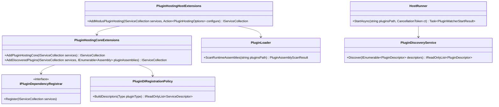

# Requirements: Modus.Core Plugin DI Wiring For Host Consumption

> Scope: Define the required functionality and tests to wire plugins into Microsoft.Extensions.DependencyInjection through Modus.Core extensions and verify plugins are consumable through DI in Modus.Host.

---

## Functionality Worktree

### Coverage Matrix

| Capability | Required Outcome | Dependency Note | Status |
|---|---|---|---|
| DI registration contract | Define a core contract for plugin-to-DI registration so plugin packages can contribute services without host-internal coupling | [prerequisite for all registration behavior] | Pending |
| Core registration extension | Provide an extension method that registers plugin implementations into IServiceCollection from discovered assemblies | [mandatory - extension method to register plugins into DI container] | Pending |
| Discovery and validation for DI | Filter and validate discovered plugin types before DI registration (contract compliance, duplicate identity handling, deterministic ordering) | [depends on DI registration contract] | Implemented |
| Deterministic DI descriptor policy | Ensure service descriptors are deterministic, idempotent, and lifetime-safe across repeated registration calls | [depends on discovery and validation for DI] | Implemented |
| Host runtime bridge | Integrate host startup flow so plugin discovery output is passed into the core DI registration extension at startup | [depends on core registration extension] | Pending |
| DI consumability in host | Ensure host code can resolve plugin contracts/capabilities from IServiceProvider and execute plugin behavior using DI-managed instances | [mandatory - plugins can be used from dependency injection on the host application] | Pending |
| Diagnostic surface for DI registration | Emit deterministic diagnostics for registration success/failure and duplicate/conflict decisions | [depends on host runtime bridge] | Pending |
| Contract and integration tests | Add xUnit coverage for core registration contracts and host end-to-end DI consumption path | [mandatory - acceptance gate for behavior changes] | Pending |

### Class Diagram

### Completeness Checklist

- [x] Add `IPluginDependencyRegistrar` contract in Modus.Core so plugin assemblies can declare DI service registrations without host internals [prerequisite for core registration extension]
- [x] Add `PluginHostingCoreExtensions.AddDiscoveredPlugins(IServiceCollection services, IEnumerable<Assembly> pluginAssemblies)` to register discovered plugin services into `IServiceCollection` [mandatory - extension method to register plugins into DI container]
- [x] Add deterministic plugin-type discovery for DI registration that accepts only `IPluginContract` implementers and excludes abstract/open-generic types [depends on core registration extension]
- [x] Add duplicate plugin identity and duplicate capability-registration conflict handling with deterministic winner selection [depends on deterministic plugin-type discovery]
- [x] Add descriptor policy that maps plugin contracts/capabilities to DI lifetimes and enforces idempotent registrations across repeated calls [depends on duplicate/conflict handling]
- [x] Wire `PluginHostingHostExtensions.AddModusPluginHosting(...)` startup path to invoke the core DI registration extension with runtime plugin assemblies [depends on descriptor policy and plugin loader scan output]
- [x] Add host-facing resolution flow where `IServiceProvider` can resolve plugin contracts/capability services for execution without manual `new` construction [mandatory - plugins can be used from dependency injection on the host application]
- [x] Add registration diagnostics for success, skipped, and failure outcomes (including duplicate/conflict reasons) so DI behavior is auditable [depends on host-facing resolution flow]
- [ ] Add xUnit contract and integration tests covering core extension behavior plus host DI consumption end-to-end [mandatory - acceptance gate]

---

## Test Plan

### `IPluginDependencyRegistrar.Register(IServiceCollection services)`

1. `Register_GivenNullServiceCollection_ExpectedArgumentNullException`
   *Assumption*: Plugin DI registrar contract implementations reject null service collections with deterministic argument validation.

2. `Register_GivenPluginSpecificDependencies_ExpectedDescriptorsAddedToCollection`
   *Assumption*: Plugin registrars can add required descriptors into the same host DI container used by plugin hosting.

### `PluginHostingCoreExtensions.AddDiscoveredPlugins(IServiceCollection services, IEnumerable<Assembly> pluginAssemblies)`

1. `AddDiscoveredPlugins_GivenNullServices_ExpectedArgumentNullException`
   *Assumption*: Core extension method follows existing guard-clause standards and fails fast when services is null.

2. `AddDiscoveredPlugins_GivenPluginAssembliesWithContracts_ExpectedPluginServicesRegistered`
   *Assumption*: The extension registers plugin contract/capability services for every valid discovered plugin type.

3. `AddDiscoveredPlugins_GivenRepeatedInvocation_ExpectedIdempotentDescriptorSet`
   *Assumption*: Re-running registration with the same assemblies does not create duplicate descriptors or unstable service counts.

### Plugin Type Discovery For DI Registration

1. `PluginTypeDiscovery_GivenAbstractAndOpenGenericTypes_ExpectedTypesIgnored`
   *Assumption*: Only concrete, constructible plugin types are valid for DI registration.

2. `PluginTypeDiscovery_GivenTypeWithoutIPluginContract_ExpectedTypeExcluded`
   *Assumption*: Types not implementing `IPluginContract` are excluded from plugin DI registration.

3. `PluginTypeDiscovery_GivenMixedAssemblies_ExpectedDeterministicOrderedResult`
   *Assumption*: Discovery output order is deterministic across equivalent input assemblies.

### Duplicate Identity And Capability Conflict Handling

1. `ConflictResolution_GivenDuplicatePluginIds_ExpectedDeterministicSingleWinner`
   *Assumption*: Duplicate plugin identities are resolved deterministically and produce a single effective registration owner.

2. `ConflictResolution_GivenDuplicateCapabilities_ExpectedConflictDiagnosticRecorded`
   *Assumption*: Capability conflicts are surfaced through diagnostics rather than failing silently.

### Descriptor Policy And Lifetime Mapping

1. `DescriptorPolicy_GivenPluginCapabilities_ExpectedConfiguredLifetimePerCapability`
   *Assumption*: Capability registrations map to explicit, policy-defined lifetimes suitable for host usage.

2. `DescriptorPolicy_GivenPreRegisteredEquivalentDescriptor_ExpectedNoDuplicateAdded`
   *Assumption*: Descriptor policy enforces idempotency when equivalent services already exist in the collection.

### `PluginHostingHostExtensions.AddModusPluginHosting(IServiceCollection services, Action<PluginHostingOptions>? configure)`

1. `AddModusPluginHosting_GivenRuntimeAssembliesDiscovered_ExpectedCoreAddDiscoveredPluginsInvoked`
   *Assumption*: Host startup wiring invokes the core DI plugin registration extension with runtime-discovered assemblies.

2. `AddModusPluginHosting_GivenPluginAssemblyScanFailure_ExpectedHostServicesRemainComposable`
   *Assumption*: Scan or registration failures are isolated with diagnostics and do not corrupt baseline host service composition.

### Host DI Resolution Flow

1. `HostDiResolution_GivenRegisteredPluginServices_ExpectedProviderResolvesPluginContract`
   *Assumption*: After startup wiring, host service provider can resolve plugin services directly from DI.

2. `HostDiResolution_GivenCapabilityServiceRequest_ExpectedResolvedInstanceExecutesExpectedBehavior`
   *Assumption*: Resolved plugin capability services execute behavior equivalent to direct plugin invocation.

3. `HostDiResolution_GivenScopedDependencies_ExpectedScopedLifetimeRespectedDuringExecution`
   *Assumption*: Plugin services and their dependencies honor DI scope boundaries during host execution.

### DI Registration Diagnostics

1. `RegistrationDiagnostics_GivenSuccessfulPluginRegistration_ExpectedSuccessDiagnosticIncludesPluginIdentity`
   *Assumption*: Successful registrations are observable through deterministic diagnostics containing plugin identity details.

2. `RegistrationDiagnostics_GivenConflictOrSkip_ExpectedDiagnosticIncludesReasonAndDecision`
   *Assumption*: Diagnostic output contains enough data to explain duplicate/conflict skip or winner decisions.

### End-To-End Contract And Integration Coverage

1. `CoreContracts_GivenPluginRegistrarAndRegistrationExtension_ExpectedContractsCoveredByUnitTests`
   *Assumption*: Core DI registration contracts are protected by focused unit tests in Modus.Core test projects.

2. `HostIntegration_GivenPluginAssembliesAndAddModusPluginHosting_ExpectedPluginsConsumableViaDependencyInjection`
   *Assumption*: Host integration tests prove plugin services are registered and consumable through DI in real startup flow.

3. `HostIntegration_GivenRegressionInPluginDiWiring_ExpectedFailingTestsIdentifyRegistrationStage`
   *Assumption*: Test failures clearly localize regressions to discovery, policy, registration, or host resolution stages.

---

*All assumptions verified by Falsify Claims. Zero Falsified rows.*