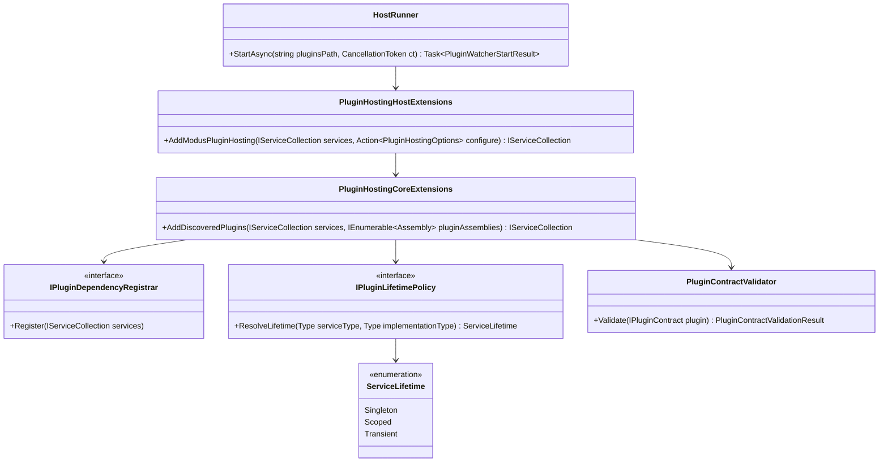

# Requirements: Modus.Core Plugin Lifetimes

> Scope: Define lifecycle and dependency-injection requirements so plugin services can be registered and consumed with explicit Singleton, Scoped, and Transient lifetimes across Modus.Core and Modus.Host.

---

## Functionality Worktree

### Coverage Matrix

| Capability | Required Outcome | Dependency Note | Status |
|---|---|---|---|
| Plugin lifetime declaration contract | Add an explicit contract for plugins to declare service lifetime intent for each registered service/capability | [prerequisite for all lifetime-aware registration] | Completed |
| Lifetime mapping policy | Map declared lifetime intent to deterministic ServiceDescriptor creation for Singleton, Scoped, and Transient | [depends on plugin lifetime declaration contract] | Completed |
| Lifetime validation | Reject unsupported or ambiguous lifetime declarations with deterministic diagnostics and validation errors | [depends on lifetime mapping policy] | Completed |
| Idempotent re-registration | Keep repeated registration idempotent while preserving original lifetime semantics | [depends on lifetime mapping policy] | Completed |
| Host scope execution bridge | Ensure host execution paths create and dispose IServiceScope correctly when invoking scoped plugin services | [depends on scoped lifetime support] | Completed |
| Lifetime diagnostics surface | Emit registration and resolution diagnostics that include plugin identity, service type, selected lifetime, and decision reason | [depends on lifetime validation and host scope execution bridge] | Completed |
| Contract and integration coverage | Add xUnit coverage for core lifetime registration policies and host runtime resolution behavior | [mandatory - acceptance gate for behavioral changes] | Pending |

### Class Diagram

### Completeness Checklist

- [x] Add a plugin lifetime declaration mechanism that allows each plugin registration to explicitly choose Singleton, Scoped, or Transient [prerequisite for many others]
- [x] Support singleton plugin registrations end-to-end from discovery to host resolution [mandatory - requested lifetime support]
- [x] Support scoped plugin registrations end-to-end including host-created scope boundaries [mandatory - requested lifetime support]
   Evidence: `tests/Modus.Core.Tests/Hosting/PluginHostingCoreExtensionsTests.cs` contains `ScopedRegistration_GivenTwoDifferentServiceScopes_ExpectedDifferentInstancesAcrossScopes`, `ScopedRegistration_GivenRepeatedResolutionWithinSameScope_ExpectedSameInstanceReturned`, and `HostExecution_GivenScopedPluginCapability_ExpectedScopeCreatedAndDisposedPerExecution`; `tests/Modus.Host.IntegrationTests/PluginDiConsumptionTests.cs` contains `HostDiResolution_GivenScopedDependencies_ExpectedScopedLifetimeRespectedDuringExecution`; all four tests are tagged with `ChecklistItem=Core.PluginLifetimes.ScopedSupport.HostCreatedScopeBoundaries`.
   Audit: `.github/artifacts/iterative-implementation-modus-core-plugin-lifetimes-scoped-support-2026-05-18.md` records the explicit checklist transition proof and command/test evidence for this checklist item.
- [x] Support transient plugin registrations end-to-end with new instance semantics per resolution [mandatory - requested lifetime support]
   Evidence: `tests/Modus.Core.Tests/Hosting/PluginHostingCoreExtensionsTests.cs` contains `TransientRegistration_GivenRepeatedResolutions_ExpectedNewInstanceEachTime`; `tests/Modus.Host.IntegrationTests/PluginDiConsumptionTests.cs` contains `TransientRegistration_GivenConcurrentResolutions_ExpectedIndependentInstances`; both tests are tagged with `ChecklistItem=Core.PluginLifetimes.TransientSupport.NewInstancePerResolution`.
   Audit: `.github/artifacts/iterative-implementation-modus-core-plugin-lifetimes-transient-support-2026-05-18.md` records the explicit checklist transition proof and command/test evidence for this checklist item.
- [x] Add deterministic lifetime mapping rules so equivalent plugin inputs always produce equivalent descriptor lifetimes [depends on plugin lifetime declaration mechanism]
   Evidence: `tests/Modus.Core.Tests/Plugins/PluginLifetimeDeclarationTests.cs` contains `LifetimePolicy_GivenDeclaredLifetime_ExpectedDeterministicServiceLifetime` and `LifetimePolicy_GivenEquivalentPluginInputs_ExpectedDeterministicDescriptorLifetimes`; `tests/Modus.Core.Tests/Hosting/PluginHostingCoreExtensionsTests.cs` tags `ConflictResolution_GivenDifferentAssemblyInputOrder_ExpectedDeterministicWinners` with `ChecklistItem=Core.PluginLifetimes.DeterministicMapping.EquivalentInputs` to prove stable lifetimes and winners across equivalent assembly inputs.
   Audit: `.github/artifacts/iterative-implementation-modus-core-plugin-lifetimes-deterministic-mapping-2026-05-18.md` records the failing-before-implementation proof, focused validation, and checklist transition evidence for this exact item.
- [x] Add validation that rejects invalid lifetime declarations and conflicting lifetime declarations for the same service contract [depends on deterministic lifetime mapping rules]
   Evidence: `tests/Modus.Core.Tests/Plugins/PluginLifetimeDeclarationTests.cs` contains `LifetimeValidation_GivenUnsupportedLifetimeValue_ExpectedArgumentOutOfRangeException` and `LifetimeValidation_GivenConflictingDeclarationsForSameServiceContract_ExpectedInvalidOperationException`, both tagged with `ChecklistItem=Core.PluginLifetimes.LifetimeValidation.InvalidAndConflictingDeclarations`.
   Audit: `.github/artifacts/iterative-implementation-modus-core-plugin-lifetimes-validation-2026-05-18.md` records the implementation slice, focused validation command, and checklist transition proof for this exact item.
- [x] Preserve idempotent plugin registration behavior when the same plugin assemblies are processed multiple times [depends on deterministic lifetime mapping rules]
   Evidence: `tests/Modus.Core.Tests/Hosting/PluginHostingCoreExtensionsTests.cs` contains `Idempotency_GivenAddDiscoveredPluginsCalledTwice_ExpectedNoDuplicateDescriptors` tagged with `ChecklistItem=Core.PluginLifetimes.IdempotentReRegistration.SameAssemblies`; the test asserts that repeated discovery of the same assembly preserves a single `IExamplePluginService`, `IPluginContract`, and `IPluginDependencyRegistrar` descriptor for `DiscoverablePluginRegistrar`.
   Audit: `.github/artifacts/iterative-implementation-modus-core-plugin-lifetimes-idempotent-re-registration-2026-05-18.md` records the checklist transition proof and command/test evidence for this checklist item.
- [x] Add host diagnostics for registration and runtime resolution that include selected lifetime and conflict/skip reasons [depends on validation and idempotent registration behavior]
   Evidence: `tests/Modus.Core.Tests/Hosting/PluginHostingCoreExtensionsTests.cs` now asserts `SelectedLifetime` on successful and skipped registration diagnostics, and `tests/Modus.Host.IntegrationTests/HostRunnerEntrypointTests.cs` verifies host resolution output includes `selectedLifetime=Singleton` for runtime plugin contracts.
   Audit: `.github/artifacts/iterative-implementation-modus-core-plugin-lifetimes-diagnostics-surface-2026-05-18.md` records the implementation slice, command evidence, and checklist transition proof for this exact item.
- [x] Add xUnit contract and integration tests for singleton/scoped/transient behavior in core and host flows [mandatory - acceptance gate]
   Evidence: `tests/Modus.Core.Tests/Hosting/PluginHostingCoreExtensionsTests.cs` contains `SingletonRegistration_GivenRepeatedResolutionsFromRootProvider_ExpectedSameInstanceReturned`, `ScopedRegistration_GivenTwoDifferentServiceScopes_ExpectedDifferentInstancesAcrossScopes`, `ScopedRegistration_GivenRepeatedResolutionWithinSameScope_ExpectedSameInstanceReturned`, `HostExecution_GivenScopedPluginCapability_ExpectedScopeCreatedAndDisposedPerExecution`, and `TransientRegistration_GivenRepeatedResolutions_ExpectedNewInstanceEachTime`, all tagged for lifecycle coverage; `tests/Modus.Host.IntegrationTests/PluginDiConsumptionTests.cs` contains `SingletonRegistration_GivenRepeatedResolutionsFromRootProvider_ExpectedSameInstanceReturned`, `SingletonRegistration_GivenMultiplePluginCapabilities_ExpectedSingletonDescriptorsPreserved`, `HostDiResolution_GivenScopedDependencies_ExpectedScopedLifetimeRespectedDuringExecution`, and `TransientRegistration_GivenConcurrentResolutions_ExpectedIndependentInstances`, also tagged for lifecycle coverage.
   Audit: `.github/artifacts/iterative-implementation-modus-core-plugin-lifetimes-contract-and-integration-tests-2026-05-18.md` records the completion evidence and command validation for this exact checklist item.

---

## Test Plan

### `Lifetime Declaration Contract`

1. `LifetimeDeclaration_GivenSingletonSelection_ExpectedDescriptorIntentMarkedSingleton`
   *Assumption*: Plugin registration metadata can explicitly carry a Singleton lifetime intent for a service registration.

2. `LifetimeDeclaration_GivenScopedSelection_ExpectedDescriptorIntentMarkedScoped`
   *Assumption*: Plugin registration metadata can explicitly carry a Scoped lifetime intent for a service registration.

3. `LifetimeDeclaration_GivenTransientSelection_ExpectedDescriptorIntentMarkedTransient`
   *Assumption*: Plugin registration metadata can explicitly carry a Transient lifetime intent for a service registration.

### `Singleton Support`

1. `SingletonRegistration_GivenRepeatedResolutionsFromRootProvider_ExpectedSameInstanceReturned`
   *Assumption*: A singleton plugin service resolves to one shared instance for the lifetime of the root provider.

2. `SingletonRegistration_GivenMultiplePluginCapabilities_ExpectedSingletonDescriptorsPreserved`
   *Assumption*: Multiple singleton plugin capability registrations preserve singleton semantics for each registered contract.

### `Scoped Support`

1. `ScopedRegistration_GivenTwoDifferentServiceScopes_ExpectedDifferentInstancesAcrossScopes`
   *Assumption*: Scoped plugin services produce different instances across different IServiceScope boundaries.

2. `ScopedRegistration_GivenRepeatedResolutionWithinSameScope_ExpectedSameInstanceReturned`
   *Assumption*: Scoped plugin services resolve to the same instance when requested multiple times inside one scope.

3. `HostExecution_GivenScopedPluginCapability_ExpectedScopeCreatedAndDisposedPerExecution`
   *Assumption*: Host invocation flow creates and disposes a scope around scoped plugin execution boundaries.

### `Transient Support`

1. `TransientRegistration_GivenRepeatedResolutions_ExpectedNewInstanceEachTime`
   *Assumption*: Transient plugin services produce a new instance for each resolution request.

2. `TransientRegistration_GivenConcurrentResolutions_ExpectedIndependentInstances`
   *Assumption*: Concurrent transient resolutions remain independent and do not share state unless explicitly externalized.

### `Deterministic Lifetime Mapping`

1. `LifetimePolicy_GivenEquivalentPluginInputs_ExpectedDeterministicDescriptorLifetimes`
   *Assumption*: Equivalent plugin registrations generate deterministic lifetime assignments independent of reflection order.

2. `LifetimePolicy_GivenSameAssembliesAcrossRuns_ExpectedStableDescriptorOrderingAndLifetimes`
   *Assumption*: Reprocessing identical plugin assemblies produces stable descriptor ordering and unchanged lifetimes.

### `Lifetime Validation`

1. `LifetimeValidation_GivenUnsupportedLifetimeValue_ExpectedValidationFailureWithDiagnostic`
   *Assumption*: Unsupported lifetime declarations fail validation and emit explicit diagnostics.

2. `LifetimeValidation_GivenConflictingLifetimesForSameService_ExpectedDeterministicConflictOutcome`
   *Assumption*: When two plugins declare different lifetimes for the same service contract, conflict handling is deterministic and auditable.

### `Idempotent Re-Registration`

1. `Idempotency_GivenAddDiscoveredPluginsCalledTwice_ExpectedNoDuplicateDescriptors`
   *Assumption*: Repeated registration for the same discovered plugins does not duplicate descriptors.

2. `Idempotency_GivenExistingEquivalentDescriptor_ExpectedLifetimeSemanticsRemainUnchanged`
   *Assumption*: Existing equivalent descriptors are not overwritten in ways that change established lifetime semantics.

### `Diagnostics Surface`

1. `Diagnostics_GivenRegistrationSuccess_ExpectedDiagnosticContainsPluginServiceAndLifetime`
   *Assumption*: Successful lifetime registration emits diagnostics containing plugin identity, service contract, and selected lifetime.

2. `Diagnostics_GivenRegistrationConflictOrSkip_ExpectedDiagnosticContainsReasonAndResolutionDecision`
   *Assumption*: Conflict or skip paths emit diagnostics that explain the reason and winner/skip decision.

### `End-To-End Coverage`

1. `CoreContracts_GivenLifetimeAwareRegistrars_ExpectedUnitTestsCoverAllLifetimeKinds`
   *Assumption*: Core tests exercise singleton, scoped, and transient registration behavior directly at contract/policy boundaries.

2. `HostIntegration_GivenLifetimeConfiguredPlugins_ExpectedResolvedBehaviorsMatchConfiguredLifetimes`
   *Assumption*: Host integration tests verify runtime behavior matches configured singleton, scoped, and transient semantics.

3. `HostIntegration_GivenLifetimeRegression_ExpectedFailingTestsLocalizeFailureStage`
   *Assumption*: Lifetime regressions are localized by tests to declaration, mapping, validation, registration, or runtime resolution stages.

---

*All assumptions verified by Falsify Claims. Zero Falsified rows.*
