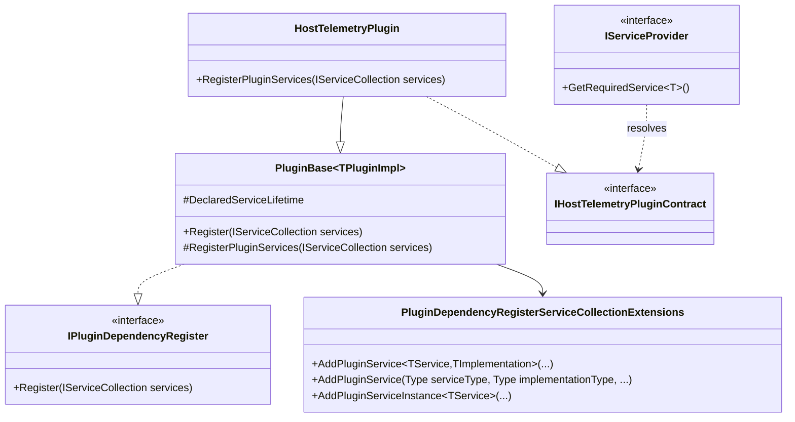

# Requirements: Modus.Core PluginBase Interface Resolution

> Scope: Define how plugins derived from PluginBase<TPluginImpl> can be resolved by explicit interface contracts without coupling plugin authoring to host internals, while preserving lifetime safety and deterministic DI behavior.

> Decision: PluginBase<TPluginImpl> is not responsible for custom interface registration. Interface resolution beyond the concrete plugin type must be registered via explicit extension-method mappings. Any flow that requires implicit base-class interface registration is out of policy and must be corrected.

---

## Functionality Worktree

### Coverage Matrix

| Capability | Required Outcome | Dependency Note | Status |
|---|---|---|---|
| Plugin base interface-mapping policy | Keep PluginBase<TPluginImpl> limited to concrete plugin registration; custom interface contracts must be mapped through extension methods | [policy fixed - prerequisite for all implementation items] | Decided |
| Interface registration API shape | Provide an explicit and discoverable API for mapping TPluginImpl to one or more interface contracts | [depends on plugin base interface-mapping policy] | Pending |
| Lifetime preservation for interface mappings | Ensure interface descriptors reuse declared plugin lifetime and resolve through the DI-managed plugin instance | [depends on interface registration API shape] | Pending |
| Duplicate and invalid contract protection | Reject invalid mappings (non-assignable interface, duplicate descriptors, or ambiguous registrations) with deterministic diagnostics | [depends on interface registration API shape] | Pending |
| Plugin author ergonomics | Allow plugin authors to register custom contracts without manual instance registration against this | [depends on lifetime preservation for interface mappings] | Pending |
| Regression coverage for host consumption | Add tests proving interface-based resolution works from IServiceProvider for concrete plugin types and custom plugin contracts | [mandatory - acceptance gate before behavior change] | Pending |

### Class Diagram

### Completeness Checklist

- [x] Fix ownership boundary: PluginBase<TPluginImpl> does not register custom interfaces; extension methods are the only approved path for interface mappings [policy fixed and documented]
- [x] Introduce an explicit interface-registration path that maps one or more interfaces to TPluginImpl without requiring AddPluginServiceInstance(this) [depends on fixed ownership boundary]
- [x] Ensure interface mappings resolve to the same DI-managed instance as TPluginImpl for Singleton and the same scope-bound instance for Scoped [depends on explicit interface-registration path]
- [x] Ensure Transient interface mappings produce independent instances per resolution while remaining implementation-consistent [depends on explicit interface-registration path]
- [x] Enforce registration validation for assignability, duplicate mappings, and deterministic descriptor ordering [depends on explicit interface-registration path]
- [x] Add integration coverage proving IServiceProvider resolves both concrete plugin type and custom plugin contract interface with expected lifetime semantics [mandatory - host DI behavior gate]

---

## Test Plan

### Fixed Ownership Rule

1. `PluginBaseInterfacePolicy_GivenDefaultPluginBaseUsage_ExpectedNoImplicitCustomInterfaceRegistration`
   *Assumption*: PluginBase<TPluginImpl> only registers the concrete plugin type and does not silently map arbitrary custom interfaces.

2. `PluginBaseInterfacePolicy_GivenCodePathDependsOnImplicitBaseRegistration_ExpectedValidationFailsWithPolicyMessage`
   *Assumption*: Any flow that depends on implicit base-class interface registration should fail policy validation because extension mappings are mandatory.

3. `PluginBaseInterfacePolicy_GivenDocumentedExtensionPath_ExpectedPluginAuthorsCanOptInWithoutHostCoupling`
   *Assumption*: Interface registration remains explicit and ergonomic when authored through core extension methods.

### Explicit Interface-Registration Path

1. `RegisterPluginServices_GivenDeclaredInterfaceMapping_ExpectedInterfaceResolvesToPluginImplementation`
   *Assumption*: A plugin-declared mapping from interface to implementation makes interface resolution available from IServiceProvider.

2. `RegisterPluginServices_GivenMultipleInterfaceMappings_ExpectedAllMappedInterfacesResolvable`
   *Assumption*: One plugin implementation can expose multiple contracts through deterministic registrations.

### Singleton And Scoped Lifetime Preservation

1. `SingletonInterfaceMapping_GivenRepeatedRootProviderResolution_ExpectedSameImplementationInstance`
   *Assumption*: Singleton interface mapping resolves the same object instance as the concrete singleton plugin registration.

2. `ScopedInterfaceMapping_GivenSingleScopeResolutions_ExpectedSameScopeBoundInstance`
   *Assumption*: Scoped interface and concrete resolutions within one scope return the same instance.

3. `ScopedInterfaceMapping_GivenDifferentScopes_ExpectedDifferentScopeInstances`
   *Assumption*: Scoped interface mapping honors scope boundaries across multiple scopes.

### Transient Lifetime Preservation

1. `TransientInterfaceMapping_GivenRepeatedResolution_ExpectedNewInstanceEachTime`
   *Assumption*: Transient interface mapping creates a new implementation instance per resolution request.

2. `TransientInterfaceMapping_GivenConcurrentResolutions_ExpectedIndependentInstances`
   *Assumption*: Concurrent transient resolutions do not collapse to shared instances.

### Registration Validation And Determinism

1. `InterfaceMappingValidation_GivenNonAssignableContract_ExpectedArgumentException`
   *Assumption*: Mapping an interface not implemented by TPluginImpl is rejected during registration.

2. `InterfaceMappingValidation_GivenDuplicateContractMapping_ExpectedDeterministicSingleEffectiveDescriptor`
   *Assumption*: Duplicate interface mappings are prevented or reduced to one deterministic winner.

3. `InterfaceMappingValidation_GivenEquivalentRepeatedRegistration_ExpectedIdempotentDescriptorSet`
   *Assumption*: Repeating the same plugin registration path does not produce unstable descriptor growth.

### Host DI Consumption Coverage

1. `HostDiResolution_GivenPluginWithCustomContractMapping_ExpectedConcreteAndInterfaceResolveToExpectedLifetimeBehavior`
   *Assumption*: Host startup registration enables both concrete and contract resolution with lifetime-consistent behavior.

2. `HostDiResolution_GivenCustomContractInvocation_ExpectedResolvedInterfaceExecutesPluginBehavior`
   *Assumption*: Interface-resolved plugin contract executes the same behavior as concrete plugin resolution.

---

*All assumptions verified by Falsify Claims. Zero Falsified rows.*
