# Requirements: Modus.Core.Plugins-Refactor Folder Decomposition

> Scope: Define a dependency-safe folder decomposition plan for Modus.Core plugin primitives so concerns are split into coherent subfolders without regressing plugin contracts, registration behavior, lifecycle semantics, or host/test integration.

---

## Functionality Worktree

### Coverage Matrix

| Capability | Required Outcome | Dependency Note | Status |
|---|---|---|---|
| Concern taxonomy baseline | Establish explicit concern boundaries and target folder map for current plugin files | [mandatory - planning baseline for all moves] | Complete |
| Core contracts partition | Move shared plugin contracts into a dedicated contracts area while preserving compatibility | [prerequisite for lifecycle, validation, registration, base, and implementation concerns] | Complete |
| Specialized contracts partition | Isolate telemetry-specific plugin contracts from generic contracts | [depends on core contracts partition] | Pending |
| Lifecycle partition | Group lifecycle context/state transitions into one lifecycle concern boundary | [depends on core contracts partition] | Complete |
| Validation partition | Group contract/version validation policies and result types into one validation boundary | [depends on lifecycle and contracts partitions] | Complete |
| Registration partition | Group deterministic registration policy and registration step abstractions | [depends on contracts and validation partitions] | Complete |
| Service lifetime partition | Group plugin lifetime enum and mapping policy into one concern boundary | [depends on core contracts partition] | Complete |
| Base and implementation partition | Separate plugin base abstractions from concrete plugin implementations | [depends on contracts and service lifetime partitions] | Complete |
| Extensions partition | Isolate IServiceCollection extension wiring from contracts and implementation types | [depends on service lifetime and contracts partitions] | Complete |
| Reference and namespace stabilization | Update imports/usings or namespaces consistently after moves and keep runtime discovery stable | [mandatory - compile/runtime safety gate] | Complete |
| Regression proof | Add or update tests proving no behavioral regressions after decomposition | [mandatory - acceptance gate for refactor] | Pending |

### Concern Diagram

```mermaid
graph TB
   subgraph Original["Original: Flat Plugins/ folder"]
      F1["IPluginContract.cs<br/>IPluginLifecycle.cs<br/>IPluginOperationCatalog.cs<br/>IPluginScheduledEvents.cs<br/>IPluginDependencyRegister.cs"]
      F2["IHostTelemetryPluginContract.cs<br/>IMachineTelemetryPluginContract.cs"]
      F3["PluginLifecycleContexts.cs<br/>PluginRuntimeState.cs<br/>PluginRuntimeStateTransitions.cs"]
      F4["ContractValidationResult.cs<br/>VersionValidationResult.cs<br/>PluginContractValidationPolicy.cs<br/>PluginContractValidator.cs<br/>PluginVersionValidator.cs"]
      F5["PluginRegistrationStep.cs<br/>DeterministicPluginRegistrationPolicy.cs"]
      F6["PluginServiceLifetime.cs<br/>PluginServiceLifetimeMapping.cs"]
      F7["PluginBase.cs<br/>TimerPlugin.cs<br/>FiveSecondIntervalsTimerPrint.cs"]
      F8["PluginDependencyRegisterServiceCollectionExtensions.cs"]
   end

   subgraph Target["Target: Organized Plugins/ folder"]
      C["Contracts/"]
      CS["Contracts/Specialized/"]
      L["Lifecycle/"]
      V["Validation/"]
      R["Registration/"]
      SL["ServiceLifetime/"]
      B["Base/"]
      I["Implementation/"]
      E["Extensions/"]
   end

   F1 --> C
   F2 --> CS
   F3 --> L
   F4 --> V
   F5 --> R
   F6 --> SL
   F7 --> B
   F7 --> I
   F8 --> E
```

### Completeness Checklist

- [x] Define target concern map and folder structure under Plugins (Contracts, Contracts/Specialized, Lifecycle, Validation, Registration, ServiceLifetime, Base, Implementation, Extensions) [mandatory - decomposition contract] [Audit](../artifacts/iterative-implementation-modus-core-plugins-refactor-concern-map-structure-2026-05-19.md)
- [x] Move generic plugin contract interfaces into Contracts while preserving public API compatibility [prerequisite for most remaining items] [Audit](../artifacts/iterative-implementation-modus-core-plugins-refactor-generic-contracts-move-2026-05-19.md)
- [x] Move telemetry-specific contracts into Contracts/Specialized to separate domain-specific abstractions [depends on generic contracts move] [Audit](../artifacts/iterative-implementation-modus-core-plugins-refactor-specialized-contracts-move-2026-05-19.md)
- [x] Move lifecycle context/state/transition types into Lifecycle and keep state-transition semantics unchanged [depends on generic contracts move] [Audit](../artifacts/iterative-implementation-modus-core-plugins-refactor-lifecycle-move-2026-05-19.md)
- [x] Move contract/version validation policies and result models into Validation with deterministic behavior preserved [depends on lifecycle and contracts moves] [Audit](../artifacts/iterative-implementation-modus-core-plugins-refactor-validation-move-2026-05-19.md)
- [x] Move registration step and deterministic registration policy types into Registration with ordering behavior preserved [depends on contracts and validation moves] [Audit](../artifacts/iterative-implementation-modus-core-plugins-refactor-registration-move-2026-05-19.md)
- [x] Move plugin service lifetime enum/mapping types into ServiceLifetime while preserving mapping outcomes [depends on generic contracts move] [Audit](../artifacts/iterative-implementation-modus-core-plugins-refactor-service-lifetime-move-2026-05-19.md)
- [x] Move plugin base abstractions into Base and concrete timer/plugin implementations into Implementation [depends on contracts and service lifetime moves] [Audit](../artifacts/iterative-implementation-modus-core-plugins-refactor-base-and-implementation-move-2026-05-19.md)
- [x] Move DI registration extension helpers into Extensions and preserve service registration semantics [depends on service lifetime and contracts moves] [Audit](../artifacts/iterative-implementation-modus-core-plugins-refactor-extensions-move-2026-05-19.md)
- [x] Update all impacted core, host, and test references/usings/namespaces for the new folder layout [mandatory - compilation and discoverability gate] [Audit](../artifacts/iterative-implementation-modus-core-plugins-refactor-reference-namespace-stabilization-2026-05-19.md)
- [x] Add regression tests or adapt existing tests to prove plugin discovery, validation, registration, and runtime flows are unchanged [mandatory - behavioral equivalence gate] [Audit](../artifacts/iterative-implementation-modus-core-plugins-refactor-regression-proof-behavioral-equivalence-gate-2026-05-19.md)

---

## Test Plan

### `Define target concern map and folder structure`

1. `PluginFolders_GivenCurrentPluginsDirectory_ExpectedConcernMappedTargetsAreComplete`
   *Assumption*: Every existing file in the Plugins root can be assigned to exactly one intended concern folder without ambiguity.

2. `PluginFolders_GivenTargetConcernMap_ExpectedNoConcernOwnsUnrelatedTypes`
   *Assumption*: The planned concern map avoids mixing contracts, lifecycle, validation, registration, and implementation files in the same folder.

### `Move generic plugin contract interfaces into Contracts`

1. `ContractsMove_GivenGenericPluginContracts_ExpectedTypesRemainPubliclyResolvable`
   *Assumption*: Moving generic contract files does not break type visibility or reference resolution for consumers.

2. `ContractsMove_GivenBuildAfterMove_ExpectedNoMissingTypeErrorsForCoreContracts`
   *Assumption*: Core projects and tests continue compiling after contract files are relocated.

### `Move telemetry-specific contracts into Contracts/Specialized`

1. `SpecializedContractsMove_GivenTelemetryContracts_ExpectedIsolationFromGenericContracts`
   *Assumption*: Telemetry contracts can be isolated to a specialized folder without coupling changes to generic contracts.

2. `SpecializedContractsMove_GivenHostAndPluginConsumers_ExpectedTelemetryContractImportsStillCompile`
   *Assumption*: Existing host/plugin consumers of telemetry contracts compile successfully after the move.

### `Move lifecycle context/state/transition types into Lifecycle`

1. `LifecycleMove_GivenLifecycleTypesRelocated_ExpectedRuntimeStateTransitionsRemainDeterministic`
   *Assumption*: File relocation does not alter runtime-state transition rules.

2. `LifecycleMove_GivenLifecycleContextsRelocated_ExpectedLifecycleConsumersResolveTypes`
   *Assumption*: Components referencing lifecycle context types continue to resolve and compile.

### `Move validation policies and result models into Validation`

1. `ValidationMove_GivenContractValidatorRelocated_ExpectedMandatoryCapabilityChecksUnaffected`
   *Assumption*: Contract validator behavior is unchanged after relocating validation files.

2. `ValidationMove_GivenVersionValidatorRelocated_ExpectedVersionRulesRemainStable`
   *Assumption*: Version validation outcomes remain identical after folder decomposition.

### `Move registration step and deterministic registration policy into Registration`

1. `RegistrationMove_GivenRegistrationPolicyRelocated_ExpectedDeterministicOrderingPreserved`
   *Assumption*: Deterministic registration ordering remains unchanged after moving registration types.

2. `RegistrationMove_GivenRegistrationStepRelocated_ExpectedActivationPipelineReferencesCompile`
   *Assumption*: Activation/discovery pipeline code still compiles against the relocated registration step abstraction.

### `Move plugin service lifetime types into ServiceLifetime`

1. `ServiceLifetimeMove_GivenLifetimeMappingRelocated_ExpectedLifetimeResolutionSemanticsUnchanged`
   *Assumption*: Service lifetime mapping behavior remains identical after moving lifetime files.

2. `ServiceLifetimeMove_GivenDependencyRegistration_ExpectedSingletonScopedTransientMappingsRemainValid`
   *Assumption*: Dependency registration still maps singleton, scoped, and transient lifetimes correctly.

### `Move plugin base abstractions and concrete implementations`

1. `BaseAndImplementationMove_GivenPluginBaseRelocated_ExpectedDerivedPluginsCompile`
   *Assumption*: Relocating plugin base classes does not break derived plugin compilation.

2. `BaseAndImplementationMove_GivenTimerPluginRelocated_ExpectedScheduledExecutionContractStillSatisfied`
   *Assumption*: Timer plugin behavior and scheduled-task contracts remain valid after the move.

### `Move DI registration extension helpers into Extensions`

1. `ExtensionsMove_GivenServiceCollectionExtensionsRelocated_ExpectedExtensionMethodsRemainDiscoverable`
   *Assumption*: IServiceCollection extension methods remain callable via expected namespaces after relocation.

2. `ExtensionsMove_GivenAddDiscoveredPluginsFlow_ExpectedDescriptorRegistrationBehaviorUnchanged`
   *Assumption*: DI descriptor registration behavior does not change when extension helpers are moved.

### `Update references/usings/namespaces for new layout`

1. `ReferenceUpdate_GivenRelocatedPluginFiles_ExpectedAllProjectReferencesCompile`
   *Assumption*: All impacted projects compile after consistently updating references/usings/namespaces.

2. `ReferenceUpdate_GivenRuntimeTypeDiscovery_ExpectedPluginContractsStillDiscovered`
   *Assumption*: Runtime plugin type discovery still locates and validates plugin contract implementations.

### `Add regression tests proving unchanged behavior`

1. `RegressionProof_GivenFolderDecomposition_ExpectedCorePluginContractTestsRemainGreen`
   *Assumption*: Existing core plugin contract tests continue passing after folder decomposition.

2. `RegressionProof_GivenFolderDecomposition_ExpectedHostIntegrationPluginWorkflowsRemainGreen`
   *Assumption*: Existing host integration tests continue passing for plugin discovery, registration, and execution workflows.

3. `RegressionProof_GivenFutureRefactorRegression_ExpectedFailingTestsLocalizeConcernBoundaryBreak`
   *Assumption*: Added or adapted tests localize regressions to the concern boundary where decomposition broke behavior.

---

*All assumptions verified by Falsify Claims. Zero Falsified rows.*
