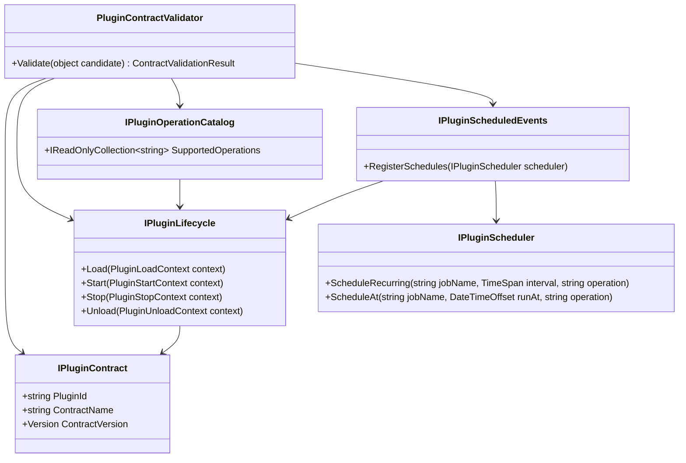

# Requirements: Modus.Core Plugin Lifecycle And Operations Contract

> Scope: Define Core-level plugin contract requirements so every plugin declares lifecycle operations, explicitly exposes the operations it implements, and can register scheduled events through a stable contract-first API.

---

## Functionality Worktree

### Coverage Matrix

| Capability | Required Outcome | Dependency Note | Status |
|---|---|---|---|
| Lifecycle contract | Core exposes explicit plugin lifetime operations for load/start/stop/unload | [mandatory - lifecycle foundation] | Implemented |
| Operations exposure contract | A plugin contract extending lifecycle exposes the operations it implements | [depends on lifecycle contract] | Implemented |
| Scheduled events contract | Plugins can declare and register scheduled events through a Core abstraction | [depends on lifecycle contract] | Implemented |
| Contract validation updates | Validator enforces lifecycle, operations exposure, and scheduling capabilities | [depends on operations and scheduling contracts] | Implemented |
| Runtime state alignment | Lifecycle operations align with runtime states and allowed transitions | [depends on lifecycle contract and PluginRuntimeState] | Pending |
| Contract-test coverage | xUnit contract tests enforce required capabilities and negative paths | [depends on all contract definitions] | Implemented |

### Class Diagram

### Completeness Checklist

- [x] Add `IPluginLifecycle` to Core with explicit `Load`, `Start`, `Stop`, and `Unload` operations [mandatory - lifecycle operations]
- [x] Define lifecycle context contracts for each lifetime operation to avoid host-internal coupling [depends on IPluginLifecycle]
- [x] Add `IPluginOperationCatalog` so lifecycle plugins expose a deterministic operation list via `SupportedOperations` [mandatory - operations exposure]
- [x] Add `IPluginScheduledEvents` and `IPluginScheduler` abstractions so plugins can register recurring and one-time scheduled events [mandatory - scheduled events]
- [x] Update `PluginContractValidator.Validate` to require `IPluginLifecycle`, `IPluginOperationCatalog`, and scheduling capability when declared by contract policy [depends on lifecycle, operations, and scheduling contracts]
- [x] Add Core contract tests proving lifecycle requirements, operation exposure validation, and scheduled-event registration semantics [mandatory - contract test gate]

### Implementation Mapping Status (Current Iteration)

| Member | Status |
|---|---|
| `PluginContractValidator.Validate(object candidate, PluginContractValidationPolicy policy)` | Implemented (includes operation-catalog duplicate validation and deduplicated missing-capability reporting) |
| `PluginContractValidationPolicy.RequireScheduledEventsCapability` | Implemented |
| `PluginLoadContext` | Implemented |
| `PluginStartContext` | Implemented |
| `PluginStopContext` | Implemented |
| `PluginUnloadContext` and `PluginUnloadReason` | Implemented |
| `IPluginOperationCatalog.SupportedOperations` | Implemented |
| `IPluginScheduledEvents.RegisterSchedules(IPluginScheduler scheduler)` | Implemented |
| `IPluginScheduler.ScheduleRecurring(...)` and `IPluginScheduler.ScheduleAt(...)` | Implemented |

---

## Test Plan

### `IPluginLifecycle`

1. `LifecycleContract_GivenCompliantPlugin_ExpectedLoadStartStopUnloadOperationsExposed`
   *Assumption*: A compliant plugin must expose all four lifecycle operations as first-class contract members.

2. `LifecycleContract_GivenMissingStartOperation_ExpectedValidationFailureBeforeRegistration`
   *Assumption*: Missing any required lifecycle operation makes the plugin contract invalid before runtime registration.

### Lifecycle Context Contracts

1. `LifecycleContext_GivenLoadOperation_ExpectedContextContainsPluginIdentityAndCancellation`
   *Assumption*: Load context must carry identity and cancellation data required for deterministic startup behavior.

2. `LifecycleContext_GivenUnloadOperation_ExpectedContextContainsReasonAndDeadline`
   *Assumption*: Unload context must include structured shutdown reason and timing constraints for deterministic teardown.

### `IPluginOperationCatalog`

1. `OperationCatalog_GivenLifecyclePlugin_ExpectedSupportedOperationsDeclaredDeterministically`
   *Assumption*: Plugins extending lifecycle must publish a stable, deterministic list of operations they implement.

2. `OperationCatalog_GivenDuplicateOperationNames_ExpectedValidationFailure`
   *Assumption*: Duplicate operation names in a plugin operation catalog are invalid and must fail contract validation.

3. `OperationCatalog_GivenNoOperations_ExpectedValidationFailure`
   *Assumption*: A lifecycle plugin that exposes an empty operation list does not satisfy operations-exposure contract completeness.

### Scheduled Events Contracts

1. `ScheduledEvents_GivenRecurringScheduleDefinition_ExpectedSchedulerRegistersOperationAtInterval`
   *Assumption*: A plugin schedule definition for recurring work registers with scheduler interval semantics without host-specific dependencies.

2. `ScheduledEvents_GivenOneTimeScheduleDefinition_ExpectedSchedulerRegistersOperationAtSpecificInstant`
   *Assumption*: A one-time schedule definition binds an operation to a specific execution instant through Core scheduler abstraction.

### `PluginContractValidator.Validate`

1. `ContractValidator_GivenPluginWithoutLifecycle_ExpectedMissingCapabilitiesIncludesIPluginLifecycle`
   *Assumption*: Contract validator must explicitly report lifecycle interface absence as a missing capability.

2. `ContractValidator_GivenPluginWithoutOperationCatalog_ExpectedMissingCapabilitiesIncludesIPluginOperationCatalog`
   *Assumption*: A lifecycle plugin that does not expose supported operations is contract-incomplete.

3. `ContractValidator_GivenPolicyRequiresSchedulingAndPluginOmitsIt_ExpectedSchedulingCapabilityFailure`
   *Assumption*: When scheduling capability is required by policy, omitting scheduled-events contract must fail validation.

### Core Contract Tests

1. `PluginContracts_GivenCompliantPlugin_ExpectedValidatorPassesAllMandatoryCapabilities`
   *Assumption*: A plugin implementing lifecycle, operation exposure, and scheduling contracts passes Core contract validation.

2. `PluginContracts_GivenPartiallyImplementedPlugin_ExpectedValidatorReportsAllMissingCapabilities`
   *Assumption*: Validator returns a complete list of missing capabilities rather than failing on first missing interface.

---

*All assumptions verified by Falsify Claims. Zero Falsified rows.*

## Project Readiness Notes

- Status: Ready for Core plugin lifecycle and operations contract scope in this requirements document.
- Basis: All checklist items are complete, mapped members are implemented, and build plus test suites are passing.