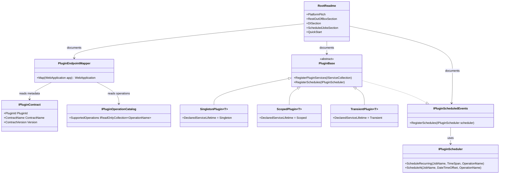

# Requirements: Modus.Docs

> Scope: Improve the root README and package READMEs so Modus sells its three most compelling built-in capabilities — automatic REST endpoint mapping, first-class DI integration with lifetime selection, and scheduled job support — with accurate examples verified against the current codebase.

---

## Functionality Worktree

### Coverage Matrix

| Capability | Required Outcome | Dependency Note | Status |
|---|---|---|---|
| Document REST out of the box | Explain that every plugin operation is automatically exposed as `POST /api/{pluginId}/{operation}` with no extra wiring by the plugin author | [mandatory — user-reported gap; foundation for OpenAPI section] | Completed |
| Document OpenAPI / Swagger support | Show that Swagger UI and `/openapi/v1.json` are available immediately when the host starts | [depends on REST out of the box section] | Completed |
| Document DI integration and lifetime selection | Explain `AddModusPluginHosting`, `SingletonPlugin<T>`, `ScopedPlugin<T>`, `TransientPlugin<T>`, and how plugins register their own services | [mandatory — user-reported gap; prerequisite for embedded-host example] | Completed |
| Document scheduled jobs support | Explain `IPluginScheduledEvents.RegisterSchedules`, `IPluginScheduler.ScheduleRecurring`, and `IPluginScheduler.ScheduleAt` with a concrete usage example | [mandatory — user-reported gap] | Completed |
| Update platform overview / pitch | Revise the root README opening section to lead with the three built-in capabilities rather than architectural principles | [depends on REST, DI, and scheduled-jobs sections] | Completed |
| Validate all documented commands and snippets | Run every example command and verify the success signal stated in the docs matches actual output | [depends on all content sections] | Completed |

### Class Diagram

### Completeness Checklist

- [x] Document REST out of the box: `PluginEndpointMapper` auto-generates `POST /api/{pluginId}/{operation}` for every declared plugin operation [mandatory — user-reported gap]
- [x] Document OpenAPI / Swagger support: `AddOpenApi()` + `.WithOpenApi()` per endpoint produces `/openapi/v1.json` and Swagger UI immediately [depends on REST out of the box section]
- [x] Document DI integration and lifetime selection: `AddModusPluginHosting`, `SingletonPlugin<T>` / `ScopedPlugin<T>` / `TransientPlugin<T>`, `RegisterPluginServices` override [mandatory — user-reported gap]
- [x] Document scheduled jobs support: `IPluginScheduledEvents.RegisterSchedules`, `IPluginScheduler.ScheduleRecurring`, `IPluginScheduler.ScheduleAt` [mandatory — user-reported gap]
- [x] Update platform overview / pitch in root README to lead with built-in capabilities [depends on REST, DI, and scheduled-jobs sections]
- [x] Validate all documented commands and snippets produce the stated success signals [depends on all content sections]

Transition proof for this docs pass: [.github/artifacts/iterative-implementation-modus-docs-capabilities-transition-proof-2026-05-20.md](.github/artifacts/iterative-implementation-modus-docs-capabilities-transition-proof-2026-05-20.md)

---

## Falsify Claims

| # | Claim | Evidence (file:line) | Status | Reason |
|---|---|---|---|---|
| 1 | Root README.md contains no mention of REST, HTTP endpoints, or `PluginEndpointMapper` | README.md (full read, lines 1–200) | Supported | No REST or HTTP content present in root README |
| 2 | `PluginEndpointMapper` registers `POST /api/{pluginId}/{operation}` for each plugin operation | src/Modus.Host/Domain/WebApi/PluginEndpointMapper.cs:70 | Supported | `app.MapPost($"/api/{pluginId}/{operation}", ...)` confirmed |
| 3 | OpenAPI is wired via `AddOpenApi()` and `.WithOpenApi()` per endpoint | src/Modus.Host/Program.cs:11, PluginEndpointMapper.cs:86 | Supported | Both call sites confirmed |
| 4 | `SingletonPlugin<T>`, `ScopedPlugin<T>`, `TransientPlugin<T>` base classes exist | src/Modus.Core/Plugins/Base/PluginBase.cs:79,88,97 | Supported | All three abstract classes confirmed |
| 5 | `IPluginScheduledEvents.RegisterSchedules` and `IPluginScheduler.ScheduleRecurring/ScheduleAt` exist | src/Modus.Core/Plugins/Contracts/IPluginScheduledEvents.cs:5, IPluginScheduler.cs:5,7 | Supported | Interface members confirmed |
| 6 | Root README.md does not mention scheduled jobs or `RegisterSchedules` | README.md (full read) | Supported | No scheduling content in root README |
| 7 | `PluginBase` implements `IPluginScheduledEvents` by default, making scheduling available to all plugin base classes | src/Modus.Core/Plugins/Base/PluginBase.cs:5 | Supported | Class declaration: `PluginBase : IPluginContract, IPluginLifecycle, IPluginOperationCatalog, IPluginScheduledEvents` |
| 8 | `AddModusPluginHosting` is an `IServiceCollection` extension method in `PluginHostingHostExtensions` | src/Modus.Host/Domain/Hosting/PluginHostingHostExtensions.cs:16 | Supported | Confirmed signature and return type |

Zero Falsified rows.

---

## Test Plan

### `RestEndpointAutoMapping`

1. `RestEndpointAutoMapping_WhenPluginDeclaresSupportedOperations_EndpointsRegisteredAtExpectedRoutes`
   *Assumption*: When the host starts with a plugin that declares supported operations, `PluginEndpointMapper.Map` registers a `POST` route at `/api/{pluginId}/{operation}` for each declared operation.

2. `RestEndpointAutoMapping_WhenPluginHasNoOperations_NoEndpointRegistered`
   *Assumption*: When a plugin's `SupportedOperations` collection is empty, `PluginEndpointMapper.Map` registers zero routes for that plugin.

3. `RestEndpointAutoMapping_WhenMultiplePluginsPresent_EachGetsIsolatedRoutePrefix`
   *Assumption*: When multiple plugins are loaded, each plugin's routes use its own `PluginId` as the route prefix, producing no collisions.

4. `RestEndpointAutoMapping_RouteMetadata_CarriesPluginIdTagContractNameSummary`
   *Assumption*: Each registered endpoint carries OpenAPI metadata: tag from `PluginId`, summary from `OperationName`, and description from `ContractName` and `ContractVersion`.

### `OpenApiSupport`

5. `OpenApiSupport_WhenHostStarts_OpenApiJsonEndpointRespondsWithSuccess`
   *Assumption*: A running host exposes `/openapi/v1.json` and responds with HTTP 200 containing a valid OpenAPI document that lists plugin operation routes.

6. `OpenApiSupport_WhenPluginOperationRegistered_OperationAppearsInOpenApiDocument`
   *Assumption*: After `PluginEndpointMapper.Map` is called, the operation appears by name in the OpenAPI document at `/openapi/v1.json`.

### `DIIntegrationAndLifetimeSelection`

7. `DIIntegrationAndLifetimeSelection_SingletonPlugin_ServiceRegisteredAsSingleton`
   *Assumption*: A plugin extending `SingletonPlugin<T>` has its service registered with `ServiceLifetime.Singleton` in the DI container after `AddModusPluginHosting` completes.

8. `DIIntegrationAndLifetimeSelection_ScopedPlugin_ServiceRegisteredAsScoped`
   *Assumption*: A plugin extending `ScopedPlugin<T>` has its service registered with `ServiceLifetime.Scoped`.

9. `DIIntegrationAndLifetimeSelection_TransientPlugin_ServiceRegisteredAsTransient`
   *Assumption*: A plugin extending `TransientPlugin<T>` has its service registered with `ServiceLifetime.Transient`.

10. `DIIntegrationAndLifetimeSelection_AddModusPluginHosting_DiscoversAndWiresAllPluginsInFolder`
    *Assumption*: Calling `services.AddModusPluginHosting(opts => opts.PluginsPath = "plugins")` discovers all plugin assemblies in the specified folder and registers their contracts in the DI container without any additional wiring by the caller.

### `ScheduledJobsSupport`

11. `ScheduledJobsSupport_WhenScheduleRecurringCalled_JobIsInvokedAtDeclaredInterval`
    *Assumption*: When `IPluginScheduler.ScheduleRecurring` is called inside `RegisterSchedules`, the host schedules the named job to fire the declared operation at the stated `TimeSpan` interval.

12. `ScheduledJobsSupport_WhenScheduleAtCalled_JobFiresAtSpecifiedDateTimeOffset`
    *Assumption*: When `IPluginScheduler.ScheduleAt` is called with a future `DateTimeOffset`, the host fires the operation once at that point in time and does not repeat it.

13. `ScheduledJobsSupport_RegisterSchedules_IsCalledByHostDuringActivation`
    *Assumption*: The host calls `RegisterSchedules(IPluginScheduler)` on every loaded plugin during the activation stage, before the plugin reaches the operation stage.

14. `ScheduledJobsSupport_WhenPluginDoesNotOverrideRegisterSchedules_NoJobsAreScheduled`
    *Assumption*: The default `PluginBase.RegisterSchedules` implementation is a no-op, so plugins that do not override it produce zero scheduled jobs.

### `PlatformOverviewPitch`

15. `PlatformOverviewPitch_RootReadme_ContainsRestOutOfBoxSection`
    *Assumption*: After the docs update, the root README contains a section or bullet explicitly stating that plugin operations are automatically available as HTTP endpoints with no extra wiring.

16. `PlatformOverviewPitch_RootReadme_ContainsDILifetimeSectionWithCodeExample`
    *Assumption*: After the docs update, the root README contains a DI section that shows `SingletonPlugin<T>`, `ScopedPlugin<T>`, and `TransientPlugin<T>` with a code example.

17. `PlatformOverviewPitch_RootReadme_ContainsScheduledJobsSection`
    *Assumption*: After the docs update, the root README contains a section covering `RegisterSchedules`, `ScheduleRecurring`, and `ScheduleAt` with a concrete code example.

### `SnippetAndCommandValidation`

18. `SnippetAndCommandValidation_DotnetRunPluginsRunOnce_ExitsZeroWithSuccessMarkers`
    *Assumption*: The `dotnet run --project src/Modus.Host/Modus.Host.csproj -- plugins --run-once` command documented in the README exits with code 0 and prints all four `outcome=success` stage markers.

19. `SnippetAndCommandValidation_EmbeddedHostingSnippet_CompilesAndResolvesHostRunner`
    *Assumption*: The embedded hosting code snippet in the README compiles without errors and `provider.GetRequiredService<HostRunner>()` resolves successfully.

---

*All assumptions verified by Falsify Claims. Zero Falsified rows.*
