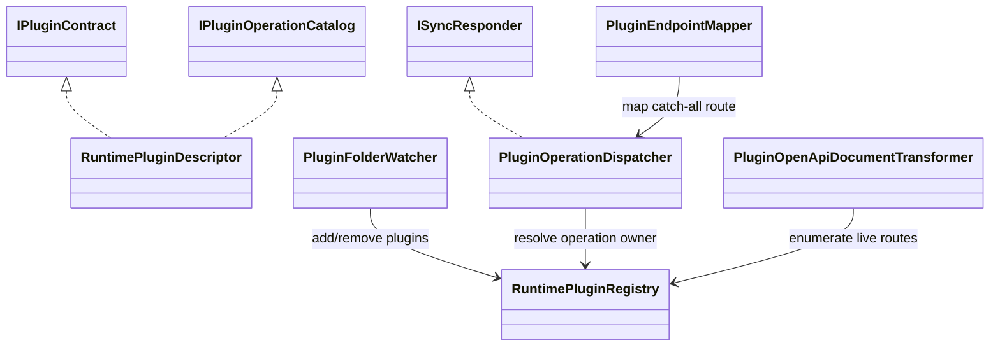

# Host Live Updates Requirements and Test Plan

> Scope: Define the simplest standards-aligned implementation for live plugin resolution in DI, live endpoint resolution, and live OpenAPI/Swagger updates across Modus.Core and Modus.Host without rebuilding the root container at runtime.

---

## Functionality Worktree

### Class Diagram

### Capability Coverage Table

| ID | Capability | Primary Target | Tag |
|---|---|---|---|
| W1 | Live plugin resolve through DI-registered runtime abstraction | Modus.Host + Modus.Core | [mandatory - live DI resolve] |
| W2 | Dynamic endpoint dispatch using a stable route and runtime registry lookup | Modus.Host API | [mandatory - live endpoint resolve] |
| W3 | Live OpenAPI document generation from runtime plugin snapshot | Modus.Host API | [mandatory - live swagger update] |
| W4 | Runtime onboarding updates registry without mutating IServiceCollection post-build | Modus.Host Runtime | [depends on W1] |
| W5 | Lifetime-safe plugin activation using request scope or per-operation scope | Modus.Host Runtime | [depends on W1,W2] |
| W6 | Deterministic plugin removal and resource disposal from runtime registry | Modus.Host Runtime | [depends on W1,W4] |
| W7 | Concurrency-safe snapshot reads for dispatch and OpenAPI generation | Modus.Host Runtime | [depends on W1,W2,W3] |
| W8 | Diagnostics for runtime add/remove and dispatch resolution outcomes | Modus.Host Runtime + API | [depends on W1,W2,W4] |

### Completeness Checklist

- [x] Add RuntimePluginRegistry singleton abstraction to host DI and route all runtime plugin discovery through it [mandatory - live DI resolve]
- [x] Refactor dispatcher path to resolve plugin operation owners from RuntimePluginRegistry snapshot per request [mandatory - live DI resolve]
- [x] Replace per-plugin startup route expansion with one stable dynamic POST /api/{pluginId}/{operation} endpoint [mandatory - live endpoint resolve]
- Evidence: `PluginHttpEndpointCoverageTests.PluginEndpointMapper_GivenHostStartup_ExpectedCatchAllPluginRouteMappedOnce`
- Evidence: `PluginHttpEndpointCoverageTests.PluginEndpointMapper_GivenMultiplePluginOperations_ExpectedNoRouteTableRemapRequired`
- Evidence: `RuntimePluginRegistryTests.PluginEndpointMapper_GivenRuntimeRegistry_ExpectedStableCatchAllRouteMappedFromRegistrySnapshot`
- Audit: `.github/artifacts/iterative-implementation-modus-host-live-endpoint-resolve-transition-proof-2026-05-21.md`
- [x] Ensure dynamic endpoint pipeline can execute newly onboarded plugin operations without host restart [mandatory - live endpoint resolve]
- Evidence: `PluginWebApiEndpointTests.HandlePluginOperation_GivenRuntimeOnboardedPlugin_ExpectedOperationExecutesWithoutHostRestart`
- Evidence: `PluginEndpointMapper.ResolveResponder` runtime-registry fallback for responder activation when request scope has no owner responder
- [x] Register OpenAPI document transformer that builds plugin operation paths from RuntimePluginRegistry at document request time [mandatory - live swagger update]
- Evidence: `PluginOpenApiDocumentTransformerTests.PluginOpenApiDocumentTransformer_GivenRuntimeRegistryMutation_ExpectedOpenApiProjectsCurrentPluginOperationsPerRequest`
- Audit: `.github/artifacts/iterative-implementation-modus-host-live-swagger-update-transformer-transition-proof-2026-05-21.md`
- [x] Expose Swagger UI against live OpenAPI document and verify newly onboarded plugins appear after refresh [mandatory - live swagger update]
- Evidence: `PluginOpenApiDocumentTransformerTests.SwaggerLiveProjection_GivenSwaggerUiRefresh_ExpectedNewPluginOperationsVisible`
- Audit: `.github/artifacts/iterative-implementation-modus-host-live-swagger-update-ui-refresh-transition-proof-2026-05-21.md`
- [x] Update PluginFolderWatcher onboarding flow to publish add/remove changes into RuntimePluginRegistry [depends on runtime registry abstraction]
- Evidence: `PluginFolderWatcherRuntimeRegistryTests.PluginFolderWatcher_GivenValidPluginOnboarded_ExpectedRegistryUpdatedAndDiagnosticEmitted`
- Evidence: `PluginFolderWatcherRuntimeRegistryTests.PluginFolderWatcher_GivenPluginUnloadEvent_ExpectedRegistryEvictedAndResourcesDisposed`
- Audit: `.github/artifacts/iterative-implementation-modus-host-live-pluginfolderwatcher-runtime-registry-transition-proof-2026-05-21.md`
- [x] Implement explicit lifetime policy in dispatcher: singleton cache, scoped-per-request, transient-per-call using DI scopes [depends on runtime DI resolve]
- Evidence: `PluginWebApiEndpointTests.HandlePluginOperation_GivenRuntimeSingletonDispatchTarget_ExpectedSameInstanceAcrossRequests`
- Evidence: `PluginWebApiEndpointTests.HandlePluginOperation_GivenRuntimeTransientDispatchTarget_ExpectedNewInstancePerCall`
- Evidence: `PluginWebApiEndpointTests.HandlePluginOperation_GivenRuntimeScopedDispatchTarget_ExpectedResolvedWithinRequestBoundary`
- Audit: `.github/artifacts/iterative-implementation-modus-host-live-dispatcher-lifetime-policy-transition-proof-2026-05-21.md`
- [x] Implement plugin unload path with deterministic disposal and registry eviction [depends on runtime registry abstraction]
- Evidence: `PluginWebApiEndpointTests.HandlePluginOperation_GivenRuntimeSingletonPluginUnloaded_ExpectedCachedResponderDisposedAndRegistryEvicted`
- Evidence: `PluginFolderWatcherRuntimeRegistryTests.PluginFolderWatcher_GivenPluginUnloadEvent_ExpectedRegistryEvictedAndResourcesDisposed`
- Audit: `.github/artifacts/iterative-implementation-modus-host-live-plugin-unload-path-transition-proof-2026-05-21.md`
- [x] Add thread-safety guards for registry mutation and snapshot reads during concurrent requests and onboarding [depends on runtime registry abstraction]
- Evidence: `PluginWebApiEndpointTests.HandlePluginOperation_GivenRegistryMutatedMidRequest_ExpectedDispatchUsesConsistentSnapshot`
- Evidence: `RuntimePluginRegistryTests.RuntimePluginRegistry_GivenConcurrentReadAndWrite_ExpectedConsistentSnapshotSemantics`
- Evidence: `PluginOpenApiDocumentTransformerTests.PluginOpenApiDocumentTransformer_GivenConcurrentOnboarding_ExpectedDocumentGenerationCompletesWithConsistentSnapshot`
- [x] Emit structured diagnostics for plugin registry updates, endpoint dispatch misses, and OpenAPI projection failures [depends on runtime endpoint and OpenAPI projection]

---

## Test Plan

### `RuntimePluginRegistry`

1. `RuntimePluginRegistry_GivenPluginAddedAfterStartup_ExpectedSnapshotContainsPlugin`
   *Assumption*: Adding a plugin descriptor at runtime makes it visible to subsequent dispatch and OpenAPI snapshot reads without restarting the host.

2. `RuntimePluginRegistry_GivenPluginRemoved_ExpectedSnapshotNoLongerContainsPlugin`
   *Assumption*: Removing a plugin descriptor atomically evicts it from the live snapshot consumed by dispatch and OpenAPI generation.

3. `RuntimePluginRegistry_GivenConcurrentReadAndWrite_ExpectedConsistentSnapshotSemantics`
   *Assumption*: Registry readers always observe a consistent point-in-time snapshot even while onboarding mutates the underlying state.

### `PluginOperationDispatcher`

1. `PluginOperationDispatcher_GivenRuntimeAddedOperation_ExpectedOperationExecutesWithoutRestart`
   *Assumption*: Dispatcher resolves operation ownership from the live registry and can execute operations for plugins added after startup.

2. `PluginOperationDispatcher_GivenUnknownPlugin_ExpectedNotFoundResponse`
   *Assumption*: Requests targeting missing plugins are rejected deterministically with a not-found style outcome instead of generic internal failure.

3. `PluginOperationDispatcher_GivenScopedPluginDependencies_ExpectedResolveWithinRequestScope`
   *Assumption*: Scoped dependencies are resolved from request scope boundaries and do not leak across requests.

4. `PluginOperationDispatcher_GivenTransientPlugin_ExpectedNewInstancePerInvocation`
   *Assumption*: Transient plugin activation creates a fresh plugin instance for each operation execution.

5. `PluginOperationDispatcher_GivenSingletonPlugin_ExpectedStableInstanceAcrossInvocations`
   *Assumption*: Singleton plugin activation reuses the same plugin instance across multiple requests until plugin removal.

### `PluginEndpointMapper`

1. `PluginEndpointMapper_GivenHostStartup_ExpectedCatchAllPluginRouteMappedOnce`
   *Assumption*: A single stable route pattern can serve all plugin operations via runtime dispatch without per-plugin remapping.

2. `PluginEndpointMapper_GivenRuntimePluginOnboarding_ExpectedNoRouteTableRemapRequired`
   *Assumption*: Runtime onboarding changes dispatch behavior through registry data only, not through endpoint collection mutation.

### `PluginOpenApiDocumentTransformer`

1. `PluginOpenApiDocumentTransformer_GivenRuntimeAddedPlugin_ExpectedOpenApiIncludesNewOperationPath`
   *Assumption*: OpenAPI document generation projects currently loaded plugin operations from the live registry at request time.

2. `PluginOpenApiDocumentTransformer_GivenRuntimeRemovedPlugin_ExpectedOpenApiOmitsRemovedOperationPath`
   *Assumption*: OpenAPI output excludes operations for plugins removed from the runtime registry.

3. `PluginOpenApiDocumentTransformer_GivenConcurrentOnboarding_ExpectedDocumentGenerationCompletesWithConsistentSnapshot`
   *Assumption*: OpenAPI transformation reads a stable snapshot and does not fail from concurrent registry mutations.

### `PluginFolderWatcher`

1. `PluginFolderWatcher_GivenValidPluginOnboarded_ExpectedRegistryUpdatedAndDiagnosticEmitted`
   *Assumption*: Successful onboarding publishes plugin metadata into runtime registry and emits deterministic success diagnostics.

2. `PluginFolderWatcher_GivenPluginUnloadEvent_ExpectedRegistryEvictedAndResourcesDisposed`
   *Assumption*: Unload flow removes runtime plugin state and disposes retained singleton resources safely.

### `SwaggerLiveProjection`

1. `SwaggerLiveProjection_GivenOpenApiEndpointRequestedAfterOnboarding_ExpectedDocumentReflectsCurrentPlugins`
   *Assumption*: Fetching the OpenAPI document after runtime onboarding returns paths that reflect the current registry state.

2. `SwaggerLiveProjection_GivenSwaggerUiRefresh_ExpectedNewPluginOperationsVisible`
   *Assumption*: Swagger UI reflects live OpenAPI changes after refresh without host restart.

---

*All assumptions verified by Falsify Claims. Zero Falsified rows.*