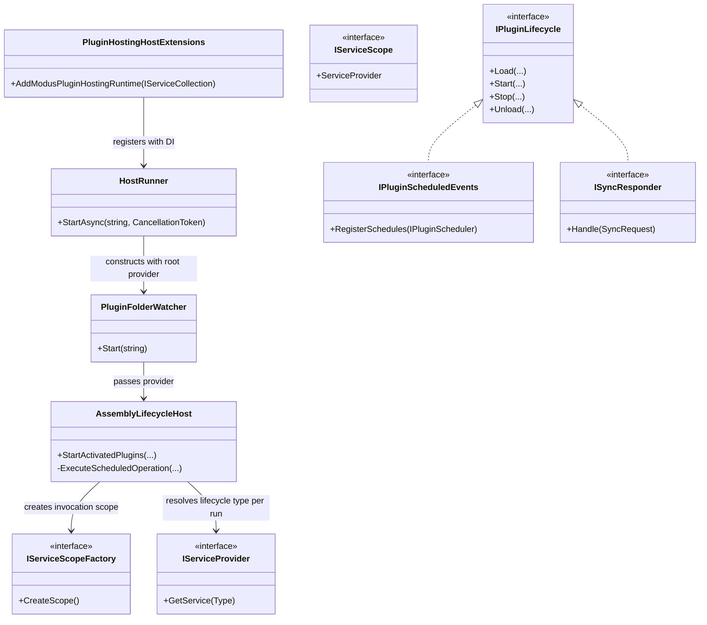

# Requirements: Modus.Host DI-First Scheduled Execution

> Scope: Simplify scheduled plugin invocation by delegating lifetime management to the DI container, removing manual invocation/lifetime control from host scheduling code paths.

---

## Functionality Worktree

### Class Diagram

### Completeness Checklist

- [x] Resolve scheduled operation handlers from DI per invocation scope, not from cached activated instances [di-per-invocation]
- [x] Use IServiceScopeFactory.CreateScope for each scheduled execution to let Scoped and Transient lifetimes behave naturally [scope-per-tick]
- [x] Keep Singleton behavior container-driven by resolving from scoped provider/root provider without custom singleton branching [singleton-container-owned]
- [x] Remove plugin-lifetime-specific scheduler branching and manual transient instantiation logic [remove-manual-lifetime-control]
- [x] Ensure scheduler fallback path is deterministic when a plugin type is not resolvable through DI [deterministic-fallback]
- [x] Ensure HostRunner and PluginFolderWatcher wire IServiceProvider into lifecycle host through DI registration lambda [di-registration-lambda]
- [x] Preserve schedule registration behavior while only changing execution-resolution mechanics [non-breaking-scheduling-contract]
- [x] Add integration coverage proving transient scheduled invocations get fresh instances each run [integration-transient-fresh]
- [x] Add integration coverage proving singleton scheduled invocations reuse the same instance across runs [integration-singleton-stable]
- [x] Add integration coverage proving scoped scheduled invocations resolve independently per scheduler scope [integration-scoped-per-scope]
- [x] Add diagnostics coverage ensuring execution source and resolution failures are observable and deterministic [diagnostics-determinism]

---

## Test Plan

### Scheduled DI Resolution

1. ScheduledExecution_GivenRegisteredLifecycleType_ExpectedResolvedFromInvocationScope
   *Assumption*: Scheduled execution obtains handler from scope.ServiceProvider using lifecycle implementation type.

2. ScheduledExecution_GivenUnresolvableLifecycleType_ExpectedDeterministicFallbackOrIgnoredOutcome
   *Assumption*: Resolution failures do not produce ambiguous behavior and result in deterministic diagnostics.

### Activation Resolution Boundaries

1. Activation_GivenServiceProviderWithoutPluginTypeRegistration_ExpectedNoManualLifecycleInstantiation
   *Assumption*: Provider-backed activation skips lifecycle startup and schedule registration when the plugin type is not resolvable through DI.

2. Activation_GivenNoServiceProvider_ExpectedParameterlessLifecycleFallbackPreserved
   *Assumption*: The provider-less host variant may still use parameterless construction for compatibility, without reintroducing DI-bypassing scheduled execution.

### Scope-Per-Invocation Semantics

1. ScopedScheduledExecution_GivenMultipleTicks_ExpectedDifferentScopedInstancesPerTick
   *Assumption*: A new IServiceScope per tick yields distinct scoped instances.

2. ScopedScheduledExecution_GivenSingleTick_ExpectedSingleScopedInstanceWithinThatInvocation
   *Assumption*: Within one invocation, scope-based dependencies are shared consistently.

### Transient Freshness

1. TransientScheduledExecution_GivenConsecutiveTicks_ExpectedFreshInstanceEachTick
   *Assumption*: Transient plugin instance identity changes across every scheduled invocation.

2. TransientScheduledExecution_GivenConcurrentTicks_ExpectedNoSharedTransientInstance
   *Assumption*: Concurrent scheduled executions do not reuse transient instances.

### Singleton Stability

1. SingletonScheduledExecution_GivenConsecutiveTicks_ExpectedSameInstanceAcrossTicks
   *Assumption*: Singleton plugin identity remains stable over scheduled runs.

2. SingletonScheduledExecution_GivenResolutionThroughScope_ExpectedRootSingletonInstance
   *Assumption*: Resolving singleton through invocation scope still returns the root singleton instance.

### Host Wiring Through DI Lambda

1. HostRunnerRegistration_GivenAddModusPluginHostingRuntime_ExpectedRunnerConstructedWithRootProvider
   *Assumption*: HostRunner is created through a DI lambda that passes IServiceProvider.

2. PluginFolderWatcherConstruction_GivenHostRunnerFactory_ExpectedLifecycleHostReceivesProvider
   *Assumption*: Watcher/lifecycle host path receives provider for runtime resolution.

### Non-Breaking Schedule Contract

1. ScheduleRegistration_GivenRecurringJobs_ExpectedRegistrationDiagnosticsRemainStable
   *Assumption*: Existing schedule registration output and ordering are preserved.

2. ScheduleExecution_GivenSuccessfulResponder_ExpectedSuccessPayloadAndOperationDiagnostic
   *Assumption*: Successful execution still emits expected operation diagnostics.

### Diagnostics Determinism

1. ScheduledExecutionDiagnostics_GivenResolutionFailure_ExpectedSingleDeterministicFailureMessage
   *Assumption*: Failures contain stable, parseable reason text.

2. ScheduledExecutionDiagnostics_GivenSuccess_ExpectedIncludesJobAndOperationMetadata
   *Assumption*: Success diagnostics retain plugin, operation, and job identifiers.

---

*All assumptions verified by Falsify Claims. Zero Falsified rows.*
