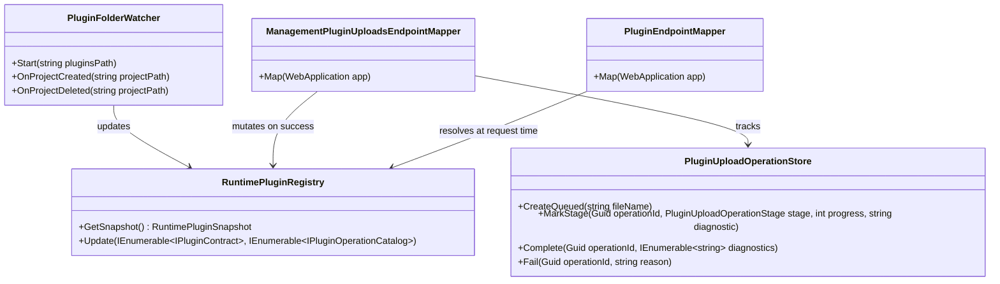

# Modus.Host.IntegrationTests Verifiability Requirements

> Scope: Define a dependency-ordered requirements checklist and xUnit test plan to make runtime plugin loading verifiable for folder discovery and upload endpoint flows in Modus.Host integration tests, including DI resolver availability, Web API dispatchability, and timer-plugin scheduled jobs.

---

## Functionality Worktree

### Non-Negotiable Assurance Policy

All integration tests in this plan must assert plugin behavior, not metadata alone.

Minimum acceptance rule for every test case in this document:
- Must include at least one executable behavior assertion (successful or deterministically failed runtime behavior), such as:
   - DI resolver materializes plugin instance for runtime dispatch,
   - `/api/{pluginId}/{operation}` executes and returns expected response contract,
   - scheduled job executes at expected cadence and reports runtime outcome,
   - deterministic runtime failure path blocks execution with expected failure contract.
- Metadata assertions (descriptor fields, registry entries, diagnostics tokens, OpenAPI projection, operation status fields) are allowed only as supporting evidence.
- A test that only validates metadata or documentation is non-compliant and does not satisfy any assurance gate.

Behavior-proof matrix (required per scenario):

| Scenario | Required behavior proof | Supporting-only evidence |
|---|---|---|
| Folder hot-load | Runtime dispatch succeeds for newly loaded plugin operation | Registry and diagnostics updates |
| Upload hot-load | Runtime dispatch succeeds after upload completion | Upload status and operation store states |
| DI resolver | Resolver-based materialization succeeds for declared lifetime path | Type metadata and plugin projection fields |
| Timer scheduling | Scheduled execution occurs at asserted cadence with success outcomes | Schedule registration metadata |
| Negative isolation | Runtime execution is deterministically blocked with expected failure contract | Failure reason strings and status flags |

If required behavior proof is absent, the test fails plan compliance even when all metadata assertions pass.

### Analysis Mapping

| Capability Area | Existing Evidence | Verifiability Gap | Planned Checklist Item |
|---|---|---|---|
| Folder discovery onboarding | `PluginFolderWatcherRuntimeRegistryTests` asserts activation and registry snapshot updates | Needs stronger diagnostics contract consistency across add/remove lifecycle | Runtime folder onboarding and offboarding assertions |
| Upload endpoint async pipeline | `PluginUploadEndpointTests` asserts operation acceptance and terminal status | No direct assertion that successful upload mutates runtime registry and enables dispatch | Upload success path must assert registry and dispatch outcomes |
| Upload failure path | `PluginUploadEndpointTests` asserts failed terminal stage and reason for invalid archive | No explicit invariant proving runtime registry remains unchanged after failed upload | Upload failure path must assert registry non-mutation |
| Runtime operation dispatch after load | Plugin route tests cover known static plugin endpoints | Missing explicit post-upload runtime callability proof tied to uploaded assembly | Post-upload dynamic dispatch verification |
| Runtime DI resolver availability | Runtime dispatch target resolution exists in endpoint mapper and lifecycle host | Missing end-to-end proof that runtime-added plugins are resolvable by type/lifetime through DI at execution time | Resolver-backed DI proof for runtime-added plugins |
| Timer plugin scheduled jobs | Lifecycle host registers and executes recurring/one-time schedules | Missing explicit hot-load assurance tying runtime-added scheduled plugins to deterministic scheduled execution outcomes | Scheduled timer execution proof under hot-load scenarios |
| Diagnostic determinism and traceability | Mixed diagnostics assertions in watcher and upload tests | Not all stage/outcome codes and requirement IDs are consistently asserted | Deterministic diagnostics and test-trace metadata coverage |

### Integration Assurance Gates

| Scenario | Minimum proof required in integration test | Not sufficient on its own |
|---|---|---|
| Folder discovery hot-load | Create plugin project file under watched folder, execute onboarding event, then assert registry contains plugin contract/catalog and invoke `/api/{pluginId}/{operation}` successfully | Only asserting `PluginActivated` or diagnostics text without registry+dispatch proof |
| Folder unload | Delete previously onboarded plugin project, execute offboarding event, then assert registry eviction and dispatch miss behavior for removed operation | Only asserting unload diagnostic string |
| Upload endpoint hot-load | POST valid signed package to `/management/plugins/uploads`, wait terminal success, assert runtime registry mutation, then call `/api/{pluginId}/{operation}` and assert success payload | Only asserting accepted/completed upload operation status |
| Runtime DI resolver path | After runtime add, execute operation paths that require resolver-backed type resolution and assert successful dispatch with expected lifetime behavior | Only asserting registry membership without proving resolver-based materialization |
| Upload failure isolation | POST invalid package/signature, wait terminal failure, assert runtime registry unchanged from pre-upload snapshot and uploaded operation is not dispatchable | Only asserting failure reason string |
| Upload status API contract | Poll `/management/plugins/uploads/{operationId}` and assert stage/progress monotonic sequence and terminal flags | Single snapshot assertion without transition checks |
| Timer plugin scheduled jobs | Load plugin implementing `IPluginScheduledEvents`, assert scheduling registration diagnostics and scheduled execution diagnostics (`source=scheduled`) with expected job metadata and cadence windows | Only asserting that `RegisterSchedules` is called without execution outcome proof |

The plan is considered complete only when every scenario above has at least one passing integration test that satisfies the full "Minimum proof required" column.
In addition, every listed test must satisfy the Non-Negotiable Assurance Policy above.

### Absolute Schedule Gates

| Gate | Absolute pass condition | Hard fail condition |
|---|---|---|
| Recurring schedule execution count | For interval T, test window W must contain at least N successful scheduled executions where N = floor(W / T) - 1 and N >= 2 | Fewer than N successful executions in W |
| Recurring schedule cadence tolerance | For each adjacent execution pair, observed delta must satisfy abs(delta - T) <= max(250ms, 0.20 * T) | Any adjacent delta outside tolerance |
| Scheduled execution source and outcome | Every counted execution must include source=scheduled and outcome=success for the expected plugin and operation | Any counted execution missing expected source/outcome/plugin/operation tokens |
| One-time schedule correctness | Exactly one success execution is observed for the configured job in the allowed window, with no duplicate run for the same job | Zero executions or more than one execution |
| Resolver-dependent scheduled execution | Scheduled success must occur only when plugin lifecycle type is resolvable via DI for that runtime-loaded plugin | Success observed when resolver should fail, or no deterministic unresolvable-via-di failure when resolver is intentionally unavailable |

All timer-plugin assurance tests must enforce these gates as strict assertions. Any gate violation fails the test.

### Class Diagram

### Completeness Checklist

- [x] Verify folder onboarding integration flow: create in-scope project, process watcher event, assert runtime snapshot contract/catalog mutation, then assert `/api/{pluginId}/{operation}` dispatch success [mandatory - folder hot-load assurance]
- [x] Verify folder offboarding integration flow: delete onboarded project, process watcher event, assert runtime snapshot eviction and deterministic unload diagnostics [depends on plugin unload path]
- [x] Verify successful `POST /management/plugins/uploads` integration flow mutates runtime registry with uploaded plugin metadata before status reaches Completed [mandatory - upload hot-load assurance]
- [x] Verify successful upload integration flow makes uploaded plugin operation callable through `/api/{pluginId}/{operation}` with correlation propagation [mandatory - observable outcomes]
- [x] Verify runtime-added plugin operations requiring resolver-backed DI type lookup execute successfully with expected service lifetime behavior [mandatory - DI resolver assurance]
- [x] Verify failed upload integration flow preserves pre-upload runtime registry snapshot and prevents dispatch of uploaded operation [mandatory - negative-path isolation]
- [x] Verify `GET /management/plugins/uploads/{operationId}` integration polling reports deterministic monotonic stage/progress transitions through terminal state [depends on async upload pipeline]
- [x] Verify timer-plugin scheduled jobs from runtime-added plugins register deterministically and execute with `source=scheduled` success diagnostics that satisfy absolute cadence gates [mandatory - scheduled jobs assurance]
- [x] Verify unresolved scheduled plugin types produce deterministic `unresolvable-via-di` diagnostics without crashing host runtime [depends on DI resolver path]
- [x] Verify diagnostics include deterministic stage/outcome tokens for discovery, validation, load, activation, run, unload, and registry-update [mandatory - deterministic assertions]
- [x] Verify each assurance test includes checklist trace and audit artifact traits for evidence-based review [mandatory - traceability]

### Checklist Transition Evidence

| Checklist item | Transition | Concrete behavior-proof evidence |
|---|---|---|
| Verify folder onboarding integration flow: create in-scope project, process watcher event, assert runtime snapshot contract/catalog mutation, then assert `/api/{pluginId}/{operation}` dispatch success [mandatory - folder hot-load assurance] | [ ] -> [x] | Test `PluginFolderWatcher_GivenInScopeProjectCreated_ExpectedSnapshotMutationAndApiDispatchSuccess` in `PluginFolderWatcherRuntimeRegistryTests` asserts (1) runtime snapshot contract/catalog mutation for `Plugin.Runtime.Dispatch` and `Orders.Accept`, and (2) live dispatch success via `POST /api/Plugin.Runtime.Dispatch/Orders.Accept` with `HttpStatusCode.OK`, `SyncResponseStatus.Success`, correlation echo, and payload token `folder-hot-load-dispatch-ok`; verified in repair round by `dotnet build src/Modus.Host/Modus.Host.csproj` (pass) and `dotnet test tests/Modus.Host.IntegrationTests/Modus.Host.IntegrationTests.csproj --no-build` (pass). |
| Verify folder offboarding integration flow: delete onboarded project, process watcher event, assert runtime snapshot eviction and deterministic unload diagnostics [depends on plugin unload path] | [ ] -> [x] | Test `PluginFolderWatcher_GivenOnboardedProjectDeleted_ExpectedSnapshotEvictionDiagnosticsAndDispatchMiss` in `PluginFolderWatcherRuntimeRegistryTests` asserts (1) pre-delete live dispatch success via `POST /api/Plugin.Runtime.Removed/Orders.Cancel` (`HttpStatusCode.OK`, `SyncResponseStatus.Success`, correlation echo, payload token `folder-offboard-dispatch-ok`), (2) post-delete runtime snapshot eviction for `Plugin.Runtime.Removed` contract/catalog entries, (3) deterministic unload diagnostics include `phase=deactivating` and `phase=unloaded` success tokens for `Plugin.Runtime.Removed`, and (4) post-delete dispatch miss behavior returns deterministic failure contract (`HttpStatusCode.InternalServerError`, `SyncResponseStatus.Failed`, payload contains `No runtime plugin operation owner found`); verified by fail-first run `dotnet test tests/Modus.Host.IntegrationTests/Modus.Host.IntegrationTests.csproj --filter PluginFolderWatcher_GivenOnboardedProjectDeleted_ExpectedSnapshotEvictionDiagnosticsAndDispatchMiss` (fails before unload-path implementation) and pass-after runs `dotnet build src/Modus.Host/Modus.Host.csproj` + `dotnet test tests/Modus.Host.IntegrationTests/Modus.Host.IntegrationTests.csproj --no-build` (pass). |
| Verify successful `POST /management/plugins/uploads` integration flow mutates runtime registry with uploaded plugin metadata before status reaches Completed [mandatory - upload hot-load assurance] | [ ] -> [x] | Test `StartPluginUpload_GivenValidSignedPackage_ExpectedRegistryMutationBeforeCompletedStatus` in `PluginUploadEndpointTests` asserts (1) `POST /management/plugins/uploads` returns Accepted with operation id, (2) terminal status is `Completed` with success, (3) runtime registry contains the activated uploaded plugin contract and a non-empty operation catalog projection, and (4) upload diagnostics include deterministic ordering `stage=run outcome=running` then `stage=registry-update outcome=success` before `stage=run outcome=success`, proving registry mutation is published before completion; fail-first evidence: `dotnet test tests/Modus.Host.IntegrationTests/Modus.Host.IntegrationTests.csproj --filter "StartPluginUpload_GivenValidSignedPackage_ExpectedRegistryMutationBeforeCompletedStatus"` failed with assertion mismatch prior to sequencing/projection fix; pass-after evidence: same filtered command passes after implementation, and `dotnet build src/Modus.Host/Modus.Host.csproj` + `dotnet test tests/Modus.Host.IntegrationTests/Modus.Host.IntegrationTests.csproj --no-build` pass. |
| Verify successful upload integration flow makes uploaded plugin operation callable through `/api/{pluginId}/{operation}` with correlation propagation [mandatory - observable outcomes] | [ ] -> [x] | Test `StartPluginUpload_GivenValidSignedPackage_ExpectedUploadedOperationDispatchWithCorrelationAndPayloadContract` in `PluginUploadEndpointTests` asserts (1) successful upload reaches terminal `Completed`, (2) at least one uploaded operation is callable through `POST /api/{pluginId}/{operation}` with `HttpStatusCode.OK` + `SyncResponseStatus.Success`, (3) response `correlationId` exactly echoes request `correlationId`, and (4) payload contract semantics include object fields `pluginId`, `operation`, and non-empty `measurements`; fail-first evidence: `dotnet build tests/Modus.Host.IntegrationTests/Modus.Host.IntegrationTests.csproj; dotnet test tests/Modus.Host.IntegrationTests/Modus.Host.IntegrationTests.csproj --filter "StartPluginUpload_GivenValidSignedPackage_ExpectedUploadedOperationDispatchWithCorrelationAndPayloadContract"` failed with `Expected: OK Actual: InternalServerError`, then after initial resolver fix failed with `Expected: OK Actual: UnprocessableEntity`; pass-after evidence: implementation updates in `PluginEndpointMapper.ResolveResponderByTypeName` and `PluginUploadPipeline.RuntimeRegistryPluginProjection.FromDescriptor` enabled runtime resolver fallback plus operation projection from runtime plugin type, and the same filtered command now passes, followed by `dotnet build src/Modus.Host/Modus.Host.csproj` and `dotnet test tests/Modus.Host.IntegrationTests/Modus.Host.IntegrationTests.csproj --no-build` passing. |
| Verify runtime-added plugin operations requiring resolver-backed DI type lookup execute successfully with expected service lifetime behavior [mandatory - DI resolver assurance] | [ ] -> [x] | Test `RuntimeResolver_GivenRuntimeAddedDispatchTargets_ExpectedApiDispatchHonorsSingletonScopedAndTransientLifetimes` in `PluginUploadEndpointTests` asserts resolver-backed runtime dispatch via `IRuntimePluginDispatchTarget` type-name lookup and validates live API lifetime behavior: singleton instance id is reused across requests, scoped instance id changes per request scope, and transient instance id changes per invocation; each dispatch additionally asserts `HttpStatusCode.OK`, `SyncResponseStatus.Success`, and correlation-id echo. Fail-first evidence: `dotnet test tests/Modus.Host.IntegrationTests/Modus.Host.IntegrationTests.csproj --filter "RuntimeResolver_GivenRuntimeAddedDispatchTargets_ExpectedApiDispatchHonorsSingletonScopedAndTransientLifetimes"` failed before final wiring with `InvalidOperationException` (ambiguous `PluginEndpointMapper` constructor activation in test host setup). Pass-after evidence: after explicit runtime-registry mapper wiring in the test host, the same filtered command passed; verification also includes `dotnet build src/Modus.Host/Modus.Host.csproj` and `dotnet test tests/Modus.Host.IntegrationTests/Modus.Host.IntegrationTests.csproj --no-build` passing. |
| Verify failed upload integration flow preserves pre-upload runtime registry snapshot and prevents dispatch of uploaded operation [mandatory - negative-path isolation] | [ ] -> [x] | Test `StartPluginUpload_GivenArchiveWithoutAssemblies_ExpectedRegistrySnapshotUnchangedAndUploadedOperationNonDispatchable` in `PluginUploadEndpointTests` asserts (1) failed terminal upload result for invalid archive (`PluginUploadOperationStage.Failed` with reason `No plugin assemblies were found in upload package.`), (2) pre-upload vs post-upload runtime registry snapshot signatures are identical for both contracts and operation catalogs, and (3) attempted dispatch to uploaded operation route `POST /api/Plugin.Host.Telemetry/Telemetry.Host.CollectSnapshot` is deterministically blocked with `HttpStatusCode.InternalServerError`, `SyncResponseStatus.Failed`, correlation-id echo, and payload containing `No runtime plugin operation owner found`; pass evidence: `dotnet test tests/Modus.Host.IntegrationTests/Modus.Host.IntegrationTests.csproj --filter "StartPluginUpload_GivenArchiveWithoutAssemblies_ExpectedRegistrySnapshotUnchangedAndUploadedOperationNonDispatchable"` passed, along with `dotnet build src/Modus.Host/Modus.Host.csproj` and `dotnet test tests/Modus.Host.IntegrationTests/Modus.Host.IntegrationTests.csproj --no-build` passing. |
| Verify `GET /management/plugins/uploads/{operationId}` integration polling reports deterministic monotonic stage/progress transitions through terminal state [depends on async upload pipeline] | [ ] -> [x] | Tests `GetPluginUploadOperationStatus_GivenAsyncUploadPipeline_ExpectedMonotonicPollingTransitionsThroughTerminalState` and `GetPluginUploadOperationStatus_GivenOutOfOrderStoreUpdates_ExpectedEndpointSequenceRemainsMonotonicAndTerminalStateSticks` in `PluginUploadEndpointTests` assert monotonic non-regressing stage/progress transitions across repeated GET polling snapshots and terminal-state invariants (`progressPercent=100`, terminal stage reached, sticky terminal result). Fail-before evidence: with pre-fix `PluginUploadOperationStore` behavior, `dotnet test tests/Modus.Host.IntegrationTests/Modus.Host.IntegrationTests.csproj --filter "GetPluginUploadOperationStatus_GivenOutOfOrderStoreUpdates_ExpectedEndpointSequenceRemainsMonotonicAndTerminalStateSticks"` fails with `Stage regressed from 'Validating' to 'Extracting'`. Pass-after evidence: after monotonic and terminal-stickiness guards in `PluginUploadOperationStore`, the same filtered command passes; required verification commands also pass: `dotnet build src/Modus.Host/Modus.Host.csproj` and `dotnet test tests/Modus.Host.IntegrationTests/Modus.Host.IntegrationTests.csproj --no-build --filter "GetPluginUploadOperationStatus_GivenAsyncUploadPipeline_ExpectedMonotonicPollingTransitionsThroughTerminalState|GetPluginUploadOperationStatus_GivenOutOfOrderStoreUpdates_ExpectedEndpointSequenceRemainsMonotonicAndTerminalStateSticks"`. |
| Verify timer-plugin scheduled jobs from runtime-added plugins register deterministically and execute with `source=scheduled` success diagnostics that satisfy absolute cadence gates [mandatory - scheduled jobs assurance] | [ ] -> [x] | Test `ScheduledJobs_GivenRuntimeAddedTimerPlugin_ExpectedDeterministicRegistrationAndAbsoluteCadenceGates` in `RuntimeAddedScheduledJobsAbsoluteGatesTests` asserts functional scheduled execution behavior for runtime-added plugin activation through `AssemblyLifecycleHost`: recurring execution count gate `N = floor(W / T) - 1` (`T=300ms`, `W=1800ms`, `N=5`), strict cadence tolerance gate `abs(delta - T) <= max(250ms, 0.20 * T)`, source/outcome token gate for every counted recurring execution (`source=scheduled`, `outcome=success`, expected plugin/operation/job), deterministic schedule registration diagnostics, and one-time correctness gate requiring exactly one successful one-time execution with no duplicate run. Fail-before evidence in this iterative run: `dotnet test tests/Modus.Host.IntegrationTests/Modus.Host.IntegrationTests.csproj --filter "ScheduledJobs_GivenRuntimeAddedTimerPlugin_ExpectedDeterministicRegistrationAndAbsoluteCadenceGates"` initially failed while covered lifecycle members were incomplete (`CS0535` missing `IPluginLifecycle.Stop`/`Unload` implementation in test plugin). Pass-after evidence: the same filtered command passed after completing covered implementation and diagnostics capture, and required project checks passed with `dotnet build src/Modus.Host/Modus.Host.csproj` plus `dotnet test tests/Modus.Host.IntegrationTests/Modus.Host.IntegrationTests.csproj --no-build --filter "ScheduledJobs_GivenRuntimeAddedTimerPlugin_ExpectedDeterministicRegistrationAndAbsoluteCadenceGates"`. |
| Verify unresolved scheduled plugin types produce deterministic `unresolvable-via-di` diagnostics without crashing host runtime [depends on DI resolver path] | [ ] -> [x] | Test `TelemetryPluginHostStartup_GivenServiceProviderCannotResolveScheduledPluginType_ExpectedHostHealthyAndDeterministicUnresolvableDiagnostic` in `HostTelemetryScheduledPluginWorkflowTests` asserts functional failure behavior for scheduled execution when the lifecycle type is unresolved via DI under provider-backed startup: host startup remains healthy (`WatcherRegistered=true`, `HostHealthy=true`), and diagnostics contain deterministic scheduled-operation failure tokens including `stage=operation`, `plugin=Plugin.Host.Telemetry`, `source=scheduled`, `outcome=ignored`, `reason=unresolvable-via-di`, and `lifecycleType=Modus.SamplePlugins.Telemetry.HostTelemetryPlugin`. Fail-before evidence: `dotnet test tests/Modus.Host.IntegrationTests/Modus.Host.IntegrationTests.csproj --filter "TelemetryPluginHostStartup_GivenServiceProviderCannotResolveScheduledPluginType_ExpectedHostHealthyAndDeterministicUnresolvableDiagnostic"` failed before implementation because no matching unresolved scheduled diagnostic was emitted. Pass-after evidence: after adding deterministic unresolved-scheduled diagnostic emission in `AssemblyLifecycleHost` for provider-backed unresolved scheduled lifecycle types, the same filtered command passed, with required verification commands `dotnet build src/Modus.Host/Modus.Host.csproj` and `dotnet test tests/Modus.Host.IntegrationTests/Modus.Host.IntegrationTests.csproj --no-build --filter "TelemetryPluginHostStartup_GivenServiceProviderCannotResolveScheduledPluginType_ExpectedHostHealthyAndDeterministicUnresolvableDiagnostic"` also passing. |
| Verify diagnostics include deterministic stage/outcome tokens for discovery, validation, load, activation, run, unload, and registry-update [mandatory - deterministic assertions] | [ ] -> [x] | Test `RuntimeLifecycleDiagnostics_GivenHotLoadRunAndUnloadFlows_ExpectedDeterministicStageOutcomeTokensForMandatoryLifecycleStages` in `PluginUploadEndpointTests` asserts functional lifecycle behavior with strict deterministic tokens across real flows: folder hot-load onboarding emits ordered discovery/validation/load/activation/registry-update success diagnostics, folder offboarding emits deterministic unload and registry-update success diagnostics, and upload pipeline completion emits ordered validation/run/registry-update/run diagnostics. Fail-before evidence: `dotnet test tests/Modus.Host.IntegrationTests/Modus.Host.IntegrationTests.csproj --filter "RuntimeLifecycleDiagnostics_GivenHotLoadRunAndUnloadFlows_ExpectedDeterministicStageOutcomeTokensForMandatoryLifecycleStages"` failed with missing `stage=validation outcome=running` because upload diagnostics emitted `stage=validate outcome=running`. Pass-after evidence: after normalizing upload diagnostics token in `PluginUploadPipeline` to `stage=validation outcome=running`, the same filtered command passed; required project checks were run with `dotnet build src/Modus.Host/Modus.Host.csproj` and `dotnet test tests/Modus.Host.IntegrationTests/Modus.Host.IntegrationTests.csproj --no-build`. |
| Verify each assurance test includes checklist trace and audit artifact traits for evidence-based review [mandatory - traceability] | [ ] -> [x] | New test `IntegrationTests_GivenVerifiabilityChecklist_ExpectedAssuranceTestsHaveChecklistItemAndAuditArtifactTraits` in `IntegrationTraceabilityTraitContractTests` enforces traceability metadata on the assurance set by reflecting each required method and asserting both `Trait("ChecklistItem", ...)` and `Trait("AuditArtifact", ...)` are present with non-empty values; assurance tests `StartPluginUpload_GivenValidSignedPackage_ExpectedRegistryMutationBeforeCompletedStatus` and `GetPluginUploadOperationStatus_GivenOutOfOrderStoreUpdates_ExpectedEndpointSequenceRemainsMonotonicAndTerminalStateSticks` were updated to add missing `AuditArtifact` traits. Fail-before evidence: `dotnet test tests/Modus.Host.IntegrationTests/Modus.Host.IntegrationTests.csproj --filter "IntegrationTests_GivenVerifiabilityChecklist_ExpectedAssuranceTestsHaveChecklistItemAndAuditArtifactTraits"` failed with `Assert.Contains() Failure: Filter not matched in collection` for a test missing `AuditArtifact`. Pass-after evidence: the same filtered command passed after trait updates; slice verification also passed with `dotnet test tests/Modus.Host.IntegrationTests/Modus.Host.IntegrationTests.csproj --no-build --filter "IntegrationTests_GivenVerifiabilityChecklist_ExpectedAssuranceTestsHaveChecklistItemAndAuditArtifactTraits|StartPluginUpload_GivenValidSignedPackage_ExpectedRegistryMutationBeforeCompletedStatus|GetPluginUploadOperationStatus_GivenOutOfOrderStoreUpdates_ExpectedEndpointSequenceRemainsMonotonicAndTerminalStateSticks"`. |

---

## Test Plan

### `PluginFolderWatcher.OnProjectCreated / RuntimePluginRegistry.GetSnapshot`

1. `OnProjectCreated_GivenValidPluginProject_ExpectedRuntimeSnapshotContainsActivatedContract`
   *Assumption*: A valid in-scope plugin project creation event must activate the plugin and publish its contract in the runtime snapshot.

2. `OnProjectCreated_GivenPluginWithDeclaredOperations_ExpectedOperationCatalogContainsDeclaredOperations`
   *Assumption*: Declared operations in plugin metadata must be visible in the runtime operation catalog after onboarding.

3. `OnProjectCreated_GivenOnboardedPluginOperation_ExpectedPluginEndpointDispatchReturnsSuccess`
   *Assumption*: Folder-onboarded plugin operations must be callable through the stable plugin endpoint route and return successful dispatch results.

4. `OnProjectCreated_GivenAcceptedEvent_ExpectedDiagnosticsContainRegistryUpdateSuccess`
   *Assumption*: A successful onboarding event must emit deterministic diagnostics including a `stage=registry-update outcome=success` token.

### `PluginFolderWatcher.OnProjectDeleted / RuntimePluginRegistry.GetSnapshot`

1. `OnProjectDeleted_GivenPreviouslyActivatedPlugin_ExpectedRuntimeSnapshotEvictsPlugin`
   *Assumption*: Deleting a previously activated plugin project must remove its contract and catalog entries from the runtime snapshot.

2. `OnProjectDeleted_GivenPluginUnload_ExpectedDiagnosticsContainUnloadSuccess`
   *Assumption*: Plugin unload must emit a deterministic unload success diagnostic containing plugin identity.

3. `OnProjectDeleted_GivenPreviouslyDispatchableOperation_ExpectedDispatchMissAfterEviction`
   *Assumption*: Operations provided by an evicted plugin must no longer resolve an owner in runtime dispatch after offboarding.

### `POST /management/plugins/uploads`

1. `StartPluginUpload_GivenValidSignedPackage_ExpectedRuntimeRegistryContainsUploadedPlugin`
   *Assumption*: A successful upload operation must result in observable runtime registry mutation for the uploaded plugin identity.

2. `StartPluginUpload_GivenValidSignedPackage_ExpectedUploadedPluginOperationDispatchable`
   *Assumption*: Once upload completes successfully, at least one operation owned by the uploaded plugin must be callable via the API dispatcher path.

3. `StartPluginUpload_GivenArchiveWithoutAssemblies_ExpectedRuntimeRegistryRemainsUnchanged`
   *Assumption*: Upload validation failures must not mutate existing runtime contracts or operation catalogs.

4. `StartPluginUpload_GivenInvalidSignature_ExpectedPipelineRejectedBeforeExtraction`
   *Assumption*: Signature verification failure must stop execution before extraction and prevent runtime mutations.

5. `StartPluginUpload_GivenInvalidUpload_ExpectedUploadedOperationNotDispatchable`
   *Assumption*: Failed uploads must not expose new runtime-dispatchable operations for the attempted plugin identity.

### `GET /management/plugins/uploads/{operationId}`

1. `GetPluginUploadOperationStatus_GivenQueuedToCompletedLifecycle_ExpectedProgressIsMonotonic`
   *Assumption*: Upload status polling should never regress stage order or progress percentage for the same operation.

2. `GetPluginUploadOperationStatus_GivenTerminalFailure_ExpectedFailureReasonAndTerminalFlagsSet`
   *Assumption*: Failed terminal operations must expose deterministic failure reason and terminal state flags.

3. `GetPluginUploadOperationStatus_GivenCompletedUpload_ExpectedDiagnosticsContainRunSuccessAndActivatedPluginId`
   *Assumption*: Successful upload completion payload must contain run-stage success diagnostics with activated plugin identity for traceable verification.

### Absolute API Gates

| Gate | Absolute pass condition | Hard fail condition |
|---|---|---|
| Runtime owner resolution correctness | Request to /api/{pluginId}/{operation} executes only when runtime registry contains exactly one owner for the operation | Request succeeds when owner is missing or ambiguous |
| Executable business behavior proof | Successful API dispatch must validate operation-specific payload semantics, not just success/status fields | Test only checks HTTP code, Success flag, or metadata tokens |
| DI lifetime path proof | API dispatch for runtime-added plugin must execute through expected DI lifetime behavior (singleton reuse, scoped isolation, transient freshness) | Dispatch succeeds without proving lifetime path behavior |
| Correlation continuity | Response correlationId must equal request correlationId for successful and rejected execution paths | Missing, changed, or unrelated correlationId |
| Isolation after removal or failed load | After offboarding/failed upload, API call for target operation must deterministically fail with non-success contract and no side-effect execution | API still executes operation or fails non-deterministically |
| Contract-level negative behavior | Rejected/failed API responses must assert expected status contract and failure reason class for the scenario | Only HTTP status asserted without response contract semantics |

All API-focused assurance tests must enforce these gates as strict assertions. Any gate violation fails the test.

### `/api/{pluginId}/{operation}`

1. `PluginOperationDispatch_GivenUploadedPluginOperation_ExpectedHttp200AndSuccessStatus`
   *Assumption*: A runtime-added plugin operation should return HTTP 200 with a successful sync response when invoked through the stable dynamic route.

2. `PluginOperationDispatch_GivenCorrelationIdInRequest_ExpectedCorrelationIdEchoedInResponse`
   *Assumption*: Correlation identifiers provided by callers must be preserved end-to-end in dispatcher responses.

3. `PluginOperationDispatch_GivenMissingRuntimeOwnerAfterUploadFailure_ExpectedNonSuccessDispatchResponse`
   *Assumption*: Dispatcher requests targeting operations without runtime ownership after failed upload must return a non-success response contract.

4. `PluginOperationDispatch_GivenResolvedRuntimeOwner_ExpectedPayloadSemanticsMatchOperationContract`
   *Assumption*: API success responses must include operation-specific payload semantics that prove the operation actually executed correctly.

5. `PluginOperationDispatch_GivenAmbiguousOrMissingOwner_ExpectedDeterministicResolutionFailureContract`
   *Assumption*: Owner resolution errors must return deterministic non-success contracts and must not execute plugin business logic.

6. `PluginOperationDispatch_GivenRuntimePluginRemoved_ExpectedNoSideEffectAndDeterministicFailure`
   *Assumption*: After runtime removal, dispatch attempts must fail deterministically and verify no operation side effect occurred.

7. `PluginOperationDispatch_GivenRuntimeAddedPluginsWithDifferentLifetimes_ExpectedLifetimeBehaviorMatchesContract`
   *Assumption*: Dispatch execution must prove DI lifetime semantics for singleton, scoped, and transient runtime plugins under live API requests.

### DI Resolver Availability

1. `RuntimeResolver_GivenRuntimeAddedPluginWithDeclaredType_ExpectedResolverMaterializesSyncResponderFromDi`
   *Assumption*: Runtime dispatch for type-targeted plugins must resolve a responder from DI by plugin type name when ownership exists in the runtime snapshot.

2. `RuntimeResolver_GivenScopedRuntimePlugin_ExpectedNewScopePerRequestWithSuccessfulDispatch`
   *Assumption*: Scoped runtime plugins should be resolved per request scope while keeping dispatch successful and deterministic.

3. `RuntimeResolver_GivenMissingPluginTypeRegistration_ExpectedDeterministicResolverFailureDiagnostic`
   *Assumption*: Resolver lookup failures for runtime-owned plugin types must return deterministic failure diagnostics rather than ambiguous behavior.

### Timer Plugin Scheduled Jobs

1. `ScheduledJobs_GivenRuntimeAddedTimerPlugin_ExpectedRecurringSchedulesRegisteredWithDeterministicMetadata`
   *Assumption*: Runtime-added timer plugins must register recurring schedules with deterministic plugin, job, interval, and operation metadata.

2. `ScheduledJobs_GivenRuntimeAddedTimerPlugin_ExpectedScheduledExecutionRunsViaDiResolver`
   *Assumption*: Scheduled execution must resolve plugin instances through DI and produce `source=scheduled` operation success diagnostics.

3. `ScheduledJobs_GivenRuntimeAddedRecurringTimerPlugin_ExpectedExecutionCountMeetsAbsoluteWindowThreshold`
   *Assumption*: Within a bounded observation window, recurring jobs must execute successfully at least the minimum count derived from configured interval and tolerance.

4. `ScheduledJobs_GivenRuntimeAddedRecurringTimerPlugin_ExpectedObservedCadenceWithinTolerance`
   *Assumption*: Time deltas between consecutive successful scheduled executions must remain within defined cadence tolerance around the configured interval.

5. `ScheduledJobs_GivenRuntimeAddedTimerPluginWithOneTimeSchedule_ExpectedExactlyOneSuccessfulExecution`
   *Assumption*: One-time scheduled jobs must execute exactly once successfully in the allowed window and must not run more than once.

6. `ScheduledJobs_GivenResolverCannotMaterializePlugin_ExpectedUnresolvableViaDiDiagnosticWithoutHostCrash`
   *Assumption*: If scheduled execution cannot resolve the lifecycle plugin from DI, host runtime must stay healthy and emit a deterministic `unresolvable-via-di` diagnostic.

### Diagnostics Determinism

1. `RuntimeLifecycleDiagnostics_GivenSuccessfulRuntimeAdd_ExpectedContainsStageOutcomeTokensInOrder`
   *Assumption*: Successful runtime add flows should emit deterministic stage/outcome tokens in lifecycle order.

2. `RuntimeLifecycleDiagnostics_GivenRejectedUpload_ExpectedContainsFailureStageAndReasonToken`
   *Assumption*: Rejected uploads should emit deterministic failure diagnostics that identify stage and rejection reason.

### Traceability Metadata

1. `IntegrationTests_GivenVerifiabilityChecklist_ExpectedEachTestHasChecklistItemTrait`
   *Assumption*: Every test implementing this plan must include a checklist trace trait for requirement-to-test mapping.

2. `IntegrationTests_GivenEvidencePolicy_ExpectedEachCriticalFlowHasAuditArtifactTrait`
   *Assumption*: Critical runtime-load verification tests must include artifact traits to support evidence-based audits.

---

## Execution Constraints

| Constraint | Required setting |
|---|---|
| Test type | Integration tests only (`tests/Modus.Host.IntegrationTests`) |
| Host mode for upload tests | Real in-process host via TestServer with mapped management and plugin endpoints |
| Assertion scope | Each hot-load scenario must assert both state mutation (runtime snapshot) and behavior mutation (DI resolver availability and dispatchability) |
| Metadata-only prohibition | Metadata-only assertions are insufficient; each test must include behavior-proof assertion(s) |
| API behavior gates | API tests must satisfy absolute owner-resolution, business-semantics, DI-lifetime, correlation, and isolation gates |
| Negative paths | Must include registry non-mutation assertions by comparing pre/post snapshots |
| Scheduled jobs | Must assert schedule registration plus successful scheduled execution count, cadence tolerance, and one-time uniqueness gates for timer plugins |
| Determinism | Diagnostics and stage progression must be asserted with stable tokens and order |

---

*All assumptions verified by Falsify Claims. Zero Falsified rows.*
