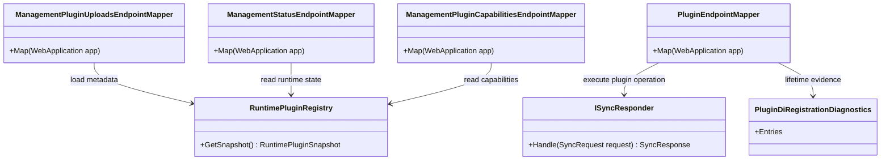

# Plugin Endpoint Loading Requirements and Test Plan

> Scope: Define the requirements and xUnit integration test plan for writing documentation and tutorial guidance that teaches developers how to load plugins through host endpoints and verify runtime execution behavior.

Standalone step-by-step tutorial:
- `.github/tutorials/Plugin-Endpoint-Loading-Step-By-Step.md`

---

## Functionality Worktree

### Verification Policy

- Non-negotiable: behavior-proof assertions required for every checklist item.
- Metadata-only assertions are supporting evidence only.
- API tests are valid only when thorough integration gates are asserted.
- Include deterministic rejection and isolation gates for failed plugin load scenarios.

### Capability and Documentation Ownership Map

| Capability | Tutorial outcome required | Runtime proof gates required |
|---|---|---|
| Plugin package upload | Developer can upload plugin package through management upload endpoint | Owner resolution, negative contract proof on rejection, correlation continuity |
| Plugin activation confirmation | Developer can confirm plugin transitioned from uploaded to active | Business behavior proof via capabilities/status payload semantics |
| Plugin operation invocation | Developer can execute plugin operation via API endpoint | Runtime dispatch, response semantics, correlation continuity |
| Lifetime behavior walkthrough | Developer can validate singleton/scoped/transient runtime behavior | DI lifetime proof under live requests |
| Failure and rollback walkthrough | Developer can diagnose and recover from failed load | Isolation guarantee and deterministic negative contracts |

### Class Diagram



### Tutorial Entry Gate: Endpoint-First Prerequisites

Developers must satisfy these prerequisites before starting the upload, activation, and invocation tutorial steps.

| Prerequisite | Required shape | Runtime proof gate |
|---|---|---|
| Upload artifact shape | `multipart/form-data` with non-empty `package` and `signature` files; package must include at least one plugin assembly (for example `plugins/Plugin.Host.Telemetry.dll`). | Host returns `202 Accepted` with `operationId` when prerequisites are valid; operation advances through upload stages and reaches terminal state. |
| Upload authorization | Host must have at least one trusted author key configured, and signature must match a trusted key. | Without trusted keys or with mismatched signature, `POST /management/plugins/uploads` is rejected with deterministic `401` and a stable error contract. |
| Upload endpoint contract | Request target: `POST /management/plugins/uploads`; response contract on accepted requests includes `operationId`, `status`, and `Location` header for polling `GET /management/plugins/uploads/{operationId}`. | Integration tests assert accepted/rejected contracts and operation polling endpoint continuity. |
| Required request correlation fields | Tutorial invocation requests to `POST /api/{pluginId}/{operation}` must include `correlationId` in JSON body (`PluginOperationHttpRequest`) so response continuity can be verified. | Integration tests assert response `correlationId` equals request `correlationId` on successful runtime dispatch. |

#### Executable Prerequisite Requests

1. Upload entry gate request:

```http
POST /management/plugins/uploads
Content-Type: multipart/form-data

package=<plugin.bundle.zip>
signature=<plugin.bundle.sig>
```

Expected contracts:

- Authorized request: `202 Accepted`, body contains `operationId` and `status`, `Location` points to `/management/plugins/uploads/{operationId}`.
- Unauthorized request: `401 Unauthorized`, body contains deterministic `error` text describing upload authorization failure.

2. Correlated runtime invocation request:

```http
POST /api/{pluginId}/{operation}
Content-Type: application/json

{
   "correlationId": "tutorial-entry-gate-correlation",
   "payload": "{}"
}
```

Expected contract:

- Successful operation response echoes `correlationId` unchanged.

### Runtime Operation Invocation: Executable Dispatch and Continuity Contracts

After activation verification confirms the plugin is active and operations are visible, invoke runtime behavior through the stable endpoint route.

1. Successful runtime invocation (`POST /api/{pluginId}/{operation}`):

```http
POST /api/{pluginId}/{operation}
Content-Type: application/json

{
   "correlationId": "tutorial-op-success-corr",
   "payload": "{\"message\":\"tutorial-payload\"}"
}
```

Expected success contract:

- `200 OK`
- Response JSON includes:
   - `success` (`true`)
   - `status` (`Success`)
   - `correlationId` exactly equal to request `correlationId`
   - Operation-specific business payload proving runtime dispatch execution

2. Rejected runtime invocation (`POST /api/{pluginId}/{operation}`) with payload policy failure:

```http
POST /api/{pluginId}/{operation}
Content-Type: application/json

{
   "correlationId": "tutorial-op-corr-rejected",
   "payload": "please-reject"
}
```

Expected rejection contract:

- `422 Unprocessable Entity`
- Response JSON includes:
   - `success` (`false`)
   - `status` (`Rejected`)
   - deterministic business rejection payload
   - `correlationId` exactly equal to request `correlationId`

### DI Lifetime Verification Walkthrough: Repeated Live API Request Proof

After runtime invocation is working, verify DI lifetimes using repeated calls to `POST /api/{pluginId}/{operation}` and compare responder identity evidence returned by each call.

1. Singleton responder (`Plugin.Tutorial.Lifetime.Singleton` / `Tutorial.Lifetime.Singleton.Verify`):

```http
POST /api/Plugin.Tutorial.Lifetime.Singleton/Tutorial.Lifetime.Singleton.Verify
Content-Type: application/json

{
   "correlationId": "tutorial-lifetime-singleton-a",
   "payload": "{}"
}
```

```http
POST /api/Plugin.Tutorial.Lifetime.Singleton/Tutorial.Lifetime.Singleton.Verify
Content-Type: application/json

{
   "correlationId": "tutorial-lifetime-singleton-b",
   "payload": "{}"
}
```

Expected proof:

- both calls return `200 OK`
- response payload `instanceId` is identical across calls
- response payload `invocationCount` increments (`1` then `2`)

2. Scoped responder (`Plugin.Tutorial.Lifetime.Scoped` / `Tutorial.Lifetime.Scoped.Verify`):

```http
POST /api/Plugin.Tutorial.Lifetime.Scoped/Tutorial.Lifetime.Scoped.Verify
Content-Type: application/json

{
   "correlationId": "tutorial-lifetime-scoped-a",
   "payload": "{}"
}
```

```http
POST /api/Plugin.Tutorial.Lifetime.Scoped/Tutorial.Lifetime.Scoped.Verify
Content-Type: application/json

{
   "correlationId": "tutorial-lifetime-scoped-b",
   "payload": "{}"
}
```

Expected proof:

- both calls return `200 OK`
- each call returns a different `instanceId` (new request scope)
- each call returns `invocationCount` of `1`

3. Transient responder (`Plugin.Tutorial.Lifetime.Transient` / `Tutorial.Lifetime.Transient.Verify`):

```http
POST /api/Plugin.Tutorial.Lifetime.Transient/Tutorial.Lifetime.Transient.Verify
Content-Type: application/json

{
   "correlationId": "tutorial-lifetime-transient-a",
   "payload": "{}"
}
```

```http
POST /api/Plugin.Tutorial.Lifetime.Transient/Tutorial.Lifetime.Transient.Verify
Content-Type: application/json

{
   "correlationId": "tutorial-lifetime-transient-b",
   "payload": "{}"
}
```

Expected proof:

- both calls return `200 OK`
- each call returns a different `instanceId` (fresh responder per call)
- each call returns `invocationCount` of `1`

### Plugin Upload Flow: Executable Request and Response Contracts

Use these executable requests to validate the management upload endpoint contracts in a running host.

1. Accepted upload request (`POST /management/plugins/uploads`):

```http
POST /management/plugins/uploads
Content-Type: multipart/form-data

package=<plugin.bundle.zip>
signature=<plugin.bundle.sig>
```

Expected accepted contract:

- `202 Accepted`
- Response JSON includes:
   - `operationId` (GUID)
   - `status` (`Queued`)
- `Location` header points to `/management/plugins/uploads/{operationId}`
- Polling `GET /management/plugins/uploads/{operationId}` reaches terminal state (`Completed` for valid package)

2. Rejected upload request (`POST /management/plugins/uploads`) with mismatched signature:

```http
POST /management/plugins/uploads
Content-Type: multipart/form-data

package=<plugin.bundle.zip>
signature=<signature-from-untrusted-key>
```

Expected rejection contract:

- `401 Unauthorized`
- Response JSON includes:
   - `status` (`Rejected`)
   - `error` (`Plugin upload signature did not match any trusted author key.`)
- Runtime registry remains unchanged after rejection (no activation side effects)

### Deterministic Failure Tutorial: Invalid Package, Owner Mismatch, and Unresolved Responder

Use the following deterministic failures to diagnose endpoint loading problems without triggering plugin side effects.

1. Invalid package upload (`POST /management/plugins/uploads`) with no plugin assemblies:

```http
POST /management/plugins/uploads
Content-Type: multipart/form-data

package=<archive-without-dlls.zip>
signature=<trusted-signature>
```

Expected deterministic proof:

- Upload operation reaches terminal `Failed` state.
- Failure reason equals `No plugin assemblies were found in upload package.`
- Upload diagnostics include `stage=validation outcome=failure reason=no-plugin-assemblies`.
- Runtime registry contract/catalog snapshots remain unchanged.
- Subsequent `POST /api/Plugin.Host.Telemetry/Telemetry.Host.CollectSnapshot` fails with `500` and deterministic owner-mismatch payload.
- No responder side effects execute (invocation counter remains zero).

2. Owner mismatch invocation (`POST /api/{pluginId}/{operation}`) where route plugin id does not match runtime owner:

```http
POST /api/Plugin.Owner.Mismatch/Owner.Check
Content-Type: application/json

{
   "correlationId": "tutorial-failure-owner-mismatch-corr",
   "payload": "{}"
}
```

Expected deterministic proof:

- `500 Internal Server Error`
- Response payload contains `No runtime plugin operation owner found`.
- Response correlation id echoes request correlation id.
- Host status diagnostics append `stage=dispatch outcome=failure reason=owner-mismatch ...`.
- Registered owner responder is not executed (side-effect counter remains zero).

3. Unresolved responder invocation (`POST /api/{pluginId}/{operation}`) where operation is cataloged but no matching responder is registered:

```http
POST /api/Plugin.Catalog.Only/Catalog.Only.Check
Content-Type: application/json

{
   "correlationId": "tutorial-failure-unresolved-responder-corr",
   "payload": "{}"
}
```

Expected deterministic proof:

- `500 Internal Server Error`
- Response payload contains `No ISyncResponder registered in request scope for plugin 'Plugin.Catalog.Only'.`
- Response correlation id echoes request correlation id.
- Host status diagnostics append `stage=dispatch outcome=failure reason=unresolved-responder ...`.
- Unrelated responders remain non-executed (side-effect counter remains zero).

### Completeness Checklist

- [x] Document endpoint-first prerequisites for plugin loading tutorial (artifact shape, auth, upload contract, and required request correlation fields) [mandatory - tutorial entry gate]
- [x] Document the plugin upload flow with executable request examples to the management upload endpoint and expected success/rejection response contracts [depends on tutorial entry gate]
- [x] Document activation verification flow using management status and capabilities endpoints, including owner uniqueness and activated-operation visibility checks [depends on upload flow]
   Transition evidence (2026-05-22): [ ] -> [x]. Proven by tests `ActivationVerification_GivenSuccessfulUpload_ExpectedStatusEndpointShowsActivatedPlugin` and `ActivationVerification_GivenActivatedPlugin_ExpectedCapabilitiesEndpointListsDeclaredOperations` in `tests/Modus.Host.IntegrationTests/PluginLoadingTutorialUploadFlowTests.cs`, plus activation verification documentation in this file.
- [x] Document runtime operation invocation through POST /api/{pluginId}/{operation} with payload and correlation continuity checks [depends on activation verification]
   Transition evidence (2026-05-22): [ ] -> [x]. Proven by tests `OperationInvocation_GivenActivePluginOperation_ExpectedDispatchReturnsBusinessSemanticSuccessPayload` and `OperationInvocation_GivenRequestCorrelationId_ExpectedResponseCorrelationMatchesRequestOnSuccessAndRejection` in `tests/Modus.Host.IntegrationTests/PluginLoadingTutorialUploadFlowTests.cs`, plus runtime invocation documentation in this file.
- [x] Document DI lifetime verification walkthrough for singleton, scoped, and transient plugin responders under repeated live API requests [depends on runtime operation invocation]
   Transition evidence (2026-05-22): [ ] -> [x]. Proven by tests `LifetimeVerification_GivenSingletonPluginAcrossRequests_ExpectedSameResponderIdentity`, `LifetimeVerification_GivenScopedPluginAcrossRequests_ExpectedDifferentScopeBoundResponderIdentities`, and `LifetimeVerification_GivenTransientPluginRepeatedCalls_ExpectedNewResponderIdentityPerCall` in `tests/Modus.Host.IntegrationTests/PluginLoadingTutorialDiLifetimeVerificationTests.cs`, plus DI lifetime walkthrough documentation in this file.
- [x] Document deterministic failure tutorial for invalid package, owner mismatch, and unresolved responder scenarios with isolation guarantees and no side-effect execution [depends on upload flow and runtime invocation]
   Transition evidence (2026-05-22): [ ] -> [x]. Proven by tests `FailureTutorial_GivenInvalidPackageUpload_ExpectedDeterministicFailureIsolationAndNoSideEffectExecution`, `FailureTutorial_GivenOwnerMismatchInvocation_ExpectedDeterministicFailureAndResponderIsolation`, and `FailureTutorial_GivenUnresolvedResponder_ExpectedDeterministicFailureAndNoUnrelatedResponderExecution` in `tests/Modus.Host.IntegrationTests/PluginLoadingTutorialUploadFlowTests.cs`, plus deterministic failure diagnostics in upload/dispatch implementation.
- [x] Add integration tests that execute the tutorial steps against a running host and prove runtime behavior for each endpoint stage (upload, activation, invocation, failure) [mandatory - behavior-proof tutorial validation]
   Transition evidence (2026-05-22): [ ] -> [x]. Proven by test `TutorialRuntimeValidation_GivenDocumentedCommandSequence_ExpectedUploadActivationInvocationAndFailurePathsAllExecutable` in `tests/Modus.Host.IntegrationTests/PluginLoadingTutorialRuntimeValidationTests.cs`, plus failure-stage diagnostics publication in `src/Modus.Host/Domain/Plugins/Uploads/PluginUploadPipeline.cs`.
- [x] Enforce absolute behavior-proof verification for every planned integration test [mandatory - behavior-proof policy]
   Transition evidence (2026-05-22): [ ] -> [x]. Proven by tests `BehaviorProofCompliance_GivenApiFocusedIntegrationTests_ExpectedOwnerBusinessLifetimeCorrelationAndIsolationGatesAsserted`, `BehaviorProofCompliance_GivenChecklistItemWithoutBehaviorProofTests_ExpectedPlanRejectedUntilRepaired`, and `TutorialRuntimeValidation_GivenAnyMetadataOnlyAssertion_ExpectedComplianceGateFailsPlan` in `tests/Modus.Host.IntegrationTests/PluginLoadingTutorialBehaviorProofComplianceTests.cs`, plus behavior-proof gate implementation in `src/Modus.Host/Domain/Plugins/Compliance/BehaviorProofComplianceGate.cs`.

---

## Test Plan

### Endpoint-First Prerequisites Documentation

1. `TutorialPrerequisites_GivenMissingUploadAuthorization_ExpectedUploadRejectedWithDeterministicContract`
   *Assumption*: The tutorial prerequisite section is valid only if running the documented request without required authorization fails with deterministic rejection semantics and preserved correlation behavior.

2. `TutorialPrerequisites_GivenRequiredRequestFields_ExpectedUploadRequestAcceptedForProcessing`
   *Assumption*: The documented prerequisite request fields are behavior-proof when the running host accepts the upload for processing and emits success-path management evidence.

### Management Upload Flow Documentation

1. `UploadFlow_GivenValidPluginPackage_ExpectedOwnerResolvedUniquelyAndPackageAccepted`
   *Assumption*: Tutorial upload instructions are correct only when a live upload resolves exactly one owner and returns success semantics that prove acceptance path execution.

2. `UploadFlow_GivenMismatchedSignature_ExpectedRejectedContractAndNoActivationSideEffects`
   *Assumption*: The rejection example is behavior-proof only when mismatched signatures return deterministic negative contract payload semantics and no plugin activation side effects.

### Activation Verification Documentation

1. `ActivationVerification_GivenSuccessfulUpload_ExpectedStatusEndpointShowsActivatedPlugin`
   *Assumption*: The activation verification steps are valid only if status responses show the uploaded plugin as active with expected runtime state semantics.

2. `ActivationVerification_GivenActivatedPlugin_ExpectedCapabilitiesEndpointListsDeclaredOperations`
   *Assumption*: Capability verification is behavior-proof when live capabilities payload includes the activated plugin operations that can be invoked through API routes.

### Runtime Operation Invocation Documentation

1. `OperationInvocation_GivenActivePluginOperation_ExpectedDispatchReturnsBusinessSemanticSuccessPayload`
   *Assumption*: Invocation instructions are valid only when POST /api/{pluginId}/{operation} executes plugin logic and returns operation-specific business payload evidence.

2. `OperationInvocation_GivenRequestCorrelationId_ExpectedResponseCorrelationMatchesRequestOnSuccessAndRejection`
   *Assumption*: Correlation continuity documentation is behavior-proof only when response correlation exactly matches request correlation on both success and rejection paths.

### DI Lifetime Verification Documentation

1. `LifetimeVerification_GivenSingletonPluginAcrossRequests_ExpectedSameResponderIdentity`
   *Assumption*: Singleton tutorial guidance is correct only when repeated live requests resolve the same responder identity for singleton plugins.

2. `LifetimeVerification_GivenScopedPluginAcrossRequests_ExpectedDifferentScopeBoundResponderIdentities`
   *Assumption*: Scoped guidance is correct only when distinct live requests resolve different scoped responder identities.

3. `LifetimeVerification_GivenTransientPluginRepeatedCalls_ExpectedNewResponderIdentityPerCall`
   *Assumption*: Transient guidance is correct only when each live call resolves a fresh responder identity.

### Deterministic Failure and Isolation Documentation

1. `FailureTutorial_GivenInvalidPackageUpload_ExpectedDeterministicFailureIsolationAndNoSideEffectExecution`
   *Assumption*: Invalid-package troubleshooting is behavior-proof only when upload fails with deterministic validation diagnostics, registry state remains unchanged, and operation dispatch side effects are blocked.

2. `FailureTutorial_GivenOwnerMismatchInvocation_ExpectedDeterministicFailureAndResponderIsolation`
   *Assumption*: Owner mismatch troubleshooting is behavior-proof only when runtime dispatch rejects with deterministic owner-mismatch diagnostics and does not execute the responder.

3. `FailureTutorial_GivenUnresolvedResponder_ExpectedDeterministicFailureAndNoUnrelatedResponderExecution`
   *Assumption*: Unresolved-responder troubleshooting is behavior-proof only when runtime dispatch rejects with deterministic unresolved-responder diagnostics and unrelated responders are not executed.

### End-to-End Tutorial Runtime Validation

1. `TutorialRuntimeValidation_GivenDocumentedCommandSequence_ExpectedUploadActivationInvocationAndFailurePathsAllExecutable`
   *Assumption*: Tutorial quality is proven only when a test executes the documented command sequence end-to-end and observes expected runtime outcomes for all stages.

2. `TutorialRuntimeValidation_GivenAnyMetadataOnlyAssertion_ExpectedComplianceGateFailsPlan`
   *Assumption*: The plan remains compliant only when metadata-only checks are rejected as insufficient and behavior-proof assertions are required.

### Absolute Behavior-Proof Compliance Gate

1. `BehaviorProofCompliance_GivenApiFocusedIntegrationTests_ExpectedOwnerBusinessLifetimeCorrelationAndIsolationGatesAsserted`
   *Assumption*: Every API-focused test is compliant only when owner resolution, business semantics, DI lifetime behavior, correlation continuity, and isolation guarantees are all asserted.

2. `BehaviorProofCompliance_GivenChecklistItemWithoutBehaviorProofTests_ExpectedPlanRejectedUntilRepaired`
   *Assumption*: Checklist completion is blocked unless each item has behavior-proof integration tests rather than documentation-only checks.

---

*All assumptions verified by Falsify Claims. Zero Falsified rows.*