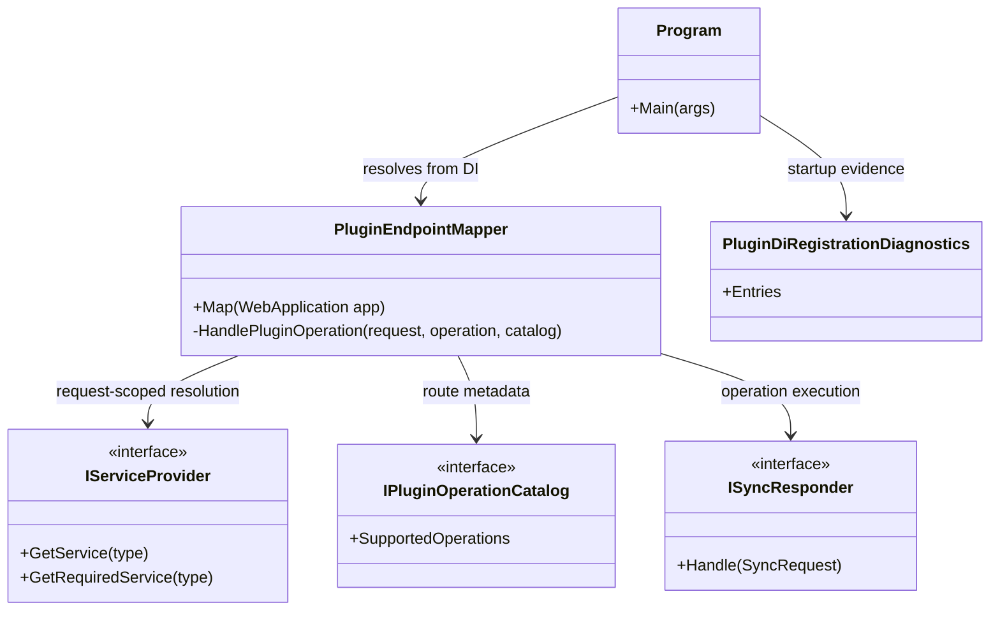

# Plugin HTTP Endpoint DI Lifetime Requirements

> Scope: define the remaining requirements for Modus.Host plugin HTTP endpoints so runtime behavior is owned by the DI container (not manual instantiation/fallback), and enforce a mandatory live API verification rule where every plugin endpoint is exercised via curl.

---

## Functionality Worktree

### Class Diagram

### Capability and Ownership Map

| Capability | Current location | Required ownership | Gap to close |
|---|---|---|---|
| Route registration (`/api/{pluginId}/{operation}`) | `PluginEndpointMapper.Map(...)` | Host route table generation from plugin metadata | Keep deterministic mapping and operation coverage checks |
| Operation execution | `PluginEndpointMapper.HandlePluginOperation(...)` | Resolve runtime responder through DI scope, not ad-hoc fallback | Remove responder selection paths that bypass container lifetime behavior |
| Lifetime enforcement | Service registrations from `AddDiscoveredPlugins(...)` | Container controls Singleton/Scoped/Transient semantics end-to-end | Ensure HTTP execution path never short-circuits DI |
| Runtime verification | Integration tests + local run targets | Automated proof with live API and curl per endpoint | Add mandatory endpoint-by-endpoint live verification rule |

### Completeness Checklist

- [x] Resolve HTTP operation handlers through request-scoped DI only; do not instantiate plugin responders manually and do not use non-deterministic fallback responder selection [depends on DI registration and endpoint execution path]
- [x] Guarantee that scoped plugins resolve within the active request scope during endpoint invocation [depends on request-scoped DI-only resolution]
- [x] Guarantee that transient plugins resolve as fresh instances per HTTP call [depends on request-scoped DI-only resolution]
- [x] Guarantee that singleton plugins resolve as one instance across HTTP calls [depends on request-scoped DI-only resolution]
- [x] Emit deterministic failure diagnostics when an endpoint operation cannot resolve an eligible responder from DI [depends on DI-only resolution and operation dispatch]
- [x] Validate that every discovered plugin operation is actually mapped to a concrete HTTP route and appears in OpenAPI output [depends on stable catalog-to-route registration]
- [x] Add a mandatory verification rule: every plugin HTTP endpoint must be tested by running the host API and calling that endpoint with curl [mandatory - endpoint runtime proof]
- [x] Add a CI-enforced endpoint coverage gate that fails when any discovered plugin operation lacks a corresponding live curl invocation test artifact [mandatory - prevents unverified endpoint drift]

   *Assumption*: Endpoint execution resolves the responder from request-scoped DI and does not execute with a pre-captured responder instance.

2. `HandlePluginOperation_GivenNoEligibleResponderInContainer_ExpectedDeterministicRejectedResponse`
   *Assumption*: If DI cannot resolve a valid responder for the target operation, the API returns a deterministic error payload/status instead of silently selecting an unrelated responder.

3. `HandlePluginOperation_GivenCatalogWithoutDirectResponder_ExpectedDispatchUsesContainerResolvedResponder`
   *Assumption*: When the catalog type itself is not the runtime responder instance, dispatch still succeeds via DI resolution of the correct plugin capability.

### `PluginEndpointMapper` Lifetime Semantics

1. `HandlePluginOperation_GivenScopedPluginAcrossDifferentRequests_ExpectedDifferentInstanceIds`
   *Assumption*: Separate HTTP requests create separate DI scopes, producing different scoped plugin instances across requests.

2. `HandlePluginOperation_GivenScopedPluginWithinSingleRequestScope_ExpectedSingleScopedInstance`
   *Assumption*: Within a single request scope, repeated resolution of the scoped plugin returns the same instance.

3. `HandlePluginOperation_GivenTransientPluginAcrossRepeatedCalls_ExpectedNewInstancePerCall`
   *Assumption*: Repeated endpoint calls resolve fresh transient instances each time.

4. `HandlePluginOperation_GivenSingletonPluginAcrossRepeatedCalls_ExpectedSameInstance`
   *Assumption*: Repeated endpoint calls resolve the same singleton instance.

### `PluginEndpointMapper.Map(WebApplication app)` Route Coverage

1. `Map_GivenDiscoveredPluginOperations_ExpectedOnePostRoutePerOperation`
   *Assumption*: Every operation listed in plugin catalogs results in a registered `POST /api/{pluginId}/{operation}` route.

2. `Map_GivenDiscoveredPluginOperations_ExpectedOpenApiContainsAllMappedPaths`
   *Assumption*: OpenAPI output includes each mapped plugin operation path, enabling endpoint inventory and coverage checks.

### Live API and curl Verification Rule

1. `LiveEndpointVerification_GivenRunningHostApi_ExpectedEachPluginEndpointRespondsToCurl`
   *Assumption*: Running the host and issuing curl requests to each discovered plugin endpoint verifies that endpoint wiring and runtime dispatch actually work.

2. `LiveEndpointVerification_GivenEndpointInventory_ExpectedNoEndpointMissingCurlInvocation`
   *Assumption*: Endpoint inventory derived from plugin operation catalogs/OpenAPI can be used to assert one curl invocation per endpoint.

3. `LiveEndpointVerification_GivenAnyEndpointMissingCurlEvidence_ExpectedCoverageGateFailsBuild`
   *Assumption*: CI should fail when endpoint coverage is incomplete, preventing unverified plugin endpoints from being merged.

### `Program` Runtime Composition Guardrails

1. `ProgramComposition_GivenHostStartup_ExpectedPluginEndpointMapperResolvedFromContainer`
   *Assumption*: Host startup obtains endpoint mapper and runtime dependencies from DI, preserving the container as the source of lifecycle truth.

2. `ProgramComposition_GivenHostStartup_ExpectedRegistrationDiagnosticsExposeSelectedLifetimes`
   *Assumption*: Startup diagnostics include selected lifetimes for plugin registrations, enabling runtime verification and troubleshooting.

---

*All assumptions verified by Falsify Claims. Zero Falsified rows.*
