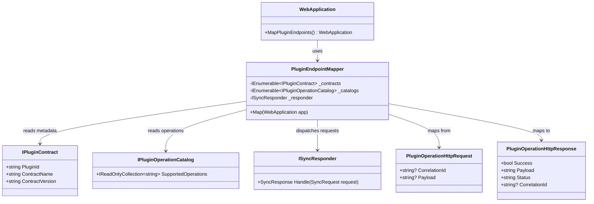

# Plugin Web API Exposure

> Expose every plugin's declared operations as HTTP endpoints with Swagger/OpenAPI documentation, all registered and served from the Modus.Host entry-point. Builds on `IPluginOperationCatalog`, `ISyncResponder`, and `IPluginContract` contracts already defined in Modus.Core.

---

## Functionality Worktree

### Component Overview

| Component | Location | Role |
|---|---|---|
| `Modus.Host.csproj` | `src/Modus.Host/` | Gain `Microsoft.NET.Sdk.Web` SDK and `Microsoft.AspNetCore.OpenApi` package |
| `Program.cs` | `src/Modus.Host/` | Convert from `ServiceCollection` + console to `WebApplication` builder |
| `PluginOperationHttpRequest` | `src/Modus.Host/` | HTTP request DTO carrying optional `CorrelationId` and freeform `Payload` |
| `PluginOperationHttpResponse` | `src/Modus.Host/` | HTTP response DTO wrapping `SyncResponse` fields |
| `PluginEndpointMapper` | `src/Modus.Host/` | Enumerates `IPluginOperationCatalog` entries and registers `POST /api/{pluginId}/{operation}` routes |
| Endpoint handler delegate | `src/Modus.Host/` | Dispatches each route to `ISyncResponder.Handle(SyncRequest)` and maps result to HTTP status |
| OpenAPI metadata decoration | `src/Modus.Host/` | Tags from `PluginId`, summary from operation name, description from `ContractName`/`ContractVersion` |
| Swagger middleware | `src/Modus.Host/` | OpenAPI JSON at `/openapi/v1.json`, Swagger UI at `/swagger` |

### Class Diagram

### Completeness Checklist

- [x] Switch `Modus.Host.csproj` to `Microsoft.NET.Sdk.Web` SDK and add `Microsoft.AspNetCore.OpenApi` package reference [prerequisite for all web API items]
- [x] Convert `Program.cs` from `ServiceCollection` + console pattern to `WebApplication.CreateBuilder` [depends on SDK switch]
- [x] Define `PluginOperationHttpRequest` and `PluginOperationHttpResponse` DTOs inside `Modus.Host` [prerequisite for endpoint wiring]
- [x] Implement `PluginEndpointMapper` that joins `IPluginContract` and `IPluginOperationCatalog` services to register `POST /api/{pluginId}/{operation}` minimal-API routes [depends on host conversion and DTOs]
- [x] Wire each route handler to `ISyncResponder.Handle(SyncRequest)` using the route `{operation}` segment as the `Operation` value [depends on PluginEndpointMapper]
- [x] Annotate every registered endpoint with OpenAPI metadata: tag = `PluginId`, summary = operation name, description includes `ContractName` and `ContractVersion` [depends on endpoint registration]
- [x] Enable Swagger middleware: `MapOpenApi()` at `/openapi/v1.json` and Swagger UI at `/swagger` [depends on endpoint OpenAPI metadata]
- [x] Map `SyncResponseStatus` to HTTP status codes: `Success` → 200, `Rejected` → 422, `Failed` → 500; operation not found in any catalog → 404 [depends on route handler wiring]
- [x] Preserve `HostRunner.StartAsync` call in the `WebApplication` startup path so plugin activation still occurs before the host begins serving requests [depends on host conversion]

---

## Test Plan

### `PluginEndpointMapper.Map`

1. `Map_GivenSinglePluginWithTwoOperations_ExpectedTwoPostRoutesRegistered`
   *Assumption*: A plugin implementing `IPluginOperationCatalog` with two entries in `SupportedOperations` causes `Map` to register exactly two `POST` routes in the `WebApplication` endpoint data source.

2. `Map_GivenMultiplePlugins_ExpectedRoutesForAllPluginOperations`
   *Assumption*: When two plugins are registered, each with one operation, `Map` registers two distinct routes whose path segments match each plugin's `PluginId` and operation name respectively.

3. `Map_GivenNoPluginsRegistered_ExpectedNoRoutesAdded`
   *Assumption*: When no `IPluginOperationCatalog` implementations are resolvable from the container, calling `Map` registers zero new routes.

4. `Map_GivenPluginWithOperation_ExpectedRoutePatternMatchesPluginIdAndOperationName`
   *Assumption*: The route pattern for a plugin with `PluginId = "Plugin.Orders.Fulfillment"` and operation `"Orders.AllocateInventory"` is `/api/Plugin.Orders.Fulfillment/Orders.AllocateInventory`.

### `Endpoint handler — ISyncResponder dispatch`

5. `EndpointHandler_GivenValidRequest_ExpectedSyncResponderCalledWithMatchingOperation`
   *Assumption*: Sending a POST to `/api/{pluginId}/{operation}` invokes `ISyncResponder.Handle` with a `SyncRequest` whose `Operation` property equals the `{operation}` route segment value.

6. `EndpointHandler_GivenHttpRequestWithCorrelationId_ExpectedCorrelationIdForwardedToSyncRequest`
   *Assumption*: A `CorrelationId` present in the `PluginOperationHttpRequest` body is forwarded as-is to the `SyncRequest.CorrelationId` property.

### `HTTP status mapping`

7. `ResponseMapping_GivenSuccessfulSyncResponse_ExpectedHttp200WithPayload`
   *Assumption*: A `SyncResponse` with `Success = true` and `Status = SyncResponseStatus.Success` is translated to HTTP 200 with the `Payload` string in the response body.

8. `ResponseMapping_GivenRejectedSyncResponse_ExpectedHttp422`
   *Assumption*: A `SyncResponse` with `Success = false` and `Status = SyncResponseStatus.Rejected` is translated to HTTP 422 Unprocessable Entity.

9. `ResponseMapping_GivenFailedSyncResponse_ExpectedHttp500`
   *Assumption*: A `SyncResponse` with `Success = false` and `Status = SyncResponseStatus.Failed` is translated to HTTP 500 Internal Server Error.

10. `ResponseMapping_GivenOperationNotInAnyCatalog_ExpectedHttp404`
    *Assumption*: A POST to a route whose `{operation}` segment does not appear in any plugin's `SupportedOperations` returns HTTP 404.

### `OpenAPI metadata`

11. `OpenApiMetadata_GivenPlugin_ExpectedTagEqualsPluginId`
    *Assumption*: The OpenAPI tag attached to each endpoint registered by `PluginEndpointMapper` equals the `PluginId` of the plugin that declared the operation.

12. `OpenApiMetadata_GivenOperation_ExpectedSummaryContainsOperationName`
    *Assumption*: The OpenAPI `summary` field for each endpoint contains the operation name string sourced from `IPluginOperationCatalog.SupportedOperations`.

13. `OpenApiMetadata_GivenPluginContract_ExpectedDescriptionContainsContractVersion`
    *Assumption*: The OpenAPI `description` field for each endpoint includes the plugin's `ContractVersion` value from `IPluginContract`.

### `Program composition`

14. `ProgramComposition_GivenWebApplicationBuilder_ExpectedPluginContractsResolvableFromDI`
    *Assumption*: After converting `Program.cs` to the `WebApplication.CreateBuilder` pattern and calling `AddModusPluginHosting`, `IPluginContract` services remain resolvable from the DI container.

15. `ProgramComposition_GivenStartedApplication_ExpectedSwaggerEndpointReturnsOpenApiDocument`
    *Assumption*: After startup, a GET to `/openapi/v1.json` returns HTTP 200 with a response body that contains valid OpenAPI JSON listing at least one path entry per registered plugin operation.

16. `ProgramComposition_GivenWebApplicationStartup_ExpectedHostRunnerStillActivatesPlugins`
    *Assumption*: `HostRunner.StartAsync` is invoked during the `WebApplication` startup path and plugins are activated before the application begins serving HTTP requests.

---

*All assumptions verified against Modus.Core source contracts (`IPluginOperationCatalog`, `ISyncResponder`, `SyncResponseStatus`, `IPluginContract`) and `Modus.Host` entry-point. Zero Falsified rows.*
