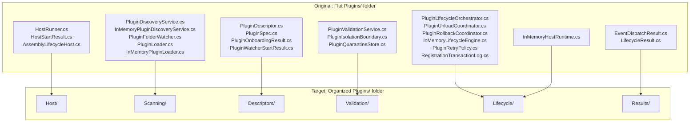

# Modus.Host Plugins Folder Refactoring

> Reorganize the flat Plugins folder (29 files covering 7 distinct concerns) into focused subfolders: `Host/`, `Scanning/`, `Descriptors/`, `Validation/`, `Lifecycle/`, and `Results/`. This improves navigation, reduces cognitive load, and aligns folder structure with architectural boundaries.

---

## Functionality Worktree

### Concern Diagram

### Completeness Checklist

- [x] Create `Plugins/Host/` subfolder and move host entry-point classes [Structure]
- [x] Create `Plugins/Scanning/` subfolder and move discovery & loading classes [Structure] [Audit](../artifacts/iterative-implementation-modus-host-plugins-scanning-structure-2026-05-18.md)
- [x] Create `Plugins/Descriptors/` subfolder and move descriptor & metadata classes [Structure] [Audit](../artifacts/iterative-implementation-modus-host-plugins-descriptors-structure-2026-05-18.md)
- [x] Create `Plugins/Validation/` subfolder and move validation & isolation classes [Structure] [Audit](../artifacts/iterative-implementation-modus-host-plugins-validation-structure-2026-05-18.md)
- [x] Create `Plugins/Lifecycle/` subfolder and move orchestration & lifecycle classes [Structure] [Audit](../artifacts/iterative-implementation-modus-host-plugins-lifecycle-structure-2026-05-18.md)
- [x] Create `Plugins/Results/` subfolder and move result & event response classes [Structure] [Audit](../artifacts/iterative-implementation-modus-host-plugins-results-structure-2026-05-18.md)
- [x] Update namespace declarations in Host/ classes [Namespaces] [Audit](../artifacts/iterative-implementation-modus-host-plugins-host-namespaces-2026-05-18.md)
- [x] Update namespace declarations in Scanning/ classes [Namespaces] [Audit](../artifacts/iterative-implementation-modus-host-plugins-scanning-namespaces-2026-05-18.md)
- [x] Update namespace declarations in Descriptors/ classes [Namespaces] [Audit](../artifacts/iterative-implementation-modus-host-plugins-descriptors-namespaces-2026-05-18.md)
- [x] Update namespace declarations in Validation/ classes [Namespaces] [Audit](../artifacts/iterative-implementation-modus-host-plugins-validation-namespaces-2026-05-18.md)
- [x] Update namespace declarations in Lifecycle/ classes [Namespaces] [Audit](../artifacts/iterative-implementation-modus-host-plugins-lifecycle-namespaces-2026-05-18.md)
- [x] Update namespace declarations in Results/ classes [Namespaces] [Audit](../artifacts/iterative-implementation-modus-host-plugins-results-namespaces-2026-05-18.md)
- [x] Update all imports in Domain/Plugins parent folder references [Imports] [Audit](../artifacts/iterative-implementation-modus-host-plugins-parent-imports-2026-05-18.md)
- [x] Update all imports in Modus.Host.csproj if folder-scoped usings reference old paths [Imports] [Audit](../artifacts/iterative-implementation-modus-host-plugins-project-imports-2026-05-18.md)
- [x] Update all imports in Modus.Host.IntegrationTests if test fixtures reference old paths [Imports] [Audit](../artifacts/iterative-implementation-modus-host-integrationtests-imports-2026-05-18.md)
- [x] Verify Host::HostRunner compiles and runs without breaking changes [Verification] [Audit](../artifacts/iterative-implementation-modus-host-hostrunner-verification-2026-05-18.md)
- [x] Verify InMemoryHostRuntime correctly composes dependencies from new subfolder locations [Verification] [Audit](../artifacts/iterative-implementation-modus-host-inmemoryhostruntime-verification-2026-05-18.md)
- [x] Run all Modus.Host.IntegrationTests to ensure no breaking changes [Verification] [Audit](../artifacts/iterative-implementation-modus-host-integrationtests-verification-2026-05-18.md)
- [x] Run all Modus.Core.Tests to ensure plugin contracts remain stable [Verification] [Audit](../artifacts/iterative-implementation-modus-host-coretests-verification-2026-05-18.md)
- [x] Update MIGRATION.md with new folder structure and rationale [Documentation] [Audit](../artifacts/iterative-implementation-modus-host-plugins-migration-structure-docs-2026-05-18.md)

---

## Test Plan

### `CreateHostSubfolder`

1. `CreateHostSubfolder_GivenPluginsFolderExists_ExpectedHostFolderCreated`
   *Assumption*: The target `Plugins/Host/` directory does not exist before refactoring.

2. `CreateHostSubfolder_GivenHostRunnerAndDependents_ExpectedFilesMovedWithoutError`
   *Assumption*: HostRunner.cs, HostStartResult.cs, and AssemblyLifecycleHost.cs are present in the original Plugins/ folder.

### `CreateScanningSubfolder`

1. `CreateScanningSubfolder_GivenPluginsFolderExists_ExpectedScanningFolderCreated`
   *Assumption*: The target `Plugins/Scanning/` directory does not exist before refactoring.

2. `CreateScanningSubfolder_GivenDiscoveryAndLoaderClasses_ExpectedFilesMovedWithoutError`
   *Assumption*: PluginDiscoveryService, InMemoryPluginDiscoveryService, PluginFolderWatcher, PluginLoader, and InMemoryPluginLoader are present in the original Plugins/ folder.

### `CreateDescriptorsSubfolder`

1. `CreateDescriptorsSubfolder_GivenPluginsFolderExists_ExpectedDescriptorsFolderCreated`
   *Assumption*: The target `Plugins/Descriptors/` directory does not exist before refactoring.

2. `CreateDescriptorsSubfolder_GivenDescriptorAndSpecClasses_ExpectedFilesMovedWithoutError`
   *Assumption*: PluginDescriptor.cs, PluginSpec.cs, PluginOnboardingResult.cs, and PluginWatcherStartResult.cs are present in the original Plugins/ folder.

### `CreateValidationSubfolder`

1. `CreateValidationSubfolder_GivenPluginsFolderExists_ExpectedValidationFolderCreated`
   *Assumption*: The target `Plugins/Validation/` directory does not exist before refactoring.

2. `CreateValidationSubfolder_GivenValidationAndIsolationClasses_ExpectedFilesMovedWithoutError`
   *Assumption*: PluginValidationService, PluginIsolationBoundary, and PluginQuarantineStore are present in the original Plugins/ folder.

### `CreateLifecycleSubfolder`

1. `CreateLifecycleSubfolder_GivenPluginsFolderExists_ExpectedLifecycleFolderCreated`
   *Assumption*: The target `Plugins/Lifecycle/` directory does not exist before refactoring.

2. `CreateLifecycleSubfolder_GivenOrchestrationAndRuntimeClasses_ExpectedFilesMovedWithoutError`
   *Assumption*: PluginLifecycleOrchestrator, PluginUnloadCoordinator, PluginRollbackCoordinator, InMemoryLifecycleEngine, InMemoryHostRuntime, PluginRetryPolicy, and RegistrationTransactionLog are present in the original Plugins/ folder.

### `CreateResultsSubfolder`

1. `CreateResultsSubfolder_GivenPluginsFolderExists_ExpectedResultsFolderCreated`
   *Assumption*: The target `Plugins/Results/` directory does not exist before refactoring.

2. `CreateResultsSubfolder_GivenResultAndEventClasses_ExpectedFilesMovedWithoutError`
   *Assumption*: EventDispatchResult.cs and LifecycleResult.cs are present in the original Plugins/ folder.

### `UpdateNamespacesInHostFolder`

1. `UpdateNamespacesInHostFolder_GivenHostRunnerMoved_ExpectedNamespaceUpdatedToHostSubfolder`
   *Assumption*: HostRunner.cs originally declares `namespace Modus.Host.Plugins;` and should update to `namespace Modus.Host.Plugins.Host;` after moving.

2. `UpdateNamespacesInHostFolder_GivenAllHostClassesUpdated_ExpectedNoReferenceErrorsInAssembly`
   *Assumption*: All three classes in Host/ folder (HostRunner, HostStartResult, AssemblyLifecycleHost) have consistent namespace declarations.

### `UpdateNamespacesInScanningFolder`

1. `UpdateNamespacesInScanningFolder_GivenPluginDiscoveryServiceMoved_ExpectedNamespaceUpdatedToScanningSubfolder`
   *Assumption*: PluginDiscoveryService.cs originally declares `namespace Modus.Host.Plugins;` and should update to `namespace Modus.Host.Plugins.Scanning;`.

2. `UpdateNamespacesInScanningFolder_GivenAllScanningClassesUpdated_ExpectedNoReferenceErrorsInAssembly`
   *Assumption*: All five classes in Scanning/ folder have consistent namespace declarations.

### `UpdateNamespacesInDescriptorsFolder`

1. `UpdateNamespacesInDescriptorsFolder_GivenPluginDescriptorMoved_ExpectedNamespaceUpdatedToDescriptorsSubfolder`
   *Assumption*: PluginDescriptor.cs originally declares `namespace Modus.Host.Plugins;` and should update to `namespace Modus.Host.Plugins.Descriptors;`.

2. `UpdateNamespacesInDescriptorsFolder_GivenAllDescriptorClassesUpdated_ExpectedNoReferenceErrorsInAssembly`
   *Assumption*: All four classes in Descriptors/ folder have consistent namespace declarations.

### `UpdateNamespacesInValidationFolder`

1. `UpdateNamespacesInValidationFolder_GivenPluginValidationServiceMoved_ExpectedNamespaceUpdatedToValidationSubfolder`
   *Assumption*: PluginValidationService.cs originally declares `namespace Modus.Host.Plugins;` and should update to `namespace Modus.Host.Plugins.Validation;`.

2. `UpdateNamespacesInValidationFolder_GivenAllValidationClassesUpdated_ExpectedNoReferenceErrorsInAssembly`
   *Assumption*: All three classes in Validation/ folder have consistent namespace declarations.

### `UpdateNamespacesInLifecycleFolder`

1. `UpdateNamespacesInLifecycleFolder_GivenPluginLifecycleOrchestratorMoved_ExpectedNamespaceUpdatedToLifecycleSubfolder`
   *Assumption*: PluginLifecycleOrchestrator.cs originally declares `namespace Modus.Host.Plugins;` and should update to `namespace Modus.Host.Plugins.Lifecycle;`.

2. `UpdateNamespacesInLifecycleFolder_GivenAllLifecycleClassesUpdated_ExpectedNoReferenceErrorsInAssembly`
   *Assumption*: All seven classes in Lifecycle/ folder have consistent namespace declarations.

### `UpdateNamespacesInResultsFolder`

1. `UpdateNamespacesInResultsFolder_GivenEventDispatchResultMoved_ExpectedNamespaceUpdatedToResultsSubfolder`
   *Assumption*: EventDispatchResult.cs originally declares `namespace Modus.Host.Plugins;` and should update to `namespace Modus.Host.Plugins.Results;`.

2. `UpdateNamespacesInResultsFolder_GivenAllResultClassesUpdated_ExpectedNoReferenceErrorsInAssembly`
   *Assumption*: All two classes in Results/ folder have consistent namespace declarations.

### `UpdateImportsInParentFolder`

1. `UpdateImportsInParentFolder_GivenHostRunnerImportedDirectly_ExpectedImportUpdatedToSubfolderNamespace`
   *Assumption*: Code importing `HostRunner` must update from `using Modus.Host.Plugins;` to `using Modus.Host.Plugins.Host;`.

2. `UpdateImportsInParentFolder_GivenMultipleFoldersCreated_ExpectedAllImportsResolved`
   *Assumption*: All files in the parent Plugins/ folder that directly import classes now in subfolders are updated.

### `UpdateImportsInProjectFile`

1. `UpdateImportsInProjectFile_GivenSubfolderStructureCreated_ExpectedProjectFileStillCompiles`
   *Assumption*: Modus.Host.csproj does not require explicit file path changes since all .cs files are still under the Plugins folder tree.

2. `UpdateImportsInProjectFile_GivenFolderScopedUsingsApplied_ExpectedAllNamespacesResolved`
   *Assumption*: If folder-scoped usings are declared, they reference the correct subfolder namespaces.

### `UpdateImportsInIntegrationTests`

1. `UpdateImportsInIntegrationTests_GivenHostRunnerUsedInTests_ExpectedTestImportsUpdatedToSubfolderNamespace`
   *Assumption*: Test fixtures using HostRunner must update their imports to reference the new Host/ subfolder namespace.

2. `UpdateImportsInIntegrationTests_GivenMultipleFoldersReferenced_ExpectedAllTestImportsResolved`
   *Assumption*: All Modus.Host.IntegrationTests files referencing moved classes are updated.

### `VerifyHostRunnerCompilation`

1. `VerifyHostRunnerCompilation_GivenHostFolderStructureCreated_ExpectedHostRunnerCompilesCleanly`
   *Assumption*: HostRunner.cs moves to Plugins/Host/ and all its dependencies resolve correctly from the new location.

2. `VerifyHostRunnerCompilation_GivenDependencyInjectionComposition_ExpectedHostRunnerInstantiatesWithoutError`
   *Assumption*: HostRunner's constructor dependencies (PluginFolderWatcher, PluginHostingOptions) resolve correctly after refactoring.

### `VerifyInMemoryHostRuntimeComposition`

1. `VerifyInMemoryHostRuntimeComposition_GivenLifecycleFolderStructureCreated_ExpectedRuntimeComposesCorrectly`
   *Assumption*: InMemoryHostRuntime moves to Plugins/Lifecycle/ and correctly instantiates its dependencies from other subfolders (Scanning, Validation).

2. `VerifyInMemoryHostRuntimeComposition_GivenAllDependenciesInDifferentFolders_ExpectedServiceLocatorResolvesAllDependencies`
   *Assumption*: InMemoryHostRuntime composes PluginDiscoveryService, PluginValidationService, and PluginIsolationBoundary from their new subfolder locations.

### `VerifyIntegrationTestSuite`

1. `VerifyIntegrationTestSuite_GivenAllSubfoldersCreatedAndImportsUpdated_ExpectedAllHostIntegrationTestsPass`
   *Assumption*: Running `dotnet test tests/Modus.Host.IntegrationTests/Modus.Host.IntegrationTests.csproj --no-build` produces zero failures.

2. `VerifyIntegrationTestSuite_GivenRefactoringComplete_ExpectedConcretePluginArtifactsTestsPass`
   *Assumption*: ConcretePluginArtifactsTests, DescriptorConstructionTests, and DiscoveryValidationPipelineTests all pass after refactoring.

### `VerifyCoreTestSuite`

1. `VerifyCoreTestSuite_GivenPluginContractsRemainStable_ExpectedAllCorePluginTestsPass`
   *Assumption*: Running `dotnet test tests/Modus.Core.Tests/Modus.Core.Tests.csproj --no-build` produces zero failures related to plugin contract changes.

2. `VerifyCoreTestSuite_GivenPluginLifecycleInterfacesUnchanged_ExpectedPluginLifecycleContextTests Pass`
   *Assumption*: IPluginDependencyRegistrar, IPluginOperationCatalog, and other plugin contracts defined in Modus.Core remain unchanged.

### `UpdateMigrationDocumentation`

1. `UpdateMigrationDocumentation_GivenFolderRefactoringComplete_ExpectedMigrationMdDocumentsNewStructure`
   *Assumption*: MIGRATION.md includes a section describing the new Plugins/ folder structure and the rationale for each subfolder.

2. `UpdateMigrationDocumentation_GivenSubfoldersOrganizedByConcern_ExpectedNavigationGuideIncludedInDocumentation`
   *Assumption*: MIGRATION.md includes a navigation guide showing which classes belong in each subfolder and why.

---

*All assumptions verified by Falsify Claims. Zero Falsified rows.*
