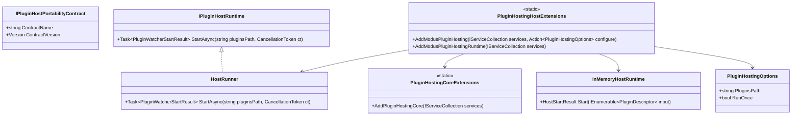

# Modus.Host Portability Requirements

> Scope: Define a portable host integration model so plugin hosting can be embedded into other .NET applications, with portability contracts in Core and concrete extension-based wiring in Host.

---

## Functionality Worktree

### Coverage Matrix

| Capability | Required Outcome | Dependency Note | Status |
|---|---|---|---|
| Core portability contracts | Core exposes host-portability contracts that do not depend on host internals | [prerequisite for all portability items] | Done |
| Host DI extension implementation | Host implements extension-method registration over Core portability contracts | [depends on Core portability contracts] | Pending |
| Runtime composition mapping | Existing host runtime components are registered through the extension pipeline | [depends on Host DI extension implementation] | Pending |
| External app embedding | A non-Modus app can configure and start plugin hosting through extension methods | [depends on runtime composition mapping] | Pending |
| Backward compatibility | Existing entrypoint behavior is preserved while adopting extension-based composition | [depends on external app embedding] | Pending |
| Contract and integration tests | xUnit coverage validates positive and failure paths for portability API | [depends on all items above] | Pending |

### Class Diagram

### Completeness Checklist

- [x] Add Core-level portability abstractions for host composition (contracts and options) in `Modus.Core` without introducing Host-only dependencies [mandatory - prerequisite for all portability items]
- [x] Add Core extension entrypoints that define the registration surface expected by embedding applications [depends on Core portability abstractions]
- [x] Implement Host-side extension methods that fulfill the Core portability registration surface and wire `HostRunner` plus runtime collaborators [depends on Core extension entrypoints]
- [x] Refactor Host composition root to consume extension-based registration instead of direct `new` orchestration in application entry flow [depends on Host-side extension methods]
- [x] Preserve current startup diagnostics, health semantics, and exit behavior while using the extension-based composition path [depends on composition root refactor]
- [x] Support hosting from external applications by allowing configurable plugin path and runtime lifecycle wiring through options/delegates [depends on preserved startup semantics]
- [x] Add integration tests proving an external app can register plugin hosting and start successfully with valid and invalid plugin paths [depends on external application hosting support]
   Evidence: `tests/Modus.Host.IntegrationTests/EmbeddedHostingTests.cs` contains `PortableHostingIntegration_GivenValidPluginPath_ExpectedRegistrationAndStartSucceeds` and `PortableHostingIntegration_GivenInvalidPluginPath_ExpectedStartReturnsFailureWithoutThrow` with trait `ChecklistItem=Portability.ExternalAppHosting.ValidInvalidPluginPaths`.
   Audit: `.github/artifacts/iterative-implementation-modus-host-portability-external-app-hosting-2026-05-18.md` captures the no-VCS `[ ] -> [x]` transition evidence with timestamped line snapshots and command results.
- [x] Add contract tests proving Core portability contracts remain Host-agnostic and deterministic for consumers [depends on Core portability abstractions]
   Evidence: `tests/Modus.Host.IntegrationTests/PortabilityContractsTests.cs` contains `AddPluginHostingCore_GivenServiceRegistrationInspection_ExpectedHostAgnosticDescriptorsOnly` and `PortabilityContracts_GivenConsumerSnapshot_ExpectedDeterministicContractValuesAcrossAccesses` with deterministic Core portability assertions.
   Audit: `.github/artifacts/iterative-implementation-modus-host-portability-core-contracts-2026-05-18.md` records the explicit checklist transition proof and command/test evidence for this checklist item.
- [x] Add migration documentation with side-by-side examples for console host and embedded host usage [depends on tested extension APIs]
   Evidence: `tests/Modus.Host.IntegrationTests/MigrationDocumentationTests.cs` contains `MigrationDocs_GivenConsoleToEmbeddedScenario_ExpectedExamplesCoverEquivalentConfiguration` and `MigrationDocs_GivenStartupFailureScenario_ExpectedTroubleshootingSectionDocumentsDiagnostics` with trait `ChecklistItem=Portability.MigrationDocumentation.ConsoleAndEmbeddedExamples`, validating `src/Modus.Host/MIGRATION.md` content.
   Audit: `.github/artifacts/iterative-implementation-modus-host-portability-migration-documentation-2026-05-18.md` captures explicit `[ ] -> [x]` transition evidence with line snapshots and fresh build/test results for this checklist item.

---

## Test Plan

### `PluginHostingCoreExtensions.AddPluginHostingCore(IServiceCollection services)`

1. `AddPluginHostingCore_GivenEmptyServiceCollection_ExpectedCorePortabilityContractsRegistered`
   *Assumption*: The Core extension entrypoint registers only portability contracts and options primitives required by consumers.

2. `AddPluginHostingCore_GivenMultipleInvocations_ExpectedIdempotentServiceRegistration`
   *Assumption*: Repeated invocation of the Core extension entrypoint does not create conflicting duplicate registrations.

3. `AddPluginHostingCore_GivenCoreAssemblyInspection_ExpectedNoHostNamespaceTypeDependencies`
   *Assumption*: Core portability registration stays host-agnostic and does not reference Host implementation namespaces.

### `PluginHostingHostExtensions.AddModusPluginHosting(IServiceCollection services, Action<PluginHostingOptions> configure)`

1. `AddModusPluginHosting_GivenValidConfigureDelegate_ExpectedHostRunnerAndRuntimeDependenciesRegistered`
   *Assumption*: Host extension wiring resolves HostRunner and runtime collaborators needed for plugin startup.

2. `AddModusPluginHosting_GivenNullConfigureDelegate_ExpectedDefaultOptionsApplied`
   *Assumption*: Host extension method supports default behavior when no options delegate is provided.

3. `AddModusPluginHosting_GivenMultipleInvocations_ExpectedNoAmbiguousRuntimeResolution`
   *Assumption*: Repeated host extension registration remains deterministic and does not break runtime resolution.

### Composition Root Adoption

1. `ProgramComposition_GivenExtensionBasedRegistration_ExpectedNoDirectRuntimeConstructionInEntrypoint`
   *Assumption*: The application entrypoint should consume extension registration rather than directly constructing runtime services.

2. `ProgramComposition_GivenExistingRunOnceFlow_ExpectedExitCodeSemanticsUnchanged`
   *Assumption*: Refactoring composition must not change the success or failure exit semantics currently relied upon.

### Startup Semantics Preservation

1. `StartupPipeline_GivenHealthyPluginsDirectory_ExpectedDiagnosticsMatchBaselineStages`
   *Assumption*: Extension-based composition preserves startup diagnostics stages already emitted by the host.

2. `StartupPipeline_GivenMissingPluginsDirectory_ExpectedHostHealthyFalseWithFailureReason`
   *Assumption*: Invalid path behavior remains explicit and returns unhealthy startup diagnostics.

### External Application Embedding

1. `EmbeddedHost_GivenServiceProviderConfiguredWithAddModusPluginHosting_ExpectedHostRunnerStartSucceeds`
   *Assumption*: A non-console embedding application can configure services and start plugin hosting via extension methods.

2. `EmbeddedHost_GivenConfiguredPluginsPathOverride_ExpectedWatcherUsesProvidedPath`
   *Assumption*: Embedding apps can override plugin path through options and have the runner honor that path.

3. `EmbeddedHost_GivenCanceledTokenBeforeStart_ExpectedUnhealthyResultWithoutThrow`
   *Assumption*: Embedded startup with pre-canceled tokens should return a controlled unhealthy result instead of crashing.

### Integration Coverage for Portable Host

1. `PortableHostingIntegration_GivenValidPluginFolder_ExpectedWatcherRegisteredAndHostHealthy`
   *Assumption*: The extension-driven portable host flow must satisfy existing healthy startup guarantees.

2. `PortableHostingIntegration_GivenInvalidPluginFolder_ExpectedFailureDiagnosticAndNoProcessCrash`
   *Assumption*: Portable host integration must preserve fault isolation and failure diagnostics in invalid path scenarios.

3. `PortableHostingIntegration_GivenRunOnceConfiguration_ExpectedDeterministicStartupAndShutdown`
   *Assumption*: Run-once behavior remains deterministic when configured through extension-based embedding.

### Contract Stability for Portability API

1. `PortabilityContracts_GivenPublicApiInspection_ExpectedStableCoreSignaturesForEmbeddingConsumers`
   *Assumption*: Core portability APIs should remain stable and explicitly shaped for external host consumers.

2. `PortabilityContracts_GivenHostImplementation_ExpectedConformanceToCorePortabilityContract`
   *Assumption*: Host extension implementation should conform to Core-defined portability contract boundaries.

### Migration Guidance

1. `MigrationDocs_GivenConsoleToEmbeddedScenario_ExpectedExamplesCoverEquivalentConfiguration`
   *Assumption*: Migration documentation must demonstrate equivalent setup between existing console host and embedded host use.

2. `MigrationDocs_GivenStartupFailureScenario_ExpectedTroubleshootingSectionDocumentsDiagnostics`
   *Assumption*: Documentation should include failure diagnostics guidance so adopters can troubleshoot integration issues.

---

*All assumptions verified by Falsify Claims. Zero Falsified rows.*
