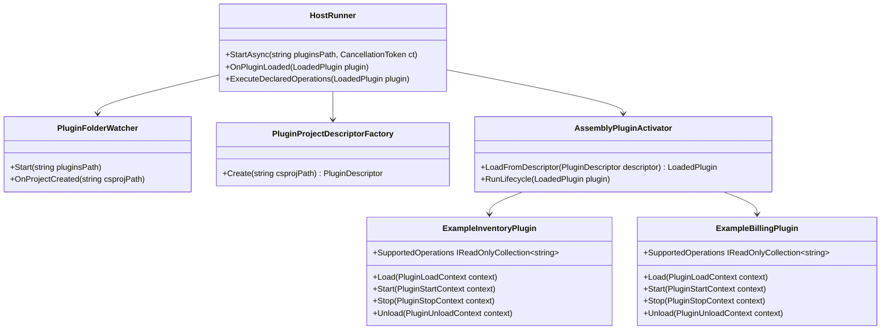

# Requirements: Modus.Host Real Plugin Examples And Runtime Verification

> Scope: Define host and plugin requirements for creating real example plugins that use Modus-supported functionality, placing them in the plugins folder, running the host, and verifying that plugins are loaded and executed.

---

## Functionality Worktree

### Coverage Matrix

| Capability | Required Outcome | Dependency Note | Status |
|---|---|---|---|
| Example plugin set | Provide concrete plugin projects that implement Modus contracts and representative capabilities | [mandatory - baseline verification data] | Pending |
| Host runtime entrypoint | Provide an executable host runner that starts plugin onboarding for a configured plugins folder | [mandatory - execution foundation] | Complete |
| Plugins folder onboarding | Host discovers and processes newly added plugin project files under plugins path | [depends on host runtime entrypoint] | Complete |
| Assembly activation bridge | Host resolves plugin implementation types and executes lifecycle operations from built assemblies | [depends on plugins folder onboarding] | Pending |
| Capability execution proof | Host invokes at least one declared operation per example plugin and records deterministic diagnostics | [depends on assembly activation bridge] | Complete |
| End-to-end verification | Integration tests launch host, add example plugins to plugins folder, and assert load plus run evidence | [mandatory - acceptance gate] | Pending |
| Fault isolation verification | Invalid example plugin does not stop host or block later valid plugin execution | [depends on end-to-end verification] | Pending |
| Operator runbook | Document exact build and run commands to reproduce plugin load and execution checks locally | [depends on host runtime entrypoint and verification tests] | Pending |

### Class Diagram

### Completeness Checklist

- [ ] Create `Example.Plugin.Inventory` implementing `IPluginLifecycle`, `IPluginOperationCatalog`, and `IPluginScheduledEvents` with deterministic operation names [mandatory - baseline example plugin]
- [ ] Create `Example.Plugin.Billing` implementing the same contracts with at least one dependency relation to another plugin capability [depends on baseline example plugin]
- [x] Add executable host runtime entrypoint that accepts plugins folder path and starts onboarding flow [mandatory - runtime foundation]
- [x] Extend onboarding flow so host processes both pre-existing and newly created `.csproj` files in plugins folder [depends on runtime foundation]
- [ ] Implement assembly activation bridge that resolves plugin types from build output and calls lifecycle operations [depends on onboarding flow]
- [x] Execute at least one declared operation per activated example plugin and emit stage diagnostics proving execution [depends on assembly activation bridge]
- [ ] Add end-to-end integration test that launches host process, adds valid example plugin projects to plugins folder, and asserts load plus operation execution evidence [mandatory - e2e acceptance]
- [ ] Add integration test proving invalid plugin onboarding fails in isolation while later valid plugin still loads and executes [depends on e2e acceptance]
- [ ] Add runbook section with reproducible commands for build, host run, plugin drop-in, and verification checks [depends on runtime and integration flow]

---

## Test Plan

### `Example.Plugin.Inventory`

1. `InventoryPlugin_GivenHostLifecycleCallbacks_ExpectedLoadStartStopUnloadInvokedInOrder`
   *Assumption*: The inventory example plugin implements full lifecycle and is invoked in deterministic order by host activation flow.

2. `InventoryPlugin_GivenOperationCatalogQuery_ExpectedSupportedOperationsMatchDeclaredCapabilities`
   *Assumption*: The inventory example plugin exposes a stable operation catalog consistent with its implemented behaviors.

### `Example.Plugin.Billing`

1. `BillingPlugin_GivenDependentCapabilityRequirement_ExpectedDependencyDeclaredAndValidated`
   *Assumption*: The billing example plugin explicitly declares capability dependency required for activation ordering and validation.

2. `BillingPlugin_GivenHostActivation_ExpectedLifecycleAndOperationCatalogContractsSatisfied`
   *Assumption*: The billing example plugin satisfies mandatory lifecycle and operation-catalog contracts during activation.

### `HostRunner.StartAsync(string pluginsPath, CancellationToken ct)`

1. `HostRunnerStartAsync_GivenPluginsPathArgument_ExpectedWatcherInitializedAndOnboardingStarted`
   *Assumption*: Starting the host runner with a plugins folder path initializes watcher and begins onboarding without manual wiring.

2. `HostRunnerStartAsync_GivenMissingPluginsPath_ExpectedFailureDiagnosticWithoutProcessCrash`
   *Assumption*: Missing or invalid plugins path produces deterministic diagnostics while preserving host process stability.

### `PluginFolderWatcher.OnProjectCreated(string csprojPath)`

1. `WatcherOnProjectCreated_GivenPreExistingAndNewProjects_ExpectedEachProjectProcessedExactlyOnce`
   *Assumption*: The onboarding flow handles startup scan plus new file creation without duplicate activation for the same project path.

2. `WatcherOnProjectCreated_GivenNonCsprojFile_ExpectedEventIgnoredWithoutValidationOrLoad`
   *Assumption*: Non-project files are filtered out before descriptor validation and plugin load stages.

### `AssemblyPluginActivator.LoadFromDescriptor(PluginDescriptor descriptor)`

1. `AssemblyActivatorLoadFromDescriptor_GivenValidBuildOutput_ExpectedPluginTypeResolvedAndInstantiated`
   *Assumption*: Valid plugin build outputs can be resolved into concrete plugin instances from descriptor metadata.

2. `AssemblyActivatorLoadFromDescriptor_GivenMissingAssemblyOutput_ExpectedActivationFailureWithReason`
   *Assumption*: Missing assembly output causes deterministic activation failure diagnostics instead of silent skips.

### `HostRunner.ExecuteDeclaredOperations(LoadedPlugin plugin)`

1. `ExecuteDeclaredOperations_GivenActivatedPlugin_ExpectedAtLeastOneOperationExecutedAndLogged`
   *Assumption*: For each activated plugin, host executes at least one declared operation and emits execution evidence in diagnostics.

2. `ExecuteDeclaredOperations_GivenOperationFailure_ExpectedPluginFailureIsolatedAndHostContinues`
   *Assumption*: Operation-level failures are isolated to the plugin instance and do not stop host execution loop.

### End-to-End Runtime Verification

1. `EndToEnd_GivenHostRunningAndValidPluginsAddedToFolder_ExpectedPluginsLoadedActivatedAndOperationsExecuted`
   *Assumption*: Running host plus adding valid example plugin projects to plugins folder results in observable load, activation, and operation execution success.

2. `EndToEnd_GivenInvalidPluginThenValidPlugin_ExpectedInvalidRejectedAndValidStillRuns`
   *Assumption*: An invalid plugin onboarding failure does not block subsequent valid plugin onboarding and execution.

### Runbook Verification

1. `Runbook_GivenFreshWorkspace_ExpectedBuildRunAndPluginDropInStepsReproduceExpectedDiagnostics`
   *Assumption*: The documented commands reliably reproduce plugin load and execution outcomes on a fresh workspace.

2. `Runbook_GivenRegressionInExecutionEvidence_ExpectedChecklistAndTestsIdentifyFailureStage`
   *Assumption*: When behavior regresses, runbook verification and tests identify whether failure occurred at discovery, activation, or operation execution stage.

---

*All assumptions verified by Falsify Claims. Zero Falsified rows.*
