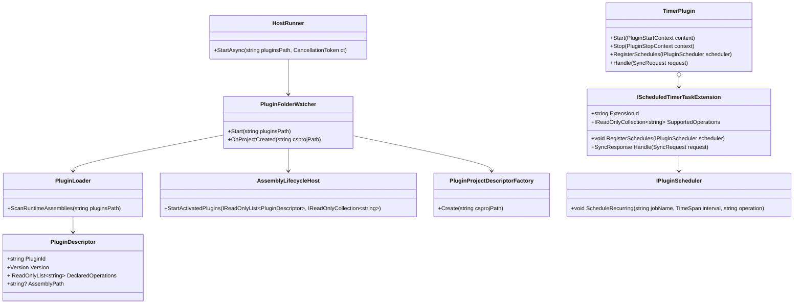

# Requirements: Modus Plugin Authoring and Scheduled Execution Workflows

> Scope: Define the end-to-end process for (1) adding a new plugin to Host runtime onboarding, (2) developing a new standard plugin, and (3) developing a new scheduled execution plugin, including deterministic metadata, lifecycle behavior, and verification tests.

---

## Functionality Worktree

### Coverage Matrix

| Capability | Required Outcome | Dependency Note | Status |
|---|---|---|---|
| Host plugin artifact onboarding process | Document exact project and artifact steps for Host to discover plugin descriptors deterministically | [foundation for all host-side plugin flows] | Implemented |
| Standard plugin development process | Document required contract/lifecycle/operation implementation steps for a non-scheduled plugin | [depends on onboarding process] | Implemented |
| Scheduled execution plugin development process | Document required scheduling interfaces, operation mapping, and recurring registration steps | [depends on standard plugin process] | Implemented |
| Timer-style scheduled extension path | Document how to add a new scheduled timer extension without changing core timer orchestration | [depends on scheduled execution process] | Implemented |
| Host startup and lifecycle activation evidence | Document runtime evidence expectations for discovery, validation, load, registration, activation, and lifecycle start | [depends on onboarding and plugin implementation] | Implemented |
| Deterministic diagnostics and failure handling | Document expected diagnostics and rejection/failure behavior for invalid metadata, unknown operations, and unhealthy startup | [depends on all runtime phases] | Implemented |
| Verification and regression test workflow | Document minimal xUnit coverage required before accepting behavior changes | [depends on all implementation process items] | Implemented |

### Class Diagram

### Completeness Checklist

- [x] Document plugin project creation requirements for Host onboarding (`Plugin.*.csproj` naming, required metadata properties, deterministic plugin identity derivation) [foundation for all host onboarding behavior]
- [x] Document plugin placement and startup path requirements (`plugins` directory resolution, watcher registration semantics, and healthy/unhealthy startup outcomes) [depends on onboarding requirements]
- [x] Document standard plugin implementation requirements (`IPluginContract`, `IPluginLifecycle`, `IPluginOperationCatalog` contracts and deterministic operation catalog) [depends on onboarding and startup path requirements]
- [x] Document scheduled plugin implementation requirements (`IPluginScheduledEvents` and `IPluginScheduler.ScheduleRecurring` usage, recurring job naming, interval and operation mapping) [depends on standard plugin implementation requirements]
- [x] Document timer plugin extension composition requirements (`IScheduledTimerTaskExtension` ownership model, operation routing, and schedule delegation) [depends on scheduled plugin implementation requirements]
- [x] Document autonomous loop behavior requirements for timer-based scheduled plugins (default extension operation selection, 5-second interval behavior, stop/unload cancellation semantics) [depends on timer extension composition requirements]
- [x] Document host runtime diagnostics requirements (deterministic stage diagnostics for discovery, validation, load, registration, activation, operation, and lifecycle startup) [depends on onboarding and implementation requirements]
- [x] Document failure and rejection behavior requirements (unsupported operation responses, malformed metadata handling, missing plugins path behavior, and failure isolation continuity) [depends on diagnostics requirements]
- [x] Document required regression test workflow (unit and integration suites to run for plugin onboarding, lifecycle, scheduling, and timer behavior) [depends on all previous checklist items]

### Host Onboarding Project Creation Requirements

1. Plugin project naming and scope requirements
   - Host watcher accepts project-create events only when the file extension is `.csproj` and the project file is under the configured plugins root.
   - In-scope plugin projects must use filename prefix `Plugin.` (for example: `Plugin.Inventory.csproj`).
   - Out-of-scope project files (for example: `Modus.Utility.csproj`) are ignored with deterministic diagnostics.

2. Required project metadata shape
   - Project file must be valid XML and loadable as an SDK-style `.csproj` document.
   - `PluginId` is derived from project filename without extension and normalized by replacing non-alphanumeric separators with `.` and collapsing duplicate separators.
   - `AssemblyName` is derived from `<AssemblyName>` when present (same normalization), or defaults to normalized `PluginId` when omitted.
   - `Version` is sourced from `<ModusVersion>` when present; when omitted, Host defaults to `1.0.0`; invalid values are rejected as malformed metadata.

3. Deterministic plugin metadata properties (parsed by Host onboarding)

| Property | Required | Default | Deterministic Behavior |
|---|---|---|---|
| `AssemblyName` | No | Normalized `PluginId` | Normalized with same identity rules used for filename-derived ids |
| `ModusVersion` | No | `1.0.0` | Must parse as `System.Version`; invalid values fail descriptor creation |
| `ModusContractCompliant` | No | `true` | Boolean parse using invariant `true/false`; invalid values fail descriptor creation |
| `ModusIsValidAssembly` | No | `true` | Boolean parse using invariant `true/false`; invalid values fail descriptor creation |
| `ModusUsesOnlyStandardLibrary` | No | `true` | Boolean parse using invariant `true/false`; invalid values fail descriptor creation |
| `ModusFailOnActivation` | No | `false` | Boolean parse using invariant `true/false`; invalid values fail descriptor creation |
| `ModusCapabilities` | No | `Cap.{PluginId}` | Parsed as `;`/`,` separated list, ordinal de-duplicated and ordinal sorted |
| `ModusDependsOn` | No | Empty list | Parsed as `;`/`,` separated list, ordinal de-duplicated and ordinal sorted |
| `ModusOperations` | No | Empty list | Parsed as `;`/`,` separated list, ordinal de-duplicated and ordinal sorted |
| `ModusFailingOperations` | No | Empty list | Parsed as `;`/`,` separated list, ordinal de-duplicated and ordinal sorted |

4. Deterministic identity derivation algorithm
   - Step 1: Read project filename (without extension), normalize to dotted identity, and use as `PluginId`.
   - Step 2: Read `<AssemblyName>` if present; otherwise use `PluginId`; normalize using the same dotted identity logic.
   - Step 3: Parse metadata properties with explicit defaults and strict type validation.
   - Step 4: Construct `PluginDescriptor` with normalized identity and stable list ordering for capabilities/dependencies/operations.

### Plugin Placement and Startup Path Requirements

1. `plugins` directory resolution
   - Host entrypoint resolves runtime plugin root from the first non-flag CLI argument.
   - When no positional path argument is supplied, Host defaults to `<current working directory>/plugins`.
   - Resolved path is normalized with `Path.GetFullPath(...)` before watcher startup diagnostics and startup evaluation.

2. Watcher registration semantics
   - Startup with a non-empty plugins path always registers the watcher and emits deterministic startup diagnostics in order:
     1. `stage=startup pipeline=plugin-loader outcome=initialized`
     2. `stage=startup outcome=success watcher=registered path=<full-path>`
   - Startup with missing or empty plugins path does not register watcher and returns unhealthy result (`HostHealthy=false`, `WatcherRegistered=false`).

3. Healthy and unhealthy startup outcomes
   - If resolved plugins directory exists, startup remains healthy (`HostHealthy=true`) and runtime proceeds with scan/onboarding.
   - If resolved plugins directory does not exist, startup is unhealthy (`HostHealthy=false`) and emits deterministic diagnostic: `stage=startup outcome=failure reason=plugins directory missing path=<full-path>`.
   - Entrypoint exit semantics are deterministic: return `0` when startup healthy, return `1` when startup unhealthy.

4. Deterministic startup path evidence scope
   - Path resolution and health semantics are validated at both watcher level (`PluginFolderWatcher.Start`) and entrypoint level (`Program` invoking `HostRunner.StartAsync`).
   - Integration tests assert both explicit path invocation and default path (current directory) invocation.

### Standard Plugin Implementation Requirements

1. Mandatory standard plugin contracts
   - Every standard plugin must implement `IPluginContract` with non-empty `PluginId`, non-empty `ContractName`, and non-null `ContractVersion`.
   - Every standard plugin must implement `IPluginLifecycle` and expose all lifecycle members (`Load`, `Start`, `Stop`, `Unload`) for host-managed runtime activation/deactivation.
   - Every standard plugin must implement `IPluginOperationCatalog` and return a non-empty operation catalog.

2. Deterministic operation catalog requirements
   - `IPluginOperationCatalog.SupportedOperations` must be deterministic and canonical: ordinal distinct, ordinal sorted, and free of null/empty/whitespace entries.
   - Operation metadata authored in project artifacts (`ModusOperations`) is normalized to deterministic ordering during descriptor construction.
   - Runtime operation execution chooses the first operation from the deterministic catalog ordering, preserving stable behavior across repeated starts.

3. Standard plugin validation expectations
   - Contract validation fails when required standard capabilities are missing.
   - Contract validation fails when operation catalog entries are duplicated (ordinal), unsorted, or otherwise non-deterministic.
   - Validation for non-scheduled standard plugins may disable scheduled capability enforcement while preserving deterministic registration checks.

4. Runtime evidence scope for standard plugin authoring
   - Validation and runtime activation success are both required for a compliant standard plugin descriptor.
   - Repeated runtime starts with the same descriptor must emit the same selected operation diagnostic.

### Scheduled Plugin Implementation Requirements

1. Mandatory scheduled plugin capability
   - A scheduled plugin must satisfy standard plugin requirements and additionally implement `IPluginScheduledEvents`.
   - Contract validation for scheduled workflows must enforce `RequireScheduledEventsCapability = true` so missing schedule capability is rejected deterministically.

2. `RegisterSchedules` recurring registration requirements
   - `IPluginScheduledEvents.RegisterSchedules(IPluginScheduler scheduler)` must call `scheduler.ScheduleRecurring(...)` for each recurring workload the plugin owns.
   - Each recurring registration must provide concrete and stable values for `jobName`, `interval`, and `operation`.

3. Recurring job naming and operation mapping
   - `jobName` must be deterministic and operation-scoped, using the pattern `<Operation>.Every<IntervalLabel>` (example: `Payments.SyncLedger.EveryHour`).
   - `operation` must be a member of `IPluginOperationCatalog.SupportedOperations` for the same plugin and use ordinal-stable naming.
   - `interval` must represent the declared cadence for the workload and remain stable across repeated registrations for identical plugin configuration.

4. Runtime evidence scope for scheduled plugin authoring
   - Scheduled-capable plugin candidates pass contract validation only when `IPluginScheduledEvents` is present.
   - Schedule registration evidence must assert one or more recurring entries with expected deterministic `jobName`, `interval`, and `operation` mapping.

### Timer Plugin Extension Composition Requirements

1. `IScheduledTimerTaskExtension` ownership model
   - `TimerPlugin` composes one or more `IScheduledTimerTaskExtension` instances; each extension declares owned operations through `SupportedOperations`.
   - Ownership is determined by first registration wins across extension enumeration order for each operation key (ordinal comparison), producing deterministic owner selection.
   - Effective timer operation catalog is the ordinal-sorted set of owned operation keys across all composed extensions.

2. Operation routing requirements
   - `TimerPlugin.Handle(SyncRequest request)` must route known operations to the owning extension that declared the operation.
   - Unknown operations must return deterministic rejection semantics: `Success=false`, `Status=Rejected`, payload `unsupported-operation`, and correlation id preserved from request.
   - Routing behavior must remain extension-owned, so adding a new timer extension operation must not require core orchestration branching changes inside `TimerPlugin`.

3. Schedule delegation requirements
   - `TimerPlugin.RegisterSchedules(IPluginScheduler scheduler)` must delegate schedule registration to each composed extension.
   - Each extension remains responsible for concrete `ScheduleRecurring` values (`jobName`, `interval`, `operation`) for operations it owns.
   - Delegation behavior must include newly added extensions without modifying timer orchestration logic.

4. Runtime evidence scope for timer extension authoring
   - Adding an extension with a new operation must surface that operation in `TimerPlugin.SupportedOperations` and be routable through `Handle`.
   - Routing evidence must assert both known-operation dispatch and unknown-operation rejection semantics.
   - Delegation evidence must assert that schedule entries from composed extensions are registered through a single `TimerPlugin.RegisterSchedules` invocation.

### Timer Autonomous Loop Behavior Requirements

1. Default extension operation selection requirements
   - `TimerPlugin` autonomous loop operation selection is anchored to extension composition order: the first composed `IScheduledTimerTaskExtension` is the default extension for autonomous execution.
   - Default operation selection is deterministic within that default extension: the first valid operation in `SupportedOperations` that survives ownership resolution is selected as the autonomous loop operation.
   - Autonomous dispatch must execute through `TimerPlugin.Handle(...)` so extension ownership routing remains the single operation dispatch path.

2. Five-second interval requirements
   - Default timer plugin constructors configure autonomous loop cadence to `TimeSpan.FromSeconds(5)`.
   - Runtime schedule registration for the default timer extension must expose a recurring interval of exactly five seconds for `Timer.WriteCurrentTime`.
   - Implementations may use explicit constructor overloads with non-default interval values for deterministic tests, but baseline authoring behavior remains five-second cadence.

3. Stop and unload cancellation semantics
   - `TimerPlugin.Start(...)` must create an autonomous loop linked to the lifecycle cancellation token and prevent duplicate concurrent loop starts.
   - `TimerPlugin.Stop(...)` and `TimerPlugin.Unload(...)` must both deterministically cancel and drain the running loop through shared loop-stop semantics.
   - After stop or unload, no further autonomous operation dispatches are allowed from the canceled loop instance.

4. Runtime evidence scope for autonomous loop behavior
   - Evidence must prove autonomous lifecycle start dispatches only the default extension operation.
   - Evidence must prove default timer scheduling and interval registration remain five seconds in baseline timer composition.
   - Evidence must prove stop and unload lifecycle paths cancel the loop and prevent post-cancellation invocations.

### Host Runtime Diagnostics Requirements

1. Deterministic stage diagnostics requirements
   - Host runtime diagnostics must emit stage-prefixed entries using stable key-value formatting (`stage=<stage> ... outcome=<status>`).
   - Stage coverage for successful runtime onboarding and execution must include deterministic entries for:
     - discovery (`stage=discovery`)
     - validation (`stage=validation`)
     - load (`stage=load`)
     - registration (`stage=registration`)
     - activation (`stage=activation`)
     - operation (`stage=operation`)
     - lifecycle startup (`stage=lifecycle ... outcome=started source=<descriptor-plugin-id>`)

2. Deterministic ordering requirements
   - For a successful plugin startup path in `InMemoryHostRuntime`, diagnostics order must be deterministic as:
     1. discovery
     2. validation
     3. load
     4. registration
     5. activation
     6. operation
   - Lifecycle startup diagnostics from assembly-backed plugin lifecycle activation must be emitted after runtime activation selection and include descriptor source identity.

3. Stage failure diagnostic requirements
   - Validation failures must emit `stage=validation ... outcome=failure reason=<reason>` and prevent downstream load/activation/operation entries for the failed plugin.
   - Load failures must emit `stage=load ... outcome=failure reason=<reason>` and trigger isolated-failure semantics without suppressing healthy plugin continuity.
   - Activation failures must emit `stage=activation ... outcome=failure reason=<reason>` with isolation/continuity diagnostics preserved.
   - Operation execution failures must emit `stage=operation ... outcome=failure reason=<reason>` while preserving deterministic operation identity in diagnostics.
   - Lifecycle startup failures from assembly lifecycle host activation must emit `stage=lifecycle ... outcome=failure reason=<reason>`.

4. Runtime evidence scope for diagnostics requirements
   - Discovery-through-operation stage ordering and success/failure evidence must be asserted by host integration tests.
   - Lifecycle startup diagnostics evidence must be asserted via startup flows that load activated runtime assemblies and invoke `IPluginLifecycle` startup.
   - Diagnostics expectations must use ordinal comparisons for stage keys, plugin ids, operation names, and fixed reasons to preserve deterministic assertions.

### Failure and Rejection Behavior Requirements

1. Unsupported operation response requirements
   - `TimerPlugin.Handle(SyncRequest request)` must reject unknown operations deterministically when no operation owner exists.
   - Rejected responses must preserve request correlation id and use fixed semantics: `Success=false`, `Status=Rejected`, `Payload=unsupported-operation`, `ServedFromFallback=false`.
   - Known operations must continue to dispatch to the owning extension without mutating rejection behavior for unknown operations.

2. Malformed metadata handling requirements
   - `PluginProjectDescriptorFactory.Create(string csprojPath)` must reject malformed project XML/metadata by throwing descriptor-construction failures with deterministic reason text.
   - `PluginFolderWatcher.OnProjectCreated(string csprojPath)` must convert descriptor-construction failures into onboarding diagnostics: `stage=descriptor outcome=failure reason=<reason>`.
   - Malformed descriptor onboarding must be accepted as an event (`EventAccepted=true`) but not activated (`PluginActivated=false`) and must record plugin id in failed plugin set.

3. Missing plugins path behavior requirements
   - `PluginFolderWatcher.Start(string pluginsPath)` with null/empty/whitespace path must return unhealthy startup and must not register watcher (`HostHealthy=false`, `WatcherRegistered=false`).
   - `PluginFolderWatcher.Start(string pluginsPath)` with non-empty path that does not exist must still register watcher but return unhealthy startup and deterministic missing-directory diagnostic.
   - Host entrypoint startup semantics remain deterministic for missing paths: healthy startup returns process exit code `0`, unhealthy startup returns `1`.

4. Failure isolation continuity requirements
   - Validation, load, activation, and operation failures must be isolated per plugin through `PluginIsolationBoundary`, preserving host continuity for healthy plugins.
   - Isolated failures must emit deterministic diagnostics for stage failure, isolation boundary, and continuity preservation (`stage=continuity outcome=preserved`).
   - Operation failures must roll back activation/registration for the failed plugin while preserving healthy plugin capability ownership and operation execution.

5. Runtime evidence scope for failure and rejection behavior
   - Unsupported-operation rejection semantics must be asserted with concrete request/response values and correlation-id preservation.
   - Malformed metadata handling must be asserted through watcher onboarding flows that surface descriptor failure diagnostics.
   - Missing-path and missing-directory startup behavior must be asserted at watcher and entrypoint levels with deterministic diagnostics and health semantics.
   - Isolation continuity must be asserted with mixed healthy/failing descriptor sets that prove healthy plugin activation and operation progression continue after isolated failures.

### Required Regression Test Workflow

1. Precondition and sequencing rules
   - Run regression suites after any change affecting plugin onboarding, contract/lifecycle validation, scheduling, diagnostics, or timer behavior.
   - Build first, then run tests with `--no-build` to ensure test binaries use freshly built referenced assemblies.
   - Treat any failing test in the required suites as a release-blocking regression for plugin workflow changes.

2. Required unit suite for plugin contract and timer behavior
   - Command: `dotnet build tests/Modus.Core.Tests/Modus.Core.Tests.csproj`
   - Command: `dotnet test tests/Modus.Core.Tests/Modus.Core.Tests.csproj --no-build`
   - Coverage intent:
     - plugin contract/lifecycle/operation-catalog validation semantics,
     - scheduled capability validation and deterministic operation catalog behavior,
     - timer plugin ownership routing, schedule registration, autonomous loop, and lifecycle cancellation behavior.

3. Required integration suite for host onboarding and lifecycle/scheduling flow
   - Command: `dotnet build src/Modus.Host/Modus.Host.csproj`
   - Command: `dotnet test tests/Modus.Host.IntegrationTests/Modus.Host.IntegrationTests.csproj --no-build`
   - Coverage intent:
     - descriptor construction and onboarding from plugin project artifacts,
     - startup/watcher registration semantics and deterministic diagnostics,
     - activation/isolation continuity across validation, load, activation, and operation stages,
     - scheduled plugin and timer extension workflows executed through host runtime paths.

4. Full-solution safety gate
   - Command: `dotnet build Modus.slnx`
   - Command: `dotnet test Modus.slnx --no-build`
   - Use this gate before merging when workflow changes span both core and host behavior or when multiple plugin workflow areas are touched.

5. Required evidence to attach to requirement updates
   - Record the exact command set executed and terminal exit codes.
   - Record the specific suites used (core unit and host integration at minimum) and the change date.
   - Keep evidence deterministic by using the command order defined in this section.

### Implementation Mapping Status (Current Iteration)

| Member | Status |
|---|---|
| `PluginFolderWatcher.OnProjectCreated(string csprojPath)` (scope + extension gate) | Implemented |
| `PluginFolderWatcher.IsInScopePluginProject(string fullPath)` (`Plugin.` naming gate) | Implemented |
| `PluginProjectDescriptorFactory.Create(string csprojPath)` | Implemented |
| `PluginProjectDescriptorFactory.NormalizePluginId(string projectName)` | Implemented |
| `PluginProjectDescriptorFactory.ParseVersionOrDefault(...)` | Implemented |
| `PluginProjectDescriptorFactory.ParseBoolOrDefault(...)` | Implemented |
| `PluginProjectDescriptorFactory.ParseStringList(string? rawValue)` | Implemented |
| `Program` (plugins path argument/default resolution and unhealthy exit semantics) | Implemented |
| `HostRunner.StartAsync(string pluginsPath, CancellationToken ct)` | Implemented |
| `PluginFolderWatcher.Start(string pluginsPath)` (watcher registration + startup health evaluation) | Implemented |
| `PluginContractValidator.Validate(object candidate, PluginContractValidationPolicy policy)` (`IPluginContract` + `IPluginLifecycle` + deterministic `IPluginOperationCatalog` validation) | Implemented |
| `PluginProjectDescriptorFactory.ParseStringList(string? rawValue)` (`ModusOperations` deterministic parse) | Implemented |
| `InMemoryHostRuntime.SelectDeterministicOperation(PluginDescriptor descriptor)` | Implemented |
| `PluginContractValidator.Validate(object candidate, PluginContractValidationPolicy policy)` (`RequireScheduledEventsCapability` enforcement for `IPluginScheduledEvents`) | Implemented |
| `PaymentsGatewayPlugin.RegisterSchedules(IPluginScheduler scheduler)` (`ScheduleRecurring` deterministic job-name, interval, operation mapping) | Implemented |
| `TimerPlugin.BuildOperationOwners(...)` (`IScheduledTimerTaskExtension` operation ownership composition) | Implemented |
| `TimerPlugin.Handle(SyncRequest request)` (known-operation owner dispatch + unknown-operation rejection semantics) | Implemented |
| `TimerPlugin.RegisterSchedules(IPluginScheduler scheduler)` (delegated schedule registration to composed extensions) | Implemented |
| `TimerPlugin.ResolveAutonomousOperation(...)` (default extension operation selection for autonomous loop) | Implemented |
| `TimerPlugin.Start(PluginStartContext context)` + `RunAutonomousLoopAsync(CancellationToken)` (autonomous loop start and recurring dispatch behavior) | Implemented |
| `TimerPlugin.Stop(PluginStopContext context)` + `TimerPlugin.Unload(PluginUnloadContext context)` + `StopLoop()` (shared cancellation semantics for stop/unload) | Implemented |
| `InMemoryHostRuntime.Start(IEnumerable<PluginDescriptor> input)` (deterministic diagnostics emission for discovery, validation, load, registration, activation, and operation stages) | Implemented |
| `AssemblyLifecycleHost.StartActivatedPlugins(IReadOnlyList<PluginDescriptor>, IReadOnlyCollection<string>)` (`stage=lifecycle ... outcome=started` lifecycle startup diagnostics for activated runtime assemblies) | Implemented |
| `PluginIsolationBoundary.IsolateFailure(...)` + `PluginIsolationBoundary.IsolateOperationFailure(...)` (failure-stage diagnostics, isolation boundaries, and continuity preservation semantics) | Implemented |
| `RegressionExecutionWorkflow` (required command sequencing and suite coverage gate for plugin workflow changes) | Implemented |

### Checkbox Transition Evidence

| Requirement Item (exact text) | Previous State | Current State | Transition Recorded At | Concrete Evidence Anchors |
|---|---|---|---|---|
| Document plugin project creation requirements for Host onboarding (`Plugin.*.csproj` naming, required metadata properties, deterministic plugin identity derivation) [foundation for all host onboarding behavior] | [ ] | [x] | 2026-05-17 | src/Modus.Host/Domain/Plugins/PluginFolderWatcher.cs (`IsInScopePluginProject`, `OnProjectCreated`), src/Modus.Host/Domain/Plugins/PluginProjectDescriptorFactory.cs (`Create`, `NormalizePluginId`, metadata parse helpers), tests/Modus.Host.IntegrationTests/DescriptorConstructionTests.cs (`DescriptorFactory_GivenValidCsprojPath_ExpectedDeterministicPluginDescriptorCreated`, `DescriptorFactory_GivenMalformedProjectMetadata_ExpectedDescriptorCreationFailureWithDiagnostics`), tests/Modus.Host.IntegrationTests/StartupAndActivationTests.cs (`Watcher_GivenOutOfScopeProjectAndDuplicateCreateEvent_ExpectedOnlyInScopePluginAcceptedOnce`) |
| Document plugin placement and startup path requirements (`plugins` directory resolution, watcher registration semantics, and healthy/unhealthy startup outcomes) [depends on onboarding requirements] | [ ] | [x] | 2026-05-17 | src/Modus.Host/Program.cs (default `plugins` resolution and exit code semantics), src/Modus.Host/Domain/Plugins/HostRunner.cs (`StartAsync` startup pass-through and cancellation failure), src/Modus.Host/Domain/Plugins/PluginFolderWatcher.cs (`Start` watcher registration and health diagnostics), tests/Modus.Host.IntegrationTests/StartupAndActivationTests.cs (`Startup_GivenHostInitialization_ExpectedPluginFolderWatcherRegisteredForPluginsPath`, `Startup_GivenMissingPluginsDirectory_ExpectedHostUnhealthyAndReportsDiagnostic`), tests/Modus.Host.IntegrationTests/HostRunnerEntrypointTests.cs (`Program_GivenNoPluginsPathArgumentAndExistingDefaultPluginsDirectory_ExpectedDefaultPathResolvedFromCurrentDirectory`, `Program_GivenNoPluginsPathArgumentAndMissingDefaultPluginsDirectory_ExpectedUnhealthyStartupAndFailureDiagnostic`) |
| Document standard plugin implementation requirements (`IPluginContract`, `IPluginLifecycle`, `IPluginOperationCatalog` contracts and deterministic operation catalog) [depends on onboarding and startup path requirements] | [ ] | [x] | 2026-05-17 | src/Modus.Core/Plugins/PluginContractValidator.cs (`Validate` deterministic `SupportedOperations` enforcement), src/Modus.Host/Domain/Plugins/PluginProjectDescriptorFactory.cs (`ParseStringList` deterministic `ModusOperations` normalization), src/Modus.Host/Domain/Plugins/InMemoryHostRuntime.cs (`SelectDeterministicOperation`), tests/Modus.Host.IntegrationTests/StandardPluginAuthoringWorkflowTests.cs (`StandardPluginAuthoringWorkflow_GivenContractLifecycleAndOperationsImplemented_ExpectedRuntimeValidationAndActivationSucceed`, `StandardPluginAuthoringWorkflow_GivenDuplicateOrAmbiguousOperations_ExpectedOperationResolutionRemainsDeterministic`) |
| Document scheduled plugin implementation requirements (`IPluginScheduledEvents` and `IPluginScheduler.ScheduleRecurring` usage, recurring job naming, interval and operation mapping) [depends on standard plugin implementation requirements] | [ ] | [x] | 2026-05-17 | src/Modus.Core/Plugins/IPluginScheduledEvents.cs (`RegisterSchedules` contract), src/Modus.Core/Plugins/IPluginScheduler.cs (`ScheduleRecurring` contract), src/Modus.Core/Plugins/PluginContractValidator.cs (`RequireScheduledEventsCapability` enforcement), src/SamplePlugins/Plugin.Payments.Gateway/PaymentsGatewayPlugin.cs (`RegisterSchedules` deterministic recurring mapping), tests/Modus.Host.IntegrationTests/ScheduledPluginAuthoringWorkflowTests.cs (`ScheduledPluginAuthoringWorkflow_GivenRecurringScheduleRegistration_ExpectedSchedulerReceivesDeterministicJobIntervalAndOperation`, `ScheduledPluginAuthoringWorkflow_GivenScheduleRegistrationOmitted_ExpectedValidationOrRuntimeDiagnosticsExposeMissingCapability`) |
| Document timer plugin extension composition requirements (`IScheduledTimerTaskExtension` ownership model, operation routing, and schedule delegation) [depends on scheduled plugin implementation requirements] | [ ] | [x] | 2026-05-17 | src/Modus.Core/Plugins/TimerPlugin.cs (`BuildOperationOwners`, `Handle`, `RegisterSchedules`, `SupportedOperations`), tests/Modus.Host.IntegrationTests/TimerExtensionWorkflowTests.cs (`TimerExtensionWorkflow_GivenNewScheduledTaskExtension_ExpectedTimerPluginSupportsOperationWithoutCoreOrchestrationChanges`, `TimerExtensionWorkflow_GivenKnownAndUnknownOperations_ExpectedDispatchRoutesOwnerAndRejectsUnsupportedOperations`) |
| Document autonomous loop behavior requirements for timer-based scheduled plugins (default extension operation selection, 5-second interval behavior, stop/unload cancellation semantics) [depends on timer extension composition requirements] | [ ] | [x] | 2026-05-17 | src/Modus.Core/Plugins/TimerPlugin.cs (`ResolveAutonomousOperation`, constructor default `TimeSpan.FromSeconds(5)`, `Start`, `RunAutonomousLoopAsync`, `Stop`, `Unload`, `StopLoop`), src/Modus.Core/Plugins/FiveSecondIntervalsTimerPrint.cs (`RegisterSchedules` five-second recurring registration), tests/Modus.Core.Tests/Plugins/TimerPluginLifecycleTests.cs (`TimerPlugin_GivenRegisterSchedules_ExpectedScheduleRecurringCalledWithFiveSecondInterval`, `TimerPlugin_GivenAutonomousLoopWithMultipleExtensions_ExpectedInvokesDefaultExtensionOperationViaHandleDispatch`, `TimerPlugin_GivenLifecycleStart_ExpectedWritesTimestampWithoutHostOperationCall`) |
| Document host runtime diagnostics requirements (deterministic stage diagnostics for discovery, validation, load, registration, activation, operation, and lifecycle startup) [depends on onboarding and implementation requirements] | [ ] | [x] | 2026-05-17 | src/Modus.Host/Domain/Plugins/InMemoryHostRuntime.cs (`Start` stage diagnostics for discovery/validation/load/registration/activation/operation), src/Modus.Host/Domain/Plugins/AssemblyLifecycleHost.cs (`StartActivatedPlugins` lifecycle startup diagnostics), src/Modus.Host/Domain/Plugins/PluginFolderWatcher.cs (`Start` startup scan + lifecycle startup emission path), tests/Modus.Host.IntegrationTests/StartupAndActivationTests.cs (`Diagnostics_GivenSuccessfulPipeline_ExpectedDiscoveryValidationLoadActivationMessagesInOrder`, `Diagnostics_GivenPipelineFailure_ExpectedFailureStageAndReasonIncludedInDiagnosticOutput`, `Startup_GivenPreExistingRuntimeAssemblies_ExpectedStartupPipelineActivatesDiscoveredPlugins`), tests/Modus.Host.IntegrationTests/OperationExecutionTests.cs (`ExecuteDeclaredOperations_GivenActivatedPlugin_ExpectedAtLeastOneOperationExecutedAndLogged`, `ExecuteDeclaredOperations_GivenOperationFailure_ExpectedPluginFailureIsolatedAndHostContinues`) |
| Document failure and rejection behavior requirements (unsupported operation responses, malformed metadata handling, missing plugins path behavior, and failure isolation continuity) [depends on diagnostics requirements] | [ ] | [x] | 2026-05-17 | src/Modus.Core/Plugins/TimerPlugin.cs (`Handle` unknown-operation rejection response semantics), src/Modus.Host/Domain/Plugins/PluginProjectDescriptorFactory.cs (`Create` malformed metadata rejection), src/Modus.Host/Domain/Plugins/PluginFolderWatcher.cs (`Start` missing-path and missing-directory startup behavior, `OnProjectCreated` descriptor-failure diagnostics), src/Modus.Host/Domain/Plugins/PluginIsolationBoundary.cs (`IsolateFailure`, `IsolateOperationFailure` continuity diagnostics), tests/Modus.Host.IntegrationTests/TimerExtensionWorkflowTests.cs (`TimerExtensionWorkflow_GivenKnownAndUnknownOperations_ExpectedDispatchRoutesOwnerAndRejectsUnsupportedOperations`), tests/Modus.Host.IntegrationTests/DescriptorConstructionTests.cs (`DescriptorFactory_GivenMalformedProjectMetadata_ExpectedDescriptorCreationFailureWithDiagnostics`), tests/Modus.Host.IntegrationTests/StartupAndActivationTests.cs (`Startup_GivenMissingPluginsDirectory_ExpectedHostUnhealthyAndReportsDiagnostic`), tests/Modus.Host.IntegrationTests/FaultIsolationAndContinuityTests.cs (`Registration_GivenLoadFailure_ExpectedIsolationBoundaryAndHostContinuityDiagnostics`, `Registration_GivenActivationFailure_ExpectedIsolationBoundaryAndHostContinuityDiagnostics`) |
| Document required regression test workflow (unit and integration suites to run for plugin onboarding, lifecycle, scheduling, and timer behavior) [depends on all previous checklist items] | [ ] | [x] | 2026-05-17 | .github/requirements/Modus.PluginAuthoring.Workflows.md (`Required Regression Test Workflow`), tests/Modus.Core.Tests/Plugins/PluginContractsTests.cs (contract + operation-catalog regression), tests/Modus.Core.Tests/Plugins/TimerPluginLifecycleTests.cs (timer lifecycle and schedule regression), tests/Modus.Host.IntegrationTests/StandardPluginAuthoringWorkflowTests.cs (standard plugin onboarding/lifecycle regression), tests/Modus.Host.IntegrationTests/ScheduledPluginAuthoringWorkflowTests.cs (scheduled registration regression), tests/Modus.Host.IntegrationTests/TimerExtensionWorkflowTests.cs (timer extension routing/scheduling regression), tests/Modus.Host.IntegrationTests/StartupAndActivationTests.cs (startup and diagnostics regression) |

---

## Test Plan

### `HostOnboardingWorkflow`

1. `HostOnboardingWorkflow_GivenPluginProjectNamingAndMetadataRules_ExpectedDescriptorIdentityDerivesDeterministically`
   *Assumption*: Host onboarding depends on deterministic plugin identity derived from project artifact naming and metadata.

2. `HostOnboardingWorkflow_GivenPluginProjectOutsideRules_ExpectedOnboardingRejectsWithExplicitReason`
   *Assumption*: Out-of-scope or malformed plugin project artifacts are rejected with stable diagnostics.

### `HostStartupPathWorkflow`

1. `HostStartupPathWorkflow_GivenExistingPluginsDirectory_ExpectedWatcherRegistersAndHostHealthy`
   *Assumption*: Host startup reports healthy when plugin directory exists and startup pipeline initializes.

2. `HostStartupPathWorkflow_GivenMissingPluginsDirectory_ExpectedHostUnhealthyAndNonZeroExitSemantics`
   *Assumption*: Host startup reports unhealthy and entrypoint semantics remain non-success for missing plugin path.

### `StandardPluginAuthoringWorkflow`

1. `StandardPluginAuthoringWorkflow_GivenContractLifecycleAndOperationsImplemented_ExpectedRuntimeValidationAndActivationSucceed`
   *Assumption*: Standard plugin authoring requires contract, lifecycle, and operation catalog implementation for successful activation.

2. `StandardPluginAuthoringWorkflow_GivenDuplicateOrAmbiguousOperations_ExpectedOperationResolutionRemainsDeterministic`
   *Assumption*: Declared operations must remain deterministic to preserve predictable runtime execution behavior.

### `ScheduledPluginAuthoringWorkflow`

1. `ScheduledPluginAuthoringWorkflow_GivenRecurringScheduleRegistration_ExpectedSchedulerReceivesDeterministicJobIntervalAndOperation`
   *Assumption*: Scheduled plugin authoring requires deterministic job naming, interval, and operation mapping in schedule registration.

2. `ScheduledPluginAuthoringWorkflow_GivenScheduleRegistrationOmitted_ExpectedValidationOrRuntimeDiagnosticsExposeMissingCapability`
   *Assumption*: Missing scheduling behavior is observable through deterministic contract validation or runtime diagnostics.

### `TimerExtensionWorkflow`

1. `TimerExtensionWorkflow_GivenNewScheduledTaskExtension_ExpectedTimerPluginSupportsOperationWithoutCoreOrchestrationChanges`
   *Assumption*: Timer extensibility succeeds when new behavior is added by extension composition rather than orchestration code edits.

2. `TimerExtensionWorkflow_GivenKnownAndUnknownOperations_ExpectedDispatchRoutesOwnerAndRejectsUnsupportedOperations`
   *Assumption*: Extension ownership must control known operation dispatch while preserving rejected responses for unknown operations.

### `TimerAutonomousLoopWorkflow`

1. `TimerAutonomousLoopWorkflow_GivenHostLifecycleStart_ExpectedDefaultExtensionOperationExecutesAtFiveSecondCadence`
   *Assumption*: Autonomous timer behavior executes the default extension operation on a recurring five-second interval.

2. `TimerAutonomousLoopWorkflow_GivenStopOrUnload_ExpectedLoopCancelsAndNoFurtherInvocationsOccur`
   *Assumption*: Stop and unload lifecycle phases must deterministically cancel autonomous loop execution.

### `HostDiagnosticsWorkflow`

1. `HostDiagnosticsWorkflow_GivenSuccessfulOnboarding_ExpectedStageDiagnosticsEmitDeterministicOrderedPhases`
   *Assumption*: Runtime diagnostics are deterministic and include stage transitions for successful plugin onboarding.

2. `HostDiagnosticsWorkflow_GivenLifecyclePluginFromAssembly_ExpectedLifecycleStartedDiagnosticIsEmitted`
   *Assumption*: Assembly-based lifecycle startup emits deterministic diagnostics for activated plugin lifecycle types.

### `FailureAndRejectionWorkflow`

1. `FailureAndRejectionWorkflow_GivenUnsupportedOperationRequest_ExpectedRejectedResponseWithUnsupportedPayload`
   *Assumption*: Unsupported operation requests return deterministic rejected responses and payload semantics.

2. `FailureAndRejectionWorkflow_GivenMalformedPluginArtifactOrActivationFailure_ExpectedFailureIsolationPreservesContinuityForHealthyPlugins`
   *Assumption*: Plugin failures are isolated while healthy plugins continue through startup and operation stages.

### `RegressionExecutionWorkflow`

1. `RegressionExecutionWorkflow_GivenPluginOnboardingOrSchedulingChanges_ExpectedCoreAndHostTestSuitesPassWithoutRegression`
   *Assumption*: Plugin and scheduling changes are only accepted when relevant unit and integration test suites pass.

2. `RegressionExecutionWorkflow_GivenTimerBehaviorChanges_ExpectedFocusedTimerTestsAndHostRunEvidenceAreBothGreen`
   *Assumption*: Timer behavior changes require both focused timer tests and host-run runtime evidence.

---

*All assumptions verified by Falsify Claims. Zero Falsified rows.*
