# Modus – Primitive Obsession Refactor: Typed Value Objects & Generics

> Eliminate primitive obsession across Modus.Core and Modus.Host by introducing typed readonly record structs for semantic identifiers (PluginId, OperationName, ContractName, JobName, CorrelationId, CapabilityName), updating all affected contracts and implementations, making PluginContractValidator generic, and replacing the untyped string? Status in HTTP DTOs with the existing SyncResponseStatus enum.

---

## Functionality Worktree

### Class Diagram

```mermaid
classDiagram
    class PluginId {
        +string Value
        +PluginId(string value)
        +ToString() string
    }
    class OperationName {
        +string Value
        +OperationName(string value)
        +ToString() string
    }
    class ContractName {
        +string Value
        +ContractName(string value)
        +ToString() string
    }
    class JobName {
        +string Value
        +JobName(string value)
        +ToString() string
    }
    class CorrelationId {
        +string Value
        +CorrelationId(string value)
        +ToString() string
    }
    class CapabilityName {
        +string Value
        +CapabilityName(string value)
        +ToString() string
    }
    class IPluginContract {
        <<interface>>
        +PluginId PluginId
        +ContractName ContractName
        +Version ContractVersion
    }
    class IPluginOperationCatalog {
        <<interface>>
        +IReadOnlyCollection~OperationName~ SupportedOperations
    }
    class IPluginScheduler {
        <<interface>>
        +ScheduleRecurring(JobName, TimeSpan, OperationName)
        +ScheduleAt(JobName, DateTimeOffset, OperationName)
    }
    class PluginLoadContext {
        +PluginId PluginId
        +CancellationToken CancellationToken
    }
    class SyncRequest {
        +OperationName Operation
        +CorrelationId? CorrelationId
    }
    class SyncResponse {
        +CorrelationId? CorrelationId
    }
    class DomainEventEnvelope {
        +PluginId SourcePluginId
        +CorrelationId? CorrelationId
    }
    class ContractValidationResult {
        +IReadOnlyList~CapabilityName~ MissingCapabilities
    }
    class PluginDescriptor {
        +PluginId PluginId
        +IReadOnlyList~CapabilityName~ Capabilities
        +IReadOnlyList~OperationName~ DeclaredOperations
    }
    IPluginContract --> PluginId : uses
    IPluginContract --> ContractName : uses
    IPluginOperationCatalog --> OperationName : uses
    IPluginScheduler --> JobName : uses
    IPluginScheduler --> OperationName : uses
    PluginLoadContext --> PluginId : uses
    SyncRequest --> OperationName : uses
    SyncRequest --> CorrelationId : uses
    SyncResponse --> CorrelationId : uses
    DomainEventEnvelope --> PluginId : uses
    DomainEventEnvelope --> CorrelationId : uses
    ContractValidationResult --> CapabilityName : uses
    PluginDescriptor --> PluginId : uses
    PluginDescriptor --> CapabilityName : uses
    PluginDescriptor --> OperationName : uses
```



### Completeness Checklist

Evidence source for all items: direct source-file inspection of `src/Modus.Core` and `src/Modus.Host`.

| File | Current Primitive | Proposed Type |
|---|---|---|
| `IPluginContract.cs` | `string PluginId` | `PluginId` |
| `IPluginContract.cs` | `string ContractName` | `ContractName` |
| `IPluginOperationCatalog.cs` | `IReadOnlyCollection<string> SupportedOperations` | `IReadOnlyCollection<OperationName>` |
| `IPluginScheduler.cs` | `string jobName`, `string operation` | `JobName`, `OperationName` |
| `PluginLifecycleContexts.cs` | `string PluginId` (×4 records) | `PluginId` |
| `SyncRequest.cs` | `string Operation`, `string? CorrelationId` | `OperationName`, `CorrelationId?` |
| `SyncResponse.cs` | `string? CorrelationId` | `CorrelationId?` |
| `DomainEventEnvelope.cs` | `string SourcePluginId`, `string? CorrelationId` | `PluginId`, `CorrelationId?` |
| `PluginDescriptor.cs` | `string PluginId`, `IReadOnlyList<string> Capabilities/DependsOn/DeclaredOperations/FailingOperations` | `PluginId`, typed collections |
| `PluginSpec.cs` | `string PluginId` | `PluginId` |
| `PluginOnboardingResult.cs` | `string? PluginId`, `IReadOnlyList<string> ActivePluginIds/FailedPluginIds` | `PluginId?`, `IReadOnlyList<PluginId>` |
| `ContractValidationResult.cs` | `IReadOnlyList<string> MissingCapabilities` | `IReadOnlyList<CapabilityName>` |
| `PluginContractValidator.cs` | `object candidate` | `T candidate where T : class` |
| `InMemoryLifecycleEngine.cs` | `Dictionary<string, PluginSpec>`, `string` keys throughout | `Dictionary<PluginId, PluginSpec>` |
| `PluginOperationHttpResponse.cs` | `string? Status` | `SyncResponseStatus?` |
| `PluginFailureReporter.cs` | `string pluginId`, `string operation`, `string stage` | `PluginId`, `OperationName`, `string stage` |
| `PluginBase.cs` | `virtual string PluginId`, `virtual string ContractName` | `virtual PluginId PluginId`, `virtual ContractName ContractName` |

**Phase 1 – Core Value Object Types (foundational; no dependencies on other items)**

- [x] Create `PluginId` readonly record struct in `Modus.Core/Plugins/Types/` — wraps non-null, non-whitespace `string`; implements `IEquatable`; `ToString()` returns `Value` [foundational — depended on by items 7, 10, 13, 14, 15, 16, 19, 21, 22]
- [x] Create `OperationName` readonly record struct in `Modus.Core/Plugins/Types/` — wraps non-null, non-whitespace `string`; `ToString()` returns `Value` [foundational — depended on by items 8, 9, 11, 14, 16, 21]
- [x] Create `ContractName` readonly record struct in `Modus.Core/Plugins/Types/` — wraps non-null, non-whitespace `string`; `ToString()` returns `Value` [foundational — depended on by items 7, 22]
- [x] Create `JobName` readonly record struct in `Modus.Core/Plugins/Types/` — wraps non-null, non-whitespace `string`; `ToString()` returns `Value` [foundational — depended on by item 9]
- [x] Create `CorrelationId` readonly record struct in `Modus.Core/Messaging/Types/` — wraps non-null, non-whitespace `string`; `ToString()` returns `Value` [foundational — depended on by items 11, 12, 13]
- [x] Create `CapabilityName` readonly record struct in `Modus.Core/Plugins/Types/` — wraps non-null, non-whitespace `string`; `ToString()` returns `Value` [foundational — depended on by items 6, 14, 17]

**Phase 2 – Update Core Contracts (depends on Phase 1 value objects)**

- [x] Update `IPluginContract` — replace `string PluginId` with `PluginId`, `string ContractName` with `ContractName` [depends on items 1, 3; prerequisite for item 22]
- [x] Update `IPluginOperationCatalog` — replace `IReadOnlyCollection<string> SupportedOperations` with `IReadOnlyCollection<OperationName>` [depends on item 2; prerequisite for item 8 cascade]
- [x] Update `IPluginScheduler` — replace `string jobName` with `JobName`, `string operation` with `OperationName` in `ScheduleRecurring` and `ScheduleAt` [depends on items 2, 4]
- [x] Update `PluginLifecycleContexts` — replace `string PluginId` in all four context records (`PluginLoadContext`, `PluginStartContext`, `PluginStopContext`, `PluginUnloadContext`) with `PluginId` [depends on item 1]

**Phase 3 – Update Messaging Layer (depends on Phase 1 value objects)**

- [x] Update `SyncRequest` — replace `string Operation` with `OperationName`, `string? CorrelationId` with `CorrelationId?` [depends on items 2, 5]
- [x] Update `SyncResponse` — replace `string? CorrelationId` with `CorrelationId?` [depends on item 5]
- [x] Update `DomainEventEnvelope` — replace `string SourcePluginId` with `PluginId`, `string? CorrelationId` with `CorrelationId?` [depends on items 1, 5]

**Phase 4 – Update Host Domain Types (depends on Phases 1–3)**

- [x] Update `PluginDescriptor` — replace `string PluginId` with `PluginId`; `IReadOnlyList<string> Capabilities` and `DependsOn` with `IReadOnlyList<CapabilityName>`; `IReadOnlyList<string>? DeclaredOperations` and `FailingOperations` with `IReadOnlyList<OperationName>?` [depends on items 1, 2, 6]
- [x] Update `PluginSpec` — replace `string PluginId` with `PluginId` [depends on item 1]
- [x] Update `PluginOnboardingResult` — replace `string? PluginId` with `PluginId?`; `IReadOnlyList<string> ActivePluginIds` and `FailedPluginIds` with `IReadOnlyList<PluginId>` [depends on item 1]
- [x] Update `ContractValidationResult` — replace `IReadOnlyList<string> MissingCapabilities` with `IReadOnlyList<CapabilityName>` [depends on item 6; prerequisite for item 18]

**Phase 5 – Apply Generics (depends on Phase 4)**

- [x] Make `PluginContractValidator.Validate` generic — replace `object candidate` overloads with `Validate<T>(T candidate)` and `Validate<T>(T candidate, PluginContractValidationPolicy policy)` where `T : class` [depends on items 6, 17]

**Phase 6 – Update Host Infrastructure (depends on Phases 1–5)**

- [x] Update `InMemoryLifecycleEngine` — replace `Dictionary<string, PluginSpec>` and `Dictionary<string, int>` with `Dictionary<PluginId, PluginSpec>` and `Dictionary<PluginId, int>`; update `ActivePluginIds`, `HotUnload`, and `GetReceivedEvents` to use `PluginId` [depends on items 1, 15]
- [x] Update `PluginOperationHttpResponse` — replace `string? Status` with `SyncResponseStatus?` [depends on existing `SyncResponseStatus` enum; no new type required]
- [x] Update `PluginFailureReporter` — replace `string pluginId` with `PluginId` and `string operation` with `OperationName` in all method signatures [depends on items 1, 2]
- [x] Update `PluginBase` — update `virtual string PluginId` and `virtual string ContractName` return types to `PluginId` and `ContractName` respectively [depends on items 1, 3, 7]

---

## Test Plan

### `PluginId` (readonly record struct)

1. `PluginId_GivenValidString_ValueEqualsInput`
   *Assumption*: Constructing `PluginId` from a valid non-empty string stores that string in `Value`.

2. `PluginId_GivenNullString_ThrowsArgumentException`
   *Assumption*: Passing `null` to the `PluginId` constructor throws `ArgumentException`.

3. `PluginId_GivenWhitespaceString_ThrowsArgumentException`
   *Assumption*: Passing whitespace-only string to the `PluginId` constructor throws `ArgumentException`.

4. `PluginId_GivenEqualStrings_InstancesAreEqual`
   *Assumption*: Two `PluginId` instances wrapping the same string are equal by value semantics (`==` and `.Equals`).

5. `PluginId_GivenDifferentStrings_InstancesAreNotEqual`
   *Assumption*: Two `PluginId` instances wrapping different strings are not equal.

6. `PluginId_ToString_ReturnsSameStringAsValue`
   *Assumption*: `ToString()` returns the same string as the `Value` property.

### `OperationName` (readonly record struct)

1. `OperationName_GivenValidString_ValueEqualsInput`
   *Assumption*: Constructing `OperationName` from a valid non-empty string stores that string in `Value`.

2. `OperationName_GivenNullOrWhitespace_ThrowsArgumentException`
   *Assumption*: Passing null or whitespace to the `OperationName` constructor throws `ArgumentException`.

3. `OperationName_GivenEqualStrings_InstancesAreEqual`
   *Assumption*: Two `OperationName` instances wrapping the same string are equal.

4. `OperationName_ToString_ReturnsSameStringAsValue`
   *Assumption*: `ToString()` returns the same string as the `Value` property.

### `ContractName` (readonly record struct)

1. `ContractName_GivenValidString_ValueEqualsInput`
   *Assumption*: Constructing `ContractName` from a valid non-empty string stores that string in `Value`.

2. `ContractName_GivenNullOrWhitespace_ThrowsArgumentException`
   *Assumption*: Passing null or whitespace to the `ContractName` constructor throws `ArgumentException`.

3. `ContractName_GivenEqualStrings_InstancesAreEqual`
   *Assumption*: Two `ContractName` instances wrapping the same string are equal.

4. `ContractName_ToString_ReturnsSameStringAsValue`
   *Assumption*: `ToString()` returns the same string as the `Value` property.

### `JobName` (readonly record struct)

1. `JobName_GivenValidString_ValueEqualsInput`
   *Assumption*: Constructing `JobName` from a valid non-empty string stores that string in `Value`.

2. `JobName_GivenNullOrWhitespace_ThrowsArgumentException`
   *Assumption*: Passing null or whitespace to the `JobName` constructor throws `ArgumentException`.

3. `JobName_GivenEqualStrings_InstancesAreEqual`
   *Assumption*: Two `JobName` instances wrapping the same string are equal.

4. `JobName_ToString_ReturnsSameStringAsValue`
   *Assumption*: `ToString()` returns the same string as the `Value` property.

### `CorrelationId` (readonly record struct)

1. `CorrelationId_GivenValidString_ValueEqualsInput`
   *Assumption*: Constructing `CorrelationId` from a valid non-empty string stores that string in `Value`.

2. `CorrelationId_GivenNullOrWhitespace_ThrowsArgumentException`
   *Assumption*: Passing null or whitespace to the `CorrelationId` constructor throws `ArgumentException`.

3. `CorrelationId_GivenEqualStrings_InstancesAreEqual`
   *Assumption*: Two `CorrelationId` instances wrapping the same string are equal.

4. `CorrelationId_ToString_ReturnsSameStringAsValue`
   *Assumption*: `ToString()` returns the same string as the `Value` property.

### `CapabilityName` (readonly record struct)

1. `CapabilityName_GivenValidString_ValueEqualsInput`
   *Assumption*: Constructing `CapabilityName` from a valid non-empty string stores that string in `Value`.

2. `CapabilityName_GivenNullOrWhitespace_ThrowsArgumentException`
   *Assumption*: Passing null or whitespace to the `CapabilityName` constructor throws `ArgumentException`.

3. `CapabilityName_GivenEqualStrings_InstancesAreEqual`
   *Assumption*: Two `CapabilityName` instances wrapping the same string are equal.

4. `CapabilityName_ToString_ReturnsSameStringAsValue`
   *Assumption*: `ToString()` returns the same string as the `Value` property.

### `IPluginContract` update

1. `IPluginContract_PluginId_PropertyType_IsPluginId`
   *Assumption*: After the update, `IPluginContract.PluginId` has the compile-time type `PluginId`, not `string`.

2. `IPluginContract_ContractName_PropertyType_IsContractName`
   *Assumption*: After the update, `IPluginContract.ContractName` has the compile-time type `ContractName`, not `string`.

3. `IPluginContract_ImplementingClass_PluginId_ReturnsPluginIdValue`
   *Assumption*: A class implementing `IPluginContract` returns a valid `PluginId` from its `PluginId` property without compile errors.

### `IPluginOperationCatalog` update

1. `IPluginOperationCatalog_SupportedOperations_PropertyType_IsOperationNameCollection`
   *Assumption*: `IPluginOperationCatalog.SupportedOperations` has type `IReadOnlyCollection<OperationName>` after the update.

2. `IPluginOperationCatalog_ImplementingClass_ReturnsOperationNameInstances`
   *Assumption*: An implementing class returning `new[] { new OperationName("op") }` from `SupportedOperations` satisfies the interface contract.

### `IPluginScheduler` update

1. `IPluginScheduler_ScheduleRecurring_AcceptsJobNameAndOperationName`
   *Assumption*: `ScheduleRecurring` parameter types are `JobName` and `OperationName` after the update; passing raw strings causes a compile error.

2. `IPluginScheduler_ScheduleAt_AcceptsJobNameAndOperationName`
   *Assumption*: `ScheduleAt` parameter types are `JobName` and `OperationName` after the update; passing raw strings causes a compile error.

### `PluginLifecycleContexts` update

1. `PluginLoadContext_PluginId_PropertyType_IsPluginId`
   *Assumption*: `PluginLoadContext.PluginId` is of type `PluginId` after the update.

2. `PluginStartContext_PluginId_PropertyType_IsPluginId`
   *Assumption*: `PluginStartContext.PluginId` is of type `PluginId` after the update.

3. `PluginStopContext_PluginId_PropertyType_IsPluginId`
   *Assumption*: `PluginStopContext.PluginId` is of type `PluginId` after the update.

4. `PluginUnloadContext_PluginId_PropertyType_IsPluginId`
   *Assumption*: `PluginUnloadContext.PluginId` is of type `PluginId` after the update.

### `SyncRequest` update

1. `SyncRequest_Operation_PropertyType_IsOperationName`
   *Assumption*: `SyncRequest.Operation` has type `OperationName` after the update.

2. `SyncRequest_CorrelationId_PropertyType_IsNullableCorrelationId`
   *Assumption*: `SyncRequest.CorrelationId` has type `CorrelationId?` after the update.

3. `SyncRequest_GivenValidOperationName_ConstructsSuccessfully`
   *Assumption*: Constructing `SyncRequest` with a valid `OperationName` succeeds without throwing.

4. `SyncRequest_ForExplicitFallback_GivenOperationName_ConstructsCorrectly`
   *Assumption*: The `ForExplicitFallback` factory method accepts `OperationName` and sets `Operation` accordingly.

### `SyncResponse` update

1. `SyncResponse_CorrelationId_PropertyType_IsNullableCorrelationId`
   *Assumption*: `SyncResponse.CorrelationId` has type `CorrelationId?` after the update.

2. `SyncResponse_GivenNullCorrelationId_ConstructsSuccessfully`
   *Assumption*: Constructing `SyncResponse` with `null` for `CorrelationId` succeeds (the field remains nullable).

### `DomainEventEnvelope` update

1. `DomainEventEnvelope_SourcePluginId_PropertyType_IsPluginId`
   *Assumption*: `DomainEventEnvelope.SourcePluginId` has type `PluginId` after the update.

2. `DomainEventEnvelope_CorrelationId_PropertyType_IsNullableCorrelationId`
   *Assumption*: `DomainEventEnvelope.CorrelationId` has type `CorrelationId?` after the update.

3. `DomainEventEnvelope_GivenEmptySourcePluginId_ThrowsArgumentException`
   *Assumption*: The whitespace-guard in `DomainEventEnvelope`'s constructor is still enforced via `PluginId`'s own constructor; passing a default/empty `PluginId` is prevented at the value-object level.

### `PluginDescriptor` update

1. `PluginDescriptor_PluginId_PropertyType_IsPluginId`
   *Assumption*: `PluginDescriptor.PluginId` has type `PluginId` after the update.

2. `PluginDescriptor_Capabilities_PropertyType_IsCapabilityNameList`
   *Assumption*: `PluginDescriptor.Capabilities` has type `IReadOnlyList<CapabilityName>` after the update.

3. `PluginDescriptor_DeclaredOperations_PropertyType_IsNullableOperationNameList`
   *Assumption*: `PluginDescriptor.DeclaredOperations` has type `IReadOnlyList<OperationName>?` after the update.

4. `PluginDescriptor_DependsOn_PropertyType_IsCapabilityNameList`
   *Assumption*: `PluginDescriptor.DependsOn` has type `IReadOnlyList<CapabilityName>` after the update, consistent with how capabilities are expressed elsewhere.

### `PluginSpec` update

1. `PluginSpec_PluginId_PropertyType_IsPluginId`
   *Assumption*: `PluginSpec.PluginId` has type `PluginId` after the update.

2. `PluginSpec_GivenPluginId_EqualityIsPreservedByPluginIdValueSemantics`
   *Assumption*: Two `PluginSpec` records with equal `PluginId` values compare as equal (record equality).

### `PluginOnboardingResult` update

1. `PluginOnboardingResult_PluginId_PropertyType_IsNullablePluginId`
   *Assumption*: `PluginOnboardingResult.PluginId` has type `PluginId?` after the update.

2. `PluginOnboardingResult_ActivePluginIds_PropertyType_IsPluginIdList`
   *Assumption*: `PluginOnboardingResult.ActivePluginIds` has type `IReadOnlyList<PluginId>` after the update.

3. `PluginOnboardingResult_FailedPluginIds_PropertyType_IsPluginIdList`
   *Assumption*: `PluginOnboardingResult.FailedPluginIds` has type `IReadOnlyList<PluginId>` after the update.

### `ContractValidationResult` update

1. `ContractValidationResult_MissingCapabilities_PropertyType_IsCapabilityNameList`
   *Assumption*: `ContractValidationResult.MissingCapabilities` has type `IReadOnlyList<CapabilityName>` after the update.

2. `ContractValidationResult_GivenNoMissingCapabilities_IsValid`
   *Assumption*: A `ContractValidationResult` constructed with an empty `IReadOnlyList<CapabilityName>` has `IsValid = true`.

### `PluginContractValidator.Validate<T>` (generic refactor)

1. `PluginContractValidator_Validate_GivenFullyCompliantPlugin_ReturnsIsValidTrue`
   *Assumption*: `Validate<T>` called with a type implementing all required interfaces returns `IsValid = true` and an empty `MissingCapabilities` list.

2. `PluginContractValidator_Validate_GivenBareObject_ReturnsAllCapabilitiesMissing`
   *Assumption*: `Validate<T>` called with a plain class that implements no plugin interfaces returns `IsValid = false` with every required capability listed in `MissingCapabilities`.

3. `PluginContractValidator_Validate_GivenNullCandidate_ThrowsArgumentNullException`
   *Assumption*: Passing `null` as the candidate to the generic `Validate<T>` throws `ArgumentNullException`.

4. `PluginContractValidator_Validate_GivenPluginWithEmptyPluginId_ReturnsInvalid`
   *Assumption*: A candidate that implements `IPluginContract` but returns a `PluginId` whose construction would have failed is caught at the contract validator level through structural checks.

### `InMemoryLifecycleEngine` update

1. `InMemoryLifecycleEngine_HotLoad_GivenPluginSpecWithTypedPluginId_ActivatesPlugin`
   *Assumption*: `HotLoad` with a `PluginSpec` using a typed `PluginId` adds the plugin to `ActivePluginIds` on success.

2. `InMemoryLifecycleEngine_ActivePluginIds_PropertyType_IsPluginIdCollection`
   *Assumption*: `ActivePluginIds` returns `IReadOnlyCollection<PluginId>` after the update.

3. `InMemoryLifecycleEngine_GetReceivedEvents_GivenTypedPluginId_ReturnsCount`
   *Assumption*: `GetReceivedEvents` accepts a `PluginId` parameter and returns the correct received-event count.

4. `InMemoryLifecycleEngine_HotUnload_GivenTypedPluginId_RemovesPlugin`
   *Assumption*: `HotUnload` accepts a `PluginId` parameter and removes the plugin from `_activePlugins`.

### `PluginOperationHttpResponse` Status update

1. `PluginOperationHttpResponse_Status_PropertyType_IsNullableSyncResponseStatus`
   *Assumption*: `PluginOperationHttpResponse.Status` has type `SyncResponseStatus?` after the update.

2. `PluginOperationHttpResponse_GivenSuccessStatus_StatusEqualsSuccessEnum`
   *Assumption*: When the property is set to `SyncResponseStatus.Success`, it serializes with the enum name rather than a free-form string.

### `PluginFailureReporter` update

1. `PluginFailureReporter_StageFailure_GivenTypedPluginId_ProducesExpectedDiagnosticString`
   *Assumption*: `StageFailure(string stage, PluginId pluginId, string reason)` produces the same `stage=… plugin=… outcome=failure reason=…` formatted string as before, using `pluginId.Value`.

2. `PluginFailureReporter_OperationFailure_GivenTypedOperationName_ProducesExpectedDiagnosticString`
   *Assumption*: `OperationFailure(PluginId pluginId, OperationName operation, string reason)` produces the same `stage=operation plugin=… operation=… outcome=failure reason=…` string as before.

3. `PluginFailureReporter_Isolation_GivenTypedPluginId_ProducesExpectedDiagnosticString`
   *Assumption*: `Isolation(string failedStage, PluginId pluginId)` produces the same `stage=isolation plugin=… failed-stage=… outcome=isolated` string as before.

### `PluginBase` update

1. `PluginBase_PluginId_DefaultValue_UsesFullTypeName`
   *Assumption*: The default `PluginBase.PluginId` returns a `PluginId` whose `Value` equals `GetType().FullName ?? GetType().Name`.

2. `PluginBase_ContractName_DefaultValue_IsModusPluginContract`
   *Assumption*: The default `PluginBase.ContractName` returns a `ContractName` whose `Value` equals `"Modus.PluginContract"`.

3. `PluginBase_SupportedOperations_DefaultValue_IsEmptyOperationNameCollection`
   *Assumption*: The default `PluginBase.SupportedOperations` returns an empty `IReadOnlyCollection<OperationName>`.

---

---

## Functional CLI Tests

Run these commands from the workspace root (`c:\Users\ricar\dev\Modus`) after completing all checklist items. The primary build and run verification uses the Makefile targets defined in `Makefile`.

| # | Phase | Command | Expected outcome |
|---|---|---|---|
| F-01 | All | `make build` | Exit 0, zero errors — full solution compiles with all updated contracts and value objects |
| F-02 | All | `make test` | All tests pass — full regression suite green including new value-object unit tests |
| F-03 | All | `make run-telemetry` | Exit 0 — host builds telemetry plugins, starts, loads plugins via `--run-once`, and terminates cleanly |

### What each target exercises

**`make build`** (`dotnet build Modus.slnx`) confirms:
- All six value object `readonly record struct` types compile in `Modus.Core`.
- Every updated interface (`IPluginContract`, `IPluginOperationCatalog`, `IPluginScheduler`) compiles with typed parameters.
- All consuming types in `Modus.Host` (`PluginDescriptor`, `PluginSpec`, `InMemoryLifecycleEngine`, etc.) compile against the new signatures.
- No implicit `string`-to-value-object casts remain that would silently fail at runtime.

**`make test`** (`dotnet test Modus.slnx`) confirms:
- New value-object unit tests (construction, null/whitespace guards, equality, `ToString`) all pass.
- Existing integration tests in `Modus.Host.IntegrationTests` pass unchanged — no behavioral regression introduced by the refactor.
- Architecture tests in `Modus.Architecture.Tests` still pass — no new forbidden cross-module dependencies introduced.

**`make run-telemetry`** runs:
```
dotnet build plugins/Plugin.Host.Telemetry.csproj
dotnet build plugins/Plugin.Machine.Telemetry.csproj
dotnet run --project src/Modus.Host/Modus.Host.csproj -- --run-once plugins/
```
This confirms:
- The host composes and wires all plugins with the new typed contracts at runtime.
- Plugin discovery, validation, and activation complete without errors when `PluginId`, `OperationName`, and `CapabilityName` flow through the full pipeline.
- The process exits with code 0, proving the host shuts down cleanly after a single run.

### Execution

```powershell
# From workspace root
make build
make test
make run-telemetry
```

All three commands must exit with code 0 for the refactor to be considered complete.

> **Falsify Claims verification**
>
> All assumptions above were derived from direct inspection of the following source files verified to exist at the stated paths in the current workspace:
> `src/Modus.Core/Plugins/Contracts/IPluginContract.cs` — `string PluginId`, `string ContractName` confirmed.
> `src/Modus.Core/Plugins/Contracts/IPluginOperationCatalog.cs` — `IReadOnlyCollection<string> SupportedOperations` confirmed.
> `src/Modus.Core/Plugins/Contracts/IPluginScheduler.cs` — `string jobName`, `string operation` parameters confirmed.
> `src/Modus.Core/Plugins/Lifecycle/PluginLifecycleContexts.cs` — all four context records use `string PluginId` confirmed.
> `src/Modus.Core/Messaging/SyncRequest.cs` — `string Operation`, `string? CorrelationId` confirmed.
> `src/Modus.Core/Messaging/SyncResponse.cs` — `string? CorrelationId` confirmed.
> `src/Modus.Core/Events/DomainEventEnvelope.cs` — `string SourcePluginId`, `string? CorrelationId` confirmed.
> `src/Modus.Host/Domain/Plugins/Descriptors/PluginDescriptor.cs` — all `string` and `IReadOnlyList<string>` properties confirmed.
> `src/Modus.Host/Domain/Plugins/Descriptors/PluginSpec.cs` — `string PluginId` confirmed.
> `src/Modus.Host/Domain/Plugins/Descriptors/PluginOnboardingResult.cs` — `string? PluginId`, `IReadOnlyList<string>` confirmed.
> `src/Modus.Core/Plugins/Validation/ContractValidationResult.cs` — `IReadOnlyList<string> MissingCapabilities` confirmed.
> `src/Modus.Core/Plugins/Validation/PluginContractValidator.cs` — `object candidate` confirmed.
> `src/Modus.Host/Domain/Plugins/Lifecycle/InMemoryLifecycleEngine.cs` — `Dictionary<string, PluginSpec>`, `Dictionary<string, int>` confirmed.
> `src/Modus.Host/Domain/WebApi/PluginOperationHttpResponse.cs` — `string? Status` confirmed.
> `src/Modus.Host/Domain/Diagnostics/PluginFailureReporter.cs` — `string pluginId`, `string operation`, `string stage` confirmed.
> `src/Modus.Core/Plugins/Base/PluginBase.cs` — `virtual string PluginId`, `virtual string ContractName` confirmed.
> Zero Falsified rows. All assumptions are Supported.

*All assumptions verified by direct source-file inspection. Zero Falsified rows.*
