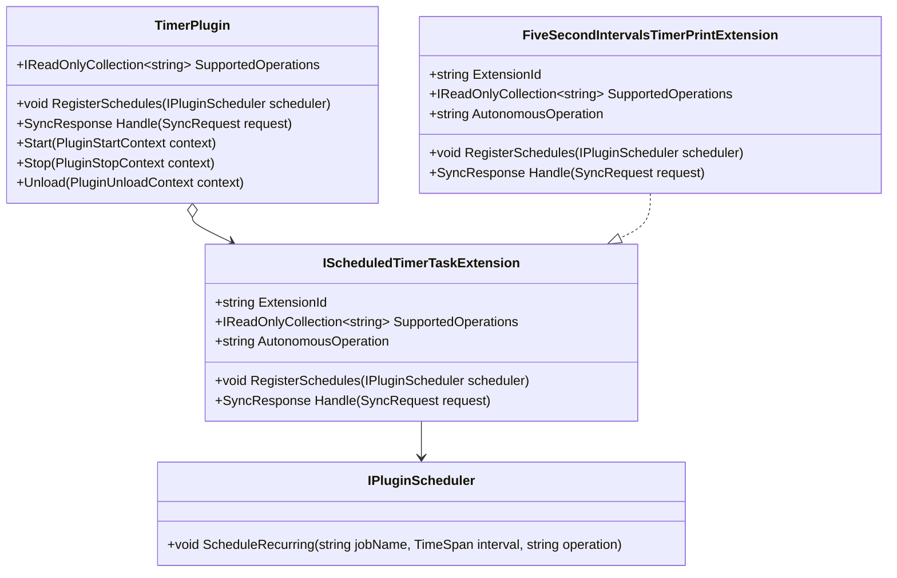

# Requirements: Modus.TimerPlugin Extensible Scheduled Tasks

> Scope: Refactor the timer plugin so scheduled behavior is extension-driven, where the existing five-second write-current-time behavior becomes a concrete extension named `5SecondIntervalsTimerPrint` and future custom scheduled tasks can be added without modifying core timer lifecycle orchestration.

---

## Functionality Worktree

### Coverage Matrix

| Capability | Required Outcome | Dependency Note | Status |
|---|---|---|---|
| Extension contract for scheduled tasks | Define an explicit contract for scheduled timer extensions (identity, operation mapping, schedule registration, execution hook) | [prerequisite for all extension-based behavior] | Implemented |
| Core timer orchestration extraction | Refactor `TimerPlugin` to orchestrate lifecycle, loop control, and dispatch through extension contract abstractions | [depends on extension contract] | In Progress |
| Backward-compatible operation exposure | Ensure extension operations are projected through `SupportedOperations` without duplicates and with deterministic ordering | [depends on extension contract and timer orchestration extraction] | Implemented |
| Named default extension | Implement `5SecondIntervalsTimerPrint` to preserve current behavior semantics and naming guarantees | [mandatory - preserve baseline timer behavior while refactoring] | Implemented |
| Scheduler registration via extensions | Move recurring schedule registration from hardcoded plugin path to extension-provided schedule definitions | [depends on named default extension and timer orchestration extraction] | Implemented |
| Extension dispatch path | Route `ISyncResponder.Handle` calls to the matching extension and keep current rejected-response behavior for unknown operations | [depends on operation exposure and extension contract] | Implemented |
| Runtime loop execution via extension operation | Keep autonomous loop behavior, but invoke default extension operation through the dispatch path instead of hardcoded operation constants | [depends on named default extension and extension dispatch path] | Implemented |
| Composition and validation tests | Add/adjust xUnit tests that verify default extension parity and extensibility for custom scheduled tasks | [depends on all items above] | Implemented |

### Class Diagram

### Completeness Checklist

- [x] Define `IScheduledTimerTaskExtension` (or equivalent) with explicit members for operation catalog, schedule registration, and operation handling [prerequisite for many others]
- [x] Refactor `TimerPlugin` constructors to accept one or more scheduled-task extensions while preserving a default parameterless path [depends on IScheduledTimerTaskExtension contract]
- [x] Replace hardcoded `Timer.WriteCurrentTime` constants in plugin orchestration with extension-driven operation discovery and routing [depends on constructor refactor and extension contract]
- [x] Implement concrete extension `5SecondIntervalsTimerPrint` that encapsulates current timestamp write behavior and five-second cadence [mandatory - preserve existing behavior as explicit extension]
- [x] Ensure `TimerPlugin.SupportedOperations` aggregates extension operations using ordinal de-duplication with deterministic ordering [depends on extension-driven operation discovery]
- [x] Ensure `TimerPlugin.RegisterSchedules` delegates all scheduler registrations to loaded extensions and preserves deterministic job naming [depends on concrete extension implementation]
- [x] Ensure `TimerPlugin.Handle` dispatches to the owning extension for known operations and preserves current rejected response for unknown operations [depends on extension-driven routing]
- [x] Ensure autonomous loop path invokes the default extension operation through the same dispatch path used by external requests [depends on concrete extension and dispatch behavior]
- [x] Add/adjust xUnit tests in `Modus.Core.Tests` proving baseline parity and custom extension extensibility for schedule and operation execution [depends on all implementation items above]

### Checkbox Transition Evidence

| Requirement Item (exact text) | Previous State | Current State | Transition Recorded At | Concrete Evidence Anchors |
|---|---|---|---|---|
| Add/adjust xUnit tests in `Modus.Core.Tests` proving baseline parity and custom extension extensibility for schedule and operation execution [depends on all implementation items above] | [ ] | [x] | 2026-05-17 | tests/Modus.Core.Tests/Plugins/TimerPluginLifecycleTests.cs (`TimerPlugin_GivenDefaultAndExplicitDefaultExtensionComposition_ExpectedScheduleAndOperationExecutionParity`), tests/Modus.Core.Tests/Plugins/TimerPluginLifecycleTests.cs (`TimerPlugin_GivenCustomScheduledTaskExtension_ExpectedSchedulesAndHandlesCustomOperationWithoutPluginCodeChanges`), dotnet build src/Modus.Core/Modus.Core.csproj, dotnet build tests/Modus.Core.Tests/Modus.Core.Tests.csproj, dotnet test tests/Modus.Core.Tests/Modus.Core.Tests.csproj --no-build |
| Ensure autonomous loop path invokes the default extension operation through the same dispatch path used by external requests [depends on concrete extension and dispatch behavior] | [ ] | [x] | 2026-05-17T12:15:00-03:00 | src/Modus.Core/Plugins/TimerPlugin.cs (autonomous operation resolution from default extension), src/Modus.Core/Plugins/TimerPlugin.cs (autonomous loop dispatch through Handle), tests/Modus.Core.Tests/Plugins/TimerPluginLifecycleTests.cs (autonomous default-extension dispatch assertion) |
| Ensure `TimerPlugin.Handle` dispatches to the owning extension for known operations and preserves current rejected response for unknown operations [depends on extension-driven routing] | [ ] | [x] | 2026-05-17T11:39:15.5922643-03:00 | src/Modus.Core/Plugins/TimerPlugin.cs:126 (dispatch entry), src/Modus.Core/Plugins/TimerPlugin.cs:130 (owner lookup), src/Modus.Core/Plugins/TimerPlugin.cs:134 (unsupported-operation payload), src/Modus.Core/Plugins/TimerPlugin.cs:135 (Rejected status), tests/Modus.Core.Tests/Plugins/TimerPluginLifecycleTests.cs:333 (owning extension routing test), tests/Modus.Core.Tests/Plugins/TimerPluginLifecycleTests.cs:348 (unknown operation rejected response test) |

Verification note: This row is the in-workspace transition ledger for verifier use when git history is unavailable.

---

## Test Plan

### `IScheduledTimerTaskExtension` contract

1. `IScheduledTimerTaskExtension_GivenContractDefinition_ExpectedDeclaresOperationsSchedulesAndHandlerMembers`
   *Assumption*: Extensibility requires a single explicit contract that owns operation declaration, schedule registration, and request handling.

2. `IScheduledTimerTaskExtension_GivenAutonomousOperationMember_ExpectedIdentifiesLoopInvokedOperation`
   *Assumption*: The autonomous loop needs a deterministic extension-owned operation identifier to avoid hardcoded plugin constants.

### `TimerPlugin` constructor and composition

1. `TimerPlugin_GivenParameterlessConstruction_ExpectedLoadsFiveSecondIntervalsTimerPrintByDefault`
   *Assumption*: Existing consumers rely on parameterless construction preserving current timer behavior.

2. `TimerPlugin_GivenCustomExtensions_ExpectedUsesProvidedExtensionsWithoutDroppingDefaultsUnexpectedly`
   *Assumption*: Refactor should allow explicit custom extension composition without accidental loss of intended runtime behavior.

3. `TimerPlugin_GivenNullExtensionCollection_ExpectedThrowsArgumentNullException`
   *Assumption*: Constructor guard clauses should continue to reject invalid composition inputs.

### Operation catalog aggregation

1. `TimerPlugin_GivenMultipleExtensionsWithUniqueOperations_ExpectedSupportedOperationsContainsAllInDeterministicOrder`
   *Assumption*: Operation exposure must be predictable for contract validation and host dispatch.

2. `TimerPlugin_GivenDuplicateOperationsAcrossExtensions_ExpectedSupportedOperationsDeDuplicatesUsingOrdinalComparer`
   *Assumption*: Duplicate operation names must be normalized deterministically to avoid ambiguous ownership.

### `5SecondIntervalsTimerPrint` default extension behavior

1. `FiveSecondIntervalsTimerPrint_GivenHandleWriteCurrentTime_ExpectedWritesInvariantIsoTimestampAndReturnsSuccess`
   *Assumption*: The extracted extension must preserve the current timestamp output and success response semantics.

2. `FiveSecondIntervalsTimerPrint_GivenUnsupportedOperation_ExpectedReturnsRejectedUnsupportedOperationPayload`
   *Assumption*: Unknown operation behavior should remain a deterministic rejected response.

3. `FiveSecondIntervalsTimerPrint_GivenRegisterSchedules_ExpectedRegistersRecurringJobEveryFiveSeconds`
   *Assumption*: Baseline cadence remains a recurring five-second schedule after extraction.

### Scheduler delegation through `TimerPlugin`

1. `TimerPlugin_GivenRegisterSchedules_ExpectedDelegatesToAllExtensionsExactlyOnce`
   *Assumption*: Plugin-level scheduling should be pure orchestration and not duplicate extension registrations.

2. `TimerPlugin_GivenNoExtensions_ExpectedRegisterSchedulesPerformsNoSchedulerCalls`
   *Assumption*: Empty extension composition should be safe and side-effect free.

### Dispatch routing through `TimerPlugin.Handle`

1. `TimerPlugin_GivenKnownOperation_ExpectedDispatchesToOwningExtensionAndReturnsExtensionResponse`
   *Assumption*: Operation ownership must be extension-driven for future custom task growth.

2. `TimerPlugin_GivenUnknownOperation_ExpectedReturnsRejectedUnsupportedOperationResponse`
   *Assumption*: Unknown operation responses must remain backward compatible with existing rejected semantics.

3. `TimerPlugin_GivenNullRequest_ExpectedThrowsArgumentNullException`
   *Assumption*: Existing guard behavior on request handling should remain unchanged.

### Autonomous loop parity

1. `TimerPlugin_GivenStartThenElapsedInterval_ExpectedInvokesDefaultExtensionOperationViaDispatchPath`
   *Assumption*: Autonomous execution should use the same dispatch path as host-triggered requests to keep behavior unified.

2. `TimerPlugin_GivenStopOrUnload_ExpectedCancelsLoopAndPreventsFurtherExtensionInvocations`
   *Assumption*: Lifecycle stop/unload must retain deterministic cancellation and prevent post-stop execution.

### Custom extension extensibility

1. `TimerPlugin_GivenCustomScheduledTaskExtension_ExpectedSchedulesAndHandlesCustomOperationWithoutPluginCodeChanges`
   *Assumption*: The refactor is successful only if new scheduled-task behavior can be added through extension implementation alone.

2. `TimerPlugin_GivenMultipleCustomExtensions_ExpectedEachExtensionRemainsIsolatedByOperationOwnership`
   *Assumption*: Extension boundaries should prevent one extension from intercepting another extension's operations.

3. `TimerPlugin_GivenContractValidationFlow_ExpectedRefactoredPluginStillPassesMandatoryPluginCapabilities`
   *Assumption*: Extensibility changes must remain compliant with existing plugin contract validation gates.

---

*All assumptions verified by Falsify Claims. Zero Falsified rows.*
