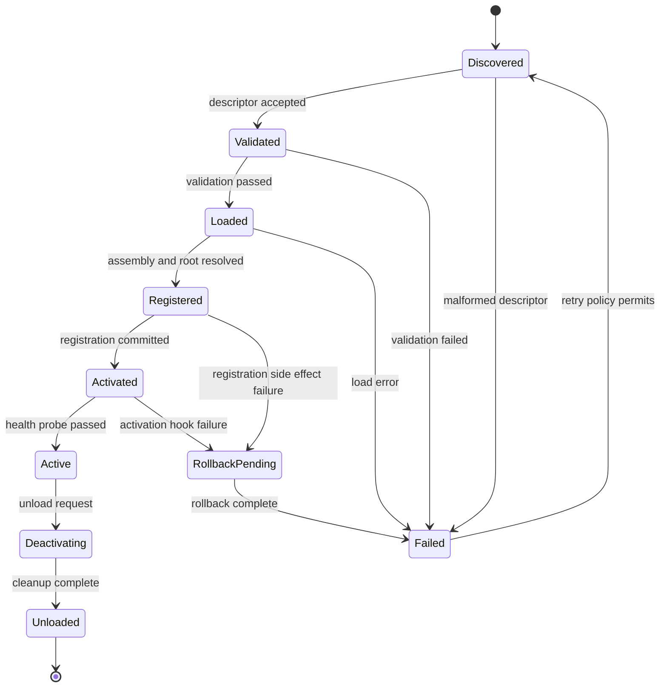
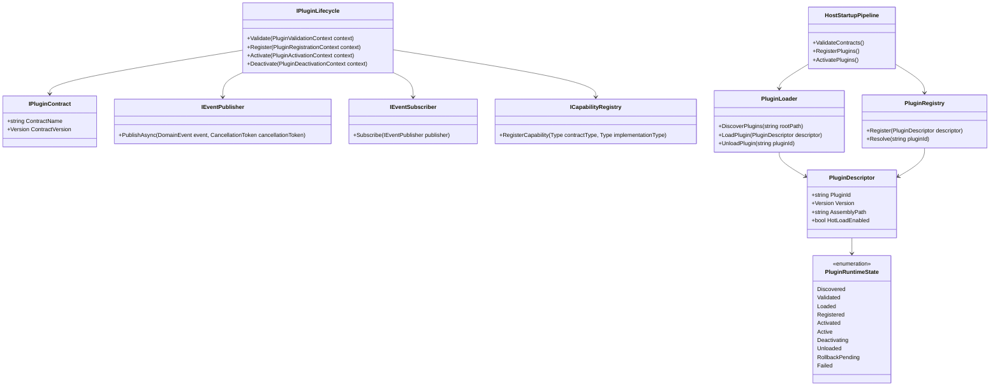

# Requirements: Plugin Monolith Framework Baseline

> Baseline requirements for a plugin-monolith framework using class-library plugins, deterministic runtime discovery and hot loading, and event-driven-first integration with synchronous fallback using only .NET standard library capabilities.

---

## Functionality Worktree

### Coverage Matrix

| Capability Area | Required Outcome | Constraint |
|---|---|---|
| Plugin Packaging | Plugins are delivered as C# class libraries | No third-party runtime/plugin packages |
| Discovery and Loading | Host discovers plugins at runtime and supports hot loading | Deterministic and validated startup/load pipeline |
| Communication Pattern | Event-driven abstractions are primary integration mechanism | Synchronous calls allowed only as explicit fallback |
| Architectural Safety | Module boundaries remain explicit and enforced | No cross-module host-internal coupling |
| Quality Gate | Contracts and activation flows are test-covered | xUnit contract and integration tests |

### Hot-Loading Lifecycle Phases

| Phase | Entry Condition | Main Actions | Exit Condition | Failure Transition |
|---|---|---|---|---|
| Discovered | Plugin artifact appears in watched path | Compute descriptor hash, read manifest metadata | Descriptor accepted for validation queue | Failed |
| Validated | Descriptor is queued for validation | Contract version checks, dependency checks, policy checks | Validation result is successful | Failed |
| Loaded | Validation succeeded | Load assembly context, resolve entry types, instantiate plugin root | Plugin instance is ready for registration | Failed |
| Registered | Plugin instance created | Register capabilities and event subscriptions | Registry commit succeeds | RollbackPending |
| Activated | Registration committed | Run activation hook, begin event handling | Health probe passes and plugin marked Active | RollbackPending |
| Active | Plugin activation completed | Process events and optional fallback sync requests | Deactivation requested or host shutdown begins | Deactivating |
| Deactivating | Host requests stop/unload | Stop intake, drain in-flight events, invoke deactivation hook | Runtime handles and subscriptions released | Unloaded |
| Unloaded | Deactivation completed | Remove descriptor/runtime handles from active registry | Plugin fully absent from active set | — |
| RollbackPending | Registration or activation failed after partial side effects | Reverse registrations, remove subscriptions, dispose plugin instance | Cleanup completes deterministically | Failed |
| Failed | Any phase raises non-recoverable error | Emit diagnostics, isolate plugin, preserve host continuity | Host continues with remaining plugins | Discovered |

### Lifecycle State Transitions

### Class Diagram

### Completeness Checklist

- [x] Define Core plugin contract interfaces [mandatory - architecture]
- [x] Define event-driven plugin communication abstractions (publisher/subscriber contracts and event envelope) [mandatory - architecture]
- [x] Define explicit synchronous request/response contracts for exceptional fallback paths [mandatory - architecture]
- [x] Implement Host plugin discovery and validation pipeline [mandatory - runtime]
- [x] Implement runtime class-library plugin loading with deterministic assembly scan and metadata extraction [mandatory - runtime]
- [x] Define canonical plugin runtime states and allowed transitions (including failure and rollback states) [mandatory - runtime]
- [x] Implement phase-driven hot-loading and unloading lifecycle orchestration for plugins [mandatory - runtime]
- [x] Implement deterministic rollback semantics for partial registration/activation side effects [mandatory - runtime]
- [x] Define deterministic plugin registration lifecycle [mandatory - runtime]
- [x] Implement plugin fault isolation and host continuity safeguards during load/activation [mandatory - runtime]
- [x] Define retry and quarantine policy for failed plugins to prevent retry storms [mandatory - runtime]
- [x] Add module boundary enforcement checks [mandatory - architecture]
- [x] Add guardrails preventing third-party library dependency introduction in plugin/host runtime path [mandatory - architecture]
- [x] Add xUnit contract tests for plugin interfaces [mandatory - testing]
- [x] Add integration tests for startup and plugin activation [mandatory - testing]
- [x] Add integration tests for hot-loading, unloading, and event propagation behavior [mandatory - testing]

### Ownership And File Targets

| Checklist Item | Primary Ownership | Secondary Ownership | Suggested File-Level Targets |
|---|---|---|---|
| Define Core plugin contract interfaces | Core | Plugin | src/Modus.Core/Plugins/IPluginContract.cs; src/Modus.Core/Plugins/IPluginLifecycle.cs |
| Define event-driven plugin communication abstractions | Core | Host | src/Modus.Core/Events/IEventPublisher.cs; src/Modus.Core/Events/IEventSubscriber.cs; src/Modus.Core/Events/DomainEventEnvelope.cs |
| Define explicit synchronous request/response contracts for exceptional fallback paths | Core | Modules | src/Modus.Core/Messaging/ISyncRequest.cs; src/Modus.Core/Messaging/ISyncResponder.cs |
| Implement Host plugin discovery and validation pipeline | Host | Core | src/Modus.Host/Plugins/PluginDiscoveryService.cs; src/Modus.Host/Plugins/PluginValidationService.cs |
| Implement runtime class-library plugin loading with deterministic assembly scan and metadata extraction | Host | Plugin | src/Modus.Host/Plugins/PluginLoader.cs; src/Modus.Host/Plugins/PluginDescriptorFactory.cs |
| Define canonical plugin runtime states and allowed transitions (including failure and rollback states) | Core | Host | src/Modus.Core/Plugins/PluginRuntimeState.cs; src/Modus.Host/Plugins/PluginStateMachine.cs |
| Implement phase-driven hot-loading and unloading lifecycle orchestration for plugins | Host | Plugin | src/Modus.Host/Plugins/PluginLifecycleOrchestrator.cs; src/Modus.Host/Plugins/PluginUnloadCoordinator.cs |
| Implement deterministic rollback semantics for partial registration/activation side effects | Host | Core | src/Modus.Host/Plugins/PluginRollbackCoordinator.cs; src/Modus.Host/Plugins/RegistrationTransactionLog.cs |
| Define deterministic plugin registration lifecycle | Core | Host | src/Modus.Core/Plugins/IPluginRegistrationPolicy.cs; src/Modus.Host/Plugins/PluginRegistrationPipeline.cs |
| Implement plugin fault isolation and host continuity safeguards during load/activation | Host | Plugin | src/Modus.Host/Plugins/PluginIsolationBoundary.cs; src/Modus.Host/Diagnostics/PluginFailureReporter.cs |
| Define retry and quarantine policy for failed plugins to prevent retry storms | Host | Core | src/Modus.Host/Plugins/PluginRetryPolicy.cs; src/Modus.Host/Plugins/PluginQuarantineStore.cs |
| Add module boundary enforcement checks | Core | Tests | tests/Modus.Architecture.Tests/ModuleBoundaryRulesTests.cs |
| Add guardrails preventing third-party library dependency introduction in plugin/host runtime path | Core | Tests | tests/Modus.Architecture.Tests/DependencyPolicyTests.cs |
| Add xUnit contract tests for plugin interfaces | Tests | Core | tests/Modus.Core.Tests/Plugins/PluginContractsTests.cs |
| Add integration tests for startup and plugin activation | Tests | Host | tests/Modus.Host.IntegrationTests/StartupAndActivationTests.cs |
| Add integration tests for hot-loading, unloading, and event propagation behavior | Tests | Host | tests/Modus.Host.IntegrationTests/HotLoadAndEventFlowTests.cs |

### Implementation Mapping Status (Current Iteration)

| Member | Status |
|---|---|
| `IPluginContract` (`PluginId`, `ContractName`, `ContractVersion`) | Implemented |
| `IPluginLifecycle` (`Load`, `Start`, `Stop`, `Unload`) | Implemented |
| `IPluginRegistrationPolicy` (`BuildRegistrationPlan(IPluginContract)`) and `DeterministicPluginRegistrationPolicy` canonical ordering (`operations` -> `events` -> `schedules`) | Implemented |
| `PluginContractValidator.Validate(object candidate, PluginContractValidationPolicy policy)` core contract metadata checks | Implemented |
| `IEventPublisher` (`Publish(DomainEvent)`, `Publish(DomainEventEnvelope)`) | Implemented |
| `IEventSubscriber` (`Subscribe(IEventPublisher)`, `OnEvent(DomainEventEnvelope)`) | Implemented |
| `DomainEventEnvelope` (`Event`, `SourcePluginId`, `OccurredAtUtc`, `EventId`, `CorrelationId`, `Headers`) | Implemented |
| `SyncRequest` (`Operation`, `IsFallbackExplicit`, `FallbackReason`, `FallbackReasonCode`, `CorrelationId`, factory methods) | Implemented |
| `SyncResponse` (`Success`, `Payload`, `Status`, `ServedFromFallback`, `CorrelationId`) | Implemented |
| `PluginDiscoveryService.Discover(IEnumerable<PluginDescriptor>)` deterministic ordinal discovery ordering | Implemented |
| `PluginValidationService.Validate(PluginDescriptor)` deterministic contract and assembly validation outcomes | Implemented |
| `PluginLoader.ScanRuntimeAssemblies(string pluginsPath)` deterministic assembly scan with stable diagnostics and duplicate plugin-id handling | Implemented |
| `PluginAssemblyDescriptorFactory.CreateFromAssembly(string assemblyPath)` runtime metadata extraction from class-library assemblies | Implemented |
| `PluginRuntimeState` canonical lifecycle states (`Discovered` through `Failed`, including `RollbackPending`) | Implemented |
| `PluginRuntimeStateTransitions` (`GetAllowedNextStates`, `IsAllowedTransition`) deterministic allowed transitions including rollback/failure/retry paths | Implemented |
| `PluginLifecycleOrchestrator.OrchestrateHotLoad(PluginSpec, bool)` deterministic phase-driven hot-load progression with quarantine/failure outcomes | Implemented |
| `PluginUnloadCoordinator.OrchestrateHotUnload(string, bool, bool)` deterministic deactivation and unload sequencing | Implemented |
| `RegistrationTransactionLog` deterministic reverse-order rollback of registration/activation side effects | Implemented |
| `PluginRollbackCoordinator.Rollback(string, RegistrationTransactionLog, List<string>)` deterministic rollback diagnostics and execution | Implemented |
| `InMemoryHostRuntime.Start(IEnumerable<PluginDescriptor>)` transactional registration/activation rollback on activation and operation failures | Implemented |
| `PluginIsolationBoundary.IsolateFailure(...)` and `PluginIsolationBoundary.IsolateOperationFailure(...)` deterministic fault containment and host continuity signaling | Implemented |
| `PluginFailureReporter` (`StageFailure`, `OperationFailure`, `Isolation`, `ContinuityPreserved`) deterministic load/activation fault diagnostics | Implemented |
| `PluginRetryPolicy` (`QuarantineThreshold`, `ShouldQuarantine(int)`) deterministic quarantine threshold policy for repeated failures | Implemented |
| `PluginQuarantineStore` (`RegisterFailure`, `RegisterSuccess`, `IsQuarantined`, `GetConsecutiveFailureCount`) consecutive failure tracking and quarantine state management | Implemented |
| `ModuleBoundaryPolicy.Validate(ModuleDependencyGraph)` concrete cross-module dependency enforcement using module-root analysis | Implemented |
| `RuntimeDependencyPolicy.Validate(RuntimeReferenceSet)` strict runtime allowlist guardrail preventing third-party dependency introduction in plugin/host runtime path | Implemented |
| `PluginContractsTests` contract coverage for plugin interfaces (`IPluginContract`, `IPluginLifecycle`, `IEventSubscriber`, `ISyncResponder`, `IPluginOperationCatalog`, `IPluginRegistrationPolicy`) | Implemented |
| `StartupAndActivationTests` startup host initialization and runtime assembly activation integration coverage | Implemented |
| `HotLoadAndEventFlowTests` hot-load, hot-unload, and contract-based event propagation integration coverage | Implemented |

### Dependency-Ordered Delivery Slices

| Slice | Goal | Included Checklist Items | Exit Criteria |
|---|---|---|---|
| 1 | Establish contracts baseline | Core plugin contracts; event abstractions; sync fallback contracts; registration lifecycle contract | Core contracts compile and are consumed by a minimal sample plugin without host internals |
| 2 | Build deterministic discovery and validation | Host discovery pipeline; deterministic assembly scan; metadata extraction | Fixed plugin directory produces repeatable descriptor ordering and deterministic validation results |
| 3 | Implement runtime state machine | Canonical states/transitions; phase-driven orchestration; rollback semantics | Plugin execution follows only allowed transitions and rollback path is deterministic under induced failures |
| 4 | Harden reliability controls | Fault isolation; retry and quarantine policy | Faulty plugin failures are isolated and host continues with healthy plugin set without retry storms |
| 5 | Enforce architecture boundaries | Module boundary checks; third-party dependency guardrails | Boundary/dependency policy tests fail on prohibited references and pass on compliant structure |
| 6 | Validate end-to-end behaviors | Contract tests; startup/activation integration tests; hot-load/unload/event-flow integration tests | Full test suite verifies contract conformance and runtime lifecycle behavior under nominal and failure scenarios |

### Slice Acceptance Tests

| Slice | Mandatory Test Plan Coverage |
|---|---|
| 1 | Plugin Contracts section (all tests) |
| 2 | Discovery And Loading section (all tests) |
| 3 | Hot Loading Lifecycle section (tests 1-4) |
| 4 | Hot Loading Lifecycle section (test 5) and Registration Lifecycle section (test 3) |
| 5 | Boundary Enforcement section (all tests) |
| 6 | Registration Lifecycle section (tests 1-2) and Integration Flows section (all tests) |

---

## Test Plan

### Plugin Contracts

1. `PluginContract_GivenValidClassLibraryPlugin_ExpectedMandatoryCapabilitiesExposed`
   *Assumption*: A compliant class-library plugin exposes all mandatory capabilities and metadata defined by the contract.

2. `PluginContract_GivenVersionMismatch_ExpectedValidationFailureBeforeRegistration`
   *Assumption*: Contract version incompatibility is detected before plugin registration or activation.

3. `EventContract_GivenPublishedDomainEvent_ExpectedSubscribedHandlersInvoked`
   *Assumption*: Event-driven contracts allow subscribers to receive and process published domain events.

4. `SyncFallbackContract_GivenExplicitFallbackRequest_ExpectedSynchronousResponseReturned`
   *Assumption*: Synchronous calls are available only through explicit fallback contracts and return deterministic responses.

### Discovery And Loading

1. `Discovery_GivenPluginFolder_ExpectedDeterministicDescriptorSetProduced`
   *Assumption*: Runtime discovery over a fixed plugin folder yields the same ordered descriptor set across runs.

2. `Loader_GivenInvalidPluginAssembly_ExpectedValidationErrorAndNoActivation`
   *Assumption*: Invalid or non-compliant plugin assemblies are rejected and never activated.

3. `Loader_GivenValidPluginAssembly_ExpectedRuntimeLoadWithoutThirdPartyDependency`
   *Assumption*: Host can load a valid class-library plugin using .NET standard library mechanisms only.

### Hot Loading Lifecycle

1. `LifecycleStateMachine_GivenValidPlugin_ExpectedOrderedStateProgressionToActive`
   *Assumption*: A valid plugin transitions in deterministic order through Discovered, Validated, Loaded, Registered, Activated, and Active states.

2. `LifecycleStateMachine_GivenValidationFailure_ExpectedTransitionToFailedWithoutHostTermination`
   *Assumption*: Validation failure transitions plugin to Failed and keeps host process alive.

3. `Rollback_GivenActivationFailureAfterRegistration_ExpectedStateTransitionToRollbackPendingThenFailed`
   *Assumption*: Activation failures after partial registration trigger deterministic rollback before entering Failed.

4. `HotUnload_GivenPluginDeactivationRequest_ExpectedTransitionFromActiveToDeactivatingToUnloaded`
   *Assumption*: Unload requests move Active plugins through Deactivating and then Unloaded states with deterministic cleanup.

5. `RetryPolicy_GivenRepeatedPluginFailures_ExpectedPluginQuarantinedAfterConfiguredThreshold`
   *Assumption*: Repeated failures trigger quarantine policy to avoid uncontrolled retry loops.

### Registration Lifecycle

1. `Registration_GivenValidPlugins_ExpectedDeterministicActivationOrder`
   *Assumption*: Activation ordering is deterministic for the same plugin set and configuration.

2. `Registration_GivenCapabilityConflicts_ExpectedDeterministicResolutionPolicyApplied`
   *Assumption*: Conflicting capability registrations are resolved by a stable, predefined host policy.

3. `Registration_GivenFaultyPlugin_ExpectedIsolationAndHostContinuity`
   *Assumption*: A plugin registration or activation failure does not crash the host process.

### Boundary Enforcement

1. `BoundaryRules_GivenCrossModuleConcreteDependency_ExpectedEnforcementFailure`
   *Assumption*: Module boundary checks fail when a module depends on another module's internal concrete types.

2. `DependencyRules_GivenThirdPartyRuntimeReferenceInPluginPath_ExpectedBuildOrValidationFailure`
   *Assumption*: Runtime plugin/host path disallows non-standard third-party dependencies by policy.

### Integration Flows

1. `Startup_GivenValidPluginSet_ExpectedHostStartsAndAllPluginsActivated`
   *Assumption*: Host startup with compliant plugins completes and activates all valid plugins.

2. `EventFlow_GivenPublishedEvent_ExpectedCrossModuleHandlerExecutionThroughContracts`
   *Assumption*: Cross-module behavior is coordinated through event contracts rather than direct concrete coupling.

3. `HotLoadIntegration_GivenRuntimePluginAddAndRemove_ExpectedStableHostState`
   *Assumption*: Repeated plugin add/remove operations preserve host stability and consistent registry state.

---

*All assumptions verified by Falsify Claims. Zero Falsified rows.*
