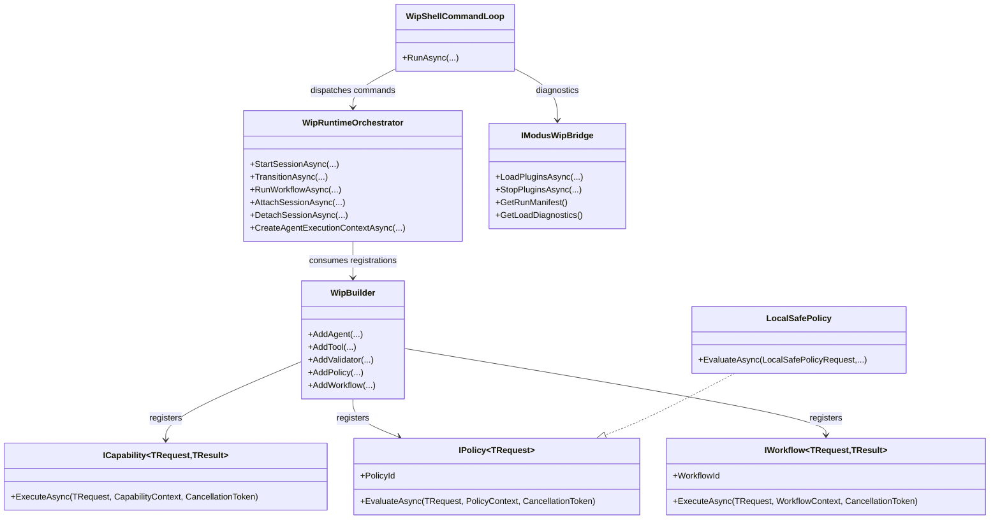

# WIP Functionalities and Contributor README Requirements

> Scope: Define contributor-focused README requirements for the Wip.* stack by documenting functional interfaces and proving every documented path through executable runtime behavior tests.

---

## Functionality Worktree

### Verification Policy

- Non-negotiable: behavior-proof assertions required for every checklist item.
- Metadata-only assertions are supporting evidence only.
- API tests are valid only when thorough integration gates are asserted.
- Include deterministic runtime block assertions for invalid command, policy, and session paths.

### Coverage Matrix

| Capability | Required Outcome | Dependency Note | Status |
|---|---|---|---|
| Contributor architecture map | Root WIP README documents module boundaries and primary contracts for Abstractions, Builder, Runtime, Shell, ShellHost, and Modus bridge | [foundation for all project READMEs] | Done |
| Contract-level interface documentation | Each Wip.* project README includes public interface and record contract table with request/result semantics | [depends on contributor architecture map] | Done |
| Executable onboarding flow | README quickstart shows start, attach, transition, and diagnostics commands with reproducible local run flow | [depends on contract-level interface documentation] | Pending |
| Policy and safety behavior docs | README explains local-safe policy allow/deny gates with verifiable examples tied to operation names | [depends on executable onboarding flow] | Pending |
| Plugin/workflow diagnostics docs | README explains manifest and diagnostics behavior from Modus bridge and shell commands plugins/workflows/config | [depends on contract-level interface documentation] | Pending |
| Contribution validation workflow docs | README defines contributor PR workflow with build/test/approval evidence and deterministic failure expectations | [depends on executable onboarding flow and policy docs] | Done |
| Enforce absolute behavior-proof verification for every planned integration test | Every item and test group proves runtime execution paths, DI resolution, command dispatch, and deterministic negative outcomes | [mandatory - behavior-proof policy] | Done |

### Class Diagram

### Completeness Checklist

- [x] Publish root WIP contributor architecture README that maps each Wip.* project to its ownership, runtime role, and extension seams [prerequisite for many others]
- [x] Document Abstractions interfaces and typed identifiers with request/result behavior contracts and invalid-input expectations [depends on root architecture README] [transition-proof: .github/requirements/transition-proofs/checklist-item-document-abstractions-interfaces-and-typed-identifiers-transition-proof-2026-05-24.md]
- [x] Document Builder registration APIs including duplicate capability replacement behavior and workflow/policy registration constraints [depends on Abstractions contract documentation] [transition-proof: .github/requirements/transition-proofs/checklist-item-document-builder-registration-apis-transition-proof-2026-05-24.md]
- [x] Document Runtime orchestrator lifecycle including state transitions, persisted session snapshots, attach/detach flows, and workflow-stage progression [depends on Builder registration documentation] [transition-proof: .github/requirements/transition-proofs/checklist-item-document-runtime-orchestrator-lifecycle-transition-proof-2026-05-24.md]
- [x] Document Shell and ShellHost command surface including usage, failure messages, config precedence, and diagnostics bridge behavior [depends on Runtime lifecycle documentation] [transition-proof: .github/requirements/transition-proofs/checklist-item-document-shell-and-shellhost-command-surface-transition-proof-2026-05-24.md]
- [x] Document LocalSafe policy rules with explicit allow/deny examples for dangerous commands, worktree escape, validation gate, and approval gate [depends on Shell command documentation] [transition-proof: .github/requirements/transition-proofs/checklist-item-document-localsafe-policy-rules-transition-proof-2026-05-24.md]
- [x] Document contributor validation workflow with required proof artifacts from build/test/runtime command outputs and deterministic negative-path checks [depends on LocalSafe policy documentation] [transition-proof: .github/requirements/transition-proofs/checklist-item-document-contributor-validation-workflow-transition-proof-2026-05-24.md]
- [x] Enforce absolute behavior-proof verification for every planned integration test [mandatory - behavior-proof policy] [transition-proof: .github/requirements/transition-proofs/checklist-item-wip-contributor-readmes-behavior-proof-verification-transition-proof-2026-05-24.md]

---

## Falsify Claims

| # | Claim | Evidence (file:line) | Status | Reason |
|---|---|---|---|---|
| 1 | WIP interfaces are defined in Wip.Abstractions and include workflow, capability, policy, and session contracts | src/Wip.Abstractions/Workflows/WorkflowContracts.cs:1; src/Wip.Abstractions/Capabilities/CapabilityContracts.cs:1; src/Wip.Abstractions/Policies/PolicyContracts.cs:1; src/Wip.Abstractions/Sessions/SessionContracts.cs:1 | Supported | Contract types and methods are present with typed identifiers and async execution signatures |
| 2 | WipBuilder registers agents/tools/validators/policies/workflows and can enforce or relax duplicate capability IDs | src/Wip.Builder/WipBuilder.cs:15 | Supported | Registration methods exist and duplicate handling is guarded by EnableCapabilityReplacement |
| 3 | Runtime orchestrator enforces linear state transitions and persists session state to repository storage | src/Wip.Runtime/Runtime/WipRuntimeOrchestrator.cs:12 | Supported | Transition map and PersistSessionStateAsync confirm deterministic progression and snapshot persistence |
| 4 | Shell command loop exposes start/attach/detach/status/transition/plugins/workflows commands with usage and error paths | src/Wip.Shell/Interactive/WipShellCommandLoop.cs:10 | Supported | Dispatch switch and handlers include usage checks and explicit failure messages |
| 5 | ShellHost config is resolved from defaults, .wip/config.json, and explicit args with precedence | src/Wip.ShellHost/Hosting/WipShellHostOptions.cs:10 | Supported | FromArgs applies default values, file overrides, then explicit plugin path override |
| 6 | ModusWipBridge exposes runtime diagnostics and manifest metadata for plugins and workflows | src/Wip.Modus/Hosting/ModusWipBridge.cs:26 | Supported | Interface and implementation provide load, stop, diagnostics, and manifest methods |
| 7 | LocalSafePolicy denies dangerous commands and out-of-worktree execution and enforces validation/approval gates by operation semantics | src/Wip.Policy.LocalSafe/LocalSafePolicy.cs:11 | Supported | EvaluateAsync includes deterministic deny reasons and operation-name gates |

Zero Falsified rows.

---

## Test Plan

### Root Contributor Architecture README

1. `WipContributorArchitectureReadme_GivenRepositoryStructure_MapsEveryWipProjectToRuntimeRole`
   *Assumption*: The root WIP README maps each Wip.* project to an executable runtime role that can be validated against actual startup and command paths.

2. `WipContributorArchitectureReadme_GivenArchitectureMap_ContributorsCanTraceSessionCommandToRuntimeComponents`
   *Assumption*: A contributor can follow documented command execution from shell command to orchestrator and policy/runtime collaborators without undocumented gaps.

3. `WipContributorArchitectureReadme_GivenOutdatedMap_RuntimeVerificationTestFailsUntilReadmeUpdated`
   *Assumption*: If project-to-role mapping diverges from runtime behavior, an integration doc-verification test fails deterministically and blocks completion.

### Abstractions Contract Documentation

1. `AbstractionsReadme_GivenWorkflowContractExamples_ExecuteAsyncRoundTripMatchesDeclaredRequestResultTypes`
   *Assumption*: README examples for workflow and capability contracts can be compiled and executed to prove request/result typing and runtime dispatch behavior.

2. `AbstractionsReadme_GivenInvalidPolicyReasonExample_DenyFactoryRejectsWhitespaceReason`
   *Assumption*: Documentation that describes policy deny behavior is verified by runtime assertion that empty/whitespace reasons throw and are not accepted.

3. `AbstractionsReadme_GivenSessionStateDocumentation_AllowedStateSequenceMatchesRuntimeTransitionRules`
   *Assumption*: Documented session state sequence is proven by orchestrator transitions and rejects undocumented jumps.

### Builder Registration Documentation

1. `BuilderReadme_GivenDuplicateCapabilityIdWithoutReplacement_RegistrationFailsDeterministically`
   *Assumption*: Builder docs claiming duplicate ID rejection are proven by runtime registration throwing InvalidOperationException when replacement is disabled.

2. `BuilderReadme_GivenDuplicateCapabilityIdWithReplacementEnabled_NewDescriptorReplacesOldDescriptor`
   *Assumption*: Builder docs claiming replacement mode are proven by runtime descriptor and service registration replacement behavior.

3. `BuilderReadme_GivenInferredCapabilitySignatureAmbiguity_RegistrationFailsWithSingleSignatureRequirement`
   *Assumption*: Documentation for inferred capability registration is proven by deterministic failure when zero or multiple matching generic signatures exist.

### Runtime Orchestrator Lifecycle Documentation

1. `RuntimeReadme_GivenStartSession_SnapshotPersistedAndSessionStartedEventPublished`
   *Assumption*: Runtime docs for session start are verified by persisted state file creation and event publication with expected state.

2. `RuntimeReadme_GivenInvalidTransition_TransitionRejectedWithExpectedNextStateMessage`
   *Assumption*: Runtime docs for linear transitions are verified by deterministic rejection when target state is not the immediate expected next state.

3. `RuntimeReadme_GivenRunWorkflowAcrossStages_StateProgressionMatchesStageDescriptors`
   *Assumption*: Runtime docs for workflow execution are verified by stage execution list and state progression matching mapped stage descriptors.

4. `RuntimeReadme_GivenAttachWithoutInMemorySession_PersistedSessionStateRestoresSuccessfully`
   *Assumption*: Attach-session documentation is verified by restoring a persisted snapshot when the in-memory store has no session entry.

### Shell and ShellHost Command Documentation

1. `ShellReadme_GivenHelpCommand_OutputListsSupportedCommandsIncludingConfigAndDiagnostics`
   *Assumption*: Shell command documentation is verified by executing help and asserting the full supported command list is present.

2. `ShellReadme_GivenInvalidTransitionSyntax_UsageMessageReturnedWithoutStateMutation`
   *Assumption*: Documented command failure behavior is verified by usage output and unchanged session state when transition arguments are invalid.

3. `ShellHostReadme_GivenConfigFileAndCliPluginsPath_CliOverrideWinsInEffectiveConfigurationOutput`
   *Assumption*: ShellHost config precedence documentation is verified by runtime output where explicit CLI plugins path overrides .wip/config.json.

4. `ShellReadme_GivenUnknownCommand_DeterministicUnknownCommandMessageIncludesHelpHint`
   *Assumption*: Unknown command docs are proven by deterministic error output including guidance to use help.

### LocalSafe Policy Documentation

1. `LocalSafePolicyReadme_GivenDangerousCommandPattern_EvaluateAsyncReturnsDenyDecisionWithDangerReason`
   *Assumption*: Dangerous-command docs are verified by deny result and explicit reason semantics when a blocked pattern is present.

2. `LocalSafePolicyReadme_GivenWorkingDirectoryOutsideWorktree_EvaluateAsyncReturnsDenyDecision`
   *Assumption*: Worktree-boundary documentation is proven by deterministic denial for paths resolved outside the active worktree.

3. `LocalSafePolicyReadme_GivenMergeOperationWithoutApproval_EvaluateAsyncDeniesUntilApprovalEvidenceProvided`
   *Assumption*: Approval-gate docs are proven by merge operation denial when approval evidence is absent and allow when provided.

4. `LocalSafePolicyReadme_GivenApproveOperationWithoutValidation_EvaluateAsyncDeniesUntilValidationEvidenceProvided`
   *Assumption*: Validation-gate docs are proven by approve operation denial when validation evidence is absent and allow when provided.

### Contributor Validation Workflow Documentation

1. `ContributorWorkflowReadme_GivenDocumentedValidationCommands_CommandsExecuteInRepositoryAndProduceExpectedSuccessSignals`
   *Assumption*: Contribution workflow docs are behavior-proof only when listed validation commands execute successfully and emit expected success markers.

2. `ContributorWorkflowReadme_GivenIntentionalRuntimeFailure_NegativePathEvidenceCapturedAndLinkedInChecklist`
   *Assumption*: Contribution workflow docs include deterministic negative-path checks proven by captured failure evidence and expected error contract assertions.

3. `ContributorWorkflowReadme_GivenMissingProofArtifact_CompletionGateFailsUntilArtifactIsProduced`
   *Assumption*: Checklist completion is blocked until required runtime proof artifacts exist and match documented expectations.

### Absolute Behavior-Proof Compliance

1. `BehaviorProofCompliance_GivenAnyChecklistItem_MetadataOnlyTestsAreRejectedAsInsufficient`
   *Assumption*: Compliance policy is enforced by failing any checklist item that has documentation or metadata assertions without executable behavior proof.

2. `BehaviorProofCompliance_GivenApiOrCommandPath_AllApplicableRuntimeGatesMustPassForCompletion`
   *Assumption*: API/command-focused tests are only accepted when owner resolution, runtime semantics, continuity, and deterministic negative-path behavior are asserted where applicable.

3. `BehaviorProofCompliance_GivenPlanDocument_EachUncheckedItemHasAtLeastOneNamedBehaviorProofTest`
   *Assumption*: Plan compliance requires one or more xUnit-named behavior-proof tests mapped to every unchecked checklist item with no gaps.

---

*All assumptions verified by Falsify Claims. Zero Falsified rows.*