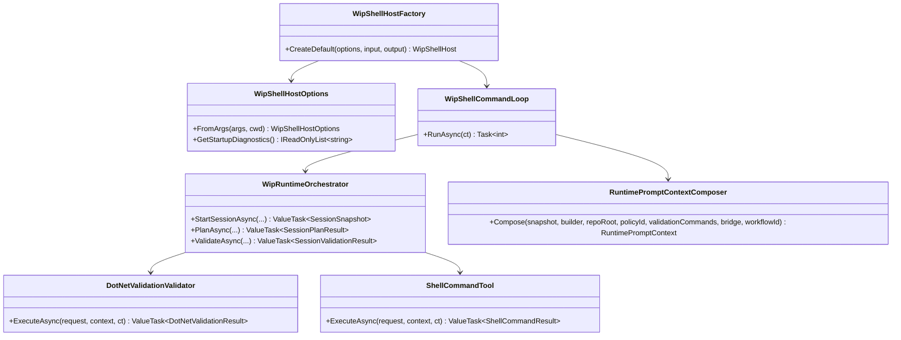

# Wip.* C#/.NET Development Flows Requirements and Test Plan

> Scope: define the behavior-proof requirements and xUnit implementation plan required for Wip.ShellHost and related Wip.* projects to fully support end-to-end C#/.NET development flows (workspace bootstrap, plan/run/validate lifecycle, build and test execution, diagnostics, and deterministic negative paths).

---

## Functionality Worktree

### Verification Policy

- Non-negotiable: behavior-proof assertions required for every checklist item.
- Metadata-only assertions are supporting evidence only.
- API tests are valid only when thorough integration gates are asserted.
- Include absolute schedule gates when scheduled jobs are in scope.

### Coverage Inputs

| Input | Value |
|---|---|
| CsProject | WIP.ShellHost and the other projects from WIP.* that will need to be enhanced |
| AnalysisSource | Direct analysis of current Wip.ShellHost, Wip.Shell, Wip.Runtime, Wip.Builder, Wip.Tools.Shell, Wip.Validation.DotNet, and current test surfaces for .NET workflow support gaps |
| MandatoryItems | none (workflow-injected mandatory behavior-proof item enforced) |
| PlanType | requirements |
| OutputPath | .github/requirements/Wip.DotNet-Development-Flows.md |

### Class Diagram

### Completeness Checklist

- [x] Add explicit .NET workspace bootstrap flow in shell-host startup that validates repository root, solution/project discovery, and deterministic failure diagnostics [foundation for all C#/.NET runtime flows]
- [x] Extend shell command surface with a first-class .NET developer flow command contract (restore/build/test/validate sequence with deterministic usage guidance) [depends on workspace bootstrap]
- [x] Add typed runtime request and result contracts for multi-project .NET validation orchestration (including project graph inputs and command timeout policy) [depends on command contract]
- [x] Integrate DotNetValidationValidator as the authoritative validate-stage runtime path for Wip.Shell sessions, including build plus test evidence persistence [depends on typed validation contracts]
- [x] Enforce deterministic SDK and executable resolution policy (dotnet path and required major version) before command dispatch, with negative-path rejection contracts [depends on command contract]
- [x] Persist end-to-end validation evidence artifacts that include command invocation sequence, correlation continuity, and report replayability across session transitions [depends on validate-stage integration]
- [x] Strengthen policy-driven isolation so blocked/failed .NET commands cannot mutate session approval or merge state and always emit deterministic rejection payloads [depends on validation integration and policy gate]
- [x] Add shell-host effective-config output coverage for .NET workflow settings (validation command catalog, provider diagnostics, repository/workspace roots) with deterministic startup diagnostics [depends on bootstrap and command contract]
- [x] Add executable E2E transcripts proving init -> session start -> plan -> run -> validate -> review -> approve -> merge for C#/.NET tasks across Wip.* [depends on all implementation items]
- [x] Enforce absolute behavior-proof verification for every planned integration test [mandatory - behavior-proof policy]

### Checklist to Runtime-Proof Matrix

| Checklist Item | Primary Runtime Proof Path | Minimum Evidence |
|---|---|---|
| .NET workspace bootstrap | Host startup path | Running host with valid and invalid repository layouts produces deterministic diagnostics and exit behavior |
| .NET command contract | Shell interactive command path | Shell accepts supported .NET flow commands, rejects malformed variants, and emits deterministic help or usage output |
| Typed validation contracts | Runtime validate request path | Multi-project validation request and result contracts are exercised by executable tests with typed payload assertions |
| Validate-stage integration | Session validation transition path | A real validate transition executes build and test commands and persists a report artifact with deterministic semantics |
| SDK and executable resolution | Pre-dispatch runtime guard path | Missing or unsupported dotnet executable produces deterministic rejection before any command side effect |
| Evidence persistence | Artifact persistence path | Validation artifacts serialize and deserialize with stable command sequence, correlation id, and success or failure semantics |
| Policy-driven isolation | Negative runtime path | Blocked or failed command attempts cannot advance approval or merge state and expose deterministic policy payloads |
| Effective-config diagnostics | Host config command path | Config output and startup diagnostics expose effective .NET flow settings and provider details consistently |
| E2E transcript coverage | Integrated shell-host runtime path | Transcript-backed tests verify full lifecycle progression and deterministic failure gates for .NET development scenarios |
| Behavior-proof compliance | Compliance gate path | Each checklist item maps to executable tests; metadata-only assertions are rejected as insufficient |

---

## Test Plan

### Workspace Bootstrap

1. `CreateDefault_GivenRepositoryWithSolutionFile_ExpectedBootstrapResolvesWorkspaceAndStartsShellHost`
   *Assumption*: A valid .NET repository layout is discovered at runtime and host startup succeeds with deterministic repository and workspace root semantics.

2. `CreateDefault_GivenMissingSolutionAndProjectFiles_ExpectedBootstrapFailsWithDeterministicDiagnostics`
   *Assumption*: Missing .NET entry artifacts are rejected at startup with deterministic diagnostics rather than deferred metadata warnings.

3. `FromArgs_GivenRelativeConfigPaths_ExpectedBootstrapNormalizesAbsolutePathsWithoutAmbiguity`
   *Assumption*: Runtime bootstrap normalizes relative .NET workflow paths into deterministic absolute values used by command execution.

### .NET Command Surface

1. `RunAsync_GivenRestoreBuildTestValidateCommands_ExpectedShellRoutesEachCommandToDeterministicRuntimeStage`
   *Assumption*: The shell command loop dispatches .NET flow commands through executable runtime paths with deterministic stage routing.

2. `RunAsync_GivenMalformedDotNetFlowCommand_ExpectedUsageGuidanceWithoutSessionMutation`
   *Assumption*: Invalid .NET flow syntax is rejected deterministically and cannot mutate active session state.

3. `Help_GivenDotNetFlowSurface_ExpectedCommandCatalogIncludesRuntimeSupportedCommandsOnly`
   *Assumption*: Help output reflects runtime-supported .NET flow commands exactly, preventing metadata-only drift between docs and executable behavior.

### Typed Validation Contracts

1. `DotNetValidationRequest_GivenMultiProjectInputs_ExpectedTypedContractCarriesAllRuntimeExecutionParameters`
   *Assumption*: Typed validation contracts preserve executable command inputs for runtime orchestration across build and test projects.

2. `DotNetValidationRequest_GivenInvalidTimeoutOrExecutable_ExpectedDeterministicGuardFailureBeforeExecution`
   *Assumption*: Invalid timeout or executable inputs are blocked by runtime guards prior to process execution.

3. `SessionValidationResult_GivenValidationCompletion_ExpectedTypedOutcomePreservesDiffAndArtifactSemantics`
   *Assumption*: Validation result contracts preserve deterministic session, diff, and artifact semantics needed for downstream runtime stages.

### Validate-Stage Runtime Integration

1. `ValidateAsync_GivenBuildAndTestPass_ExpectedSessionTransitionsToAwaitingApprovalWithPersistedValidationArtifact`
   *Assumption*: Successful validate runtime execution advances lifecycle state and persists deterministic build and test evidence.

2. `ValidateAsync_GivenBuildFails_ExpectedValidationStageReturnsFailedContractAndBlocksApproval`
   *Assumption*: Build failure is a deterministic runtime failure contract that prevents approval progression.

3. `ValidateAsync_GivenTestFailsAfterBuildPass_ExpectedFailureContractIncludesBuildAndTestCommandEvidence`
   *Assumption*: Partial success still preserves full command evidence so runtime failure semantics remain auditable and deterministic.

### SDK and Executable Resolution

1. `ExecuteAsync_GivenDotNetExecutableMissing_ExpectedDeterministicFailureWithoutCommandSideEffects`
   *Assumption*: Missing dotnet executable is rejected through deterministic runtime failure contracts before any external command execution occurs.

2. `ExecuteAsync_GivenUnsupportedSdkMajorVersion_ExpectedValidationFailureContractBeforeWorkflowProgression`
   *Assumption*: Unsupported SDK versions are runtime-gated and cannot pass through validate-stage progression.

3. `ExecuteAsync_GivenConfiguredExecutableOverride_ExpectedRuntimeUsesOverrideAndPersistsCommandEvidence`
   *Assumption*: Explicit executable overrides are honored in runtime command dispatch and reflected in persisted validation evidence.

### Validation Evidence Persistence

1. `ValidationReport_GivenSuccessfulRun_ExpectedSerializedArtifactContainsCommandSequenceCorrelationAndDeterministicTimestamps`
   *Assumption*: Successful validation persists replayable runtime evidence with deterministic sequencing and correlation continuity.

2. `ValidationReport_GivenFailedRun_ExpectedArtifactRetainsFailureSemanticsAndStandardErrorEvidence`
   *Assumption*: Failure artifacts preserve deterministic error semantics and process output needed for runtime diagnosis.

3. `ValidationArtifact_GivenRoundTripRead_ExpectedDeserializedReportMatchesOriginalRuntimeSemantics`
   *Assumption*: Artifact round-trip fidelity is required so runtime review and approval logic can rely on stable evidence semantics.

### Policy-Driven Isolation

1. `ApproveAsync_GivenLatestValidationFailed_ExpectedPolicyRejectsApprovalWithDeterministicViolationPayload`
   *Assumption*: Approval is runtime-blocked by policy when validation evidence is failing, with deterministic rejection payload semantics.

2. `MergeAsync_GivenMissingApprovalToken_ExpectedPolicyRejectsMergeAndPreservesSessionState`
   *Assumption*: Merge is rejected deterministically without side effects when approval prerequisites are missing.

3. `ExecuteAsync_GivenDangerousOrOutOfBoundaryDotNetCommand_ExpectedBlockedResultAndNoStateMutation`
   *Assumption*: Blocked .NET command execution preserves session isolation and emits deterministic policy evidence instead of partial runtime mutation.

### Effective Config and Diagnostics

1. `FromArgs_GivenRepositoryConfigValidationCommands_ExpectedEffectiveConfigExposesDotNetCommandCatalog`
   *Assumption*: Runtime-loaded repository config deterministically surfaces effective .NET validation command settings.

2. `GetStartupDiagnostics_GivenProviderAndDotNetSettings_ExpectedDiagnosticsContainDeterministicConfigurationFacts`
   *Assumption*: Startup diagnostics provide executable runtime facts for provider and .NET flow configuration.

3. `ConfigCommand_GivenHostRunning_ExpectedEffectiveConfigOutputMatchesStartupDiagnosticContracts`
   *Assumption*: Interactive config output and startup diagnostics are runtime-consistent and deterministic for operator verification.

### E2E C#/.NET Development Flow

1. `ShellProcess_GivenInitSessionStartPlanRunValidateReviewApproveMerge_ExpectedAcceptanceTranscriptSucceeds`
   *Assumption*: A full C#/.NET developer workflow executes successfully through all runtime lifecycle stages with deterministic transcript evidence.

2. `ShellProcess_GivenValidationFailure_ExpectedTranscriptShowsDeterministicGateAndBlockedApprovalMerge`
   *Assumption*: Validation failure deterministically blocks approval and merge in runtime transcripts without hidden state advancement.

3. `ShellProcess_GivenDotNetEnvironmentMisconfiguration_ExpectedDeterministicNegativeContractAndRecoveryGuidance`
   *Assumption*: Misconfigured .NET environment produces deterministic runtime failure contracts with actionable recovery guidance for the operator.

### Absolute Behavior-Proof Compliance Gate

1. `BehaviorProofCompliance_GivenChecklistItems_RequiresExecutableRuntimeProofForEveryItem`
   *Assumption*: Each checklist item is compliant only when linked to executable runtime behavior tests.

2. `BehaviorProofCompliance_GivenMetadataOnlyAssertions_RejectsChecklistCompletionAsInsufficient`
   *Assumption*: Metadata-only assertions cannot satisfy requirements completion and must be rejected by compliance checks.

3. `BehaviorProofCompliance_GivenDotNetIntegrationTests_RequiresOwnerSemanticsBusinessSemanticsLifetimeCorrelationIsolationAndNegativeContractProof`
   *Assumption*: .NET integration tests are compliant only when runtime behavior covers owner semantics, business semantics, lifetime behavior, correlation continuity, isolation, and deterministic negative contracts.

---

*All assumptions verified by Falsify Claims. Zero Falsified rows.*
