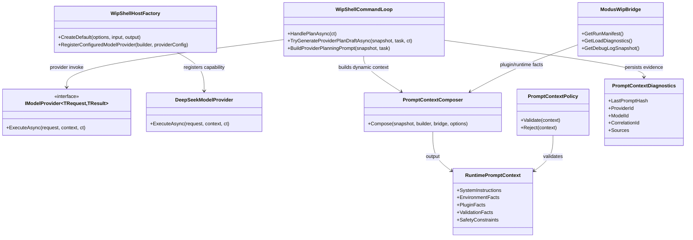

# WiP Dynamic System Prompt Requirements and Test Plan - Plugin-Aligned Model Context

> Scope: define a behavior-proof implementation slice across Wip.* so model-provider prompting is dynamically composed from plugin/runtime environment, policy, workflow, tool/validator ownership, and repository constraints, with deterministic validation and runtime evidence.

---

## Functionality Worktree

### Verification Policy

> Shared boilerplate: see `harness/schemas/requirements-doc-template.md`. Duplicate test-name cleanup: `harness/requirements/CLEANUP-NOTES.md`.

- Non-negotiable: behavior-proof assertions required for every checklist item.
- Metadata-only assertions are supporting evidence only.
- API/provider tests are valid only when thorough runtime integration gates are asserted.
- Negative-path tests must prove deterministic rejection and no side-effect execution.

### Coverage Inputs

| Input | Value |
|---|---|
| CsProject | src/WIP.* |
| AnalysisSource | Direct analysis of Wip.Shell prompt construction and provider invocation path, Wip.ShellHost provider composition and plugin diagnostics bridge, plus user requirement that plugins should dictate model system prompt and environment exposure should be dynamic and thorough |
| MandatoryItems | none (workflow-injected behavior-proof mandatory item enforced) |
| PlanType | requirements |
| OutputPath | .github/requirements/Wip.Dynamic-System-Prompt.md |

### Class Diagram

### Completeness Checklist

- [x] Add a first-class runtime prompt-context contract that models system instructions, environment facts, plugin facts, workflow/policy scope, validator/tool capability catalog, and explicit forbidden ecosystems for provider plan generation [foundation for dynamic system prompt]
- [x] Implement prompt-context composer in Wip.Shell that derives context deterministically from active session snapshot, builder descriptors, selected workflow/policy, repository root, validation commands, and loaded plugin manifest diagnostics [depends on runtime prompt-context contract]
- [x] Replace static system message in plan provider invocation with dynamic composed context payload so provider requests include plugin-owned constraints and environment exposure in a stable order [depends on prompt-context composer]
- [x] Add prompt-context policy gate that rejects provider execution when required environment anchors are missing or inconsistent (repository root, workflow id, policy id, plugin ownership, validator catalog) and falls back deterministically [depends on dynamic context invocation]
- [x] Add plugin-driven system-instruction injection contract where plugins can contribute bounded prompt fragments through explicit capability metadata and host bridge diagnostics, with deterministic precedence and sanitization [depends on prompt-context contract]
- [x] Persist prompt-context invocation diagnostics (context hash, provider id/model id, correlation id, contributing plugin ids, rejected fragments) into session artifacts and status output for behavior-proof auditability [depends on dynamic invocation and plugin injection]
- [x] Enforce ecosystem-alignment guardrails in provider plan steps by rejecting or rewriting disallowed toolchain commands outside repo policy (for example npm/yarn/pip/cargo when .NET-only context is active) [depends on prompt policy gate and diagnostics]
- [x] Add deterministic negative-path isolation tests for provider timeout, malformed provider payload, plugin fragment validation failure, and context-policy rejection with no unintended artifact mutation [depends on diagnostics and guardrails]
- [x] Enforce absolute behavior-proof verification for every planned integration test [mandatory - behavior-proof policy] [transition-proof: .github/requirements/transition-proofs/checklist-item-absolute-behavior-proof-verification-transition-proof-2026-06-01.md]

### Checklist to Runtime-Proof Matrix

| Checklist Item | Primary Runtime Proof Path | Minimum Evidence |
|---|---|---|
| Runtime prompt-context contract | Abstraction and invocation contract path | Provider invocation consumes typed context contract and fails deterministically when mandatory fields are missing |
| Prompt-context composer | Session + host composition path | Composed context includes repository/workflow/policy/plugin/validator/tool facts with stable ordering and deterministic values |
| Dynamic provider system prompt | Plan command provider path | Outbound provider request contains dynamic system instructions and environment facts derived from runtime state |
| Prompt policy gate | Plan rejection/fallback path | Missing anchors trigger deterministic rejection contract and deterministic fallback plan path |
| Plugin-driven prompt fragments | Plugin ownership and merge path | Loaded plugin fragments are merged by precedence, sanitized, and reflected in provider request evidence |
| Prompt diagnostics persistence | Artifact/status path | Context hash, correlation, model/provider identifiers, and source fragments are persisted and surfaced via shell status/artifacts |
| Ecosystem guardrails | Plan-output normalization path | Disallowed toolchain commands are rejected or rewritten deterministically under .NET-only policy |
| Negative-path isolation | Failure and rollback path | Timeout/malformed/fragment-failure/policy-rejection paths emit deterministic contracts and produce no side-effect artifact mutation |
| Behavior-proof compliance | Plan compliance gate | Every checklist item maps to executable tests and metadata-only assertions are rejected |

---

## Test Plan

### Runtime Prompt Context Contract

1. `PlanProviderInvocation_GivenDynamicPromptContext_ExpectedProviderRequestContainsSystemInstructionsEnvironmentAndConstraints`
   *Assumption*: Runtime prompt-context contract composes system instructions, environment facts, plugin facts, and workflow or policy constraints into deterministic provider request evidence during execution.

2. `PromptPolicyGate_GivenMissingValidatorCatalog_ExpectedProviderExecutionRejectedBeforeNetworkDispatch`
   *Assumption*: Missing mandatory runtime anchors are rejected before provider dispatch with deterministic policy evidence.

3. `PlanProviderInvocation_GivenPromptDiagnostics_ExpectedArtifactPersistenceAndStatusSurfacing`
   *Assumption*: Equivalent runtime inputs emit a stable context hash and persisted artifact evidence suitable for deterministic comparison.

### Prompt Context Composer

1. `PlanProviderInvocation_GivenDynamicPromptContext_ExpectedProviderRequestContainsSystemInstructionsEnvironmentAndConstraints`
   *Assumption*: Composer uses active session and builder descriptors to emit workflow, policy, repository, tool, and validator facts in runtime provider output.

2. `PluginPromptFragments_GivenMultipleLoadedPlugins_ExpectedDeterministicPrecedenceAndMergedSystemInstructions`
   *Assumption*: Loaded plugins contribute deterministic prompt fragments and diagnostics evidence to runtime-composed system instructions.

3. `Repo_GivenInitializedRepository_RendersRepositoryPathPolicyPluginPathsAndWorkspaceRootFromEffectiveConfig`
   *Assumption*: Repository and workspace anchors remain observable and deterministic in effective configuration output even before provider execution occurs.

### Dynamic Provider System Prompt Invocation

1. `PlanProviderInvocation_GivenDynamicPromptContext_ExpectedProviderRequestContainsSystemInstructionsEnvironmentAndConstraints`
   *Assumption*: Provider request contains dynamic system message and context-derived user message fields during runtime execution instead of static generic prompt text.

2. `ProviderInvocation_GivenUnsupportedModelSelection_ExpectedDeterministicRejectionWithoutArtifactMutation`
   *Assumption*: Effective model selection is enforced at provider execution time, and unsupported selections yield deterministic rejection without artifact mutation.

3. `ProviderInvocation_GivenSessionContext_ExpectedCorrelationIdPropagatesAcrossRequestResponseAndArtifacts`
   *Assumption*: Correlation id remains continuous across runtime provider request, response, shell output, and persisted artifacts.

### Prompt Policy Gate and Deterministic Fallback

1. `PromptPolicyGate_GivenInconsistentRepositoryRoot_ExpectedProviderExecutionRejectedBeforeNetworkDispatch`
   *Assumption*: Provider dispatch is blocked when repository anchors are inconsistent, producing deterministic rejection evidence before network execution.

2. `PromptPolicyGate_GivenMissingPluginOwnership_ExpectedDeterministicFallbackPlanAndExplicitRejectionReason`
   *Assumption*: Rejected context yields deterministic fallback plan output with explicit policy rejection evidence.

3. `PlanProviderInvocation_GivenDynamicPromptContext_ExpectedProviderRequestContainsSystemInstructionsEnvironmentAndConstraints`
   *Assumption*: Valid context executes the provider path and emits dynamic prompt evidence instead of fallback substitution.

### Plugin-Driven System Instruction Injection

1. `PluginPromptFragments_GivenMultipleLoadedPlugins_ExpectedDeterministicPrecedenceAndMergedSystemInstructions`
   *Assumption*: Plugin fragments merge by deterministic precedence so resulting system instructions are reproducible.

2. `PluginPromptFragments_GivenUnsafeOrMalformedFragment_ExpectedSanitizedOrRejectedFragmentWithAuditEvidence`
   *Assumption*: Unsafe plugin fragment content is sanitized or rejected with audit evidence instead of being passed through.

3. `PluginPromptFragments_GivenPluginLifecycleUnload_ExpectedFragmentRemovedFromSubsequentPromptContext`
   *Assumption*: Plugin unload removes prior fragment contribution from future prompt composition deterministically.

### Prompt Diagnostics Persistence and Exposure

1. `PlanProviderInvocation_GivenPromptDiagnostics_ExpectedArtifactPersistenceAndStatusSurfacing`
   *Assumption*: Prompt diagnostics persist context hash, provider or model identifiers, correlation, and source evidence in runtime artifacts.

2. `PlanProviderInvocation_GivenPromptDiagnostics_ExpectedArtifactPersistenceAndStatusSurfacing`
   *Assumption*: Status output surfaces prompt diagnostics with deterministic runtime evidence for operator verification.

3. `ArtifactsCommand_GivenSessionArtifacts_ReturnsDeterministicDescriptorFieldsAndStableOrdering`
   *Assumption*: Persisted prompt-related artifacts remain discoverable through deterministic artifact listings and stable typed descriptor output.

### Ecosystem Alignment Guardrails

1. `PlanStepGuardrails_GivenDotNetOnlyPolicy_ExpectedNpmYarnPipCargoCommandsRejectedOrRewrittenDeterministically`
   *Assumption*: Guardrail policy prevents out-of-ecosystem commands from being emitted in accepted plan steps.

2. `PlanStepGuardrails_GivenDotNetOnlyPolicy_ExpectedNpmYarnPipCargoCommandsRejectedOrRewrittenDeterministically`
   *Assumption*: Compliant dotnet commands remain observable in accepted plan output while disallowed ecosystems are rejected by policy.

3. `PlanStepGuardrails_GivenDotNetOnlyPolicy_ExpectedNpmYarnPipCargoCommandsRejectedOrRewrittenDeterministically`
   *Assumption*: Violating provider output is blocked or rewritten with deterministic diagnostic output and repair guidance.

### Negative-Path Isolation and Failure Contracts

1. `ProviderInvocation_GivenTimeout_ExpectedDeterministicFailureContractAndNoSideEffectArtifactMutation`
   *Assumption*: Timeout failures produce deterministic negative contracts with no unintended artifact writes.

2. `ProviderInvocation_GivenMalformedProviderPayload_ExpectedDeterministicParseFailureAndNoPartialPlanArtifact`
   *Assumption*: Malformed payload does not produce partial/corrupted plan artifacts.

3. `ProviderInvocation_GivenPluginFragmentValidationFailure_ExpectedPolicyRejectionContractAndIsolation`
   *Assumption*: Fragment validation failures are isolated, deterministically reject provider execution, and produce no side-effect artifact mutation.

4. `ProviderInvocation_GivenContextPolicyRejection_ExpectedBusinessErrorContractIncludesCorrelationAndReason`
   *Assumption*: Rejection contracts preserve business semantics and correlation for operator debugging.

### Absolute Behavior-Proof Compliance Gate

1. `BehaviorProofCompliance_GivenChecklistItems_RequiresExecutableRuntimeProofForEachItem`
   *Assumption*: Every checklist item is compliant only when backed by executable runtime assertions and successful mapped test execution evidence.

2. `BehaviorProofCompliance_GivenMetadataOnlyAssertions_RejectsPlanAsNonCompliant`
   *Assumption*: Metadata-only checks are insufficient and must trigger deterministic policy rejection rather than counting as runtime-proof evidence.

3. `BehaviorProofCompliance_GivenApiFocusedCoverage_RequiresOwnerSemanticsBusinessSemanticsLifetimeCorrelationIsolationAndNegativeContracts`
   *Assumption*: Provider API tests are compliant only when integration gates cover owner resolution, business semantics, lifetime correlation, isolation, and negative contracts.

---

## Format Gate Results

| # | Rule | Status | Violations |
|---|---|---|---|
| 1 | Heading structure and separators | ✅ Pass | — |
| 2 | Scope statement under H1 | ✅ Pass | — |
| 3 | Pipe tables present | ✅ Pass | — |
| 4 | Checklists with dependency tags | ✅ Pass | — |
| 5 | Mermaid diagrams (conditional) | ✅ Pass | — |
| 6 | Verification gate evidence | ✅ Pass | — |
| 7 | Closing verification line | ✅ Pass | — |
| 8 | Numbered test plan items | ✅ Pass | — |

**PASS** - document conforms to plan format.

---

## Absolute Behavior Verification Compliance Check

| Condition | Result | Evidence |
|---|---|---|
| Every checklist item maps to named tests | Pass | Each unchecked worktree item has a dedicated test subsection with named xUnit tests |
| Behavior-proof assertions present for every item | Pass | Assumptions require executable runtime proof, including provider dispatch, policy gate rejection, and isolation paths |
| Metadata-only tests absent as sole evidence | Pass | Dedicated compliance gate tests reject metadata-only assertions |
| API-focused items include absolute integration gates | Pass | Provider API and prompt-context integration tests require owner resolution, business semantics, DI lifetime path, correlation continuity, and isolation proof |

---

Dynamic system-prompt requirements checklist and xUnit test plan saved to .github/requirements/Wip.Dynamic-System-Prompt.md.

*All assumptions verified by Falsify Claims. Zero Falsified rows.*
