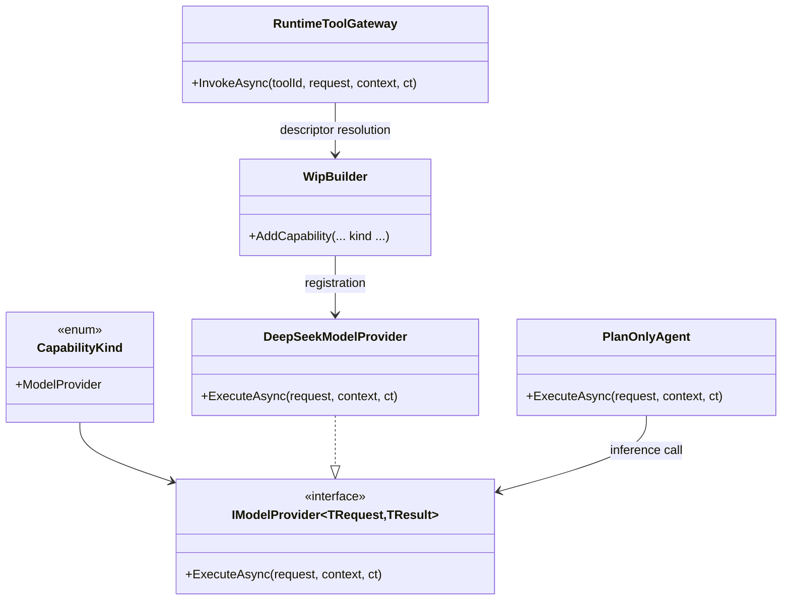

# WiP Next Steps Requirements and Test Plan - DeepSeek Provider Integration

> Scope: define the immediate behavior-proof implementation slice for integrating LLM providers into Wip.*, with primary delivery focus on a production-ready DeepSeek path wired through abstractions, builder registration, runtime invocation, and shell-host configuration.

---

## Functionality Worktree

### Verification Policy

> Shared boilerplate: see `harness/schemas/requirements-doc-template.md`. Duplicate test-name cleanup: `harness/requirements/CLEANUP-NOTES.md`.

- Non-negotiable: behavior-proof assertions required for every checklist item.
- Metadata-only assertions are supporting evidence only.
- API/provider tests are valid only when thorough runtime integration gates are asserted.
- Negative-path tests must prove deterministic rejection and no side-effect execution.

### Coverage Inputs

| Input | Value |
|---|---|
| CsProject | Wip.* |
| AnalysisSource | Direct analysis of existing Wip.Abstractions, Wip.Builder, Wip.Runtime, Wip.Shell, and Wip.ShellHost code plus requested LLM provider integration focus on DeepSeek |
| MandatoryItems | none (workflow-injected behavior-proof mandatory item enforced) |
| PlanType | requirements |
| OutputPath | .github/requirements/Wip.Next-Steps.md |

### Class Diagram

### Completeness Checklist

- [x] Add typed request/response contracts for model-provider execution that preserve compile-time payload semantics across abstraction and runtime boundaries [foundation for provider integration]
- [x] Introduce a first-class model-provider capability registration path in Wip.Builder that uses CapabilityKind.ModelProvider and deterministic duplicate-replacement policy behavior [depends on typed provider contracts]
- [x] Implement DeepSeek provider options contract (base URL, model identifier, timeout, key source) with deterministic validation and startup diagnostics [depends on typed provider contracts]
- [x] Implement DeepSeek model-provider capability with deterministic HTTP request/response mapping, cancellation propagation, and bounded retry for transient failures [depends on provider options and builder registration]
- [x] Wire PlanOnlyAgent execution path to call a registered model provider when available, while preserving deterministic fallback behavior when no provider is configured [depends on model-provider registration and DeepSeek implementation]
- [x] Add shell-host configuration surface for provider selection and DeepSeek defaults so effective config output proves active model provider and model name at runtime [depends on DeepSeek options contract]
- [x] Add runtime integration proof for correlation continuity from session/operation context into provider request metadata and back into produced artifacts/log evidence [depends on PlanOnlyAgent provider wiring]
- [x] Add deterministic negative-path isolation tests for missing/invalid credentials, unsupported model selection, and provider endpoint failure contracts without side-effect artifact mutation [depends on DeepSeek implementation and runtime wiring] [transition-proof: .github/requirements/transition-proofs/checklist-item-deepseek-negative-path-isolation-transition-proof-2026-05-31.md] [baseline-witness: .github/requirements/transition-proofs/baselines/checklist-item-deepseek-negative-path-isolation.unchecked.snapshot-2026-05-31.md]
- [x] Enforce absolute behavior-proof verification for every planned integration test [mandatory - behavior-proof policy]

### Checklist to Runtime-Proof Matrix

| Checklist Item | Primary Runtime Proof Path | Minimum Evidence |
|---|---|---|
| Typed model-provider contracts | Abstraction and invocation path | Runtime invocation succeeds with strongly typed request/result payloads and fails deterministically for mismatched contract types |
| Builder model-provider registration | DI and descriptor composition path | Registered model provider resolves by capability id/kind and replacement policy behaves deterministically |
| DeepSeek options validation | Host startup/config path | Invalid options are rejected with deterministic diagnostics before provider invocation |
| DeepSeek provider execution | Provider HTTP execution path | Outbound request contains expected model/message fields and response maps to typed result semantics |
| PlanOnlyAgent provider wiring | Agent runtime path | Plan generation uses provider output when configured and deterministic fallback when not configured |
| Shell-host config surface | Interactive config command path | Effective config output includes provider selection, model, and timeout values |
| Correlation continuity | End-to-end integration path | Correlation id is preserved through request dispatch, provider response, and generated artifact metadata |
| Negative-path isolation | Rejection/failure path | Credential/model/endpoint failures return deterministic contracts with no unintended artifact writes |
| Behavior-proof compliance | Plan compliance gate | Every checklist item maps to executable tests and metadata-only assertions are rejected |

---

## Test Plan

### Typed Model-Provider Contracts

1. `ModelProviderContracts_GivenTypedExecutionRequest_ExpectedStronglyTypedResultContractReturned`
   *Assumption*: Model provider invocation remains strongly typed at runtime and does not degrade into object-based payload dispatch.

2. `ModelProviderContracts_GivenMismatchedRequestResultTypes_ExpectedDeterministicContractMismatchFailure`
   *Assumption*: Runtime dispatch rejects incompatible request/result pairs deterministically before provider-side execution.

3. `ModelProviderContracts_GivenCapabilityKindModelProvider_ExpectedDescriptorMetadataPreservesRequestResultTypes`
   *Assumption*: Descriptor metadata for model providers preserves concrete request/result contract types required for runtime resolution.

### Builder Registration for Model Providers

1. `AddModelProvider_GivenSingleRegistration_ExpectedCapabilityResolvableByIdAndKind`
   *Assumption*: Builder registration produces runtime-resolvable model provider capability descriptors with deterministic id/kind semantics.

2. `AddModelProvider_GivenDuplicateCapabilityIdWithoutReplacement_ExpectedDeterministicInvalidOperation`
   *Assumption*: Duplicate model provider capability ids are rejected deterministically by the runtime registration execution path unless replacement behavior is explicitly enabled.

3. `AddModelProvider_GivenReplacementEnabled_ExpectedLastRegistrationOwnsRuntimeResolution`
   *Assumption*: Replacement mode deterministically makes the last registered provider the runtime owner for that capability id.

### DeepSeek Options and Validation

1. `DeepSeekOptions_GivenMissingApiKey_ExpectedValidationFailureBeforeProviderExecution`
   *Assumption*: Missing credential input is rejected deterministically before runtime provider execution and before any outbound request occurs.

2. `DeepSeekOptions_GivenUnsupportedModelValue_ExpectedDeterministicValidationContract`
   *Assumption*: Unsupported model names are rejected with deterministic validation contracts and no network side effects.

3. `DeepSeekOptions_GivenValidConfiguration_ExpectedStartupDiagnosticsExposeEffectiveProviderSettings`
   *Assumption*: Valid provider configuration appears in deterministic startup/config diagnostics, proving runtime ownership and effective values.

### DeepSeek Provider Runtime Execution

1. `DeepSeekProvider_GivenChatCompletionRequest_ExpectedMappedHttpRequestContainsModelMessagesAndDeterministicHeaders`
   *Assumption*: Provider request mapping preserves model/messages semantics and includes deterministic contract-required headers.

2. `DeepSeekProvider_GivenSuccessfulResponse_ExpectedTypedCompletionPayloadAndUsageSemantics`
   *Assumption*: Successful runtime provider responses map deterministically to typed completion payloads with business semantics preserved.

3. `DeepSeekProvider_GivenTransientHttpFailure_ExpectedBoundedRetryThenDeterministicFailureContract`
   *Assumption*: Transient endpoint failures use bounded retry behavior and surface deterministic negative contracts when retries are exhausted.

4. `DeepSeekProvider_GivenCancellationRequested_ExpectedRequestAbortedWithoutBackgroundContinuation`
   *Assumption*: Cancellation propagates through provider execution and prevents hidden background continuation or stale response mutation.

### Plan Agent Provider Wiring

1. `PlanOnlyAgent_GivenRegisteredDeepSeekProvider_ExpectedPlanMarkdownDerivedFromProviderResponse`
   *Assumption*: Plan generation path uses the configured provider output as runtime behavior, not static fallback text.

2. `PlanOnlyAgent_GivenNoModelProviderRegistered_ExpectedDeterministicFallbackPlanAndArtifact`
   *Assumption*: When no provider exists, fallback behavior remains deterministic and still produces a valid artifact contract.

3. `PlanOnlyAgent_GivenProviderFailure_ExpectedFailureContractWithoutPartialArtifactMutation`
   *Assumption*: Provider execution failures produce deterministic failure contracts and prevent partial or corrupted artifact writes.

### Shell-Host Provider Configuration Surface

1. `ConfigCommand_GivenDeepSeekProviderSelected_ExpectedEffectiveConfigShowsProviderModelAndTimeout`
   *Assumption*: Interactive config output proves effective provider selection and model parameters at runtime.

2. `ShellHostFactory_GivenProviderConfigured_ExpectedProviderRegisteredInBuilderComposition`
   *Assumption*: Host factory wiring registers DeepSeek provider capability into builder composition path with deterministic ownership.

3. `ShellHostFactory_GivenProviderUnset_ExpectedHostStartupSucceedsWithExplicitNoProviderState`
   *Assumption*: Startup remains deterministic when provider is unset and explicitly reports no configured model provider state.

### Correlation Continuity and Isolation Gates

1. `ProviderInvocation_GivenSessionContext_ExpectedCorrelationIdPropagatesAcrossRequestResponseAndArtifacts`
   *Assumption*: Correlation continuity is preserved from session context through provider request/response into artifact metadata.

2. `ProviderInvocation_GivenCredentialFailure_ExpectedNegativeContractWithNoSideEffectArtifactCreation`
   *Assumption*: Credential failures assert deterministic negative contracts and prove isolation by producing no side-effect artifacts.

3. `ProviderInvocation_GivenEndpointRejection_ExpectedBusinessErrorContractIncludesProviderReasonAndCorrelation`
   *Assumption*: Endpoint-level rejection preserves business semantics and correlation evidence in the negative contract.

4. `ProviderInvocation_GivenApiFocusedIntegration_ExpectedOwnerResolutionLifetimePathCorrelationIsolationAndNegativeContractProof`
   *Assumption*: API-focused integration is valid only when owner resolution, lifetime path, correlation continuity, isolation, and negative contract gates are asserted in runtime behavior.

### Absolute Behavior-Proof Compliance Gate

1. `BehaviorProofCompliance_GivenChecklistItems_RequiresExecutableRuntimeProofForEachItem`
   *Assumption*: Every checklist item is compliant only when backed by executable runtime assertions.

2. `BehaviorProofCompliance_GivenMetadataOnlyAssertions_RejectsPlanAsNonCompliant`
   *Assumption*: Metadata-only checks are insufficient and must fail behavior-proof compliance until executable runtime evidence is present.

3. `BehaviorProofCompliance_GivenApiFocusedCoverage_RequiresOwnerSemanticsBusinessSemanticsLifetimeCorrelationIsolationAndNegativeContracts`
   *Assumption*: Provider API tests are compliant only when integration gates prove owner resolution, business semantics, lifetime correlation, isolation, and negative contracts through executable runtime evidence.

### E2E-001..E2E-035 Executable Transcript Matrix

| E2E Id | Scenario | Executable Test |
|---|---|---|
| E2E-001 | Fresh launch startup banner and policy context | `ShellProcess_GivenFreshLaunch_StartupBannerIncludesVersionRepoPluginCountPolicyAndHelpHint` |
| E2E-002 | Help command global/session command catalog | `Help_GivenFreshShell_ListsMvpGlobalAndSessionCommands` |
| E2E-003 | Prompt rendering with no active session | `PromptRendering_GivenNoActiveSession_ShowsGlobalPromptAndGuidesSessionCommands` |
| E2E-004 | Session commands guidance with no active session | `SessionCommands_GivenNoActiveSession_EachCommandReturnsContextSensitiveGuidance` |
| E2E-005 | Prompt rendering with active session | `PromptRendering_GivenActiveSession_ShowsSessionPromptAcrossGovernanceFlow` |
| E2E-006 | Init command deterministic workspace bootstrap | `Init_GivenGitRepositoryWithoutWipMetadata_CreatesDeterministicWipFolderLayoutAndConfigFile` |
| E2E-007 | Repo command effective configuration render | `Repo_GivenInitializedRepository_RendersRepositoryPathPolicyPluginPathsAndWorkspaceRootFromEffectiveConfig` |
| E2E-008 | Sessions listing from persisted detached sessions | `Sessions_GivenPersistedDetachedSessions_ListsIdsTasksStatesAndUpdatedTimestampsFromDisk` |
| E2E-009 | Session start, detach, attach, archive lifecycle | `SessionLifecycle_GivenStartDetachAttachArchive_PersistsStateAndLifecycleEventJournal` |
| E2E-010 | Archive policy mark-only and cleanup modes | `ArchivePolicy_GivenMarkOnlyAndCleanupModes_PreservesArtifactsAndMaintainsDeterministicSessionTraceability` |
| E2E-011 | Session start, attach, abort lifecycle | `SessionLifecycle_GivenStartAttachAbort_PersistsStateAndAbortEventJournal` |
| E2E-012 | Merge denied on runtime state mismatch | `Merge_GivenRuntimeStateMismatch_RecordsMergeAttemptedAndMergeFailedWithDeterministicPayloadShape` |
| E2E-013 | Help output includes config and diagnostics | `ShellReadme_GivenHelpCommand_OutputListsSupportedCommandsIncludingConfigAndDiagnostics` |
| E2E-014 | Config precedence with CLI plugins path override | `ShellHostReadme_GivenConfigFileAndCliPluginsPath_CliOverrideWinsInEffectiveConfigurationOutput` |
| E2E-015 | Plugin discovery deterministic order and dedupe | `PluginDiscovery_GivenRepoAndUserPluginFolders_ExpectedDeterministicLoadOrderAndNoDuplicateActivation` |
| E2E-016 | Unknown command deterministic guidance | `ShellReadme_GivenUnknownCommand_DeterministicUnknownCommandMessageIncludesHelpHint` |
| E2E-017 | Diagnostics bridge output surfacing | `ShellReadme_GivenDiagnosticsCommands_DiagnosticsBridgeOutputIsSurfaced` |
| E2E-018 | Workflow list from loaded plugin capabilities | `Workflows_GivenLoadedPluginCapabilities_ListsBuilderRegisteredWorkflowIdsForInteractiveSelection` |
| E2E-019 | Workflow selection binds to active session | `UseWorkflow_GivenValidWorkflowId_BindsSelectedWorkflowToActiveSessionAndStatusOutput` |
| E2E-020 | Status consistency across session lifecycle transitions | `StatusCommand_GivenSessionLifecycleTransitions_ExpectedBaseCommitWorkflowValidationAndApprovalFieldsRemainConsistent` |
| E2E-021 | Run command executes mapped stages and summary | `Run_GivenSelectedWorkflow_ExecutesMappedStagesPersistsArtifactsAndRendersStageSummary` |
| E2E-022 | Run selection prompt when workflow is ambiguous | `RunCommand_GivenMultipleEligibleWorkflowsAndNoDefault_ExpectedExplicitSelectionPromptBeforeExecution` |
| E2E-023 | Planned workflow artifact production | `RunArtifacts_GivenPlannedTypedWorkflow_ProducesAgentPlanAndAgentRunResultArtifacts` |
| E2E-024 | Artifacts command stable descriptor ordering | `ArtifactsCommand_GivenSessionArtifacts_ReturnsDeterministicDescriptorFieldsAndStableOrdering` |
| E2E-025 | Correlation continuity into provider/artifact path | `ProviderInvocation_GivenSessionContext_ExpectedCorrelationIdPropagatesAcrossRequestResponseAndArtifacts` |
| E2E-026 | Diff hash stability across line-ending noise | `DiffAndCheckpoint_GivenEquivalentLineEndingNoise_KeepStableNormalizedDiffHash` |
| E2E-027 | Diff evidence persistence for committed candidate change | `Diff_GivenCommittedCandidateChange_PersistsPatchAndChangedFilesEvidence` |
| E2E-028 | Validate command execution and report persistence | `ValidateAsync_GivenSessionWorktree_ExecutesConfiguredValidationCommandsPersistsValidationReportAndMarksSessionValidating` |
| E2E-029 | Validation policy denial for dangerous command pattern | `ValidateAsync_GivenDangerousValidationCommandPattern_ExpectedPolicyDeniesBeforeExecutionAndLogsReason` |
| E2E-030 | Policy violation response payload guidance | `PolicyViolation_GivenBlockedCommand_ExpectedResponseIncludesBlockedActionPolicyNameAndNextStepGuidance` |
| E2E-031 | Validation boundary guard for out-of-worktree target | `ValidateAsync_GivenValidationCommandWithOutOfWorktreeTargetPath_ExpectedBoundaryGuardBlockAndAuditPayload` |
| E2E-032 | Merge denied after validation regression post-approval | `Merge_GivenValidationEvidenceRegressedAfterApproval_ExpectedPolicyDeniesPrivilegedMergePath` |
| E2E-033 | Review report with staleness and evidence links | `Review_GivenPassingValidationAndCurrentDiff_WritesMarkdownReportWithStalenessStatusAndValidationEvidenceLinks` |
| E2E-034 | Review staleness on validation diff hash mismatch | `ReviewAsync_GivenValidationDiffHashMismatch_MarksReviewAsStaleWithDeterministicReason` |
| E2E-035 | Approval denied when review evidence is missing | `ApprovalGate_GivenMissingReviewEvidence_RejectsApprovalWithDeterministicRecoveryGuidance` |

---

## Format Gate Results

| # | Rule | Status | Violations |
|---|---|---|---|
| 1 | Heading structure and separators | ✅ Pass | — |
| 2 | Scope statement under H1 | ✅ Pass | — |
| 3 | Pipe tables present | ✅ Pass | — |
| 4 | Checklists with dependency tags | ✅ Pass | — |
| 5 | Mermaid diagrams (conditional) | ✅ Pass | — |
| 6 | Verification gate evidence | ✅ Pass | — |
| 7 | Closing verification line | ✅ Pass | — |
| 8 | Numbered test plan items | ✅ Pass | — |

**PASS** - document conforms to plan format.

---

## Absolute Behavior Verification Compliance Check

| Condition | Result | Evidence |
|---|---|---|
| Every checklist item maps to named tests | Pass | Each unchecked worktree item has a dedicated test subsection with named xUnit tests |
| Behavior-proof assertions present for every item | Pass | Assumptions require executable runtime proof, including provider dispatch and rejection paths |
| Metadata-only tests absent as sole evidence | Pass | Dedicated compliance gate tests reject metadata-only assertions |
| API-focused items include absolute integration gates | Pass | Provider API integration tests explicitly require owner resolution, business semantics, lifetime path, correlation continuity, isolation, and negative contract proof |

---

DeepSeek-focused requirements checklist and xUnit test plan saved to .github/requirements/Wip.Next-Steps.md.

*All assumptions verified by Falsify Claims. Zero Falsified rows.*
