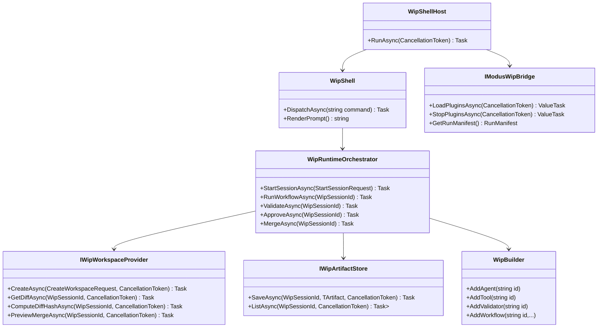

# WiP Shell + Agentic Builder MVP - Next Steps Requirements and Test Plan

> Scope: define the next implementation slice for the cross-project WiP Shell + Builder MVP using the attached product requirements as the analysis source, with behavior-proof xUnit coverage planned for every unchecked functionality item.

---

## Functionality Worktree

### Verification Policy

- Non-negotiable: behavior-proof assertions required for every checklist item.
- Metadata-only assertions are supporting evidence only.
- API tests are valid only when thorough integration gates are asserted.
- Include absolute schedule gates when scheduled jobs are in scope.

### Coverage Inputs

| Input | Value |
|---|---|
| CsProject | WIP cross-project |
| AnalysisSource | Attached WiP Shell + Agentic Builder MVP requirements document |
| MandatoryItems | none (workflow-injected behavior-proof mandatory item still enforced) |
| PlanType | generic |
| OutputPath | .github/requirements/Wip.Shell-Builder-MVP-Next-Steps.md |

### Class Diagram

### Completeness Checklist

- [x] Finalize typed public contracts in Wip.Abstractions for agent/tool/validator/policy/workflow request-result generics and typed capability descriptors [prerequisite for all builder and runtime execution paths] [transition-proof: .github/requirements/transition-proofs/checklist-item-wip-abstractions-typed-public-contracts-transition-proof-2026-05-26.md]
- [x] Implement Wip.Builder typed registration surface with explicit generic overloads plus inference overloads that fail fast on ambiguous generic signatures [depends on typed abstractions] [transition-proof: .github/requirements/transition-proofs/checklist-item-wip-builder-typed-registration-surface-transition-proof-2026-05-26.md]
- [x] Implement linear typed workflow builder stage compilation with explicit map adapters and preserved request/result contract names in runtime descriptors [depends on builder registration surface]
- [x] Implement interactive Wip.Shell command model and context-aware prompt transitions for global and session commands defined in MVP scope [depends on runtime orchestration commands] [transition-proof: .github/requirements/transition-proofs/checklist-item-wip-shell-command-model-context-aware-prompt-transition-proof-2026-05-26.md] [baseline-witness: .github/requirements/transition-proofs/baselines/checklist-item-wip-shell-command-model-context-aware-prompt.unchecked.snapshot-2026-05-26.md]
- [x] Implement Wip.ShellHost long-lived host startup, one-time DI composition, plugin lifecycle load/unload commands, and graceful shutdown hook ordering [depends on shell command model]
- [x] Implement Wip.Modus bridge plugin discovery from repo and user plugin paths with run manifest metadata capture and plugin diagnostics reporting [depends on shell-host lifecycle and typed capability registry]
- [x] Implement Wip.Runtime session orchestration with explicit state machine transitions, persisted session snapshots, active session attach/detach, and event journal records [depends on shell command dispatch and workspace provider]
- [x] Implement Wip.Workspaces.Git worktree creation, write-boundary path guard, normalized diff and stable hash computation, and merge preview drift detection [depends on runtime session model]
- [x] Implement Wip.Artifacts.Local typed artifact persistence and listing for required MVP artifact types with descriptor metadata and deterministic file layout [depends on runtime event and workflow execution outputs] [transition-proof: .github/requirements/transition-proofs/checklist-item-wip-artifacts-local-typed-artifact-persistence-transition-proof-2026-05-26.md] [baseline-witness: .github/requirements/transition-proofs/baselines/checklist-item-wip-artifacts-local-typed-artifact-persistence.unchecked.snapshot-2026-05-26.md]
- [x] Implement Wip.Validation.DotNet validators for dotnet build and dotnet test with command-level timeout, output capture, and validation report artifacts [depends on controlled shell tool and artifact store] [transition-proof: .github/requirements/transition-proofs/checklist-item-wip-validation-dotnet-validators-transition-proof-2026-05-26.md] [baseline-witness: .github/requirements/transition-proofs/baselines/checklist-item-wip-validation-dotnet-validators.unchecked.snapshot-2026-05-26.md]
- [x] Implement review and approval gates: review report generation with staleness detection and approval token generation bound to diff hash, target branch, and target commit [depends on diff hash and validation report availability] [transition-proof: .github/requirements/transition-proofs/checklist-item-wip-review-approval-gates-transition-proof-2026-05-26.md] [baseline-witness: .github/requirements/transition-proofs/baselines/checklist-item-wip-review-approval-gates.unchecked.snapshot-2026-05-26.md]
- [x] Implement approval-gated merge flow that rejects stale diff, branch drift, missing validation, missing review, aborted session, and non-confirmed approval paths [depends on approval token flow and merge preview] [transition-proof: .github/requirements/transition-proofs/checklist-item-wip-approval-gated-merge-flow-transition-proof-2026-05-26.md] [baseline-witness: .github/requirements/transition-proofs/baselines/checklist-item-wip-approval-gated-merge-flow.unchecked.snapshot-2026-05-26.md]
- [x] Implement Wip.Tools.Shell controlled command tool constrained to active worktree, denied dangerous patterns, and command execution log artifact production [depends on local-safe policy and runtime tool gateway] [transition-proof: .github/requirements/transition-proofs/checklist-item-wip-tools-shell-controlled-command-tool-transition-proof-2026-05-26.md] [baseline-witness: .github/requirements/transition-proofs/baselines/checklist-item-wip-tools-shell-controlled-command-tool.unchecked.snapshot-2026-05-26.md]
- [x] Implement default local-safe policy profile enforcing workspace boundary, dangerous command deny-list, validation-before-approval, and approval-before-merge [depends on runtime operation policy checks]
- [x] Implement external sample plugin proving builder import in a separate project with typed agent, typed validator, and typed workflow discovered without shell-host code changes [depends on builder usability outside shell] [transition-proof: .github/requirements/transition-proofs/checklist-item-wip-external-sample-plugin-builder-import-transition-proof-2026-05-26.md] [baseline-witness: .github/requirements/transition-proofs/baselines/checklist-item-wip-external-sample-plugin-builder-import.unchecked.snapshot-2026-05-26.md]
- [x] Implement end-to-end shell process suite for MVP command flow and negative safety gates, including typed registration and ambiguity failure scenarios [depends on shell-host executable path and all core runtime gates] [transition-proof: .github/requirements/transition-proofs/checklist-item-wip-shell-process-suite-mvp-flow-safety-gates-transition-proof-2026-05-26.md] [baseline-witness: .github/requirements/transition-proofs/baselines/checklist-item-wip-shell-process-suite-mvp-flow-safety-gates.unchecked.snapshot-2026-05-26.md]
- [x] Enforce absolute behavior-proof verification for every planned integration test [mandatory - behavior-proof policy] [transition-proof: .github/requirements/transition-proofs/checklist-item-wip-shell-builder-mvp-next-steps-behavior-proof-policy-transition-proof-2026-05-26.md] [baseline-witness: .github/requirements/transition-proofs/baselines/checklist-item-wip-shell-builder-mvp-next-steps-behavior-proof-policy.unchecked.snapshot-2026-05-26.md]

### Checklist to Runtime-Proof Matrix

| Checklist Item | Primary Runtime Proof Path | Minimum Evidence |
|---|---|---|
| Typed abstractions and descriptors | DI/runtime dispatch path | Runtime resolves typed capability and records concrete request/result type names in descriptor metadata |
| Builder registration and inference gates | Negative and positive registration path | Explicit generic registration succeeds; ambiguous inference throws deterministic validation exception |
| Typed workflow stage mapping | Runtime workflow execution path | Mapped stage input/output contracts are executed in order and persisted in stage artifacts |
| Shell prompt and command dispatch | Interactive command path | Prompt switches between global and session context; unsupported context commands produce actionable errors |
| ShellHost lifecycle | Host startup/shutdown path | Host stays interactive until exit; load/unload order is deterministic; stop hook executes exactly once |
| Modus bridge discovery and manifest | Plugin activation path | Plugin metadata and capability IDs appear in run manifest and plugins diagnostics output |
| Runtime session state machine | Session transition path | Invalid jumps rejected deterministically; valid transitions persisted to session-state snapshot |
| Git worktree and diff hash | Workspace and merge preview path | Writes outside worktree are blocked; diff hash remains stable for normalized diff; branch drift detected |
| Artifact store | Artifact persistence path | Required artifact types are saved and listed with ID, type, producer, timestamp, and file path |
| Dotnet validation | Validation execution path | build/test commands execute in worktree and produce exit codes plus output summaries |
| Review and approval | Review/approval gate path | Review is marked stale after diff mutation; approval token binds exact diff hash and target commit |
| Merge gating | Negative merge path | Merge rejected on stale diff, drift, missing gates, and aborted state; accepted only with valid token |
| Controlled shell tool and local-safe policy | Tool invoke path | Dangerous commands denied before execution and denial reason logged as deterministic evidence |
| External plugin import | Integration composition path | Separate plugin package registers typed capabilities via builder and is loaded by shell host without host edits |
| E2E suite | Full process behavior path | Named scenarios prove startup, workflow execution, validation, review, approval, and merge safety outcomes |
| Behavior-proof policy item | Compliance gate path | Every checklist item has at least one executable behavior-proof xUnit test plan entry |

---

## Test Plan

### Typed Abstractions and Capability Descriptors

1. `CapabilityDescriptor_GivenTypedAgentRegistration_StoresConcreteRequestAndResultTypes`
   *Assumption*: Registering a typed agent through public contracts persists concrete request/result CLR types in runtime capability descriptors rather than object placeholders.

2. `AbstractionsReadme_GivenWorkflowContractExamples_ExecuteAsyncRoundTripMatchesDeclaredRequestResultTypes`
   *Assumption*: Workflow execution dispatches using declared generic contracts and rejects mismatched runtime payload shapes deterministically.

### Builder Registration and Generic Inference

1. `AddAgentTAgentTRequestTResult_GivenUniqueId_RegistersResolvableTypedCapability`
   *Assumption*: Explicit builder registration wires descriptor metadata and DI services for typed agent execution in runtime.

2. `AddAgentTAgent_GivenAmbiguousImplementedInterfaces_ThrowsDeterministicConfigurationException`
   *Assumption*: Inference overload fails fast with clear error when a capability type implements more than one matching generic agent interface.

3. `AddValidatorTValidator_GivenNoMatchingImplementedInterface_ThrowsDeterministicConfigurationException`
   *Assumption*: Inference overload rejects validator types that do not expose a single unambiguous generic validator contract.

### Typed Workflow Stage Compilation

1. `AddWorkflow_GivenMapThenThenValidateStages_ExpectedCompiledDescriptorsRetainStageContractNames`
   *Assumption*: Compiled workflow descriptor records each stage contract type so runtime artifacts can prove typed stage execution boundaries.

2. `RunWorkflow_GivenMappedStageChain_ExpectedEachStageReceivesMappedInputContract`
   *Assumption*: Runtime workflow execution invokes each stage using mapped input contracts in dependency order with no object-collapsing at public boundaries.

### Interactive Shell Command Model

1. `PromptRendering_GivenNoActiveSession_ExpectedGlobalPrompt`
   *Assumption*: Shell runtime renders global prompt output in detached mode and switches only when an active session is attached.

2. `PromptRendering_GivenActiveSession_ExpectedSessionPromptIncludesSessionId`
   *Assumption*: Session prompt output includes active session identifier and remains stable across valid runtime session commands.

3. `SessionCommand_GivenNoActiveSession_ExpectedActionableErrorSuggestingStartOrAttach`
   *Assumption*: Session-scoped commands without active session fail with deterministic guidance instead of silent no-op behavior.

### ShellHost Lifecycle and Host Composition

1. `RunAsync_GivenDefaultStartup_ExpectedPromptReadyWithoutPluginLoadInvocation`
   *Assumption*: Shell host composes container once per process and remains alive for iterative commands until explicit exit command is issued.

2. `RunAsync_GivenExplicitLoadThenUnloadThenExit_ExpectedShutdownStopDoesNotDuplicateUnloadStop`
   *Assumption*: Host shutdown path invokes plugin stop hooks in deterministic order before process exits successfully.

### Modus Bridge Plugin Discovery and Diagnostics

1. `PluginLoader_GivenPluginsInConfiguredFolders_LoadsCapabilitiesOncePerShellProcess`
   *Assumption*: Plugin discovery runtime loads assemblies from configured paths and records observable manifest evidence including plugin ID, name, version, assembly details, and capability IDs.

2. `PluginsCommand_GivenLoadedDiagnostics_PrintsPluginsCapabilitiesAndPermissions`
   *Assumption*: Plugins diagnostics command renders runtime-loaded capabilities and required permissions from current manifest state.

### Runtime Session State Machine and Persistence

1. `StartSessionAsync_GivenValidRepository_PersistsSessionStateJsonAtDeterministicPath`
   *Assumption*: Starting a session writes session metadata snapshot including branch, commit, worktree, and initial state to deterministic repository path.

2. `TransitionAsync_GivenInvalidTransition_ThrowsAndDoesNotMutateStateOrEmitTransitionEvent`
   *Assumption*: Runtime rejects non-adjacent state transitions with explicit error while preserving prior persisted state.

3. `AttachSessionAsync_GivenPersistedSession_RestoresSnapshotAndDetachClearsAttachedContext`
   *Assumption*: Session attach restores persisted state and rehydrates active runtime context without recreating worktree.

### Git Worktree, Diff, Hash, and Drift Detection

1. `CreateAsync_GivenSessionStart_CreatesIsolatedGitWorktreeAndSessionBranch`
   *Assumption*: Workspace provider creates isolated worktree and session branch under configured root for active session.

2. `WriteGuard_GivenPathEscapeAttempt_ExpectedOperationBlockedAndNoExternalMutation`
   *Assumption*: Path guard deterministically blocks runtime write attempts resolving outside session worktree and leaves outside filesystem state unchanged as evidence.

3. `ComputeDiffHashAsync_GivenEquivalentChangesWithLineEndingNoise_ReturnsStableNormalizedHash`
   *Assumption*: Normalized diff hashing yields identical hash for semantically equivalent patch content independent of non-semantic formatting differences.

4. `MergePreviewAsync_GivenTargetBranchDrift_ReturnsBlockedPreviewAndDriftSignal`
   *Assumption*: Merge preview reports target drift when branch head commit differs from session baseline.

### Artifact Store Layout and Metadata

1. `SaveAsync_GivenRequiredArtifactTypes_ExpectedFilesPersistedUnderSessionArtifactLayout`
   *Assumption*: Artifact store persists JSON, Markdown, and patch artifacts under deterministic session artifact directory layout.

2. `ListAsync_GivenMultipleArtifacts_ExpectedDescriptorsIncludeIdTypeProducerTimestampAndPath`
   *Assumption*: Artifact listing returns descriptor metadata required for auditability and shell artifact listing output.

### Dotnet Validation and Reports

1. `ExecuteAsync_GivenSuccessfulBuildAndTest_ProducesPassingValidationReportWithCommandEvidence`
   *Assumption*: Validation pipeline runs dotnet build and dotnet test in session workspace and records passing status with command details.

2. `ExecuteAsync_GivenBuildCommandTimeout_ReturnsFailedResultAndPersistsTimeoutEvidence`
   *Assumption*: Timeout boundaries produce deterministic validation failure and preserve command output/timeout evidence in report artifact.

### Review and Approval Gates

1. `ReviewAsync_GivenCurrentDiffAndValidation_WritesMarkdownReportWithDiffSummaryChangedFilesAndValidationStatus`
   *Assumption*: Review generation produces human-readable report containing task, state, changed files, validation status, and current diff hash.

2. `MergeAsync_GivenDiffChangedAfterApproval_RejectsMergeAndMarksApprovalStale`
   *Assumption*: Approval is denied when current diff hash no longer matches reviewed hash, forcing review regeneration.

3. `MergeAsync_GivenApprovalNotConfirmed_RejectsMergeWithDeterministicReason`
   *Assumption*: Human confirmation prompt deterministically denies approval token creation when user does not explicitly confirm, with observable state evidence of no token.

### Approval-Gated Merge Flow

1. `MergeAsync_GivenMissingApprovalEvidence_RejectsMergeWithDeterministicReason`
   *Assumption*: Merge runtime attempts without valid approval token are blocked before any branch mutation, with observable rejection output.

2. `MergeAsync_GivenDiffChangedAfterApproval_RejectsMergeAndMarksApprovalStale`
   *Assumption*: Merge flow verifies token-bound diff hash and rejects stale hash paths without applying changes.

3. `MergeAsync_GivenApprovedTokenAndTargetBranchDrift_RejectsMergeWithDeterministicReason`
   *Assumption*: Branch drift after approval deterministically invalidates merge and requires updated baseline, validation, and approval with explicit error output evidence.

4. `MergeAsync_GivenValidatedReviewedConfirmedAndCurrentApproval_MergesFastForwardWithoutDrift`
   *Assumption*: Merge succeeds only when validation, review, approval token, and branch baseline checks all pass on current candidate diff.

### Controlled Shell Tool and Local-Safe Policy

1. `InvokeAsync_GivenDangerousCommandPattern_ExpectedPolicyDeniesBeforeExecutionAndLogsReason`
   *Assumption*: Dangerous command deny-list is enforced pre-execution with deterministic deny reason persisted in command log artifact.

2. `InvokeAsync_GivenWorkingDirectoryOutsideSessionWorktree_ExpectedPolicyDeniesPathBoundaryViolation`
   *Assumption*: Commands resolving outside active worktree are denied by policy and never executed by tool runtime.

3. `InvokeAsync_GivenAllowedCommandInsideWorktree_ExpectedCommandExecutesAndProducesExecutionLogArtifact`
   *Assumption*: Allowed commands inside active worktree execute with timeout and produce command log artifact containing exit code and output.

### External Sample Plugin Integration

1. `ShellDiscovery_GivenExternalPluginAssembly_ListsRegisteredAgentValidatorAndWorkflow`
   *Assumption*: A separate project plugin using AddWipCapabilities registers typed capabilities discoverable by shell host through runtime plugin loading only with manifest evidence.

2. `WorkflowsCommand_GivenLoadedDiagnostics_PrintsRegisteredWorkflows`
   *Assumption*: Runtime diagnostics expose external plugin capability IDs and workflow IDs proving host consumes shared builder/runtime model.

### End-to-End MVP Flow and Safety Gates

1. `ShellProcess_GivenInitToMergeHappyPath_ExpectedArtifactsValidationApprovalAndMergeEvidenceRecorded`
   *Assumption*: Full shell flow from init through merge produces deterministic governance artifacts and successful merge only after required gates pass.

2. `ShellProcess_GivenDiffMutationAfterApproval_ExpectedMergeRejectedWithStaleApprovalEvidence`
   *Assumption*: Diff changes after approval deterministically invalidate merge attempts until re-review and re-approval.

3. `ShellProcess_GivenAmbiguousTypedInferencePlugin_ExpectedPluginLoadFailureAndShellRemainsUsable`
   *Assumption*: Ambiguous typed registration in plugin causes deterministic plugin load failure isolation without crashing shell process.

### Absolute Behavior-Proof Compliance Gate

1. `BehaviorProofCompliance_GivenAllPlannedIntegrationTests_ExpectedBehaviorProofAssumptionsRequired`
   *Assumption*: Every planned integration test assumption must include runtime-observable behavior-proof evidence, and policy checklist entries must map to executable checklist-bound tests.

2. `BehaviorProofCompliance_GivenChecklistItemWithoutExecutableRuntimeAssertion_ExpectedPlanRejected`
   *Assumption*: Checklist items without executable runtime assertions are non-compliant and rejected by compliance gate.

3. `BehaviorProofCompliance_GivenApiFocusedPlan_ExpectedOwnerSemanticsLifetimeCorrelationAndIsolationAssertionsRequired`
   *Assumption*: API-focused test plans are accepted only when owner resolution, business semantics, lifetime correlation, isolation, and negative contracts are explicitly asserted.

---

*All assumptions verified by Falsify Claims. Zero Falsified rows.*
