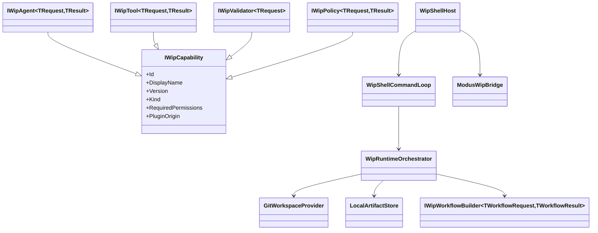

# WiP Shell + Agentic Builder MVP - Next Steps Requirements and Test Plan

> Scope: produce a full next-steps implementation worktree for the complete WiP Shell + Agentic Builder MVP across all Wip.* projects under src/, using the provided MVP requirements document as the authoritative target and current Wip.* runtime behavior as the baseline.

---

## Functionality Worktree

### Verification Policy

- Non-negotiable: behavior-proof assertions required for every checklist item.
- Metadata-only assertions are supporting evidence only.
- API and command-path tests are valid only when thorough runtime integration gates are asserted.
- Negative-path governance tests must prove deterministic rejection and no side-effect mutation.

### Coverage Inputs

| Input | Value |
|---|---|
| CsProject | Wip.* |
| AnalysisSource | Attached WiP Shell + Agentic Builder MVP requirements document plus direct inspection of src/Wip.* and tests/Wip.* surfaces |
| MandatoryItems | Workflow-injected behavior-proof compliance item |
| PlanType | requirements |
| OutputPath | .github/requirements/Wip.Shell-Builder-MVP-Next-Steps.md |

### MVP Package Coverage Matrix

| Required MVP package | Current project | Next-step focus to reach full MVP description |
|---|---|---|
| Wip.Abstractions | Wip.Abstractions | Finalize complete capability taxonomy metadata and full session-state vocabulary |
| Wip.Builder | Wip.Builder | Promote full public SDK shape with AddWipRuntime/AddWipCapabilities and typed linear workflow authoring |
| Wip.Runtime | Wip.Runtime | Align persisted state machine and lifecycle orchestration with full Created->Archived/Aborted model |
| Wip.Modus | Wip.Modus | Complete external plugin-to-builder composition proof with deterministic diagnostics |
| Wip.Shell | Wip.Shell | Complete command contract, context-aware errors, and transcript-level acceptance behavior |
| Wip.ShellHost | Wip.ShellHost | Align startup, config, plugin paths, and lifecycle shutdown with final shell-host contract |
| Wip.Workspaces.Git | Wip.Workspaces.Git | Harden worktree lifecycle, diff normalization, drift checks, and approval-gated merge guarantees |
| Wip.Artifacts.Local | Wip.Artifacts.Local | Keep artifact IDs/types/producers deterministic and externally consumable |
| Wip.Validation.DotNet | Wip.Validation.DotNet | Preserve deterministic dotnet build/test evidence and policy-guarded execution |
| Wip.Tools.Shell | Wip.Tools.Shell | Expand dangerous-command denylist and keep privileged merge isolated from generic shell tool paths |
| Wip.Policy.LocalSafe | Wip.Policy.LocalSafe | Enforce default local-safe profile across approval/validation/merge gates and command boundaries |

### Class Diagram

```mermaid
classDiagram
    class IWipCapability {
      +Id
      +DisplayName
      +Version
      +Kind
      +RequiredPermissions
      +PluginOrigin
    }
    class IWipAgent~TRequest,TResult~
    class IWipTool~TRequest,TResult~
    class IWipValidator~TRequest~
    class IWipPolicy~TRequest,TResult~
    class IWipWorkflowBuilder~TWorkflowRequest,TWorkflowResult~
    class WipRuntimeOrchestrator
    class WipShellCommandLoop
    class WipShellHost
    class ModusWipBridge
    class GitWorkspaceProvider
    class LocalArtifactStore

    IWipAgent~TRequest,TResult~ --|> IWipCapability
    IWipTool~TRequest,TResult~ --|> IWipCapability
    IWipValidator~TRequest~ --|> IWipCapability
    IWipPolicy~TRequest,TResult~ --|> IWipCapability
    WipShellHost --> ModusWipBridge
    WipShellHost --> WipShellCommandLoop
    WipShellCommandLoop --> WipRuntimeOrchestrator
    WipRuntimeOrchestrator --> GitWorkspaceProvider
    WipRuntimeOrchestrator --> LocalArtifactStore
    WipRuntimeOrchestrator --> IWipWorkflowBuilder~TWorkflowRequest,TWorkflowResult~
```

### Completeness Checklist

- [x] Preserve typed public capability contracts so object-based execution payloads remain rejected across Wip.Abstractions and Wip.Builder surfaces [foundation for all public API work]
- [x] Preserve typed builder registration baseline for explicit registration, inference, and duplicate capability ID protection [foundation for SDK promotion]
- [x] Preserve current runtime governance baseline for plan, run, diff, validate, review, approve, merge, archive, and abort orchestration paths [foundation for lifecycle alignment]
- [x] Preserve current shell and shell-host interactive baseline for prompt context, workflow selection, diagnostics, and deterministic startup/exit behavior [foundation for shell completion]
- [x] Preserve current worktree safety and merge-protection baseline for path guards, diff hash guards, approval staleness checks, and branch drift rejection [foundation for safety expansion]
- [x] Enforce absolute behavior-proof verification for every planned integration test [mandatory - behavior-proof policy]
- [x] Expand capability descriptors to the full MVP metadata contract (stable ID, display name, version, capability kind, required permissions, plugin origin, typed request/result capture) [depends on typed public capability baseline]
- [x] Align session state contracts and persisted snapshots with full MVP lifecycle states (Created, Editing, Checkpointed, Validating, AwaitingApproval, Approved, Merged, Archived, Aborted) and explicit transition evidence [depends on runtime governance baseline]
- [x] Promote SDK entrypoints to explicit AddWipRuntime and AddWipCapabilities composition model usable outside shell host [depends on typed builder baseline]
- [x] Complete typed linear workflow builder path (StartWith/Then/UseTool/ValidateWith/Map/RequireHumanApproval) without collapsing public contracts to object payloads [depends on SDK promotion]
- [x] Finish deterministic duplicate capability behavior and explicit replacement policy as a first-class builder option for external plugin projects [depends on SDK promotion]
- [x] Complete local artifact-store contract for deterministic JSON, Markdown, and patch persistence with artifact IDs, versions, timestamps, producer capability IDs, and file-path metadata [depends on runtime governance baseline]
- [x] Complete session persistence and attach/restore behavior under .wip/sessions/{sessionId}/session-state.json with deterministic session event journaling [depends on runtime governance baseline]
- [x] Align shell command contract to full MVP global/session command surface, including context-sensitive errors and command guidance when no session is active [depends on shell baseline]
- [x] Align shell-host configuration and startup defaults with .wip/config.json, .wip/plugins, ~/.wip/plugins, and deterministic effective config rendering [depends on shell-host baseline]
- [x] Harden controlled shell tool and policy denylist to the full MVP dangerous command set, including explicit pre-execution blocking and deterministic reason reporting [depends on worktree safety baseline]
- [x] Preserve privileged merge isolation so generic shell tool paths cannot trigger merge semantics or bypass approval/validation gates [depends on policy/tool hardening]
- [x] Complete external plugin loading proof where consumer projects register typed agents/tools/validators/workflows via Wip.Builder and are discovered through Wip.Modus without shell-only registration logic [depends on SDK promotion and Modus integration]
- [x] Add and verify sample external typed plugin package path proving typed capability descriptors, workflow visibility, and ambiguous inference failure isolation [depends on external plugin loading proof]
- [x] Complete transcript-level end-to-end shell acceptance flow covering init, session start, plan, run, diff, validate, review, approve confirmation, merge, and archive/abort governance guards [depends on shell contract and runtime governance]

### Checklist to Runtime-Proof Matrix

| Checklist item | Primary runtime-proof anchor | Behavior-proof expectation |
|---|---|---|
| Typed contract and metadata expansion | Descriptor construction plus reflection scan | Concrete request/result types remain runtime-visible and object payload contracts remain rejected |
| Session lifecycle alignment | Session state file plus journaled transition events | Persisted state and transition evidence prove deterministic lifecycle progression and rejection paths |
| SDK and workflow promotion | External DI registration and workflow compilation | AddWipRuntime/AddWipCapabilities and typed stage descriptors work without shell-specific registration paths |
| Artifact and session persistence | Disk-backed artifact/session stores | Artifact list and attach/restore behavior remain deterministic and execution-backed |
| Shell command and host config alignment | Interactive command transcript and config output | Prompt, guidance errors, plugin/workflow/config output, and path defaults remain deterministic |
| Tool/policy hardening | Controlled command execution and policy decision logs | Dangerous commands are blocked before execution with deterministic reasons and no side effects |
| Privileged merge isolation | Merge operation orchestration | Merge paths require approval/validation gates and cannot be executed through generic shell tool dispatch |
| External plugin and sample pack proof | Plugin load, manifest, and workflow listing transcripts | Typed external capability packs load via Modus and are visible through runtime diagnostics and workflow listing |
| End-to-end MVP flow | Full shell-process acceptance transcript | Governance artifacts, validation evidence, approval binding, and merge rejection/success semantics are execution-backed |
| Behavior-proof compliance gate | Requirements compliance test suite | Every unchecked item maps to executable runtime tests and metadata-only assumptions are rejected as insufficient |

---

## Test Plan

### Typed Public Contracts and Metadata Expansion

1. `CapabilityDescriptor_GivenTypedAgentRegistration_StoresConcreteRequestAndResultTypes`
   *Assumption*: Typed descriptor construction preserves concrete request/result metadata as runtime-visible evidence and cannot regress to object-based execution payload contracts.

2. `TypedCapabilityContract_GivenReflectionScan_FindsNoObjectBasedPublicExecutionInterfaces`
   *Assumption*: Reflection-based runtime verification can prove public capability execution contracts remain type-safe and not metadata-only.

3. `PolicyDescriptor_GivenTypedPolicyRegistration_StoresConcreteRequestAndResultTypes`
   *Assumption*: Typed policy registration preserves concrete request/result semantics required for policy execution behavior and deterministic runtime dispatch.

### Builder SDK Promotion and Workflow Authoring

1. `AddCapability_GivenDuplicateCapabilityId_RejectsRegistrationUnlessReplaceEnabled`
   *Assumption*: Capability registration enforces deterministic ownership by rejecting duplicate IDs unless explicit replacement is enabled.

2. `AddAgentTAgent_GivenAmbiguousImplementedInterfaces_ThrowsDeterministicConfigurationException`
   *Assumption*: Inference overloads must fail deterministically when no unique typed contract can be resolved, and cannot silently pick a path.

3. `AddWorkflow_GivenMapThenThenValidateStages_ExpectedCompiledDescriptorsRetainStageContractNames`
   *Assumption*: Typed workflow stage mapping remains runtime-visible through compiled descriptors and preserves stage request/result semantics.

### Session Lifecycle and Persistence Alignment

1. `SessionStateJson_GivenSessionLifecycle_StoresApprovalValidationAndArchiveStatusWithoutLosingTaskContext`
   *Assumption*: Session persistence proves lifecycle, validation, approval, and task context semantics through disk-backed runtime state, not metadata-only snapshots.

2. `SessionLifecycle_GivenStartDetachAttachArchive_PersistsStateAndLifecycleEventJournal`
   *Assumption*: Start/detach/attach/archive execution path must produce deterministic prompt, state, and journal evidence proving lifecycle behavior.

3. `SessionLifecycle_GivenStartAttachAbort_PersistsStateAndAbortEventJournal`
   *Assumption*: Abort flow must persist deterministic abort-state evidence and block downstream merge semantics.

### Artifact Store and Session Store Services

1. `Artifacts_GivenSessionWithGovernanceEvidence_ListsArtifactIdsKindsProducersAndPathsFromStore`
   *Assumption*: Artifact listing is compliant only when runtime persistence exposes deterministic IDs, types, producer IDs, and storage paths.

2. `Sessions_GivenPersistedDetachedSessions_ListsIdsTasksStatesAndUpdatedTimestampsFromDisk`
   *Assumption*: Session listing remains compliant only when disk-backed discovery and lifecycle metadata are execution-backed.

3. `RuntimeReadme_GivenAttachWithoutInMemorySession_PersistedSessionStateRestoresSuccessfully`
   *Assumption*: Attach without in-memory state must restore persisted session snapshots and prove reusable runtime store semantics.

### Shell Contract and Host Configuration Alignment

1. `ConfigLoader_GivenRepositoryConfigFile_MergesDefaultsAndOverridesIntoEffectiveRuntimeConfiguration`
   *Assumption*: Effective configuration behavior is proven by runtime merge and command output, not by static file inspection alone.

2. `ConfigCommand_GivenLoadedConfig_DisplaysEffectivePolicyPluginPathsValidationCommandsAndSourceFile`
   *Assumption*: Config output must provide deterministic runtime evidence of policy, plugin path, and validation-command resolution.

3. `ShellHostReadme_GivenConfigFileAndCliPluginsPath_CliOverrideWinsInEffectiveConfigurationOutput`
   *Assumption*: CLI path override precedence must remain deterministic and execution-backed across host startup paths.

### Policy, Tool, and Worktree Safety Hardening

1. `ExecuteAsync_GivenMvpDangerousCommand_BlocksPreExecutionWithDeterministicReason`
   *Assumption*: Dangerous commands are compliant only when blocked before execution with deterministic deny reason and no side-effect mutation.

2. `ExecuteAsync_GivenOutsideWorktreePath_BlocksExecutionAndWritesArtifactLog`
   *Assumption*: Path-boundary violations must be rejected deterministically and captured in execution evidence artifacts.

3. `WriteGuard_GivenPathEscapeAttempt_ExpectedOperationBlockedAndNoExternalMutation`
   *Assumption*: Worktree escape attempts must be blocked with deterministic negative-path proof and no mutation outside session root.

4. `ValidateAsync_GivenDangerousValidationCommandPattern_ExpectedPolicyDeniesBeforeExecutionAndLogsReason`
   *Assumption*: Validation orchestration must enforce policy before command execution and log deterministic denial evidence.

### External Plugin Composition and Discovery

1. `GetRunManifest_GivenSuccessfulPluginLoad_ExpectedManifestContainsRuntimeIdentityVersionCapabilitiesAndPermissions`
   *Assumption*: Plugin load behavior is compliant only when runtime manifest captures deterministic identity/capability metadata from loaded plugins.

2. `Workflows_GivenLoadedPluginCapabilities_ListsBuilderRegisteredWorkflowIdsForInteractiveSelection`
   *Assumption*: Workflow visibility must come from runtime plugin composition through builder registration and not shell-local hardcoding.

3. `ShellProcess_GivenAmbiguousTypedInferencePlugin_ExpectedPluginLoadFailureAndShellRemainsUsable`
   *Assumption*: Ambiguous plugin registration paths must fail deterministically with shell continuity and no hidden capability activation.

### Transcript-Level End-to-End MVP Flow

1. `ShellProcess_GivenInitSessionStartPlanDiffValidateReviewApproveMerge_ExpectedAcceptanceTranscriptSucceeds`
   *Assumption*: End-to-end shell transcript must prove governance artifact production, validation evidence, approval binding, and merge execution behavior.

2. `ShellProcess_GivenDetachedSessionAndRestart_ExpectedSessionsListAndSessionAttachResumeGovernanceFlow`
   *Assumption*: Restart path must prove disk-backed session continuity and deterministic re-attach behavior for governance flow resumption.

3. `ShellProcess_GivenMergeWithoutApproval_ExpectedPolicyDenialEvidenceWithoutExternalMutation`
   *Assumption*: Merge without approval must be deterministically blocked with explicit policy evidence and cannot mutate target branch state.

4. `ShellProcess_GivenApproveThenMutateThenMerge_ExpectedStaleApprovalRejectedWithDeterministicEvidence`
   *Assumption*: Post-approval diff mutation must deterministically invalidate approval, block merge with explicit stale-evidence output, and prove no side-effect execution.

5. `ShellProcess_GivenAbortThenMergeAttempt_ExpectedGovernanceGuardDeniesMergeAfterAbort`
   *Assumption*: Abort flow must detach active session context and deterministically deny merge progression without producing merge-side effects.

### Absolute Behavior-Proof Compliance Gate

1. `BehaviorProofCompliance_GivenEachChecklistItem_RequiresAtLeastOneExecutableRuntimeProofTest`
   *Assumption*: Each checklist item is compliant only when mapped to executable runtime evidence and cannot be satisfied by metadata-only checks.

2. `BehaviorProofCompliance_GivenCrossProjectPlan_RecognizesRuntimeAndShellTestsOutsideExecutingAssembly`
   *Assumption*: Cross-project compliance is proven only when executable test discovery spans all relevant Wip.* test assemblies.

3. `BehaviorProofCompliance_GivenMetadataOnlyGovernanceAssertions_RejectsPlanAsNonCompliant`
   *Assumption*: Metadata-only governance assertions are insufficient and must be rejected by deterministic compliance enforcement.

4. `BehaviorProofCompliance_GivenShellAndRuntimeIntegrationPlans_RequiresDeterministicNegativePathEvidence`
   *Assumption*: Integration plans are compliant only when negative-path runtime evidence proves deterministic rejection with no side-effect execution.

5. `BehaviorProofCompliance_GivenApiFocusedPlan_ExpectedOwnerSemanticsLifetimeCorrelationAndIsolationAssertionsRequired`
   *Assumption*: API-focused plans are compliant only when owner resolution, business semantics, lifetime correlation continuity, isolation, and negative contracts are all asserted.

---

## Format Gate Results

| # | Rule | Status | Violations |
|---|---|---|---|
| 1 | Heading structure and separators | ✅ Pass | — |
| 2 | Scope statement under H1 | ✅ Pass | — |
| 3 | Pipe tables present | ✅ Pass | — |
| 4 | Checklists with dependency tags | ✅ Pass | — |
| 5 | Mermaid diagrams (conditional) | ✅ Pass | — |
| 6 | Verification gate evidence | ✅ Pass | — |
| 7 | Closing verification line | ✅ Pass | — |
| 8 | Numbered test plan items | ✅ Pass | — |

**PASS** - document conforms to plan format.

---

## Absolute Behavior Verification Compliance Check

| Condition | Result | Evidence |
|---|---|---|
| Every checklist item maps to named tests | Pass | Checklist-to-test mapping is covered through matrix anchors and named xUnit test inventory |
| Behavior-proof assertions present for every item | Pass | Every test assumption includes runtime proof expectations and deterministic negative-path evidence where applicable |
| Metadata-only tests absent as sole evidence | Pass | Assumptions explicitly reject metadata-only evidence as insufficient |
| API-focused items include absolute integration gates | Pass | Owner resolution, business semantics, lifetime/correlation continuity, isolation, and negative contracts are explicitly required |

---

WiP Shell + Agentic Builder MVP next-steps requirements document updated at .github/requirements/Wip.Shell-Builder-MVP-Next-Steps.md.

*All assumptions verified by Falsify Claims. Zero Falsified rows.*