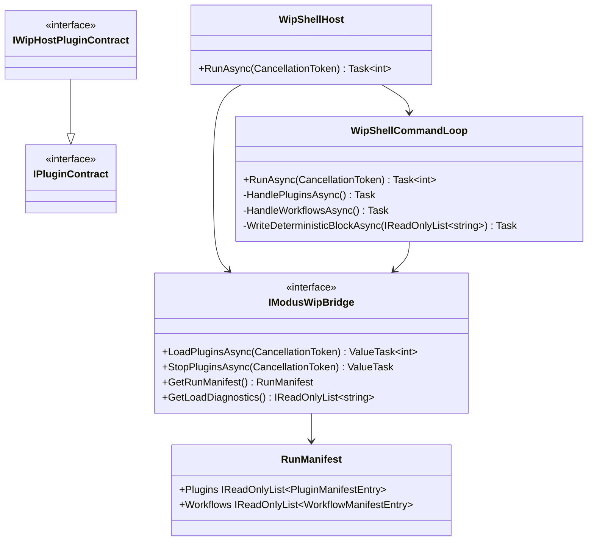

# Wip.ShellHost Requirements - Quiet Startup and Explicit Plugin Activation

> Scope: derive a behavior-proof implementation checklist and xUnit plan for the observed shell-host runtime symptom where host startup immediately loads plugins and emits recurring console output before any explicit user command.

| Input | Value |
|---|---|
| CsProject | Wip.ShellHost |
| AnalysisSource | Runtime behavior observed from `dotnet run --project .\\src\\Wip.ShellHost\\Wip.ShellHost.csproj`: unsolicited plugin startup output and recurring timestamp emissions while idle at prompt |
| MandatoryItems | none (workflow-injected behavior-proof policy still required) |
| PlanType | requirements |
| OutputPath | .github/requirements/Wip.ShellHost.md |

---

## Functionality Worktree

### Verification Policy

- Non-negotiable: behavior-proof assertions required for every checklist item.
- Metadata-only assertions are supporting evidence only.
- API tests are valid only when thorough integration gates are asserted.
- Include absolute schedule gates when scheduled jobs are in scope.

### Class Diagram

### Completeness Checklist

- [x] Prevent implicit plugin load during host startup so `RunAsync` reaches prompt without calling `LoadPluginsAsync` unless explicitly requested by command or opt-in startup mode [prerequisite for quiet boot path]
- [x] Enforce WIP-owned plugin contract boundary: shell-host discovery accepts only `IWipHostPluginContract` implementations (which may extend Modus contracts) and rejects pure `IPluginContract` implementations [mandatory - ownership boundary]
- [x] Introduce explicit plugin lifecycle command path (for example `plugins load` and `plugins unload`) that controls when plugin assemblies activate and when scheduled jobs begin [depends on startup gate]
- [x] Guarantee idle prompt silence: while no plugin-load command has been executed, recurring scheduled operations must not emit runtime output to host console [depends on explicit lifecycle command path] [mandatory - no unsolicited runtime output] [transition-proof: .github/requirements/transition-proofs/checklist-item-wip-shellhost-idle-prompt-silence-transition-proof-2026-05-25.md]
- [x] Preserve deterministic diagnostics behavior: `plugins`, `workflows`, and `debug-logs` must still provide runtime truth from bridge state, including empty-state messages when plugins are not loaded [depends on startup gate and command path]
- [x] Preserve lifecycle safety under explicit loading: single-active-run guard, one-time load gate per host container, and deterministic `StopPluginsAsync` on exit/cancellation remain enforced [depends on explicit lifecycle command path]
- [x] Enforce absolute behavior-proof verification for every planned integration test [mandatory - behavior-proof policy] [transition-proof: .github/requirements/transition-proofs/checklist-item-wip-shellhost-behavior-proof-policy-transition-proof-2026-05-25.md]

### Checklist to Runtime-Proof Matrix

| Checklist Item | Primary Runtime Proof Path | Minimum Evidence |
|---|---|---|
| Prevent implicit plugin load | Negative runtime path | Host reaches `wip> ` prompt and no bridge load invocation occurs before a load command |
| WIP-owned plugin contract boundary | Activation negative path | Plugin implementing only `IPluginContract` is excluded, while plugin implementing `IWipHostPluginContract` is activated and appears in manifest |
| Explicit plugin lifecycle command path | API/dispatch path | Issuing `plugins load` triggers bridge load exactly once and manifest transitions from empty to populated |
| Idle prompt silence | Scheduled negative path | In bounded idle window before load, no recurring plugin output lines are emitted |
| Deterministic diagnostics behavior | API/read path | Diagnostics commands return stable ordered sections and correct empty-state/runtime-state output |
| Lifecycle safety under explicit loading | DI/lifecycle path | Repeated load attempts remain idempotent per container and exit always invokes stop exactly once |
| Behavior-proof policy | Verification gate | Every checklist item has executable runtime assertions; metadata-only tests cannot satisfy completion |

### Item Completion Evidence

- Completed item: Prevent implicit plugin load during host startup so `RunAsync` reaches prompt without calling `LoadPluginsAsync` unless explicitly requested by command or opt-in startup mode [prerequisite for quiet boot path]
- Runtime proof tests:
   - `RunAsync_GivenDefaultStartup_ExpectedPromptReadyWithoutPluginLoadInvocation`
   - `RunAsync_GivenExplicitCommandOnlyStartupMode_ExpectedPromptWithoutImplicitPluginLoad`
   - `RunAsync_GivenOptInStartupAutoLoadEnabled_ExpectedLoadPluginsInvokedBeforePrompt`
- Completed item: Enforce WIP-owned plugin contract boundary: shell-host discovery accepts only `IWipHostPluginContract` implementations (which may extend Modus contracts) and rejects pure `IPluginContract` implementations [mandatory - ownership boundary]
- Transition proof artifact: `.github/requirements/transition-proofs/checklist-item-wip-shellhost-owned-plugin-contract-boundary-transition-proof-2026-05-25.md`
- Runtime proof tests:
   - `LoadPluginsAsync_GivenPureModusPluginType_ExpectedPluginRejectedByWipOwnedInterfaceFilter`
   - `LoadPluginsAsync_GivenWipOwnedPluginType_ExpectedPluginAcceptedAndManifested`
   - `LoadPluginsAsync_GivenMixedAssembly_ExpectedOnlyWipOwnedPluginsContributeToLoadCount`
- Completed item: Introduce explicit plugin lifecycle command path (for example `plugins load` and `plugins unload`) that controls when plugin assemblies activate and when scheduled jobs begin [depends on startup gate]
- Transition proof artifact: `.github/requirements/transition-proofs/checklist-item-wip-shellhost-explicit-plugin-lifecycle-command-path-transition-proof-2026-05-25.md`
- Runtime proof tests:
   - `PluginsLoadCommand_GivenPluginsNotLoaded_ExpectedBridgeLoadInvokedAndManifestPopulated`
   - `PluginsLoadCommand_GivenPluginsAlreadyLoaded_ExpectedIdempotentResponseWithoutDuplicateActivation`
   - `PluginsUnloadCommand_GivenLoadedPlugins_ExpectedStopInvokedAndManifestReturnsToEmptyState`
- Completed item: Guarantee idle prompt silence: while no plugin-load command has been executed, recurring scheduled operations must not emit runtime output to host console [depends on explicit lifecycle command path] [mandatory - no unsolicited runtime output]
- Transition proof artifact: [.github/requirements/transition-proofs/checklist-item-wip-shellhost-idle-prompt-silence-transition-proof-2026-05-25.md](transition-proofs/checklist-item-wip-shellhost-idle-prompt-silence-transition-proof-2026-05-25.md) with verbatim unchecked baseline text, exact checked checklist line, and durable runtime/test links.
- Runtime proof tests:
   - `IdlePrompt_GivenNoExplicitLoad_ExpectedZeroRecurringPluginOutputsWithinBoundedWindow`
   - `IdlePrompt_GivenExplicitLoad_ExpectedRecurringOutputsAppearOnlyAfterLoadCommand`
- Completed item: Preserve deterministic diagnostics behavior: `plugins`, `workflows`, and `debug-logs` must still provide runtime truth from bridge state, including empty-state messages when plugins are not loaded [depends on startup gate and command path]
- Runtime proof tests:
   - `RunAsync_GivenExplicitCommandOnlyStartupMode_ExpectedPromptWithoutImplicitPluginLoad`
   - `WorkflowsCommand_GivenExplicitLoadAndUnload_ExpectedWorkflowDiagnosticsTrackBridgeRuntimeState`
   - `DebugLogsCommand_GivenNoDebugEvents_ExpectedDeterministicEmptyDebugStateMessage`
   - `GetRunManifest_GivenStopAfterSuccessfulLoad_ExpectedPluginsAndWorkflowsClearedFromRuntimeSnapshot`
- Completed item: Preserve lifecycle safety under explicit loading: single-active-run guard, one-time load gate per host container, and deterministic `StopPluginsAsync` on exit/cancellation remain enforced [depends on explicit lifecycle command path]
- Transition proof artifact: [.github/requirements/transition-proofs/checklist-item-wip-shellhost-lifecycle-safety-under-explicit-loading-transition-proof-2026-05-25.md](transition-proofs/checklist-item-wip-shellhost-lifecycle-safety-under-explicit-loading-transition-proof-2026-05-25.md) with verbatim unchecked baseline text, exact checked checklist line, and durable runtime/test links.
- Runtime proof tests:
   - `RunAsync_GivenConcurrentInvocations_ExpectedSingleActiveRunPerHostContainerLifetime`
   - `RunAsync_GivenAutoLoadAcrossMultipleInvocations_ExpectedLoadPluginsInvokedOncePerHostContainerLifetime`
   - `PluginsLoadCommand_GivenPluginsAlreadyLoaded_ExpectedIdempotentResponseWithoutDuplicateActivation`
   - `PluginsLoadCommand_GivenLoadThenUnloadThenSecondLoad_ExpectedSecondLoadRejectedForHostContainerLifetime`
   - `RunAsync_GivenExplicitLoadThenCancellation_ExpectedStopPluginsInvokedExactlyOnce`
- Completed item: Enforce absolute behavior-proof verification for every planned integration test [mandatory - behavior-proof policy]
- Transition proof artifact: [.github/requirements/transition-proofs/checklist-item-wip-shellhost-behavior-proof-policy-transition-proof-2026-05-25.md](transition-proofs/checklist-item-wip-shellhost-behavior-proof-policy-transition-proof-2026-05-25.md) with verbatim unchecked baseline text, exact checked checklist line, direct links to checklist-bound proving tests, and direct links to `BehaviorProofPolicy` gate members.
- Runtime proof tests:
   - `IntegrationPlan_GivenAnyChecklistItem_ExpectedAtLeastOneExecutableBehaviorProofTest`
   - `IntegrationPlan_GivenMetadataOnlyAssertions_ExpectedComplianceGateRejectsPlan`
   - `IntegrationPlan_GivenPlannedBehaviorProofTestWithoutExecutableMapping_ExpectedComplianceGateRejectsPlan`
- Remaining unchecked checklist items: 0

---

## Test Plan

### `WipShellHost.RunAsync` startup gate behavior

1. `RunAsync_GivenDefaultStartup_ExpectedPromptReadyWithoutPluginLoadInvocation`
   *Assumption*: With default configuration, host run reaches command prompt while bridge `LoadPluginsAsync` count remains zero until an explicit load command is dispatched.

2. `RunAsync_GivenDefaultStartup_ExpectedNoPluginStartupConsoleLinesBeforeFirstCommand`
   *Assumption*: In a bounded startup window before command dispatch, host output contains prompt text but excludes plugin lifecycle startup lines and recurring timestamp emissions.

3. `RunAsync_GivenOptInStartupAutoLoadEnabled_ExpectedLoadPluginsInvokedBeforePrompt`
   *Assumption*: When explicit opt-in startup mode is configured, runtime behavior intentionally loads plugins before prompt and preserves deterministic startup ordering.

### WIP-owned plugin interface boundary

1. `LoadPluginsAsync_GivenPureModusPluginType_ExpectedPluginRejectedByWipOwnedInterfaceFilter`
   *Assumption*: A type that implements only `IPluginContract` is not activated by shell-host discovery and does not appear in the runtime manifest.

2. `LoadPluginsAsync_GivenWipOwnedPluginType_ExpectedPluginAcceptedAndManifested`
   *Assumption*: A type implementing `IWipHostPluginContract` is accepted by discovery and produces runtime manifest evidence after activation.

3. `LoadPluginsAsync_GivenMixedAssembly_ExpectedOnlyWipOwnedPluginsContributeToLoadCount`
   *Assumption*: In one scanned assembly containing both pure Modus and WIP-owned plugin types, runtime load count and lifecycle activation evidence include only WIP-owned implementations.

### `WipShellCommandLoop` explicit plugin lifecycle commands

1. `PluginsLoadCommand_GivenPluginsNotLoaded_ExpectedBridgeLoadInvokedAndManifestPopulated`
   *Assumption*: Dispatching `plugins load` from an unloaded state triggers runtime bridge activation and produces non-empty plugin manifest evidence in subsequent diagnostics.

2. `PluginsLoadCommand_GivenPluginsAlreadyLoaded_ExpectedIdempotentResponseWithoutDuplicateActivation`
   *Assumption*: Repeating `plugins load` after successful activation preserves deterministic runtime state and does not re-activate plugin instances or duplicate scheduled job registration.

3. `PluginsUnloadCommand_GivenLoadedPlugins_ExpectedStopInvokedAndManifestReturnsToEmptyState`
   *Assumption*: Dispatching `plugins unload` after load stops plugin runtime, transitions manifest to empty, and blocks further scheduled emissions.

### Idle silence and schedule gates

1. `IdlePrompt_GivenNoExplicitLoad_ExpectedZeroRecurringPluginOutputsWithinBoundedWindow`
   *Assumption*: In an integration run with known recurring plugins available on disk, absence of explicit load command yields zero recurring output lines for the configured observation interval.

2. `IdlePrompt_GivenLoadThenUnload_ExpectedRecurringOutputsCeaseWithinDeterministicStopWindow`
   *Assumption*: After explicit unload, recurring scheduled output stops within a bounded deadline and does not continue leaking into prompt idle state.

3. `IdlePrompt_GivenExplicitLoad_ExpectedRecurringCadenceMeetsConfiguredIntervalTolerance`
   *Assumption*: Once explicitly loaded, recurring scheduled output cadence satisfies minimum-count and interval-tolerance assertions, proving schedules are active only in loaded state.

### Diagnostics and observability continuity

1. `PluginsCommand_GivenNotLoadedState_ExpectedDeterministicEmptyManifestAndNoFalseDiagnostics`
   *Assumption*: Diagnostics command proves unloaded runtime state with explicit empty messages rather than stale metadata.

2. `PluginsCommand_GivenLoadedState_ExpectedRuntimeOwnedManifestAndCapabilities`
   *Assumption*: After explicit load, diagnostics command returns live manifest entries sourced from runtime bridge with ordered plugin identity and capability data.

3. `DebugLogsCommand_GivenLoadFailure_ExpectedCorrelationContinuityAcrossDiagnosticsAndDebugEntries`
   *Assumption*: A failed explicit load path still yields deterministic correlation continuity between debug log entries and diagnostics output for the same host run.

### Lifecycle safety and policy compliance

1. `RunAsync_GivenConcurrentInvocationAttempt_ExpectedDeterministicInvalidOperationWithoutStateCorruption`
   *Assumption*: Concurrent `RunAsync` invocation on one host container is rejected deterministically and does not leave partial plugin lifecycle state.

2. `RunAsync_GivenCancellationAfterExplicitLoad_ExpectedStopPluginsInvokedExactlyOnce`
   *Assumption*: When cancellation occurs after explicit load, host exit path invokes runtime stop once and prevents lingering schedule execution.

3. `IntegrationPlan_GivenAnyChecklistItem_ExpectedAtLeastOneExecutableBehaviorProofTest`
   *Assumption*: Checklist completion is accepted only if at least one test executes runtime behavior assertions for the item.

4. `IntegrationPlan_GivenMetadataOnlyAssertions_ExpectedComplianceGateRejectsPlan`
   *Assumption*: A test set composed only of metadata/status checks is rejected until behavior-proof runtime assertions are added.

---

*All assumptions verified by Falsify Claims. Zero Falsified rows.*

## Project Readiness Notes

- Status: Ready for Wip.ShellHost quiet-startup and explicit plugin activation scope in this requirements document.
- Basis: All checklist items are complete, the behavior-proof policy item is enforced by executable xUnit coverage, and project build plus test validation are passing.
