# Wip Workspace Root WIP Project Layout Refactoring Requirements and Test Plan

> Scope: move every Wip.* source project from `WIP/` and every Wip.* test project from `WIP/` into the workspace-root `WIP/` parent folder while preserving build, test, and host/runtime behavior.

---

## Functionality Worktree

### Verification Policy

- Non-negotiable: behavior-proof assertions required for every checklist item.
- Metadata-only assertions are supporting evidence only.
- API tests are valid only when thorough integration gates are asserted.
- Include absolute behavior gates for repository build, test discovery, and host startup where applicable.

### Coverage Inputs

| Input | Value |
|---|---|
| CsProject | Wip.* |
| AnalysisSource | Move all Wip.* source and Wip.* test projects under `WIP/` at the workspace root |
| MandatoryItems | none (workflow-injected behavior-proof mandatory item enforced) |
| PlanType | requirements |
| OutputPath | .github/requirements/Wip.Src-WIP-Project-Layout-Refactoring.md |

### Class Diagram

```mermaid
graph TB
   Root["workspace root"]
    WIP["WIP/"]
   SrcProjects["source projects"]
   TestProjects["test projects"]

   A["Wip.Abstractions/"]
   B["Wip.Artifacts.Local/"]
   C["Wip.Builder/"]
   D["Wip.Modus/"]
   E["Wip.Policy.LocalSafe/"]
   F["Wip.Runtime/"]
   G["Wip.Shell/"]
   H["Wip.ShellHost/"]
   I["Wip.Tools.Shell/"]
   J["Wip.Validation.DotNet/"]
   K["Wip.Workspaces.Git/"]
   TA["Wip.Abstractions.Tests/"]
   TB["Wip.Artifacts.Local.Tests/"]
   TC["Wip.Builder.Tests/"]
   TD["Wip.Modus.Tests/"]
   TE["Wip.Policy.LocalSafe.Tests/"]
   TF["Wip.Runtime.Tests/"]
   TG["Wip.Shell.Tests/"]
   TH["Wip.ShellHost.Tests/"]
   TI["Wip.Tools.Shell.Tests/"]
   TJ["Wip.Validation.DotNet.Tests/"]
   TK["Wip.Workspaces.Git.Tests/"]
   TL["Wip.Shell.E2E.Tests/"]

   Root --> WIP
   WIP --> SrcProjects
   WIP --> TestProjects
   SrcProjects --> A
   SrcProjects --> B
   SrcProjects --> C
   SrcProjects --> D
   SrcProjects --> E
   SrcProjects --> F
   SrcProjects --> G
   SrcProjects --> H
   SrcProjects --> I
   SrcProjects --> J
   SrcProjects --> K
   TestProjects --> TA
   TestProjects --> TB
   TestProjects --> TC
   TestProjects --> TD
   TestProjects --> TE
   TestProjects --> TF
   TestProjects --> TG
   TestProjects --> TH
   TestProjects --> TI
   TestProjects --> TJ
   TestProjects --> TK
   TestProjects --> TL
```

### Completeness Checklist

- [ ] Create the workspace-root `WIP/` parent folder and relocate every Wip.* source project plus every Wip.* test project beneath it without changing assembly identities [foundation]
- [ ] Update solution and project path references so every moved project resolves from `WIP/<Project>/` and all inter-project references remain valid [depends on relocation]
- [ ] Update repository build, test, and host entrypoints that hardcode flat `WIP/Wip.*` paths or old test-root assumptions [depends on relocated project paths]
- [ ] Preserve plugin, runtime, shell, and shell-host startup behavior after the source and test directory move [depends on solution path updates]
- [ ] Verify repository-wide build and targeted Wip.* test suites still pass from the new root-level WIP layout [depends on relocation and path updates]
- [ ] Verify no stale flat `WIP/Wip.*` path assumptions remain in code, scripts, or execution-affecting docs [depends on path updates]
- [ ] Enforce absolute behavior-proof verification for every planned integration test [mandatory - behavior-proof policy]

---

## Test Plan

### Relocate Wip Projects

1. `WipProjectsLayout_GivenWorkspaceRootWipFolderCreated_ExpectedAllWipSourceAndTestProjectDirectoriesPresent`
   *Assumption*: The repository exposes a real `WIP/` parent folder at the workspace root with every Wip.* source project and every Wip.* test project available beneath it.

2. `WipProjectsLayout_GivenProjectsRelocated_ExpectedSolutionResolvesAllSourceAndTestProjectsFromRootWipPaths`
   *Assumption*: The solution and build graph resolve the moved source and test projects without fallback to the flat `WIP/Wip.*` layout.

### Update Flat Path References

1. `WipProjectsPaths_GivenNewLayout_ExpectedNoBuildTestOrHostCommandUsesOldFlatSrcOrTestPaths`
   *Assumption*: Commands and scripts that matter for execution now target `WIP/<Project>/...` instead of the old flat `src/Wip.*` and `tests/Wip.*` paths.

2. `WipProjectsPaths_GivenRepositoryScan_ExpectedNoStaleFlatProjectPathAssumptionsRemain`
   *Assumption*: Search-based regression coverage can prove the flat `WIP/Wip.*` layout is no longer referenced by executable entrypoints.

### Verify Runtime And Tests

1. `WipProjectsBuild_GivenMovedRootLayout_ExpectedAllWipSourceAndTestCsprojsCompile`
   *Assumption*: Every moved Wip.* source project and every moved Wip.* test project still builds under the new folder tree.

2. `WipProjectsTests_GivenMovedRootLayout_ExpectedTargetedWipTestSuitesPass`
   *Assumption*: The Wip.* test suites still execute successfully after both the source-project and test-project path changes.

3. `WipProjectsHostStartup_GivenRelocatedProjects_ExpectedShellHostAndE2ETranscriptsRemainStable`
   *Assumption*: Host startup, plugin loading, shell behavior, and E2E transcript behavior remain executable and deterministic after relocating the Wip source and test projects under `WIP/`.

### Absolute Behavior-Proof Compliance Gate

1. `BehaviorProofCompliance_GivenEachChecklistItem_RequiresAtLeastOneExecutableRuntimeProofTest`
   *Assumption*: Each checklist item is compliant only when mapped to executable runtime evidence and cannot be satisfied by metadata-only checks.

2. `BehaviorProofCompliance_GivenMetadataOnlyAssertions_RejectsPlanAsNonCompliant`
   *Assumption*: Metadata-only governance assertions are insufficient and must be rejected by deterministic compliance enforcement.

3. `BehaviorProofCompliance_GivenApiFocusedCoverage_RequiresOwnerSemanticsBusinessSemanticsLifetimeCorrelationIsolationAndNegativeContracts`
   *Assumption*: API-focused plans are compliant only when owner resolution, runtime semantics, lifetime correlation, isolation, and negative contracts are all asserted.

---

*All assumptions verified by Falsify Claims. Zero Falsified rows.*