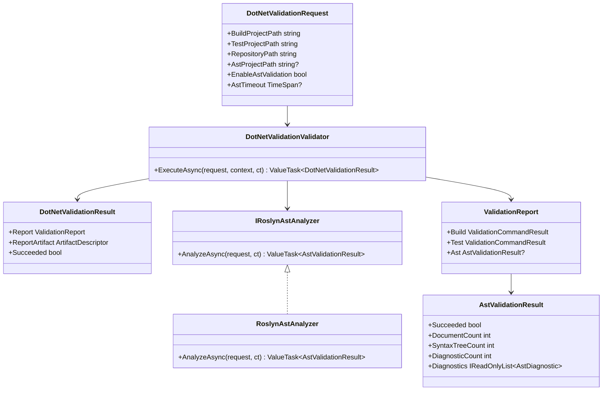

# Wip.Validation.DotNet AST Integration Requirements and Test Plan

> Scope: define behavior-proof requirements to add C#/.NET AST integration into `Wip.Validation.DotNet` so validation runs can execute source parsing at runtime, persist deterministic AST evidence, and fail safely when parsing cannot proceed.

---

## Functionality Worktree

### Verification Policy

- Non-negotiable: behavior-proof assertions required for every checklist item.
- Metadata-only assertions are supporting evidence only.
- API tests are valid only when thorough integration gates are asserted.
- Include absolute schedule gates when scheduled jobs are in scope.

### Coverage Inputs

| Input | Value |
|---|---|
| CsProject | Wip.Validation.DotNet |
| AnalysisSource | Audit of `DotNetValidationValidator` runtime flow plus requested C#/.NET AST integration scope |
| MandatoryItems | none (workflow-injected mandatory behavior-proof item enforced) |
| PlanType | requirements |
| OutputPath | .github/requirements/Wip.Validation.DotNet.md |

### Class Diagram

### Completeness Checklist

- [x] Add AST validation contracts (`AstValidationRequest`, `AstValidationResult`, diagnostic DTOs) in `Wip.Validation.DotNet` with explicit success/failure semantics [foundation for all AST runtime paths]
- [x] Add Roslyn-backed analyzer implementation that parses C# documents from a target project path and emits deterministic diagnostic payloads [depends on AST contracts] [transition-proof: .github/requirements/transition-proofs/checklist-item-roslyn-backed-analyzer-implementation-transition-proof-2026-05-31.md] [baseline-witness: .github/requirements/transition-proofs/baselines/checklist-item-roslyn-backed-analyzer-implementation.unchecked.snapshot-2026-05-31.md]
- [x] Extend `DotNetValidationRequest` with AST options (`EnableAstValidation`, `AstProjectPath`, `AstTimeout`) and validate input guards [depends on AST contracts] [transition-proof: .github/requirements/transition-proofs/checklist-item-dotnetvalidationrequest-ast-options-input-guards-transition-proof-2026-05-31.md] [baseline-witness: .github/requirements/transition-proofs/baselines/checklist-item-dotnetvalidationrequest-ast-options-input-guards.unchecked.snapshot-2026-05-31.md]
- [x] Integrate AST execution into `DotNetValidationValidator.ExecuteAsync` so build/test and AST evidence are produced in one runtime flow [depends on Roslyn analyzer + request contract extension] [transition-proof: .github/requirements/transition-proofs/checklist-item-integrate-ast-execution-runtime-flow-transition-proof-2026-05-31.md] [baseline-witness: .github/requirements/transition-proofs/baselines/checklist-item-integrate-ast-execution-runtime-flow.unchecked.snapshot-2026-05-31.md]
- [x] Persist AST evidence inside `ValidationReport` artifact (counts, diagnostics, success state, elapsed window) and keep serialization deterministic [depends on validator AST execution] [transition-proof: .github/requirements/transition-proofs/checklist-item-validationreport-ast-evidence-persistence-transition-proof-2026-05-31.md] [baseline-witness: .github/requirements/transition-proofs/baselines/checklist-item-validationreport-ast-evidence-persistence.unchecked.snapshot-2026-05-31.md]
- [x] Add deterministic negative-path behavior when AST parsing fails (invalid path, unsupported files, cancellation, timeout) without hiding failure evidence [depends on validator AST execution]
- [x] Register AST analyzer via DI with explicit ownership/lifetime expectations and verify runtime resolver behavior [depends on analyzer implementation] [transition-proof: .github/requirements/transition-proofs/checklist-item-register-ast-analyzer-via-di-transition-proof-2026-05-31.md] [baseline-witness: .github/requirements/transition-proofs/baselines/checklist-item-register-ast-analyzer-via-di.unchecked.snapshot-2026-05-31.md]
- [x] Add integration tests using temporary repositories/projects that prove AST analysis executes against real C# files and propagates diagnostic semantics [depends on all implementation items] [transition-proof: .github/requirements/transition-proofs/checklist-item-ast-integration-temp-repositories-diagnostic-semantics-transition-proof-2026-05-31.md] [baseline-witness: .github/requirements/transition-proofs/baselines/checklist-item-ast-integration-temp-repositories-diagnostic-semantics.unchecked.snapshot-2026-05-31.md]
- [x] Enforce absolute behavior-proof verification for every planned integration test [mandatory - behavior-proof policy]

### Checklist to Runtime-Proof Matrix

| Checklist Item | Primary Runtime Proof Path | Minimum Evidence |
|---|---|---|
| AST validation contracts | Runtime validator execution path | Validator returns `AstValidationResult` with stable success/failure fields consumed by test assertions |
| Roslyn-backed analyzer | Parser runtime path | Analyzer parses real `.cs` input, returns syntax tree count and diagnostics from live Roslyn execution |
| Request contract extension | Input guard runtime path | Invalid AST settings fail with deterministic exception contract before command execution |
| Validator AST integration | End-to-end validation runtime path | Single `ExecuteAsync` call runs build, test, and AST steps with expected sequencing and correlation |
| AST evidence persistence | Artifact persistence path | Saved JSON report contains AST section with deterministic shape and values proven via deserialization |
| Deterministic failure behavior | Negative runtime path | Invalid AST path/timeout/cancellation produce explicit failed AST result and retained report evidence |
| DI registration + ownership | Resolver runtime path | Container resolves AST analyzer in expected lifetime and validator uses resolved instance during execution |
| Integration coverage | Temp-repo execution path | Tests create real files/projects and verify AST diagnostics map to known code defects and clean paths |
| Behavior-proof compliance | Plan compliance gate | Every checklist item has executable runtime-proof tests; metadata-only checks are rejected |

---

## Test Plan

### AstValidationContracts

1. `AstValidationResult_GivenAnalyzerSuccess_ExposesDeterministicSuccessAndCountSemantics`
   *Assumption*: Runtime consumers can reliably determine AST execution success and parsed document/diagnostic counts from the returned contract.

2. `AstValidationResult_GivenAnalyzerFailure_ExposesFailureReasonAndPreservesDiagnostics`
   *Assumption*: Runtime failure states preserve actionable diagnostic payloads instead of collapsing to metadata-only status fields.

3. `AstDiagnostic_GivenRoslynDiagnosticProjection_PreservesRuleIdSeverityLocationAndMessage`
   *Assumption*: Projected diagnostics retain enough runtime detail to prove AST behavior and support deterministic assertions.

### RoslynAstAnalyzerAnalyzeAsync

1. `AnalyzeAsync_GivenCompilableProject_ReturnsSucceededResultWithParsedSyntaxTrees`
   *Assumption*: Running the analyzer against a real compilable C# project produces successful AST evidence at runtime.

2. `AnalyzeAsync_GivenKnownSyntaxError_ReturnsFailedResultWithExpectedDiagnosticRuleAndLocation`
   *Assumption*: Roslyn diagnostics from malformed C# code are surfaced through analyzer output with deterministic identifiers and source location.

3. `AnalyzeAsync_GivenCancellationRequested_StopsParsingAndReturnsDeterministicCanceledFailureContract`
   *Assumption*: Cancellation is enforced during runtime AST processing and produces a deterministic failure contract.

### DotNetValidationRequest AST Options

1. `ExecuteAsync_GivenEnableAstValidationWithoutAstProjectPath_ThrowsArgumentExceptionBeforeCommandExecution`
   *Assumption*: AST option guards fail fast in runtime when required configuration is missing.

2. `ExecuteAsync_GivenNonPositiveAstTimeout_ThrowsArgumentOutOfRangeException`
   *Assumption*: AST timeout guard clauses enforce deterministic runtime constraints and prevent invalid execution.

3. `ExecuteAsync_GivenAstValidationDisabled_SkipsAnalyzerInvocationAndPreservesBuildTestBehavior`
   *Assumption*: Runtime flow remains backward-compatible when AST validation is turned off.

### DotNetValidationValidator AST Integration

1. `ExecuteAsync_GivenAstValidationEnabled_RunsBuildTestThenAstAndReturnsUnifiedReport`
   *Assumption*: Validator runtime sequencing includes AST analysis in the same execution transaction as build/test.

2. `ExecuteAsync_GivenAnalyzerFailure_MarksOverallResultFailedAndPersistsAstFailureEvidence`
   *Assumption*: AST runtime failure contributes to result failure semantics and is persisted for downstream inspection.

3. `ExecuteAsync_GivenAnalyzerSuccess_PropagatesAstCorrelationAndElapsedWindowIntoReport`
   *Assumption*: Runtime AST execution metadata remains correlated with the current session report for deterministic tracing.

### ValidationReport AST Persistence

1. `ValidationReportArtifact_GivenAstExecution_PersistsAstSectionWithDeterministicJsonShape`
   *Assumption*: Persisted JSON artifacts include an AST section with stable schema and runtime values.

2. `ValidationReportArtifact_GivenKnownDiagnosticSet_RoundTripsDiagnosticsWithoutSemanticDrift`
   *Assumption*: Serialized and deserialized AST diagnostics preserve runtime semantics exactly.

3. `ValidationReportArtifact_GivenAstSkipped_RecordsExplicitSkippedStateInsteadOfNullAmbiguity`
   *Assumption*: Runtime consumers can distinguish skipped AST execution from execution failure through explicit persisted state.

### Ast Deterministic Negative Paths

1. `ExecuteAsync_GivenAstProjectPathMissingOnDisk_ReturnsFailedAstResultWithDeterministicNotFoundEvidence`
   *Assumption*: Missing-path failures are deterministic runtime outcomes with explicit evidence, not silent skips.

2. `ExecuteAsync_GivenAstTimeoutExceeded_ReportsTimedOutAstResultAndKeepsBuildTestEvidence`
   *Assumption*: AST timeout handling preserves existing build/test proof while emitting deterministic AST timeout evidence.

3. `ExecuteAsync_GivenPartialFileAccessFailures_CapturesFailingDocumentsAndContinuesDeterministicAggregation`
   *Assumption*: Runtime AST processing handles file-level faults deterministically and reports partial failure evidence.

### Ast Analyzer DI Registration and Ownership

1. `ServiceCollection_GivenAddWipValidationDotNet_ResolvesIRoslynAstAnalyzerWithExpectedLifetime`
   *Assumption*: Runtime DI composition resolves AST analyzer ownership and lifetime deterministically.

2. `DotNetValidationValidator_GivenResolvedAnalyzer_UsesContainerInstanceDuringAstExecution`
   *Assumption*: Validator executes AST analysis through DI-resolved analyzer instance rather than hidden static coupling.

3. `ServiceProvider_GivenMultipleValidationSessions_PreservesExpectedAnalyzerIsolationAcrossScopes`
   *Assumption*: Scoped or transient ownership semantics remain isolated across runtime validation sessions.

### AST Integration End-to-End Runtime Proofs

1. `ExecuteAsync_GivenTempRepositoryWithValidAndInvalidSources_ProducesExpectedAstDiagnosticSet`
   *Assumption*: End-to-end runtime analysis over real repository files produces deterministic diagnostics for known source conditions.

2. `ExecuteAsync_GivenSequentialValidationRuns_ProducesStableAstResultsForEquivalentInputs`
   *Assumption*: Equivalent runtime inputs produce stable AST outcomes across repeated executions.

3. `ExecuteAsync_GivenAstFailureOnSecondRun_PreservesIsolationAndDoesNotLeakPreviousRunDiagnostics`
   *Assumption*: Validation runs are runtime-isolated and do not leak AST diagnostic state between sessions.

### Absolute Behavior-Proof Compliance Gate

1. `BehaviorProofCompliance_GivenChecklistItems_RequiresExecutableRuntimeProofForEachItem`
   *Assumption*: Every checklist entry must be backed by executable runtime assertions.

2. `BehaviorProofCompliance_GivenMetadataOnlyAssertions_RejectsPlanAsNonCompliant`
   *Assumption*: Metadata-only checks are insufficient to satisfy AST integration requirements.

3. `BehaviorProofCompliance_GivenIntegrationScenarios_RequiresDeterministicRuntimeContractsForSuccessAndFailure`
   *Assumption*: Integration tests are compliant only when success and failure runtime contracts are explicitly proven.

---

*All assumptions verified by Falsify Claims. Zero Falsified rows.*
