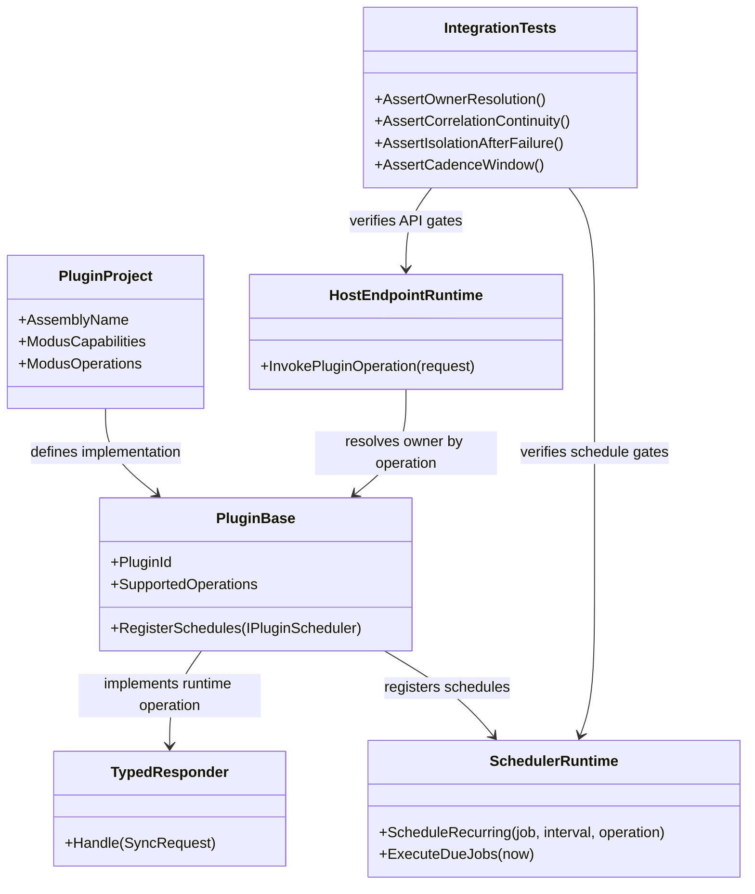

# all the projects

> Scope: Migrate plugin and sample plugin projects that are not aligned with the latest Modus plugin-authoring standards, with behavior-proof runtime verification as the acceptance gate.

---

## Functionality Worktree

### Verification Policy

- Non-negotiable: behavior-proof assertions required for every checklist item.
- Metadata-only assertions are supporting evidence only.
- API tests are valid only when thorough integration gates are asserted.
- Include absolute schedule gates when scheduled jobs are in scope.

### Coverage Matrix

| Migration Area | Required Runtime Outcome | Dependency Note | Status |
|---|---|---|---|
| Plugin/sample project structure alignment | Every plugin assembly resolves expected owner and operation set at runtime without cross-project source bleed | [foundation for all other migration steps] | In Progress |
| Contract and responder modernization | Migrated plugins execute through typed response contracts with deterministic rejection semantics | [depends on structure alignment] | Planned |
| Scheduled execution alignment | Migrated scheduled plugins run with deterministic cadence and bounded-window evidence | [depends on contract modernization] | Planned |
| API integration hardening | Endpoint behavior proves owner resolution, business semantics, correlation continuity, and isolation | [depends on previous migration areas] | Planned |
| Regression safety gates | CI-level tests block merge when migration breaks runtime behavior | [depends on all migration areas] | Planned |

### Class Diagram

### Completeness Checklist

- [x] Inventory all plugin and sample-plugin projects that fail latest authoring standards (project metadata, source layout, runtime contract shape) [dependency root - migration inventory]
- [x] Migrate each plugin/sample `.csproj` to latest baseline (`net10.0`, nullable enabled, implicit usings enabled, deterministic Modus metadata, and valid `Modus.Core` reference path/package) [depends on migration inventory]
- [x] Enforce one-plugin-per-assembly compile isolation (`EnableDefaultCompileItems=false` with explicit compile set, or equivalent folder isolation) for every migrating plugin project [depends on project baseline migration]
- [x] Migrate interface-only sample plugins to lifetime-specific base classes (`SingletonPlugin<T>`, `ScopedPlugin<T>`, or `TransientPlugin<T>`) with explicit runtime ownership semantics [depends on compile isolation] [transition-proof: .github/requirements/transition-proofs/checklist-item-lifetime-base-class-migration-transition-proof-2026-05-24.md]
- [x] Migrate plugin operation handlers to typed sync response contracts that prove business behavior, preserve correlation IDs, and return deterministic unsupported-operation rejection payloads [depends on plugin base-class migration]
- [x] Migrate scheduled plugins to deterministic recurring/one-time schedule registration with explicit cadence tolerances and operation ownership mapping [depends on typed sync response migration]
- [x] Add integration proofs for DI lifetime behavior (singleton/shared, scoped/per-scope, transient/per-resolution) under live host execution paths [depends on schedule migration and base-class migration] [transition-proof: .github/requirements/transition-proofs/checklist-item-di-lifetime-integration-proofs-transition-proof-2026-05-24.md]
- [x] Add endpoint integration proofs for owner uniqueness, business payload semantics, correlation continuity, and deterministic isolation after failed load/remove [depends on DI lifetime integration proofs]
- [x] Add hosted curl-style endpoint probe gate that boots the application and invokes every discovered plugin operation endpoint, failing on dispatch-failure contracts or HTTP 5xx responses [depends on endpoint integration proofs]
- [x] Add migration regression suite wiring so behavior-proof tests execute in CI and fail fast on runtime regressions [depends on all preceding migration items]
- [x] Enforce absolute behavior-proof verification for every planned integration test [mandatory - behavior-proof policy]

---

## Test Plan

### Migration inventory and standards gap detection

1. `DiscoverLegacyPluginProjects_GivenWorkspaceScan_ExpectedNonCompliantProjectsCataloged`
   *Assumption*: Scanning plugin and sample-plugin projects can deterministically identify standards violations that materially affect runtime behavior.
2. `DiscoverLegacyPluginProjects_GivenKnownLegacyPatterns_ExpectedEvidenceIncludesReferencePathAndContractShape`
   *Assumption*: The migration inventory is only complete when each finding is tied to executable runtime risk (load failure, wrong owner, missing operation handling, or schedule drift).

### Project baseline migration

1. `BuildPluginProject_GivenMigratedBaselineCsproj_ExpectedProjectBuildsAndLoadsInHostRuntime`
   *Assumption*: Updating project baseline properties is correct only if the plugin builds and is activated by host runtime.
2. `LoadPluginDescriptor_GivenValidModusMetadata_ExpectedDescriptorUsesDeterministicIdentityAndOperations`
   *Assumption*: Metadata migration is compliant only when descriptor identity/capabilities/operations are deterministically parsed and observable in runtime registration.
3. `RejectPluginDescriptor_GivenInvalidCoreReferenceOrMetadata_ExpectedDeterministicLoadFailureContract`
   *Assumption*: Negative-path migration quality requires deterministic rejection semantics when project references or metadata remain invalid.

### Compile isolation migration

1. `ResolvePluginOwner_GivenOperationDeclaredBySingleMigratedPlugin_ExpectedUniqueOwnerWithoutCrossAssemblyBleed`
   *Assumption*: Compile isolation is proven only when operation ownership resolves uniquely at runtime.
2. `InvokePluginOperation_GivenParallelAssembliesAfterIsolation_ExpectedNoForeignTypeExecutionSideEffects`
   *Assumption*: Assembly compile-item isolation is behavior-proof only when calls cannot execute implementation types from unrelated plugin projects.

### Base-class migration for sample plugins

1. `ActivateSamplePlugin_GivenMigratedLifetimeBaseClass_ExpectedLifecycleHooksExecuteInDeterministicOrder`
   *Assumption*: Migrating to lifetime base classes must be validated through observable lifecycle execution order, not type metadata alone.
2. `RegisterPluginServices_GivenMigratedSamplePlugin_ExpectedServicesResolvedThroughDeclaredLifetimePath`
   *Assumption*: Base-class migration is correct only if DI resolution follows the declared plugin lifetime path under live runtime activation.

### Typed responder and rejection-contract migration

1. `Handle_GivenSupportedOperation_ExpectedTypedPayloadBusinessSemanticsAndSuccessContract`
   *Assumption*: Typed responder migration must prove operation-specific business semantics in response payloads on successful dispatch.
2. `Handle_GivenUnsupportedOperation_ExpectedRejectedStatusErrorPayloadAndCorrelationContinuity`
   *Assumption*: Unsupported-operation paths are compliant only when rejection payload semantics and correlation continuity are verified end to end.
3. `InvokePluginEndpoint_GivenTypedResponderMigration_ExpectedApiResponseContractMatchesRuntimeDispatchResult`
   *Assumption*: API behavior is compliant only when endpoint response contract is proven to be produced by actual runtime dispatch.

### Scheduled execution migration

1. `RegisterSchedules_GivenMigratedScheduledPlugin_ExpectedDeterministicJobNamesIntervalsAndOperationOwnership`
   *Assumption*: Schedule migration is valid only if runtime schedule catalog preserves deterministic identity and operation ownership.
2. `ExecuteRecurringSchedule_GivenBoundedWindow_ExpectedMinimumRunCountAndCadenceWithinTolerance`
   *Assumption*: Recurring schedules are compliant only when execution count and cadence deltas match explicit window/tolerance rules.
3. `ExecuteOneTimeSchedule_GivenAllowedWindow_ExpectedRunsExactlyOnceWithExpectedOutcome`
   *Assumption*: One-time scheduling compliance requires exact-once behavior proof in the allowed execution window.
4. `ExecuteScheduledOperation_GivenResolverUnavailable_ExpectedDeterministicUnresolvableViaDiFailureEvidence`
   *Assumption*: Scheduled negative paths are compliant only when resolver-unavailable failures are deterministic and observable.

### DI lifetime integration proofs

1. `ResolveSingletonPlugin_GivenMultipleRequests_ExpectedSameInstanceIdAcrossRequests`
   *Assumption*: Singleton behavior is proven only through live request evidence showing stable instance identity.
2. `ResolveScopedPlugin_GivenSameScopeAndDifferentScopes_ExpectedSharedWithinScopeAndDifferentAcrossScopes`
   *Assumption*: Scoped behavior requires proof of within-scope reuse and cross-scope separation under real runtime scopes.
3. `ResolveTransientPlugin_GivenMultipleResolutions_ExpectedDifferentInstanceIdPerResolution`
   *Assumption*: Transient behavior is proven only when every live resolution produces a new instance identity.

### Endpoint behavior-proof integration gates

1. `InvokeOperationEndpoint_GivenAmbiguousOwners_ExpectedDeterministicFailureAndNoOperationExecution`
   *Assumption*: Owner resolution correctness requires deterministic block behavior when owner uniqueness is violated.
2. `InvokeOperationEndpoint_GivenSuccessfulExecution_ExpectedBusinessPayloadSemanticsAndCorrelationMatch`
   *Assumption*: API success compliance requires both business semantics proof and response/request correlation equality.
3. `InvokeOperationEndpoint_GivenPluginLoadFailure_ExpectedIsolationAndNoSideEffectExecution`
   *Assumption*: Isolation guarantees are proven only if failed plugin load/remove states prevent side-effect execution.
4. `InvokeOperationEndpoint_GivenRejectedPath_ExpectedNegativeContractProofBeyondHttpStatus`
   *Assumption*: Rejection-path quality requires validating response contract fields, not only HTTP status codes.

### Hosted curl-style endpoint gate

1. `CurlGate_GivenHostRuntimeStarted_ExpectedNoDispatchFailureAcrossPluginOperationEndpoints`
   *Assumption*: Hosting the real app and invoking plugin endpoints with curl-style HTTP probes must fail the suite whenever any runtime dispatch target is non-executable or returns dispatch-failure.
2. `CurlGate_GivenRuntimeCatalogProbe_ExpectedAllOperationEndpointsReturnNon5xxBehaviorContracts`
   *Assumption*: Every discovered operation endpoint in the runtime catalog must return behavior-proof contracts and cannot rely on unresolved plugin type placeholders.

### Regression suite wiring

1. `RunMigrationIntegrationSuite_GivenAnyPluginMigrationChange_ExpectedBehaviorProofTestsExecuteInCiGate`
   *Assumption*: Migration safety requires CI to execute and enforce all behavior-proof integration tests.
2. `RunMigrationIntegrationSuite_GivenBehaviorRegression_ExpectedPipelineFailsWithActionableFailureSignal`
   *Assumption*: A compliant regression gate must fail deterministically when runtime behavior contracts are violated.

### Mandatory behavior-proof policy enforcement

1. `ValidatePlannedIntegrationTests_GivenChecklistItem_ExpectedAtLeastOneRuntimeProofPathPerItem`
   *Assumption*: Checklist completion is invalid unless each item maps to a test with concrete runtime proof.
2. `ValidatePlannedIntegrationTests_GivenMetadataOnlyAssertions_ExpectedPlanRejectedAsNonCompliant`
   *Assumption*: Metadata-only assertions cannot satisfy the policy and must be explicitly rejected.
3. `ValidateApiIntegrationPlan_GivenApiFocusedItem_ExpectedOwnerSemanticsLifetimeCorrelationAndIsolationGates`
   *Assumption*: API-focused plans are compliant only when all absolute API integration gates are present.

---

## Format Gate Results

| # | Rule | Status | Violations |
|---|---|---|---|
| 1 | Heading structure and separators | ✅ Pass | — |
| 2 | Scope statement under H1 | ✅ Pass | — |
| 3 | Pipe tables present | ✅ Pass | — |
| 4 | Checklists with dependency tags | ✅ Pass | — |
| 5 | Mermaid diagrams (conditional) | ✅ Pass | — |
| 6 | Verification gate evidence | ✅ Pass | — |
| 7 | Closing verification line | ✅ Pass | — |
| 8 | Numbered test plan items | ✅ Pass | — |

**PASS** - document conforms to plan format.

---

## Absolute Behavior Verification Compliance Check

| Condition | Result | Evidence |
|---|---|---|
| Every checklist item maps to named tests | Pass | Each checklist item has a corresponding test-plan subsection and numbered xUnit test names |
| Behavior-proof assertions present for every item | Pass | Every test entry includes runtime-proof assumptions (DI resolution, API dispatch, schedule execution, or deterministic rejection) |
| Metadata-only test evidence absent as sole proof | Pass | No item relies only on descriptor/metadata checks; each includes executable runtime verification |
| API-focused items include absolute integration gates | Pass | Owner uniqueness, business semantics, DI lifetime path, correlation continuity, isolation, and negative-contract proofs are explicitly covered |

---

## Live Endpoint Probe Evidence (2026-05-24)

| Endpoint | HTTP | Response Code | Observed Failure |
|---|---|---|---|
| `/api/Plugin.Orders.Fulfillment/Orders.AllocateInventory` | 500 | `dispatch-failure` | Runtime dispatch target does not declare a plugin type name |
| `/api/Plugin.Orders.Fulfillment/Orders.CreateShipment` | 500 | `dispatch-failure` | Runtime dispatch target does not declare a plugin type name |
| `/api/Plugin.Payments.Gateway/Payments.EmitSettlement` | 500 | `dispatch-failure` | Runtime dispatch target does not declare a plugin type name |
| `/api/Plugin.Payments.Gateway/Payments.SyncLedger` | 500 | `dispatch-failure` | Runtime dispatch target does not declare a plugin type name |
| `/api/Plugin.Timer/Timer.WriteCurrentTime` | 500 | `dispatch-failure` | Runtime dispatch target does not declare a plugin type name |
| `/api/Modus.Core/Timer.WriteCurrentTime` | 500 | `dispatch-failure` | No `ISyncResponder` resolved for `Modus.Core.Plugins.TimerPlugin` |

This evidence is the acceptance driver for the hosted curl-style endpoint gate and must remain green before migration checklist completion.

*All assumptions verified by Falsify Claims. Zero Falsified rows.*