# Requirements: Journal-Driven Codebase Distillation System

> Design and implementation requirements for a journal-driven codebase distillation system for LovelaceSharp. The system fits natively into the existing `.github/prompts/` skill/workflow/rule/reference taxonomy and enables AI agents to incrementally explore the codebase, record grounded findings, falsify weak claims (reusing the existing `skill-falsify-claims`), distill stable knowledge, and verify completeness — producing trustworthy downstream artifacts like architecture maps, migration plans, and risk assessments.

---

## Functionality Worktree

### Class Diagram

```mermaid
graph TD
    subgraph References
        JS[journal-schema.md]
        DKS[distilled-knowledge-schema.md]
    end

    subgraph Skills
        SJO[skill-journal-observe]
        SJH[skill-journal-hypothesize]
        SJV[skill-journal-validate]
        SJD[skill-journal-distill]
        SCR[skill-completeness-review]
        SCM[skill-convergence-metrics]
    end

    subgraph Workflow
        WCE[workflow-codebase-exploration]
    end

    subgraph Rules
        RAA[rule-architecture-analysis]
        RMA[rule-migration-analysis]
    end

    subgraph ExistingSkills
        SFC[skill-falsify-claims]
        SIC[skill-impl-completeness]
        SPFG[skill-plan-format-gate]
    end

    subgraph JournalStore[".github/journals/"]
        OBS[observations.md]
        HYP[hypotheses.md]
        VAL[validations.md]
        DEC[decisions.md]
        TOD[todos.md]
        RSK[risks.md]
        OQ[open-questions.md]
        AI[artifact-index.md]
    end

    subgraph DistilledStore[".github/distilled/"]
        SO[system-overview.md]
        MM[module-map.md]
        DC[domain-concepts.md]
        RF[runtime-flows.md]
        DEP[dependencies.md]
        IAR[invariants-and-risks.md]
        MF[migration-findings.md]
        TF[trusted-facts.md]
        UA[unresolved-areas.md]
        GL[glossary.md]
    end

    subgraph StateStore[".github/state/"]
        CM[convergence-metrics.md]
    end

    %% Skill dependencies on references
    SJO --> JS
    SJH --> JS
    SJV --> JS
    SJD --> JS
    SJD --> DKS
    SCR --> JS

    %% Skill wrapping/reuse of existing skills
    SJV --> SFC
    SCR --> SIC
    SPFG -.->|extended for journal/distilled types| JS
    SPFG -.->|extended for journal/distilled types| DKS

    %% Workflow orchestrates skills
    WCE --> SJO
    WCE --> SJH
    WCE --> SJV
    WCE --> SJD
    WCE --> SCR
    WCE --> SCM

    %% Rules pre-configure workflow
    RAA --> WCE
    RMA --> WCE

    %% Skills write to journals
    SJO --> OBS
    SJO --> TOD
    SJH --> HYP
    SJV --> VAL
    SJD --> DEC
    SJD --> AI
    SCR --> OQ
    SCR --> TOD

    %% Distiller reads journals, produces distilled
    SJD --> SO
    SJD --> MM
    SJD --> DC
    SJD --> RF
    SJD --> DEP
    SJD --> IAR
    SJD --> MF
    SJD --> TF
    SJD --> UA
    SJD --> GL

    %% Metrics reads all, writes state
    SCM --> CM
```

### Deliverable Mapping Table

| Phase | Deliverable | Type | Location | Dependencies |
|---|---|---|---|---|
| Scaffolding | `.github/journals/` directory | Directory | `.github/journals/` | None |
| Scaffolding | `.github/distilled/` directory | Directory | `.github/distilled/` | None |
| Scaffolding | `.github/artifacts/` directory | Directory | `.github/artifacts/` | None |
| Scaffolding | `.github/state/` directory | Directory | `.github/state/` | None |
| References | `journal-schema.md` | Reference | `.github/prompts/journal-schema.md` | None |
| References | `distilled-knowledge-schema.md` | Reference | `.github/prompts/distilled-knowledge-schema.md` | `journal-schema.md` |
| Journals | `observations.md` | Journal file | `.github/journals/observations.md` | `journal-schema.md` |
| Journals | `hypotheses.md` | Journal file | `.github/journals/hypotheses.md` | `journal-schema.md` |
| Journals | `validations.md` | Journal file | `.github/journals/validations.md` | `journal-schema.md` |
| Journals | `decisions.md` | Journal file | `.github/journals/decisions.md` | `journal-schema.md` |
| Journals | `todos.md` | Journal file | `.github/journals/todos.md` | `journal-schema.md` |
| Journals | `risks.md` | Journal file | `.github/journals/risks.md` | `journal-schema.md` |
| Journals | `open-questions.md` | Journal file | `.github/journals/open-questions.md` | `journal-schema.md` |
| Journals | `artifact-index.md` | Journal file | `.github/journals/artifact-index.md` | `journal-schema.md` |
| Distilled | `system-overview.md` | Distilled knowledge | `.github/distilled/system-overview.md` | `distilled-knowledge-schema.md` |
| Distilled | `module-map.md` | Distilled knowledge | `.github/distilled/module-map.md` | `distilled-knowledge-schema.md` |
| Distilled | `domain-concepts.md` | Distilled knowledge | `.github/distilled/domain-concepts.md` | `distilled-knowledge-schema.md` |
| Distilled | `runtime-flows.md` | Distilled knowledge | `.github/distilled/runtime-flows.md` | `distilled-knowledge-schema.md` |
| Distilled | `dependencies.md` | Distilled knowledge | `.github/distilled/dependencies.md` | `distilled-knowledge-schema.md` |
| Distilled | `invariants-and-risks.md` | Distilled knowledge | `.github/distilled/invariants-and-risks.md` | `distilled-knowledge-schema.md` |
| Distilled | `migration-findings.md` | Distilled knowledge | `.github/distilled/migration-findings.md` | `distilled-knowledge-schema.md` |
| Distilled | `trusted-facts.md` | Distilled knowledge | `.github/distilled/trusted-facts.md` | `distilled-knowledge-schema.md` |
| Distilled | `unresolved-areas.md` | Distilled knowledge | `.github/distilled/unresolved-areas.md` | `distilled-knowledge-schema.md` |
| Distilled | `glossary.md` | Distilled knowledge | `.github/distilled/glossary.md` | `distilled-knowledge-schema.md`, `legacy-knowledge-map.md` |
| State | `convergence-metrics.md` | State snapshot | `.github/state/convergence-metrics.md` | `journal-schema.md` |
| Skills | `skill-journal-observe.prompt.md` | Skill | `.github/prompts/skill-journal-observe.prompt.md` | `journal-schema.md`, `legacy-knowledge-map.md`, `codebase-patterns.md` [prerequisite for workflow] |
| Skills | `skill-journal-hypothesize.prompt.md` | Skill | `.github/prompts/skill-journal-hypothesize.prompt.md` | `journal-schema.md` [prerequisite for workflow] |
| Skills | `skill-journal-validate.prompt.md` | Skill | `.github/prompts/skill-journal-validate.prompt.md` | `journal-schema.md`, `skill-falsify-claims.prompt.md` [prerequisite for workflow] |
| Skills | `skill-journal-distill.prompt.md` | Skill | `.github/prompts/skill-journal-distill.prompt.md` | `journal-schema.md`, `distilled-knowledge-schema.md`, `skill-falsify-claims.prompt.md` [prerequisite for workflow] |
| Skills | `skill-completeness-review.prompt.md` | Skill | `.github/prompts/skill-completeness-review.prompt.md` | `journal-schema.md`, `skill-impl-completeness.prompt.md` [prerequisite for workflow] |
| Skills | `skill-convergence-metrics.prompt.md` | Skill | `.github/prompts/skill-convergence-metrics.prompt.md` | `journal-schema.md` [prerequisite for workflow] |
| Workflow | `workflow-codebase-exploration.prompt.md` | Workflow | `.github/prompts/workflow-codebase-exploration.prompt.md` | All 6 skills, both references [depends on all skills] |
| Rules | `rule-architecture-analysis.prompt.md` | Rule | `.github/prompts/rule-architecture-analysis.prompt.md` | `workflow-codebase-exploration.prompt.md` [depends on workflow] |
| Rules | `rule-migration-analysis.prompt.md` | Rule | `.github/prompts/rule-migration-analysis.prompt.md` | `workflow-codebase-exploration.prompt.md` [depends on workflow] |
| Integration | Update `copilot-instructions.md` | Existing file update | `.github/copilot-instructions.md` | All new files [depends on everything above] |
| Integration | Extend `skill-plan-format-gate.prompt.md` | Existing file update | `.github/prompts/skill-plan-format-gate.prompt.md` | `journal-schema.md`, `distilled-knowledge-schema.md` [depends on references] |

### Completeness Checklist

#### Phase 0 — Scaffolding

- [x] Create `.github/journals/` directory [prerequisite for all journal files]
- [x] Create `.github/distilled/` directory [prerequisite for all distilled knowledge files]
- [x] Create `.github/artifacts/` directory [prerequisite for downstream generated documents]
- [x] Create `.github/state/` directory [prerequisite for convergence metrics]

#### Phase 1 — Reference Files

- [x] `journal-schema.md` — entry templates for OBS, HYP, VAL, DEC, TODO, RISK, OQ, and ART-index; includes field definitions (Source, Fact, Implications, Confidence, Status, Related), ID format `{TYPE}-{NNN}`, and confidence levels (High/Medium/Low) [prerequisite for all skills and journal files]
- [x] `distilled-knowledge-schema.md` — header template (Scope, Confidence, Last updated, Source entries), inline uncertainty markers (✅ Verified, ⚠️ Tentative, ❓ Unverified), and update criteria (falsification, validation, completeness review, coverage extension) [depends on journal-schema.md; prerequisite for distill skill]

#### Phase 2 — Journal Files (templated, append-only)

- [x] `.github/journals/observations.md` — init with header metadata and OBS entry template; fields: Source (`file:line`), Fact, Implications, Confidence (High/Medium/Low), Related [depends on journal-schema.md]
- [x] `.github/journals/hypotheses.md` — init with header metadata and HYP entry template; fields: Claim, Supporting OBS, Why it matters, Falsification strategy, Status (Proposed/Under review/Supported/Falsified/Superseded), Confidence [depends on journal-schema.md]
- [x] `.github/journals/validations.md` — init with header metadata and VAL entry template; fields: Target HYP, Method, Evidence examined, Result (Supported/Falsified/Unresolved), Conclusion, Related [depends on journal-schema.md]
- [x] `.github/journals/decisions.md` — init with header metadata and DEC entry template; fields: Decision, Rationale (with evidence links), Alternatives considered, Related [depends on journal-schema.md]
- [x] `.github/journals/todos.md` — init with header metadata and TODO entry template; fields: Task, Priority (P0/P1/P2), Depends on, Status (Open/In progress/Done/Cancelled), Related [depends on journal-schema.md]
- [x] `.github/journals/risks.md` — init with header metadata and RISK entry template; fields: Risk, Likelihood (High/Medium/Low), Impact (High/Medium/Low), Evidence, Mitigation [depends on journal-schema.md]
- [x] `.github/journals/open-questions.md` — init with header metadata and OQ entry template; fields: Question, Needed evidence, Priority (P0/P1/P2), Related [depends on journal-schema.md]
- [x] `.github/journals/artifact-index.md` — init with header metadata and ART entry template; fields: Artifact path, Type (architecture-report/migration-plan/risk-assessment/implementation-plan), Supporting evidence (OBS/HYP/VAL lists), Confidence, Last updated [depends on journal-schema.md]

#### Phase 3 — Distilled Knowledge Files (templated with headers)

- [x] `.github/distilled/system-overview.md` — high-level architecture description; sourced from OBS (project structure), VAL (boundary claims) [depends on distilled-knowledge-schema.md]
- [x] `.github/distilled/module-map.md` — per-project responsibilities and interfaces; sourced from OBS (class surface), supported HYP, VAL [depends on distilled-knowledge-schema.md]
- [x] `.github/distilled/domain-concepts.md` — BCD packing, periodic decimals, exponent model; sourced from OBS, validated HYP [depends on distilled-knowledge-schema.md]
- [x] `.github/distilled/runtime-flows.md` — key execution paths (parse→compute→format, division period detection); sourced from OBS (call chains), VAL [depends on distilled-knowledge-schema.md]
- [x] `.github/distilled/dependencies.md` — inter-project and external dependencies; sourced from OBS, VAL (boundary claims) [depends on distilled-knowledge-schema.md]
- [x] `.github/distilled/invariants-and-risks.md` — architectural invariants plus known risks; sourced from supported HYP, RISK entries [depends on distilled-knowledge-schema.md]
- [x] `.github/distilled/migration-findings.md` — C++ → C# migration decisions and lessons; sourced from DEC, VAL, OBS [depends on distilled-knowledge-schema.md]
- [x] `.github/distilled/trusted-facts.md` — claims with High confidence + Supported validation only; **strict ✅ markers only** [depends on distilled-knowledge-schema.md]
- [x] `.github/distilled/unresolved-areas.md` — gaps, weak evidence, open questions; sourced from OQ, unresolved VAL [depends on distilled-knowledge-schema.md]
- [x] `.github/distilled/glossary.md` — domain terms (Portuguese → English, BCD terminology); extends `legacy-knowledge-map.md` [depends on distilled-knowledge-schema.md, legacy-knowledge-map.md]

#### Phase 4 — State Files

- [x] `.github/state/convergence-metrics.md` — metrics table: modules explored, execution flows mapped, dependencies verified, OBS/HYP/VAL counts, P0 open questions, risk count, distilled doc update count, artifact confidence avg, inferred:observed ratio, repeated hotspots; includes stopping criteria (module coverage ≥ 100%, zero P0 OQ, all distilled ≥ Medium confidence, inferred:observed < 0.1, all artifacts with ≥ 3 evidence links) [depends on journal-schema.md]

#### Phase 5 — Skills (dependency order)

- [x] `skill-journal-observe.prompt.md` — Explorer role: inputs narrow exploration objective (file/module/flow); outputs OBS entries, TODO entries, optionally HYP entries; appends to `observations.md`, optionally `hypotheses.md` and `todos.md`; **constraint: only factual observations grounded in read source; forbidden: inferring behavior without code evidence** [depends on journal-schema.md, legacy-knowledge-map.md, codebase-patterns.md; prerequisite for workflow]
- [x] `skill-journal-hypothesize.prompt.md` — Theorist role: inputs OBS entries + context; outputs HYP entries with falsification strategies; appends to `hypotheses.md`; **constraint: must propose falsification strategy before entering HYP** [depends on journal-schema.md; prerequisite for workflow]
- [x] `skill-journal-validate.prompt.md` — Skeptic/Falsifier role: inputs list of HYP entries or artifact claims; outputs VAL entries; appends to `validations.md`, updates HYP status; wraps `skill-falsify-claims.prompt.md`; **constraint: mandatory ≥ 2 falsification tactics per claim from 7 tactics (alternate entrypoints, bypass paths, special-case conditionals, hidden write paths, duplicate implementations, contradicting tests, infrastructure divergence); forbidden: accepting claims without counter-evidence search** [depends on journal-schema.md, skill-falsify-claims.prompt.md; prerequisite for workflow]
- [x] `skill-journal-distill.prompt.md` — Synthesizer role: inputs range of journal entries; outputs updated distilled knowledge documents; appends to `decisions.md`, updates `artifact-index.md`; **constraint: only Supported or ⚠️ Tentative claims; forbidden: promoting unvalidated HYP to facts; forbidden: removing uncertainty markers** [depends on journal-schema.md, distilled-knowledge-schema.md, skill-falsify-claims.prompt.md; prerequisite for workflow]
- [x] `skill-completeness-review.prompt.md` — Reviewer role: inputs current distilled docs + journal state; outputs coverage gaps, new OQ and TODO entries; checks 12 dimensions (modules, domain entities, execution flows, critical dependencies, configuration surfaces, test coverage, thread safety, edge cases, legacy gaps, scheduled/background, auth boundaries, failure behavior, deployment assumptions); **forbidden: declaring completeness without checking every dimension** [depends on journal-schema.md, skill-impl-completeness.prompt.md; prerequisite for workflow]
- [x] `skill-convergence-metrics.prompt.md` — Metrics role: inputs current journal + distilled state; outputs updated convergence metrics snapshot; computes all metrics and evaluates stopping criteria [depends on journal-schema.md; prerequisite for workflow]

#### Phase 6 — Workflow

- [x] `workflow-codebase-exploration.prompt.md` — orchestrates one complete exploration cycle in 7 steps: (1) READ current distilled + TODOs, (2) SELECT one narrow objective, (3) EXPLORE via skill-journal-observe, (4) VALIDATE via skill-journal-validate, (5) ASSESS risks/OQ, (6) DISTILL if warranted via skill-journal-distill, (7) METRICS via skill-convergence-metrics; includes focused vs. broad exploration guidelines [depends on all 6 skills, both references]

#### Phase 7 — Rules

- [x] `rule-architecture-analysis.prompt.md` — pre-configures `workflow-codebase-exploration` for architecture/design documentation; targets `system-overview`, `module-map`, `domain-concepts`, `dependencies`, `runtime-flows`, `invariants-and-risks` [depends on workflow-codebase-exploration.prompt.md]
- [x] `rule-migration-analysis.prompt.md` — pre-configures `workflow-codebase-exploration` for C++ → C# migration planning; targets `migration-findings`, `trusted-facts`, `unresolved-areas`, `module-map` [depends on workflow-codebase-exploration.prompt.md]

#### Phase 8 — Integration Updates

- [x] Update `.github/copilot-instructions.md` — add "Journal-Driven Codebase Distillation System" section with full file table (prompts, journals, distilled, state, artifacts) and lightweight vs. heavyweight usage guidance [depends on all new files]
- [x] Extend `.github/prompts/skill-plan-format-gate.prompt.md` — add conditional validation rules for `PlanType = "journal-entry"` (OBS/HYP/VAL/DEC/TODO/RISK/OQ entry validation) and `PlanType = "distilled"` (scope, confidence, source entries, uncertainty markers) [depends on journal-schema.md, distilled-knowledge-schema.md]

#### Phase 9 — Validation Trial

- [ ] Execute one full exploration cycle on `Lovelace.Representation` — verify all 7 journal files populate, at least 1 distilled doc updates, metrics produce non-zero values [depends on all phases above; mandatory integration test]

---

## Test Plan

### `Phase 0 — Scaffolding`

1. `Scaffolding_GivenFreshWorkspace_JournalsDirectoryExists`
   *Assumption*: After scaffolding, the path `.github/journals/` exists and is a directory.

2. `Scaffolding_GivenFreshWorkspace_DistilledDirectoryExists`
   *Assumption*: After scaffolding, the path `.github/distilled/` exists and is a directory.

3. `Scaffolding_GivenFreshWorkspace_ArtifactsDirectoryExists`
   *Assumption*: After scaffolding, the path `.github/artifacts/` exists and is a directory.

4. `Scaffolding_GivenFreshWorkspace_StateDirectoryExists`
   *Assumption*: After scaffolding, the path `.github/state/` exists and is a directory.

---

### `journal-schema.md` (Reference)

1. `JournalSchema_GivenFile_ContainsAllSevenEntryTemplates`
   *Assumption*: The file defines templates for OBS, HYP, VAL, DEC, TODO, RISK, and OQ entry types.

2. `JournalSchema_GivenFile_ContainsArtifactIndexTemplate`
   *Assumption*: The file defines the ART-index entry template with fields: Artifact path, Type, Supporting evidence, Confidence, Last updated.

3. `JournalSchema_GivenOBSTemplate_ContainsSourceFactImplicationsConfidenceRelated`
   *Assumption*: The OBS template includes Source (`file:line`), Fact, Implications, Confidence (High/Medium/Low), and Related fields.

4. `JournalSchema_GivenHYPTemplate_ContainsFalsificationStrategy`
   *Assumption*: The HYP template mandates a Falsification strategy field with status lifecycle (Proposed → Under review → Supported/Falsified/Superseded).

5. `JournalSchema_GivenVALTemplate_RequiresResultField`
   *Assumption*: The VAL template includes a Result field constrained to Supported/Falsified/Unresolved and requires evidence citations.

6. `JournalSchema_GivenTODOTemplate_ContainsPriorityAndStatus`
   *Assumption*: The TODO template includes Priority (P0/P1/P2) and Status (Open/In progress/Done/Cancelled) fields.

7. `JournalSchema_GivenIDFormat_FollowsTypeNNNPattern`
   *Assumption*: Entry IDs follow the format `{TYPE}-{NNN}` (e.g., `OBS-001`, `HYP-042`).

---

### `distilled-knowledge-schema.md` (Reference)

1. `DistilledSchema_GivenFile_ContainsHeaderTemplate`
   *Assumption*: The file defines a header template with fields: Scope, Confidence (overall), Last updated (date), Source entries (journal IDs).

2. `DistilledSchema_GivenFile_DefinesThreeUncertaintyMarkers`
   *Assumption*: The file specifies ✅ Verified (backed by Supported validation), ⚠️ Tentative (supporting observations but no formal validation), and ❓ Unverified (inferred from naming/structure/analogy).

3. `DistilledSchema_GivenFile_DefinesUpdateCriteria`
   *Assumption*: The file lists four update triggers: claim falsified/revised, tentative conclusion gains Supported validation, completeness review identifies gap, new observations extend coverage.

---

### `Journal Files` (Templated Init)

1. `JournalObservations_GivenInit_ContainsHeaderAndOBSTemplate`
   *Assumption*: `.github/journals/observations.md` is created with a title header and an embedded OBS entry template ready for append.

2. `JournalHypotheses_GivenInit_ContainsHeaderAndHYPTemplate`
   *Assumption*: `.github/journals/hypotheses.md` is created with a title header and an embedded HYP entry template ready for append.

3. `JournalValidations_GivenInit_ContainsHeaderAndVALTemplate`
   *Assumption*: `.github/journals/validations.md` is created with a title header and an embedded VAL entry template ready for append.

4. `JournalDecisions_GivenInit_ContainsHeaderAndDECTemplate`
   *Assumption*: `.github/journals/decisions.md` is created with a title header and an embedded DEC entry template ready for append.

5. `JournalTodos_GivenInit_ContainsHeaderAndTODOTemplate`
   *Assumption*: `.github/journals/todos.md` is created with a title header and an embedded TODO entry template ready for append.

6. `JournalRisks_GivenInit_ContainsHeaderAndRISKTemplate`
   *Assumption*: `.github/journals/risks.md` is created with a title header and an embedded RISK entry template ready for append.

7. `JournalOpenQuestions_GivenInit_ContainsHeaderAndOQTemplate`
   *Assumption*: `.github/journals/open-questions.md` is created with a title header and an embedded OQ entry template ready for append.

8. `JournalArtifactIndex_GivenInit_ContainsHeaderAndARTTemplate`
   *Assumption*: `.github/journals/artifact-index.md` is created with a title header and an embedded ART entry template ready for append.

---

### `Distilled Knowledge Files` (Templated Init)

1. `DistilledSystemOverview_GivenInit_ContainsStandardHeader`
   *Assumption*: `.github/distilled/system-overview.md` contains the standard distilled header (Scope, Confidence, Last updated, Source entries) and describes its purpose as high-level architecture.

2. `DistilledModuleMap_GivenInit_ContainsStandardHeader`
   *Assumption*: `.github/distilled/module-map.md` contains the standard distilled header and describes per-project responsibilities and interfaces.

3. `DistilledDomainConcepts_GivenInit_ContainsStandardHeader`
   *Assumption*: `.github/distilled/domain-concepts.md` contains the standard distilled header and describes BCD packing, periodic decimals, and exponent model.

4. `DistilledRuntimeFlows_GivenInit_ContainsStandardHeader`
   *Assumption*: `.github/distilled/runtime-flows.md` contains the standard distilled header and describes key execution paths.

5. `DistilledDependencies_GivenInit_ContainsStandardHeader`
   *Assumption*: `.github/distilled/dependencies.md` contains the standard distilled header and describes inter-project and external dependencies.

6. `DistilledInvariantsAndRisks_GivenInit_ContainsStandardHeader`
   *Assumption*: `.github/distilled/invariants-and-risks.md` contains the standard distilled header and describes architectural invariants plus known risks.

7. `DistilledMigrationFindings_GivenInit_ContainsStandardHeader`
   *Assumption*: `.github/distilled/migration-findings.md` contains the standard distilled header and describes C++ → C# migration decisions.

8. `DistilledTrustedFacts_GivenInit_ContainsStandardHeaderWithStrictMarkers`
   *Assumption*: `.github/distilled/trusted-facts.md` contains the standard distilled header and enforces only ✅ markers (no ⚠️ or ❓ allowed).

9. `DistilledUnresolvedAreas_GivenInit_ContainsStandardHeader`
   *Assumption*: `.github/distilled/unresolved-areas.md` contains the standard distilled header and describes gaps, weak evidence, and open questions.

10. `DistilledGlossary_GivenInit_ExtendLegacyKnowledgeMap`
    *Assumption*: `.github/distilled/glossary.md` references and extends `legacy-knowledge-map.md` with domain terms.

---

### `convergence-metrics.md` (State)

1. `ConvergenceMetrics_GivenInit_ContainsMetricsTable`
   *Assumption*: `.github/state/convergence-metrics.md` contains a pipe table with columns: Metric, Value, Trend.

2. `ConvergenceMetrics_GivenInit_TracksAllRequiredMetrics`
   *Assumption*: The metrics table includes rows for: modules explored, execution flows mapped, dependencies verified, observations recorded, hypotheses proposed, hypotheses supported, hypotheses falsified, validations completed, open questions (P0), risks identified, distilled docs updated, artifact confidence (avg), inferred vs observed claims, repeated uncertainty hotspots.

3. `ConvergenceMetrics_GivenInit_DocumentsStoppingCriteria`
   *Assumption*: The file documents five stopping criteria: module coverage ≥ 100%, zero P0 open questions, all distilled docs at ≥ Medium confidence, inferred:observed ratio < 0.1, all artifacts with ≥ 3 evidence links.

---

### `skill-journal-observe.prompt.md` (Skill)

1. `SkillObserve_GivenFile_HasValidYAMLFrontmatter`
   *Assumption*: The skill file has `agent:` and `description:` fields in YAML frontmatter matching existing skill conventions.

2. `SkillObserve_GivenFile_IncludesSchemaAndLegacyReferences`
   *Assumption*: The skill includes `#file:` references to `journal-schema.md`, `legacy-knowledge-map.md`, and `codebase-patterns.md`.

3. `SkillObserve_GivenFile_DefinesExplorerRole`
   *Assumption*: The skill defines input as a narrow exploration objective and output as OBS entries (appended to `observations.md`), with optional HYP and TODO entries.

4. `SkillObserve_GivenFile_EnforcesGroundingConstraint`
   *Assumption*: The skill explicitly forbids inferring behavior without code evidence and requires all observations be grounded in read source material.

---

### `skill-journal-hypothesize.prompt.md` (Skill)

1. `SkillHypothesize_GivenFile_HasValidYAMLFrontmatter`
   *Assumption*: The skill file has `agent:` and `description:` fields in YAML frontmatter.

2. `SkillHypothesize_GivenFile_RequiresFalsificationStrategy`
   *Assumption*: The skill mandates that every HYP entry includes a falsification strategy before it can be recorded.

3. `SkillHypothesize_GivenFile_DefinesStatusLifecycle`
   *Assumption*: The skill documents the status lifecycle: Proposed → Under review → Supported/Falsified/Superseded.

---

### `skill-journal-validate.prompt.md` (Skill)

1. `SkillValidate_GivenFile_HasValidYAMLFrontmatter`
   *Assumption*: The skill file has `agent:` and `description:` fields in YAML frontmatter.

2. `SkillValidate_GivenFile_WrapsExistingFalsifyClaims`
   *Assumption*: The skill delegates to `skill-falsify-claims.prompt.md` via `#file:` reference and does not duplicate its logic.

3. `SkillValidate_GivenFile_EnforcesMinimumTwoTactics`
   *Assumption*: The skill requires a minimum of 2 falsification tactics per claim from the 7-tactic list (alternate entrypoints, bypass paths, special-case conditionals, hidden write paths, duplicate implementations, contradicting tests, infrastructure divergence).

4. `SkillValidate_GivenFile_UpdatesHYPStatus`
   *Assumption*: The skill specifies that after validation, the target HYP entry's status must be updated to Supported, Falsified, or leave as Under review if Unresolved.

5. `SkillValidate_GivenFile_CreatesNewOBSOnFalsification`
   *Assumption*: When a claim is Falsified, the skill creates a new OBS entry with the counter-evidence and downgrades the HYP confidence.

---

### `skill-journal-distill.prompt.md` (Skill)

1. `SkillDistill_GivenFile_HasValidYAMLFrontmatter`
   *Assumption*: The skill file has `agent:` and `description:` fields in YAML frontmatter.

2. `SkillDistill_GivenFile_ReferencesDistilledSchema`
   *Assumption*: The skill includes `#file:` references to `distilled-knowledge-schema.md` and `journal-schema.md`.

3. `SkillDistill_GivenFile_EnforcesOnlySupportedOrTentative`
   *Assumption*: The skill explicitly forbids promoting unvalidated hypotheses to facts and forbids removing uncertainty markers (✅/⚠️/❓).

4. `SkillDistill_GivenFile_UpdatesArtifactIndex`
   *Assumption*: The skill appends to `decisions.md` and updates `artifact-index.md` when distilled documents are created or updated.

---

### `skill-completeness-review.prompt.md` (Skill)

1. `SkillCompleteness_GivenFile_HasValidYAMLFrontmatter`
   *Assumption*: The skill file has `agent:` and `description:` fields in YAML frontmatter.

2. `SkillCompleteness_GivenFile_ReusesImplCompleteness`
   *Assumption*: The skill reuses `skill-impl-completeness.prompt.md` as a sub-check via `#file:` reference.

3. `SkillCompleteness_GivenFile_ChecksTwelveDimensions`
   *Assumption*: The skill audits coverage across modules, domain entities, execution flows, critical dependencies, configuration surfaces, test coverage, thread safety, edge cases, legacy gaps, scheduled/background, auth boundaries, and failure behavior/deployment assumptions.

4. `SkillCompleteness_GivenFile_ProducesOQAndTODOEntries`
   *Assumption*: The skill outputs new OQ entries for unresolved gaps and TODO entries for exploration tasks, appended to the respective journal files.

---

### `skill-convergence-metrics.prompt.md` (Skill)

1. `SkillMetrics_GivenFile_HasValidYAMLFrontmatter`
   *Assumption*: The skill file has `agent:` and `description:` fields in YAML frontmatter.

2. `SkillMetrics_GivenFile_ComputesAllRequiredMetrics`
   *Assumption*: The skill computes all 14 metrics defined in the convergence-metrics table and updates `.github/state/convergence-metrics.md`.

3. `SkillMetrics_GivenFile_EvaluatesStoppingCriteria`
   *Assumption*: The skill evaluates the five stopping criteria and reports which are met and which are not.

---

### `workflow-codebase-exploration.prompt.md` (Workflow)

1. `WorkflowExploration_GivenFile_HasValidYAMLFrontmatter`
   *Assumption*: The workflow file has `agent:` and `description:` fields in YAML frontmatter.

2. `WorkflowExploration_GivenFile_OrchestratesSevenSteps`
   *Assumption*: The workflow defines 7 steps: READ state, SELECT objective, EXPLORE (observe), VALIDATE (falsify), ASSESS risks/OQ, DISTILL (if warranted), METRICS.

3. `WorkflowExploration_GivenFile_IncludesFocusedVsBroadGuidance`
   *Assumption*: The workflow documents when to use focused exploration (specific HYP/OQ/gap) vs. broad exploration (session start, post-completeness-review).

4. `WorkflowExploration_GivenFile_ReferencesAllSixSkills`
   *Assumption*: The workflow references `skill-journal-observe`, `skill-journal-hypothesize`, `skill-journal-validate`, `skill-journal-distill`, `skill-completeness-review`, and `skill-convergence-metrics` via `#file:` directives.

---

### `rule-architecture-analysis.prompt.md` (Rule)

1. `RuleArchitecture_GivenFile_HasValidYAMLFrontmatter`
   *Assumption*: The rule file has `agent:` and `description:` fields in YAML frontmatter.

2. `RuleArchitecture_GivenFile_PreConfiguresWorkflow`
   *Assumption*: The rule pre-configures `workflow-codebase-exploration` targeting `system-overview`, `module-map`, `domain-concepts`, `dependencies`, `runtime-flows`, and `invariants-and-risks` distilled documents.

---

### `rule-migration-analysis.prompt.md` (Rule)

1. `RuleMigration_GivenFile_HasValidYAMLFrontmatter`
   *Assumption*: The rule file has `agent:` and `description:` fields in YAML frontmatter.

2. `RuleMigration_GivenFile_PreConfiguresWorkflow`
   *Assumption*: The rule pre-configures `workflow-codebase-exploration` targeting `migration-findings`, `trusted-facts`, `unresolved-areas`, and `module-map` distilled documents.

---

### `Integration — copilot-instructions.md`

1. `Integration_GivenUpdate_AddsJournalSystemSection`
   *Assumption*: `.github/copilot-instructions.md` gains a new "Journal-Driven Codebase Distillation System" section with a pipe table listing all new prompts, journals, distilled, state, and artifact files.

2. `Integration_GivenUpdate_DocumentsLightweightVsHeavyweight`
   *Assumption*: The update includes guidance on lightweight usage (observe + validate only, skip distillation/metrics) vs. heavyweight usage (full cycle, distillation, metrics, completeness reviews).

---

### `Integration — skill-plan-format-gate.prompt.md`

1. `FormatGate_GivenExtension_SupportsJournalEntryPlanType`
   *Assumption*: The format gate validates `PlanType = "journal-entry"` documents against entry type, journal file, entry ID format, confidence, status lifecycle, and related entries.

2. `FormatGate_GivenExtension_SupportsDistilledPlanType`
   *Assumption*: The format gate validates `PlanType = "distilled"` documents against scope, confidence, source entries, last-updated date, and inline uncertainty markers.

---

### `Validation Trial — Full Cycle on Lovelace.Representation`

1. `Trial_GivenRepresentationTarget_AllJournalFilesPopulated`
   *Assumption*: After one full exploration cycle targeting `Lovelace.Representation`, all 7 journal files contain at least one entry each.

2. `Trial_GivenRepresentationTarget_AtLeastOneDistilledDocUpdated`
   *Assumption*: After one full exploration cycle, at least one distilled knowledge document (e.g., `module-map.md` or `system-overview.md`) is updated with content derived from the journal entries.

3. `Trial_GivenRepresentationTarget_MetricsProduceNonZeroValues`
   *Assumption*: After one full exploration cycle, `convergence-metrics.md` shows non-zero values for modules explored, observations recorded, and validations completed.

4. `Trial_GivenRepresentationTarget_ArtifactIndexHasEntry`
   *Assumption*: After one full exploration cycle, `artifact-index.md` contains at least one ART entry linking a distilled document to its supporting journal evidence.

---

*All assumptions derived from the plan document phases 1–12. Design constraints verified against existing `.github/prompts/` taxonomy conventions. Zero Falsified rows.*
