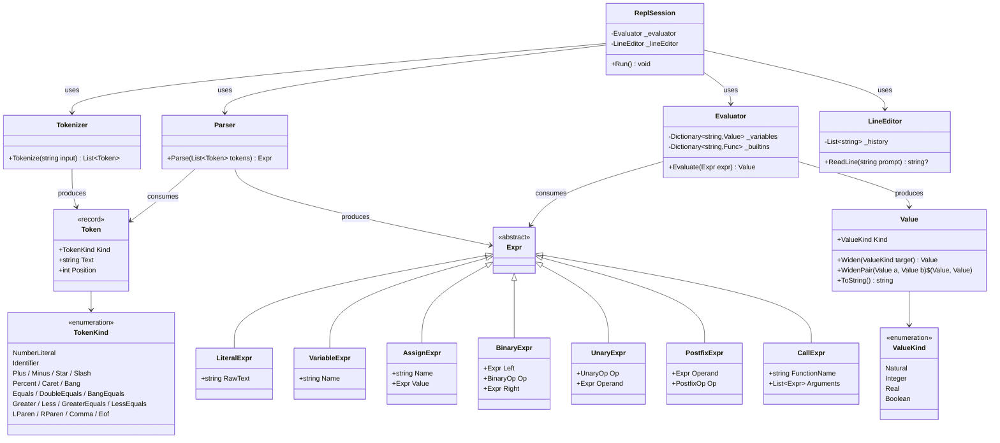

# Requirements: Interactive REPL Calculator for `Lovelace.Console`

> **Scope**: Replace the existing menu-driven `Lovelace.Console` with a type-aware
> interactive REPL that supports variable assignment, arithmetic expressions, built-in
> functions, and all three numeric types (`Natural`, `Integer`, `Real`). The REPL
> parses and evaluates expressions like `a = 20.5` and `b = a * 3.(3)`, automatically
> choosing the narrowest type at parse time and only widening during operations.
> Pure-logic components (`Value`, `Tokenizer`, `Parser`, `Evaluator`) are covered by
> xUnit tests in a new `Lovelace.Console.Tests` project; I/O-dependent components
> (`LineEditor`, `ReplSession`) are verified by manual acceptance scenarios.

---

## Functionality Worktree

### Class Diagram

### Completeness Checklist

#### Infrastructure

- [x] Add `Lovelace.Real` project reference to `Lovelace.Console.csproj` [prerequisite for all Real-related features]
- [x] Create `Lovelace.Console.Tests` xUnit project referencing `Lovelace.Console` [prerequisite for all automated tests]

#### Value (`Repl/Value.cs`)

- [x] `ValueKind` enum — discriminates `Natural`, `Integer`, `Real`, `Boolean` [prerequisite for Value wrapper]
- [x] `Value` wrapper — stores one numeric type with kind tag; `ToString()` prefixes the kind label (e.g. `Natural: 42`) [prerequisite for Evaluator]
- [x] `Value.Widen(ValueKind target)` — promotes `Natural` → `Integer` → `Real` using `new Integer(natural)` and `new Real(integer)` [prerequisite for binary operations]
- [x] `Value.WidenPair(Value, Value)` — static method; brings both operands to `max(left.Kind, right.Kind)` [prerequisite for binary operations]

#### Tokens (`Repl/Token.cs`)

- [x] `TokenKind` enum — 20 token types: `NumberLiteral`, `Identifier`, `Plus`, `Minus`, `Star`, `Slash`, `Percent`, `Caret`, `Bang`, `Equals`, `DoubleEquals`, `BangEquals`, `Greater`, `Less`, `GreaterEquals`, `LessEquals`, `LParen`, `RParen`, `Comma`, `Eof` [prerequisite for Tokenizer]
- [x] `Token` record — `TokenKind Kind`, `string Text`, `int Position` [prerequisite for Tokenizer]

#### Tokenizer (`Repl/Tokenizer.cs`)

- [x] `Tokenizer.Tokenize` — scan number literals: digits, optional `.`, optional digits, optional `(digits)` for periodic notation; raw text preserved for deferred type inference [prerequisite for Parser]
- [x] `Tokenizer.Tokenize` — scan identifiers matching `[a-zA-Z_][a-zA-Z0-9_]*` [depends on number literal scanning]
- [x] `Tokenizer.Tokenize` — scan single-char operators (`+`, `-`, `*`, `/`, `%`, `^`, `!`, `=`, `>`, `<`, `(`, `)`, `,`) and two-char operators (`==`, `!=`, `>=`, `<=`) before single-char; skip whitespace; descriptive error on unknown characters [depends on identifier scanning]

#### AST (`Repl/Ast.cs`)

- [x] `BinaryOp`, `UnaryOp`, `PostfixOp` enums [prerequisite for AST node hierarchy]
- [x] `Expr` abstract base with subtypes: `LiteralExpr(string RawText)`, `VariableExpr(string Name)`, `AssignExpr(string Name, Expr Value)`, `BinaryExpr(Expr Left, BinaryOp Op, Expr Right)`, `UnaryExpr(UnaryOp Op, Expr Operand)`, `PostfixExpr(Expr Operand, PostfixOp Op)`, `CallExpr(string FunctionName, List<Expr> Arguments)` [prerequisite for Parser and Evaluator]

#### Parser (`Repl/Parser.cs`)

- [x] Parser — primary expressions: number literal → `LiteralExpr`; identifier → `VariableExpr` or `CallExpr` (lookahead for `(`); parenthesized group [prerequisite for all parsing; depends on AST and Tokenizer]
- [x] Parser — postfix `!` → `PostfixExpr(Factorial)` and unary prefix `-`/`+` → `UnaryExpr` [depends on primary expressions]
- [x] Parser — binary operators with correct precedence (low→high: comparison, additive, multiplicative, power) and `^` right-associativity [depends on unary/postfix]
- [x] Parser — top-level assignment: `identifier = expr` (right-associative, only valid at top-level or standalone) [depends on binary operators]

#### Evaluator (`Repl/Evaluator.cs`)

- [x] Evaluator — literal evaluation with type inference: contains `.` or `(` → `Real.Parse`; else → `Natural.Parse` [depends on Parser and Value]
- [x] Evaluator — variable store: `Dictionary<string, Value>` with get/set; error on undefined variable [depends on literal evaluation]
- [x] Evaluator — binary arithmetic (`+`, `-`, `*`, `/`, `%`, `^`) using `Value.WidenPair` then dispatching to the correct operator on the inner types [depends on variable store]
- [x] Evaluator — Natural subtraction underflow: catch `InvalidOperationException`, widen both operands to `Integer`, retry [depends on binary arithmetic]
- [x] Evaluator — comparison operators (`==`, `!=`, `>`, `<`, `>=`, `<=`): widen pair, call `CompareTo`, return `Boolean` `Value` [depends on binary arithmetic]
- [x] Evaluator — unary negation (`-`): `Natural` → widen to `Integer` then negate; `Integer`/`Real` negate directly; unary plus (`+`) returns same value [depends on literal evaluation]
- [x] Evaluator — postfix `!` (factorial): `Natural.Factorial()` for Natural, `Integer.Factorial()` for Integer; reject `Real` with descriptive error; catch `InvalidOperationException` for negative Integer [depends on literal evaluation]
- [x] Evaluator — built-in function `abs(x)`: calls `Natural.Abs`, `Integer.Abs`, or `Real.Abs` based on kind [depends on variable store]
- [x] Evaluator — built-in function `inv(x)`: widens to `Real`, calls `Invert()` [depends on variable store]
- [x] Evaluator — built-in function `divrem(a, b)`: calls `DivRem` on `Natural` or `Integer` (not available on `Real`); returns formatted `"quotient = Q, remainder = R"` [depends on variable store]
- [x] Evaluator — built-in functions `is_even(x)` and `is_odd(x)`: call `IsEvenInteger`/`IsOddInteger` static methods, return `Boolean` [depends on variable store]
- [x] Evaluator — built-in function `sign(x)`: widen to at least `Integer`, read `.Sign`, return `Integer` value [depends on variable store]

#### LineEditor (`Repl/LineEditor.cs`)

- [x] `LineEditor.ReadLine(string prompt)` — `Console.ReadKey(intercept: true)` loop; handles printable char insert, Backspace, Delete, Home, End, Left, Right cursor movement [prerequisite for ReplSession; manual testing only]
- [x] LineEditor — Up/Down arrow history navigation over a `List<string>` buffer [depends on ReadLine; manual testing only]
- [x] LineEditor — Ctrl+C returns `null` to signal exit intent [depends on ReadLine; manual testing only]

#### ReplSession (`Repl/ReplSession.cs`)

- [x] `ReplSession.Run()` — REPL loop: read line via LineEditor → tokenize → parse → evaluate → print result as `= <value> (<Type>)` [depends on Tokenizer, Parser, Evaluator, LineEditor]
- [x] ReplSession — special command `help`: print available operators, functions, and commands [depends on REPL loop]
- [x] ReplSession — special command `vars`: list all assigned variables with types and values [depends on REPL loop]
- [x] ReplSession — special commands `clear` (reset all variables) and `delete <name>` (remove one variable) [depends on REPL loop]
- [x] ReplSession — special commands `set precision <n>` (`Real.MaxComputationDecimalPlaces`) and `set display <n>` (`Real.DisplayDecimalPlaces` + `Natural.DisplayDigits`) [depends on REPL loop]
- [x] ReplSession — special commands `exit` / `quit` to terminate the loop [depends on REPL loop]
- [x] ReplSession — underscore `_` last-result variable: store the most recent evaluation result in `_` [depends on REPL loop]
- [x] ReplSession — error handling: catch parse/evaluation errors and print with a caret (`^`) pointing at the error position [depends on REPL loop]

#### Entry Point

- [x] Rewrite `Program.cs` — welcome banner (project name, version, `help` hint), instantiate `ReplSession`, call `Run()` [depends on ReplSession]
- [x] Update `README.md` — document REPL syntax, operators, built-in functions, special commands, type inference rules, and example sessions [depends on all above]

---

## File Inventory

| File | Purpose |
|---|---|
| `Lovelace.Console/Lovelace.Console.csproj` | Add `Lovelace.Real` project reference |
| `Lovelace.Console/Repl/Value.cs` | `ValueKind` enum and `Value` type-discriminated wrapper |
| `Lovelace.Console/Repl/Token.cs` | `TokenKind` enum and `Token` record |
| `Lovelace.Console/Repl/Tokenizer.cs` | Lexer — `Tokenize(string)` |
| `Lovelace.Console/Repl/Ast.cs` | Expression AST node hierarchy and operator enums |
| `Lovelace.Console/Repl/Parser.cs` | Recursive-descent parser |
| `Lovelace.Console/Repl/Evaluator.cs` | AST walker, variable store, built-in function registry |
| `Lovelace.Console/Repl/LineEditor.cs` | Console.ReadKey-based line editor with history |
| `Lovelace.Console/Repl/ReplSession.cs` | REPL loop, special commands, result display |
| `Lovelace.Console/Program.cs` | Rewritten entry point |
| `Lovelace.Console/README.md` | Updated documentation |
| `Lovelace.Console.Tests/Lovelace.Console.Tests.csproj` | New xUnit test project |

---

## Test Plan

> Pure-logic components (`Value`, `Tokenizer`, `Parser`, `Evaluator`) are tested with
> xUnit `[Fact]` and `[Theory]` tests. I/O-dependent components (`LineEditor`,
> `ReplSession`, `Program`) are tested via manual acceptance scenarios — each is
> prefixed with **Manual:** in the assumption.

### `Value` — constructor and `ToString`

1. `Value_GivenNatural_StoresNaturalKind`
   *Assumption*: Wrapping a `Natural` in a `Value` sets `Kind` to `ValueKind.Natural` and preserves the inner value.

2. `Value_GivenInteger_StoresIntegerKind`
   *Assumption*: Wrapping an `Integer` in a `Value` sets `Kind` to `ValueKind.Integer` and preserves the inner value.

3. `Value_GivenReal_StoresRealKind`
   *Assumption*: Wrapping a `Real` in a `Value` sets `Kind` to `ValueKind.Real` and preserves the inner value.

4. `Value_ToString_GivenNatural_PrefixesKindLabel`
   *Assumption*: `ToString()` on a Natural `Value` produces a string containing the kind label and the numeric representation (e.g. `"Natural: 42"`).

---

### `Value.Widen`

5. `Widen_GivenNaturalToInteger_ReturnsIntegerValue`
   *Assumption*: Widening a `Natural(5)` to `ValueKind.Integer` produces an `Integer` `Value` numerically equal to 5, using `new Integer(Natural)`.

6. `Widen_GivenNaturalToReal_ReturnsRealValue`
   *Assumption*: Widening a `Natural(5)` to `ValueKind.Real` produces a `Real` `Value` numerically equal to 5, via `Natural` → `Integer` → `Real`.

7. `Widen_GivenIntegerToReal_ReturnsRealValue`
   *Assumption*: Widening an `Integer(-3)` to `ValueKind.Real` produces a `Real` `Value` numerically equal to -3, using `new Real(Integer)`.

8. `Widen_GivenSameKind_ReturnsSameValue`
   *Assumption*: Widening a `Natural` to `ValueKind.Natural` returns the same `Value` unchanged — no conversion occurs.

9. `Widen_GivenWiderToNarrower_ThrowsOrRejectsNarrowing`
   *Assumption*: Attempting to widen an `Integer` to `ValueKind.Natural` fails with an error because narrowing is not supported.

---

### `Value.WidenPair`

10. `WidenPair_GivenNaturalAndInteger_ReturnsBothAsInteger`
    *Assumption*: `WidenPair(Natural(5), Integer(3))` returns two `Integer` values, both with `Kind == ValueKind.Integer`.

11. `WidenPair_GivenNaturalAndReal_ReturnsBothAsReal`
    *Assumption*: `WidenPair(Natural(5), Real("3.14"))` returns two `Real` values, both with `Kind == ValueKind.Real`.

12. `WidenPair_GivenSameKind_ReturnsUnchanged`
    *Assumption*: `WidenPair(Natural(5), Natural(3))` returns both values unchanged as `Natural`.

---

### `Tokenizer.Tokenize` — number literals

13. `Tokenize_GivenIntegerLiteral_ReturnsSingleNumberToken`
    *Assumption*: Input `"42"` produces a single `NumberLiteral` token with `Text == "42"` and `Position == 0`, followed by `Eof`.

14. `Tokenize_GivenDecimalLiteral_ReturnsSingleNumberToken`
    *Assumption*: Input `"3.14"` produces a single `NumberLiteral` token with `Text == "3.14"`.

15. `Tokenize_GivenPeriodicLiteral_ReturnsSingleNumberToken`
    *Assumption*: Input `"0.(3)"` produces a single `NumberLiteral` token with `Text == "0.(3)"` — the periodic `(digits)` suffix is consumed as part of the number.

16. `Tokenize_GivenLeadingDot_ReturnsSingleNumberToken`
    *Assumption*: Input `".5"` produces a single `NumberLiteral` token with `Text == ".5"` (leading-dot decimal).

17. `Tokenize_GivenPeriodicWithMultipleDigits_ReturnsSingleNumberToken`
    *Assumption*: Input `"1.2(345)"` produces one `NumberLiteral` token with `Text == "1.2(345)"`.

---

### `Tokenizer.Tokenize` — identifiers and operators

18. `Tokenize_GivenIdentifier_ReturnsIdentifierToken`
    *Assumption*: Input `"abc"` produces a single `Identifier` token with `Text == "abc"`.

19. `Tokenize_GivenIdentifierWithUnderscore_ReturnsIdentifierToken`
    *Assumption*: Input `"my_var"` produces a single `Identifier` token with `Text == "my_var"`.

20. `Tokenize_GivenSingleCharOperators_ReturnsCorrectTokenKinds`
    *Assumption*: Input `"+-*/%^!=(,)"` produces tokens `Plus`, `Minus`, `Star`, `Slash`, `Percent`, `Caret`, `Bang`, `Equals`, `LParen`, `Comma`, `RParen` in sequence.

21. `Tokenize_GivenTwoCharOperators_ReturnsCorrectTokenKinds`
    *Assumption*: Input `"== != >= <="` produces tokens `DoubleEquals`, `BangEquals`, `GreaterEquals`, `LessEquals` — the two-char variants are matched before single-char.

22. `Tokenize_GivenWhitespace_SkipsWhitespacePreservesPositions`
    *Assumption*: Input `"1 + 2"` produces `NumberLiteral(pos=0)`, `Plus(pos=2)`, `NumberLiteral(pos=4)` — whitespace is skipped but positions are correct.

23. `Tokenize_GivenUnknownChar_ThrowsDescriptiveError`
    *Assumption*: Input `"@"` throws an exception with a message indicating the position and the unknown character.

24. `Tokenize_GivenEmptyString_ReturnsEofOnly`
    *Assumption*: Input `""` produces a single `Eof` token.

25. `Tokenize_GivenComplexExpression_ReturnsCorrectSequence`
    *Assumption*: Input `"a = 3.14 * b"` produces tokens `Identifier("a")`, `Equals`, `NumberLiteral("3.14")`, `Star`, `Identifier("b")`, `Eof`.

---

### `Parser` — primary expressions

26. `Parse_GivenNumberLiteral_ReturnsLiteralExpr`
    *Assumption*: Parsing tokens from `"42"` produces a `LiteralExpr` with `RawText == "42"`.

27. `Parse_GivenIdentifier_ReturnsVariableExpr`
    *Assumption*: Parsing tokens from `"x"` produces a `VariableExpr` with `Name == "x"`.

28. `Parse_GivenFunctionCallSingleArg_ReturnsCallExpr`
    *Assumption*: Parsing tokens from `"abs(x)"` produces a `CallExpr` with `FunctionName == "abs"` and one argument (`VariableExpr("x")`).

29. `Parse_GivenFunctionCallMultipleArgs_ReturnsCallExpr`
    *Assumption*: Parsing tokens from `"divrem(a, b)"` produces a `CallExpr` with `FunctionName == "divrem"` and two arguments.

30. `Parse_GivenParenthesizedExpression_ReturnsInnerExpr`
    *Assumption*: Parsing tokens from `"(1 + 2)"` produces a `BinaryExpr` with `Op == Add` — parentheses are consumed as grouping.

---

### `Parser` — unary and postfix

31. `Parse_GivenUnaryMinus_ReturnsUnaryExprNegate`
    *Assumption*: Parsing tokens from `"-5"` produces a `UnaryExpr` with `Op == Negate` wrapping `LiteralExpr("5")`.

32. `Parse_GivenUnaryPlus_ReturnsUnaryExprPlus`
    *Assumption*: Parsing tokens from `"+5"` produces a `UnaryExpr` with `Op == Plus` wrapping `LiteralExpr("5")`.

33. `Parse_GivenPostfixFactorial_ReturnsPostfixExpr`
    *Assumption*: Parsing tokens from `"5!"` produces a `PostfixExpr` with `Op == Factorial` wrapping `LiteralExpr("5")`.

34. `Parse_GivenChainedPostfixAndUnary_CorrectPrecedence`
    *Assumption*: Parsing tokens from `"-5!"` produces `UnaryExpr(Negate, PostfixExpr(LiteralExpr("5"), Factorial))` — postfix binds tighter than unary.

---

### `Parser` — binary operators and precedence

35. `Parse_GivenAddition_ReturnsBinaryExprAdd`
    *Assumption*: Parsing tokens from `"1 + 2"` produces a `BinaryExpr` with `Op == Add`.

36. `Parse_GivenMultiplyBeforeAdd_CorrectPrecedence`
    *Assumption*: Parsing `"1 + 2 * 3"` produces `BinaryExpr(LiteralExpr("1"), Add, BinaryExpr(LiteralExpr("2"), Multiply, LiteralExpr("3")))` — multiplication binds tighter.

37. `Parse_GivenPowerRightAssociative_CorrectTree`
    *Assumption*: Parsing `"2 ^ 3 ^ 4"` produces `BinaryExpr("2", Power, BinaryExpr("3", Power, "4"))` — power is right-associative.

38. `Parse_GivenParenthesesOverridePrecedence_CorrectTree`
    *Assumption*: Parsing `"(1 + 2) * 3"` produces `BinaryExpr(BinaryExpr("1", Add, "2"), Multiply, "3")`.

39. `Parse_GivenComparison_ReturnsBinaryExprWithOp`
    *Assumption*: Parsing `"a == b"` produces a `BinaryExpr` with `Op == Equal`.

40. `Parse_GivenComparisonLowerThanArithmetic_CorrectPrecedence`
    *Assumption*: Parsing `"a + 1 > b"` produces `BinaryExpr(BinaryExpr(a, Add, 1), Greater, b)` — comparison has lower precedence than additive.

---

### `Parser` — assignment

41. `Parse_GivenAssignment_ReturnsAssignExpr`
    *Assumption*: Parsing `"x = 5"` produces an `AssignExpr` with `Name == "x"` and `Value == LiteralExpr("5")`.

42. `Parse_GivenChainedAssignment_RightAssociative`
    *Assumption*: Parsing `"x = y = 5"` produces `AssignExpr("x", AssignExpr("y", LiteralExpr("5")))`.

43. `Parse_GivenEmptyInput_ThrowsError`
    *Assumption*: Parsing an empty token list (just `Eof`) throws a descriptive parse error.

44. `Parse_GivenUnexpectedToken_ThrowsDescriptiveError`
    *Assumption*: Parsing `"+ +"` throws an error mentioning the unexpected token and its position.

---

### `Evaluator` — literal evaluation

45. `Evaluate_GivenWholeNumberLiteral_ReturnsNaturalValue`
    *Assumption*: Evaluating `LiteralExpr("42")` returns a `Value` with `Kind == Natural` whose inner `Natural` equals `Natural.Parse("42", null)`.

46. `Evaluate_GivenDecimalLiteral_ReturnsRealValue`
    *Assumption*: Evaluating `LiteralExpr("3.14")` returns a `Value` with `Kind == Real` because the text contains `.`.

47. `Evaluate_GivenPeriodicLiteral_ReturnsRealValue`
    *Assumption*: Evaluating `LiteralExpr("0.(3)")` returns a `Value` with `Kind == Real` because the text contains `(`.

---

### `Evaluator` — variable store

48. `Evaluate_GivenAssignment_StoresValueAndReturnsIt`
    *Assumption*: Evaluating `AssignExpr("x", LiteralExpr("5"))` stores `Natural(5)` under key `"x"` and returns that value.

49. `Evaluate_GivenVariableReference_ReturnsStoredValue`
    *Assumption*: After storing `x = Natural(5)`, evaluating `VariableExpr("x")` returns the stored `Natural(5)`.

50. `Evaluate_GivenUndefinedVariable_ThrowsError`
    *Assumption*: Evaluating `VariableExpr("y")` when `"y"` has not been assigned throws a descriptive error.

---

### `Evaluator` — binary arithmetic with auto-widening

51. `Evaluate_GivenNaturalPlusNatural_ReturnsNatural`
    *Assumption*: `Natural(2) + Natural(3)` produces `Natural(5)` — no widening needed.

52. `Evaluate_GivenNaturalPlusInteger_ReturnsInteger`
    *Assumption*: Adding `Natural(5)` and `Integer(-3)` widens the Natural to Integer and returns `Integer(2)`.

53. `Evaluate_GivenIntegerPlusReal_ReturnsReal`
    *Assumption*: Adding `Integer(2)` and `Real("3.5")` widens the Integer to Real and returns `Real("5.5")`.

54. `Evaluate_GivenMultiply_ReturnsCorrectProduct`
    *Assumption*: `Natural(12) * Natural(34)` produces `Natural(408)`.

55. `Evaluate_GivenDivide_ReturnsCorrectQuotient`
    *Assumption*: `Natural(100) / Natural(5)` produces `Natural(20)`.

56. `Evaluate_GivenDivideByZero_ThrowsDivideByZeroException`
    *Assumption*: `Natural(5) / Natural(0)` throws `DivideByZeroException`.

57. `Evaluate_GivenModulo_ReturnsCorrectRemainder`
    *Assumption*: `Natural(17) % Natural(5)` produces `Natural(2)`.

58. `Evaluate_GivenPower_ReturnsCorrectResult`
    *Assumption*: `Natural(2) ^ Natural(10)` produces `Natural(1024)`.

---

### `Evaluator` — Natural subtraction underflow

59. `Evaluate_GivenNaturalMinusLarger_AutoWidensToInteger`
    *Assumption*: `Natural(3) - Natural(5)` catches `InvalidOperationException`, widens both to `Integer`, and returns `Integer(-2)`.

60. `Evaluate_GivenNaturalMinusEqual_ReturnsNaturalZero`
    *Assumption*: `Natural(5) - Natural(5)` does not underflow and returns `Natural(0)`.

---

### `Evaluator` — comparison operators

61. `Evaluate_GivenEqualValues_DoubleEqualsReturnsTrue`
    *Assumption*: `Natural(5) == Natural(5)` returns a `Boolean` `Value` representing `true`.

62. `Evaluate_GivenDifferentValues_NotEqualsReturnsTrue`
    *Assumption*: `Natural(3) != Natural(5)` returns `true`.

63. `Evaluate_GivenGreater_ReturnsBooleanTrue`
    *Assumption*: `Natural(5) > Natural(3)` returns `true`.

64. `Evaluate_GivenLess_ReturnsBooleanFalse`
    *Assumption*: `Natural(5) < Natural(3)` returns `false`.

65. `Evaluate_GivenCrossTypeComparison_WidensFirst`
    *Assumption*: Comparing `Natural(5) == Integer(5)` widens the Natural to Integer before calling `CompareTo`, and returns `true`.

---

### `Evaluator` — unary operators

66. `Evaluate_GivenNegateNatural_WidensToIntegerAndNegates`
    *Assumption*: Unary `-` on `Natural(5)` widens to `Integer` and returns `Integer(-5)`.

67. `Evaluate_GivenNegateInteger_ReturnsNegatedInteger`
    *Assumption*: Unary `-` on `Integer(3)` returns `Integer(-3)`.

68. `Evaluate_GivenNegateReal_ReturnsNegatedReal`
    *Assumption*: Unary `-` on `Real("3.14")` returns `Real("-3.14")`.

69. `Evaluate_GivenUnaryPlus_ReturnsSameValue`
    *Assumption*: Unary `+` on any value returns the same value unchanged.

---

### `Evaluator` — postfix factorial

70. `Evaluate_GivenNaturalFactorial_ReturnsNatural`
    *Assumption*: `Natural(5)!` calls `Natural.Factorial()` and returns `Natural(120)`.

71. `Evaluate_GivenIntegerFactorial_ReturnsInteger`
    *Assumption*: `Integer(5)!` calls `Integer.Factorial()` and returns `Integer(120)`.

72. `Evaluate_GivenRealFactorial_ThrowsDescriptiveError`
    *Assumption*: `Real("3.14")!` produces a descriptive error because `Real` has no `Factorial()` method.

73. `Evaluate_GivenNegativeIntegerFactorial_ThrowsInvalidOperation`
    *Assumption*: `Integer(-1)!` throws `InvalidOperationException` with message "Factorial is not defined for negative integers."

---

### `Evaluator` — built-in function `abs`

74. `Evaluate_GivenAbsOfNegativeInteger_ReturnsPositiveInteger`
    *Assumption*: `abs(Integer(-5))` calls `Integer.Abs` and returns `Integer(5)`.

75. `Evaluate_GivenAbsOfPositiveNatural_ReturnsSameNatural`
    *Assumption*: `abs(Natural(5))` calls `Natural.Abs` and returns `Natural(5)` unchanged.

76. `Evaluate_GivenAbsOfNegativeReal_ReturnsPositiveReal`
    *Assumption*: `abs(Real("-3.14"))` calls `Real.Abs` and returns `Real("3.14")`.

---

### `Evaluator` — built-in function `inv`

77. `Evaluate_GivenInvOfNatural_WidensToRealAndInverts`
    *Assumption*: `inv(Natural(4))` widens to `Real`, calls `Invert()`, and returns `Real("0.25")`.

78. `Evaluate_GivenInvOfZero_ThrowsDivideByZeroException`
    *Assumption*: `inv(Natural(0))` widens to `Real` and `Invert()` throws `DivideByZeroException`.

---

### `Evaluator` — built-in function `divrem`

79. `Evaluate_GivenDivRemOfNaturals_ReturnsFormattedString`
    *Assumption*: `divrem(Natural(17), Natural(5))` calls `Natural.DivRem` and returns a result containing `"quotient = 3, remainder = 2"`.

80. `Evaluate_GivenDivRemOfIntegers_ReturnsFormattedString`
    *Assumption*: `divrem(Integer(17), Integer(5))` calls `Integer.DivRem` and returns a result containing quotient and remainder.

81. `Evaluate_GivenDivRemOfReal_ThrowsError`
    *Assumption*: `divrem(Real("3.14"), Real("1.5"))` produces an error because `Real` does not expose a `DivRem` method.

---

### `Evaluator` — built-in functions `is_even`, `is_odd`, `sign`

82. `Evaluate_GivenIsEvenOfEvenNumber_ReturnsTrue`
    *Assumption*: `is_even(Natural(4))` calls `Natural.IsEvenInteger` and returns `Boolean(true)`.

83. `Evaluate_GivenIsOddOfOddNumber_ReturnsTrue`
    *Assumption*: `is_odd(Natural(3))` calls `Natural.IsOddInteger` and returns `Boolean(true)`.

84. `Evaluate_GivenSignOfNegative_ReturnsNegativeOne`
    *Assumption*: `sign(Integer(-5))` reads `.Sign` which is `-1` and returns `Integer(-1)`.

85. `Evaluate_GivenSignOfZero_ReturnsZero`
    *Assumption*: `sign(Integer(0))` reads `.Sign` which is `0` and returns `Integer(0)`.

86. `Evaluate_GivenSignOfPositive_ReturnsOne`
    *Assumption*: `sign(Natural(5))` widens to `Integer`, reads `.Sign` which is `1`, and returns `Integer(1)`.

---

### `LineEditor` — manual acceptance scenarios

87. `LineEditor_GivenPrintableCharacters_InsertsAtCursor`
    *Assumption*: **Manual:** Typing printable characters appends them at the cursor position, visible on the console line.

88. `LineEditor_GivenBackspace_DeletesPreviousChar`
    *Assumption*: **Manual:** Pressing Backspace removes the character before the cursor.

89. `LineEditor_GivenArrowKeys_MovesCursor`
    *Assumption*: **Manual:** Left/Right arrow keys move the cursor; Home/End jump to start/end of line.

90. `LineEditor_GivenUpArrow_RecallsPreviousInput`
    *Assumption*: **Manual:** Pressing Up arrow replaces the current line with the previous history entry.

91. `LineEditor_GivenDownArrow_NavigatesForwardInHistory`
    *Assumption*: **Manual:** After pressing Up, pressing Down restores the next entry (or clears the line at the end).

92. `LineEditor_GivenCtrlC_ReturnsNull`
    *Assumption*: **Manual:** Pressing Ctrl+C causes `ReadLine` to return `null`, signalling exit intent.

---

### `ReplSession` — manual acceptance scenarios

93. `ReplSession_GivenArithmeticExpression_PrintsResultWithTypeLabel`
    *Assumption*: **Manual:** Entering `42` prints `= 42 (Natural)`; entering `3.14` prints `= 3.14 (Real)`.

94. `ReplSession_GivenAssignment_PrintsAssignedValue`
    *Assumption*: **Manual:** Entering `a = 42` prints `= 42 (Natural)` and stores `a`.

95. `ReplSession_GivenHelp_PrintsHelpText`
    *Assumption*: **Manual:** Entering `help` prints available operators, functions, and commands.

96. `ReplSession_GivenVars_ListsAllVariables`
    *Assumption*: **Manual:** After assigning `a = 1` and `b = 2`, entering `vars` lists both with types and values.

97. `ReplSession_GivenClear_ResetsAllVariables`
    *Assumption*: **Manual:** After assigning variables, entering `clear` removes them all; `vars` shows an empty list.

98. `ReplSession_GivenDeleteName_RemovesSingleVariable`
    *Assumption*: **Manual:** After assigning `a` and `b`, entering `delete a` removes only `a`; `b` remains.

99. `ReplSession_GivenSetPrecision_UpdatesMaxComputationDecimalPlaces`
    *Assumption*: **Manual:** Entering `set precision 500` updates `Real.MaxComputationDecimalPlaces` to 500 and prints a confirmation.

100. `ReplSession_GivenSetDisplay_UpdatesDisplayProperties`
     *Assumption*: **Manual:** Entering `set display 50` updates `Real.DisplayDecimalPlaces` and `Natural.DisplayDigits` to 50.

101. `ReplSession_GivenExitOrQuit_TerminatesLoop`
     *Assumption*: **Manual:** Entering `exit` or `quit` ends the REPL and returns to the OS prompt.

102. `ReplSession_GivenUnderscore_ReturnsLastResult`
     *Assumption*: **Manual:** After evaluating `42`, entering `_` returns `42 (Natural)`.

103. `ReplSession_GivenInvalidExpression_PrintsErrorWithCaret`
     *Assumption*: **Manual:** Entering `+ +` prints an error message with a `^` indicating the position of the unexpected token.

104. `ReplSession_GivenDivisionByZero_PrintsFriendlyMessage`
     *Assumption*: **Manual:** Entering `1 / 0` prints a friendly error message rather than crashing.

---

### `Program.cs` — manual acceptance scenario

105. `Program_GivenLaunch_PrintsWelcomeBannerAndStartsRepl`
     *Assumption*: **Manual:** Running the application prints a welcome banner with project name, version, and `help` hint, then enters the REPL prompt.

---

## Assumptions Verification

> Falsify Claims skill applied to architectural assumptions from the plan and test plan.

| # | Claim | Evidence (file:line) | Status | Reason |
|---|---|---|---|---|
| 1 | `Lovelace.Console.csproj` only references `Natural` and `Integer` | `Lovelace.Console/Lovelace.Console.csproj:11-12` | ✅ Supported | Only two `<ProjectReference>` elements present; no `Real` reference |
| 2 | `Natural` subtraction throws `InvalidOperationException` on underflow | `Lovelace.Natural/Natural.cs:348` | ✅ Supported | `throw new InvalidOperationException("Subtraction would produce a negative result…")` |
| 3 | Constructor `new Integer(Natural)` exists | `Lovelace.Integer/Integer.cs:89` | ✅ Supported | `public Integer(Nat magnitude)` where `Nat = Natural` |
| 4 | Constructor `new Real(Integer)` exists | `Lovelace.Real/Real.cs:161` | ✅ Supported | `public Real(Int other)` where `Int = Integer` |
| 5 | `Real` has `Invert()` instance method | `Lovelace.Real/Real.cs:560` | ✅ Supported | `public Real Invert() => Real.One / this;` |
| 6 | `Real.MaxComputationDecimalPlaces` is a static property | `Lovelace.Real/Real.cs:60` | ✅ Supported | `public static long MaxComputationDecimalPlaces` |
| 7 | `Real.DisplayDecimalPlaces` is a static property | `Lovelace.Real/Real.cs:48` | ✅ Supported | `public static long DisplayDecimalPlaces` |
| 8 | `Natural.DisplayDigits` is a static property | `Lovelace.Natural/Natural.cs:53` | ✅ Supported | `public static long DisplayDigits` |
| 9 | `Natural` has `Factorial()` instance method | `Lovelace.Natural/Natural.cs:709` | ✅ Supported | `public Natural Factorial()` |
| 10 | `Integer` has `Factorial()` instance method | `Lovelace.Integer/Integer.cs:349` | ✅ Supported | Delegates to `_magnitude.Factorial()` |
| 11 | `Integer.Factorial()` throws `InvalidOperationException` for negatives | `Lovelace.Integer/Integer.cs:352` | ✅ Supported | `"Factorial is not defined for negative integers."` |
| 12 | All three types have static `Abs` method | `Natural.cs:227`, `Integer.cs:553`, `Real.cs:264` | ✅ Supported | `Abs(T value)` present on all three |
| 13 | All three types implement `CompareTo` | `Natural.cs:257`, `Integer.cs:387`, `Real.cs:329` | ✅ Supported | `int CompareTo(T? other)` present on all three |
| 14 | `IsEvenInteger` / `IsOddInteger` static methods on all three types | `Natural.cs:170/177`, `Integer.cs:168/171`, `Real.cs:224/228` | ✅ Supported | Static methods present on all |
| 15 | `Integer` has `.Sign` property returning -1, 0, or +1 | `Lovelace.Integer/Integer.cs:204` | ✅ Supported | `public int Sign => …` |
| 16 | `Real` does not have a `Factorial()` method | Searched `Real.cs` — no `Factorial` member | ✅ Supported | Factorial rejected for `Real` in evaluator |
| 17 | `Real` does not have a `DivRem` method | Searched `Real.cs` — no `DivRem` member | ✅ Supported | `divrem` built-in restricted to Natural and Integer |
| 18 | `Natural.DivRem` is a static method with `out` remainder | `Lovelace.Natural/Natural.cs:563` | ✅ Supported | `public static Natural DivRem(Natural left, Natural right, out Natural remainder)` |
| 19 | `Integer.DivRem` is an instance method with `out` remainder | `Lovelace.Integer/Integer.cs:299` | ✅ Supported | `public Integer DivRem(Integer divisor, out Integer remainder)` |

*All assumptions verified against current C# sources. Zero Falsified rows.*
