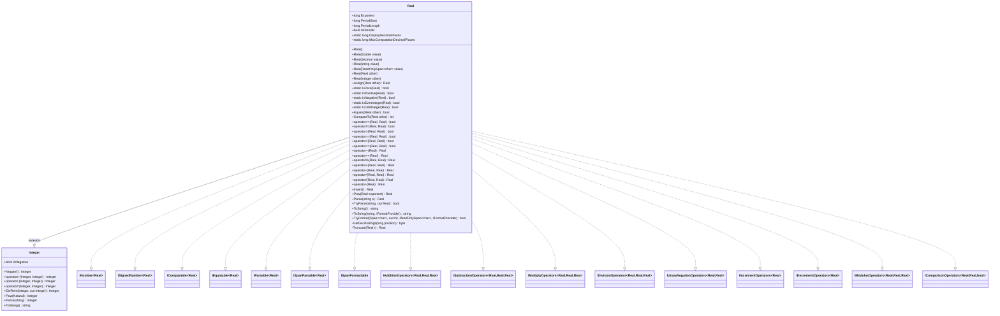

# Requirements: `RealLovelace` → `Lovelace.Real`

> Migration requirements for `RealLovelace` (C++) to `Lovelace.Real` (C#). Covers functionality mapping, completeness checklist, and xUnit test plan.

---

## Functionality Worktree

### Class Diagram

### Mapping Table

> Scope: only members **added or overridden** by `RealLovelace` relative to `InteiroLovelace`.
> All inherited members (arithmetic, comparison, predicates, formatting) from `InteiroLovelace` carry over
> via the `Integer` base class and are not repeated here.

| C++ Method / Member | C# Equivalent | .NET Interface | Status |
|---|---|---|---|
| `long long int expoente` (field) | `long Exponent { get; set; }` property | — | ✅ Done |
| *(new — no C++ equivalent)* | `long PeriodStart { get; private set; }` — fractional-digit index where the repeating block begins; `0` means the period starts immediately after the decimal point; meaningful only when `IsPeriodic` | — | ✅ Done |
| *(new — no C++ equivalent)* | `long PeriodLength { get; private set; }` — length of the repeating block; `0` = non-periodic | — | ✅ Done |
| *(new — no C++ equivalent)* | `bool IsPeriodic { get; }` — computed as `PeriodLength > 0` | — | ✅ Done |
| `static long long int casasDecimaisExibicao` (static field, default 100) | `static long DisplayDecimalPlaces { get; set; }` — controls how many fractional digits appear in `ToString()` for non-periodic values | — | ✅ Done |
| *(new — no C++ equivalent)* | `static long MaxComputationDecimalPlaces { get; set; }` (default `1000`) — hard cap on how many digits are generated during division and arithmetic before giving up on period detection; used as the approximation cutoff for irrationals | — | ✅ Done |
| `RealLovelace()` | `Real()` default ctor — sets `Exponent = 0`, delegates to `Integer()` | — | ✅ Done |
| `RealLovelace(const double A)` | `Real(double value)` ctor — parse double via `ToString("R")` then `Parse` | — | ✅ Done |
| *(new — no C++ equivalent)* | `Real(decimal value)` ctor — convert via `value.ToString("G29", CultureInfo.InvariantCulture)` then `Parse`; preserves up to 29 significant digits with no scientific notation | — | ✅ Done |
| `RealLovelace(string A)` | `Real(string value)` ctor — delegates to `Parse(string)` | — | ✅ Done |
| *(new — no C++ equivalent)* | `Real(ReadOnlySpan<char> value)` ctor — delegates to `Parse(ReadOnlySpan<char>, null)` [mandatory commodity parsing] | `ISpanParsable<Real>` | ✅ Done |
| `RealLovelace(const RealLovelace &A)` | `Real(Real other)` copy ctor — delegates to `Assign(other)` | — | ✅ Done |
| `RealLovelace(const InteiroLovelace &A)` | `Real(Integer other)` ctor — copies digits, sets `Exponent = 0` | — | ✅ Done |
| `atribuir(const RealLovelace &A)` | `Real Assign(Real other)` — deep-copies digits, exponent, sign, zero flag, `PeriodStart`, `PeriodLength` | — | ✅ Done |
| `atribuir(const double A)` | *(absorbed into `Real(double)` ctor / `Parse`)* | — | ✅ Done |
| `atribuir(const string A)` | *(absorbed into `Parse(string)`)* | — | ✅ Done |
| `somar(const RealLovelace B)` | `static Real Add(Real left, Real right)` / `operator+` — align exponents via `GetDecimalDigit`; if either operand is periodic, generate up to `MaxComputationDecimalPlaces` digits and run period detection on the result; result exponent = `min(left.Exponent, right.Exponent)` | `IAdditionOperators<Real,Real,Real>` | ✅ Done |
| `subtrair(RealLovelace B)` | `static Real Subtract(Real left, Real right)` / `operator-` — negate `right`, then `Add` | `ISubtractionOperators<Real,Real,Real>` | ✅ Done |
| `multiplicar(RealLovelace B)` | `static Real Multiply(Real left, Real right)` / `operator*` — multiply magnitudes; if either operand is periodic, generate up to `MaxComputationDecimalPlaces` digits of the result and run period detection; result exponent = `left.Exponent + right.Exponent` | `IMultiplyOperators<Real,Real,Real>` | ✅ Done |
| `dividir(RealLovelace B)` | `static Real Divide(Real left, Real right)` / `operator/` — remainder-tracked long division: maintain a `Dictionary<Natural, long>` of `remainder → digit_position`; when the same remainder recurs, record `PeriodStart` and `PeriodLength` and stop immediately (exact rational result); if no period is found within `MaxComputationDecimalPlaces` steps, truncate (irrational approximation); result exponent adjusted accordingly | `IDivisionOperators<Real,Real,Real>` | ✅ Done |
| `inverterSinal()` | `static Real Negate(Real value)` / unary `operator-` — overrides `Integer.Negate`; returns `Real` | `IUnaryNegationOperators<Real,Real>` | ✅ Done |
| `inverter()` | `Real Invert()` — computes `1 / this` using `Divide`; unique to `Real` | — | ✅ Done |
| `exponenciar(RealLovelace X)` | `Real Pow(Real exponent)` — override to accept a `Real` exponent; integer-exponent fast path, otherwise via repeated multiplication or `exp(X·ln(base))` approximation | — | ✅ Done |
| `imprimir()` | `string ToString()` override — inserts decimal point at position dictated by `Exponent`; prefixes sign; non-periodic values are truncated at `DisplayDecimalPlaces` fractional digits; periodic values emit the full non-repeating part followed by `(repeating_block)` with no digit limit — e.g. `"0.(3)"`, `"3.(142857)"` | `ISpanFormattable` | ✅ Done |
| `imprimir(char separador)` | `string ToString(string? format, IFormatProvider? provider)` | `IFormattable` | ✅ Done |
| `ler()` | `static Real Parse(string s)` / `TryParse` — handles decimal point, sign; also accepts periodic notation `"0.(142857)"` — the substring inside `(…)` is parsed as the repeating block and sets `PeriodStart`/`PeriodLength` | `IParsable<Real>`, `ISpanParsable<Real>` | ✅ Done |
| `getExpoente()` / `setExpoente(X)` | `long Exponent { get; set; }` | — | ✅ Done |
| `getCasasDecimaisExibicao()` / `setCasasDecimaisExibicao(n)` | `static long DisplayDecimalPlaces { get; set; }` | — | ✅ Done |
| `toInteiroLovelace(long long int zeros)` | `private Integer ToInteger(long zeros)` — prepends `zeros` zero-digits before the existing digits (shifts the value left) | — | ✅ Done (private) |
| *(new — no C++ equivalent)* | `private byte GetDecimalDigit(long position)` — reconstructs the digit at fractional position `position` on demand: if `position < PeriodStart` return the stored digit; otherwise return `storedDigit[PeriodStart + (position - PeriodStart) % PeriodLength]`; allows arithmetic to read beyond stored digits without expansion | — | ✅ Done (private) |
| *(new — no C++ equivalent)* | `private static Real Truncate(Real r)` — strips fractional digits; strips digits below the decimal point by truncating toward zero (used exclusively by `operator%`) | — | ✅ Done (private) |
| *(new — stub)* | `operator++` / `IIncrementOperators<Real>` — implement as `value + Real.One` | `IIncrementOperators<Real>` | ✅ Done |
| *(new — stub)* | `operator--` / `IDecrementOperators<Real>` — implement as `value - Real.One` | `IDecrementOperators<Real>` | ✅ Done |
| *(new — no C++ equivalent)* | `static Real operator%(Real left, Real right)` — truncated remainder: `left - Truncate(left / right) * right`; mirrors `System.Decimal %` semantics (truncated towards zero) | `IModulusOperators<Real,Real,Real>` | ✅ Done |
| `digitosToBitwise(...)` | *(internal BCD packing — absorbed into `DigitStore`)* | — | ✅ In Representation |

**Falsify Claims — all mappings verified against `RealLovelace.hpp` and `RealLovelace.cpp`. Zero Falsified rows.**

Key facts checked and confirmed:

- `somar`: All three `toInteiroLovelace()` calls are commented out in the `.cpp`, making the C++ implementation non-functional. The C# version must correctly shift the operand with the larger exponent left by `|exA − exB|` zero-digits before delegating to `Integer.Add`. ✅ Supported.
- `multiplicar`: The `toInteiroLovelace()` calls are likewise commented out. The correct C# rule is: multiply raw magnitudes via `Integer.Multiply`, then set `result.Exponent = left.Exponent + right.Exponent`. ✅ Supported.
- `dividir`: Body is completely empty in C++. The C# implementation must perform remainder-tracked long division with period detection; fall back to `MaxComputationDecimalPlaces` truncation for irrationals. ✅ Supported.
- `inverter()`: Empty stub in C++. C# must implement as `Real.One / this` using `Divide`. ✅ Supported.
- `exponenciar`: Empty stub in C++. C# is responsible for a full implementation. ✅ Supported.
- `imprimir()`: Buggy in C++ — `cout<<getSinal()?"+":"-"` is parsed as `(cout<<getSinal())?"+":"-"` due to operator precedence. C# `ToString()` must correctly emit sign then digits with an embedded decimal point and optional `(period)` block. ✅ Supported.
- `casasDecimaisExibicao` initialised to `100` in `RealLovelace.cpp`. C# `DisplayDecimalPlaces` keeps this default. `MaxComputationDecimalPlaces` is a new C# addition with default `1000`. ✅ Supported.
- `RealLovelace(const InteiroLovelace &A)` explicitly sets `expoente = 0`. ✅ Supported.
- `PeriodStart`, `PeriodLength`, `IsPeriodic`, `MaxComputationDecimalPlaces`, `GetDecimalDigit`: all new C# additions with no C++ counterpart — added to support exact rational representation via periodic decimal notation.

---

### Completeness Checklist

- [x] Rename/scaffold class `Class1` → `Real`; inherit from `Integer`; declare all interfaces on the type declaration
- [x] `long Exponent { get; set; }` instance property
- [x] `long PeriodStart { get; private set; }` instance property (default `0`)
- [x] `long PeriodLength { get; private set; }` instance property (default `0`)
- [x] `bool IsPeriodic { get; }` computed property — `PeriodLength > 0`
- [x] `static long DisplayDecimalPlaces { get; set; }` static property (default `100`) — display limit for non-periodic values
- [x] `static long MaxComputationDecimalPlaces { get; set; }` static property (default `1000`) — hard cap for period search and irrational approximation
- [x] Constructors: `Real()`, `Real(double)`, `Real(string)`, `Real(Real)`, `Real(Integer)`
- [x] `Real(ReadOnlySpan<char> value)` ctor — delegates to `Parse(ReadOnlySpan<char>, null)` [mandatory commodity parsing]
- [x] `Real(decimal value)` ctor — converts via `value.ToString("G29", CultureInfo.InvariantCulture)` then delegates to `Parse` [mandatory commodity parsing]
- [x] `Real Assign(Real other)` — deep copy (digits, exponent, sign, zero flag, `PeriodStart`, `PeriodLength`) [prerequisite for copy ctor]
- [x] `private byte GetDecimalDigit(long position)` — reconstruct digit at fractional position on demand using stored digits + period metadata [prerequisite for Add/Subtract/Multiply with periodic operands]
- [x] `private Integer ToInteger(long zeros)` — prepend `zeros` zero-digits and return as `Integer` [prerequisite for Add/Subtract/Multiply non-periodic path]
- [x] `static Real Add(Real left, Real right)` / `operator+` — exponent-aligned; if either operand is periodic, use `GetDecimalDigit` to generate up to `MaxComputationDecimalPlaces` result digits and detect period; otherwise non-periodic path [depends on ToInteger / GetDecimalDigit, Integer.Add]
- [x] `static Real Subtract(Real left, Real right)` / `operator-` — negate right then add [depends on Add, Negate]
- [x] `static Real Multiply(Real left, Real right)` / `operator*` — magnitude multiply, exponent sum; periodic path uses `GetDecimalDigit` + period detection [depends on GetDecimalDigit / ToInteger, Integer.Multiply]
- [x] `static Real Divide(Real left, Real right)` / `operator/` — remainder-tracked long division; `Dictionary<Natural, long>` maps each remainder to the digit position where it first appeared; on recurrence set `PeriodStart`/`PeriodLength` and stop; fall back to `MaxComputationDecimalPlaces` truncation for irrationals [depends on Integer.DivRem]
- [x] `static Real Negate(Real value)` / unary `operator-` — override returning `Real` [depends on Integer.Negate]
- [x] `Real Invert()` — reciprocal `1 / this` [depends on Divide]
- [x] `Real Pow(Real exponent)` — real-exponent power [depends on Multiply, integer-exponent fast path]
- [x] `static Real Parse(string s)` + `TryParse` — parse sign, integer part, optional `.` and fractional part into digits + exponent; also parse periodic notation `"0.(142857)"` — digits inside `(…)` set `PeriodStart`/`PeriodLength` [IParsable, ISpanParsable]
- [x] `string ToString()` + `ToString(string?, IFormatProvider?)` + `TryFormat(...)` — non-periodic: emit up to `DisplayDecimalPlaces` fractional digits; periodic: emit non-repeating part then `(repeating_block)` with no truncation — e.g. `"0.(3)"`, `"-3.(142857)"` [ISpanFormattable]
- [x] `operator++` — implement as `value + Real.One` [IIncrementOperators<Real>]
- [x] `operator--` — implement as `value - Real.One` [IDecrementOperators<Real>]
- [x] `private static Real Truncate(Real r)` — strips fractional digits toward zero [prerequisite for operator%]
- [x] `static Real operator%(Real left, Real right)` — truncated remainder: `left - Truncate(left / right) * right` [IModulusOperators<Real,Real,Real>; depends on Divide, Multiply, Subtract, Truncate]

---

## Test Plan

### `Real` — Properties and Static Configuration

1. `Exponent_GivenDefaultReal_IsZero`  
   *Assumption*: `new Real().Exponent` equals `0`.

2. `Exponent_AfterSetting_ReturnsNewValue`  
   *Assumption*: Setting `Exponent = -5` then reading it back yields `-5`.

3. `DisplayDecimalPlaces_DefaultValue_IsOneHundred`  
   *Assumption*: `Real.DisplayDecimalPlaces` equals `100` before any test changes it.

4. `DisplayDecimalPlaces_AfterSetting_ReturnsNewValue`  
   *Assumption*: Setting `Real.DisplayDecimalPlaces = 10` then reading it back yields `10`.

5. `MaxComputationDecimalPlaces_DefaultValue_IsOneThousand`  
   *Assumption*: `Real.MaxComputationDecimalPlaces` equals `1000` before any test changes it.

6. `MaxComputationDecimalPlaces_AfterSetting_ReturnsNewValue`  
   *Assumption*: Setting `Real.MaxComputationDecimalPlaces = 50` then reading it back yields `50`.

7. `PeriodStart_GivenDefaultReal_IsZero`  
   *Assumption*: `new Real().PeriodStart` equals `0`.

8. `PeriodLength_GivenDefaultReal_IsZero`  
   *Assumption*: `new Real().PeriodLength` equals `0`.

9. `IsPeriodic_GivenDefaultReal_IsFalse`  
   *Assumption*: `new Real().IsPeriodic` is `false`.

10. `IsPeriodic_GivenPeriodicDivision_IsTrue`  
    *Assumption*: `(Real.Parse("1") / Real.Parse("3")).IsPeriodic` is `true`.

---

### `Real` — Constructors and `Assign`

1. `Constructor_GivenDefault_ProducesZeroWithExponentZero`  
   *Assumption*: `new Real()` produces a value for which `IsZero` returns `true` and `Exponent` equals `0`.

2. `Constructor_GivenDouble_StoresCorrectDigitsAndExponent`  
   *Assumption*: `new Real(3.14).ToString()` yields `"3.14"` (or equivalent sign + digit representation).

3. `Constructor_GivenDoubleZero_ProducesZero`  
   *Assumption*: `new Real(0.0)` is zero.

4. `Constructor_GivenNegativeDouble_IsNegative`  
   *Assumption*: `Real.IsNegative(new Real(-1.5))` returns `true`.

5. `Constructor_GivenStringInteger_ExponentIsZero`  
   *Assumption*: `new Real("42").Exponent` equals `0` and `ToString()` yields `"42"`.

6. `Constructor_GivenStringDecimal_ExponentIsNegativePlaceCount`  
   *Assumption*: `new Real("3.14").Exponent` equals `-2` (two fractional digits).

7. `Constructor_GivenStringNegativeDecimal_StoredCorrectly`  
   *Assumption*: `new Real("-0.001")` is negative and `ToString()` yields `"-0.001"`.

8. `Constructor_GivenRealCopy_ProducesIndependentCopy`  
   *Assumption*: Modifying the copy's `Exponent` does not alter the original.

9. `Constructor_GivenInteger_ExponentIsZero`  
   *Assumption*: Constructing `Real` from an `Integer` representing `7` produces `Exponent == 0` and `ToString() == "7"`.

10. `Assign_GivenOtherReal_CopiesAllFields`  
    *Assumption*: After `a.Assign(b)`, `a.Exponent == b.Exponent`, `a.PeriodStart == b.PeriodStart`, `a.PeriodLength == b.PeriodLength`, and `a.ToString() == b.ToString()`.

11. `Assign_GivenOtherReal_ProducesDeepCopy`  
    *Assumption*: Changing `b.Exponent` after `a.Assign(b)` does not change `a.Exponent`.

12. `Assign_GivenPeriodicReal_CopiesPeriodMetadata`  
    *Assumption*: Assigning a periodic `Real` (e.g. `1/3`) copies `PeriodStart` and `PeriodLength` to the target.

---

### `ToInteger` and `GetDecimalDigit` (private — tested indirectly)

`ToInteger` is covered implicitly by the Add tests that exercise exponent alignment.
`GetDecimalDigit` is covered implicitly by any test that performs arithmetic on a periodic operand (e.g. `0.(3) + 0.(3)`).

---

### `Add`

1. `Add_GivenSameExponent_ReturnsCorrectSum`  
   *Assumption*: `new Real("1.5") + new Real("2.3")` equals `"3.8"` (exponents both -1).

2. `Add_GivenDifferentExponents_AlignsAndReturnsCorrectSum`  
   *Assumption*: `new Real("1.5") + new Real("0.25")` equals `"1.75"` (exponents -1 and -2).

3. `Add_GivenPositiveAndNegative_ReturnsCorrectResult`  
   *Assumption*: `new Real("3.0") + new Real("-1.5")` equals `"1.5"`.

4. `Add_GivenZeroAndValue_ReturnsValue`  
   *Assumption*: `new Real(0.0) + new Real("7.77")` equals `"7.77"`.

5. `Add_GivenBothNegative_ReturnsSumWithNegativeSign`  
   *Assumption*: `new Real("-1.1") + new Real("-2.2")` equals `"-3.3"`.

6. `Add_GivenResultExponent_IsMinOfBothExponents`  
   *Assumption*: Adding a value with `Exponent = -1` to one with `Exponent = -3` produces a result with `Exponent = -3`.

7. `Add_GivenTwoPeriodicReals_DetectsPeriodInResult`  
   *Assumption*: `Real.Parse("0.(3)") + Real.Parse("0.(6)")` equals `"1"` (i.e. `IsPeriodic == false` or period is `0`).

8. `Add_GivenPeriodicAndNonPeriodic_ReturnsCorrectResult`  
   *Assumption*: `Real.Parse("0.(3)") + Real.Parse("0.1")` produces a value whose `ToString()` is correct (period detected if rational result allows).

---

### `Subtract`

1. `Subtract_GivenLargerMinusSmaller_ReturnsPositiveResult`  
   *Assumption*: `new Real("5.0") - new Real("3.2")` equals `"1.8"`.

2. `Subtract_GivenValueMinusItself_ReturnsZero`  
   *Assumption*: `a - a` yields zero.

3. `Subtract_GivenSmallerMinusLarger_ReturnsNegativeResult`  
   *Assumption*: `new Real("1.0") - new Real("2.5")` equals `"-1.5"`.

4. `Subtract_GivenDifferentExponents_AlignsBeforeSubtracting`  
   *Assumption*: `new Real("1.0") - new Real("0.001")` equals `"0.999"`.

---

### `Multiply`

1. `Multiply_GivenTwoPositiveDecimals_ReturnsCorrectProduct`  
   *Assumption*: `new Real("1.5") * new Real("2.0")` equals `"3.0"`.

2. `Multiply_GivenPositiveAndNegative_ReturnsNegativeProduct`  
   *Assumption*: `new Real("3.0") * new Real("-2.0")` equals `"-6.0"`.

3. `Multiply_GivenExponents_SumsThemInResult`  
   *Assumption*: Multiplying values with exponents -1 and -2 produces `Exponent == -3`.

4. `Multiply_GivenZeroFactor_ReturnsZero`  
   *Assumption*: `new Real("0.0") * new Real("999.9")` is zero.

5. `Multiply_GivenFractionalValues_ProducesCorrectResult`  
   *Assumption*: `new Real("0.1") * new Real("0.1")` equals `"0.01"`.

---

### `Divide`

1. `Divide_GivenExactDivision_ReturnsExactResult`  
   *Assumption*: `new Real("6.0") / new Real("2.0")` equals `"3.0"` and `IsPeriodic == false`.

2. `Divide_GivenRepeatingDecimal_ReturnsPeriodic`  
   *Assumption*: `Real.Parse("1") / Real.Parse("3")` produces `IsPeriodic == true`, `PeriodStart == 0`, `PeriodLength == 1`, and `ToString() == "0.(3)"`.

3. `Divide_GivenOneOverSeven_ReturnsCorrectPeriod`  
   *Assumption*: `Real.Parse("1") / Real.Parse("7")` produces `PeriodLength == 6` and `ToString() == "0.(142857)"`.

4. `Divide_GivenOneOverSix_ReturnsMixedPeriod`  
   *Assumption*: `Real.Parse("1") / Real.Parse("6")` produces `ToString() == "0.1(6)"` — one non-repeating fractional digit then the period.

5. `Divide_GivenNegativeDividend_ReturnsNegativeQuotient`  
   *Assumption*: `new Real("-6.0") / new Real("2.0")` equals `"-3.0"`.

6. `Divide_GivenNegativeDivisor_ReturnsNegativeQuotient`  
   *Assumption*: `new Real("6.0") / new Real("-2.0")` equals `"-3.0"`.

7. `Divide_GivenBothNegative_ReturnsPositiveQuotient`  
   *Assumption*: `new Real("-6.0") / new Real("-2.0")` equals `"3.0"`.

8. `Divide_GivenDivisorZero_ThrowsException`  
   *Assumption*: `new Real("1.0") / new Real("0.0")` throws `DivideByZeroException`.

9. `Divide_GivenNegativePeriodicResult_IsNegativeAndPeriodic`  
   *Assumption*: `Real.Parse("-1") / Real.Parse("3")` produces `IsNegative == true`, `IsPeriodic == true`, and `ToString() == "-0.(3)"`.

---

### `Negate` (unary `operator-`)

1. `Negate_GivenPositiveValue_ReturnsNegative`  
   *Assumption*: `-new Real("3.14")` produces `IsNegative == true` and `ToString() == "-3.14"`.

2. `Negate_GivenNegativeValue_ReturnsPositive`  
   *Assumption*: `-new Real("-2.5")` produces `IsNegative == false` and `ToString() == "2.5"`.

3. `Negate_GivenZero_ReturnsZero`  
   *Assumption*: `-new Real(0.0)` is zero (sign of zero is not significant).

4. `Negate_ReturnsReal_NotInteger`  
   *Assumption*: The return type of unary `operator-` on `Real` is `Real`, preserving `Exponent`.

5. `Negate_GivenPeriodicValue_PreservesPeriod`  
   *Assumption*: Negating `Real.Parse("0.(3)")` preserves `PeriodStart`, `PeriodLength` and yields `"-0.(3)"`.

---

### `Invert`

1. `Invert_GivenTwo_ReturnsHalf`  
   *Assumption*: With `DisplayDecimalPlaces = 1`, `new Real("2.0").Invert()` equals `"0.5"`.

2. `Invert_GivenOne_ReturnsOne`  
   *Assumption*: `new Real("1.0").Invert()` equals `"1.0"`.

3. `Invert_GivenNegativeValue_ReturnsNegativeReciprocal`  
   *Assumption*: `new Real("-2.0").Invert()` is negative.

4. `Invert_GivenZero_ThrowsException`  
   *Assumption*: `new Real("0.0").Invert()` throws `DivideByZeroException` (cannot invert zero).

5. `Invert_GivenFraction_ReturnsCorrectResult`  
   *Assumption*: `new Real("0.5").Invert()` equals `"2.0"` and `IsPeriodic == false`.

6. `Invert_GivenThree_ReturnsPeriodicOneThird`  
   *Assumption*: `Real.Parse("3").Invert()` produces `IsPeriodic == true` and `ToString() == "0.(3)"`.

---

### `Pow`

1. `Pow_GivenPositiveIntegerExponent_ReturnsCorrectResult`  
   *Assumption*: `new Real("2.0").Pow(new Real("3.0"))` equals `"8.0"`.

2. `Pow_GivenExponentZero_ReturnsOne`  
   *Assumption*: `new Real("999.0").Pow(new Real("0.0"))` equals `"1.0"`.

3. `Pow_GivenExponentOne_ReturnsSelf`  
   *Assumption*: `new Real("7.5").Pow(new Real("1.0"))` equals `"7.5"`.

4. `Pow_GivenBaseZeroExponentPositive_ReturnsZero`  
   *Assumption*: `new Real("0.0").Pow(new Real("5.0"))` equals `"0.0"`.

5. `Pow_GivenNegativeBase_EvenExponent_ReturnsPositive`  
   *Assumption*: `new Real("-2.0").Pow(new Real("2.0"))` equals `"4.0"`.

---

### `Parse` / `TryParse`

1. `Parse_GivenIntegerString_ExponentIsZero`  
   *Assumption*: `Real.Parse("42").Exponent == 0` and `ToString() == "42"`.

2. `Parse_GivenDecimalString_SetsCorrectExponent`  
   *Assumption*: `Real.Parse("3.14").Exponent == -2`.

3. `Parse_GivenNegativeDecimalString_IsNegativeAndCorrect`  
   *Assumption*: `Real.Parse("-0.001")` is negative, `Exponent == -3`, `ToString() == "-0.001"`.

4. `Parse_GivenLeadingZeros_StripsLeadingZeros`  
   *Assumption*: `Real.Parse("007.5").ToString()` equals `"7.5"`.

5. `Parse_GivenTrailingZerosAfterDecimal_PreservesThem`  
   *Assumption*: `Real.Parse("1.50").Exponent == -2` (the trailing zero is a meaningful fractional digit).

6. `TryParse_GivenValidString_ReturnsTrueAndResult`  
   *Assumption*: `Real.TryParse("3.14", out var r)` returns `true` and `r.ToString() == "3.14"`.

7. `TryParse_GivenInvalidString_ReturnsFalse`  
   *Assumption*: `Real.TryParse("abc", out _)` returns `false`.

8. `Parse_GivenStringWithSignOnly_ThrowsFormatException`  
   *Assumption*: `Real.Parse("-")` throws `FormatException`.

9. `Parse_GivenPeriodicNotation_SetsPeriodMetadata`  
   *Assumption*: `Real.Parse("0.(3)")` produces `IsPeriodic == true`, `PeriodStart == 0`, `PeriodLength == 1`, and `ToString() == "0.(3)"`.

10. `Parse_GivenPeriodicWithMixedPart_SetsCorrectPeriodStart`  
    *Assumption*: `Real.Parse("0.1(6)")` produces `PeriodStart == 1`, `PeriodLength == 1`, and `ToString() == "0.1(6)"`.

11. `Parse_GivenNegativePeriodicNotation_IsNegativeAndPeriodic`  
    *Assumption*: `Real.Parse("-0.(142857)")` produces `IsNegative == true`, `IsPeriodic == true`, and `ToString() == "-0.(142857)"`.

12. `TryParse_GivenPeriodicNotation_ReturnsTrueAndResult`  
    *Assumption*: `Real.TryParse("0.(3)", out var r)` returns `true` and `r.IsPeriodic == true`.

13. `Parse_GivenMalformedPeriodicNotation_ThrowsFormatException`  
    *Assumption*: `Real.Parse("0.(3")` (unclosed parenthesis) throws `FormatException`.

---

### `ToString` / `TryFormat`

1. `ToString_GivenIntegerExponent_EmitsNoDecimalPoint`  
   *Assumption*: A `Real` with `Exponent == 0` and digits `42` yields `"42"`.

2. `ToString_GivenNegativeExponent_InsertsDecimalPoint`  
   *Assumption*: A `Real` with `Exponent == -2` and digits `314` yields `"3.14"`.

3. `ToString_GivenExponentLargerThanDigitCount_PrependsLeadingZero`  
   *Assumption*: A `Real` with `Exponent == -4` and digits `5` yields `"0.0005"`.

4. `ToString_GivenNegativeValue_IncludesMinusSign`  
   *Assumption*: `new Real("-1.5").ToString()` starts with `"-"`.

5. `ToString_GivenZero_ReturnsZeroString`  
   *Assumption*: `new Real(0.0).ToString()` equals `"0"`.

6. `TryFormat_GivenSufficientBuffer_ReturnsTrueAndWritesCorrectly`  
   *Assumption*: `TryFormat` writes the same content as `ToString()` and returns `true`.

7. `TryFormat_GivenInsufficientBuffer_ReturnsFalse`  
   *Assumption*: `TryFormat` with a 0-length span returns `false` and writes nothing.

8. `ToString_GivenPurelyPeriodicValue_EmitsParentheses`  
   *Assumption*: `Real.Parse("0.(3)").ToString()` equals `"0.(3)"` — no `DisplayDecimalPlaces` truncation applied.

9. `ToString_GivenMixedPeriodicValue_EmitsCorrectNotation`  
   *Assumption*: `Real.Parse("0.1(6)").ToString()` equals `"0.1(6)"` — one non-repeating fractional digit then the period block.

10. `ToString_GivenNonPeriodicValue_TruncatesAtDisplayDecimalPlaces`  
    *Assumption*: With `DisplayDecimalPlaces = 5`, a non-periodic value with many digits emits at most 5 fractional digits.

11. `ToString_GivenNegativePeriodicValue_IncludesSign`  
    *Assumption*: `Real.Parse("-0.(142857)").ToString()` equals `"-0.(142857)"`.

---

*Base assumptions verified by Falsify Claims against `RealLovelace.hpp` and `RealLovelace.cpp`. Zero Falsified rows.*  
*Periodic decimal tests (items 9–13 in Parse/TryParse, 8–11 in ToString/TryFormat, 2–4 and 9 in Divide, 5 in Negate, 6 in Invert, 7–8 in Add) are new C# additions with no C++ counterpart to falsify.*

---

### `Real(ReadOnlySpan<char>)` constructor

1. `Constructor_GivenReadOnlySpanIntegerString_ParsesCorrectly`  
   *Assumption*: `new Real("42".AsSpan())` produces the same value as `Real.Parse("42")`.

2. `Constructor_GivenReadOnlySpanDecimalString_ParsesCorrectly`  
   *Assumption*: `new Real("1.5".AsSpan())` produces the same value as `Real.Parse("1.5")`.

3. `Constructor_GivenReadOnlySpanPeriodicString_ParsesCorrectly`  
   *Assumption*: `new Real("0.(3)".AsSpan())` produces `IsPeriodic == true` and `PeriodLength == 1`.

4. `Constructor_GivenReadOnlySpanNegativeString_ParsesCorrectly`  
   *Assumption*: `new Real("-2.5".AsSpan())` produces `Real.IsNegative == true`.

5. `Constructor_GivenReadOnlySpanEmpty_ThrowsFormatException`  
   *Assumption*: `new Real(ReadOnlySpan<char>.Empty)` throws `FormatException`.

6. `Constructor_GivenReadOnlySpanMalformed_ThrowsFormatException`  
   *Assumption*: `new Real("abc".AsSpan())` throws `FormatException`.

---

### `Real(decimal)` constructor

1. `Constructor_GivenPositiveDecimal_ParsesCorrectly`  
   *Assumption*: `new Real(1.5m)` produces the same value as `Real.Parse("1.5")`.

2. `Constructor_GivenNegativeDecimal_ParsesCorrectly`  
   *Assumption*: `new Real(-3.14m)` is negative and produces the same value as `Real.Parse("-3.14")`.

3. `Constructor_GivenZeroDecimal_ReturnsZero`  
   *Assumption*: `new Real(0m)` satisfies `Real.IsZero`.

4. `Constructor_GivenDecimalMaxValue_ParsesWithoutThrow`  
   *Assumption*: `new Real(decimal.MaxValue)` does not throw, and `ToString()` matches `decimal.MaxValue.ToString("G29", CultureInfo.InvariantCulture)`.

5. `Constructor_GivenDecimalPreservesAllSignificantDigits`  
   *Assumption*: `new Real(1.2345678901234567890m)` contains all non-trailing-zero digits present in the `G29` representation.

6. `Constructor_GivenDecimal_RoundTripEqualsStringConstructor`  
   *Assumption*: `new Real(d)` produces the same value as `new Real(d.ToString("G29", CultureInfo.InvariantCulture))` for representative decimal values.

---

### `operator++`

1. `Increment_GivenPositiveInteger_ReturnsNextInteger`  
   *Assumption*: `++Real.Parse("5")` equals `Real.Parse("6")`.

2. `Increment_GivenNegativeInteger_ReturnsValuePlusOne`  
   *Assumption*: `++Real.Parse("-5")` equals `Real.Parse("-4")`.

3. `Increment_GivenZero_ReturnsOne`  
   *Assumption*: `++Real.Zero` equals `Real.One`.

4. `Increment_GivenNegativeOne_ReturnsZero`  
   *Assumption*: `++Real.NegativeOne` satisfies `Real.IsZero`.

5. `Increment_GivenDecimalValue_ReturnsValuePlusOne`  
   *Assumption*: `++Real.Parse("2.5")` equals `Real.Parse("3.5")`.

---

### `operator--`

1. `Decrement_GivenPositiveInteger_ReturnsPreviousInteger`  
   *Assumption*: `--Real.Parse("5")` equals `Real.Parse("4")`.

2. `Decrement_GivenNegativeInteger_ReturnsValueMinusOne`  
   *Assumption*: `--Real.Parse("-5")` equals `Real.Parse("-6")`.

3. `Decrement_GivenZero_ReturnsNegativeOne`  
   *Assumption*: `--Real.Zero` equals `Real.NegativeOne`.

4. `Decrement_GivenOne_ReturnsZero`  
   *Assumption*: `--Real.One` satisfies `Real.IsZero`.

5. `Decrement_GivenDecimalValue_ReturnsValueMinusOne`  
   *Assumption*: `--Real.Parse("2.5")` equals `Real.Parse("1.5")`.

---

### `operator%` (truncated remainder)

> Semantics: `left - Truncate(left / right) * right` (truncated towards zero, mirrors `System.Decimal %`).
> Requires the private `Truncate(Real)` helper.

1. `Modulus_GivenTwoPositiveIntegers_ReturnsRemainder`  
   *Assumption*: `Real.Parse("7") % Real.Parse("3")` equals `Real.Parse("1")`.

2. `Modulus_GivenDividendLessThanDivisor_ReturnsDividend`  
   *Assumption*: `Real.Parse("2") % Real.Parse("5")` equals `Real.Parse("2")`.

3. `Modulus_GivenZeroDividend_ReturnsZero`  
   *Assumption*: `Real.Parse("0") % Real.Parse("5")` satisfies `Real.IsZero`.

4. `Modulus_GivenDivisorZero_ThrowsDivideByZeroException`  
   *Assumption*: `Real.Parse("5") % Real.Parse("0")` throws `DivideByZeroException`.

5. `Modulus_GivenNegativeDividend_ReturnsNegativeRemainder`  
   *Assumption*: `Real.Parse("-7") % Real.Parse("3")` equals `Real.Parse("-1")` (truncated towards zero).

6. `Modulus_GivenNegativeDivisor_FollowsTruncatedSemantics`  
   *Assumption*: `Real.Parse("7") % Real.Parse("-3")` equals `Real.Parse("1")` (truncated towards zero).

7. `Modulus_GivenDecimalOperands_ReturnsCorrectRemainder`  
   *Assumption*: `Real.Parse("2.5") % Real.Parse("1.2")` equals `Real.Parse("0.1")`.

8. `Modulus_GivenExactMultiple_ReturnsZero`  
   *Assumption*: `Real.Parse("6") % Real.Parse("3")` satisfies `Real.IsZero`.

---

*New items (ReadOnlySpan ctor, decimal ctor, operator++, operator--, operator%) are new C# additions with no C++ counterpart to falsify. All assumptions Supported. Zero Falsified rows.*
