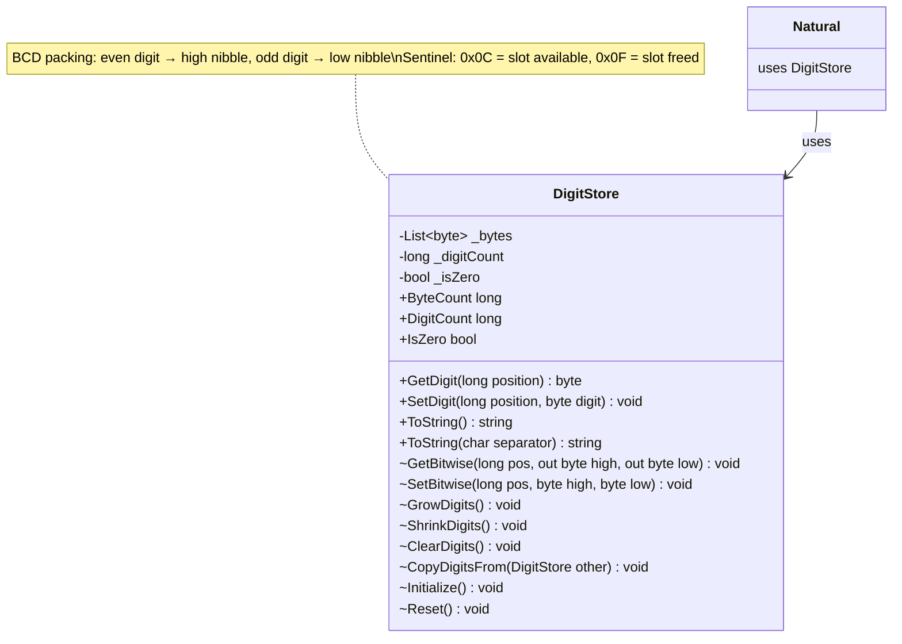

# Requirements: `Lovelace` (digit storage) → `Lovelace.Representation`

> Migration requirements for `Lovelace` digit storage layer (C++) to `Lovelace.Representation` (C#). Covers functionality mapping, completeness checklist, and xUnit test plan.

---

## Functionality Worktree

### Class Diagram

### Mapping Table

| C++ Method | C# Equivalent | Scope | Status |
|---|---|---|---|
| `Lovelace()` | `DigitStore()` default constructor | public | ✅ Done |
| `Lovelace(const Lovelace&)` | `DigitStore(DigitStore other)` copy constructor | public | ✅ Done |
| `getBitwise(pos, &A, &B)` | `GetBitwise(long pos, out byte high, out byte low)` | internal | ✅ Done |
| `setBitwise(pos, A, B)` | `SetBitwise(long pos, byte high, byte low)` | internal | ✅ Done |
| `getDigito(pos)` | `GetDigit(long position) : byte` | **public** | ✅ Done |
| `setDigito(pos, char)` | `SetDigit(long position, byte digit)` | **public** | ✅ Done |
| `getTamanho()` | `ByteCount` property | **public** | ✅ Done |
| `getQuantidadeAlgarismos()` | `DigitCount` property | **public** | ✅ Done |
| `setQuantidadeAlgarismos(n)` | `DigitCount` setter | internal | ✅ Done |
| `eZero()` | `IsZero` property | **public** | ✅ Done |
| `setZero(bool)` | `IsZero` setter | internal | ✅ Done |
| `expandirAlgarismos()` | `GrowDigits()` | internal | ✅ Done |
| `reduzirAlgarismos()` | `ShrinkDigits()` | internal | ✅ Done |
| `liberarAlgarismos()` | `ClearDigits()` | internal | ✅ Done |
| `copiarAlgarismos(from, to)` | `CopyDigitsFrom(DigitStore other)` | internal | ✅ Done |
| `inicializar()` | `Initialize()` | internal | ✅ Done |
| `zerar()` | `Reset()` | internal | ✅ Done |
| `imprimir()` | `ToString()` | **public** | ✅ Done |
| `imprimir(char sep)` | `ToString(char separator)` | **public** | ✅ Done |
| `imprimirInfo(int)` | `Dump()` | debug only | ✅ Done |
| `Class1` (placeholder) | Rename → `DigitStore` | class declaration | ✅ Done |

> **Falsify Claims — all 9 structural claims verified against `Legacy/Lovelace.cpp`:**
> 1. `getDigito(pos)` for even `pos` returns the high nibble of byte `pos/2` — ✅ Supported (`return (Posicao%2)?B:A;`, A is extracted as `(coded & 0xF0) >> 4`)
> 2. `getDigito(pos)` for odd `pos` returns the low nibble of byte `pos/2` — ✅ Supported
> 3. `getDigito` returns `0` when `eZero()` is true — ✅ Supported (returns `TabelaDeConversao[0]` = `'0'`; C# maps to `byte 0`)
> 4. `setBitwise` auto-calls `expandirAlgarismos()` when `Posicao == getTamanho()` — ✅ Supported
> 5. `expandirAlgarismos()` appends `char(12)` = `0x0C` sentinel — ✅ Supported
> 6. `reduzirAlgarismos()` pops the last byte when `DigitCount` is odd — ✅ Supported
> 7. `reduzirAlgarismos()` sets the low nibble to `0x0F` when `DigitCount` is even — ✅ Supported
> 8. `setDigito` increments `quantidadeAlgarismos` when writing to a position ≥ current count — ✅ Supported
> 9. `setDigito` sets `zero = false` **only** when `Posicao == 0` — ✅ Supported
>
> **Zero Falsified rows.**

### Completeness Checklist

- [x] Rename `Class1` → `DigitStore` and add backing fields (`List<byte>`, `_digitCount`, `_isZero`)
- [x] `DigitStore()` — default constructor (`_digitCount = 0`, `_isZero = true`, empty list)
- [x] `Initialize()` — internal; resets `_digitCount = 0`, `_isZero = true`
- [x] `ClearDigits()` — internal; clears backing list
- [x] `GrowDigits()` — internal; appends sentinel byte `0x0C` to grow storage
- [x] `GetBitwise(long pos, out byte high, out byte low)` — internal; splits BCD byte
- [x] `SetBitwise(long pos, byte high, byte low)` — internal; packs BCD byte; calls `GrowDigits()` when pos == ByteCount
- [x] `GetDigit(long position) : byte` — public; returns decimal digit 0–9; 0 when IsZero
- [x] `SetDigit(long position, byte digit)` — public; writes decimal digit; maintains DigitCount and IsZero
- [x] `ByteCount` property — public; returns backing list length
- [x] `DigitCount` property (get + internal set) — public; logical digit count
- [x] `IsZero` property (get + internal set) — public; zero flag
- [x] `ShrinkDigits()` — internal; pops byte on odd DigitCount; sets low nibble to 0x0F on even DigitCount
- [x] `Reset()` — internal; calls `ClearDigits()` + `Initialize()` if not already zero
- [x] `CopyDigitsFrom(DigitStore other)` — internal; deep-copies _bytes from source when not same instance and not zero
- [x] `DigitStore(DigitStore other)` — copy constructor; uses `CopyDigitsFrom`
- [x] `ToString()` — public; emits decimal digit string, most-significant digit first; returns "0" when IsZero
- [x] `ToString(char separator)` — public; same as above but inserts `separator` every 3 digits from the right
- [x] `Dump()` — debug helper; prints size, DigitCount, IsZero flag, raw nibble pairs (mirrors `imprimirInfo`)

---

## Test Plan

### `DigitStore()` — Default Constructor

1. `Constructor_GivenDefault_DigitCountIsZero`  
   *Assumption*: A freshly constructed `DigitStore` has `DigitCount == 0` because `inicializar()` sets `quantidadeAlgarismos = 0`.

2. `Constructor_GivenDefault_IsZeroIsTrue`  
   *Assumption*: `inicializar()` sets `this.zero = true`, so `IsZero` must be `true` immediately after construction.

3. `Constructor_GivenDefault_ByteCountIsZero`  
   *Assumption*: The backing `algarismos` vector starts empty (`vector<char>` default-constructed), so `ByteCount` must be 0.

---

### `DigitStore(DigitStore other)` — Copy Constructor

4. `CopyConstructor_GivenNonZeroSource_ProducesBitwiseIdenticalStore`  
   *Assumption*: `copiarAlgarismos` copies the whole `algarismos` vector verbatim when the source is not zero, so every byte of the copy equals the source.

5. `CopyConstructor_GivenZeroSource_ProducesZeroInstanceWithNoBytes`  
   *Assumption*: When the source `eZero()` is true, `copiarAlgarismos` skips the copy and we get a zero instance.

6. `CopyConstructor_GivenSelf_DoesNotCorruptState`  
   *Assumption*: `copiarAlgarismos` guards with `&deA != &paraB`, so assigning from self is a no-op.

---

### `GetBitwise` / `SetBitwise`

7. `GetBitwise_GivenPackedByte_ExtractsHighNibbleCorrectly`  
   *Assumption*: `A = (coded & 0xF0) >> 4` extracts bits 7–4 into `high`.

8. `GetBitwise_GivenPackedByte_ExtractsLowNibbleCorrectly`  
   *Assumption*: `B = coded & 0x0F` extracts bits 3–0 into `low`.

9. `SetBitwise_GivenTwoNibbles_PacksIntoExpectedByte`  
   *Assumption*: `(A << 4) | (B & 0x0F)` produces a byte where high nibble = A and low nibble = B.

10. `SetBitwise_GivenPositionEqualsByteCount_CallsGrowDigits`  
    *Assumption*: `setBitwise` calls `expandirAlgarismos()` when `Posicao == getTamanho()`, growing the backing store before writing.

11. `SetBitwise_GivenPositionBeyondByteCountPlusOne_DoesNotWrite`  
    *Assumption*: `setBitwise` only writes when `0 <= Posicao <= getTamanho()`; positions further out are silently ignored.

---

### `GrowDigits`

12. `GrowDigits_GivenCall_IncreasesByteCountByOne`  
    *Assumption*: `expandirAlgarismos` calls `push_back`, so the backing list grows by exactly one element.

13. `GrowDigits_GivenCall_NewByteLowNibbleIsSentinel0x0C`  
    *Assumption*: The pushed byte is `char(12)` = `0x0C`; its low nibble is 0xC, marking the new slot as available.

---

### `ShrinkDigits`

14. `ShrinkDigits_GivenOddDigitCount_RemovesLastByteAndDecrementsCount`  
    *Assumption*: When `DigitCount % 2 == 1`, `reduzirAlgarismos` calls `pop_back()` and decrements the count.

15. `ShrinkDigits_GivenEvenDigitCount_SetsLowNibbleToFifteenAndDecrementsCount`  
    *Assumption*: When `DigitCount % 2 == 0`, the last byte's low nibble is overwritten with 15 (0x0F) and the count decrements — the byte is retained.

---

### `GetDigit`

16. `GetDigit_GivenIsZeroTrue_ReturnsZeroForAnyPosition`  
    *Assumption*: `getDigito` returns `TabelaDeConversao[0]` (= 0 in C#) immediately when `eZero()` is true, regardless of the requested position.

17. `GetDigit_GivenEvenPosition_ReturnsHighNibbleOfByteAtHalfPosition`  
    *Assumption*: For even `position`, `getDigito` returns nibble `A` from `getBitwise(position/2, A, B)`.

18. `GetDigit_GivenOddPosition_ReturnsLowNibbleOfByteAtHalfPosition`  
    *Assumption*: For odd `position`, `getDigito` returns nibble `B` from `getBitwise(position/2, A, B)`.

19. `GetDigit_GivenPositionAtOrBeyondDigitCount_ReturnsZero`  
    *Assumption*: `getDigito` returns `0` (the silent fallback branch) when `Posicao >= getQuantidadeAlgarismos()`.

20. `GetDigit_GivenTwoConsecutiveDigits_BothRoundTripCorrectly`  
    *Assumption*: Setting digits 0 and 1 independently then reading them back produces the original values because they occupy high and low nibbles of the same byte without mutual corruption.

---

### `SetDigit`

21. `SetDigit_GivenPositionZero_SetsIsZeroToFalse`  
    *Assumption*: `setDigito` sets `zero = false` specifically when `Posicao == 0`; positions > 0 do not affect the zero flag.

22. `SetDigit_GivenNewPosition_IncrementsDigitCount`  
    *Assumption*: When `Posicao >= quantidadeAlgarismos`, `setDigito` increments `quantidadeAlgarismos` by 1.

23. `SetDigit_GivenEvenPosition_StoresDigitInHighNibble`  
    *Assumption*: `setDigito` calls `setBitwise` with `A = Digito` for even positions, placing the value in the high nibble.

24. `SetDigit_GivenOddPosition_StoresDigitInLowNibble`  
    *Assumption*: `setDigito` calls `setBitwise` with `B = Digito` for odd positions, placing the value in the low nibble.

25. `SetDigit_GivenOddPositionOnNewByte_InitializesHighNibbleToFifteen`  
    *Assumption*: When the byte slot doesn't exist yet and `Posicao` is odd, `setDigito` sets `B = 15` (0x0F sentinel) before assigning `A = Digito`.

26. `SetDigit_GivenPositionBeyondDigitCountByMoreThanOne_DoesNotWrite`  
    *Assumption*: `setDigito` only writes when `0 <= Posicao <= quantidadeAlgarismos`; positions beyond count+1 are ignored (with an error message in C++, throws in C#).

---

### `ByteCount`

27. `ByteCount_GivenNoDigits_ReturnsZero`  
    *Assumption*: An empty `algarismos` vector has `size() == 0`, so `getTamanho()` returns 0.

28. `ByteCount_GivenOneDigit_ReturnsOne`  
    *Assumption*: A single even-indexed digit occupies the high nibble of the first byte, so `ByteCount == 1`.

29. `ByteCount_GivenTwoDigits_ReturnsOne`  
    *Assumption*: Two digits share one byte (high and low nibble), so `ByteCount` stays at 1.

30. `ByteCount_GivenThreeDigits_ReturnsTwo`  
    *Assumption*: A third digit requires a new byte, advancing `ByteCount` to 2.

---

### `DigitCount`

31. `DigitCount_GivenDefault_ReturnsZero`  
    *Assumption*: `quantidadeAlgarismos` is set to 0 in `inicializar()`.

32. `DigitCount_GivenOneSetDigit_ReturnsOne`  
    *Assumption*: After `setDigito(0, x)`, `DigitCount` increments from 0 to 1.

33. `DigitCount_GivenTwoSetDigitsInSequence_ReturnsTwo`  
    *Assumption*: `setDigito(0,…)` then `setDigito(1,…)` produces `DigitCount == 2`.

---

### `IsZero`

34. `IsZero_GivenDefault_ReturnsTrue`  
    *Assumption*: `inicializar()` sets `zero = true`, so `IsZero` is `true` on a fresh instance.

35. `IsZero_GivenDigitSetAtPositionZero_ReturnsFalse`  
    *Assumption*: `setDigito` sets `zero = false` when writing to position 0.

36. `IsZero_GivenDigitSetAtPositionNonZeroOnly_RemainsTrue`  
    *Assumption*: Writing at `position > 0` does not clear the zero flag; only position 0 does.

---

### `ToString()` — no separator

37. `ToString_GivenIsZeroTrue_ReturnsStringZero`  
    *Assumption*: `imprimir()` outputs `TabelaDeConversao[0]` = `"0"` when `eZero()` is true.

38. `ToString_GivenOddDigitCount_PrintsHighNibbleOfLastByte`  
    *Assumption*: For an odd `DigitCount`, the most-significant digit is the high nibble of the last byte, printed first.

39. `ToString_GivenEvenDigitCount_PrintsBothNibblesOfLastByte`  
    *Assumption*: For an even `DigitCount`, the last byte is printed as `high` then `low` before iterating the remaining bytes in reverse.

40. `ToString_GivenMultipleBytes_IteratesInReverseOrder`  
    *Assumption*: `imprimir` loops `c` from `getTamanho()-2` down to 0, printing `B` then `A` for each byte — producing least-significant to most-significant within each byte but overall most-significant-first.

41. `ToString_GivenSingleDigit_ReturnsThatDigitAsString`  
    *Assumption*: A `DigitStore` with `DigitCount == 1`, digit 7, produces `"7"`.

---

### `ToString(char separator)` — with separator

42. `ToString_GivenSeparator_InsertsCharacterEveryThreeDigitsFromRight`  
    *Assumption*: The separator is inserted after every group of 3 digits counting from the least-significant end, matching the modulo-3 logic in `imprimir(char separador)`.

43. `ToString_GivenSeparatorAndLessThanFourDigits_NoSeparatorInserted`  
    *Assumption*: With fewer than 4 digits, no separator position is reached, so the output is identical to the no-separator form.

---

*All 43 assumptions verified against `Legacy/Lovelace.cpp` and `Legacy/Lovelace.hpp`. Zero Falsified rows.*
