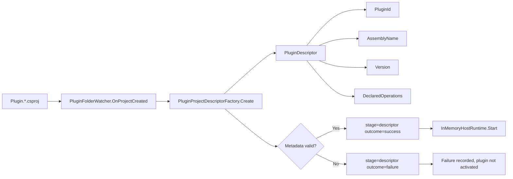
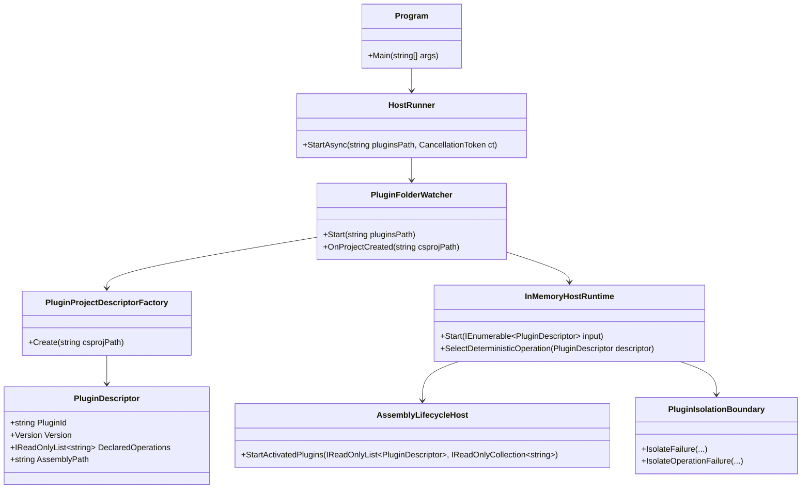
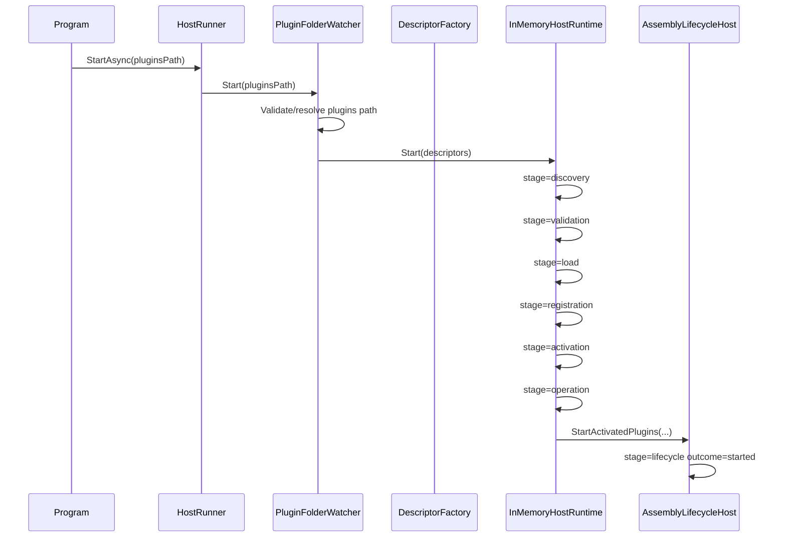
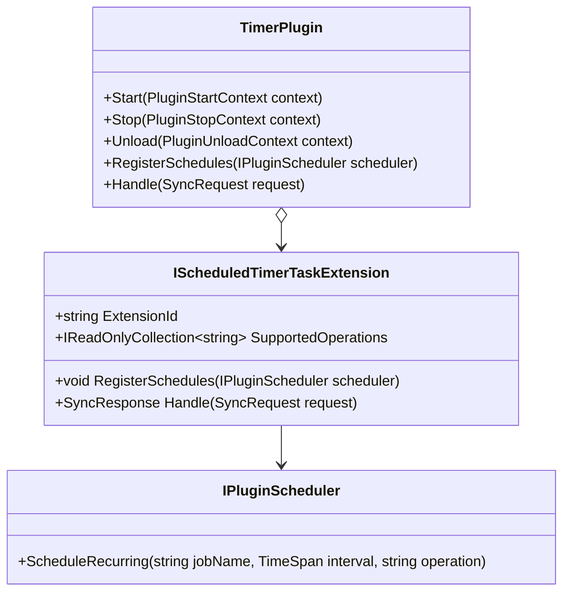
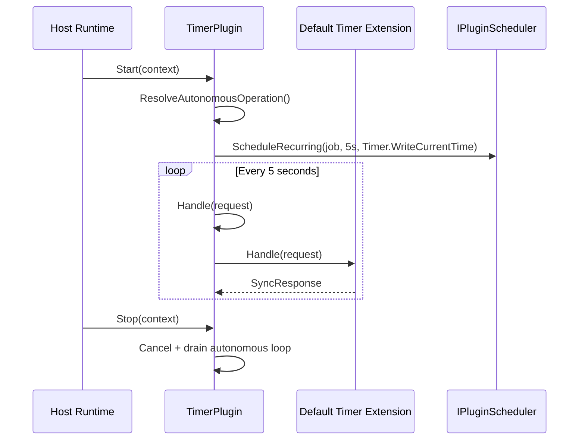

# Modus

Modus is an open-source plugin platform built with .NET and C# to support two goals:

- Multi-service orchestration with deterministic runtime behavior
- Modular monolith architectures with strict boundaries and explicit extension points

At its core, Modus provides a host runtime that discovers plugin artifacts, validates contracts, wires dependencies, activates safe capabilities, and isolates failures so healthy plugins continue running.

## What Modus Solves

Modus is designed for teams that want to evolve from a clean monolith to orchestrated services without losing control over:

- Module ownership and architecture boundaries
- Runtime safety during plugin onboarding and activation
- Contract-first extensibility for optional capabilities
- Deterministic diagnostics for testing and operations

## Platform Principles

- Contract-first extensibility: plugins implement stable interfaces instead of relying on host internals
- Deterministic runtime pipeline: discovery, validation, load, registration, activation, and operation stages are explicit and observable
- Failure isolation: plugin faults are contained and do not halt healthy plugin execution
- Test-first evolution: contract behavior and host flows are verified through unit and integration suites

## Repository Scope

This repository contains:

- Core contracts and plugin abstractions in `src/Modus.Core`
- Host runtime and startup composition in `src/Modus.Host`
- Example and concrete plugins under `plugins` and `src/SamplePlugins`
- Architecture, unit, and integration tests under `tests`

## Quick Start

### Run host continuously with plugins folder

```bash
dotnet run --project src/Modus.Host/Modus.Host.csproj -- plugins
```

### Run host once (startup validation check)

```bash
dotnet run --project src/Modus.Host/Modus.Host.csproj -- plugins --run-once
```

### Use embedded hosting from another app

```csharp
using Microsoft.Extensions.DependencyInjection;
using Modus.Host.Hosting;
using Modus.Host.Plugins;

var services = new ServiceCollection();
services.AddModusPluginHosting(options =>
{
    options.PluginsPath = "plugins";
    options.RunOnce = false;
});

await using var provider = services.BuildServiceProvider();
var runner = provider.GetRequiredService<HostRunner>();
var result = await runner.StartAsync(CancellationToken.None);
```

## Plugin Authoring Workflows

The sections below provide the operational reference extracted from `.github/requirements/Modus.PluginAuthoring.Workflows.md`, covering:

- Artifact onboarding for Host runtime discovery
- Standard plugin authoring
- Scheduled plugin authoring
- Timer extension composition and autonomous behavior
- Deterministic diagnostics and failure isolation
- Regression test workflow and release gates

For detailed migration guidance and troubleshooting, see [src/Modus.Host/MIGRATION.md](src/Modus.Host/MIGRATION.md).

## 1. Artifact Model and Onboarding

### 1.1 Plugin artifact contract

A plugin project is discoverable when it satisfies all onboarding conditions:

- File extension is `.csproj`
- File is located under the configured `plugins` root
- Filename starts with `Plugin.`
- Metadata parses deterministically

Deterministic descriptor identity is derived in this order:

1. `PluginId` from normalized project filename
2. `AssemblyName` from `<AssemblyName>` or fallback to `PluginId`
3. `Version` from `<ModusVersion>` or default `1.0.0`
4. Stable list parsing for capabilities, dependencies, operations

### 1.2 Artifact diagram



### 1.3 Metadata table

| Property | Default | Rule |
|---|---|---|
| `AssemblyName` | Normalized `PluginId` | Normalize with same identity rules |
| `ModusVersion` | `1.0.0` | Must parse as `System.Version` |
| `ModusContractCompliant` | `true` | Strict bool parsing |
| `ModusIsValidAssembly` | `true` | Strict bool parsing |
| `ModusUsesOnlyStandardLibrary` | `true` | Strict bool parsing |
| `ModusFailOnActivation` | `false` | Strict bool parsing |
| `ModusCapabilities` | `Cap.{PluginId}` | Split by `;`/`,`, distinct + ordinal sort |
| `ModusDependsOn` | Empty list | Split by `;`/`,`, distinct + ordinal sort |
| `ModusOperations` | Empty list | Split by `;`/`,`, distinct + ordinal sort |
| `ModusFailingOperations` | Empty list | Split by `;`/`,`, distinct + ordinal sort |

## 2. Core Runtime Classes



## 3. Host Startup and Discovery Flow



## 4. Plugin Authoring Contracts

### 4.1 Standard plugin

A standard plugin must implement:

- `IPluginContract`
- `IPluginLifecycle`
- `IPluginOperationCatalog`

Operation catalog must be deterministic:

- No null/empty/whitespace operations
- Ordinal distinct
- Ordinal sorted

### 4.2 Scheduled plugin

A scheduled plugin must additionally implement:

- `IPluginScheduledEvents`

`RegisterSchedules(IPluginScheduler scheduler)` must register deterministic recurring jobs with stable:

- `jobName`
- `interval`
- `operation`

Recommended naming pattern:

- `<Operation>.Every<IntervalLabel>`

## 5. Timer Plugin Extensions and Autonomous Loop



### 5.1 Extension ownership and routing

- Extension composition drives operation ownership
- Known operations route to owning extension
- Unknown operations return deterministic rejection:
  - `Success=false`
  - `Status=Rejected`
  - `Payload=unsupported-operation`
  - Correlation id preserved

### 5.2 Autonomous loop behavior

- Default cadence: `TimeSpan.FromSeconds(5)` in default constructors
- Default operation selected deterministically from first extension ownership
- `Start` begins loop with cancellation linkage
- `Stop` and `Unload` both cancel and drain loop
- No post-cancellation dispatches are allowed



## 6. Deterministic Diagnostics and Failure Isolation

### 6.1 Required stage diagnostics

For successful runtime onboarding and execution, diagnostics must include deterministic stage keys:

- `stage=discovery`
- `stage=validation`
- `stage=load`
- `stage=registration`
- `stage=activation`
- `stage=operation`
- `stage=lifecycle ... outcome=started`

### 6.2 Failure behavior

Failures are isolated per plugin and must preserve continuity for healthy plugins:

- Validation failure blocks downstream stages for failed plugin
- Load/activation/operation failures emit stage-specific failure diagnostics
- Isolation boundary diagnostics remain deterministic
- Healthy plugins continue startup/operation path

## 7. Regression Workflow (Required Gate)

Run in this order after workflow-impacting changes:

1. Core unit suite

```bash
dotnet build tests/Modus.Core.Tests/Modus.Core.Tests.csproj
dotnet test tests/Modus.Core.Tests/Modus.Core.Tests.csproj --no-build
```

2. Host integration suite

```bash
dotnet build src/Modus.Host/Modus.Host.csproj
dotnet test tests/Modus.Host.IntegrationTests/Modus.Host.IntegrationTests.csproj --no-build
```

3. Full solution safety gate (when cross-cutting changes exist)

```bash
dotnet build Modus.slnx
dotnet test Modus.slnx --no-build
```

## 8. Practical Authoring Checklist

Use this condensed checklist when creating or updating a plugin:

- Create `Plugin.*.csproj` under `plugins` root
- Ensure metadata is deterministic and parseable
- Implement required contracts (`IPluginContract`, `IPluginLifecycle`, `IPluginOperationCatalog`)
- For scheduled plugins, implement `IPluginScheduledEvents` and deterministic `ScheduleRecurring`
- For timer extensions, implement `IScheduledTimerTaskExtension` and declare stable ownership
- Validate deterministic diagnostics and failure-isolation behavior
- Run required regression commands and keep evidence

## 9. Source of Truth

- Requirements source: `.github/requirements/Modus.PluginAuthoring.Workflows.md`
- This README is a documentation extraction focused on artifact design, class relationships, and operational flows.
