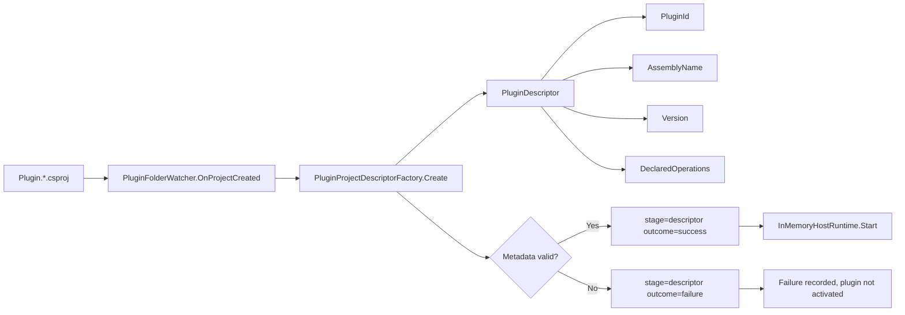
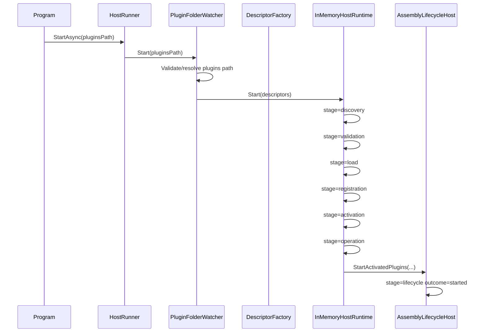
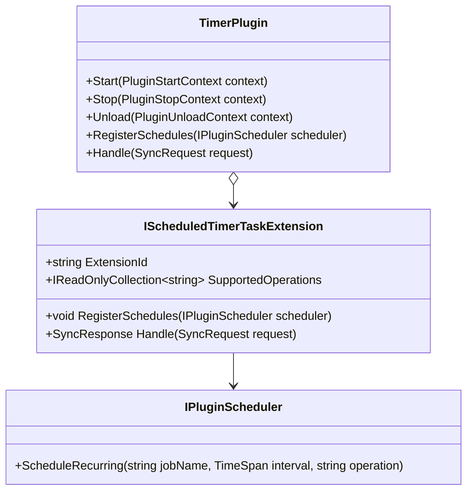
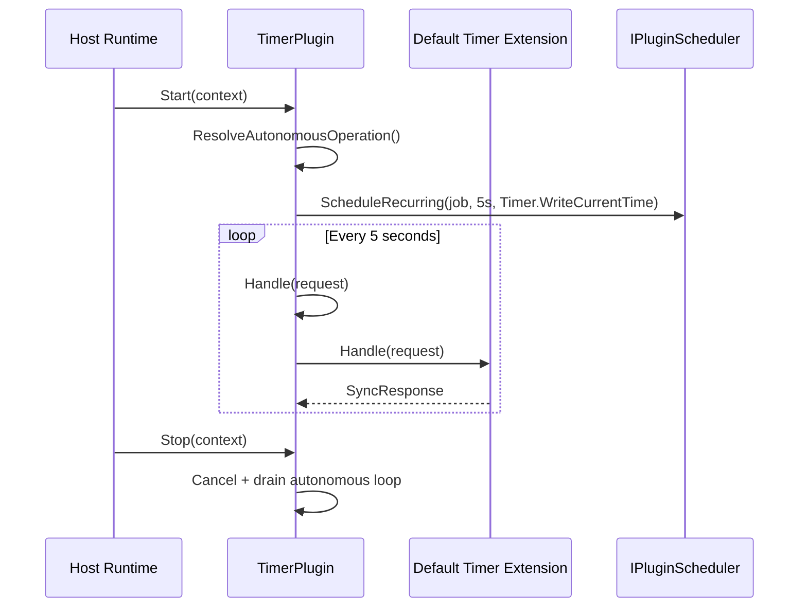

Modus is an open-source plugin platform built with .NET and C# to support two goals:

- Multi-service orchestration with deterministic runtime behavior
- Modular monolith architectures with strict boundaries and explicit extension points

At its core, Modus provides a host runtime that discovers plugin artifacts, validates contracts, wires dependencies, activates safe capabilities, and isolates failures so healthy plugins continue running.

## What Modus Solves

Modus is designed for teams that want to evolve from a clean monolith to orchestrated services without losing control over:

- Module ownership and architecture boundaries
- Runtime safety during plugin onboarding and activation
- Contract-first extensibility for optional capabilities
- Deterministic diagnostics for testing and operations

## Platform Principles

- Contract-first extensibility: plugins implement stable interfaces instead of relying on host internals
- Deterministic runtime pipeline: discovery, validation, load, registration, activation, and operation stages are explicit and observable
- Failure isolation: plugin faults are contained and do not halt healthy plugin execution
- Test-first evolution: contract behavior and host flows are verified through unit and integration suites

## Core-Host Foundation Model

Modus uses a plugin-driven modular monolith foundation where composition ownership is explicit:

- Core owns contracts and extension points; it never composes runtime dependencies.
- Host is the only composition root and is solely responsible for plugin discovery, validation, registration, and activation.
- Modules and plugins communicate through contracts and events; direct cross-module internals access is forbidden.

## Architectural Invariants

These invariants define non-negotiable boundaries across Core and Host:

- Core interfaces are versioned contracts consumed by modules and plugins.
- Host startup remains deterministic and stage-oriented for repeatable diagnostics.
- Plugin capabilities are activated only after contract and dependency validation succeeds.
- Failure isolation preserves continuity for healthy plugins when one plugin faults.

### Deterministic Runtime Stages

1. discovery
2. validation
3. load
4. registration
5. activation
6. operation

## Repository Scope

This repository contains:

- Core contracts and plugin abstractions in `src/Modus.Core`
- Host runtime and startup composition in `src/Modus.Host`
- Example and concrete plugins under `plugins` and `src/SamplePlugins`
- Architecture, unit, and integration tests under `tests`

## Quick Start

### Run host continuously with plugins folder

```bash
dotnet run --project src/Modus.Host/Modus.Host.csproj -- plugins
```

### Run host once (startup validation check)

```bash
dotnet run --project src/Modus.Host/Modus.Host.csproj -- plugins --run-once
```

### Use embedded hosting from another app

```csharp
using Microsoft.Extensions.DependencyInjection;
using Modus.Host.Hosting;
using Modus.Host.Plugins;

var services = new ServiceCollection();
services.AddModusPluginHosting(options =>
{
        options.PluginsPath = "plugins";
        options.RunOnce = false;
});

await using var provider = services.BuildServiceProvider();
var runner = provider.GetRequiredService<HostRunner>();
var result = await runner.StartAsync(CancellationToken.None);
```

## Developer Quickstart

This is the minimal end-to-end path from clone to a running custom plugin using the current Core and Host APIs.

### 1. Create plugin project under the host-scanned `plugins` folder

```bash
dotnet new classlib --framework net10.0 --name Plugin.Weather -o plugins/Plugin.Weather
dotnet add plugins/Plugin.Weather/Plugin.Weather.csproj reference src/Modus.Core/Modus.Core.csproj
```

Update `plugins/Plugin.Weather/Plugin.Weather.csproj`:

```xml
<Project Sdk="Microsoft.NET.Sdk">
    <PropertyGroup>
        <TargetFramework>net10.0</TargetFramework>
        <ImplicitUsings>enable</ImplicitUsings>
        <Nullable>enable</Nullable>
        <AssemblyName>Plugin.Weather</AssemblyName>
        <ModusVersion>1.0.0</ModusVersion>
        <ModusCapabilities>Cap.Weather</ModusCapabilities>
        <ModusOperations>Weather.GetCurrent</ModusOperations>
    </PropertyGroup>

    <ItemGroup>
        <ProjectReference Include="..\..\src\Modus.Core\Modus.Core.csproj" />
    </ItemGroup>
</Project>
```

### 2. Implement plugin contract + lifecycle + operation catalog

Create `plugins/Plugin.Weather/WeatherPlugin.cs`:

```csharp
using Microsoft.Extensions.DependencyInjection;
using Modus.Core.Plugins;

namespace Modus.SamplePlugins.Weather;

public interface IWeatherPluginContract : IPluginContract
{
}

public sealed class WeatherPlugin : SingletonPlugin<WeatherPlugin>, IWeatherPluginContract
{
        public override PluginId PluginId => new("Plugin.Weather");

        public override ContractName ContractName => new("Modus.PluginContract");

        public override Version ContractVersion => new(1, 0, 0);

        public override IReadOnlyCollection<OperationName> SupportedOperations => [new OperationName("Weather.GetCurrent")];

        protected override void RegisterPluginServices(IServiceCollection services)
        {
                ArgumentNullException.ThrowIfNull(services);
                base.RegisterPluginServices(services);
                services.AddPluginServiceInterface<IWeatherPluginContract, WeatherPlugin>(DeclaredServiceLifetime);
        }
}
```

### 3. Build plugin and run host with deterministic startup

```bash
dotnet build plugins/Plugin.Weather/Plugin.Weather.csproj
dotnet run --project src/Modus.Host/Modus.Host.csproj -- plugins --run-once
```

### 4. Validate wiring and activation from host diagnostics

In successful startup output, confirm these markers:

- `stage=di outcome=success`
- `stage=discovery outcome=success`
- `stage=validation outcome=success`
- `stage=activation outcome=success`

If `--run-once` exits with code `0` and all markers are present, the plugin is created, wired, and validated against current APIs.

## Contribution Workflow for Docs and Examples

When a change affects docs, examples, or architecture artifacts, contributors must update all linked surfaces in one PR.

### Required update paths

- Core contracts and extension API docs: `src/Modus.Core/README.md`
- Host runtime behavior and lifecycle docs: `src/Modus.Host/README.md`
- Top-level navigation and quickstart: `README.md`
- Documentation requirements worktree: `.github/requirements/Modus.Core-Modus.Host.Docs.md`
- Transition-proof artifacts for checklist transitions: `.github/artifacts/`

### Review gates

1. Every docs PR includes at least one executable validation command and its expected success signal.
2. Any changed command or snippet is verified against the current repository layout before merge.
3. Checklist item transitions in requirements docs include a linked transition-proof artifact.

### Architecture artifact synchronization rules

- Keep architecture diagrams, requirements checklists, and referenced runtime stages synchronized in the same PR.
- If runtime stage names or ordering change, update all affected docs and add/adjust integration tests that assert deterministic order.
- Keep sample plugin metadata (`<ModusOperations>`, capabilities, and lifetimes) aligned with runnable plugin projects under `plugins/`.
- Record checklist [ ] -> [x] transitions with before/after snapshots and SHA256 hashes in `.github/artifacts/`.

## Documentation Validation Pipeline

Use this pipeline to keep documentation links, code snippets, and command examples aligned with the current repository state.

### Local validation commands

1. Link checks

```powershell
Select-String -Path README.md,src/Modus.Core/README.md,src/Modus.Host/README.md -Pattern '\[[^\]]+\]\((?!https?://)(?!#)[^)]+\)'
```

2. Snippet compile checks

```bash
dotnet build src/Modus.Host/Modus.Host.csproj -v minimal
```

3. Command verification

```bash
dotnet test tests/Modus.Host.IntegrationTests/Modus.Host.IntegrationTests.csproj --no-build -v minimal
```

Expected success signal:

- Each command exits with code `0`.
- Link checks return only intentional local links.
- Build and test output report succeeded status.

### CI integration expectations

- Trigger these checks on every PR that changes docs, snippets, or command examples.
- Treat any non-zero command exit code as a docs validation failure.
- Keep command output in CI logs so contributors can identify which validation gate failed.

### Failure signals and fix path

1. Identify failing gate (links, snippet compile, or command verification) from CI output.
2. Update the corresponding docs or snippet to match the current repository contracts and paths.
3. Re-run local validation commands and attach passing output summary in the PR.
4. If commands changed, update docs and requirements checklist transition proof together.

## Scenario Cookbook

These recipes cover common plugin-authoring and host-integration paths using the current Core and Host contracts.

### Recipe 1: Standard plugin contract plus deterministic lifecycle

- Use `SingletonPlugin<TSelf>`, `ScopedPlugin<TSelf>`, or `TransientPlugin<TSelf>` as the base class for declared service lifetime.
- Define `PluginId`, `ContractName`, and `ContractVersion` with stable values before activation.
- Declare supported operations through `SupportedOperations` and keep names deterministic.
- Implement lifecycle hooks in deterministic order: `Load`, `Start`, `Stop`, `Unload`.
- Register plugin services via `RegisterPluginServices(IServiceCollection services)` and `AddPluginServiceInterface<TService, TImplementation>(DeclaredServiceLifetime)`.

### Recipe 2: Host integration with deterministic validation and diagnostics

- Start with `dotnet run --project src/Modus.Host/Modus.Host.csproj -- plugins --run-once` to verify startup deterministically.
- Treat runtime stages as the diagnostic spine: discovery -> validation -> load -> registration -> activation -> operation.
- Validate expected output markers: `stage=di outcome=success`, `stage=discovery outcome=success`, `stage=validation outcome=success`, `stage=activation outcome=success`.
- If one plugin fails activation, confirm healthy plugins continue and isolate remediation to the failing descriptor or contract.
- Re-run `dotnet test tests/Modus.Host.IntegrationTests/Modus.Host.IntegrationTests.csproj --no-build -v minimal` after docs or sample command changes.

## Diagnostics and Troubleshooting Guide

Use this guide to isolate startup and runtime failures by stage so remediation stays deterministic and scoped.

### Stage-to-symptom isolation map

| Runtime stage | Typical symptom | Isolation checks |
|---|---|---|
| discovery | Plugin project is not found or descriptor list is empty | Verify plugins path, `Plugin.*` project naming, and that artifacts are under the configured root |
| validation | Descriptor rejected before load or capability/contract mismatch | Inspect validation diagnostics for contract compliance, operation catalog, and dependency declarations |
| activation | Plugin fails during startup hooks after registration | Inspect activation outcome and lifecycle hook diagnostics for the failing plugin identifier |

### Failure isolation continuity model

- A plugin fault is isolated to the failing plugin boundary; healthy plugins continue running.
- Treat host shutdown as a last resort: fix or disable the failing plugin, then re-run deterministic startup validation.
- Confirm continuity by checking that non-failing plugins still report successful activation/operation markers.
- Use `--run-once` startup mode to quickly verify whether remediation restored deterministic stage outcomes.

## Migration Notes: Foundation and API Changes

Use this section when upgrading plugins that were authored before the current Core and Host API hardening.

| Before (legacy) | After (current) |
|---|---|
| Plugin reaches into host internals for DI wiring | Plugin dependency registration only through `IPluginDependencyRegister` and host-managed composition |
| Plugin operation identifiers are raw strings scattered across implementation | Operations exposed via deterministic `IPluginOperationCatalog` with stable `OperationName` values |
| Scheduled behavior is ad hoc timer code inside plugin startup | Scheduled work declared via `IPluginScheduledEvents.RegisterSchedules(IPluginScheduler)` with explicit recurring jobs |

### Compatibility Caveats and Fallback Paths

- Caveat: Legacy plugins that depend on host internals can fail validation during startup.
Fallback: migrate dependency wiring into plugin contracts and registrars, then rerun host validation.
- Caveat: Non-deterministic operation naming can break diagnostics comparability.
Fallback: normalize operation names in plugin catalogs and keep names stable across releases.
- Caveat: Ad hoc timers may not map to host-observable lifecycle stages.
Fallback: move recurring work to `RegisterSchedules` and validate with run-once startup output markers.

## Plugin Authoring Workflows

The sections below provide the operational reference extracted from `.github/requirements/Modus.PluginAuthoring.Workflows.md`, covering:

- Artifact onboarding for Host runtime discovery
- Standard plugin authoring
- Scheduled plugin authoring
- Timer extension composition and autonomous behavior
- Deterministic diagnostics and failure isolation
- Regression test workflow and release gates

For detailed migration guidance and troubleshooting, see [src/Modus.Host/MIGRATION.md](src/Modus.Host/MIGRATION.md).

## 1. Artifact Model and Onboarding

### 1.1 Plugin artifact contract

A plugin project is discoverable when it satisfies all onboarding conditions:

- File extension is `.csproj`
- File is located under the configured `plugins` root
- Filename starts with `Plugin.`
- Metadata parses deterministically

Deterministic descriptor identity is derived in this order:

1. `PluginId` from normalized project filename
2. `AssemblyName` from `<AssemblyName>` or fallback to `PluginId`
3. `Version` from `<ModusVersion>` or default `1.0.0`
4. Stable list parsing for capabilities, dependencies, operations

### 1.2 Artifact diagram



### 1.3 Metadata table

| Property | Default | Rule |
|---|---|---|
| `AssemblyName` | Normalized `PluginId` | Normalize with same identity rules |
| `ModusVersion` | `1.0.0` | Must parse as `System.Version` |
| `ModusContractCompliant` | `true` | Strict bool parsing |
| `ModusIsValidAssembly` | `true` | Strict bool parsing |
| `ModusUsesOnlyStandardLibrary` | `true` | Strict bool parsing |
| `ModusFailOnActivation` | `false` | Strict bool parsing |
| `ModusCapabilities` | `Cap.{PluginId}` | Split by `;`/`,`, distinct + ordinal sort |
| `ModusDependsOn` | Empty list | Split by `;`/`,`, distinct + ordinal sort |
| `ModusOperations` | Empty list | Split by `;`/`,`, distinct + ordinal sort |
| `ModusFailingOperations` | Empty list | Split by `;`/`,`, distinct + ordinal sort |

## 2. Core Runtime Classes


## 3. Host Startup and Discovery Flow



## 4. Plugin Authoring Contracts

### 4.1 Standard plugin

A standard plugin must implement:

- `IPluginContract`
- `IPluginLifecycle`
- `IPluginOperationCatalog`

Operation catalog must be deterministic:

- No null/empty/whitespace operations
- Ordinal distinct
- Ordinal sorted

### 4.2 Scheduled plugin

A scheduled plugin must additionally implement:

- `IPluginScheduledEvents`

`RegisterSchedules(IPluginScheduler scheduler)` must register deterministic recurring jobs with stable:

- `jobName`
- `interval`
- `operation`

Recommended naming pattern:

- `<Operation>.Every<IntervalLabel>`

## 5. Timer Plugin Extensions and Autonomous Loop



### 5.1 Extension ownership and routing

- Extension composition drives operation ownership
- Known operations route to owning extension
- Unknown operations return deterministic rejection:
  - `Success=false`
  - `Status=Rejected`
  - `Payload=unsupported-operation`
  - Correlation id preserved

### 5.2 Autonomous loop behavior

- Default cadence: `TimeSpan.FromSeconds(5)` in default constructors
- Default operation selected deterministically from first extension ownership
- `Start` begins loop with cancellation linkage
- `Stop` and `Unload` both cancel and drain loop
- No post-cancellation dispatches are allowed



## 6. Deterministic Diagnostics and Failure Isolation

### 6.1 Required stage diagnostics

For successful runtime onboarding and execution, diagnostics must include deterministic stage keys:

- `stage=discovery`
- `stage=validation`
- `stage=load`
- `stage=registration`
- `stage=activation`
- `stage=operation`
- `stage=lifecycle ... outcome=started`

### 6.2 Failure behavior

Failures are isolated per plugin and must preserve continuity for healthy plugins:

- Validation failure blocks downstream stages for failed plugin
- Load/activation/operation failures emit stage-specific failure diagnostics
- Isolation boundary diagnostics remain deterministic
- Healthy plugins continue startup/operation path

## 7. Regression Workflow (Required Gate)

Run in this order after workflow-impacting changes:

1. Core unit suite

```bash
dotnet build tests/Modus.Core.Tests/Modus.Core.Tests.csproj
dotnet test tests/Modus.Core.Tests/Modus.Core.Tests.csproj --no-build
```

2. Host integration suite

```bash
dotnet build src/Modus.Host/Modus.Host.csproj
dotnet test tests/Modus.Host.IntegrationTests/Modus.Host.IntegrationTests.csproj --no-build
```

3. Full solution safety gate (when cross-cutting changes exist)

```bash
dotnet build Modus.slnx
dotnet test Modus.slnx --no-build
```

## 8. Practical Authoring Checklist

Use this condensed checklist when creating or updating a plugin:

- Create `Plugin.*.csproj` under `plugins` root
- Ensure metadata is deterministic and parseable
- Implement required contracts (`IPluginContract`, `IPluginLifecycle`, `IPluginOperationCatalog`)
- For scheduled plugins, implement `IPluginScheduledEvents` and deterministic `ScheduleRecurring`
- For timer extensions, implement `IScheduledTimerTaskExtension` and declare stable ownership
- Validate deterministic diagnostics and failure-isolation behavior
- Run required regression commands and keep evidence

## 9. Source of Truth

- Requirements source: `.github/requirements/Modus.PluginAuthoring.Workflows.md`
- This README is a documentation extraction focused on artifact design, class relationships, and operational flows.
