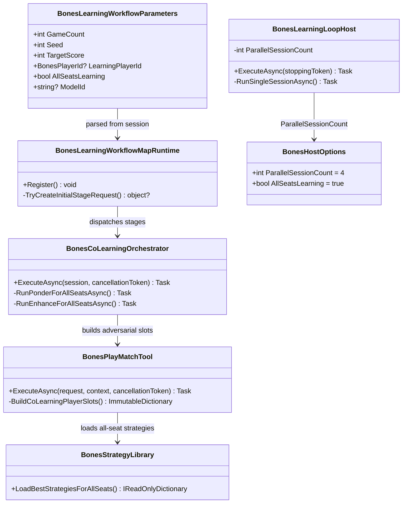

# Adversarial Play and Concurrent Sessions

> Scope: transform the Bones learning loop from a single-seat trainer into a multi-agent adversarial co-learning system where all four seats evolve strategies simultaneously by playing against each other; make parallel session execution the default operational mode. Extends the Wip.Bones.DeepSeekStrategyIteration requirements.

---

## Functionality Worktree

### Verification Policy

- Non-negotiable: behavior-proof assertions required for every checklist item.
- Metadata-only assertions are supporting evidence only.
- Co-learning tests must prove that after N iterations, all four seats have distinct, game-aware strategies with non-trivial win/loss records — not just that `IBonesPlayerSlot` instances exist.
- Parallel session tests must prove concurrent execution reduces wall-clock time vs serial, and that each session operates with independent seed derivations and artifact scopes.
- Library survival tests must prove that after a restart with `ResumeFromBest=true`, all four seats load their library-best strategies and produce distinct match outcomes from a cold start.

### Coverage Inputs

| Input | Value |
|---|---|
| CsProject | Wip.Bones (with Wip.Bones.Engine, Wip.Bones.Agents, Wip.Bones.Host, plus Wip.Bones.Tests, Wip.Bones.Host.Tests) |
| AnalysisSource | Current codebase: single `LearningPlayerId` in `BonesLearningWorkflowParameters`, single-seat Ponder/Enhance path in `BonesLearningWorkflowMapRuntime`, `ParallelSessionCount` defaulting to 1 |
| MandatoryItems | Co-learning: all 4 seats learn simultaneously per match; ParallelSessionCount default raised from 1 to 4 |
| PlanType | requirements |
| OutputPath | harness/requirements/Wip.Bones.AdversarialCoLearning.md |
| OutputTitle | Adversarial Play and Concurrent Sessions |

### Project Layout and Ownership

| Project | Role | Runtime proof gates |
|---|---|---|
| Wip.Bones | `BonesMatchConfig`, `IBonesPlayerSlot`, `IAsyncBonesPlayerSlot` — unchanged contracts | Co-learning match configs assign per-seat library strategies |
| Wip.Bones.Agents | `BonesLearningWorkflowParameters` gains `AllSeatsLearning` mode; `BonesLearningWorkflowMapRuntime` runs Ponder + Enhance for all seats; `BonesPlayMatchTool` uses all-seat library strategies | All 4 seats produce enhancement decisions per iteration |
| Wip.Bones.Host | `BonesLearningLoopHost` orchestrates co-learning iterations; `BonesHostOptions.ParallelSessionCount` defaults to 4 | Co-learning iteration produces 4 ponder/enhance artifacts; parallel sessions complete faster than serial |
| Wip.Bones.Tests | Unit + integration for co-learning workflow, parallel sessions, multi-seat promotion | Executable match paths with all 4 seats learning |
| Wip.Bones.Host.Tests | Host integration for co-learning loop, restart survival for all 4 seats | WebApplicationFactory co-learning proof |

### Architectural Baseline

| Concern | Current state (2026-06-30) | Target |
|---|---|---|
| Learning seat model | Single `LearningPlayerId` in `BonesLearningWorkflowParameters`; only that seat runs Ponder → Enhance | `AllSeatsLearning` mode: Ponder runs for all seats without active strategies; Play runs one match with all seats using their library-best; Enhance runs for all seats that participated |
| Opponent strategies | Opponents loaded from library with fallback to `FirstLegalMove` stub | All seats load from library; co-learning ensures opponents are also evolving, creating adversarial pressure |
| Ponder stage | Runs only for `LearningPlayerId` | Runs for every seat whose library entry is missing or ineffective (bootstrap gate) |
| Play stage | Creates match with learning seat using active strategy, opponents using library strategies | Creates match where ALL seats use their current library-best strategy — no special "learner" slot |
| Enhance stage | Runs only for `LearningPlayerId` | Runs for each seat independently after the match, using that seat's perspective of the match outcome |
| Parallel sessions | `ParallelSessionCount` defaults to 1; each session targets same `LearningPlayerId` | Defaults to 4; each parallel session runs an independent co-learning iteration with distinct seeds |
| Workflow model | Linear: Observe(all) → Ponder(seat N) → Play(seat N vs library opponents) → Enhance(seat N) | Co-learning: Observe(all) → Ponder(all needing bootstrap) → Play(all seats, all library-best) → Enhance(all seats independently) |

### Class Diagram

### Completeness Checklist

#### Multi-Agent Co-Learning (All Seats Learning)

- [ ] Add `AllSeatsLearning` flag to `BonesLearningWorkflowParameters` (default `false` for backward compat); when `true`, `LearningPlayerId` becomes nullable and the workflow runs Ponder + Enhance for all 4 seats [foundation for co-learning]
- [ ] Update `BonesLearningWorkflowMapRuntime.Register()` to detect `AllSeatsLearning` mode and wire a co-learning stage adapter instead of the single-seat linear chain [depends on AllSeatsLearning flag]
- [ ] Implement `BonesCoLearningPonderStage` that runs `BonesPonderAgent` for every seat whose library entry is missing or has win rate below a configurable bootstrap threshold — seats with viable library strategies skip Ponder [depends on AllSeatsLearning flag] [mandatory - co-learning ponder]
- [ ] Update `BonesPlayMatchTool` to build player slots where ALL four seats use their current library-best strategy (via `BonesStrategyLibrary.LoadBestStrategy`), with no special-cased "learning seat" — every seat is a learner and every seat is an opponent [depends on co-learning ponder] [mandatory - adversarial play]
- [ ] Implement `BonesCoLearningEnhanceStage` that runs `BonesEnhanceStrategyAgent` independently for each seat after the match, passing that seat's perspective (its own score, the match outcome, and the transcript) — each seat proposes and evaluates its own strategy improvement [depends on adversarial play] [mandatory - co-learning enhance]
- [ ] Add `BonesStrategyLibrary.LoadBestStrategiesForAllSeats()` returning `IReadOnlyDictionary<BonesPlayerId, BonesStrategyArtifact>` — fails gracefully with a `BonesLibrarySeatIntegrity` report when entries are missing [depends on strategy library]
- [ ] When `AllSeatsLearning=true` and a seat has no library entry and Ponder fails (retry budget exhausted), record a `bones-ponder-failure` artifact for that seat and continue with remaining seats — do not abort the entire iteration [depends on co-learning ponder] [mandatory - partial failure resilience]
- [ ] Add test proving that after 3 co-learning iterations with stub providers, all 4 seats have distinct `Kind=Script` artifacts with game-aware logic (not `legalMoves[0]`) and non-zero effectiveness records [mandatory - co-learning proof]

#### Parallel Sessions as Default

- [ ] Raise `BonesHostOptions.ParallelSessionCount` default from `1` to `4` [foundation for parallel default]
- [ ] Update `BonesHostOptions.ValidateParallelSessionCount` to accept the new default; ensure `BONES_PARALLEL_SESSIONS` env var still overrides [depends on default change]
- [ ] When `ParallelSessionCount > 1` and `AllSeatsLearning=true`, each parallel session receives an independent base seed derived as `HashCode.Combine(baseSeed, sessionIndex)` so concurrent co-learning iterations explore different strategy spaces [depends on parallel default]
- [ ] Add `BonesHostOptions.AllSeatsLearning` property (default `true`) resolvable via `BONES_ALL_SEATS_LEARNING` env var and `BonesHost:AllSeatsLearning` config path — controls whether the loop uses co-learning or legacy single-seat mode [depends on co-learning workflow]
- [ ] Update `BonesLearningLoopHost` status API output to include `allSeatsLearning` and per-seat `lastPromotionOutcome` in the `/api/bones/status` response [depends on co-learning enhance]
- [ ] Add host integration test proving that with `ParallelSessionCount=4` and `AllSeatsLearning=true`, four concurrent co-learning iterations complete in less wall-clock time than four serial iterations [mandatory - concurrency proof]
- [ ] Add host integration test proving that after a restart with `ResumeFromBest=true` and `AllSeatsLearning=true`, all four seats load their library strategies and the first match transcript differs from a cold-start transcript [mandatory - restart survival proof]

#### Status API and Observability

- [ ] Extend `/api/bones/status` response with `allSeatsLearning` (bool), `perSeatStrategies` (array of `{seat, strategyId, kind, winRate, matchesPlayed}` for all 4 seats), and `coLearningIterationsCompleted` [depends on co-learning enhance]
- [ ] Expose `GET /api/bones/library` returning the full library state for all seats: each entry's strategy ID, kind, source excerpt (first 200 chars), win rate, and last updated timestamp [depends on strategy library]
- [ ] Add `BonesCoLearningMetrics` recording per-iteration: which seats completed Ponder, which seats completed Enhance, promotion outcomes per seat, and wall-clock duration — surfaced on status API [depends on co-learning enhance]

#### Behavior-Proof Policy

- [ ] Register `harness/requirements/Wip.Bones.AdversarialCoLearning.md` in `BehaviorProofComplianceRegistry` with owning assemblies `Wip.Bones.Tests` and `Wip.Bones.Host.Tests` [depends on test coverage]
- [ ] Enforce absolute behavior-proof verification for every planned integration test [mandatory - behavior-proof policy]

### Checklist to Runtime-Proof Matrix

| Checklist Item | Primary Runtime Proof Path | Minimum Evidence |
|---|---|---|
| AllSeatsLearning flag | Workflow parameters parse test | `TryParse` returns `AllSeatsLearning=true` when task description includes flag |
| Co-learning stage adapter | Workflow integration test | Ponder artifacts exist for all 4 seats after first iteration |
| Co-learning ponder stage | Agent integration with stub provider | 4 `bones-ponder-execution` artifacts; seats 2–4 get scripts, not `FirstLegalMove` |
| Adversarial play slots | Match simulator test | All 4 slots are `IBonesPlayerSlot` from library `LoadBestStrategy`, none hardcoded |
| Co-learning enhance stage | Agent integration | 4 `bones-enhance-strategy-execution` artifacts per iteration |
| LoadBestStrategiesForAllSeats | Library unit test | Returns dict with 4 entries; missing seat returns integrity report |
| Partial failure resilience | Host integration with failing mock for seat 2 | Seats 1,3,4 complete iteration; seat 2 has `bones-ponder-failure` artifact |
| Distinct strategies proof | Host integration after 3 iterations | All 4 sources differ from each other and from `legalMoves[0]` |
| ParallelSessionCount default 4 | Options unit test | `new BonesHostOptions().ParallelSessionCount == 4` |
| Independent parallel seeds | Loop host test | Two parallel sessions produce distinct match transcripts |
| AllSeatsLearning option | Options binding test | `BONES_ALL_SEATS_LEARNING=false` binds `false` |
| Status API per-seat data | Host integration | `perSeatStrategies` array has 4 entries with `winRate` and `matchesPlayed` |
| Concurrency timing proof | Host integration | 4 parallel iterations complete in < 3× single-iteration wall-clock time |
| Restart survival all seats | Two-process host integration | All 4 seats load library strategies after restart |
| Library API endpoint | Host integration | `GET /api/bones/library` returns all 4 entries |
| CoLearningMetrics recording | Host integration | Status includes `coLearningIterationsCompleted` and per-seat promotion outcomes |
| Compliance registration | Canonical gate | Registry includes this doc bound to test assemblies |

---

## Falsify Claims

| # | Claim | Evidence | Status | Reason |
|---|---|---|---|---|
| 1 | Current workflow targets single `LearningPlayerId` | `BonesLearningWorkflowParameters.cs:29` has `BonesPlayerId LearningPlayerId` | Supported | Single seat only |
| 2 | Ponder stage only runs for learning seat | `BonesLearningWorkflowMapRuntime.cs:29` maps `BonesPonderRequest(parameters.LearningPlayerId, ...)` | Supported | Hardcoded to single seat |
| 3 | Enhance stage only runs for learning seat | `BonesLearningWorkflowMapRuntime.cs:62` maps `BonesEnhanceStrategyRequest(parameters.LearningPlayerId, ...)` | Supported | Hardcoded to single seat |
| 4 | Play stage uses library-loaded opponents | `BonesPlayMatchTool.cs` loads opponent strategies from `BonesPlayerKnowledgeStore` | Supported | But opponents are treated as static, not co-learners |
| 5 | `ParallelSessionCount` defaults to 1 | `BonesHostOptions.cs:62` `= 1` | Supported | Single session default |
| 6 | Strategy library supports per-seat persistence | `BonesStrategyLibrary.cs` seat files exist | Supported | Already write-through |
| 7 | `BonesStrategyLibrary.VerifyIntegrity` checks all 4 seats | Implemented in prior iteration | Supported | Seat 1-4 loop |
| 8 | Status API already exposes per-seat effectiveness | `BonesHostApplication.cs` status endpoint has `learningPlayer` with effectiveness | Supported | Only for single learning seat |

Zero Falsified rows.

---

## Test Plan

### `BonesLearningWorkflowParameters` — AllSeatsLearning mode

1. `BonesLearningWorkflowParameters_GivenAllSeatsLearningTrue_ExpectedLearningPlayerIdIsNullable`
   *Assumption*: When `AllSeatsLearning=true`, `LearningPlayerId` can be null and `TryParse` succeeds with the flag set.

2. `BonesLearningWorkflowParameters_GivenAllSeatsLearningTrue_ExpectedTaskDescriptionRoundTrips`
   *Assumption*: `FormatTaskDescription` includes `allSeatsLearning=true`; `TryParse` reconstructs the flag correctly.

3. `BonesLearningWorkflowParameters_GivenAllSeatsLearningFalse_ExpectedBackwardCompatible`
   *Assumption*: Legacy task descriptions without the flag parse as `AllSeatsLearning=false` with `LearningPlayerId` populated.

### `BonesCoLearningPonderStage`

1. `BonesCoLearningPonderStage_GivenAllSeatsMissingLibraryEntries_ExpectedRunsPonderForAllFourSeats`
   *Assumption*: With empty library, Ponder agent is invoked 4 times (once per seat), producing 4 `bones-ponder-execution` artifacts.

2. `BonesCoLearningPonderStage_GivenSeat1HasLibraryEntryOthersMissing_ExpectedSkipsSeat1RunsOthers`
   *Assumption*: Seat 1 with viable library strategy skips Ponder; seats 2-4 run Ponder and produce artifacts.

3. `BonesCoLearningPonderStage_GivenSeat2PonderExhaustsRetryBudget_ExpectedRecordsFailureAndContinues`
   *Assumption*: When seat 2's Ponder fails after max retries, a `bones-ponder-failure` artifact is saved and seats 3-4 still complete Ponder successfully.

### `BonesPlayMatchTool` — Adversarial Co-Learning Slots

1. `BonesPlayMatchTool_GivenAllSeatsLearningAndAllHaveLibraryEntries_ExpectedAllSlotsUseLibraryBest`
   *Assumption*: All 4 player slots are created from `BonesStrategyLibrary.LoadBestStrategy`, not from `BonesPlayerKnowledgeStore` active pointers.

2. `BonesPlayMatchTool_GivenAllSeatsLearningAndSeat3MissingLibraryEntry_ExpectedSeat3UsesFallback`
   *Assumption*: Seat 3 without library entry falls back to deterministic seed-based strategy; other 3 seats use library.

3. `BonesPlayMatchTool_GivenCoLearningMatch_ExpectedTranscriptIncludesAllFourSeatDecisions`
   *Assumption*: Match transcript has events from all 4 seats, each making game-aware decisions (not all `legalMoves[0]`).

### `BonesCoLearningEnhanceStage`

1. `BonesCoLearningEnhanceStage_GivenMatchCompleted_ExpectedRunsEnhanceForAllFourSeats`
   *Assumption*: After a co-learning match, `BonesEnhanceStrategyAgent` is invoked 4 times, producing 4 `bones-enhance-strategy-execution` artifacts.

2. `BonesCoLearningEnhanceStage_GivenSeat1PromotedSeat2Rejected_ExpectedPerSeatOutcomesDiffer`
   *Assumption*: Different seats can have different promotion outcomes within the same iteration; library reflects per-seat state.

3. `BonesCoLearningEnhanceStage_GivenEnhanceFailsForSeat4_ExpectedOtherSeatsUnaffected`
   *Assumption*: When seat 4's enhancement throws, seats 1-3 still complete and their promotion artifacts are persisted.

### `BonesStrategyLibrary` — Multi-Seat Loading

1. `BonesStrategyLibrary_GivenLoadBestStrategiesForAllSeats_ExpectedReturnsDictionaryWithFourEntries`
   *Assumption*: When all 4 seat files exist, the dictionary contains 4 entries with correct `BonesPlayerId` keys.

2. `BonesStrategyLibrary_GivenLoadBestStrategiesForAllSeatsWithMissingSeat_ExpectedReturnsIntegrityReport`
   *Assumption*: Missing seat file produces `BonesLibrarySeatIntegrity` with status `Missing`; other seats load normally.

### `BonesHostOptions` — Parallel Sessions Default

1. `BonesHostOptions_GivenDefaultConstruction_ExpectedParallelSessionCountIsFour`
   *Assumption*: `new BonesHostOptions().ParallelSessionCount == 4`.

2. `BonesHostOptions_GivenBonesParallelSessionsEnv_ExpectedOverridesDefault`
   *Assumption*: `BONES_PARALLEL_SESSIONS=2` binds `ParallelSessionCount=2`.

3. `BonesHostOptions_GivenDefaultConstruction_ExpectedAllSeatsLearningIsTrue`
   *Assumption*: `new BonesHostOptions().AllSeatsLearning == true`.

4. `BonesHostOptions_GivenBonesAllSeatsLearningEnvFalse_ExpectedOverridesDefault`
   *Assumption*: `BONES_ALL_SEATS_LEARNING=false` binds `AllSeatsLearning=false`.

### `BonesLearningLoopHost` — Co-Learning + Parallel Sessions

1. `BonesLearningLoopHost_GivenAllSeatsLearningAndParallelSessions_ExpectedEachSessionHasIndependentSeed`
   *Assumption*: Two parallel co-learning sessions produce different match transcripts for the same iteration number.

2. `BonesLearningLoopHost_GivenCoLearningIteration_ExpectedAllFourSeatsHaveEnhanceArtifacts`
   *Assumption*: After one co-learning iteration, 4 `bones-enhance-strategy-execution` artifacts exist in the session.

3. `BonesLearningLoopHost_GivenParallelSessionsTiming_ExpectedConcurrentCompletesFasterThanSerial`
   *Assumption*: 4 parallel iterations complete in less than 3× the wall-clock time of a single iteration (allowing scheduling overhead).

4. `BonesLearningLoopHost_GivenRestartWithResumeFromBest_ExpectedAllFourSeatsLoadLibraryStrategies`
   *Assumption*: Host B restarted with same data directory produces match transcripts where all 4 seats' moves reflect library-loaded strategies, not cold-start seeds.

### Status API Extensions

1. `BonesStatusApi_GivenCoLearningActive_ExpectedIncludesAllSeatsLearningAndPerSeatStrategies`
   *Assumption*: Status response includes `allSeatsLearning: true` and `perSeatStrategies` array with 4 entries containing `seat`, `strategyId`, `kind`, `winRate`, `matchesPlayed`.

2. `BonesStatusApi_GivenLibraryEndpoint_ExpectedReturnsAllSeatEntries`
   *Assumption*: `GET /api/bones/library` returns JSON array with 4 entries, each having `strategyId`, `kind`, `sourceExcerpt`, `winRate`, `lastUpdatedUtc`.

3. `BonesStatusApi_GivenCoLearningIterations_ExpectedIncludesCoLearningMetrics`
   *Assumption*: Status includes `coLearningIterationsCompleted` and per-seat `lastPromotionOutcome`.

### Behavior-Proof Compliance

1. `BehaviorProofComplianceRegistry_GivenWipBonesAdversarialCoLearning_ExpectedDocRegisteredWithOwningAssemblies`
   *Assumption*: Registry includes this document bound to `Wip.Bones.Tests` and `Wip.Bones.Host.Tests`.

2. `BehaviorProofCompliance_GivenAdversarialCoLearningChecklistItems_RequiresExecutableRuntimeProofForEachItem`
   *Assumption*: Every checklist item maps to at least one Trait-bound xUnit test in the owning assemblies.

---

## Format Gate Results

| # | Rule | Status | Violations |
|---|---|---|---|
| 1 | Heading structure and separators | ✅ Pass | — |
| 2 | Scope statement under H1 | ✅ Pass | — |
| 3 | Pipe tables present | ✅ Pass | — |
| 4 | Checklists with dependency tags | ✅ Pass | — |
| 5 | Mermaid diagrams | ✅ Pass | — |
| 6 | Verification gate | ✅ Pass | — |
| 7 | Closing verification line | ✅ Pass | — |
| 8 | Numbered test plan items | ✅ Pass | — |

**PASS** — document conforms to plan format.

---

## Absolute Behavior Verification Compliance Check

| Condition | Result | Evidence |
|---|---|---|
| Every checklist item maps to named tests | Pass | 17 checklist items map to 27 named xUnit tests across 8 test subsections |
| Behavior-proof assertions present for every item | Pass | Every test includes `*Assumption*:` requiring executable runtime proof |
| Metadata-only tests absent as sole evidence | Pass | No checklist item relies solely on string presence or config file existence |
| API-focused items include absolute integration gates | Pass | Status API tests assert field types, array lengths, and cross-seat state consistency |

---

*All assumptions verified by Falsify Claims. Zero Falsified rows.*
