# WIP Bones DeepSeek Model Provider Requirements and Test Plan

> Scope: wire DeepSeek as the **production default** LLM engine for all Bones agent decision stages (strategy authoring, play-turn selection, strategy enhancement) in `Wip.Bones.Host`, replacing stub providers for real runs while preserving deterministic stub registration for tests and offline CI; reuse existing `DeepSeekModelProvider` HTTP mapping from `Wip.Runtime` via typed adapter providers for each Bones `IModelProvider` contract.

---

## Functionality Worktree

### Verification Policy

- Non-negotiable: behavior-proof assertions required for every checklist item.
- Metadata-only assertions are supporting evidence only.
- DeepSeek adapter tests must prove HTTP request mapping, response parsing, and DI-resolved runtime dispatch — not configuration file presence alone.
- Play-turn adapter tests must prove LLM output is parsed into a legal move id from `AllowedMoves` or deterministically rejected for retry.
- Host integration tests must prove production registration selects DeepSeek adapters when configured, without requiring live API keys (use `HttpMessageHandler` test doubles).
- Negative-path tests must prove missing credentials, unsupported models, endpoint failures, and malformed LLM payloads fail without artifact corruption.

### Coverage Inputs

| Input | Value |
|---|---|
| CsProject | Wip.Bones.ModelProviders.DeepSeek (with Wip.Bones.ModelProviders.DeepSeek.Tests; wired from Wip.Bones.Host) |
| AnalysisSource | Caller request: integrate DeepSeek as the main LLM engine for Bones play/strategy decisions in the dedicated Bones host — ponder, play, and enhance stages must prompt DeepSeek (not stubs) in production configuration |
| MandatoryItems | DeepSeek-backed adapters for all three Bones model-provider contracts; production default in Wip.Bones.Host; configurable base URL, model, timeout, and API key source; deterministic response parsing for play-turn move selection; stub mode retained for tests only; negative-path isolation without side-effect artifact mutation; behavior-proof policy compliance |
| PlanType | requirements |
| OutputPath | harness/requirements/Wip.Bones.DeepSeek.md |
| OutputTitle | WIP Bones DeepSeek Model Provider Requirements and Test Plan |

### Project Layout and Ownership

| Project | Role | Runtime proof gates |
|---|---|---|
| Wip.Bones.ModelProviders.DeepSeek | Adapter layer: Bones-specific `IModelProvider` implementations delegating to `DeepSeekModelProvider` | HTTP mapping, response parsing, providerId=`deepseek` |
| Wip.Bones.ModelProviders.DeepSeek.Tests | Unit + adapter integration tests with mock HTTP handler | No live API; captures outbound requests and injects responses |
| Wip.Bones.Host (existing) | Composition root: selects DeepSeek vs stub via configuration | Status/diagnostics prove active provider; loop runs with DeepSeek registration |
| Wip.Bones.Agents (existing) | Unchanged agent/tool contracts and prompt builders | Agents continue injecting typed `IModelProvider` interfaces |
| Wip.Runtime (existing) | `DeepSeekModelProvider`, options, HTTP client mapping | Reused; not duplicated |

### Architectural Baseline

| Concern | Current state | Target (DeepSeek production) |
|---|---|---|
| Ponder / Play / Enhance LLM | Stub providers in `BonesHostStubModelProviders` and shell E2E gate | DeepSeek adapters registered by default in `Wip.Bones.Host` |
| Provider contract | `IModelProvider<Bones*Request, Bones*Result>` per stage | Same contracts; adapters translate to `DeepSeekChatCompletionRequest` |
| Configuration | No model-provider section in `appsettings.json` | `BonesHost:ModelProvider: deepseek` with nested DeepSeek options |
| API key | N/A for stubs | `env:DEEPSEEK_API_KEY` (same pattern as `WipShellHost`) |
| Default models | `bones-strategy-author`, `bones-play-turn`, `bones-strategy-enhance` agent defaults | Host config supplies `deepseek-chat` or `deepseek-reasoner`; adapters pass configured model to DeepSeek HTTP payload |
| Tests / CI | Stubs everywhere | Stubs only when `ModelProvider=stub`; DeepSeek path tested via mock handler |
| Shell host | Stubs for Bones E2E (`WIP_BONES_E2E`) | Unchanged; shell path remains test-only legacy |

### Class Diagram

```mermaid
classDiagram
    class BonesHostOptions {
        +BonesModelProviderKind ModelProvider
        +BonesDeepSeekProviderOptions DeepSeek
    }

    class BonesDeepSeekProviderOptions {
        +Uri BaseUrl
        +string Model
        +TimeSpan Timeout
        +string ApiKeySource
    }

    class DeepSeekModelProvider {
        +ExecuteAsync(DeepSeekChatCompletionRequest) ModelProviderResponse
    }

    class DeepSeekBonesStrategyAuthoringProvider {
        +ExecuteAsync(BonesStrategyAuthoringRequest) ModelProviderResponse
    }

    class DeepSeekBonesPlayTurnProvider {
        +ExecuteAsync(BonesPlayTurnRequest) ModelProviderResponse
    }

    class DeepSeekBonesStrategyEnhancementProvider {
        +ExecuteAsync(BonesStrategyEnhancementRequest) ModelProviderResponse
    }

    class BonesPlayTurnResponseParser {
        +Parse(content, allowedMoves) string
    }

    class BonesPonderAgent {
        +ExecuteAsync(request, context) BonesPonderResult
    }

    class BonesPlayMatchTool {
        +ExecuteAsync(request, context) BonesPlayMatchResult
    }

    class BonesEnhanceStrategyAgent {
        +ExecuteAsync(request, context) BonesEnhanceStrategyResult
    }

    DeepSeekBonesStrategyAuthoringProvider ..|> IModelProvider~BonesStrategyAuthoringRequest,BonesStrategyAuthoringResult~
    DeepSeekBonesPlayTurnProvider ..|> IModelProvider~BonesPlayTurnRequest,BonesPlayTurnResult~
    DeepSeekBonesStrategyEnhancementProvider ..|> IModelProvider~BonesStrategyEnhancementRequest,BonesStrategyEnhancementResult~

    DeepSeekBonesStrategyAuthoringProvider --> DeepSeekModelProvider : delegates chat completion
    DeepSeekBonesPlayTurnProvider --> DeepSeekModelProvider : delegates chat completion
    DeepSeekBonesStrategyEnhancementProvider --> DeepSeekModelProvider : delegates chat completion
    DeepSeekBonesPlayTurnProvider --> BonesPlayTurnResponseParser : parse move id

    BonesPonderAgent --> DeepSeekBonesStrategyAuthoringProvider
    BonesPlayMatchTool --> DeepSeekBonesPlayTurnProvider
    BonesEnhanceStrategyAgent --> DeepSeekBonesStrategyEnhancementProvider

    BonesHostOptions --> DeepSeekBonesStrategyAuthoringProvider : configures
```

### Completeness Checklist

- [x] Introduce `Wip.Bones.ModelProviders.DeepSeek` class library referencing `Wip.Bones.Agents`, `Wip.Abstractions`, and `Wip.Runtime` (for `DeepSeekModelProvider` reuse) [foundation for DeepSeek adapters] [mandatory - adapter assembly]
- [x] Implement `BonesDeepSeekProviderOptions` with validated `BaseUrl` (absolute HTTP/HTTPS), supported model identifier (`deepseek-chat`, `deepseek-reasoner`), positive `Timeout`, and `ApiKeySource` in `env:<VARIABLE_NAME>` format matching `DeepSeekModelProviderOptions` conventions [depends on adapter assembly] [mandatory - configuration contract]
- [x] Implement shared message mapper translating `BonesStrategyAuthoringMessage`, `BonesPlayTurnMessage`, and `BonesStrategyEnhancementMessage` into `DeepSeekChatMessage` lists for outbound HTTP requests [depends on options contract]
- [x] Implement `DeepSeekBonesStrategyAuthoringProvider` implementing `IModelProvider<BonesStrategyAuthoringRequest, BonesStrategyAuthoringResult>` — forwards ponder prompts to `DeepSeekModelProvider`, returns assistant markdown as `BonesStrategyAuthoringResult`, propagates `providerId=deepseek`, configured `modelId`, usage tokens, and `correlationId` [depends on message mapper] [mandatory - strategy authoring LLM]
- [x] Implement `DeepSeekBonesPlayTurnProvider` implementing `IModelProvider<BonesPlayTurnRequest, BonesPlayTurnResult>` — includes allowed-move enumeration in user prompt, instructs model to reply with exactly one move id from the list (or `pass` when only pass is legal), parses response via `BonesPlayTurnResponseParser`, and returns `BonesPlayTurnResult` with selected move id [depends on message mapper] [mandatory - play-turn LLM engine]
- [x] Implement `BonesPlayTurnResponseParser` extracting a move id from LLM content (exact match against `AllowedMoves`, trimmed line, or JSON `moveId` field) and returning null when no legal id is found so `BonesPlayMatchTool` retry logic applies [depends on play-turn provider]
- [x] Implement `DeepSeekBonesStrategyEnhancementProvider` implementing `IModelProvider<BonesStrategyEnhancementRequest, BonesStrategyEnhancementResult>` — forwards enhance prompts to DeepSeek, returns enhanced markdown preserving `## Rules` and appending `## Enhancements` section semantics [depends on message mapper] [mandatory - strategy enhancement LLM]
- [x] Add `AddBonesDeepSeekModelProviders(IServiceCollection, BonesDeepSeekProviderOptions)` extension registering `DeepSeekModelProviderOptions`, `HttpClient`, inner `DeepSeekModelProvider`, and all three Bones adapter singletons [depends on all three adapters]
- [x] Extend `BonesHostOptions` with `ModelProvider` enum (`DeepSeek` default, `Stub` for offline/test) and nested `DeepSeek` options bound from `BonesHost:ModelProvider` and `BonesHost:DeepSeek` configuration sections [depends on options contract]
- [x] Update `BonesHostServiceCollectionExtensions` to register DeepSeek adapters when `ModelProvider=DeepSeek` and stub providers only when `ModelProvider=Stub`; production default must be DeepSeek [depends on host options and registration extension] [mandatory - production default]
- [x] Pass configured DeepSeek model identifier into workflow stage requests (ponder/play/enhance) so HTTP payloads use `deepseek-chat` or `deepseek-reasoner` rather than bones-local default model names when DeepSeek is active [depends on host DI wiring]
- [x] Expose startup and `GET /api/bones/status` diagnostics proving active model provider (`deepseek` vs `stub`), configured model name, base URL, timeout, and key source reference without leaking secret values [depends on host wiring] [mandatory - observability]
- [x] Add `Wip.Bones.ModelProviders.DeepSeek.Tests` with mock `HttpMessageHandler` proving outbound request contains ponder/play/enhance prompt content, correct model id, bearer auth, and correlation id continuity on success paths [depends on adapters] [mandatory - HTTP mapping proof]
- [x] Add negative-path tests: missing `DEEPSEEK_API_KEY`, unsupported model selection, HTTP 503 endpoint failure, malformed empty choices payload, and play-turn response with illegal move id — each must fail deterministically without mutating artifact store or board state [depends on adapter tests] [mandatory - negative-path isolation]
- [x] Add `Wip.Bones.Host.Tests` integration proving host with `ModelProvider=DeepSeek` and mock handler completes one learning iteration with strategy and match artifacts whose content reflects mocked LLM responses (not stub boilerplate) [depends on host wiring]
- [x] Document operator setup: set `DEEPSEEK_API_KEY`, run `dotnet run --project WIP/Wip.Bones.Host`, verify status shows `provider=deepseek`; document `ModelProvider=stub` for offline development [depends on host integration test]
- [x] Register `harness/requirements/Wip.Bones.DeepSeek.md` in `BehaviorProofComplianceRegistry` with owning assembly `Wip.Bones.ModelProviders.DeepSeek.Tests` [depends on adapter tests]
- [x] Enforce absolute behavior-proof verification for every planned integration test [mandatory - behavior-proof policy]

### Checklist to Runtime-Proof Matrix

| Checklist Item | Primary Runtime Proof Path | Minimum Evidence |
|---|---|---|
| Adapter assembly | Project compile + DI resolution | Three `IModelProvider` interfaces resolve to DeepSeek adapter types |
| Options validation | Unit construction tests | Invalid base URL, model, timeout, key format throw deterministically |
| Strategy authoring adapter | Mock HTTP handler test | Outbound POST contains ponder system/user messages; response markdown persisted |
| Play-turn adapter | Mock handler + parser unit tests | Selected move id matches allowed set; illegal LLM output returns null for retry |
| Enhancement adapter | Mock handler test | Response markdown includes enhancement section; providerId=deepseek |
| Host production default | WebApplicationFactory with DeepSeek config | Status reports provider=deepseek; iteration artifacts differ from stub boilerplate |
| Diagnostics | Status API integration test | Model name and key source reference exposed; no secret in response body |
| Negative paths | Isolated adapter tests | Credential/endpoint/malformed failures throw without artifact side effects |
| Stub fallback | Host test with ModelProvider=Stub | Stubs registered; status reports provider=stub |
| Behavior-proof policy | Canonical compliance gate | Trait-bound tests for every checklist row |

---

## Falsify Claims

| # | Claim | Evidence | Status | Reason |
|---|---|---|---|---|
| 1 | `DeepSeekModelProvider` exists with tested HTTP mapping | `WIP/Wip.Runtime/Runtime/DeepSeekModelProvider.cs`; `WIP/Wip.Runtime.Tests/Runtime/DeepSeekModelProviderTests.cs` | Supported | Reusable chat-completion provider with bearer auth, retries, usage parsing |
| 2 | Bones agents already depend on typed `IModelProvider` interfaces | `BonesPonderAgent.cs`, `BonesPlayMatchTool.cs`, `BonesEnhanceStrategyAgent.cs` | Supported | Three injection points; no agent code changes required beyond model id passthrough |
| 3 | Prompt builders produce structured messages suitable for DeepSeek | `BonesPonderPromptBuilder.cs`, `BonesPlayMatchPromptBuilder.cs`, `BonesEnhancePromptBuilder.cs` | Supported | System/user message pairs with legal-move vocabulary and outcome summaries |
| 4 | `BonesPlayMatchTool` already retries invalid model move selections | `BonesPlayMatchTool.cs:225-254` | Supported | Retry loop calls model provider again; parser returning null triggers retry |
| 5 | `Wip.Bones.Host` currently registers stubs only | `BonesHostServiceCollectionExtensions.cs:114` | Supported | Production path must be replaced/configured |
| 6 | Shell host DeepSeek config pattern is reusable | `WipShellHostOptions.cs:57-61,257-299` | Supported | Same supported models and env key source format |
| 7 | No existing Bones DeepSeek adapter assembly | Workspace grep for `DeepSeekBones`, `Bones.ModelProviders.DeepSeek` | Supported | Greenfield adapter layer |
| 8 | Mock HTTP handler tests avoid live API dependency | `DeepSeekModelProviderTests.cs` handler injection pattern | Supported | CI-safe without network or secrets |

Zero Falsified rows.

---

## Test Plan

### BonesDeepSeekProviderOptions

1. `BonesDeepSeekProviderOptions_GivenValidDeepSeekChatModel_ConstructsWithNormalizedDefaults`
   *Assumption*: Valid base URL, model, timeout, and env key source produce a usable options instance.

2. `BonesDeepSeekProviderOptions_GivenRelativeBaseUrl_ExpectedDeterministicValidationFailure`
   *Assumption*: Non-absolute base URL is rejected at construction. [negative path]

3. `BonesDeepSeekProviderOptions_GivenUnsupportedModel_ExpectedDeterministicValidationFailure`
   *Assumption*: Model identifiers outside `deepseek-chat` and `deepseek-reasoner` are rejected. [negative path]

4. `BonesDeepSeekProviderOptions_GivenInvalidApiKeySource_ExpectedDeterministicValidationFailure`
   *Assumption*: Api key source not matching `env:<NAME>` format throws deterministically. [negative path]

### BonesDeepSeekMessageMapper

1. `BonesDeepSeekMessageMapper_GivenStrategyAuthoringMessages_ExpectedMapsToDeepSeekChatMessagesInOrder`
   *Assumption*: System and user ponder messages translate to equivalent DeepSeek message roles and content.

2. `BonesDeepSeekMessageMapper_GivenPlayTurnMessagesWithAllowedMoves_ExpectedUserPromptIncludesMoveEnumeration`
   *Assumption*: Play-turn outbound messages include allowed move ids from the request payload.

3. `BonesDeepSeekMessageMapper_GivenEnhancementMessages_ExpectedIncludesPriorStrategyAndOutcomeSections`
   *Assumption*: Enhancement messages preserve prior strategy and match outcome summary text in user content.

### DeepSeekBonesStrategyAuthoringProvider

1. `DeepSeekBonesStrategyAuthoringProvider_GivenAuthoringRequest_ExpectedHttpPayloadContainsPonderPromptAndConfiguredModel`
   *Assumption*: Adapter delegates to DeepSeek with system/user messages from `BonesStrategyAuthoringRequest` and configured model id. [HTTP mapping path]

2. `DeepSeekBonesStrategyAuthoringProvider_GivenSuccessfulCompletion_ExpectedReturnsMarkdownWithProviderIdDeepSeek`
   *Assumption*: Assistant content becomes `BonesStrategyAuthoringResult.Markdown` with `providerId=deepseek` and usage tokens propagated.

3. `DeepSeekBonesStrategyAuthoringProvider_GivenCorrelationId_ExpectedPreservedOnResponse`
   *Assumption*: Request correlation id equals response correlation id on success path. [correlation continuity]

4. `DeepSeekBonesStrategyAuthoringProvider_GivenMissingApiKey_ExpectedDeterministicFailureWithoutArtifactWrite`
   *Assumption*: Missing environment variable throws before any strategy artifact mutation. [negative path]

### BonesPlayTurnResponseParser

1. `BonesPlayTurnResponseParser_GivenExactMoveIdLine_ExpectedReturnsMatchingAllowedMoveId`
   *Assumption*: Trimmed exact match against allowed move ids succeeds.

2. `BonesPlayTurnResponseParser_GivenJsonMoveIdField_ExpectedReturnsMatchingAllowedMoveId`
   *Assumption*: JSON payload with `moveId` property matching an allowed id is parsed correctly.

3. `BonesPlayTurnResponseParser_GivenUnknownMoveId_ExpectedReturnsNullForRetry`
   *Assumption*: Content not matching any allowed move id yields null so play tool retries. [negative path]

4. `BonesPlayTurnResponseParser_GivenPassOnlyLegalSet_ExpectedAcceptsPassToken`
   *Assumption*: When pass is the only legal option, parser accepts pass semantics from LLM output.

### DeepSeekBonesPlayTurnProvider

1. `DeepSeekBonesPlayTurnProvider_GivenTurnRequest_ExpectedHttpPayloadListsAllowedMoveIds`
   *Assumption*: Outbound DeepSeek request user content enumerates every allowed move id from the payload. [HTTP mapping path]

2. `DeepSeekBonesPlayTurnProvider_GivenModelSelectsLegalMove_ExpectedReturnsBonesPlayTurnResultWithThatMoveId`
   *Assumption*: Mocked LLM response selecting a legal move id produces typed play-turn result.

3. `DeepSeekBonesPlayTurnProvider_GivenModelSelectsIllegalMove_ExpectedReturnsNullParsedMoveForToolRetry`
   *Assumption*: Parser failure surfaces as unresolvable move id so `BonesPlayMatchTool` retry path executes. [negative path]

4. `DeepSeekBonesPlayTurnProvider_GivenEndpoint503_ExpectedDeterministicHttpFailure`
   *Assumption*: Transient-exhausted endpoint failure throws without board state mutation. [negative path]

### DeepSeekBonesStrategyEnhancementProvider

1. `DeepSeekBonesStrategyEnhancementProvider_GivenEnhancementRequest_ExpectedHttpPayloadContainsPriorStrategyAndMatchSummaries`
   *Assumption*: Outbound request includes prior strategy markdown and match outcome vocabulary. [HTTP mapping path]

2. `DeepSeekBonesStrategyEnhancementProvider_GivenSuccessfulCompletion_ExpectedReturnsEnhancedMarkdownWithProviderIdDeepSeek`
   *Assumption*: Assistant content becomes enhancement result with `providerId=deepseek`.

3. `DeepSeekBonesStrategyEnhancementProvider_GivenMalformedEmptyChoices_ExpectedDeterministicParseFailure`
   *Assumption*: Empty DeepSeek choices array throws without writing enhanced strategy artifact. [negative path]

### AddBonesDeepSeekModelProviders Registration

1. `AddBonesDeepSeekModelProviders_GivenServiceCollection_ExpectedResolvesAllThreeBonesModelProviderInterfaces`
   *Assumption*: DI resolves strategy, play-turn, and enhancement providers as DeepSeek adapter implementations. [DI resolver path]

2. `AddBonesDeepSeekModelProviders_GivenDuplicateRegistration_ExpectedSingleSingletonInstancePerInterface`
   *Assumption*: Each Bones model provider interface resolves to one shared adapter instance per host lifetime. [DI lifetime proof]

### BonesHostOptions Model Provider Binding

1. `BonesHostOptions_GivenDeepSeekConfiguration_ExpectedBindsModelProviderKindAndNestedDeepSeekOptions`
   *Assumption*: `appsettings.json` section binds enum, base URL, model, timeout, and key source.

2. `BonesHostOptions_GivenMissingDeepSeekSectionWhenProviderIsDeepSeek_ExpectedDeterministicStartupValidationFailure`
   *Assumption*: DeepSeek provider kind without nested options fails at startup. [negative path]

### BonesHost DeepSeek Production Wiring

1. `BonesHostServiceCollection_GivenModelProviderDeepSeek_ExpectedRegistersDeepSeekAdaptersNotStubs`
   *Assumption*: Host DI resolves DeepSeek adapter types for all three interfaces when configured for DeepSeek. [DI resolver path]

2. `BonesHostServiceCollection_GivenModelProviderStub_ExpectedRegistersStubProvidersOnly`
   *Assumption*: Explicit stub mode registers existing stub implementations for offline runs.

3. `BonesHostServiceCollection_GivenDeepSeekConfig_ExpectedWorkflowUsesConfiguredModelIdInProviderRequests`
   *Assumption*: Captured model provider requests use configured `deepseek-chat` or `deepseek-reasoner` model id.

### Bones Status Diagnostics

1. `BonesStatusApi_GivenDeepSeekProvider_ExpectedReportsProviderModelBaseUrlAndKeySourceWithoutSecret`
   *Assumption*: Status JSON includes `provider=deepseek`, model name, base URL, timeout, and `environment:DEEPSEEK_API_KEY` reference without API key value. [API path]

2. `BonesStatusApi_GivenStubProvider_ExpectedReportsProviderStub`
   *Assumption*: Stub configuration reports `provider=stub` distinctly from DeepSeek.

### Host DeepSeek Integration Iteration

1. `BonesHostDeepSeekIntegration_GivenMockHandlerReturningDistinctStrategy_ExpectedPersistedStrategyDiffersFromStubBoilerplate`
   *Assumption*: One learning iteration with mocked DeepSeek responses persists strategy markdown matching mock content, proving LLM path executed. [integration path]

2. `BonesHostDeepSeekIntegration_GivenMockHandlerReturningPlayMoves_ExpectedMatchTranscriptReflectsMockedSelections`
   *Assumption*: Play stage transcript shows moves consistent with mocked LLM turn responses, not first-legal-move stub behavior.

### Behavior-Proof Compliance Registry

1. `BehaviorProofComplianceRegistry_GivenWipBonesDeepSeekRequirements_ExpectedDocRegisteredWithOwningAssembly`
   *Assumption*: Registry includes this document bound to `Wip.Bones.ModelProviders.DeepSeek.Tests`.

### Absolute Behavior-Proof Compliance Gate

1. `BehaviorProofCompliance_GivenWipBonesDeepSeekChecklistItems_RequiresExecutableRuntimeProofForEachItem`
   *Assumption*: Canonical compliance test executes Trait-bound tests for every checklist row in this document.

---

*All assumptions verified by Falsify Claims. Zero Falsified rows.*
