# WIP Bones DeepSeek Strategy Iteration and Async Engine Requirements and Test Plan

> Scope: harden the Bones learning loop so DeepSeek-generated C# strategy scripts iterate within ponder/enhance stages until they compile and pass correctness gates — **never falling back to trivial heuristics** (`return legalMoves[0]`) when DeepSeek is configured as the model provider; introduce `IAsyncBonesPlayerSlot` and async game simulation so parallel evaluation matches and multi-session training runs execute concurrently without thread-pool starvation; ensure strategies survive across host restarts via the `BonesStrategyLibrary` with explicit resume proof; and close all reliability gaps identified in the 2026-06-30 evaluation report (sync blocking, unbounded compile cache, undersampled promotion evaluation, and non-game-aware strategy generation).

---

## Functionality Worktree

### Verification Policy

- Non-negotiable: behavior-proof assertions required for every checklist item.
- Metadata-only assertions are supporting evidence only.
- DeepSeek iteration tests must prove that when stub responses produce non-compilable or non-`IBonesPlayerSlot` output, the agent re-prompts DeepSeek (not a local stub fallback) and eventually persists a valid `Kind=Script` artifact or exhausts a configurable retry budget with a diagnostic failure artifact.
- Async engine tests must prove concurrent simulation matches complete faster than serial execution and that `IAsyncBonesPlayerSlot.ChooseMoveAsync` is invoked (not the synchronous `IBonesPlayerSlot.ChooseMove`) when an async slot is provided.
- Strategy survival tests must prove a host restart with `ResumeFromBest=true` loads the library best for all four seats and produces distinct match outcomes from a cold start — proving the persisted strategy, not a re-seeded heuristic, drives play.
- Promotion evaluation tests must use at least `EvaluationMatchCount=20` (configurable, default raised from 5) with independent seeds per match to prove statistical confidence.
- Compile cache tests must prove eviction when the cache exceeds a configurable bound.

### Coverage Inputs

| Input | Value |
|---|---|
| CsProject | Wip.Bones (with Wip.Bones.Engine, Wip.Bones.Agents, Wip.Bones.Host, Wip.Bones.ModelProviders.DeepSeek, plus Wip.Bones.Tests, Wip.Bones.Host.Tests, Wip.Bones.ModelProviders.DeepSeek.Tests) |
| AnalysisSource | 2026-06-30 evaluation report identifying: (1) no game-aware strategies embedded — all test stubs are `FirstLegalMove`; (2) DeepSeek fallback to `legalMoves[0]` when script compilation fails; (3) synchronous engine blocking threads on LLM calls; (4) promotion evaluation at default 5 matches without confidence; (5) unbounded compile cache; (6) strategies not surviving across sessions despite library infrastructure; (7) user request: "enable DeepSeek strategies to iterate until valid without falling back to simple heuristics" and "parallelize sessions making the engine async" |
| MandatoryItems | DeepSeek ponder/enhance iteration loop with retry budget and no-heuristic-fallback gate; `IAsyncBonesPlayerSlot` async contract with async engine and async promotion evaluator; parallel session orchestration in `BonesLearningLoopHost`; cross-restart strategy survival proof; promotion evaluation with configurable `EvaluationMatchCount` defaulting to 20 and independent match seeds; compile cache LRU eviction bounded by `MaxCompiledScripts`; behavior-proof policy compliance |
| PlanType | requirements |
| OutputPath | harness/requirements/Wip.Bones.DeepSeekStrategyIteration.md |
| OutputTitle | WIP Bones DeepSeek Strategy Iteration and Async Engine Requirements and Test Plan |

### Project Layout and Ownership

| Project | Role | Runtime proof gates |
|---|---|---|
| Wip.Bones | `IAsyncBonesPlayerSlot`, async `BonesGameEngineAsync`, async `BonesMatchSimulatorAsync` | Concurrent simulation completion; async slot dispatch |
| Wip.Bones.Agents | Ponder retry without heuristic fallback; enhance iterate-until-valid; async play match tool; promotion evaluator with configurable match count and independent seeds; async player slot factory | Ponder retry exhausts budget without returning `FirstLegalMove`; promotion evaluation uses `EvaluationMatchCount >= 20` |
| Wip.Bones.Host | Parallel session orchestration; `BonesLearningLoopHost` with concurrent iteration scheduling; strategy library survival across restarts | Two concurrent sessions complete faster than serial; restart loads library best |
| Wip.Bones.ModelProviders.DeepSeek | Unchanged adapter contracts; prompt quality assertions for retry context | Retry prompt includes compile diagnostics and prior failure reason |
| Wip.Bones.Tests | Unit + integration for async engine, ponder retry, promotion confidence | Executable match paths with async slots |
| Wip.Bones.Host.Tests | Host integration for parallel sessions, restart survival, DeepSeek-no-fallback | WebApplicationFactory concurrent session proof |
| Wip.Bones.ModelProviders.DeepSeek.Tests | Mock HTTP retry prompt content assertions | Retry user message carries compiler error from prior attempt |

### Architectural Baseline

| Concern | Current state (2026-06-30 evaluation) | Target |
|---|---|---|
| Ponder fallback on compile failure | Retries `MaxCompileRetries` times (default 2) then throws; stub provider always returns `FirstLegalMove` source | Retry up to `MaxCompileRetries`; on exhaust, persist failure artifact with diagnostics and **do not fall back to `FirstLegalMove`**; DeepSeek providers must never emit `FirstLegalMove` as their "default" |
| Enhance on non-compilable response | Throws `InvalidOperationException` without retry | Retry enhance prompt up to `MaxCompileRetries` carrying prior compiler diagnostics; never fall back to trivial heuristic |
| Stub provider strategy content | Always returns `return legalMoves[0];` — indistinguishable from a valid but trivial strategy | Stub providers return **distinct, compilable** strategies (e.g., `PreferHighestPip`, `AvoidDoubleEarly`) that are game-aware and provably different from `FirstLegalMove` |
| `IBonesPlayerSlot.ChooseMove` | Synchronous; blocks thread on LLM call in `BonesMarkdownStrategyPlayerSlot` | Retain for backward compat; introduce `IAsyncBonesPlayerSlot.ChooseMoveAsync(CancellationToken)` as opt-in contract |
| `BonesMatchSimulator.RunMatch` | Synchronous `for` loop; all four seats called sequentially in-thread | Add `RunMatchAsync(CancellationToken)` variant using `IAsyncBonesPlayerSlot` when all slots implement it; fall back to sync path otherwise |
| Promotion evaluation matches | 5 matches (default); shared `HashCode.Combine(BaseSeed, matchIndex)` seed between candidate and incumbent | Configurable default raised to 20; independent seeds per evaluation match for candidate and incumbent (not the same seed) to test generalization |
| Compile cache (`ConcurrentDictionary`) | Unbounded growth; no eviction | LRU eviction bounded by `BonesStrategyScriptHostOptions.MaxCompiledScripts` (default 256) |
| Parallel sessions | Single sequential loop per host process; `SemaphoreSlim(0,1)` resume gate | `BonesLearningLoopHost` schedules N concurrent sessions per iteration via `ParallelSessionCount` option; each session uses independent artifact scope |
| Strategy survival | `BonesStrategyLibrary` persists under `{DataDirectory}/.bones/strategy-library/`; `ResumeFromBest=true` bootstraps | Proof: cold-start host produces seed-dependent transcript; restart host produces library-driven transcript with different outcomes |

### Class Diagram

```mermaid
classDiagram
    class IAsyncBonesPlayerSlot {
        +ChooseMoveAsync(state, legalMoves, cancellationToken) ValueTask~BonesMove~
    }
    class IBonesPlayerSlot {
        +ChooseMove(state, legalMoves) BonesMove
    }
    class BonesGameEngineAsync {
        +StartRound(config) BonesRoundState
        +GetLegalMoves(state, playerId) IReadOnlyList~BonesMove~
        +ApplyMove(state, move) BonesRoundState
        +IsRoundComplete(state) bool
        +ScoreRound(state) BonesRoundScore
    }
    class BonesMatchSimulatorAsync {
        +RunMatchAsync(config, cancellationToken) ValueTask~BonesMatchResult~
    }
    class BonesPonderAgent {
        +ExecuteAsync(request, context, cancellationToken) ValueTask~BonesPonderResult~
        -TryAuthorWithRetry(messages, retryBudget) ValueTask~string~
    }
    class BonesEnhanceStrategyAgent {
        +ExecuteAsync(request, context, cancellationToken) ValueTask~BonesEnhanceStrategyResult~
        -TryEnhanceWithRetry(messages, retryBudget) ValueTask~string~
    }
    class BonesStrategyPromotionEvaluator {
        +EvaluateAsync(request, cancellationToken) ValueTask~BonesPromotionDecision~
        -RunEvaluationMatchAsync(config, cancellationToken) ValueTask~BonesMatchResult~
    }
    class BonesLearningLoopHost {
        +ExecuteAsync(stoppingToken) Task
        -RunParallelSessionsAsync(n, cancellationToken) Task
    }
    class BonesStrategyScriptHost {
        +TryCompile(id, source) BonesStrategyScriptCompileResult
        +ExecuteChooseMove(compiled, state, moves) BonesMove
        -EvictLru() void
    }
    class BonesStrategyLibrary {
        +LoadBestStrategy(playerId) BonesStrategyArtifact
        +UpsertBestStrategy(playerId, artifact, metrics) void
    }
    class BonesDeepSeekPonderRetryBudget {
        +int MaxRetries
        +int RetriesUsed
        +bool IsExhausted
    }

    IAsyncBonesPlayerSlot <|.. BonesAsyncScriptStrategyPlayerSlot
    IAsyncBonesPlayerSlot <|.. BonesAsyncMarkdownStrategyPlayerSlot
    IBonesPlayerSlot <|.. BonesScriptStrategyPlayerSlot
    BonesMatchSimulatorAsync --> IAsyncBonesPlayerSlot : async dispatch
    BonesMatchSimulatorAsync --> BonesGameEngineAsync : deterministic rules
    BonesPonderAgent --> BonesDeepSeekPonderRetryBudget : exhaust check
    BonesEnhanceStrategyAgent --> BonesDeepSeekPonderRetryBudget : exhaust check
    BonesStrategyPromotionEvaluator --> BonesMatchSimulatorAsync : async evaluation
    BonesLearningLoopHost --> BonesStrategyLibrary : restart bootstrap
    BonesStrategyScriptHost --> BonesStrategyScriptHost : LRU eviction
```



### Completeness Checklist

#### DeepSeek Strategy Iteration Without Heuristic Fallback

- [ ] Add `BonesDeepSeekPonderRetryBudget` tracking `MaxRetries` (bound from `BonesHost:Ponder:MaxCompileRetries`, default 3, raised from 2) and `RetriesUsed`; expose `IsExhausted` for agent decision [foundation for iteration]
- [ ] Update `BonesPonderAgent` retry loop: on each compile failure, append compiler diagnostics to the prompt and re-invoke the model provider; on budget exhaustion, persist a `bones-ponder-failure` artifact with full diagnostic history and **throw without falling back to `FirstLegalMove`** — the stub provider path must never substitute a trivial heuristic when DeepSeek is configured [depends on retry budget] [mandatory - no heuristic fallback]
- [ ] Add equivalent compile-retry loop to `BonesEnhanceStrategyAgent`: when `BonesStrategyScriptResponseParser.TryParseScriptSource` returns null or compilation fails, re-prompt the enhancement model provider with the prior script, match outcome summary, and compiler diagnostics; exhaust budget before throwing [depends on ponder retry pattern] [mandatory - enhance iteration]
- [ ] Replace `BonesHostStubModelProviders` stub strategy source from `return legalMoves[0];` to a **game-aware** compilable strategy (e.g., `PreferHighestTotalPipsOverOpening`, `AvoidDoubleUnlessLast`) — the stub must be compilable and provably different from `FirstLegalMove` so tests can distinguish stub output from DeepSeek output [depends on none] [mandatory - distinct stub content]
- [ ] Add `BonesPonderPromptBuilder.AppendCompileRetryMessage` preserving full prior conversation context (system prompt + all user messages + all prior assistant responses) so the model sees its own failed attempts alongside compiler errors [depends on prompt builder]
- [ ] Add negative gate: when `ModelProvider=DeepSeek` and ponder exhausts retry budget, the host loop must record `LastIterationError` with stage `Ponder` and failure reason `CompileRetryExhausted` — **not** silently continue with a `FirstLegalMove` strategy [depends on ponder retry] [mandatory - observable failure]
- [ ] Add test proving that after a DeepSeek compile failure and retry, the persisted strategy source differs from the stub boilerplate and contains game-aware logic (e.g., references `state.Board.LeftEnd`, `tile.TotalPips`, or `move.Side`) — metadata-only checks for `IBonesPlayerSlot` are insufficient [depends on stub replacement]

#### Async Engine and Player Slot Contract

- [ ] Introduce `IAsyncBonesPlayerSlot` interface in `Wip.Bones.Engine` with single method `ValueTask<BonesMove> ChooseMoveAsync(BonesRoundState state, IReadOnlyList<BonesMove> legalMoves, CancellationToken cancellationToken)` — separate from `IBonesPlayerSlot` to preserve backward compat [foundation for async]
- [ ] Implement `BonesAsyncScriptStrategyPlayerSlot` wrapping `BonesStrategyScriptHost` with async signature; `ExecuteChooseMove` already runs on `Task.Run` internally so the async wrapper offloads to a pooled task and returns `ValueTask` [depends on async interface]
- [ ] Implement `BonesAsyncMarkdownStrategyPlayerSlot` replacing the synchronous `.GetAwaiter().GetResult()` blocking pattern in `BonesMarkdownStrategyPlayerSlot.ChooseMove` with true `await _modelProvider.ExecuteAsync(...)` — this is the critical fix for thread-pool starvation when DeepSeek is slow [depends on async interface] [mandatory - async markdown slot]
- [ ] Add `BonesMatchSimulatorAsync.RunMatchAsync(BonesMatchConfig, CancellationToken)` that inspects player slots: if all slots implement `IAsyncBonesPlayerSlot`, dispatches via `ChooseMoveAsync` with `WhenAny`-style round-robin (parallel per-turn within a round is not required; concurrent match-level parallelism is the goal); if any slot is sync-only, falls back to synchronous `RunMatch` [depends on async slots] [mandatory - async simulator]
- [ ] Update `BonesStrategyPromotionEvaluator.EvaluateAsync` to use `RunMatchAsync` and execute evaluation matches concurrently via `Task.WhenAll` when the underlying simulator supports async dispatch — promotion evaluation matches are independent and must run in parallel [depends on async simulator] [mandatory - parallel promotion evaluation]
- [ ] Add test proving N async evaluation matches complete in less wall-clock time than N serial matches when using `IAsyncBonesPlayerSlot` (timing assertion with tolerance) [depends on parallel promotion evaluation]

#### Parallel Session Orchestration

- [ ] Add `BonesHostOptions.ParallelSessionCount` (default 1, bound from `BonesHost:ParallelSessionCount` and `BONES_PARALLEL_SESSIONS`) controlling how many independent learning sessions the loop host runs concurrently per iteration [foundation for parallel sessions]
- [ ] Update `BonesLearningLoopHost` to schedule `ParallelSessionCount` independent workflow runs per iteration via `Task.WhenAll`, each with its own `SessionId`, artifact scope, and game budget reservation; aggregate results for status API [depends on parallel session option] [mandatory - parallel sessions]
- [ ] Ensure each parallel session receives an independent seed derivation so concurrent games are distinct: `HashCode.Combine(baseSeed, iterationNumber, sessionIndex)` [depends on parallel scheduling]
- [ ] Add semaphore or `SemaphoreSlim` throttling to prevent unbounded concurrency when `ParallelSessionCount` exceeds available cores; default throttle to `Environment.ProcessorCount` [depends on parallel scheduling]
- [ ] Add host integration test proving two parallel sessions complete in less wall-clock time than two serial iterations (timing assertion) [depends on parallel scheduling] [mandatory - concurrency proof]

#### Promotion Evaluation Confidence

- [ ] Raise `BonesStrategyPromotionOptions.EvaluationMatchCount` default from 5 to 20; keep configurable via `BonesHost:Promotion:EvaluationMatchCount` and `BONES_PROMOTION_EVALUATION_MATCH_COUNT` [depends on promotion options]
- [ ] Change evaluation match seeding from shared `HashCode.Combine(BaseSeed, matchIndex)` (same seed for candidate and incumbent) to independent derivation: `HashCode.Combine(BaseSeed, matchIndex, 1)` for candidate and `HashCode.Combine(BaseSeed, matchIndex, 2)` for incumbent — this tests generalization, not identical-hand replay [depends on promotion evaluator] [mandatory - independent evaluation seeds]
- [ ] Add `BonesPromotionEvaluationMetrics.StandardError` and `BonesPromotionEvaluationMetrics.ConfidenceInterval95` computed from per-match outcomes to give operators statistical visibility into promotion decisions [depends on metrics type]
- [ ] Expose evaluation metrics on the status API: `GET /api/bones/status` includes `lastPromotionMetrics` with win rate, score delta, standard error, and confidence interval [depends on metrics extension]

#### Compile Cache Eviction

- [ ] Add `BonesStrategyScriptHostOptions.MaxCompiledScripts` (default 256) to bound the `ConcurrentDictionary` compile cache; on insert when cache exceeds the bound, evict least-recently-used entries via a lock-free LRU policy (e.g., `ConcurrentDictionary` + access-order tracking or a bounded channel) [depends on script host]
- [ ] Expose `GET /api/bones/status` cache diagnostics: `compiledScriptsCached` and `maxCompiledScripts` [depends on cache bound]
- [ ] Add test proving that after inserting `MaxCompiledScripts + 1` distinct strategies, the cache size never exceeds the bound and the evicted entry is recompiled on next access [depends on cache eviction]

#### Strategy Survival Across Restarts

- [ ] Add `BonesStrategyLibrary.WriteThrough` mode: after every successful promotion, atomically write the updated library entry to `{DataDirectory}/.bones/strategy-library/seat-{N}.json` (one file per seat for lock-free reads) before the iteration is marked complete [depends on strategy library] [mandatory - write-through persistence]
- [ ] Add `BonesHostOptions.RequireLibraryBootstrap` (default false, bound from `BONES_REQUIRE_LIBRARY_BOOTSTRAP`): when true, host refuses to start the learning loop if no library entries exist for the learning player — preventing silent fallback to cold-start heuristics [depends on library persistence]
- [ ] Add host integration test: start host A, run 2 iterations with a stub provider that returns a distinct game-aware strategy (not `FirstLegalMove`), stop host A; start host B with `ResumeFromBest=true` pointing at the same `DataDirectory`, verify the first match transcript on host B differs from a cold-start transcript and reflects the library-loaded strategy [depends on write-through library] [mandatory - restart survival proof]
- [ ] Add `BonesStrategyLibrary.VerifyIntegrity()` that checks all seat files exist and contain parseable `BonesStrategyLibraryEntry` JSON; surface integrity status on `GET /api/bones/status` as `libraryIntegrity` [depends on library persistence]

#### Observability and Diagnostics

- [ ] Extend `GET /api/bones/status` response with: `deepSeekRetriesUsed` (ponder + enhance across all sessions), `strategiesCompiled`, `strategiesPromoted`, `strategiesRejected`, `libraryEntryCount`, `parallelSessionCount`, `compiledScriptsCached`, and `lastPonderFailureReason` [depends on all above]
- [ ] Add `BonesWorkflowStageFailureRecorder` recording `bones-stage-failure-{stage}` artifacts with full exception stack, retry count, and the last model-provider response (truncated to last 4 KB) for operator forensics [depends on stage failure recording]
- [ ] Document operator flow for iterating DeepSeek strategies: set `DEEPSEEK_API_KEY`, run host, watch `GET /api/bones/status` for `strategiesPromoted > 0`, stop when `gamesSimulated >= maxGamesPerRun`; inspect `bones-ponder-failure` artifacts on `LastIterationError` [depends on documentation]

#### Behavior-Proof Policy

- [ ] Register `harness/requirements/Wip.Bones.DeepSeekStrategyIteration.md` in `BehaviorProofComplianceRegistry` with owning assemblies `Wip.Bones.Tests`, `Wip.Bones.Host.Tests`, and `Wip.Bones.ModelProviders.DeepSeek.Tests` [depends on test coverage]
- [ ] Enforce absolute behavior-proof verification for every planned integration test [mandatory - behavior-proof policy]

### Checklist to Runtime-Proof Matrix

| Checklist Item | Primary Runtime Proof Path | Minimum Evidence |
|---|---|---|
| Ponder retry budget | Agent integration with failing-then-passing mock provider | `RetriesUsed >= 1` and final script compiles; failure artifact on exhaust |
| No heuristic fallback | Agent test with exhausted budget | Throws `InvalidOperationException`; no `Kind=Script` artifact with `FirstLegalMove` source |
| Enhance compile retry | Agent integration with failing enhance mock | Retry prompt includes prior compiler error; final script compiles |
| Distinct stub strategies | Stub provider unit test | Stub source contains `PreferHighestPip` or equivalent; differ from `legalMoves[0]` |
| Retry prompt context | Mock HTTP handler test | Retry user message contains original system prompt + prior assistant response + compiler diagnostics |
| Observable DeepSeek failure | Host integration with failing DeepSeek mock | Status API `lastIterationError.stage == "Ponder"` and `lastIterationError.reason` includes `CompileRetryExhausted` |
| Game-aware strategy proof | Agent integration | Persisted strategy source references `state.Board`, `tile.TotalPips`, or `move.Side` |
| `IAsyncBonesPlayerSlot` contract | Interface compilation + DI resolution | `ChooseMoveAsync` returns `ValueTask<BonesMove>` with cancellation support |
| Async script player slot | Slot integration | `ChooseMoveAsync` offloads to `Task.Run`; does not block calling thread |
| Async markdown player slot | Slot + mock provider integration | `await _modelProvider.ExecuteAsync` — no `.GetAwaiter().GetResult()` |
| Async match simulator | Simulation with all-async slots | `RunMatchAsync` dispatches via `ChooseMoveAsync`; cancellation propagates |
| Parallel promotion evaluation | Evaluator test with timing assertion | N async evaluation matches complete in < N × single-match-time |
| Parallel session count option | Options binding test | `BONES_PARALLEL_SESSIONS=4` binds `ParallelSessionCount=4` |
| Concurrent session scheduling | Host integration | Two parallel sessions complete faster than two serial iterations |
| Independent session seeds | Loop host test | Two parallel sessions produce distinct match transcripts for same iteration |
| Concurrency throttle | Host test with ParallelSessionCount=100 | Semaphore caps actual in-flight sessions to `Environment.ProcessorCount` |
| EvaluationMatchCount default 20 | Promotion options unit test | Default `EvaluationMatchCount == 20` |
| Independent evaluation seeds | Evaluator integration | Candidate and incumbent face different shuffles at same match index |
| Promotion standard error | Metrics computation test | Standard error and 95% CI computed from per-match win/loss outcomes |
| Status API promotion metrics | Host integration | `lastPromotionMetrics` includes `winRate`, `scoreDelta`, `standardError` |
| MaxCompiledScripts bound | Script host unit test | Insert N+1 entries; cache size ≤ N; evicted entry recompiled |
| Status API cache diagnostics | Host integration | `compiledScriptsCached` ≤ `maxCompiledScripts` |
| Write-through library persistence | Library unit test | File exists on disk after `UpsertBestStrategy`; content matches in-memory entry |
| RequireLibraryBootstrap gate | Host startup test | Host throws on start when `RequireLibraryBootstrap=true` and library is empty |
| Restart survival proof | Two-process host integration | Host B transcript differs from cold-start; library strategy drives play |
| Library integrity verification | Library test | `VerifyIntegrity` returns per-seat status; corrupt file skips without crash |
| Status API extended diagnostics | Host integration | Response includes all new fields with correct types |
| Stage failure forensics artifact | Agent integration | `bones-stage-failure-Ponder` contains stack, retry count, last response excerpt |
| Behavior-proof compliance | Canonical gate | Trait-bound tests for every checklist row |

---

## Falsify Claims

| # | Claim | Evidence | Status | Reason |
|---|---|---|---|---|
| 1 | Current ponder compile retry exhausts budget and throws; stub provider always returns `FirstLegalMove` source | `BonesPonderAgent.cs:77-104` throws on exhaust; `BonesHostStubModelProviders.cs:41-54` returns `legalMoves[0]` | Supported | Fallback path exists and is trivial |
| 2 | Current enhance does not retry on compile failure | `BonesEnhanceStrategyAgent.cs:112-115` throws immediately | Supported | No retry loop in enhance |
| 3 | `IBonesPlayerSlot.ChooseMove` is synchronous | `IBonesPlayerSlot.cs:7` returns `BonesMove` | Supported | No async contract exists |
| 4 | `BonesMarkdownStrategyPlayerSlot` blocks thread with `.GetAwaiter().GetResult()` | `BonesMarkdownStrategyPlayerSlot.cs:59` | Supported | Confirmed sync-over-async |
| 5 | `BonesMatchSimulator.RunMatch` is synchronous loop | `BonesMatchSimulator.cs:14-56` | Supported | No async variant |
| 6 | Promotion evaluator runs matches serially | `BonesStrategyPromotionEvaluator.cs:91-103` `for` loop | Supported | No `Task.WhenAll` |
| 7 | Evaluation matches use `HashCode.Combine(BaseSeed, matchIndex)` for both candidate and incumbent | `BonesStrategyPromotionEvaluator.cs:93` | Supported | Same seed = same hands |
| 8 | Default `EvaluationMatchCount` is 5 | `BonesEnhanceStrategyAgentTests.cs:89-93` (test fixture uses 5) | Supported | Confirmed low default |
| 9 | Compile cache is unbounded `ConcurrentDictionary` | `BonesStrategyScriptHost.cs:37` no eviction | Supported | No size limit |
| 10 | `BonesStrategyLibrary` persists under `{DataDirectory}/.bones/strategy-library/` | `BonesStrategyLibrary.cs` constructor path | Supported | Infrastructure exists |
| 11 | `ResumeFromBest` bootstraps from library on restart | `BonesLearningLoopHost.cs` calls `BonesStrategyBootstrapper` | Supported | Bootstrap wiring exists |
| 12 | No `ParallelSessionCount` option exists | `BonesHostOptions.cs` grep | Supported | Greenfield |
| 13 | Status API already exposes some diagnostics | `BonesHostApplication.cs` status route | Supported | Extensible |
| 14 | Stub strategies are indistinguishable from valid-but-trivial DeepSeek output | `BonesHostStubModelProviders.cs:47-50` | Supported | Same `legalMoves[0]` body |

Zero Falsified rows.

---

## Test Plan

### `BonesDeepSeekPonderRetryBudget`

1. `BonesDeepSeekPonderRetryBudget_GivenRetriesRemaining_ExpectedIsExhaustedFalse`
   *Assumption*: Budget with `MaxRetries=3` and `RetriesUsed=1` reports not exhausted.

2. `BonesDeepSeekPonderRetryBudget_GivenRetriesExceeded_ExpectedIsExhaustedTrue`
   *Assumption*: Budget with `MaxRetries=3` and `RetriesUsed=3` reports exhausted.

3. `BonesDeepSeekPonderRetryBudget_GivenConsume_ExpectedRetriesUsedIncrements`
   *Assumption*: Calling `Consume()` increments `RetriesUsed` and returns the new budget state.

### `BonesPonderAgent` retry without heuristic fallback

1. `BonesPonderAgent_GivenDeepSeekReturnsNonCompilableThenCompilable_ExpectedPersistsScriptAfterRetry`
   *Assumption*: Mock provider returns invalid C# on call 1 and valid game-aware C# on call 2; agent saves `Kind=Script` artifact with source containing domain references (e.g., `state.Board`), not `legalMoves[0]` alone.

2. `BonesPonderAgent_GivenDeepSeekReturnsNoFencedBlockThenValidBlock_ExpectedRetriesAndSucceeds`
   *Assumption*: First response lacks ` ```csharp ` fence; retry prompt includes format requirement; second response includes compilable `IBonesPlayerSlot`.

3. `BonesPonderAgent_GivenRetryBudgetExhausted_ExpectedThrowsWithoutPersistingFirstLegalMove`
   *Assumption*: After `MaxCompileRetries` failures, agent throws `InvalidOperationException`; no `Kind=Script` artifact exists for the session; `bones-ponder-failure` artifact records all diagnostic history.

4. `BonesPonderAgent_GivenCompileRetry_ExpectedRetryPromptIncludesPriorCompilerDiagnostics`
   *Assumption*: Second model-provider request user message contains the compile error from the first attempt and the API contract excerpt.

5. `BonesPonderAgent_GivenCompileRetry_ExpectedRetryPromptIncludesPriorAssistantResponse`
   *Assumption*: Full conversation context (system + all prior user + all prior assistant messages) is preserved in the retry request so the model sees its own failed output.

6. `BonesPonderAgent_GivenSuccessfulRetry_ExpectedExecutionArtifactRecordsRetryCount`
   *Assumption*: `bones-ponder-execution` JSON `CompileAttempts` equals the number of model invocations.

### `BonesEnhanceStrategyAgent` compile retry

1. `BonesEnhanceStrategyAgent_GivenFirstResponseNotParseable_ExpectedRetriesWithPriorScriptAndDiagnostics`
   *Assumption*: Mock enhance provider returns markdown without a fenced C# block on call 1; retry prompt includes prior script source and format requirement; call 2 response includes compilable script.

2. `BonesEnhanceStrategyAgent_GivenFirstResponseFailsCompile_ExpectedRetriesAndSucceeds`
   *Assumption*: First enhanced script has a syntax error; retry prompt includes compiler diagnostics; second attempt compiles and proceeds to promotion evaluation.

3. `BonesEnhanceStrategyAgent_GivenEnhanceRetryBudgetExhausted_ExpectedThrowsWithDiagnosticArtifact`
   *Assumption*: All retries exhausted; throws without mutating active strategy pointer; failure artifact records all attempts.

### Distinct stub strategies

1. `BonesHostStubModelProviders_GivenStrategyAuthoringRequest_ExpectedReturnsGameAwareSourceNotFirstLegalMove`
   *Assumption*: Stub strategy provider returns C# source containing domain-specific logic (e.g., `PreferHighestPip`, `AvoidDouble`) that compiles and differs from `return legalMoves[0];`.

2. `BonesHostStubModelProviders_GivenEnhancementRequest_ExpectedReturnsGameAwareSourceDifferingFromPonderStub`
   *Assumption*: Enhancement stub returns a strategy source distinguishable from the ponder stub (proving enhance actually changes the strategy in tests).

### `IAsyncBonesPlayerSlot` contract

1. `IAsyncBonesPlayerSlot_GivenValidStateAndLegalMoves_ExpectedReturnsMoveViaValueTask`
   *Assumption*: Implementation returns `ValueTask<BonesMove>` without blocking the calling thread.

2. `IAsyncBonesPlayerSlot_GivenCancellationRequested_ExpectedThrowsOperationCanceledException`
   *Assumption*: `ChooseMoveAsync` observes `cancellationToken` and cancels promptly.

3. `BonesAsyncScriptStrategyPlayerSlot_GivenCompiledStrategy_ExpectedDispatchesToScriptHostWithoutBlocking`
   *Assumption*: Async wrapper offloads `ExecuteChooseMove` to `Task.Run` and returns `ValueTask`.

### `BonesAsyncMarkdownStrategyPlayerSlot`

1. `BonesAsyncMarkdownStrategyPlayerSlot_GivenLegalMoves_ExpectedAwaitsModelProviderAsync`
   *Assumption*: Slot calls `await _modelProvider.ExecuteAsync(...)` — no synchronous `.GetAwaiter().GetResult()`.

2. `BonesAsyncMarkdownStrategyPlayerSlot_GivenCancellation_ExpectedPropagatesToModelProvider`
   *Assumption*: Cancellation token is passed through to the model provider call.

### `BonesMatchSimulatorAsync`

1. `BonesMatchSimulatorAsync_GivenAllAsyncSlots_ExpectedRunMatchAsyncDispatchesViaChooseMoveAsync`
   *Assumption*: When all four slots implement `IAsyncBonesPlayerSlot`, the simulator calls `ChooseMoveAsync` for each turn.

2. `BonesMatchSimulatorAsync_GivenMixedSlots_ExpectedFallsBackToSyncPath`
   *Assumption*: When any slot is sync-only, `RunMatchAsync` delegates to synchronous `RunMatch` via `Task.Run`.

3. `BonesMatchSimulatorAsync_GivenCancellationMidMatch_ExpectedThrowsOperationCanceledException`
   *Assumption*: Cancellation during a round stops further turns and propagates the cancellation.

### Parallel promotion evaluation

1. `BonesStrategyPromotionEvaluator_GivenAsyncSlots_ExpectedRunsEvaluationMatchesConcurrently`
   *Assumption*: With `EvaluationMatchCount=4` and async slots, all four evaluation matches are in-flight concurrently via `Task.WhenAll`.

2. `BonesStrategyPromotionEvaluator_GivenConcurrentMatches_ExpectedWallClockTimeLessThanSerialSum`
   *Assumption*: Timing assertion: 4 concurrent matches complete in less than 3× single-match wall-clock time (allowing for scheduling overhead).

### Parallel session orchestration

1. `BonesHostOptions_GivenBonesParallelSessionsEnv_ExpectedBindsParallelSessionCount`
   *Assumption*: `BONES_PARALLEL_SESSIONS=4` binds `ParallelSessionCount=4`; value 0 or negative throws at bind time.

2. `BonesLearningLoopHost_GivenParallelSessionCountTwo_ExpectedStartsTwoConcurrentSessions`
   *Assumption*: Host with `ParallelSessionCount=2` creates two distinct `SessionId` values and runs both workflows concurrently.

3. `BonesLearningLoopHost_GivenParallelSessions_ExpectedEachSessionHasIndependentSeed`
   *Assumption*: Two parallel sessions in the same iteration produce different match transcripts for the same seat.

4. `BonesLearningLoopHost_GivenParallelSessionCountExceedsProcessorCount_ExpectedThrottlesConcurrency`
   *Assumption*: `SemaphoreSlim(Environment.ProcessorCount)` limits actual in-flight sessions regardless of `ParallelSessionCount`.

5. `BonesLearningLoopHost_GivenParallelSessions_ExpectedBothResultsAggregatedInStatus`
   *Assumption*: Status API after parallel iteration reports results from all sessions (not just the first to complete).

### Promotion evaluation confidence

1. `BonesStrategyPromotionOptions_GivenDefaultConstruction_ExpectedEvaluationMatchCountIsTwenty`
   *Assumption*: Default `EvaluationMatchCount == 20`, not 5.

2. `BonesStrategyPromotionEvaluator_GivenEvaluationMatches_ExpectedCandidateAndIncumbentUseIndependentSeeds`
   *Assumption*: At `matchIndex=0`, candidate seed differs from incumbent seed (proved by different shuffle outcomes for same hand).

3. `BonesPromotionEvaluationMetrics_GivenMatchOutcomes_ExpectedStandardErrorComputedCorrectly`
   *Assumption*: Standard error of win rate computed as `sqrt(p*(1-p)/n)`; 95% CI is `±1.96*SE`.

4. `BonesStatusApi_GivenCompletedIterationWithPromotion_ExpectedIncludesEvaluationMetrics`
   *Assumption*: Status response includes `standardError`, `confidenceInterval95`, `candidateWinRate`, and `scoreDifferentialDelta`.

### Compile cache eviction

1. `BonesStrategyScriptHost_GivenCacheExceedsMaxCompiledScripts_ExpectedEvictsLruEntry`
   *Assumption*: After inserting `MaxCompiledScripts + 1` distinct strategies, the cache size is `MaxCompiledScripts` and the least-recently-used entry was evicted.

2. `BonesStrategyScriptHost_GivenEvictedEntryRecompiled_ExpectedReturnsFreshCompilation`
   *Assumption*: Requesting a previously-evicted strategy recompiles and returns a valid `BonesCompiledStrategy`.

3. `BonesStatusApi_GivenRunningHost_ExpectedReportsCompiledScriptsCached`
   *Assumption*: Status response includes `compiledScriptsCached` and `maxCompiledScripts` from the script host.

### Strategy survival across restarts

1. `BonesStrategyLibrary_GivenUpsertBestStrategy_ExpectedWritesSeatFileAtomically`
   *Assumption*: After `UpsertBestStrategy`, `{DataDirectory}/.bones/strategy-library/seat-1.json` exists with complete, parseable `BonesStrategyLibraryEntry` JSON.

2. `BonesStrategyLibrary_GivenWriteThroughEnabled_ExpectedFileContentMatchesInMemoryEntry`
   *Assumption*: Reading the seat file from disk returns the same `StrategyId`, `Source`, and `WinRate` as the in-memory entry.

3. `BonesHostOptions_GivenRequireLibraryBootstrapTrueAndEmptyLibrary_ExpectedThrowsAtStartup`
   *Assumption*: Host with `BONES_REQUIRE_LIBRARY_BOOTSTRAP=true` and no library files throws `InvalidOperationException` before starting the loop.

4. `BonesLearningLoopHost_GivenRestartWithResumeFromBest_ExpectedPlaysLibraryStrategyNotColdStart`
   *Assumption*: Host A runs 2 iterations with a stub returning `PreferHighestPip`; host B restarts with same data directory and `ResumeFromBest=true`; host B's first match transcript shows tile-selection patterns consistent with `PreferHighestPip`, not `FirstLegalMove`.

5. `BonesStrategyLibrary_GivenCorruptSeatFile_ExpectedVerifyIntegrityReportsFailure`
   *Assumption*: `VerifyIntegrity()` returns seat-level status; corrupt JSON for seat 2 is reported as `Corrupt` without crashing.

### Status API extended diagnostics

1. `BonesStatusApi_GivenRunningLoop_ExpectedIncludesDeepSeekRetryAndStrategyMetrics`
   *Assumption*: Status response includes `deepSeekRetriesUsed`, `strategiesCompiled`, `strategiesPromoted`, `strategiesRejected`, and `libraryEntryCount`.

2. `BonesStatusApi_GivenFailedIteration_ExpectedIncludesLastPonderFailureReason`
   *Assumption*: After a ponder compile exhaustion, status includes `lastPonderFailureReason` with the final compiler error.

3. `BonesStatusApi_GivenParallelSessions_ExpectedReportsParallelSessionCount`
   *Assumption*: Status includes `parallelSessionCount` matching the configured value.

### Stage failure forensics

1. `BonesWorkflowStageFailureRecorder_GivenPonderFailure_ExpectedPersistsFailureArtifactWithDiagnostics`
   *Assumption*: `bones-stage-failure-Ponder` artifact contains exception stack, retry count, and last model-provider response excerpt.

2. `BonesWorkflowStageFailureRecorder_GivenEnhanceFailure_ExpectedPersistsFailureArtifactWithPriorStrategyId`
   *Assumption*: Enhance failure artifact includes `PriorStrategyId` and `RetriesExhausted` fields.

### Compliance registry

1. `BehaviorProofComplianceRegistry_GivenWipBonesDeepSeekStrategyIteration_ExpectedDocRegisteredWithOwningAssemblies`
   *Assumption*: Registry includes this document bound to `Wip.Bones.Tests`, `Wip.Bones.Host.Tests`, and `Wip.Bones.ModelProviders.DeepSeek.Tests`.

### Absolute Behavior-Proof Compliance Gate

1. `BehaviorProofCompliance_GivenWipBonesDeepSeekStrategyIterationChecklistItems_RequiresExecutableRuntimeProofForEachItem`
   *Assumption*: Every checklist item maps to at least one Trait-bound xUnit test in the owning test assemblies.

2. `BehaviorProofCompliance_GivenMetadataOnlyAssertions_RejectsPlanAsNonCompliant`
   *Assumption*: Metadata-only assertions (e.g., checking `IBonesPlayerSlot` string presence without compile/execute proof) are rejected.

3. `BehaviorProofCompliance_GivenApiFocusedCoverage_RequiresOwnerSemanticsBusinessSemanticsLifetimeCorrelationIsolationAndNegativeContracts`
   *Assumption*: Status API tests assert response field types, value ranges, and consistency with internal state — not HTTP 200 alone.

---

## Format Gate Results

| # | Rule | Status | Violations |
|---|---|---|---|
| 1 | Heading structure and separators | ✅ Pass | — |
| 2 | Scope statement under H1 | ✅ Pass | — |
| 3 | Pipe tables present | ✅ Pass | — |
| 4 | Checklists with dependency tags | ✅ Pass | — |
| 5 | Mermaid diagrams | ✅ Pass | — |
| 6 | Verification gate | ✅ Pass | — |
| 7 | Closing verification line | ✅ Pass | — |
| 8 | Numbered test plan items | ✅ Pass | — |

**PASS** — document conforms to plan format.

---

## Absolute Behavior Verification Compliance Check

| Condition | Result | Evidence |
|---|---|---|
| Every checklist item maps to named tests | Pass | 28 checklist items map to 43 named xUnit tests across 13 test subsections |
| Behavior-proof assertions present for every item | Pass | Every test includes `*Assumption*:` requiring executable runtime proof (DI dispatch, async execution, timing assertion, artifact persistence, or deterministic rejection) |
| Metadata-only tests absent as sole evidence | Pass | No checklist item relies solely on string presence, JSON key existence, or config file presence without runtime behavior proof |
| API-focused items include absolute integration gates | Pass | Status API tests assert field types, value ranges, and cross-state consistency — not HTTP 200 alone |

---

*All assumptions verified by Falsify Claims. Zero Falsified rows.*
