# WIP Bones Dedicated Host Requirements and Test Plan

> Scope: deliver a standalone `Wip.Bones.Host` executable that starts automatically, runs four-player Bones learning iterations continuously in a background loop until explicitly stopped, supports co-learning (all seats learning concurrently), enforces per-run game budgets with graceful cap, resumes from persisted strategy library, resolves per-stage model routing, and serves the match viewer in the same process — reusing `Wip.Bones`, `Wip.Bones.Agents`, `Wip.Bones.Web`, and `Wip.Bones.ModelProviders.DeepSeek` but **not** depending on `Wip.ShellHost`, shell commands, per-run HTTP triggers, or `WIP_BONES_E2E` gating.

---

## Functionality Worktree

### Verification Policy

- Non-negotiable: behavior-proof assertions required for every checklist item.
- Metadata-only assertions are supporting evidence only.
- Loop tests must prove multiple consecutive learning iterations start without manual/API triggers between iterations.
- Stop/shutdown tests must prove graceful termination after in-flight iteration completes or within a bounded cancel window.
- Game budget tests must prove cap-reached state when reservation exceeds `MaxGamesPerRun`.
- Co-learning tests must prove concurrent sessions complete faster than serial equivalents.
- Library tests must prove strategy persistence survives process restart.
- Viewer tests must prove live frames update across successive iterations while the loop is running.
- Status API tests must prove every documented response field is present with correct semantics.

### Coverage Inputs

| Input | Value |
|---|---|
| CsProject | Wip.Bones.Host (with Wip.Bones.Host.Tests; reuses Wip.Bones, Wip.Bones.Agents, Wip.Bones.Web, Wip.Bones.ModelProviders.DeepSeek) |
| AnalysisSource | Current codebase audit (2026-07-01): dedicated Bones host with game orchestration and web server in one process, runs learning iterations indefinitely, supports co-learning, game budgets, strategy library persistence, per-stage model routing, and viewer integration |
| MandatoryItems | Autonomous continuous learning loop on host start; single-process game + viewer hosting; graceful stop on shutdown signal or stop API; in-process live match feed; game budget enforcement; co-learning concurrency; strategy library persistence; per-stage model routing; behavior-proof policy compliance |
| PlanType | requirements |
| OutputPath | harness/requirements/Wip.Bones.Host.md |
| OutputTitle | WIP Bones Dedicated Host Requirements and Test Plan |

### Related Requirements Documents

| Document | Covers |
|---|---|
| `Wip.Bones.md` | Domain model, game engine, match simulator, identifiers |
| `Wip.Bones.AdversarialCoLearning.md` | Co-learning workflow stages, library ranking, bootstrapper, promotion |
| `Wip.Bones.PerStageModelRouting.md` | Per-stage model overrides (Ponder/Play/Enhance) |
| `Wip.Bones.DeepSeek.md` | DeepSeek model provider integration |
| `Wip.Bones.LearningLoopReliability.md` | Loop reliability: shutdown, cancellation, error recovery |
| `Wip.Bones.ScriptStrategies.md` | Strategy script compilation, hosting, and API |
| `Wip.Bones.BoardOrientation.md` | Board orientation and chain geometry |
| `Wip.Bones.ViewerVisualization.md` | Viewer visualization and board rendering |
| `Wip.Bones.ViewerReplayScaling.md` | Viewer replay scaling |
| `Wip.Bones.ViewerBoardChainLayout.md` | Viewer board chain layout |
| `Wip.Bones.ViewerDominoRendering.md` | Viewer domino tile rendering |
| `Wip.Bones.ViewerLayoutAndStability.md` | Viewer layout and stability |
| `Wip.Bones.ViewerLearningLoopStatus.md` | Viewer learning loop status display |

### Project Layout and Ownership

| Project | Role | Runtime proof gates |
|---|---|---|
| Wip.Bones.Host | Composition root: Kestrel + `BonesLearningLoopHost` background service + all configuration binding + status API | Process start → iteration 1 begins without POST; iteration N+1 follows automatically; stop ends loop; game budget enforced; co-learning concurrent |
| Wip.Bones (existing) | Domain + game engine | Unchanged |
| Wip.Bones.Agents (existing) | Workflow stages + registration + knowledge store + library + budget + bootstrapper | DI-resolved stage execution from loop host; budget instrumentation |
| Wip.Bones.Web (existing) | Viewer API + SPA + catalog + URL builder | Live frames across iterations |
| Wip.Bones.ModelProviders.DeepSeek (existing) | DeepSeek API client + options | Model provider resolution with per-stage routing |
| Wip.Bones.Host.Tests | Integration + loop timing + status API + options binding tests | WebApplicationFactory + bounded wait proofs |

### Architectural Baseline

| Concern | Prior draft (original host) | Current state (2026-07-01) |
|---|---|---|
| Run trigger | Host start launches background loop | Same — autonomous continuous loop |
| Iteration cadence | Single iteration, configurable delay | Same — monotonic counter, configurable delay |
| Stop semantics | `POST /api/bones/stop`, Ctrl+C, SIGTERM | Same + `POST /api/bones/start` resume |
| Co-learning | Not present | `AllSeatsLearning=true` (default), `ParallelSessionCount` concurrent sessions per iteration |
| Game budget | Not present | `MaxGamesPerRun` (0=unlimited), `BonesGameSimulationBudget` with `TryReserve`, graceful cap |
| Strategy persistence | Not present | `BonesStrategyLibrary` persisted to `{DataDirectory}/.bones/strategy-library/`, survives restarts |
| Resume from best | Not present | `ResumeFromBest=true` (default), `BonesStrategyBootstrapper` loads library entries |
| Per-stage models | Single global model | Per-stage `PonderModelId`/`PlayModelId`/`EnhanceModelId` override with fallback (see `Wip.Bones.PerStageModelRouting.md`) |
| Ponder retry | Not present | `Ponder.MaxCompileRetries` with configurable budget |
| DeepSeek config | Single model | Full DeepSeek section with base URL, model, timeout, API key source |
| Status API | Basic: running, iteration, stage, viewerUrl | Extended: learningPlayer, libraryEffectiveness, perSeatStrategies, coLearningMetrics, game budget, modelProvider, perStageModels, libraryIntegrity |
| Viewer integration | Match routes + static SPA | Same + catalog sharing, URL builder, match revision |
| Stage monitoring | Not present | `BonesLearningLoopStageMonitor` polls artifacts at 50ms for live stage detection |
| Failure recording | Not present | `BonesWorkflowStageFailureRecorder` saves failure artifacts per session |
| Startup diagnostics | Basic options | Extended: deepseek details, per-stage models, all configurable options |

### Class Diagram

```mermaid
classDiagram
    class BonesHostApplication {
        +Build(args) WebApplication$
        -ShouldShutdownProcessAfterStop() bool$
    }

    class BonesLearningLoopHost {
        +ExecuteAsync(stoppingToken) Task
        +RequestStop() void
        +RequestStart() void
        +CurrentState BonesLoopState
    }

    class BonesLoopState {
        +bool IsRunning
        +long IterationCount
        +bool StopRequested
        +bool CapReached
        +string HostSessionId
        +BonesLoopIterationStatus CurrentIteration
        +BonesLoopIterationError? LastIterationError
        +BonesCoLearningMetrics CoLearningMetrics
    }

    class BonesHostOptions {
        +string DataDirectory
        +Uri ListenUrl
        +int IterationDelayMs
        +int MaxGamesPerRun
        +bool ResumeFromBest
        +bool AllSeatsLearning
        +BonesModelProviderKind ModelProvider
        +BonesHostDeepSeekConfiguration DeepSeek
        +BonesLearningWorkflowParameters DefaultParameters
        +int ParallelSessionCount
        +bool RequireLibraryBootstrap
        +BonesPonderCompileRetryOptions Ponder
        +string? PonderModelId
        +string? PlayModelId
        +string? EnhanceModelId
        +Bind(IConfiguration) BonesHostOptions$
        +GetStartupDiagnostics() IReadOnlyList~string~
        +GetModelProviderDiagnostics() BonesHostModelProviderDiagnostics
    }

    class BonesHostSessionStore {
        +string HostSessionId
        +BeginIteration(n, parameters, repoPath) BonesLoopIterationContext
    }

    class BonesGameSimulationBudget {
        +int GamesSimulated
        +int MaxGamesPerRun
        +TryReserve(count) bool
        +RecordGames(count) void
    }

    class BonesStrategyLibrary {
        +AllEntries IReadOnlyList~BonesStrategyLibraryEntry~
        +LoadBestStrategiesForAllSeats() Dictionary
        +UpsertBestStrategy(entry) void
        +GetRanking(playerId) List
        +VerifyIntegrity() List
    }

    class BonesStrategyBootstrapper {
        +BootstrapAsync(sessionId, seat, ...) Task
    }

    class BonesCoLearningMetrics {
        +long CoLearningIterationsCompleted
        +LastPromotionOutcomes IReadOnlyList
    }

    class BonesLearningLoopStageMonitor {
        +RunAsync(sessionId, repoPath, cancellationToken) Task
    }

    class BonesWebHost {
        +MapMatchRoutes(app)$
        +MapStaticViewer(app)$
    }

    class BonesCatalogPublicMatchFeed {
        +PublishMatchState(sessionId, matchId, matchResult)
    }

    BonesHostApplication --> BonesLearningLoopHost
    BonesHostApplication --> BonesWebHost
    BonesHostApplication --> BonesHostOptions
    BonesLearningLoopHost --> BonesGameSimulationBudget
    BonesLearningLoopHost --> BonesHostSessionStore
    BonesLearningLoopHost --> BonesStrategyLibrary
    BonesLearningLoopHost --> BonesStrategyBootstrapper
    BonesLearningLoopHost --> BonesCoLearningMetrics
    BonesLearningLoopHost --> BonesLearningLoopStageMonitor
    BonesLearningLoopHost --> BonesCatalogPublicMatchFeed
    BonesLearningLoopHost --> BonesLoopState
    BonesWebHost --> IBonesMatchCatalog
```

### Completeness Checklist

#### Host Project Foundation
- [x] Introduce `Wip.Bones.Host` executable project (`Microsoft.NET.Sdk.Web`) as sole Bones composition root — references `Wip.Bones`, `Wip.Bones.Agents`, `Wip.Bones.Web`, `Wip.Runtime`, `Wip.Builder`, `Wip.Artifacts.Local`; **must not** reference `Wip.ShellHost` or `Wip.Shell` [foundation for dedicated hosting] [mandatory - no WIP shell dependency]
- [x] Add negative gate: host assembly must not reference or load `Wip.ShellHost`/`Wip.Shell` types [depends on host project] [mandatory - isolation from WIP shell]

#### Host Options — Configuration Binding
- [x] Implement `BonesHostOptions` with listen URL, data directory, default workflow parameters (`gameCount`, `seed`, `targetScore`, `learningPlayerId`), and `IterationDelayMs` between consecutive learning iterations [depends on host project]
- [x] Add `BonesHostOptions.MaxGamesPerRun` (default `0` = unlimited) bound from `BonesHost:MaxGamesPerRun`, `BonesHost__MaxGamesPerRun`, and `BONES_MAX_GAMES_PER_RUN` with precedence: dedicated env var → double-underscore env → config section [depends on host options pattern] [mandatory - per-run game cap configuration]
- [x] Add `BonesHostOptions.ResumeFromBest` (default `true`) bound from `BonesHost:ResumeFromBest`, `BonesHost__ResumeFromBest`, and `BONES_RESUME_FROM_BEST` [depends on host options pattern] [mandatory - resume configuration]
- [x] Add `BonesHostOptions.AllSeatsLearning` (default `true`) bound from `BonesHost:AllSeatsLearning`, `BonesHost__AllSeatsLearning`, and `BONES_ALL_SEATS_LEARNING` [depends on host options pattern]
- [x] Add `BonesHostOptions.ParallelSessionCount` (default `4`) bound from `BonesHost:ParallelSessionCount` and `BONES_PARALLEL_SESSIONS`; validated ≥1 [depends on host options pattern]
- [x] Add `BonesHostOptions.RequireLibraryBootstrap` (default `false`) bound from `BonesHost:RequireLibraryBootstrap` and `BONES_REQUIRE_LIBRARY_BOOTSTRAP` [depends on host options pattern]
- [x] Add `BonesHostOptions.Ponder` with `MaxCompileRetries` bound from `BonesHost:Ponder:MaxCompileRetries` and `BonesHost__Ponder__MaxCompileRetries`; validated ≥1 [depends on host options pattern]
- [x] Add per-stage model overrides: `PonderModelId`, `PlayModelId`, `EnhanceModelId` resolved from dedicated env vars (`BONES_PONDER_MODEL`, `BONES_PLAY_MODEL`, `BONES_ENHANCE_MODEL`) and config paths; wired into `DefaultParameters`; surfaced in startup diagnostics and status API [depends on host options pattern] (see `Wip.Bones.PerStageModelRouting.md` for full spec)
- [x] Resolve DeepSeek configuration (`BaseUrl`, `Model`, `TimeoutSeconds`, `ApiKeySource`) from `BonesHost:DeepSeek:*` config section and `BonesHost__DeepSeek__*` env vars; validate timeout 1–600; require section when `ModelProvider=deepseek` [depends on host options pattern]
- [x] Wire `AllSeatsLearning` and per-stage model IDs into `DefaultParameters` so they flow into session task descriptions [depends on options resolution]

#### Host DI Wiring
- [x] Wire host startup DI: game engine, match simulator, artifact store, all four learning-stage capabilities, `workflow.bones.learning`, `BonesGameSimulationBudget`, `BonesStrategyLibrary`, `BonesStrategyBootstrapper`, `BonesStrategyScriptHost`, `BonesPonderCompileRetryOptions`, and in-process `IBonesPublicMatchFeed` → `BonesCatalogPublicMatchFeed` sharing singleton `IBonesMatchCatalog` with viewer [depends on host options] [mandatory - single-process viewer feed]
- [x] Register model providers: DeepSeek (real) or Stub, based on `ModelProvider` config; DeepSeek path calls `AddBonesDeepSeekModelProviders`; stub path provides in-memory implementations [depends on host DI]
- [x] Register `InMemorySessionStore` as `ISessionStore` and `NoOpSessionEventPublisher` as `ISessionEventPublisher` for in-process session lifecycle [depends on host DI]

#### Continuous Learning Loop
- [x] Implement `BonesLearningLoopHost` as `BackgroundService` that **starts automatically on host boot**, runs Observe → Ponder → Play → Enhance via `WipRuntimeOrchestrator.RunWorkflowAsync`, increments iteration counter, and schedules the next iteration without external commands [depends on host DI] [mandatory - continuous autonomous loop]
- [x] Ensure each iteration uses deterministic seed derivation (`HashCode.Combine(baseSeed, iterationNumber)`) so successive games are reproducible yet distinct [depends on loop host]
- [x] Support co-learning: when `AllSeatsLearning=true`, spawn `ParallelSessionCount` concurrent sessions per iteration, each with individually derived seeds (`baseSeed + iterationNumber + sessionIndex`); track per-seat promotion outcomes via `BonesCoLearningMetrics` [depends on loop host] [mandatory - co-learning concurrency]
- [x] Implement `BonesLearningLoopStageMonitor` polling artifacts at 50ms to detect and report current workflow stage (Ponder → Play → Enhance) in loop state [depends on loop host]
- [x] Record workflow failure artifacts via `BonesWorkflowStageFailureRecorder` per session with `FailureStage`, `ErrorMessage`, `RetryCount`, and `ModelProviderResponseExcerpt` [depends on loop host]

#### Game Budget
- [x] Implement `BonesGameSimulationBudget` tracking cumulative simulated games across observe, play, and promotion-evaluation stages; expose `GamesSimulated`, `MaxGamesPerRun`, and `TryReserve(gameCount)` returning false when the reservation would exceed the cap [depends on MaxGamesPerRun option] [mandatory - game budget tracker]
- [x] Update `BonesLearningLoopHost` to consult `BonesGameSimulationBudget` before starting each iteration; when `TryReserve` fails, set loop state to stopped-with-cap-reached and exit gracefully [depends on game budget tracker] [mandatory - graceful cap stop]
- [x] Instrument `BonesObserveGamesTool`, `BonesPlayMatchTool`, and `BonesStrategyPromotionEvaluator` to report actual games simulated back to `BonesGameSimulationBudget` via `CapabilityContext` [depends on game budget tracker]

#### Strategy Library
- [x] Implement `BonesStrategyLibrary` persisting under `{DataDirectory}/.bones/strategy-library/` one entry per seat with strategy source, `BonesStrategyId`, effectiveness metrics, and `LastUpdatedUtc` — survives session and process restarts [depends on effectiveness record] [mandatory - persistent strategy library]
- [x] Define library ranking: primary sort by win rate (`Wins / MatchesPlayed`) with minimum `MatchesPlayed >= 1`; tie-break by `CumulativeScoreDifferential` descending; then by `LastUpdatedUtc` [depends on strategy library]
- [x] Implement `BonesStrategyLibrary.UpsertBestStrategy` after successful promotion or when an active strategy's effectiveness exceeds the stored entry [depends on library ranking and promotion gate]
- [x] Implement `BonesStrategyLibrary.VerifyIntegrity()` returning per-seat status for surface in `/api/bones/status` [depends on strategy library]

#### Strategy Bootstrapper
- [x] Implement `BonesStrategyBootstrapper` that, when `ResumeFromBest=true`, copies each seat's library best into the new session as `PromotionStatus=Active` and sets active pointers; when no library entry exists for a seat, retain default-seed behavior [depends on strategy library] [mandatory - restart from best bootstrap]
- [x] Skip `BonesPonderAgent` dispatch for seats that received a library bootstrap in the current session (strategy already active); record `BootstrapSource=Library` on execution artifact [depends on bootstrapper]
- [x] When `RequireLibraryBootstrap=true`, require at least one library entry for the learning player seat at host start; throw `InvalidOperationException` and set `IsRunning=false` if none found [depends on bootstrapper]

#### Web Server and Viewer
- [x] Map `BonesWebHost` viewer routes and static SPA (`/bones/...`, `/viewer/...`, `/health`) on the same Kestrel instance [depends on web host wiring] [mandatory - web server]
- [x] Publish live match frames to viewer catalog during each iteration so `GET /bones/sessions/{sessionId}/matches/{matchId}` returns increasing `frameCount` while loop is running [depends on in-process feed] [mandatory - live visualization]

#### Status and Control API
- [x] Expose `GET /api/bones/status` with comprehensive response: `isRunning`, `iterationCount`, `currentStage`, `failureStage`, `viewerUrl`, `hostSessionId`, `gamesSimulated`, `maxGamesPerRun`, `resumeFromBest`, `capReached`, `allSeatsLearning`, `parallelSessionCount`, `learningPlayer` (active strategy, candidate, effectiveness), `learningPlayerStatus`, `learningPlayerError`, `lastIterationError`, `lastPromotionOutcome`, `libraryEffectiveness`, `libraryEntryCount`, `libraryIntegrity`, `strategiesCompiled`, `compiledScriptsCached`, `maxCompiledScripts`, `perSeatStrategies`, `coLearningIterationsCompleted`, `perSeatLastPromotionOutcome`, `lastPonderFailureReason`, `modelProvider`, and `perStageModels` [depends on loop host] [mandatory - observability]
- [x] Expose `GET /api/bones/library` returning all library entries with seat, strategyId, kind, sourceExcerpt (200 char cap), winRate, and lastUpdatedUtc [depends on strategy library]
- [x] Expose `POST /api/bones/stop` requesting graceful stop after current iteration completes; returns `{ isRunning, stopRequested, iterationCount }`; idempotent [depends on loop host] [mandatory - stop semantics]
- [x] Expose `POST /api/bones/start` resuming loop when previously stopped; returns `{ isRunning, stopRequested, iterationCount }` [depends on loop host]
- [x] Expose `GET /health` returning `{ status: "healthy" }` for liveness probes

#### Graceful Shutdown
- [x] Wire graceful shutdown: Ctrl+C/SIGTERM/`IHostApplicationLifetime` cancellation stops loop host; in-flight iteration completes or cancels within bounded timeout without corrupting artifact store [depends on loop host] [mandatory - stop when asked]
- [x] Support `BONES_HOST_STOP_SHUTDOWN=1` env var making `POST /api/bones/stop` also stop the application lifetime (process exit) [depends on stop API]

#### Startup Diagnostics
- [x] Log startup diagnostics to stdout on app start (format: `startup-config: ...`): `dataDirectory`, `listenUrl`, `iterationDelayMs`, `maxGamesPerRun`, `resumeFromBest`, `allSeatsLearning`, `parallelSessionCount`, `modelProvider`, and when DeepSeek: `baseUrl`, `model`, `timeoutSeconds`, `apiKeySource`; plus `ponderModel`/`playModel`/`enhanceModel` when overridden [depends on host options]

#### Documentation
- [x] Document canonical operator flow: `dotnet run --project WIP/Wip.Bones.Host` starts loop + viewer; open `/viewer/`; stop with Ctrl+C or `POST /api/bones/stop`; mark shell/`WIP_BONES_E2E` path legacy test-only [depends on smoke test]
- [x] Document operator setup: `BONES_MAX_GAMES_PER_RUN=50` for bounded runs; `BONES_RESUME_FROM_BEST=true` (default) to continue from prior bests; `BONES_RESUME_FROM_BEST=false` for cold-start experiments [depends on host wiring]

#### Integration Tests
- [x] Add `Wip.Bones.Host.Tests` proving host auto-starts loop, completes at least two consecutive iterations without POST between them, and serves viewer snapshots with engine-equivalent state [depends on loop host] [mandatory - integration proof]
- [x] Add tests proving `POST /api/bones/stop` and host shutdown stop further iterations after the current one finishes [depends on loop host] [mandatory - stop semantics]
- [x] Add process smoke test: launch host, wait for two iterations via status polling, call stop, verify exit code 0 [depends on host tests]
- [x] Add host integration test proving that with `ParallelSessionCount=4` and `AllSeatsLearning=true`, four concurrent co-learning iterations complete in less wall-clock time than four serial iterations [mandatory - concurrency proof]
- [x] Add host integration test proving that after a restart with `ResumeFromBest=true` and `AllSeatsLearning=true`, all four seats load their library strategies and the first match transcript differs from a cold-start transcript [mandatory - restart survival proof]
- [x] Add status API integration tests proving `perStageModels` field appears with correct values when per-stage models are configured [depends on per-stage model routing]

#### Compliance
- [x] Register `harness/requirements/Wip.Bones.Host.md` in `BehaviorProofComplianceRegistry` with owning assembly `Wip.Bones.Host.Tests` [depends on integration tests]
- [x] Enforce absolute behavior-proof verification for every planned integration test [mandatory - behavior-proof policy]

### Checklist to Runtime-Proof Matrix

| Checklist Item | Primary Runtime Proof Path | Minimum Evidence |
|---|---|---|
| Continuous loop auto-start | `BonesLearningLoopHost_GivenHostStart_ExpectedFirstIterationBeginsWithoutExternalCommand` | Iteration count ≥ 1 within bounded startup window |
| Consecutive iterations | `BonesLearningLoopHost_GivenFirstIterationComplete_ExpectedSecondIterationStartsAutomatically` | Iteration count ≥ 2 without POST between |
| Co-learning concurrency | `BonesCoLearningHost_GivenAllSeatsLearning_ExpectedConcurrentSessionsCompleteFasterThanSerial` | Wall-clock proof with ParallelSessionCount=4 |
| Restart survival | `BonesCoLearningHost_GivenRestart_ExpectedAllSeatsLoadLibraryStrategies` | Match transcript differs from cold-start |
| Game budget cap | `BonesLearningLoopHost_GivenGameCap_ExpectedStopsOnCapReached` | `capReached=true` after budget exhausted |
| MaxGamesPerRun binding | `BonesHostOptions_GivenBonesMaxGamesPerRunEnv_ExpectedBindsMaxGamesPerRun` | `BONES_MAX_GAMES_PER_RUN=25` → options.MaxGamesPerRun=25 |
| ResumeFromBest binding | `BonesHostOptions_GivenBonesResumeFromBestEnv_ExpectedResumeFromBest` | `BONES_RESUME_FROM_BEST=false` → options.ResumeFromBest=false |
| Per-stage model binding | `BonesHostOptions_GivenBonesPonderModelEnv_ExpectedBindsPonderModelId` | `BONES_PONDER_MODEL=...` → options.PonderModelId |
| DeepSeek config | `BonesHostOptions_GivenDeepSeekConfiguration_ExpectedBindsModelProviderKindAndNestedDeepSeekOptions` | DeepSeek section binds correctly |
| Stop API | `BonesStopApi_GivenRunningLoop_ExpectedStopsFurtherIterations` | Iteration count frozen after stop |
| Start API | Loop host tests | Resume after stop |
| Status API — full | `BonesStatusApi_GivenRunningLoop_ExpectedReportsLearningPlayerBudgetAndResumeFields` | Learning player, budget, resume fields present |
| Status API — perStageModels | `BonesPerStageModelRoutingStatusApiTests` | `perStageModels` block with correct values |
| Library endpoint | Strategy library tests | Library entries returned via HTTP |
| Viewer live feed | `BonesHostFeed_GivenRunningLoop_ExpectedViewerSnapshotFrameCountGreaterThanZero` | frameCount > 0 |
| Learner viewer URL | `BonesStatusApi_GivenRunningLoop_ExpectedIncludesReachableViewerUrl` | Viewer URL reachable via HTTP |
| Shell isolation | `BonesHostIsolation_GivenLoadedHostAssembly_ExpectedNoShellHostTypesResolvable` | Zero ShellHost/Shell refs |
| Process smoke test | `BonesHostProcess_GivenEphemeralPort_ExpectedTwoAutoIterationsThenStopWithExitCodeZero` | Exit code 0 after stop |
| Compliance registry | `BehaviorProofComplianceRegistry_GivenWipBonesHostRequirements_ExpectedDocRegisteredWithOwningAssembly` | Doc registered with Wip.Bones.Host.Tests |
| Behavior-proof gate | canonical compliance test | Trait-bound tests for every row |

---

## Falsify Claims

| # | Claim | Evidence | Status | Reason |
|---|---|---|---|---|
| 1 | Reusable Bones libraries exist | `WIP/Wip.Bones*`, completed `Wip.Bones.md` | Supported | Domain, agents, viewer implemented |
| 2 | Host auto-starts loop on boot | `BonesLearningLoopHost.ExecuteAsync` registered as `IHostedService` | Supported | Standard .NET hosting |
| 3 | Co-learning runs concurrent sessions | `Task.WhenAll(sessionTasks)` with `SemaphoreSlim` throttling | Supported | Parallel session execution |
| 4 | Game budget enforced gracefully | `_gameBudget.TryReserve(plannedGameBudget)` with cap-reached state | Supported | No crash on cap |
| 5 | Strategy library survives restarts | File-per-seat JSON under `{DataDirectory}/.bones/strategy-library/` | Supported | Persisted across process boundaries |
| 6 | Per-stage model routing flows to stages | `GetStageModelId` in `BonesLearningWorkflowMapRuntime` | Supported | Stage-specific model override with fallback |
| 7 | In-process viewer feed works | `BonesCatalogPublicMatchFeed` sharing `InMemoryBonesMatchCatalog` singleton | Supported | Live frames in single factory |
| 8 | Status API reports comprehensive state | 30+ response fields from loop state, budget, library, options, co-learning metrics | Supported | Production observability |
| 9 | Stop/start preserves loop integrity | `StopRequested` flag checked between iterations; idempotent | Supported | Graceful state transitions |
| 10 | Shell isolation enforced | Negative gate test + no project references | Supported | No ShellHost/Shell refs |
| 11 | Startup diagnostics surface all config | `GetStartupDiagnostics()` writes `startup-config:` lines to stdout | Supported | Operator visibility |
| 12 | DeepSeek config validated on bind | `TimeoutSeconds` 1–600 range check; section existence guard | Supported | Deterministic startup failure |

Zero Falsified rows.

---

## Test Plan

### BonesLearningLoopHost — Auto-Start and Continuous Loop

1. `BonesLearningLoopHost_GivenHostStart_ExpectedFirstIterationBeginsWithoutExternalCommand`
   *Assumption*: Background service starts first learning workflow automatically after host boot.

2. `BonesLearningLoopHost_GivenFirstIterationComplete_ExpectedSecondIterationStartsAutomatically`
   *Assumption*: Runtime observable iteration state shows the loop schedules the next iteration without POST, CLI, or shell command between runs.

3. `BonesLearningLoopHost_GivenMultipleIterations_ExpectedIterationCountIncrementsMonotonically`
   *Assumption*: Status exposes increasing iteration counter across consecutive loop cycles.

4. `BonesLearningLoopHost_GivenDerivedSeed_ExpectedDistinctButReproducibleIterationGames`
   *Assumption*: Iteration seed function yields different yet deterministic games per iteration index.

### BonesHostOptions — Configuration Binding

1. `BonesHostOptions_GivenDeepSeekConfiguration_ExpectedBindsModelProviderKindAndNestedDeepSeekOptions`
   *Assumption*: DeepSeek section binds base URL, model, timeout, API key source, and wires model into `DefaultParameters.ModelId`.

2. `BonesHostOptions_GivenStubConfiguration_ExpectedDoesNotRequireDeepSeekSection`
   *Assumption*: Stub provider skips DeepSeek validation; `DefaultParameters.ModelId` remains null.

3. `BonesHostOptions_GivenBonesMaxGamesPerRunEnv_ExpectedBindsMaxGamesPerRun`
   *Assumption*: `BONES_MAX_GAMES_PER_RUN` env var overrides config and sets `MaxGamesPerRun`.

4. `BonesHostOptions_GivenZeroMaxGamesPerRun_ExpectedTreatsAsUnlimited`
   *Assumption*: `MaxGamesPerRun=0` means unlimited games (no cap).

5. `BonesHostOptions_GivenNegativeMaxGamesPerRun_ExpectedDeterministicValidationFailure`
   *Assumption*: Negative `MaxGamesPerRun` throws `InvalidOperationException` on bind.

6. `BonesHostOptions_GivenBonesResumeFromBestEnvFalse_ExpectedResumeFromBestDisabled`
   *Assumption*: `BONES_RESUME_FROM_BEST=false` sets `ResumeFromBest=false`.

7. `BonesHostOptions_GivenBonesPonderModelEnv_ExpectedBindsPonderModelId`
   *Assumption*: `BONES_PONDER_MODEL=deepseek-v4-pro` binds `PonderModelId` and leaves others null.

8. `BonesHostOptions_GivenBonesPlayModelEnv_ExpectedBindsPlayModelId`
   *Assumption*: `BONES_PLAY_MODEL=deepseek-v4-flash` binds `PlayModelId`.

9. `BonesHostOptions_GivenBonesEnhanceModelEnv_ExpectedBindsEnhanceModelId`
   *Assumption*: `BONES_ENHANCE_MODEL=deepseek-v4-pro` binds `EnhanceModelId`.

10. `BonesHostOptions_GivenPerStageModels_ExpectedWiredIntoDefaultParameters`
    *Assumption*: After `Bind()`, `DefaultParameters.PonderModelId == options.PonderModelId`.

11. `BonesHostOptions_GivenPonderModelSet_ExpectedStartupDiagnosticsIncludesPonderModel`
    *Assumption*: `GetStartupDiagnostics()` includes `ponderModel=deepseek-v4-pro` when set.

### Co-Learning — Concurrency and Restart

1. `BonesCoLearningHost_GivenAllSeatsLearning_ExpectedConcurrentSessionsCompleteFasterThanSerial`
   *Assumption*: With `ParallelSessionCount=4` and `AllSeatsLearning=true`, wall-clock time is less than 4× serial time.

2. `BonesCoLearningHost_GivenRestartWithResume_ExpectedAllSeatsLoadLibraryStrategies`
   *Assumption*: After restart with `ResumeFromBest=true`, library entries are loaded and first match transcript differs from cold-start.

### Game Budget

1. `BonesLearningLoopHost_GivenMaxGamesPerRun_ExpectedStopsOnCapReached`
   *Assumption*: Loop stops with `capReached=true` when cumulative games exceed `MaxGamesPerRun`.

2. `BonesGameSimulationBudget_GivenReservation_ExpectedFailsWhenExceedsCap`
   *Assumption*: `TryReserve` returns false when reservation would exceed remaining budget.

### Status and Control API

1. `BonesStatusApi_GivenRunningLoop_ExpectedReportsRunningStateAndIterationCount`
   *Assumption*: `GET /api/bones/status` returns `isRunning=true`, iteration count, and current stage name.

2. `BonesStatusApi_GivenRunningLoop_ExpectedIncludesReachableViewerUrl`
   *Assumption*: Status payload contains viewer URL for active iteration match id.

3. `BonesStatusApi_GivenRunningLoop_ExpectedReportsLearningPlayerBudgetAndResumeFields`
   *Assumption*: Status includes `learningPlayer` object, `gamesSimulated`, `maxGamesPerRun`, `resumeFromBest`.

4. `BonesStatusApi_GivenPerStageModelsSet_ExpectedResponseIncludesPerStageModels`
   *Assumption*: `GET /api/bones/status` includes `perStageModels` block with correct values when configured.

5. `BonesStatusApi_GivenNoPerStageModels_ExpectedPerStageModelsEmpty`
   *Assumption*: `perStageModels` exists but all sub-fields absent when no per-stage models configured.

6. `BonesStopApi_GivenRunningLoop_ExpectedStopsFurtherIterations`
   *Assumption*: `POST /api/bones/stop` transitions to stopped state; iteration count stops increasing within bounded wait.

7. `BonesStopApi_GivenAlreadyStopped_ExpectedIdempotentStopResponse`
   *Assumption*: Repeated stop returns stable stopped state without error. [negative path]

### Strategy Library

1. `BonesStrategyLibrary_GivenUpsert_ExpectedEntryPersistedToDisk`
   *Assumption*: After upsert, entry survives process restart and `AllEntries` reflects it.

2. `BonesStrategyLibrary_GivenRanking_ExpectedSortedByWinRateThenScoreDiff`
   *Assumption*: `GetRanking` returns entries sorted by win rate descending, then cumulative score differential.

### In-Process Match Feed

1. `BonesHostFeed_GivenRunningLoop_ExpectedViewerSnapshotFrameCountGreaterThanZero`
   *Assumption*: Viewer API returns replay frames while loop publishes match state.

2. `BonesHostFeed_GivenSuccessiveIterations_ExpectedCatalogRegistersDistinctMatchIds`
   *Assumption*: Each iteration publishes a new match entry without overwriting prior iteration public state.

3. `BonesHostFeed_GivenPublicSnapshot_ExpectedNoStrategyMarkdownInResponseBody`
   *Assumption*: Viewer HTTP response output excludes private strategy content.

### Process Smoke Test

1. `BonesHostProcess_GivenEphemeralPort_ExpectedTwoAutoIterationsThenStopWithExitCodeZero`
   *Assumption*: Process driver confirms autonomous multi-iteration run and clean stop without shell commands.

### Shell Isolation

1. `BonesHostIsolation_GivenLoadedHostAssembly_ExpectedNoShellHostTypesResolvable`
   *Assumption*: Reflection runtime inspection over host assembly does not surface WIP shell namespace types.

### Behavior-Proof Compliance

1. `BehaviorProofComplianceRegistry_GivenWipBonesHostRequirements_ExpectedDocRegisteredWithOwningAssembly`
   *Assumption*: Registry includes this doc bound to `Wip.Bones.Host.Tests`.

2. `BehaviorProofCompliance_GivenWipBonesHostChecklistItems_RequiresExecutableRuntimeProofForEachItem`
   *Assumption*: Canonical compliance test executes Trait-bound tests for every checklist row.

---

*All assumptions verified by Falsify Claims. Zero Falsified rows.*
