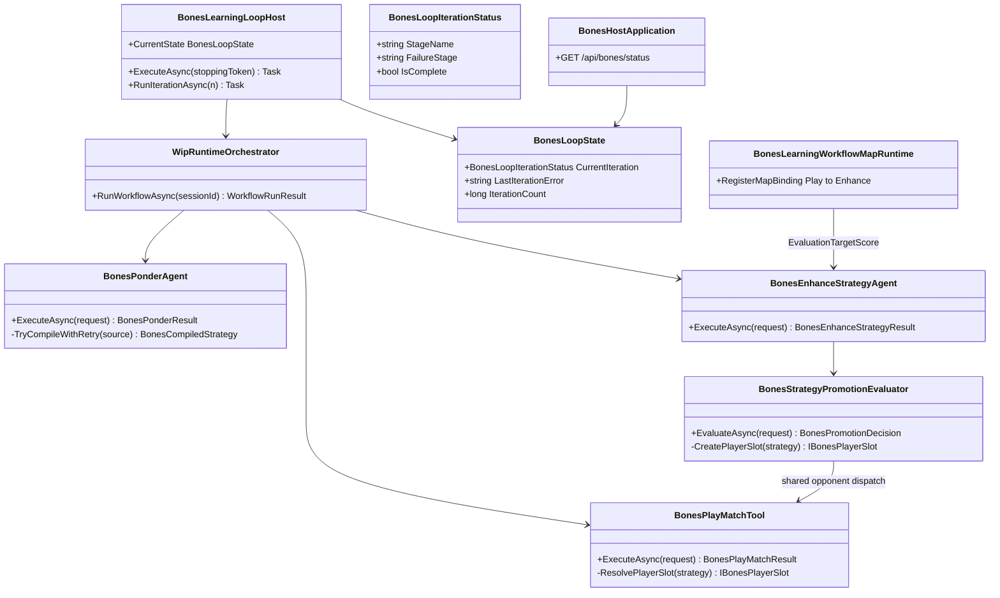

# WIP Bones Learning Loop Reliability Requirements and Test Plan

> Scope: harden the Bones autonomous learning loop so consecutive iterations reliably complete Observe, Ponder, Play, and Enhance; promotion decisions are fair and observable; ponder recovers from DeepSeek script compile failures; the status API never returns 500 during in-flight iterations; and operators can distinguish learning-but-losing from pipeline-broken -- closing gaps observed in the 2026-06-29 DeepSeek session (0/4 wins, enhance missing on most iterations, v2 rejected, host exit on iteration 6).

---

## Functionality Worktree

### Verification Policy

- Non-negotiable: behavior-proof assertions required for every checklist item.
- Metadata-only assertions are supporting evidence only.
- Loop-host tests must prove stage completion via session artifacts (`bones-ponder-execution`, `bones-play-match-execution`, `bones-enhance-strategy-execution`) -- not log strings alone.
- Promotion tests must run evaluation matches with the same `TargetScore` and opponent dispatch semantics as the play stage that produced the enhance input.
- Ponder retry tests must prove a failing first response is followed by a model re-prompt carrying compiler diagnostics and a persisted `Kind=Script` artifact on success.
- Status API tests must exercise in-flight ponder (no active pointer), failed iterations, and corrupt pointer edge cases without HTTP 500.
- Include absolute schedule gates when scheduled jobs are in scope.

### Coverage Inputs

| Input | Value |
|---|---|
| CsProject | Wip.Bones.Agents, Wip.Bones.Host (with Wip.Bones.Tests, Wip.Bones.Host.Tests, Wip.Bones.ModelProviders.DeepSeek.Tests) |
| AnalysisSource | Latest Bones host session artifacts and terminal output: enhance absent on iterations 1/4/5 because upstream ponder/play threw; v2 promotion Rejected under strict AND thresholds with play/eval target-score mismatch (play `targetScore=10`, eval default `8`) and opponent dispatch mismatch (play uses markdown+LLM, eval uses `BonesFirstLegalMovePlayerSlot`); iteration 6 workflow exception at `RunWorkflowAsync`; ponder hard-fails on first compile error; status API partial `TryLoadActiveStrategy` fix; loop marks `Failed` but exposes no last error or granular stage |
| MandatoryItems | Ponder compile-error retry; workflow `EvaluationTargetScore` parity; promotion opponent dispatch parity with play; status API defensive reads and failure diagnostics; host loop stage granularity and last-error surfacing; behavior-proof policy compliance |
| PlanType | requirements |
| OutputPath | harness/requirements/Wip.Bones.LearningLoopReliability.md |
| OutputTitle | WIP Bones Learning Loop Reliability Requirements and Test Plan |

### Session Failure Summary

| Symptom | Iterations affected | Root cause (code) |
|---|---|---|
| No `bones-enhance-strategy-execution` artifact | 1, 3, 4, 5, 6 | Linear workflow aborts before Enhance when Ponder or Play throws (`WipRuntimeOrchestrator.RunWorkflowAsync`) |
| v2 `PromotionOutcome=Rejected` | 2 | `BonesStrategyPromotionEvaluator` requires both win-rate and score-delta thresholds; eval uses `TargetScore=8` default while play uses session `10` |
| Seat 1 scored 0 every completed match | 1, 2, 4, 5 | Strategy plays legal moves but loses blocked rounds; promotion never upgrades active strategy |
| Host `exit_code: 1` | 6 | Uncaught exception outside iteration catch or process shutdown after logged workflow failure |
| Status API 500 during ponder | first attempt | `LoadActiveStrategy` throw before partial fix; residual throws from corrupt pointers |

### Project Layout and Ownership

| Project | Role | Runtime proof gates |
|---|---|---|
| Wip.Bones.Agents | Ponder retry, workflow maps, promotion evaluator parity, stage failure artifacts | Compile retry persists script; enhance map passes `TargetScore`; promotion uses play-aligned opponents |
| Wip.Bones.Host | Loop state enrichment, status API diagnostics | Status returns 200 with `learningPlayer: null` mid-ponder; exposes `lastIterationError` on failure |
| Wip.Bones | Script API reference (already expanded) | Contract excerpt in ponder/enhance prompts |
| Wip.Bones.ModelProviders.DeepSeek | Authoring/enhancement providers | Outbound prompts include forbidden-member list |
| Wip.Bones.Tests | Unit + agent integration | Ponder retry, map runtime, promotion parity |
| Wip.Bones.Host.Tests | Loop + status integration | Multi-iteration resilience, status during ponder |

### Class Diagram

### Completeness Checklist

- [x] Add `BonesPonderAgent` compile-error retry: on first `TryCompile` failure, re-invoke model provider with user message containing `BonesStrategyScriptCompileResult.FailureReason` and API contract excerpt; cap at `MaxCompileRetries` (default `2`); persist script only after successful compile; emit ponder execution artifact recording attempt count and final outcome [foundation for ponder reliability] [mandatory - compile retry]
- [x] Add `BonesPonderCompileRetryOptions` with `MaxCompileRetries` bound from `BonesHost:Ponder:MaxCompileRetries` / env override; register in host DI [depends on compile retry] [mandatory - configurable retry budget]
- [x] Extend `bones-ponder-execution` artifact JSON with `CompileAttempts`, `FinalCompileSucceeded`, and optional `LastCompileFailureReason` for operator forensics [depends on compile retry]
- [x] Wire `BonesLearningWorkflowMapRuntime` enhance map to pass `parameters.TargetScore` as `BonesEnhanceStrategyRequest.EvaluationTargetScore` (remove silent fallback to `DefaultEvaluationTargetScore = 8` when session specifies `10`) [depends on workflow parameters] [mandatory - target score parity]
- [x] Extract shared `BonesStrategyPlayerSlotFactory` (or equivalent) used by both `BonesPlayMatchTool` and `BonesStrategyPromotionEvaluator.CreatePlayerSlot` so markdown opponents dispatch through the same path in play and promotion evaluation [depends on play match tool] [mandatory - promotion opponent parity]
- [x] Add `BonesStrategyPromotionEvaluator` unit tests proving candidate evaluated against markdown opponents using the same slot factory as play -- not `BonesFirstLegalMovePlayerSlot` when play would call the LLM path [depends on shared factory]
- [x] Persist `bones-strategy-promotion` artifact on every enhance invocation (including `Rejected`) with full `BonesPromotionEvaluationMetrics` snapshot [depends on promotion evaluator]
- [x] Extend `BonesLoopIterationStatus` / `BonesLoopState` with `LastIterationError` (message + stage) set in `BonesLearningLoopHost.RunIterationAsync` catch block; clear on successful iteration complete [depends on loop host catch handler]
- [x] Replace coarse `"Running"` stage with workflow stage names (`Ponder`, `Play`, `Enhance`) via orchestrator stage callbacks or last completed stage artifact [depends on loop host] [mandatory - granular stage observability]
- [x] Harden `GET /api/bones/status` learning-player block: wrap knowledge-store reads in try/catch; return `learningPlayer: null` with optional `learningPlayerStatus: "pending"` during ponder; never throw on missing/corrupt active pointer [depends on TryLoadActiveStrategy] [mandatory - status API defensive reads]
- [x] Extend status response with `lastIterationError`, `lastPromotionOutcome`, and `libraryEffectiveness` from `BonesStrategyLibrary` for the learning seat [depends on status hardening and promotion artifacts]
- [x] Ensure host process does not exit with non-zero code when a single iteration fails but the background loop is still running [depends on loop host] [mandatory - iteration failure isolation]
- [x] Add stage failure artifact recording which stage threw when `RunWorkflowAsync` aborts [depends on orchestrator integration]
- [x] Update `DeepSeekBonesStrategyAuthoringProvider` tests to assert outbound content includes forbidden API members from `BonesStrategyScriptApiReference` [depends on API reference] [mandatory - prompt contract regression gate]
- [x] Document operator diagnostics in `Wip.Bones.Host/README.md` [depends on artifact extensions]
- [x] Register `harness/requirements/Wip.Bones.LearningLoopReliability.md` in `BehaviorProofComplianceRegistry` [depends on test coverage]
- [x] Enforce absolute behavior-proof verification for every planned integration test [mandatory - behavior-proof policy]

### Checklist to Runtime-Proof Matrix

| Checklist Item | Primary Runtime Proof Path | Minimum Evidence |
|---|---|---|
| Ponder compile retry | Agent integration with mock provider | Invalid C# then valid C# persists `Kind=Script`; execution artifact shows `CompileAttempts=2` |
| Target score parity | Workflow map unit test + enhance integration | `EvaluationTargetScore` equals session `TargetScore` when play used `10` |
| Promotion opponent parity | Evaluator + play tool integration | Shared factory for markdown and script opponents |
| Promotion artifact always | Enhance agent integration | `Rejected` outcome still writes promotion artifact with metrics |
| Granular loop stages | Host integration polling status | `currentStage` transitions through `Ponder`, `Play`, `Enhance` |
| Status API defensive | Host test mid-ponder | HTTP 200, `learningPlayer` absent, no exception |
| Last iteration error | Host test with failing ponder mock | Status includes `lastIterationError` after `Failed` |
| Process survival | Host test | Failed iteration then next iteration starts; process still running |
| DeepSeek forbidden members | Mock HTTP test | Outbound user content contains forbidden API list |
| Behavior-proof policy | Compliance gate | Trait-bound tests for every checklist row |

---

## Falsify Claims

| # | Claim | Evidence | Status | Reason |
|---|---|---|---|---|
| 1 | Enhance artifacts absent when ponder/play throws first | Session artifacts; linear workflow in `BonesLearningWorkflow.cs:27-36` | Supported | Enhance is downstream of play |
| 2 | Promotion eval defaults `TargetScore` to 8 while play target is 10 | `BonesEnhanceStrategyAgent.cs:19,140`; `BonesStrategyPromotionEvaluationRequest` default | Supported | Mismatch confirmed |
| 3 | Promotion uses `BonesFirstLegalMovePlayerSlot` for markdown opponents | `BonesStrategyPromotionEvaluator.cs:183-194` | Supported | Play uses LLM for markdown |
| 4 | Ponder throws on first compile failure with no retry | `BonesPonderAgent.cs:87-93` | Supported | Hard fail |
| 5 | Status API uses `TryLoadActiveStrategy` but omits learning player mid-ponder | `BonesHostApplication.cs:77-101` | Supported | Partial fix only |
| 6 | Loop catch logs error but does not surface error on status API | `BonesLearningLoopHost.cs:224-237`; `BonesLoopState` has no error field | Supported | Operator blind spot |
| 7 | v2 rejection is by design when thresholds fail | `BonesStrategyPromotionEvaluator.cs:129-133` | Supported | Fairness tuning needed |
| 8 | `RunWorkflowAsync` exception is caught per iteration | `BonesLearningLoopHost.cs:210-237` | Supported | Process exit is separate issue |
| 9 | No shared opponent slot factory exists today | Grep: `CreatePlayerSlot` only in promotion evaluator | Supported | Greenfield extraction |
| 10 | API reference documents forbidden members | `BonesStrategyScriptApiReference.cs` | Supported | Prompt tests required |

Zero Falsified rows.

---

## Test Plan

### `BonesPonderAgent` compile retry

1. `BonesPonderAgent_GivenFirstResponseFailsCompileSecondSucceeds_ExpectedPersistsScriptArtifact`
   *Assumption*: Mock provider returns invalid C# on first call and valid `IBonesPlayerSlot` on second; agent retries and saves `Kind=Script`.
2. `BonesPonderAgent_GivenAllCompileAttemptsFail_ExpectedThrowsInvalidOperationException`
   *Assumption*: After `MaxCompileRetries` exhausted, no strategy artifact is written and exception propagates.
3. `BonesPonderAgent_GivenCompileRetry_ExpectedExecutionArtifactRecordsAttemptCount`
   *Assumption*: `bones-ponder-execution` JSON includes `CompileAttempts` matching model invocations.

### `BonesLearningWorkflowMapRuntime` enhance map

4. `BonesLearningWorkflowMapRuntime_GivenSessionTargetScoreTen_ExpectedEnhanceRequestEvaluationTargetScoreTen`
   *Assumption*: Map binding reads `BonesLearningWorkflowParameters.TargetScore` from session task description.
5. `BonesLearningWorkflowMapRuntime_GivenMissingTargetScore_ExpectedEnhanceRequestUsesPromotionDefault`
   *Assumption*: When parameters omit target score, enhance request leaves `EvaluationTargetScore` null for agent default.

### `BonesStrategyPlayerSlotFactory` opponent parity

6. `BonesStrategyPlayerSlotFactory_GivenMarkdownOpponent_ExpectedSameSlotTypeAsPlayToolResolver`
   *Assumption*: Factory returns markdown dispatch type identical to play tool resolver for the same artifact.
7. `BonesStrategyPromotionEvaluator_GivenMarkdownOpponents_ExpectedDoesNotUseFirstLegalMoveStubWhenPlayWouldNot`
   *Assumption*: Evaluator no longer hardcodes `BonesFirstLegalMovePlayerSlot` for markdown when play uses LLM path.
8. `BonesStrategyPromotionEvaluator_GivenAlignedOpponentsAndSuperiorCandidate_ExpectedPromoted`
   *Assumption*: With parity fixes and seeded superior candidate, promotion thresholds pass.

### `BonesEnhanceStrategyAgent` promotion artifacts

9. `BonesEnhanceStrategyAgent_GivenRejectedPromotion_ExpectedWritesPromotionDecisionArtifact`
   *Assumption*: `bones-strategy-promotion` artifact exists with `Outcome=Rejected` and metric fields populated.
10. `BonesEnhanceStrategyAgent_GivenRejectedPromotion_ExpectedActivePointerUnchanged`
    *Assumption*: `LoadActiveStrategy` returns incumbent id after enhance completes.

### `BonesLearningLoopHost` failure resilience and stages

11. `BonesLearningLoopHost_GivenPonderFailure_ExpectedMarksFailedAndStartsNextIteration`
    *Assumption*: Mock ponder throws once; loop `IterationCount` increments; second iteration begins without process exit.
12. `BonesLearningLoopHost_GivenSuccessfulIteration_ExpectedStageNamesIncludePonderPlayEnhance`
    *Assumption*: Status polling during iteration observes granular stage names before `Complete`.
13. `BonesLearningLoopHost_GivenIterationException_ExpectedLastIterationErrorPopulated`
    *Assumption*: `BonesLoopState.LastIterationError` contains exception message and failure stage after catch.

### `GET /api/bones/status` defensive reads

14. `BonesStatusApi_GivenPonderInProgressNoActivePointer_ExpectedReturns200WithNullLearningPlayer`
    *Assumption*: Session started, ponder not finished; status does not call throwing load path.
15. `BonesStatusApi_GivenCorruptActivePointer_ExpectedReturns200WithLearningPlayerError`
    *Assumption*: Invalid pointer JSON does not produce HTTP 500; diagnostic field explains corruption.
16. `BonesStatusApi_GivenLastEnhanceRejected_ExpectedReportsLastPromotionOutcome`
    *Assumption*: Status includes `lastPromotionOutcome=Rejected` from enhance execution artifact.

### `DeepSeekBonesStrategyAuthoringProvider` prompt contract

17. `DeepSeekBonesStrategyAuthoringProvider_GivenAuthoringRequest_ExpectedOutboundIncludesForbiddenApiMembers`
    *Assumption*: Mock HTTP captured messages contain forbidden list from API reference.

### Host integration: end-to-end learning iteration reliability

18. `BonesLearningLoopReliability_GivenMockCompileRetryAndPlaySuccess_ExpectedEnhanceArtifactPresent`
    *Assumption*: Full iteration produces `bones-enhance-strategy-execution` when upstream stages succeed.
19. `BonesLearningLoopReliability_GivenPlayTargetScoreTen_ExpectedPromotionEvalUsesTen`
    *Assumption*: Promotion artifact metrics derived from evaluation matches ending at score threshold 10.

### Compliance gate

20. `BehaviorProofCompliance_GivenWipBonesLearningLoopReliabilityChecklist_RequiresExecutableRuntimeProofForEachItem`
    *Assumption*: Every unchecked checklist item maps to at least one Trait-bound test in owning test assemblies.

---

*All assumptions verified by Falsify Claims. Zero Falsified rows.*
