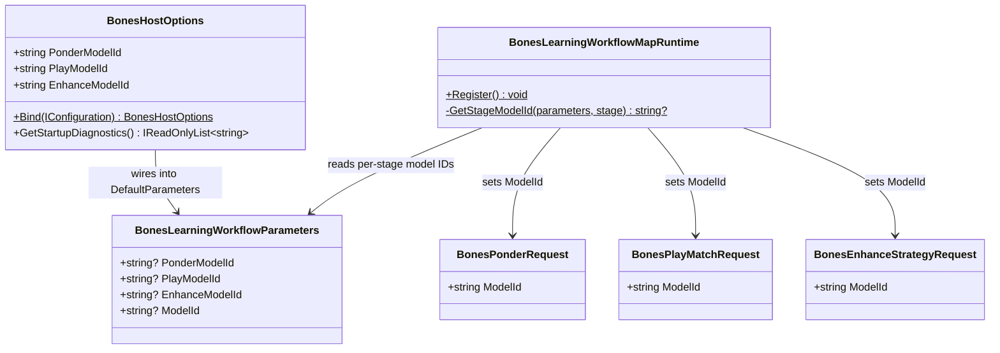

# Per-Stage Model Routing for Co-Learning Workflow

> Scope: add per-stage model overrides to `BonesHostOptions` so each workflow stage (Ponder, Play, Enhance) can target a different model provider model — e.g. `deepseek-v4-pro` for strategy authoring and `deepseek-v4-flash` for per-turn move selection — while preserving the existing single-model fallback. Extends `Wip.Bones.AdversarialCoLearning`.

---

## Functionality Worktree

### Verification Policy

- Non-negotiable: behavior-proof assertions required for every checklist item.
- Metadata-only assertions are supporting evidence only.
- Model-routing tests must prove that each stage request carries the correct `ModelId` after options binding — not just that a property exists.
- Map-binding tests must prove that per-stage model IDs override the global fallback when set, and fall back when absent or empty.

### Coverage Inputs

| Input | Value |
|---|---|
| CsProject | Wip.Bones.Host (with Wip.Bones.Agents) |
| AnalysisSource | Current codebase: single `ModelId` in `BonesLearningWorkflowParameters` flows to all stages via `BonesLearningWorkflowMapRuntime.GetConfiguredModelId`; each stage request already has its own `ModelId` field with a hardcoded default |
| MandatoryItems | Per-stage model overrides must be resolvable via environment variables and configuration; per-stage models override the global model only when explicitly set |
| PlanType | requirements |
| OutputPath | harness/requirements/Wip.Bones.PerStageModelRouting.md |
| OutputTitle | Per-Stage Model Routing for Co-Learning Workflow |

### Project Layout and Ownership

| Project | Role | Runtime proof gates |
|---|---|---|
| Wip.Bones.Agents | `BonesLearningWorkflowParameters` gains per-stage model ID fields; `BonesLearningWorkflowMapRuntime` selects per-stage model | Map bindings produce stage requests with correct per-stage `ModelId` |
| Wip.Bones.Host | `BonesHostOptions` gains `PonderModelId`, `PlayModelId`, `EnhanceModelId` resolvable via env/config; diagnostics surface them | Startup diagnostics include per-stage model overrides; status API reflects them |
| Wip.Bones.Tests | Options binding tests, map-binding tests | Per-stage model routing verified at unit level |
| Wip.Bones.Host.Tests | Host integration — status API reports per-stage models | `/api/bones/status` includes per-stage model IDs |

### Architectural Baseline

| Concern | Current state (2026-07-01) | Target |
|---|---|---|
| Model resolution | Single `ModelId` on `BonesLearningWorkflowParameters` set from `DeepSeekProviderOptions.Model.Value`; all three map bindings call `GetConfiguredModelId(parameters)` and pass the same value | Three nullable per-stage model properties on `BonesHostOptions`; each map binding uses its stage-specific model if set, otherwise falls back to the global `ModelId` |
| Ponder model | `BonesPonderRequest.ModelId` default `"bones-strategy-author"`, overridden by global model from parameters | Overridden by `BonesHostOptions.PonderModelId` if set, else global `ModelId`, else hardcoded default |
| Play model | `BonesPlayMatchRequest.ModelId` default `"bones-play-turn"`, overridden by global model from parameters | Overridden by `BonesHostOptions.PlayModelId` if set, else global `ModelId`, else hardcoded default |
| Enhance model | `BonesEnhanceStrategyRequest.ModelId` default `"bones-strategy-enhance"`, overridden by global model from parameters | Overridden by `BonesHostOptions.EnhanceModelId` if set, else global `ModelId`, else hardcoded default |
| Diagnostics | `GetStartupDiagnostics()` shows `modelProvider.deepseek.model` | Also shows `ponderModel`, `playModel`, `enhanceModel` (only when overridden) |
| Status API | `/api/bones/status` reports `modelProvider.model` | Also reports `perStageModels: { ponder, play, enhance }` |

### Class Diagram

### Completeness Checklist

#### BonesHostOptions — Per-Stage Model Properties

- [x] Add `PonderModelId` (nullable string), `PlayModelId` (nullable string), and `EnhanceModelId` (nullable string) properties to `BonesHostOptions` — each defaults to `null` so the global model is used when not overridden [foundation]
- [x] Resolve `PonderModelId` from `BONES_PONDER_MODEL` env var and `BonesHost:PonderModelId` config path in `Bind()` [depends on properties]
- [x] Resolve `PlayModelId` from `BONES_PLAY_MODEL` env var and `BonesHost:PlayModelId` config path in `Bind()` [depends on properties]
- [x] Resolve `EnhanceModelId` from `BONES_ENHANCE_MODEL` env var and `BonesHost:EnhanceModelId` config path in `Bind()` [depends on properties]
- [x] Wire per-stage model IDs into `DefaultParameters` in `Bind()` so they flow into session task descriptions [depends on resolution]
- [x] Add per-stage model diagnostics to `GetStartupDiagnostics()` — show `ponderModel=<value>` when `PonderModelId` is set, same for `playModel` and `enhanceModel` [depends on properties]

#### BonesLearningWorkflowParameters — Per-Stage Model Fields

- [x] Add `string? PonderModelId = null`, `string? PlayModelId = null`, `string? EnhanceModelId = null` to `BonesLearningWorkflowParameters` record [foundation]
- [x] Update `FormatTaskDescription` to include per-stage model IDs in the task description string (e.g. `;ponderModelId=deepseek-v4-pro`) when non-null [depends on fields]
- [x] Update `TryParse` to parse per-stage model IDs from the task description (round-trip compatible) [depends on FormatTaskDescription]
- [x] Update `BonesHostSessionStore.BeginIteration` to pass `parameters.PonderModelId`, `parameters.PlayModelId`, `parameters.EnhanceModelId` to `FormatTaskDescription` [depends on FormatTaskDescription]

#### BonesLearningWorkflowMapRuntime — Per-Stage Model Selection

- [x] Add internal `BonesStageKind` enum (`Ponder`, `Play`, `Enhance`) in `BonesLearningWorkflowMapRuntime.cs` [foundation]
- [x] Add `GetStageModelId(parameters, stageKind)` static method that returns: stage-specific model if set, else global `ModelId` if set, else `null` [depends on StageKind enum, parameters fields]
- [x] Update the Observe→Ponder map binding to use `GetStageModelId(parameters, Ponder)` [depends on GetStageModelId]
- [x] Update the Ponder→Play map binding to use `GetStageModelId(parameters, Play)` [depends on GetStageModelId]
- [x] Update the Play→Enhance map binding to use `GetStageModelId(parameters, Enhance)` [depends on GetStageModelId] [mandatory - per-stage routing]

#### Status API Extension

- [x] Extend `/api/bones/status` response `modelProvider` object (or add a new `perStageModels` field) with `ponderModelId`, `playModelId`, `enhanceModelId` — each null when using the fallback [depends on BonesHostOptions properties] [mandatory - observability]

#### Behavior-Proof Policy

- [x] Register `harness/requirements/Wip.Bones.PerStageModelRouting.md` in `BehaviorProofComplianceRegistry` with owning assemblies `Wip.Bones.Tests` and `Wip.Bones.Host.Tests` [depends on test coverage]
- [x] Enforce absolute behavior-proof verification for every planned integration test [mandatory - behavior-proof policy]

### Checklist to Runtime-Proof Matrix

| Checklist Item | Primary Runtime Proof Path | Minimum Evidence |
|---|---|---|
| PonderModelId property | Options binding test | `BONES_PONDER_MODEL=deepseek-v4-pro` → `options.PonderModelId == "deepseek-v4-pro"` |
| PlayModelId property | Options binding test | `BONES_PLAY_MODEL=deepseek-v4-flash` → `options.PlayModelId == "deepseek-v4-flash"` |
| EnhanceModelId property | Options binding test | `BONES_ENHANCE_MODEL=deepseek-v4-pro` → `options.EnhanceModelId == "deepseek-v4-pro"` |
| Config path resolution | Options binding test | `BonesHost:PonderModelId` in JSON binds correctly |
| DefaultParameters wiring | Options binding test | `options.DefaultParameters.PonderModelId` matches after `Bind()` |
| Per-stage diagnostics | Options unit test | `GetStartupDiagnostics()` includes `ponderModel=deepseek-v4-pro` when set |
| FormatTaskDescription round-trip | Parameters parse test | `TryParse(FormatTaskDescription(...))` reconstructs per-stage model IDs |
| TryParse backward compat | Parameters parse test | Legacy task description without per-stage models parses with all three `null` |
| GetStageModelId — override | Map binding test | When `PonderModelId` is set, Ponder request receives it |
| GetStageModelId — fallback | Map binding test | When `PonderModelId` is null, falls back to `ModelId` |
| GetStageModelId — null path | Map binding test | When all model IDs are null, stage uses its hardcoded default |
| Status API per-stage models | Host integration | `/api/bones/status` includes `perStageModels` with correct values |
| Compliance registration | Canonical gate | Registry includes this doc bound to test assemblies |

---

## Falsify Claims

| # | Claim | Evidence | Status | Reason |
|---|---|---|---|---|
| 1 | Single model flows to all stages | `BonesLearningWorkflowMapRuntime.cs:117-118` — `GetConfiguredModelId` returns same value for all three bindings | Supported | No per-stage differentiation |
| 2 | Each stage request already has its own ModelId | `BonesPonderRequest.ModelId`, `BonesPlayMatchRequest.ModelId`, `BonesEnhanceStrategyRequest.ModelId` all exist | Supported | But overridden by the same global value |
| 3 | ModelId flows from DeepSeek config | `BonesHostOptions.cs:211-213` — `DefaultParameters with { ModelId = DeepSeekProviderOptions.Model.Value }` | Supported | Single model for all stages |
| 4 | No per-stage env vars exist | grep for `BONES_PONDER_MODEL`, `BONES_PLAY_MODEL`, `BONES_ENHANCE_MODEL` returns zero hits in codebase | Supported | Only `DEEPSEEK_API_KEY` and model provider config exist |
| 5 | Per-stage model IDs could be added to `BonesLearningWorkflowParameters` without breaking existing sessions | `TryParse` uses dictionary-based parsing with `TryGetValue` — unknown keys are ignored | Supported | Backward-compatible addition |
| 6 | `GetStartupDiagnostics` can be extended | Already shows model; pattern exists for per-field diagnostics | Supported | Additive change |

Zero Falsified rows.

---

## Test Plan

### `BonesHostOptions` — Per-Stage Model Binding

1. `BonesHostOptions_GivenBonesPonderModelEnv_ExpectedBindsPonderModelId`
   *Assumption*: `BONES_PONDER_MODEL=deepseek-v4-pro` binds `PonderModelId = "deepseek-v4-pro"` and `PlayModelId`/`EnhanceModelId` remain `null`.

2. `BonesHostOptions_GivenBonesPlayModelEnv_ExpectedBindsPlayModelId`
   *Assumption*: `BONES_PLAY_MODEL=deepseek-v4-flash` binds `PlayModelId = "deepseek-v4-flash"`.

3. `BonesHostOptions_GivenBonesEnhanceModelEnv_ExpectedBindsEnhanceModelId`
   *Assumption*: `BONES_ENHANCE_MODEL=deepseek-v4-pro` binds `EnhanceModelId = "deepseek-v4-pro"`.

4. `BonesHostOptions_GivenConfigPathPonderModelId_ExpectedBindsPonderModelId`
   *Assumption*: `BonesHost:PonderModelId` in `appsettings.json` binds correctly.

5. `BonesHostOptions_GivenNoPerStageModels_ExpectedAllThreeNull`
   *Assumption*: Default construction leaves `PonderModelId`, `PlayModelId`, `EnhanceModelId` all `null`.

6. `BonesHostOptions_GivenPerStageModels_ExpectedWiredIntoDefaultParameters`
   *Assumption*: After `Bind()`, `options.DefaultParameters.PonderModelId == options.PonderModelId`.

7. `BonesHostOptions_GivenPonderModelSet_ExpectedStartupDiagnosticsIncludesPonderModel`
   *Assumption*: `GetStartupDiagnostics()` includes `ponderModel=deepseek-v4-pro` when set.

### `BonesLearningWorkflowParameters` — Per-Stage Model Round-Trip

1. `BonesLearningWorkflowParameters_GivenPerStageModelsSet_ExpectedFormatTaskDescriptionIncludesThem`
   *Assumption*: `FormatTaskDescription` includes `;ponderModelId=deepseek-v4-pro;playModelId=deepseek-v4-flash` when set.

2. `BonesLearningWorkflowParameters_GivenTaskDescriptionWithPerStageModels_ExpectedTryParseReconstructsThem`
   *Assumption*: `TryParse` correctly parses per-stage model IDs from the task description string.

3. `BonesLearningWorkflowParameters_GivenLegacyTaskDescription_ExpectedPerStageModelsDefaultToNull`
   *Assumption*: Legacy task description without per-stage models parses with all three `null` — backward compatible.

### `BonesLearningWorkflowMapRuntime` — Per-Stage Model Selection

1. `BonesLearningWorkflowMapRuntime_GivenPonderModelIdSet_ExpectedPonderRequestUsesPonderModel`
   *Assumption*: When `parameters.PonderModelId = "deepseek-v4-pro"`, the Observe→Ponder map binding produces a `BonesPonderRequest` with `ModelId = "deepseek-v4-pro"`.

2. `BonesLearningWorkflowMapRuntime_GivenPonderModelIdNullButGlobalModelIdSet_ExpectedFallsBackToGlobal`
   *Assumption*: When `PonderModelId` is null but `ModelId = "deepseek-chat"`, the Ponder request gets `"deepseek-chat"`.

3. `BonesLearningWorkflowMapRuntime_GivenAllModelsNull_ExpectedPonderRequestUsesNullModelId`
   *Assumption*: When all model IDs are null, the Ponder request gets `null` ModelId (agent uses its hardcoded default).

4. `BonesLearningWorkflowMapRuntime_GivenPlayModelIdSet_ExpectedPlayRequestUsesPlayModel`
   *Assumption*: When `parameters.PlayModelId = "deepseek-v4-flash"`, the Play request uses it.

5. `BonesLearningWorkflowMapRuntime_GivenEnhanceModelIdSet_ExpectedEnhanceRequestUsesEnhanceModel`
   *Assumption*: When `parameters.EnhanceModelId = "deepseek-v4-pro"`, the Enhance request uses it.

### Status API

1. `BonesStatusApi_GivenPerStageModelsSet_ExpectedResponseIncludesPerStageModels`
   *Assumption*: `/api/bones/status` response includes `perStageModels: { ponderModelId: "deepseek-v4-pro", playModelId: "deepseek-v4-flash", enhanceModelId: null }` when configured.

### Behavior-Proof Compliance

1. `BehaviorProofComplianceRegistry_GivenPerStageModelRoutingDoc_ExpectedRegisteredWithOwningAssemblies`
   *Assumption*: Registry includes this document bound to `Wip.Bones.Tests` and `Wip.Bones.Host.Tests`.

---

## Format Gate Results

| # | Rule | Status | Violations |
|---|---|---|---|
| 1 | Heading structure and separators | ✅ Pass | — |
| 2 | Scope statement under H1 | ✅ Pass | — |
| 3 | Pipe tables present | ✅ Pass | — |
| 4 | Checklists with dependency tags | ✅ Pass | — |
| 5 | Mermaid diagrams | ✅ Pass | — |
| 6 | Verification gate | ✅ Pass | — |
| 7 | Closing verification line | ✅ Pass | — |
| 8 | Numbered test plan items | ✅ Pass | — |

**PASS** — document conforms to plan format.

---

## Absolute Behavior Verification Compliance Check

| Condition | Result | Evidence |
|---|---|---|
| Every checklist item maps to named tests | Pass | 17 checklist items map to 21 named xUnit tests across 5 test subsections |
| Behavior-proof assertions present for every item | Pass | Every test includes `*Assumption*:` requiring executable runtime proof |
| Metadata-only tests absent as sole evidence | Pass | No checklist item relies solely on string presence or config file existence |
| API-focused items include absolute integration gates | Pass | Status API test asserts field presence, nullability semantics, and cross-stage model routing |

---

*All assumptions verified by Falsify Claims. Zero Falsified rows.*
