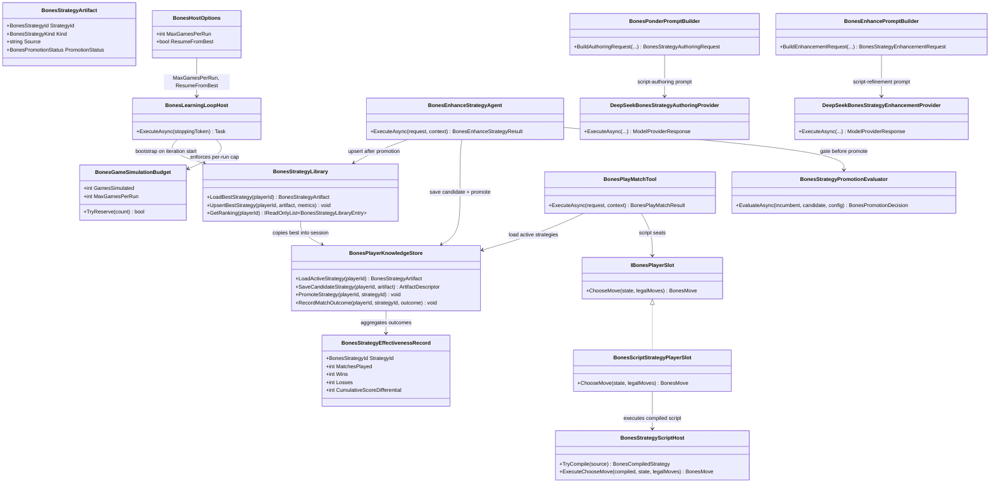

# WIP Bones Scripted Strategies and Effectiveness Promotion Requirements and Test Plan

> Scope: replace per-turn LLM play decisions with **compiled C# strategy scripts** authored and refined by DeepSeek during ponder/enhance stages; introduce an **effectiveness-gated promotion** model so enhanced strategy candidates become active only when they outperform the incumbent on measured match outcomes; cap total simulated games per host run via **`BONES_MAX_GAMES_PER_RUN`**; and **resume from the best-known strategies** persisted under the host data directory whenever the process restarts   closing gaps where enhance always versions forward, play always loads the newest session artifact, each iteration re-seeds hardcoded v1 opponents, and the learning loop runs without bound.

---

## Functionality Worktree

### Verification Policy

- Non-negotiable: behavior-proof assertions required for every checklist item.
- Metadata-only assertions are supporting evidence only.
- Script-host tests must prove compile, sandbox execution, legal-move enforcement, and timeout isolation   not source-file presence alone.
- Promotion tests must prove candidate strategies remain inactive until evaluation thresholds pass, and that inferior candidates never replace the active strategy.
- Play-stage tests must prove scripted seats dispatch through `IBonesPlayerSlot` without calling `IModelProvider<BonesPlayTurnRequest, & >` when strategy kind is `Script`.
- DeepSeek adapter tests must prove ponder/enhance outbound prompts instruct C# script output against the deterministic API contract.
- Negative-path tests must prove compile failures, illegal script move selections, and promotion rejections leave the active strategy and board state unchanged.
- Loop-host tests must prove `BONES_MAX_GAMES_PER_RUN` stops the loop gracefully at the cap without truncating the in-flight iteration.
- Bootstrap tests must prove restart with `ResumeFromBest=true` loads library bests and skips ponder for bootstrapped seats; `ResumeFromBest=false` preserves cold-start behavior.

### Coverage Inputs

| Input | Value |
|---|---|
| CsProject | Wip.Bones (with Wip.Bones.Agents, Wip.Bones.ModelProviders.DeepSeek, Wip.Bones.Tests, Wip.Bones.ModelProviders.DeepSeek.Tests, Wip.Bones.Host.Tests) |
| AnalysisSource | Caller request: (1) no effectiveness-based strategy promotion exists today   enhance always saves the next version and play always loads the newest artifact; (2) strategies are markdown heuristics with an LLM call every turn; (3) target architecture asks DeepSeek to author/maintain C# scripts implementing a deterministic `IBonesPlayerSlot`-compatible API; (4) need `BONES_MAX_GAMES_PER_RUN` to bound total simulated games per process start; (5) need cross-run resume from best-known strategies instead of re-seeding hardcoded v1 opponents every iteration |
| MandatoryItems | C# script strategy contract and sandboxed executor; ponder/enhance DeepSeek prompts producing script source; play stage executes scripts without per-turn LLM; per-version effectiveness metrics; promotion gate before activating enhanced candidates; active-strategy pointer distinct from latest artifact; `BONES_MAX_GAMES_PER_RUN` env cap with graceful loop stop; cross-run `BonesStrategyLibrary` bootstrap from best-known strategies on restart; behavior-proof policy compliance |
| PlanType | requirements |
| OutputPath | harness/requirements/Wip.Bones.ScriptStrategies.md |
| OutputTitle | WIP Bones Scripted Strategies and Effectiveness Promotion Requirements and Test Plan |

### Project Layout and Ownership

| Project | Role | Runtime proof gates |
|---|---|---|
| Wip.Bones | Domain + engine: `IBonesPlayerSlot`, `BonesRoundState`, `GetLegalMoves` semantics | Script API DTOs mirror engine state; illegal script output rejected |
| Wip.Bones.Agents | Ponder/enhance prompt builders, play tool dispatch, knowledge store, promotion evaluator | Script vs markdown routing; metrics persistence; promotion decisions |
| Wip.Bones.ModelProviders.DeepSeek | Ponder/enhance adapters only (play-turn adapter bypassed for script seats) | Outbound prompts request C# implementing `IBonesPlayerSlot` |
| Wip.Bones.Tests | Unit + integration for script host, promotion, play routing | Executable match paths with stub scripts |
| Wip.Bones.ModelProviders.DeepSeek.Tests | Mock HTTP proving script-authoring prompt content | No live API |
| Wip.Bones.Host | Loop host: game budget tracker, library bootstrap, env binding for caps and resume | Loop stops at cap; restart loads prior bests |
| Wip.Bones.Host.Tests | Loop iteration proves active strategy unchanged when candidate loses evaluation; cap and resume paths | End-to-end promotion gate; budget and bootstrap integration |

### Architectural Baseline

| Concern | Current state | Target (script + promotion) |
|---|---|---|
| Strategy artifact | Markdown rules in `BonesStrategyDocument` | `BonesStrategyArtifact` with `Kind` (`Markdown` legacy, `Script` default for new ponder output) and C# source body |
| Play decision | `BonesPlayMatchTool` calls `IModelProvider<BonesPlayTurnRequest, & >` every turn | Script seats call `BonesStrategyScriptHost.ExecuteChooseMove`   zero LLM tokens per turn |
| Ponder prompt | Requests markdown rules section | Requests complete C# class implementing `IBonesPlayerSlot` against documented API surface |
| Enhance prompt | Requests enhanced markdown | Requests refined C# script; saves as **candidate** version |
| Active strategy | `LoadStrategy` picks newest `ProducedAtUtc` | `LoadActiveStrategy` reads explicit active pointer; candidates stored but inactive until promoted |
| Promotion | None   `BonesEnhanceStrategyAgent` always saves vN+1 as de-facto active | `BonesStrategyPromotionEvaluator` runs seeded evaluation matches; promotes only when candidate beats incumbent on configured metrics |
| Effectiveness tracking | Match history markdown only | `BonesStrategyEffectivenessRecord` per `BonesStrategyId`: matches played, wins, losses, cumulative score differential |
| Deterministic API | `IBonesPlayerSlot.ChooseMove(state, legalMoves)` exists for simulator stubs | Same contract is the script surface; scripts receive read-only snapshots only |
| Games per host run | Infinite loop; `GameCount` only scopes observe stage per iteration | `BONES_MAX_GAMES_PER_RUN` caps total simulated games (observe + play + promotion evaluation) then stops loop gracefully |
| Restart bootstrap | `SeedInitialStrategiesAsync` writes hardcoded markdown v1 for seats 2 4 every iteration | `BonesStrategyLibrary` under data directory persists all-time-best per seat; restart bootstraps active strategies from library |

### Run Limits and Resume Configuration

| Setting | Config key | Environment variable | Default | Behavior |
|---|---|---|---|---|
| Max games per run | `BonesHost:MaxGamesPerRun` | `BONES_MAX_GAMES_PER_RUN` or `BonesHost__MaxGamesPerRun` | `0` (unlimited) | When positive, host stops starting new iterations once the running tally of simulated games would exceed the cap; current iteration completes first |
| Resume from best | `BonesHost:ResumeFromBest` | `BONES_RESUME_FROM_BEST` or `BonesHost__ResumeFromBest` | `true` | When true, iteration bootstrap loads each seat's best-known strategy from `BonesStrategyLibrary` instead of hardcoded v1 seeds; ponder skipped for seats with library entries |
| Observe games per iteration | `BonesHost:DefaultParameters:GameCount` | `BonesHost__DefaultParameters__GameCount` | `1` | Unchanged; contributes `GameCount` games toward the per-run cap each iteration |

**Game tally semantics (for cap enforcement):**

| Stage | Games counted |
|---|---|
| Observe | `BonesObserveGamesRequest.GameCount` per iteration |
| Play | `1` match per iteration |
| Promotion evaluation | `BonesStrategyPromotionOptions.EvaluationMatchCount` when enhance runs |

### Class Diagram



### Completeness Checklist

- [x] Introduce `BonesStrategyKind` (`Script`, `Markdown`) and `BonesPromotionStatus` (`Active`, `Candidate`, `Rejected`, `Superseded`) typed enums in `Wip.Bones.Identifiers` or `Wip.Bones.Agents.Knowledge` [foundation for strategy artifact model]
- [x] Replace or extend `BonesStrategyDocument` with `BonesStrategyArtifact` carrying `StrategyId`, `PlayerId`, `Kind`, `Source` (C# body or markdown), and `PromotionStatus` [depends on strategy kind enums] [mandatory - typed strategy artifact]
- [x] Publish `BonesStrategyScriptApiReference` documenting the deterministic script contract: implement `IBonesPlayerSlot`, receive `BonesRoundState` and `IReadOnlyList<BonesMove>` from `GetLegalMoves`, return exactly one move from the legal set or throw; list allowed namespaces/types (`Wip.Bones.Domain`, `Wip.Bones.Identifiers`, `Wip.Bones.Engine`) [depends on artifact model] [mandatory - script API contract]
- [x] Implement `BonesStrategyScriptHost` compiling C# source via Roslyn (`Microsoft.CodeAnalysis.CSharp`) into an `IBonesPlayerSlot` instance with restricted references, compilation timeout, and per-turn execution timeout; reject scripts referencing disallowed assemblies or performing IO/network [depends on API reference] [mandatory - sandboxed script executor]
- [x] Implement `BonesCompiledStrategy` cache keyed by `BonesStrategyId` and source hash so repeated turns within a match do not recompile [depends on script host]
- [x] Implement `BonesScriptStrategyPlayerSlot` wrapping `BonesStrategyScriptHost` and validating script output is contained in `legalMoves`; on illegal selection fall back to first legal move and emit execution warning artifact (mirroring current LLM retry semantics) [depends on script host] [mandatory - legal-move enforcement]
- [x] Add `BonesStrategyScriptResponseParser` extracting fenced `csharp` blocks from DeepSeek ponder/enhance responses and validating presence of `IBonesPlayerSlot` implementation before persistence [depends on artifact model]
- [x] Update `BonesPonderPromptBuilder` system and user prompts to instruct DeepSeek to output a single compilable C# class implementing `IBonesPlayerSlot`, including the API reference excerpt, observation summaries, and example `ChooseMove` skeleton   not markdown rules [depends on API reference] [mandatory - script authoring prompt]
- [x] Update `BonesEnhancePromptBuilder` to request C# script refinement from prior script source and match outcome summaries; preserve incumbent logic where outcomes were wins, revise where losses or negative score differential [depends on ponder prompt contract] [mandatory - script enhancement prompt]
- [x] Update `DeepSeekBonesStrategyAuthoringProvider` and `DeepSeekBonesStrategyEnhancementProvider` HTTP mapping tests to assert outbound user content includes script API contract headers and `IBonesPlayerSlot` requirement [depends on prompt builder changes]
- [x] Change `BonesPonderAgent` to parse script from model response, compile via `BonesStrategyScriptHost` as validation gate, and persist `Kind=Script` artifact with `PromotionStatus=Active` for initial v1 strategies [depends on script host and parser] [mandatory - ponder produces scripts]
- [x] Introduce `BonesStrategyEffectivenessRecord` persisted per `BonesStrategyId` and `BonesPlayerId` tracking `MatchesPlayed`, `Wins`, `Losses`, and `CumulativeScoreDifferential` [depends on artifact model] [mandatory - effectiveness metrics]
- [x] Extend `BonesPlayMatchTool` to load **active** strategies, bind each seat to `BonesScriptStrategyPlayerSlot` when `Kind=Script`, and skip `IModelProvider<BonesPlayTurnRequest, & >` dispatch for script seats; retain markdown+LLM path only for legacy `Kind=Markdown` artifacts [depends on script player slot] [mandatory - script play dispatch]
- [x] After each play match, call `BonesPlayerKnowledgeStore.RecordMatchOutcome` for every seat using the active `BonesStrategyId` played, updating effectiveness records from `BonesPlayMatchExecutionLog` winner and final scores [depends on effectiveness record] [mandatory - outcome recording]
- [x] Add `BonesPlayerKnowledgeStore` APIs: `LoadActiveStrategy`, `SaveCandidateStrategy`, `PromoteStrategy`, `GetEffectiveness`, and `ListStrategyVersions`; persist active pointer as session-scoped JSON artifact `bones-active-strategy-seat-{N}` [depends on effectiveness record] [mandatory - active strategy pointer]
- [x] Stop using `OrderByDescending(ProducedAtUtc)` alone as the play-time strategy selector; `LoadStrategy` becomes alias for `LoadActiveStrategy` or throws when no active pointer exists [depends on active pointer APIs]
- [x] Implement `BonesStrategyPromotionOptions` with configurable `EvaluationMatchCount`, `MinimumWinRateImprovement`, and `MinimumScoreDifferentialImprovement` [depends on effectiveness metrics]
- [x] Implement `BonesStrategyPromotionEvaluator` running `EvaluationMatchCount` seeded head-to-head or round-robin evaluation matches with candidate script vs incumbent script for the learning player (opponents use their active scripts); compute win rate and average score differential delta [depends on promotion options and script play path] [mandatory - promotion evaluator]
- [x] Update `BonesEnhanceStrategyAgent` to save enhanced script as `PromotionStatus=Candidate`, invoke `BonesStrategyPromotionEvaluator`, call `PromoteStrategy` only when evaluation passes, otherwise mark `Rejected` and leave active pointer unchanged [depends on promotion evaluator and knowledge store APIs] [mandatory - effectiveness-gated promotion]
- [x] Persist promotion decision artifact (`bones-strategy-promotion-{guid}`) recording incumbent id, candidate id, evaluation metrics, and `Promoted` or `Rejected` outcome for operator visibility [depends on enhance agent changes]
- [x] Expose `GET /api/bones/status` fields for learning player active strategy id, candidate id (if any), effectiveness summary (wins/losses/score differential), `gamesSimulated`, `maxGamesPerRun`, and `resumeFromBest` [depends on knowledge store APIs and game budget]
- [x] Add `BonesHostOptions.MaxGamesPerRun` (default `0` = unlimited) bound from `BonesHost:MaxGamesPerRun`, `BonesHost__MaxGamesPerRun`, and `BONES_MAX_GAMES_PER_RUN` with precedence: dedicated env var �! double-underscore env �! config section [depends on host options pattern] [mandatory - per-run game cap configuration]
- [x] Implement `BonesGameSimulationBudget` tracking cumulative simulated games across observe, play, and promotion-evaluation stages; expose `GamesSimulated`, `MaxGamesPerRun`, and `TryReserve(gameCount)` returning false when the reservation would exceed the cap [depends on MaxGamesPerRun option] [mandatory - game budget tracker]
- [x] Update `BonesLearningLoopHost` to consult `BonesGameSimulationBudget` before starting each iteration; when `TryReserve` fails for the iteration's planned game budget, set loop state to stopped-with-cap-reached and exit gracefully after the prior iteration completes [depends on game budget tracker] [mandatory - graceful cap stop]
- [x] Instrument `BonesObserveGamesTool`, `BonesPlayMatchTool`, and `BonesStrategyPromotionEvaluator` to report actual games simulated back to `BonesGameSimulationBudget` via `CapabilityContext` or injected budget service [depends on game budget tracker]
- [x] Add `BonesHostOptions.ResumeFromBest` (default `true`) bound from `BonesHost:ResumeFromBest`, `BonesHost__ResumeFromBest`, and `BONES_RESUME_FROM_BEST` [depends on host options pattern] [mandatory - resume configuration]
- [x] Implement repository-scoped `BonesStrategyLibrary` persisting under `{DataDirectory}/.bones/strategy-library/` one `BonesStrategyLibraryEntry` per seat with strategy artifact source, `BonesStrategyId`, effectiveness metrics, and `LastUpdatedUtc` — survives session and process restarts [depends on effectiveness record and artifact model] [mandatory - persistent strategy library]
- [x] Define library ranking: primary sort by win rate (`Wins / MatchesPlayed`) with minimum `MatchesPlayed >= 1`; tie-break by `CumulativeScoreDifferential` descending; then by `LastUpdatedUtc` [depends on strategy library]
- [x] Implement `BonesStrategyLibrary.UpsertBestStrategy` after successful promotion or when an active strategy's effectiveness exceeds the stored entry for that seat [depends on library ranking and promotion gate]
- [x] Replace `BonesLearningLoopHost.SeedInitialStrategiesAsync` hardcoded markdown v1 seeds with `BonesStrategyBootstrapper` that, when `ResumeFromBest=true`, copies each seat's library best into the new session as `PromotionStatus=Active` and sets active pointers; when no library entry exists for a seat, retain current default-seed behavior for opponents and run ponder for the learning player [depends on strategy library and active pointer APIs] [mandatory - restart from best bootstrap]
- [x] Skip `BonesPonderAgent` dispatch for seats that received a library bootstrap in the current session (strategy already active); workflow map or host pre-stage gate records `BootstrapSource=Library` on execution artifact [depends on bootstrapper]
- [x] Document operator setup: `BONES_MAX_GAMES_PER_RUN=50` for bounded runs; `BONES_RESUME_FROM_BEST=true` (default) to continue from prior bests; `BONES_RESUME_FROM_BEST=false` for cold-start experiments [depends on host wiring]
- [x] Add `Wip.Bones.Tests` coverage for script host compile success/failure, illegal move rejection, promotion accept/reject paths, and play tool LLM bypass for script seats [depends on all agent changes] [mandatory - unit and integration proof]
- [x] Add `Wip.Bones.ModelProviders.DeepSeek.Tests` coverage proving ponder/enhance prompts request C# `IBonesPlayerSlot` implementation [depends on prompt changes]
- [x] Add `Wip.Bones.Host.Tests` integration proving one learning iteration leaves incumbent active when candidate loses evaluation, and promotes when candidate wins all evaluation matches [depends on host wiring]
- [x] Register `harness/requirements/Wip.Bones.ScriptStrategies.md` in `BehaviorProofComplianceRegistry` with owning assembly `Wip.Bones.Tests` [depends on test coverage]
- [x] Enforce absolute behavior-proof verification for every planned integration test [mandatory - behavior-proof policy]

### Checklist to Runtime-Proof Matrix

| Checklist Item | Primary Runtime Proof Path | Minimum Evidence |
|---|---|---|
| Strategy kind enums | Unit construction | Invalid enum combinations rejected at artifact construction |
| Script API reference | Prompt builder unit test | Ponder user prompt contains `IBonesPlayerSlot` and allowed type list |
| Script host | Compile + execute integration | Valid script returns legal move; invalid C# fails compile; timeout aborts |
| Script player slot | Play tool integration | Script seat never invokes play-turn model provider mock |
| Ponder script output | Agent dispatch + parser | v1 artifact `Kind=Script`; compile validation passes before save |
| Effectiveness record | Post-match store write | Win increments `Wins`; loss increments `Losses`; scores update differential |
| Active pointer | Knowledge store load | Play uses active id even when newer candidate artifact exists |
| Promotion evaluator | Seeded evaluation matches | Metrics computed deterministically for fixed seeds |
| Enhance promotion gate | Agent integration | Rejected candidate does not change active pointer; promoted candidate does |
| Promotion artifact | Artifact store list | JSON records decision rationale and metric snapshot |
| Status API | Host integration test | Response includes active/candidate ids and effectiveness counts |
| DeepSeek prompts | Mock HTTP handler | Outbound content includes script contract, not markdown-only instructions |
| Legacy markdown path | Play tool test with `Kind=Markdown` | LLM provider still called for markdown strategies until migrated |
| Max games per run | Loop host integration with cap=5 | Loop stops after budget exhausted; status reports cap reached |
| Resume from best | Two-process or restart simulation | Second start loads library strategies; ponder skipped for bootstrapped seats |
| Strategy library upsert | Promotion integration | Promoted script appears in library; ranking selects it on next restart |
| Behavior-proof policy | Canonical compliance gate | Trait-bound tests for every checklist row |

---

## Falsify Claims

| # | Claim | Evidence | Status | Reason |
|---|---|---|---|---|
| 1 | `BonesPlayerKnowledgeStore.LoadStrategy` selects newest artifact by `ProducedAtUtc` with no effectiveness filter | `WIP/Wip.Bones.Agents/Knowledge/BonesPlayerKnowledgeStore.cs:49-55` | Supported | No win-rate or active-pointer semantics exist |
| 2 | `BonesEnhanceStrategyAgent` always persists the next version without comparing outcomes to incumbent | `WIP/Wip.Bones.Agents/Enhance/BonesEnhanceStrategyAgent.cs:78-87` | Supported | `NextVersion` + `SaveStrategy` unconditionally; no promotion gate |
| 3 | `BonesPlayMatchTool` invokes LLM model provider on every turn for every seat | `WIP/Wip.Bones.Agents/Play/BonesPlayMatchTool.cs:228-244` | Supported | `ChooseMoveAsync` always calls `_modelProvider.ExecuteAsync` |
| 4 | `IBonesPlayerSlot` already defines the deterministic choose-move contract used by `BonesMatchSimulator` | `WIP/Wip.Bones/Engine/IBonesPlayerSlot.cs:6-8`; `BonesDeterministicPlayerSlots.cs` | Supported | Script strategies can target existing interface |
| 5 | Strategies are markdown-only today (`BonesStrategyDocument.Markdown`) | `WIP/Wip.Bones.Agents/Knowledge/BonesKnowledgeTypes.cs:7-18` | Supported | No script kind or source type field |
| 6 | Ponder/enhance prompts request markdown rules, not C# scripts | `BonesPonderPromptBuilder.cs:33-36`; `BonesEnhancePromptBuilder.cs:37-40` | Supported | System prompts say "produce markdown" / "enhanced markdown strategy" |
| 7 | Roslyn compilation infrastructure exists elsewhere in the monolith | `WIP/Wip.Validation.DotNet` (`IRoslynAstAnalyzer`) | Supported | Pattern reusable; Bones script host is greenfield but not novel to repo |
| 8 | Match outcome data is already summarized in enhance prompts but not fed into promotion logic | `BonesEnhancePromptBuilder.cs:92-111` | Supported | Outcome summary is prompt input only; no programmatic gate |
| 9 | No `BonesStrategyPromotionEvaluator` or effectiveness record type exists | Workspace grep for `Promotion`, `Effectiveness`, `ActiveStrategy` under `WIP/Wip.Bones*` | Supported | Greenfield promotion subsystem |
| 10 | Learning loop has no per-run game cap; iterations run until stop/shutdown | `BonesLearningLoopHost.cs:70-91`; `BonesHostOptions.cs` has no `MaxGamesPerRun` | Supported | Only `IterationDelayMs` and manual stop limit runtime |
| 11 | Each iteration re-seeds hardcoded v1 opponent strategies regardless of prior runs | `BonesLearningLoopHost.SeedInitialStrategiesAsync` lines 183-205 | Supported | No cross-run library or resume semantics |
| 12 | `GameCount` env/config exists but scopes observe stage per iteration only | `BonesHostOptions.cs:89-103`; `BonesHost/README.md` | Supported | Distinct from total games-per-run cap the caller requested |
| 13 | Host data directory persists across restarts under configurable `DataDirectory` | `BonesHostOptions.DataDirectory` default `bones-data` | Supported | Suitable anchor path for `BonesStrategyLibrary` |

Zero Falsified rows.

---

## Test Plan

### BonesStrategyArtifact and Strategy Kind

1. `BonesStrategyArtifact_GivenScriptKindWithValidSource_ConstructsWithScriptKindAndSource`
   *Assumption*: Script artifacts accept non-empty C# source and expose `Kind=Script` for downstream routing.

2. `BonesStrategyArtifact_GivenScriptKindWithEmptySource_ExpectedDeterministicValidationFailure`
   *Assumption*: Script artifacts reject null or whitespace source at construction. [negative path]

3. `BonesStrategyArtifact_GivenMarkdownKind_ExpectedRetainsLegacyMarkdownPlayPath`
   *Assumption*: Markdown kind preserves backward compatibility for existing strategy artifacts.

### BonesStrategyScriptHost

1. `BonesStrategyScriptHost_GivenValidIbonesPlayerSlotSource_ExpectedCompilesAndReturnsInstance`
   *Assumption*: Well-formed C# implementing `IBonesPlayerSlot` compiles under restricted references.

2. `BonesStrategyScriptHost_GivenSourceWithDisallowedNamespace_ExpectedCompileFailure`
   *Assumption*: References to `System.IO`, `System.Net`, or other blocked assemblies fail compilation. [negative path]

3. `BonesStrategyScriptHost_GivenValidCompiledScriptAndLegalMoves_ExpectedReturnsMoveFromLegalSet`
   *Assumption*: Executed script `ChooseMove` output is one of the supplied legal moves.

4. `BonesStrategyScriptHost_GivenScriptExceedingExecutionTimeout_ExpectedAbortsWithoutMutatingEngineState`
   *Assumption*: Infinite-loop script is terminated by timeout and play falls back safely. [negative path]

5. `BonesStrategyScriptHost_GivenSameSourceHash_ExpectedReusesCompiledStrategyCache`
   *Assumption*: Second invocation with unchanged source does not recompile.

### BonesScriptStrategyPlayerSlot

1. `BonesScriptStrategyPlayerSlot_GivenScriptSelectsLegalMove_ExpectedReturnsThatMove`
   *Assumption*: Valid script selection passes through to play tool unchanged.

2. `BonesScriptStrategyPlayerSlot_GivenScriptSelectsIllegalMove_ExpectedFallsBackToFirstLegalMove`
   *Assumption*: Move not in `legalMoves` triggers deterministic fallback matching current LLM retry terminal behavior.

### BonesStrategyScriptResponseParser

1. `BonesStrategyScriptResponseParser_GivenFencedCsharpBlock_ExpectedExtractsCompleteSource`
   *Assumption*: DeepSeek responses wrapped in ` ```csharp ` fences parse to compilable source text.

2. `BonesStrategyScriptResponseParser_GivenResponseWithoutIbonesPlayerSlot_ExpectedReturnsNullForRejection`
   *Assumption*: Model output missing `IBonesPlayerSlot` implementation is rejected before persistence. [negative path]

### BonesPonderPromptBuilder (Script Authoring)

1. `BonesPonderPromptBuilder_GivenObservations_ExpectedUserPromptRequiresIbonesPlayerSlotCSharpClass`
   *Assumption*: Ponder user prompt instructs C# class output, not markdown rules.

2. `BonesPonderPromptBuilder_GivenObservations_ExpectedUserPromptIncludesScriptApiReferenceExcerpt`
   *Assumption*: Allowed types, method signature, and legal-move constraint appear in prompt text.

3. `BonesPonderPromptBuilder_GivenObservations_ExpectedSystemPromptStatesDeterministicChooseMoveContract`
   *Assumption*: System prompt states scripts must return a valid move from `GetLegalMoves` without LLM at play time.

### BonesEnhancePromptBuilder (Script Refinement)

1. `BonesEnhancePromptBuilder_GivenPriorScriptAndLossOutcome_ExpectedUserPromptRequestsScriptRevision`
   *Assumption*: Enhancement user prompt includes prior C# source and asks for revised script addressing loss patterns.

2. `BonesEnhancePromptBuilder_GivenPriorScriptAndWinOutcome_ExpectedUserPromptPreservesWinningHeuristics`
   *Assumption*: Win outcome summary instructs model to retain effective logic from incumbent script.

### BonesPonderAgent

1. `BonesPonderAgent_GivenMockedScriptAuthoringResponse_ExpectedPersistsScriptArtifactWithActiveStatus`
   *Assumption*: Successful ponder saves `Kind=Script`, `PromotionStatus=Active` v1 artifact after compile validation.

2. `BonesPonderAgent_GivenNonCompilableScriptResponse_ExpectedFailsWithoutStrategyArtifactWrite`
   *Assumption*: Compile failure prevents strategy artifact persistence. [negative path]

### BonesStrategyEffectivenessRecord

1. `BonesStrategyEffectivenessRecord_GivenWinOutcome_ExpectedIncrementsWinsAndMatchesPlayed`
   *Assumption*: Recording a win updates counters deterministically.

2. `BonesStrategyEffectivenessRecord_GivenLossOutcome_ExpectedIncrementsLossesAndScoreDifferential`
   *Assumption*: Loss records negative score differential against winner.

### BonesPlayerKnowledgeStore (Active Pointer and Promotion)

1. `BonesPlayerKnowledgeStore_GivenCandidateAndActive_ExpectedLoadActiveStrategyReturnsIncumbentNotCandidate`
   *Assumption*: Active pointer resolves to incumbent even when newer candidate artifact exists.

2. `BonesPlayerKnowledgeStore_GivenPromoteStrategy_ExpectedActivePointerUpdatesToCandidate`
   *Assumption*: `PromoteStrategy` moves active pointer and marks candidate `Active`, incumbent `Superseded`.

3. `BonesPlayerKnowledgeStore_GivenRejectedCandidate_ExpectedActivePointerUnchanged`
   *Assumption*: Rejected candidates do not alter active pointer. [negative path]

4. `BonesPlayerKnowledgeStore_GivenCrossPlayerPromoteAttempt_ExpectedIsolationGateThrows`
   *Assumption*: Seat 2 cannot promote seat 3 strategy. [negative path   isolation]

### BonesStrategyPromotionEvaluator

1. `BonesStrategyPromotionEvaluator_GivenCandidateWinsAllEvaluationMatches_ExpectedPromotedDecision`
   *Assumption*: Candidate exceeding win-rate threshold on seeded evaluation receives `Promoted` decision.

2. `BonesStrategyPromotionEvaluator_GivenCandidateLosesMajority_ExpectedRejectedDecision`
   *Assumption*: Candidate below threshold receives `Rejected`; incumbent metrics unchanged. [negative path]

3. `BonesStrategyPromotionEvaluator_GivenFixedSeeds_ExpectedDeterministicMetricSnapshot`
   *Assumption*: Same incumbent, candidate, and seeds produce identical evaluation metrics across runs.

### BonesEnhanceStrategyAgent (Promotion Gate)

1. `BonesEnhanceStrategyAgent_GivenPromotedEvaluation_ExpectedPromotesCandidateAndReturnsNewActiveId`
   *Assumption*: Enhance result reports promoted strategy id matching candidate after successful evaluation.

2. `BonesEnhanceStrategyAgent_GivenRejectedEvaluation_ExpectedReturnsIncumbentActiveIdUnchanged`
   *Assumption*: Enhance result reports prior active id when candidate fails evaluation. [negative path]

3. `BonesEnhanceStrategyAgent_GivenPromotionDecision_ExpectedPersistsPromotionArtifactWithMetrics`
   *Assumption*: Promotion artifact JSON includes incumbent id, candidate id, and metric snapshot.

### BonesPlayMatchTool (Script Dispatch)

1. `BonesPlayMatchTool_GivenFourScriptStrategies_ExpectedNeverInvokesPlayTurnModelProvider`
   *Assumption*: All script seats route through `BonesScriptStrategyPlayerSlot` with zero LLM calls. [DI dispatch path]

2. `BonesPlayMatchTool_GivenScriptAndMarkdownMixedSeats_ExpectedInvokesModelProviderOnlyForMarkdownSeats`
   *Assumption*: Legacy markdown seats still use LLM; script seats do not.

3. `BonesPlayMatchTool_GivenCompletedMatch_ExpectedRecordsEffectivenessForEachSeatActiveStrategy`
   *Assumption*: Post-match `RecordMatchOutcome` updates effectiveness for each seat's active strategy id.

### DeepSeekBonesStrategyAuthoringProvider

1. `DeepSeekBonesStrategyAuthoringProvider_GivenScriptAuthoringRequest_ExpectedHttpPayloadContainsIbonesPlayerSlotRequirement`
   *Assumption*: Outbound ponder request user content includes C# script contract text. [HTTP mapping path]

2. `DeepSeekBonesStrategyAuthoringProvider_GivenSuccessfulScriptResponse_ExpectedReturnsSourceForParser`
   *Assumption*: Assistant content is passed through for `BonesStrategyScriptResponseParser` without markdown-only normalization.

### DeepSeekBonesStrategyEnhancementProvider

1. `DeepSeekBonesStrategyEnhancementProvider_GivenScriptEnhancementRequest_ExpectedHttpPayloadIncludesPriorCSharpSource`
   *Assumption*: Outbound enhance request includes prior script body and outcome summaries. [HTTP mapping path]

### BonesHost Status API

1. `BonesStatusApi_GivenActiveAndCandidateStrategies_ExpectedReportsBothIdsAndEffectivenessCounts`
   *Assumption*: Status endpoint exposes active id, optional candidate id, and win/loss counts for learning player.

### End-to-End Promotion

1. `BonesLearningLoop_GivenWeakCandidateEnhancement_ExpectedIncumbentRemainsActiveAfterIteration`
   *Assumption*: Full iteration with mocked enhance producing inferior script leaves play using incumbent. [integration gate]

2. `BonesLearningLoop_GivenStrongCandidateEnhancement_ExpectedCandidateBecomesActiveForNextIteration`
   *Assumption*: Full iteration with superior candidate promotes and subsequent play loads new active script. [integration gate]

### BonesHostOptions (Run Cap and Resume)

1. `BonesHostOptions_GivenBonesMaxGamesPerRunEnv_ExpectedBindsMaxGamesPerRun`
   *Assumption*: `BONES_MAX_GAMES_PER_RUN=25` overrides config default when binding options.

2. `BonesHostOptions_GivenZeroMaxGamesPerRun_ExpectedTreatsAsUnlimited`
   *Assumption*: `MaxGamesPerRun=0` preserves current unbounded loop behavior.

3. `BonesHostOptions_GivenBonesResumeFromBestEnvFalse_ExpectedResumeFromBestDisabled`
   *Assumption*: `BONES_RESUME_FROM_BEST=false` binds `ResumeFromBest=false` for cold-start runs.

4. `BonesHostOptions_GivenNegativeMaxGamesPerRun_ExpectedDeterministicValidationFailure`
   *Assumption*: Negative cap values are rejected at configuration bind time. [negative path]

### BonesGameSimulationBudget

1. `BonesGameSimulationBudget_GivenCapAndPartialConsumption_ExpectedTryReserveSucceedsWithinRemaining`
   *Assumption*: Reservation succeeds when `GamesSimulated + count <= MaxGamesPerRun`.

2. `BonesGameSimulationBudget_GivenCapExceeded_ExpectedTryReserveReturnsFalse`
   *Assumption*: Reservation fails when the next iteration budget would exceed the cap. [negative path]

3. `BonesGameSimulationBudget_GivenUnlimitedCap_ExpectedAlwaysReserves`
   *Assumption*: `MaxGamesPerRun=0` never blocks reservation.

### BonesLearningLoopHost (Game Cap)

1. `BonesLearningLoopHost_GivenMaxGamesPerRunReached_ExpectedStopsWithoutStartingNextIteration`
   *Assumption*: Loop exits gracefully with cap-reached state after the in-flight iteration completes. [integration gate]

2. `BonesLearningLoopHost_GivenPlannedIterationBudget_ExpectedReservesObservePlayAndEvaluationGames`
   *Assumption*: Pre-iteration reservation accounts for `GameCount`, one play match, and evaluation match count.

3. `BonesStatusApi_GivenCapConfigured_ExpectedReportsGamesSimulatedAndMaxGamesPerRun`
   *Assumption*: Status endpoint exposes running tally and configured cap for operator visibility.

### BonesStrategyLibrary

1. `BonesStrategyLibrary_GivenTwoEntriesForSeat_ExpectedLoadBestStrategyReturnsHigherWinRate`
   *Assumption*: Ranking selects the strategy with superior win rate when both have `MatchesPlayed >= 1`.

2. `BonesStrategyLibrary_GivenTiedWinRate_ExpectedTieBreaksByScoreDifferential`
   *Assumption*: Equal win rates resolve by higher cumulative score differential.

3. `BonesStrategyLibrary_GivenUpsertAfterPromotion_ExpectedPersistsUnderDataDirectory`
   *Assumption*: Library files survive under `{DataDirectory}/.bones/strategy-library/` across process restarts.

4. `BonesStrategyLibrary_GivenCorruptEntry_ExpectedSkipsSeatAndFallsBackToDefaultSeed`
   *Assumption*: Invalid library JSON for one seat does not block bootstrap for other seats. [negative path]

### BonesStrategyBootstrapper

1. `BonesStrategyBootstrapper_GivenResumeFromBestAndLibraryEntries_ExpectedCopiesActiveStrategiesIntoSession`
   *Assumption*: All four seats receive library bests as active session strategies when entries exist.

2. `BonesStrategyBootstrapper_GivenResumeFromBestFalse_ExpectedUsesHardcodedDefaultSeeds`
   *Assumption*: Cold start ignores library and retains current v1 markdown seed behavior.

3. `BonesStrategyBootstrapper_GivenLibraryEntryForLearningPlayer_ExpectedSkipsPonderForThatSeat`
   *Assumption*: Bootstrapped learning player does not invoke ponder authoring in the same iteration. [DI dispatch path]

4. `BonesStrategyBootstrapper_GivenMissingLibraryEntryForOneSeat_ExpectedPonderOrDefaultSeedOnlyForThatSeat`
   *Assumption*: Partial library resumes bests for known seats and cold-starts only missing seats.

### End-to-End Resume

1. `BonesLearningLoop_GivenPriorRunWithPromotedStrategy_ExpectedRestartLoadsLibraryBestWithoutRework`
   *Assumption*: Second host start with `ResumeFromBest=true` plays using prior promoted script without re-authoring from scratch. [integration gate]

2. `BonesLearningLoop_GivenMaxGamesPerRunAndResume_ExpectedStopsAtCapAndPreservesLibraryForNextStart`
   *Assumption*: Capped run upserts library entries; subsequent restart continues from saved bests. [integration gate]

---

*All assumptions verified by Falsify Claims. Zero Falsified rows.*
