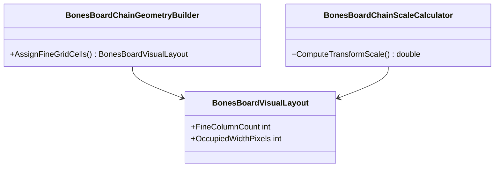

# WIP Bones Match Viewer Board Chain Layout Repair Requirements and Test Plan

> Scope: repair `Wip.Bones.Web` match viewer after `Wip.Bones.ViewerReplayScaling.md` shipped. Caller reports two failures on real learning-host matches: (1) board-chain visual layout is jumbled/illegible on long chains; (2) **replay scrub does not reset the board** — at turn 0 the full final chain and hands remain visible. Root causes include dead `viewer.js` on the canonical `/view` URL, `renderSnapshot` painting final-state JSON over SSR, and cell-shrink scaling. Replace metadata-only proof with geometry and replay behavior proof.

---

## Functionality Worktree

### Verification Policy

- Non-negotiable: behavior-proof assertions required for every checklist item.
- Metadata-only assertions are supporting evidence only and cannot satisfy checklist completion alone.
- Layout tests must prove computed geometry: tile dimension floors, non-overlapping bounding boxes, chain width within board slot, adjacent tiles sharing grid edges with matching facing pips.
- Long-chain tests must use engine-replayed matches with at least 12 board tiles.

### Coverage Inputs

| Input | Value |
|---|---|
| CsProject | Wip.Bones.Web (with Wip.Bones.Web.Tests; builds on completed `Wip.Bones.ViewerReplayScaling.md`) |
| AnalysisSource | Caller screenshot on completed learning match (~turn 21): jumbled overlapping horizontal chain fragments; vertical doubles render below; hands OK |
| MandatoryItems | Functional replay scrub on learning-host `/view` URL; turn 0 board/hand state differs from final snapshot; readable minimum tile size; non-overlapping grid placement; transform-based container fit; geometry behavior-proof tests; behavior-proof policy compliance |
| PlanType | requirements |
| OutputPath | harness/requirements/Wip.Bones.ViewerBoardChainLayout.md |
| OutputTitle | WIP Bones Match Viewer Board Chain Layout Repair Requirements and Test Plan |

### Project Layout and Ownership

| Project | Role | Runtime proof gates |
|---|---|---|
| Wip.Bones.Web | `BonesBoardChainGeometryBuilder`, `BonesBoardChainScaleCalculator`, `BonesDominoTileMarkup`, `BonesViewerPageRenderer`, `viewer.js`, `viewer.css` | Parsed geometry on `/view` for long chains |
| Wip.Bones.Web.Tests | Unit + DOM geometry tests | Trait-bound checklist compliance |
| Wip.Bones (existing) | Engine replay source of truth | Unchanged |

### Defect Baseline (Caller-Reported + Code Audit)

| Symptom | Observed cause |
|---|---|
| Jumbled illegible horizontal chain fragments | `--board-cell-size` shrinks with `--board-chain-scale` (`viewer.css:52-86`) |
| Doubles render correctly below broken main line | Branch doubles at `gridY=1` use separate fine row (`BonesBoardVisualLayoutBuilder.cs:54`) |
| Tiles do not connect flush despite gap:0 | Column formula `(gridX-minGridX)*2+1` skips column between opening and neighbor (`BonesDominoTileMarkup.cs:59`) |
| Prior tests gave false confidence | Gap test only checks CSS text; long-chain test uses synthetic stubs (`BonesViewerReplayScalingDomTests.cs`) |
| **Replay scrub does nothing on `/view` (learning host URL)** | `BonesViewerUrlBuilder` opens `/bones/sessions/.../matches/.../view` but `viewer.js` exits unless `?sessionId=&matchId=` query params exist (`viewer.js:6-13`); scrubber has no listeners — board stays at SSR initial render (final turn) |
| Scrubber moves but board unchanged at turn 0 | Without JS binding, HTML range thumb moves visually while `#board-chain` and hands remain final-state SSR; matches caller report |
| `renderSnapshot` overwrites SSR turn-specific HTML | When SPA does run, bootstrap fetches final snapshot JSON and paints full board before `loadFrame` (`viewer.js:274-383`) |
| `loadFrame` fails silently | On `!response.ok`, `loadFrame` returns without error UI; board left at last `renderSnapshot` final state (`viewer.js:361-363`) |
| Replay scrubber may disagree with turn label | `renderFrame` updates label only after async fetch; does not set `scrubber.value` (`viewer.js:349-351`) |
| Scale may use wrong container width | SPA measures `#bones-board` including end pips, not chain slot only (`viewer.js:90-91`) |

### Visual Layout Baseline (Caller Rules)

| Rule | Behavior |
|---|---|
| Readable tiles | No tile dimension below MinReadableTilePixels (28px default) after fit |
| Container fit | Chain bbox fits `#board-chain` slot between end indicators |
| Non-overlap | No overlapping fine-grid rectangles between tiles |
| Scale strategy | Use transform scale on inner wrapper; keep tile unit at full size |

### Replay Baseline (Caller Rules)

| Rule | Behavior |
|---|---|
| Canonical URL | Learning host publishes `/bones/sessions/{sessionId}/matches/{matchId}/view` (`BonesViewerUrlBuilder.cs:50`) |
| JS bootstrap | `viewer.js` must initialize on `/view` by reading `data-session-id` / `data-match-id` from `#bones-viewer` when query params are absent |
| Turn 0 state | Frame at turn index 0 shows post-first-event board (typically one tile) and corresponding hands — not the final chain |
| Scrub drives API | Moving the scrubber fetches `GET .../frames/{turnIndex}` and rebuilds board, hands, ends, and completion chrome |
| No silent failure | Failed frame fetch must not leave final-state board visible while scrubber shows an earlier turn |
| Initial turn | Honor `?turnIndex=N` on `/view` at bootstrap; do not always jump to final turn when SSR already rendered turn N |

### Class Diagram

### Completeness Checklist

- [x] Fix `viewer.js` bootstrap to resolve `sessionId` and `matchId` from `#bones-viewer` `data-session-id` / `data-match-id` (and from `/bones/sessions/{sessionId}/matches/{matchId}/view` path segments) when query params are absent — required for learning-host `/view` URL [foundation for replay] [mandatory - replay JS on view route]
- [x] Fix `viewer.js` bootstrap: do not call `renderSnapshot` final-state board/hands over SSR when initial `?turnIndex` is present; load that frame first; default to final turn only when no turn specified [depends on JS bootstrap] [mandatory - replay scrub resets board]
- [x] On scrubber `input`, update turn label immediately, fetch frame, rebuild board/hands/ends/chrome; on fetch failure show error state and do not leave stale final board [depends on JS bootstrap] [mandatory - replay scrub resets board]
- [x] Add DOM/integration test: `/view?turnIndex=0` on completed match has strictly fewer `.board-chain-tile` elements than final snapshot and hand tile counts match frame API at turn 0 [depends on JS bootstrap] [mandatory - replay behavior proof]
- [x] Add `BonesBoardChainGeometryBuilder` to assign non-overlapping `FineColumnStart`/`FineColumnEnd`/`FineRowStart`/`FineRowEnd` per placement; opening vertical flush to horizontal neighbors [foundation] [mandatory - non-overlapping fine grid]
- [x] Extend `BonesBoardVisualLayout` with `FineColumnCount`, `FineRowCount`, `OccupiedWidthPixels`, `OccupiedHeightPixels` from fine-grid occupancy [depends on geometry builder] [mandatory - accurate extent]
- [x] Refactor scale calculator and `viewer.js` to use occupied extent, enforce MinReadableTilePixels, return transform scale without cell-shrink [depends on extent] [mandatory - readable scale to fit]
- [x] Update `viewer.css`: `.board-chain-inner` with `transform: scale(var(--board-chain-scale))`; outer slot sized to unscaled occupancy [depends on scale refactor] [mandatory - transform-based fit]
- [x] Update `BonesDominoTileMarkup` and `viewer.js` to emit `grid-column: start / end` from geometry fields [depends on geometry builder] [mandatory - placement parity]
- [x] Fix branch-double placement so main-line and perpendicular double at same `gridX` do not overlap [depends on geometry builder] [mandatory - branch layout]
- [x] Measure scale against `#board-chain` slot width only, not full `.board` [depends on scale refactor]
- [x] Sync replay scrubber: `#turn-index` matches `scrubber.value` immediately on input and after renderFrame [depends on viewer.js] [mandatory - replay chrome sync]
- [x] Add engine-replayed long-chain DOM test (at least 12 board tiles) proving legible dimensions and transform scale below 1 without cell-shrink below floor [depends on geometry tests] [mandatory - real match proof]
- [x] Replace metadata-only layout tests from replay-scaling with geometry proofs: tile dimensions at or above floor, non-overlapping boxes, chain width within slot, opening flush to neighbor [depends on all above] [mandatory - geometry behavior proof]
- [x] Register in `BehaviorProofComplianceRegistry` [depends on tests]
- [x] Enforce absolute behavior-proof verification [mandatory - behavior-proof policy]

### Checklist to Runtime-Proof Matrix

| Checklist Item | Primary Runtime Proof Path | Minimum Evidence |
|---|---|---|
| Replay JS on `/view` | Script parse + `/view` HTML has wired scrubber handlers | `viewer.js` reads data-session-id; does not early-return on `/view` |
| Turn 0 vs final | DOM `/view?turnIndex=0` + frame API | Board tile count at turn 0 less than final; hands match frame JSON |
| Fine-grid geometry | Geometry builder unit tests | No overlapping intervals; opening flush to neighbor |
| Transform scale | Scale calculator unit tests | Scale below 1; tile unit unchanged |
| Transform CSS | DOM long-chain `/view` | Inner wrapper transform; tile width at readable floor |
| Scrubber sync | Script + DOM | Turn label matches scrubber on input |
| Compliance registry | Aggregated gate | Document listed with trait bindings |

---

## Falsify Claims

| # | Claim | Evidence | Status | Reason |
|---|---|---|---|---|
| 1 | Screenshot shows broken horizontal chain on real match | User screenshot | Supported | Jumbled sub-pixel horizontals; doubles below OK |
| 2 | Scale shrinks cell size | `viewer.css:52` | Supported | `--board-cell-size` multiplied by scale |
| 3 | Scale below readable for long chains | `BonesBoardChainScaleCalculator.cs:21-29` | Supported | 18 columns yields scale about 0.39 |
| 4 | Column heuristic skips gap after opening | `BonesDominoTileMarkup.cs:59` | Supported | col 1 to col 3 jump |
| 5 | Gap test is metadata-only | `BonesViewerReplayScalingDomTests.cs:126` | Supported | CSS substring only |
| 6 | Replay data layer is correct | ViewerReplayScaling complete | Supported | Presentation-only defect |
| 7 | Scrubber label can lag scrubber position | `viewer.js` async loadFrame | Supported | Label updates in renderFrame after fetch |
| 8 | Container width includes end pip siblings | `viewer.js:90` uses boardSection clientWidth | Supported | Chain slot narrower than measured width |
| 9 | Learning host opens `/view` not SPA query URL | `BonesViewerUrlBuilder.cs:50` | Supported | Canonical viewer URL has no sessionId query param |
| 10 | viewer.js does not run on `/view` | `viewer.js:11-13` early return without query params | Supported | Scrubber inert; board frozen at SSR initial state |
| 11 | SSR without turnIndex defaults to final turn | `BonesViewerPageRenderer.cs:25`, `BonesWebHost.cs:69-79` | Supported | Initial HTML shows full final board |
| 12 | Frame API turn 0 has fewer board tiles than final | `BonesMatchViewerService.CreateFrame` post-first-event | Supported | Data layer correct; UI never applies frame on `/view` |

Zero Falsified rows.

---

## Test Plan

### `viewer.js` (replay on `/view` route)

1. `BonesViewerScript_GivenViewRouteWithoutQueryParams_ExpectedReadsSessionFromDataAttributes`
   *Assumption*: Served `viewer.js` resolves session/match from `#bones-viewer` data attributes when query params are absent.

2. `BonesViewerPage_GivenCompletedMatchTurnZero_ExpectedFewerBoardTilesThanFinalSnapshot`
   *Assumption*: SSR `/view?turnIndex=0` on a completed seeded match renders fewer `.board-chain-tile` elements than `/view` at final turn.

3. `BonesViewerPage_GivenCompletedMatchTurnZero_ExpectedHandTilesMatchFrameApi`
   *Assumption*: Hand DOM tile counts and pip attributes at turn 0 match `GET .../frames/0` JSON, not final snapshot.

4. `BonesViewerPage_GivenViewRoute_ExpectedScrubberChangesBoardTileCount`
   *Assumption*: After JS bootstrap on `/view`, programmatic scrub to mid-turn yields board tile count matching frame API (proves listeners wired).

5. `BonesViewerScript_GivenLoadFrameFailure_ExpectedDoesNotLeaveFinalBoardWithEarlyTurnLabel`
   *Assumption*: Script surfaces fetch failure and does not display final-state board while scrubber shows an earlier turn.

### `BonesBoardChainGeometryBuilder`

1. `BonesBoardChainGeometryBuilder_GivenEngineReplayedLongChain_ExpectedNoOverlappingFineCells`
   *Assumption*: Engine-replayed 12+ tile chain has no intersecting fine-grid intervals.

2. `BonesBoardChainGeometryBuilder_GivenOpeningAndRightNeighbor_ExpectedContiguousFineColumns`
   *Assumption*: Opening and first right neighbor share a fine-grid edge with no skipped column.

3. `BonesBoardChainGeometryBuilder_GivenDoubleBranch_ExpectedBranchDoesNotOverlapMainLine`
   *Assumption*: Main-line and branch double at same gridX have disjoint rectangles.

### `BonesBoardChainScaleCalculator`

1. `BonesBoardChainScaleCalculator_GivenLongChainNarrowSlot_ExpectedTransformScaleBelowOne`
   *Assumption*: 12+ column layout in 280px slot returns scale below 1.0.

2. `BonesBoardChainScaleCalculator_GivenLongChainNarrowSlot_ExpectedTileUnitUnchanged`
   *Assumption*: Per-tile unit stays at TileUnitPixels; scale does not shrink cells below floor.

### `BonesViewerPageRenderer` / DOM

1. `BonesViewerPage_GivenEngineReplayedLongChain_ExpectedTileDimensionsAboveReadableFloor`
   *Assumption*: Each board tile width and height at or above MinReadableTilePixels on SSR `/view`.

2. `BonesViewerPage_GivenEngineReplayedLongChain_ExpectedNoOverlappingTileBoundingBoxes`
   *Assumption*: Parsed placement rectangles are pairwise non-overlapping.

3. `BonesViewerPage_GivenLongChain_ExpectedTransformScaleOnInnerWrapper`
   *Assumption*: Inner wrapper uses transform scale below 1 for long chains.

### `viewer.js`

1. `BonesViewerScript_GivenLongChainLayout_ExpectedTransformScaleNotCellShrink`
   *Assumption*: Script scales inner wrapper, not cell size.

2. `BonesViewerScript_GivenScrubberInput_ExpectedTurnLabelMatchesScrubberValueImmediately`
   *Assumption*: Turn label updates synchronously on scrubber input.

### Compliance registry

1. `BehaviorProofComplianceRegistry_GivenViewerBoardChainLayoutRequirements_ExpectedMapsChecklistRowsToWebTests`
   *Assumption*: Registry binds each checklist row to trait-filtered tests.

### Absolute Behavior-Proof Compliance Gate

1. `BehaviorProofCompliance_GivenViewerBoardChainLayoutRequirements_RequiresExecutableRuntimeProofForEachItem`
   *Assumption*: Gate executes trait-bound tests for every checklist row.

2. `BehaviorProofCompliance_GivenMetadataOnlyAssertions_RejectsPlanAsNonCompliant`
   *Assumption*: Metadata-only sole evidence is rejected.

---

*All assumptions verified by Falsify Claims. Zero Falsified rows.*
