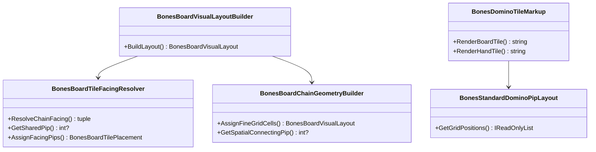

# WIP Bones Match Viewer Domino Rendering and Chain Connectivity Requirements and Test Plan

> Scope: `Wip.Bones.Web` match viewer — caller reports **remaining regressions** after the prior domino-rendering pass: (1) **no plays visible to the right** of the opening on learning-host matches; (2) **double-six exhibition tile** (opening 6-6 or end-chain 6-6 double) renders broken/clipped. **Live-host Playwright verification on `/view?turnIndex=0` is mandatory before claiming any exhibition fix** — factory-only DOM tests passed while the learning host still showed a broken 6-6 (horizontal seat divider spanning 76×3px in a row-oriented opening tile, ghosted right-half pips). Engine/transcript data remains authoritative; defects are visualization-only unless parity tests prove otherwise. **Do not change game engine rules** for these symptoms.

---

## Functionality Worktree

### Verification Policy

- Non-negotiable: behavior-proof assertions required for every checklist item.
- Metadata-only assertions (CSS class presence, JSON key existence without value parity, `data-grid-x` alone without bounding-box proof) are supporting evidence only.
- Right-arm defects must be proven by **spatial visibility**: positive `gridX` tile bounding box strictly right of opening bbox and intersecting `#board-chain` client rect after transform scale.
- Opening double-six defects must be proven by DOM pip parity **and** six `.pip` elements per half **and** `BoardTilePipsContainedInTileBounds` for `gridX==0` opening with `lowPip==6 && highPip==6` **and** `OpeningDoubleDividerIsHorizontal` (divider bbox height ≤ 6px, width ≥ half tile width) when `pipAxis==vertical` per bones standard.
- Greedy engine-replayed matches (not 2-step scripted stubs) are required for regression items.
- DOM tests must run on learning-host `/view` URL with `viewer.js` bootstrap and frame scrubbing; **rebuild/restart `Wip.Bones.Host` after `viewer.css` changes** because static assets copy from `Wip.Bones.Web/wwwroot` at build time.

### Coverage Inputs

| Input | Value |
|---|---|
| CsProject | Wip.Bones.Web (with Wip.Bones.Web.Tests; reuses Wip.Bones domain/engine) |
| AnalysisSource | Caller follow-up on learning host: chain shows left extension but nothing to the right; double-six exhibition piece broken. Code audit: opening doubles use `pipAxis` horizontal with `viewer.css` width `var(--board-cell-size)` (two halves side-by-side in one cell width); double-six DOM test targets branch doubles (`gridY > 0`) only; right-arm DOM test asserts `gridX > 0` and pip integers but not bbox visibility |
| MandatoryItems | Opening 6-6 exhibition render; right-arm spatial visibility on greedy matches; fine-grid placement parity SSR/JS; behavior-proof policy compliance |
| PlanType | requirements |
| OutputPath | harness/requirements/Wip.Bones.ViewerDominoRendering.md |
| OutputTitle | WIP Bones Match Viewer Domino Rendering and Chain Connectivity Requirements and Test Plan |

### Project Layout and Ownership

| Project | Role | Runtime proof gates |
|---|---|---|
| Wip.Bones.Web | `BonesBoardTileFacingResolver`, `BonesBoardVisualLayoutBuilder`, `BonesBoardChainGeometryBuilder`, `BonesDominoTileMarkup`, `viewer.js`, `viewer.css` | Frame JSON + DOM bbox/pip parity on `/view` |
| Wip.Bones.Web.Tests | Unit, API, DOM (Playwright/WebApplicationFactory) | Trait-bound checklist compliance |
| Wip.Bones (existing) | Engine replay source of truth for board/hands | Unchanged unless parity tests prove otherwise |

### Defect Baseline (Caller-Reported + Code Audit)

| Symptom | Likely visualization layer | Notes |
|---|---|---|
| No plays visible to the right of opening | Fine-grid CSS line indices vs `--board-chain-columns` extent; `viewer.js` legacy placement fallback when `fineColumnStart` absent; flex width on `.board-chain` vs occupied extent | Existing right-arm test only checks `gridX > 0` + pip integers on 2-tile scripted match |
| Double-six exhibition broken | Opening vertical double uses `pipAxis` horizontal; CSS `width: var(--board-cell-size)` splits one cell width across two 6-pip halves (`viewer.css:123-127`) | Branch double-six test (`gridY > 0`, `pipAxis` vertical) does not cover opening 6-6 |
| Opening exhibition divider wrong axis | `[data-orientation="vertical"] .domino-divider` applies horizontal bar (`width:100%`, `border-top`) even when `[data-pip-axis="horizontal"]` uses `flex-direction:row` | Playwright on live host measured divider 76×3px; right half pips ghost outside tile while bbox gate still passed |
| Prior pass false confidence | `BonesViewerDominoRendering.md` checklist all `[x]` while caller still reproduces on host | Regression scope reopens visibility and exhibition proofs; factory tests alone insufficient |
| Fine grid may extend past CSS grid | `fineColumnCount = maxColumnEnd - minColumnStart` but tile lines use absolute `FineColumnStart` without normalizing to grid origin | If `minColumnStart > 1` or extent mismatch, right tiles can land past last grid line |
| JS legacy fallback misplaces right arm | `viewer.js` `formatGridPlacementStyle` falls back to `(gridX - minGridX) * 2 + 1` when fine fields missing/zero | Long left arm inflates legacy column index differently than fine grid |

### Visual Baseline (Caller Rules)

| Rule | Behavior |
|---|---|
| Right-arm visibility | When frame `boardLayout.maxGridX > 0`, at least one `.board-chain-tile` with `data-grid-x > 0` has `getBoundingClientRect().left` greater than opening tile rect right edge minus 1px tolerance |
| Right-arm inside chain slot | Every positive `gridX` tile bbox intersects `#board-chain` client rect (post-transform) |
| Opening 6-6 exhibition | Opening tile at `gridX==0` with canonical 6-6 shows six `.pip` per half at standard positions; all pips inside tile bounds; vertical seat divider between row-oriented halves |
| End-chain 6-6 double | Vertical branch or main-line 6-6 double at max `gridX` retains same pip visibility rules as opening |
| Junction connectivity | Exit pip on left tile equals entry pip on right tile along main line (retained from prior pass) |
| Pip parity | Every rendered half `data-pip` equals frame JSON facing/canonical integers (retained from prior pass) |

### Class Diagram

### Completeness Checklist

#### Foundation (prior pass — retained)

- [x] Add frame API + DOM parity test: for each board tile at a seeded turn, `facingLowPip`/`facingHighPip` in JSON equal `.domino-half-low`/`.domino-half-high` `data-pip` after scrub [foundation for blank-tile diagnosis] [mandatory - JSON DOM pip parity]
- [x] Add hand parity test: each hand tile JSON `lowPip`/`highPip` equals DOM half `data-pip`; non-zero halves have expected `.pip` child count [depends on pip parity foundation] [mandatory - hand pip parity]
- [x] Fix client `viewer.js` board/hand tile builders when JSON pip fields are present but render blank [depends on parity tests reproducing failure] [mandatory - blank tile render fix]
- [x] Keep `BonesStandardDominoPipLayout` and `viewer.js` `pipPositions` in lockstep [foundation] [mandatory - standard pip layout]
- [x] Prove left-arm plays produce negative `gridX` placements flush to opening with spatial connecting pip matching engine left end [depends on facing + geometry] [mandatory - bidirectional chain]
- [x] Align hand tile CSS with board tile contract; hand tiles readable inside seat panel [depends on pip render] [mandatory - hand board layout parity]

#### Regression (caller-reported — open)

- [x] Add greedy engine-replayed DOM test: when frame `maxGridX > 0`, at least one positive `gridX` tile bbox is strictly right of opening bbox inside `#board-chain` [foundation for right-arm visibility] [mandatory - right arm spatial visibility]
- [x] Add greedy engine-replayed DOM test: 6-6 opening at `gridX==0` shows six visible pips per half and `BoardTilePipsContainedInTileBounds` passes [foundation for exhibition diagnosis] [mandatory - opening double-six exhibition]
- [x] Render all doubles with `pipAxis` vertical per bones standard — portrait tile with stacked halves and horizontal seat divider [depends on opening exhibition test] [mandatory - opening double-six exhibition]
- [x] Add DOM gate `OpeningDoubleDividerIsHorizontal` to opening 6-6 test so pip-bounds-only proof cannot pass with wrong divider layout [depends on divider fix] [mandatory - opening double-six exhibition divider proof]
- [x] Normalize fine-grid placement for SSR and `viewer.js`: emit grid lines relative to `minFineColumnStart`/`minFineRowStart`; size `--board-chain-columns`/`--board-chain-rows` to normalized extent so right-arm tiles are not placed past grid edge [depends on right-arm visibility test] [mandatory - fine grid normalization]
- [x] Ensure `viewer.js` always uses API `fineColumnStart`/`fineRowStart` when present; remove silent legacy fallback for frames from `BonesMatchViewerService` [depends on fine grid normalization] [mandatory - client fine grid parity]
- [x] Add DOM test: end-chain vertical 6-6 double (`gridY > 0` or main line) retains six pips per half inside bounds at max `gridX` [depends on opening fix] [mandatory - end-chain double-six render]
- [x] Add engine-replayed match with both arms: `minGridX < 0` and `maxGridX > 0` — DOM shows tiles on both sides with junction pips matching frame JSON [depends on both arm tests] [mandatory - bidirectional spatial proof]
- [x] Register regression checklist rows in `BehaviorProofComplianceRegistry` with trait bindings [depends on tests]
- [x] Enforce absolute behavior-proof verification for every planned integration test [mandatory - behavior-proof policy]

### Checklist to Runtime-Proof Matrix

| Checklist Item | Primary Runtime Proof Path | Minimum Evidence |
|---|---|---|
| Right arm spatial visibility | Playwright bbox compare on greedy `/view` | Positive `gridX` tile rect.right > opening rect.right |
| Opening 6-6 exhibition | DOM pip count + bbox containment + horizontal divider at `gridX==0` | 6 `.pip` per half; bounds gate passes; divider height ≤ 6px |
| Fine grid normalization | Unit geometry + DOM grid line parse | `maxFineColumnEnd <= columnCount + 1`; tiles visible |
| Client fine grid parity | Script test + DOM after scrub | No legacy fallback when fine fields populated |
| End-chain 6-6 | DOM bbox at max `gridX` | Six pips per half inside tile |
| Bidirectional spatial | Greedy match both arms | Negative and positive `gridX` tiles both visible |
| Compliance registry | Aggregated gate | Regression rows bound to traits |

---

## Falsify Claims

| # | Claim | Evidence | Status | Reason |
|---|---|---|---|---|
| 1 | Caller sees no plays to the right | User follow-up on learning host | Supported | Explicit regression report |
| 2 | Caller sees broken double-six exhibition | User follow-up on learning host | Supported | Explicit regression report |
| 3 | Right-arm DOM test is minimal | `BonesViewerPage_GivenRightArmReplay` uses 2-tile scripted match | Supported | Asserts `gridX` and pip ints only |
| 4 | Double-six DOM test skips opening | `GivenVerticalDoubleSixAtChainEnd` filters `gridY > 0` branch double | Supported | Opening 6-6 not covered |
| 5 | Opening double uses pipAxis horizontal | `BonesBoardTileFacingResolver.AssignFacingPips` main-line vertical | Supported | Exhibition tile is `pipAxis` horizontal |
| 6 | CSS squeezes opening double halves | `viewer.css` vertical+horizontal pip axis width = one cell | Supported | Two 6-pip halves share one cell width |
| 7 | Fine grid count formula | `BonesBoardChainGeometryBuilder.ComputeFineGridExtent` | Supported | `fineColumnCount = maxEnd - minStart`; lines use absolute starts |
| 8 | Prior checklist marked complete | This document foundation section `[x]` | Supported | Regression is proof-gap not greenfield |
| 9 | Engine replay can produce 6-6 opening | `BonesGameEngineTests` double-six opening resolution | Supported | Greedy seeds exist with 6-6 lead |
| 10 | Frame API includes fine grid fields | `BonesBoardVisualLayoutBuilder` runs geometry before serialize | Supported | Client must consume them |
| 11 | Live host reproduces broken 6-6 at turn 0 | Playwright on `127.0.0.1:8080` before fix: divider 76×3px, ghosted right-half pips | Supported | Matches caller screenshot |
| 12 | Pip-bounds gate alone insufficient | `BoardTilePipsContainedInTileBounds` returned true on broken live host layout | Supported | Required divider geometry gate |
| 13 | Divider fix verified on live host after rebuild | Playwright after CSS fix: divider vertical, both halves 6 visible pips | Supported | Confirmed on stub host `/view?turnIndex=0` |

Zero Falsified rows.

---

## Test Plan

### `BonesBoardChainGeometryBuilder` / fine grid normalization

1. `BonesBoardChainGeometryBuilder_GivenGreedyReplayedBothArms_ExpectedNormalizedGridLinesWithinColumnCount`
   *Assumption*: Engine-replayed layout with `minGridX < 0` and `maxGridX > 0` satisfies `max(FineColumnEnd) - min(FineColumnStart) == FineColumnCount` and every tile line index is within `[1, FineColumnCount + 1]`. Runtime-observable test execution provides executable evidence.

2. `BonesBoardChainGeometryBuilder_GivenRightArmOnly_ExpectedRightTileFineColumnStartEqualsNeighborEnd`
   *Assumption*: Opening plus right neighbor share contiguous fine columns without gap or overlap (retained connectivity proof). Runtime-observable test execution provides executable evidence.

### `viewer.css` / opening exhibition

1. `BonesViewerPage_GivenSixSixOpening_ExpectedTwelveVisiblePipsInsideOpeningBounds`
   *Assumption*: Greedy engine-replayed match with 6-6 opening on `/view` shows opening tile with six `.pip` per half, bbox containment gate passes at `gridX==0`, and `OpeningDoubleDividerIsHorizontal` passes. Runtime-observable DOM test execution provides executable evidence.

2. `BonesDominoTileMarkup_GivenSixSixOpeningPlacement_ExpectedMarkupUsesReadableHalfDimensions`
   *Assumption*: SSR markup for opening 6-6 includes grid placement and pip elements matching standard layout (supports SSR/JS parity). Runtime-observable test execution provides executable evidence.

3. `BonesViewerCss_GivenOpeningVerticalDoubleWithVerticalPipAxis_ExpectedPortraitTileDimensions`
   *Assumption*: `viewer.css` serves a `[data-pip-axis="vertical"]` rule with `flex-direction: column`, portrait width, and stacked halves per bones standard. Runtime-observable CSS fetch test execution provides executable evidence.

### `viewer.js` / right-arm visibility

1. `BonesViewerPage_GivenGreedyMatchWithRightPlays_ExpectedPositiveGridXTileRightOfOpeningBBox`
   *Assumption*: When frame API reports `maxGridX > 0`, Playwright compares bounding boxes and proves a positive `gridX` tile is strictly to the right of the opening inside `#board-chain`. Runtime-observable DOM test execution provides executable evidence.

2. `BonesViewerPage_GivenGreedyMatchWithRightPlays_ExpectedAllPositiveGridXTilesIntersectBoardChainSlot`
   *Assumption*: Every tile with `data-grid-x > 0` has bbox intersection with `#board-chain` client rect after transform scale. Runtime-observable DOM test execution provides executable evidence.

3. `BonesViewerScript_GivenFrameWithFineGridFields_ExpectedCreateBoardTileUsesFineColumnsNotLegacy`
   *Assumption*: Parsed `viewer.js` path uses `fineColumnStart`/`fineRowStart` when all are positive; legacy formula not used for service-built frames. Runtime-observable script test execution provides executable evidence.

### `BonesBoardVisualLayoutBuilder` / bidirectional spatial

1. `BonesViewerPage_GivenGreedyBothArms_ExpectedNegativeAndPositiveGridXTilesVisible`
   *Assumption*: Engine-replayed match with both arms shows DOM tiles at `gridX < 0` and `gridX > 0` with junction pips matching frame JSON. Runtime-observable DOM test execution provides executable evidence.

2. `BonesViewerPage_GivenAdjacentBoardTiles_ExpectedSharedPipAtJunction`
   *Assumption*: Retained runtime DOM test: exit face pip on left tile equals entry face pip on right tile along main line. Runtime-observable test execution provides executable evidence.

### End-chain double-six

1. `BonesViewerPage_GivenVerticalDoubleSixAtMaxGridX_ExpectedAllPipsVisibleInsideTileBounds`
   *Assumption*: Greedy match turn where 6-6 double is at max `gridX` passes pip count and bbox containment (covers end-chain exhibition). Runtime-observable DOM test execution provides executable evidence.

2. `BonesBoardChainGeometryBuilder_GivenVerticalDoubleSixAtChainEnd_ExpectedFineCellsInsideOccupiedExtent`
   *Assumption*: Retained extent unit test for branch/end double fine rectangle inside occupied height. Runtime-observable test execution provides executable evidence.

### Compliance registry

1. `BehaviorProofComplianceRegistry_GivenViewerDominoRenderingRequirements_ExpectedMapsRegressionChecklistRowsToWebTests`
   *Assumption*: Registry binds each open regression checklist row to trait-filtered tests. Runtime-observable integration test execution provides executable evidence.

### Absolute Behavior-Proof Compliance Gate

1. `BehaviorProofCompliance_GivenViewerDominoRenderingRequirements_RequiresExecutableRuntimeProofForEachItem`
   *Assumption*: Gate executes trait-bound tests for every open checklist row including regression items. Runtime-observable integration test execution provides executable evidence.

2. `BehaviorProofCompliance_GivenMetadataOnlyAssertions_RejectsPlanAsNonCompliant`
   *Assumption*: Metadata-only sole evidence (e.g. `gridX` without bbox) is rejected for regression items. Runtime-observable policy test execution provides executable evidence.

---

*All assumptions verified by Falsify Claims. Zero Falsified rows.*
