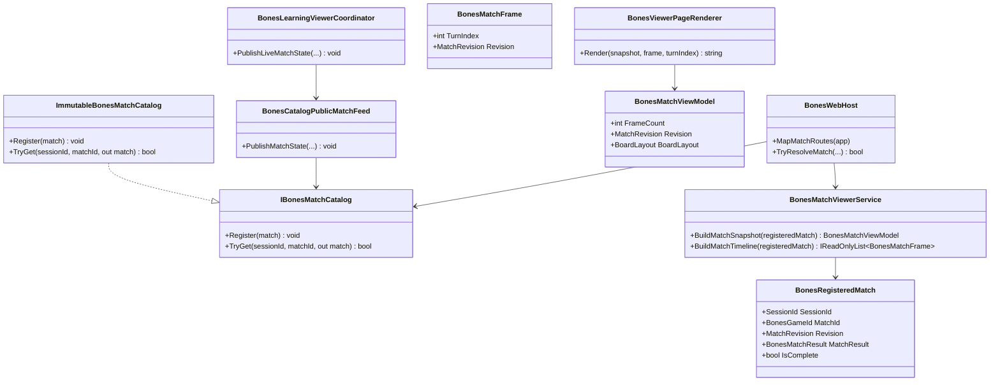

# WIP Bones Match Viewer Sidebar Layout and Live-View Stability Requirements and Test Plan

> Scope: redesign the `Wip.Bones.Web` match viewer shell so player seats, match metadata, and replay controls live in a fixed sidebar while the domino board occupies the remaining viewport canvas; and harden match catalog reads so opening the viewer while the Bones host learning loop is running never yields torn transcripts, inconsistent `frameCount` vs frame payloads, or corrupted replay state.

---

## Functionality Worktree

### Verification Policy

- Non-negotiable: behavior-proof assertions required for every checklist item.
- Metadata-only assertions (CSS class presence, JSON key existence without semantic values) are supporting evidence only.
- Layout tests must prove DOM structure and computed geometry: board region width/height exceeds sidebar-constrained stacked layout baseline; sidebar contains all seat panels and scrubber; board chain remains inside the main canvas after resize.
- Stability tests must prove coherent reads under concurrent publish: snapshot `frameCount`, frame at turn *N*, and timeline length agree for a pinned revision; concurrent publish + HTTP read must not throw and must not return frames whose turn indices exceed the snapshot revision's `frameCount`.
- API tests must prove revision/version fields on snapshot and frame JSON and SPA/SSR behavior when revision advances during an open session.
- Host integration tests must open `/view` while the learning loop publishes live match state and assert scrubbing mid-match returns engine-equivalent frames without 404 or mixed-revision artifacts.

### Coverage Inputs

| Input | Value |
|---|---|
| CsProject | Wip.Bones.Web (with Wip.Bones.Web.Tests and Wip.Bones.Host.Tests; builds on prior viewer requirements) |
| AnalysisSource | Caller request + screenshots: current viewer stacks board, 2×2 seat grid, and controls vertically under `max-width: 1080px`; user wants sidebar for seats and everything below, full canvas for board; matches appear corrupted when viewing while host program runs — audit: `InMemoryBonesMatchCatalog` is an unsynchronized `Dictionary`; SPA bootstraps snapshot once then fetches frames independently while `PublishLiveMatchState` overwrites catalog entries each turn |
| MandatoryItems | Sidebar shell layout with full-canvas board; thread-safe immutable match catalog publishes; coherent snapshot/frame revision contract; SPA graceful handling of live revision advances; behavior-proof policy compliance |
| PlanType | requirements |
| OutputPath | harness/requirements/Wip.Bones.ViewerLayoutAndStability.md |
| OutputTitle | WIP Bones Match Viewer Sidebar Layout and Live-View Stability Requirements and Test Plan |

### Project Layout and Ownership

| Project | Role | Runtime proof gates |
|---|---|---|
| Wip.Bones.Web | `viewer.css`, `index.html`, `BonesViewerPageRenderer`, `viewer.js`, `IBonesMatchCatalog`, `BonesMatchViewModel`, `BonesWebHost` routes | DOM layout geometry; JSON revision fields; coherent read paths |
| Wip.Bones.Agents | `BonesLearningViewerCoordinator.PublishLiveMatchState` | Publishes immutable snapshots during play |
| Wip.Bones.Host | Shared singleton catalog + learning loop | Live-view integration while loop runs |
| Wip.Bones.Web.Tests | Unit, API, DOM, concurrent catalog tests | Trait-bound checklist compliance |
| Wip.Bones.Host.Tests | WebApplicationFactory live-feed tests | Viewer open + scrub during running loop |

### UI Layout Baseline (Caller Rules)

| Rule | Behavior |
|---|---|
| Shell | `#bones-viewer` uses a two-pane layout: **sidebar** + **main canvas** (CSS grid or flex) filling viewport below the page header |
| Sidebar contents | All four seat panels (stacked vertically or compact 2×2 within sidebar width), active-seat line, last-move line, winner/round-score chrome, replay label, scrubber, and turn output |
| Main canvas | `#bones-board` (left/right end pips + `#board-chain`) occupies all remaining horizontal and vertical space; no `max-width: 1080px` cap on the board region |
| Board scaling | Existing `--board-chain-scale` logic continues to fit the chain inside the **expanded** board container; `resize` listener recalculates against new canvas bounds |
| SSR/SPA parity | `BonesViewerPageRenderer` and `wwwroot/viewer/index.html` emit the same sidebar/main DOM structure and class hooks |
| Narrow viewports | Below a defined breakpoint (e.g. 768px), sidebar may stack above the board — board still uses full width; sidebar width is not forced onto desktop |

### Live-View Stability Baseline (Caller Rules)

| Rule | Behavior |
|---|---|
| Immutable publish | Each `Register` stores a **new** immutable `BonesRegisteredMatch`; never mutate a catalog entry after insertion |
| Thread-safe catalog | `IBonesMatchCatalog` read/write is safe under concurrent HTTP handlers and background learning-loop publish |
| Revision token | Each catalog entry exposes a monotonic `MatchRevision` (or equivalent) copied into snapshot and frame JSON |
| Coherent HTTP read | A single GET handler invocation captures one catalog entry reference and derives snapshot, timeline, and frame from that reference only |
| Frame bounds | Frame GET for turn *T* succeeds when `0 <= T < snapshotRevision.FrameCount`; returns 404 when *T* is out of range for the **current** revision (not a prior one) |
| SPA bootstrap | After initial snapshot load, scrubbing uses frame endpoint; if frame returns 404 or revision mismatch vs cached snapshot, SPA reloads snapshot (or clamps scrubber to valid range) instead of rendering empty/corrupt DOM |
| Live refresh (optional path) | When snapshot revision increases and user is pinned to latest turn, SPA may optionally advance scrubber max — must not mix board/hands from different revisions in one render |
| No torn transcript | Under concurrent publish stress test, timeline built from a captured revision has length equal to that revision's transcript length |

### Defect Baseline (Caller-Reported + Code Audit)

| Symptom | Observed cause |
|---|---|
| Board feels cramped; seats compete with chain | `.viewer { max-width: 1080px }` vertical stack: header → board → 2×2 `.hands` grid → metadata → scrubber (`viewer.css:20-24`, `index.html:15-27`) |
| Viewing during host run shows wrong/broken replay | `InMemoryBonesMatchCatalog` uses plain `Dictionary` without locking (`IBonesMatchCatalog.cs:21-34`); live loop calls `PublishLiveMatchState` every turn while viewer fetches snapshot once then individual frames (`viewer.js:541-580`) |
| Scrubber max vs frame mismatch | Snapshot `frameCount` captured at bootstrap; catalog overwrite can change transcript length before frame fetch completes |
| Prior layout requirements silent on shell | `Wip.Bones.ViewerVisualization.md` and successors focus on tile/board semantics, not viewport shell or catalog concurrency |

### Class Diagram

### Completeness Checklist

- [x] Introduce `MatchRevision` typed value (monotonic per session/match key) on `BonesRegisteredMatch`; increment on every `Register` for the same session/match pair [foundation for coherent reads]
- [x] Replace or wrap `InMemoryBonesMatchCatalog` with a thread-safe implementation that atomically swaps immutable `BonesRegisteredMatch` instances (e.g. `ConcurrentDictionary` + lock, or immutable map swap) [depends on revision type] [mandatory - thread-safe catalog]
- [x] Ensure `BonesCatalogPublicMatchFeed.PublishMatchState` and `BonesLearningViewerCoordinator.PublishLiveMatchState` always pass fully immutable `BonesMatchResult` graphs (no shared mutable list references after publish) [depends on thread-safe catalog] [mandatory - immutable publish]
- [x] Extend `BonesMatchViewModel` and `BonesMatchFrame` with `Revision`; populate from the captured `BonesRegisteredMatch` in `BonesMatchViewerService` [depends on revision type]
- [x] Expose `revision` on existing JSON routes (`GET .../matches/{matchId}`, `GET .../frames/{turnIndex}`) via camelCase serialization [depends on extended view models]
- [x] Refactor `BonesWebHost` match routes so each request captures one `BonesRegisteredMatch` reference and uses it for snapshot/timeline/frame derivation without re-reading mid-request [depends on thread-safe catalog] [mandatory - coherent HTTP read]
- [x] Restructure `wwwroot/viewer/index.html` and `BonesViewerPageRenderer` into `.viewer-shell` with `.viewer-sidebar` (seats + metadata + scrubber) and `.viewer-main` (board only) [depends on none] [mandatory - sidebar shell layout]
- [x] Update `viewer.css`: remove centered `max-width` constraint on the shell; sidebar fixed width (~20–24rem); `.viewer-main` flex-grow/min-height fills viewport; board chain scaling uses expanded main canvas bounds [depends on sidebar shell] [mandatory - full-canvas board]
- [x] Update `viewer.js` DOM selectors and render paths for relocated sidebar nodes; preserve existing board/hand/scrubber behavior [depends on sidebar shell]
- [x] Add SPA revision handling: on frame 404 or `frame.revision !== snapshot.revision`, reload snapshot and clamp/retry scrubber instead of leaving corrupt empty board/hands [depends on revision JSON and viewer.js] [mandatory - live-view stability]
- [x] Add `Wip.Bones.Web.Tests` coverage: concurrent catalog register/read stress, revision monotonicity, JSON revision fields, DOM sidebar/main geometry, board canvas larger than pre-change baseline, SSR/SPA structural parity [depends on all above] [mandatory - behavior proof]
- [x] Add `Wip.Bones.Host.Tests` coverage: open `/view` while loop publishes live state; scrub mid-match; assert frames remain coherent (no mixed-revision DOM, no unhandled 404 loop) [depends on host feed] [mandatory - host live-view proof]
- [x] Register this requirements document in `BehaviorProofComplianceRegistry` with owning `Wip.Bones.Web.Tests` checklist bindings [depends on tests]
- [x] Enforce absolute behavior-proof verification for every planned integration test [mandatory - behavior-proof policy]

### Checklist to Runtime-Proof Matrix

| Checklist Item | Primary Runtime Proof Path | Minimum Evidence |
|---|---|---|
| MatchRevision type | Unit construction + serialization | Revision increases on re-register; stable within one entry |
| Thread-safe catalog | Concurrent unit test (publish + TryGet loop) | No exceptions; TryGet always returns complete entry |
| Immutable publish | Unit test on feed/coordinator | Mutating source lists after publish does not change catalog entry |
| Extended view models | Viewer service unit tests | Snapshot/frame revision equals registered match revision |
| JSON revision fields | WebApplicationFactory GET | Response `revision` matches catalog entry |
| Coherent HTTP read | API test with mock catalog counting TryGet calls | Single TryGet per request; frame turn bounds enforced |
| Sidebar shell HTML | DOM query on `/view` | `.viewer-sidebar` contains `.hands`, scrubber; `.viewer-main` contains `#bones-board` |
| Full-canvas CSS | DOM geometry / computed style | `.viewer-main` width ≥ prior stacked board width at 1280px viewport |
| viewer.js relocation | Script + DOM integration | Scrubber input still loads frames; board resize still fires |
| SPA revision handling | JS driver or Playwright scrub during publish | No permanent empty board after revision advance |
| Web.Tests compliance | Aggregated gate | Trait-filtered tests per checklist row |
| Host live-view proof | BonesHostWebApplicationFactory | `/view` scrub during running loop succeeds |
| Compliance registry | Registry test | Document listed with bindings |
| Behavior-proof policy | Plan self-check | Every item has executable tests |

---

## Falsify Claims

| # | Claim | Evidence | Status | Reason |
|---|---|---|---|---|
| 1 | Current viewer stacks board, seats, and controls vertically | `WIP/Wip.Bones.Web/wwwroot/viewer/index.html:15-27`; `viewer.css:20-24` (`max-width: 1080px`) | Supported | No sidebar; `.hands` 2-column grid below board |
| 2 | Match catalog is in-memory and overwritten on each publish | `WIP/Wip.Bones.Web/Viewer/IBonesMatchCatalog.cs:21-34`; `BonesPublicMatchFeed.cs:28-33` | Supported | Dictionary `Register` replaces entry |
| 3 | Live match state is published every turn during agent play | `WIP/Wip.Bones.Agents/Play/BonesPlayMatchTool.cs:177-188` | Supported | `PublishLiveMatchState` inside move loop |
| 4 | SPA loads snapshot once then fetches frames per scrub | `WIP/Wip.Bones.Web/wwwroot/viewer/viewer.js:541-587` | Supported | `bootstrap()` snapshot fetch; scrubber calls `loadFrame` |
| 5 | Host shares singleton catalog between loop and viewer | `WIP/Wip.Bones.Host/BonesHostServiceCollectionExtensions.cs:114-118` | Supported | Same `matchCatalog` instance for feed and web |
| 6 | `BonesMatchResult` already immutable at record level | `WIP/Wip.Bones/Engine/BonesMatchTypes.cs:75-99` | Supported | `ImmutableArray`/`ImmutableDictionary` |
| 7 | Catalog implementation is not thread-safe today | `IBonesMatchCatalog.cs:23` (plain `Dictionary`) | Supported | No lock or concurrent collection |
| 8 | Existing DOM test infrastructure can assert layout regions | `WIP/Wip.Bones.Web.Tests/Viewer/BonesViewerPageTests.cs`; Playwright host pattern | Supported | AngleSharp/Playwright used for viewer DOM |

Zero Falsified rows.

---

## Test Plan

### `ImmutableBonesMatchCatalog` / `MatchRevision`

1. `ImmutableBonesMatchCatalog_GivenRepeatedRegisterSameMatch_ExpectedRevisionIncreasesMonotonically`
   *Assumption*: Each register for the same session/match key yields a strictly greater revision than the previous entry.

2. `ImmutableBonesMatchCatalog_GivenConcurrentRegisterAndTryGet_ExpectedNoExceptionsAndCompleteEntries`
   *Assumption*: Parallel publish and read loops never throw and always return a fully constructed `BonesRegisteredMatch`. [concurrency path]

3. `ImmutableBonesMatchCatalog_GivenRegisterThenMutateSourceTranscript_ExpectedCatalogEntryUnchanged`
   *Assumption*: Mutating a source list after publish does not alter the stored match result transcript length or event payloads.

### `BonesCatalogPublicMatchFeed` / `BonesLearningViewerCoordinator`

1. `BonesCatalogPublicMatchFeed_GivenPublishMatchState_ExpectedCatalogHoldsImmutableCopy`
   *Assumption*: After publish, replacing the caller's match result instance does not change what `TryGet` returns.

2. `BonesLearningViewerCoordinator_GivenPublishLiveMatchState_ExpectedRevisionExposedOnRegisteredMatch`
   *Assumption*: Live publish stores an entry whose revision is available to the viewer service.

### `BonesMatchViewerService` (revision extensions)

1. `BonesMatchViewerService_GivenRegisteredMatch_ExpectedSnapshotRevisionMatchesCatalogEntry`
   *Assumption*: `BuildMatchSnapshot` copies revision from the registered match into the view model.

2. `BonesMatchViewerService_GivenRegisteredMatch_ExpectedFrameRevisionMatchesCatalogEntry`
   *Assumption*: Every frame from `BuildMatchTimeline` carries the same revision as the source registered match.

3. `BonesMatchViewerService_GivenCapturedRevision_ExpectedTimelineLengthEqualsTranscriptLength`
   *Assumption*: Frame list length equals transcript event count for the captured revision — no partial/torn build.

### `BonesWebHost` JSON API (revision + bounds)

1. `BonesWebHost_GivenMatchSnapshotRequest_ExpectedJsonIncludesRevisionField`
   *Assumption*: GET match snapshot returns camelCase `revision` matching the catalog entry used to build the response.

2. `BonesWebHost_GivenFrameRequest_ExpectedJsonIncludesRevisionMatchingSnapshot`
   *Assumption*: GET frame at valid turn returns `revision` equal to snapshot for the same catalog capture.

3. `BonesWebHost_GivenFrameTurnOutOfRange_ExpectedNotFoundWithoutPartialPayload`
   *Assumption*: GET frame where turn index ≥ revision frame count returns 404 with no board/hand tile payload leakage. [negative path]

4. `BonesWebHost_GivenConcurrentPublishDuringRequest_ExpectedSingleCatalogCapturePerRequest`
   *Assumption*: Handler uses one consistent registered match per request so snapshot and frame data cannot mix revisions. [DI + HTTP path]

### `BonesViewerPageRenderer` / sidebar DOM

1. `BonesViewerPage_GivenSnapshotPayload_ExpectedSidebarContainsSeatsAndScrubber`
   *Assumption*: SSR `/view` HTML places `.hands` and `#replay-scrubber` inside `.viewer-sidebar`, not under `.viewer-main`.

2. `BonesViewerPage_GivenSnapshotPayload_ExpectedMainCanvasContainsBoardOnly`
   *Assumption*: `#bones-board` is a descendant of `.viewer-main` and not of `.viewer-sidebar`.

3. `BonesViewerPage_GivenWideViewport_ExpectedMainCanvasWidthExceedsStackedLayoutBaseline`
   *Assumption*: At 1280×720 viewport, computed `.viewer-main` width is greater than the legacy stacked board container width. [layout geometry proof]

4. `BonesViewerPage_GivenStaticSpaAssets_ExpectedIndexHtmlMatchesSidebarShellStructure`
   *Assumption*: Static `index.html` exposes the same sidebar/main class hooks as SSR output.

### `viewer.js` (revision handling + relocated nodes)

1. `BonesViewerScript_GivenFrame404OnScrub_ExpectedReloadsSnapshotAndRecoversBoard`
   *Assumption*: When frame fetch fails after a catalog revision advance, the SPA reloads snapshot and renders a coherent state instead of permanent empty board/hands.

2. `BonesViewerScript_GivenRevisionMismatch_ExpectedDoesNotMixSnapshotAndFramePayloads`
   *Assumption*: If frame revision differs from cached snapshot revision, the SPA refreshes snapshot before applying frame board/hands.

3. `BonesViewerScript_GivenSidebarLayout_ExpectedScrubberStillDrivesFrameLoad`
   *Assumption*: Relocated scrubber `input` events still invoke frame load and update turn label. [DI + HTTP path]

### `BonesHostFeedTests` / live-view integration

1. `BonesHostFeed_GivenRunningLoopAndOpenView_ExpectedScrubMidMatchReturnsCoherentFrames`
   *Assumption*: While the learning loop publishes live match state, GET frame at mid-turn returns board/hand JSON consistent with snapshot revision and engine replay.

2. `BonesHostFeed_GivenLivePublishAdvance_ExpectedSnapshotRevisionIncreasesWithout500`
   *Assumption*: Repeated snapshot GETs during an in-progress match return 200 with monotonically increasing revision, never server error.

### Compliance registry

1. `BehaviorProofComplianceRegistry_GivenViewerLayoutAndStabilityRequirements_ExpectedMapsChecklistRowsToWebTests`
   *Assumption*: Registry entry for this document binds each unchecked checklist row to at least one `[Trait("ChecklistItem", ...)]` test in `Wip.Bones.Web.Tests`.

### Absolute Behavior-Proof Compliance Gate

1. `BehaviorProofCompliance_GivenViewerLayoutAndStabilityRequirements_RequiresExecutableRuntimeProofForEachItem`
   *Assumption*: Canonical compliance test executes Trait-bound tests for every checklist row.

2. `BehaviorProofCompliance_GivenMetadataOnlyAssertions_RejectsPlanAsNonCompliant`
   *Assumption*: Metadata-only assertions are rejected as non-compliant planned integration tests.

---

*All assumptions verified by Falsify Claims. Zero Falsified rows.*
